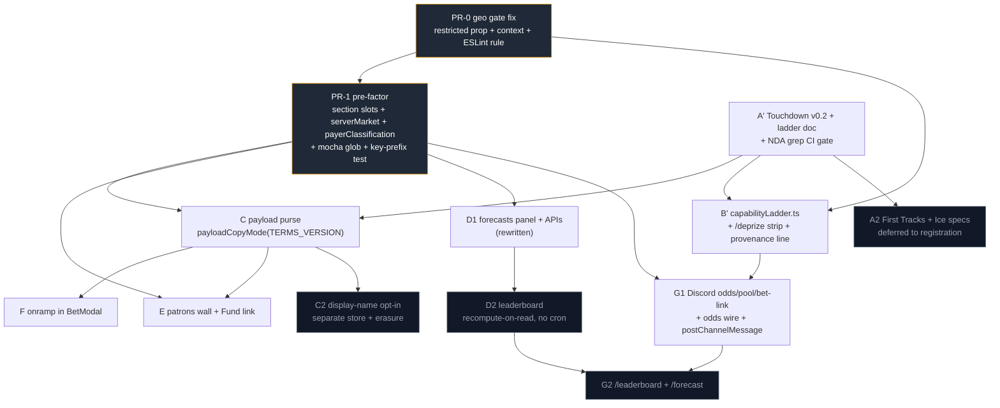

# DePrize Capability Ladder Rollout

## What changed in this revision

The first version of this plan described **seven parallel PRs**. Cross-PR architecture and per-PR
engineering, design and rubric reviews landed on 2026-09-16 and the shape is different:

1. **A PR-0 exists and comes first.** It fixes a live jurisdiction-disclosure defect that was wrong for
   52 jurisdictions, and it produces the corrected signal three other PRs must consume.
2. **A mechanical pre-factor PR-1 comes second.** Six of the PRs edit
   [`ui/pages/deprize/[id].tsx`](../../ui/pages/deprize/[id].tsx), two pairs edit the same JSX nodes, and
   two PRs create the same new file. PR-1 turns "edit the middle of a 1,000-line file" into "add one
   file and one line."
3. **Nothing is parallel in *merge*.** Only the pure-library and docs halves parallelize in
   *development*. The moment a PR touches `[id].tsx`, `BetModal.tsx`, `DePrizeIndexContent.tsx` or
   `.mocharc-deprize-unit.json`, it is sequential and should be planned as such.
4. **Four PRs split** (A → A′/A2, C → C/C2, D → D1/D2, G → G1/G2) and one cron is **dropped**
   (`forecast-score`).
5. **The old "Shared conventions for every agent" block is gone.** It stated policy with no rationale,
   was pasted verbatim into all seven PR docs including ones it did not bind, and it pre-settled the
   alternatives sections it appeared above. It now lives, with rationale and per-PR scope, in
   [`deprize-engineering-constraints.md`](deprize-engineering-constraints.md).

---

## Program shape

Nine merge units, then four gated follow-ups.

| Unit | One-line scope | Design doc |
|---|---|---|
| **PR-0** | Geo gate fix: correct `restricted`, ship it as a prop **and** a `useDePrizeRestricted()` context, add the ESLint rule that forbids re-deriving it, update the controls doc | [`pr-0-geo-gate-fix.md`](pr-0-geo-gate-fix.md) |
| **PR-1** | Section slots + `serverMarket.ts` + `payerClassification.ts` + widened mocha glob + Redis key-prefix registry. Zero behavior change | [`pr-1-page-slots-and-helpers.md`](pr-1-page-slots-and-helpers.md) |
| **A′** | Touchdown v0.2 addendum, `DEPRIZE_CAPABILITY_LADDER.md`, GTM §0 pointer, three CI gates, per-file freeze table. Docs only | [`pr-a-capability-specs.md`](pr-a-capability-specs.md) |
| **C** | Payload-purse copy behind `payloadCopyMode(DEPRIZE_TERMS_VERSION)`, proposed Terms 1.2, `payloadPurse.ts`, consent **boolean** only; defines the Prize pool slot | [`pr-c-payload-purse.md`](pr-c-payload-purse.md) |
| **F** | Add-funds CTA + Coinbase onramp return flow in `BetModal`, keyed off `restricted` | [`pr-f-onramp.md`](pr-f-onramp.md) |
| **E** | Patrons wall + Fund-the-prize text link inside C's Prize pool slot; records the Fund geo posture | [`pr-e-patrons.md`](pr-e-patrons.md) |
| **B′** | `capabilityLadder.ts` keyed on `sharedGoalId`, four-rung strip on `/deprize`, one provenance line on the detail page | [`pr-b-ladder-ui.md`](pr-b-ladder-ui.md) |
| **D1** | Forecast panel + `submit`/`mine`/`crowd` + `brier.ts`, after a design rewrite. No cron | [`pr-d-forecasts.md`](pr-d-forecasts.md) |
| **G1** | Discord interactions endpoint, `/odds` `/pool` `/bet`-link, **server-side** `postChannelMessage`, odds wire | [`pr-g-discord.md`](pr-g-discord.md) |

| Follow-up | Gated on |
|---|---|
| **D2** leaderboard | D1's rewritten data model, plus a stated sybil posture and a minimum-scored-prizes floor |
| **G2** `/leaderboard` + `/forecast` | D2's API |
| **A2** full First Tracks + Ice specs | A registered market, or a committed registration date |
| **C2** display-name opt-in | A named human moderator, a retention decision, and an erasure path |

---

## Merge order

**PR-0 → PR-1 → A′ → C → F → E → B′ → D1 → G1**, then **D2 → G2**, with **A2** and **C2** independent.

| # | Unit | Why here |
|---|---|---|
| 1 | PR-0 | Only unit fixing a live defect; smallest diff; changes the gate conditions four other PRs read. Merged late, every other PR's restricted-region verification is meaningless. |
| 2 | PR-1 | Must precede the first feature insertion or the extraction rebases through it. Preserves PR-0's conditions verbatim. |
| 3 | A′ | Docs only, zero code conflicts. Makes B′'s spec link resolve, gives C the canonical Test-4 wording, and lands the NDA-grep gate before B′ and G1 write spec copy. |
| 4 | C | Owns the header pool `Stat` and **defines** the Prize pool slot E later fills. `payloadCopyMode(DEPRIZE_TERMS_VERSION)` lets it merge in `'proposed'` mode without counsel — approval later is a one-constant edit, not a PR. Must precede F: both edit `BetModal.tsx` and C's terms step sits upstream of F's insufficient-funds branch. |
| 5 | F | Needs PR-0 (CTA + reopen keyed off `restricted`) and C (BetModal layout). Smallest, best-specified feature unit. |
| 6 | E | Needs PR-1 (`payerClassification`) and C (slot container). Independent of D and G — developable end-to-end while C and F are in review. |
| 7 | B′ | Needs A′ for a spec URL that resolves, and PR-0 because the index strip anchors to the block PR-0 rewrites. |
| 8 | D1 | Needs PR-0, PR-1 (`serverMarket.ts`) and its own design rewrite. Largest and least-specified — it must not block anything, which today it blocks G. |
| 9 | G1 | Needs `serverMarket.ts` (PR-1) and `capabilityLadder.ts` (B′). Adds `package.json` deps and a lockfile change — the churn you want last. **No dependency on D.** |

**Can start now** (pure modules and docs, no shared-file contact): A′; PR-1's helper half; C's Terms
drafts and `payloadPurse.ts`; E's `patrons-math.ts` and `patrons-query.ts`; F's `onrampReturn.ts`; G's
`verifyInteraction.ts` and `oddsWire.ts`; D's `brier.ts` and its design rewrite.

**Can merge now:** PR-0 only.

**Must be sequential in merge:** PR-0 → PR-1; C → F (BetModal); C → E (Prize pool slot); A′ → B′ (spec
URL); PR-1 → D1; D2 → G2.

---

## Engineering constraints

Do not restate constraints in a PR doc. Link to
[`deprize-engineering-constraints.md`](deprize-engineering-constraints.md) and name the constraint IDs
and scope tags that bind your PR — it carries `ui/`-and-Yarn-only, no Solidity, `evaluateEligibility`
purity, never gate sell/redeem/claim, IP hashing, the `*.local.md` and NDA rules with their `rg` gate,
Upstash Redis as a **standing decision** (with rationale, and with the explicit note that it does not
settle your data model), the auth/middleware pattern, the cron + `CRON_SECRET` + GitHub Actions
pattern, the test location and `yarn test:deprize`, and the rule that the corrected jurisdiction signal
is consumed rather than re-derived.

---

## Status

Each PR design doc now carries its own verdict. The table immediately below is **current** (read from
each doc's Status row after the 2026-09-16 revisions). Named human sign-offs and `*unassigned*` owner
slots remain merge blockers; they are approvals, not open design questions.

The sentence that previously closed this section — *"No unit below except PR-0 is cleared to start
implementing"* — applied to the first-pass critique table, not to these post-revision verdicts. It is
struck as a current instruction.

| Unit | Current verdict | From |
|---|---|---|
| **PR-0** | **Ready to implement** | [`pr-0-geo-gate-fix.md`](pr-0-geo-gate-fix.md). Context + ESLint `no-restricted-imports` under `pages/deprize/**` + `components/deprize/**` + `lib/deprize/**` (three globs; the context module carved out). Named sign-offs remain merge blockers. |
| **PR-1** | **Ready to implement** | [`pr-1-page-slots-and-helpers.md`](pr-1-page-slots-and-helpers.md). Named owner / frontend / compliance reviews remain merge blockers. |
| **A′** | **Ready for review** | [`pr-a-capability-specs.md`](pr-a-capability-specs.md). **A2 deferred** (gated). |
| **C** | **Ready** | [`pr-c-payload-purse.md`](pr-c-payload-purse.md). **C2 Blocked — do not start.** |
| **F** | **Ready** | [`pr-f-onramp.md`](pr-f-onramp.md) (revised 2026-09-16). |
| **E** | **Ready** | [`pr-e-patrons.md`](pr-e-patrons.md) (revised 2026-09-16). |
| **B′** | **Ready for review** (descoped) | [`pr-b-ladder-ui.md`](pr-b-ladder-ui.md). Stepper deferred; `capabilityLadder.ts` + index strip + one provenance line. |
| **D1** | **Ready** | [`pr-d-forecasts.md`](pr-d-forecasts.md). **D2 Blocked — do not start.** |
| **G1** | **Ready to implement** | [`pr-g-discord.md`](pr-g-discord.md). **G2 Blocked** (gated on D2). |

### Historical critique (2026-09-16 first pass) — what each unit had to change

Engineering verdicts from the eng critiques; design verdicts from
[`pr-design-docs-ux-critique.md`](pr-design-docs-ux-critique.md) §4. This table is the work the
revisions absorbed. It is **not** a current start/stop list.

| Unit | Engineering | Design | Must change before implementation |
|---|---|---|---|
| **PR-0** | **Ready** | — | Add the two mechanical pieces: the `useDePrizeRestricted()` context and the ESLint `no-restricted-imports` rule. The first-pass ask named two globs (`pages/deprize/**` + `components/deprize/**`); PR-0 revision 5 later widened that to three (`lib/deprize/**` added). Without them the fix is a one-time correction, not a property. |
| **PR-1** | New — this revision | New | Confirm PR-0 ships the context (open question 1 in its doc). Assign an owner. |
| **A** | **Needs revision + split** | Adequate | Split A′/A2. Lead each spec with a *Current rules (v0.2)* block and a *decided cases* table; demote version history. Capture the Test-4 planned-duration citation (URL + retrieval timestamp) in the market record **at open**. Own the canonical wording of every quoted resolution sentence so B/C/G reference rather than re-copy. Absorb B's `criteriaNotes` and `atlas.dataset.json` edits. |
| **B** | **Weak** | **Weak** | Descope hard. Move the ladder into `ui/lib/deprize/capabilityLadder.ts` keyed on `sharedGoalId` via `findDePrizeIdForGoal`, drop the `ladder?` field, and **stop editing `competitions.ts`** — this is the cheapest de-confliction in the program. Ship the strip on `/deprize` only; one provenance line on the detail page, no stepper, no `aria-current="step"`. Planned rungs are text with a status chip, not links. Delete the unreachable `'draft'` status. Specify chip contrast tokens (≥4.5:1 text, ≥3:1 border). |
| **C** | **Needs revision** | Adequate | Adopt `payloadCopyMode(DEPRIZE_TERMS_VERSION)` so the PR merges without counsel. Keep the stat label as plain fact (`Prize pool · to winner`) and move the 5%-destination disclosure into **one visible sentence** under the stats grid — a qualifier in a stat label is not a disclosure, and a `title` tooltip is not either. Split the display-name collection out to C2; keep the consent boolean. |
| **D** | **Do not start as written** | **Weak as specified** (strongest idea in the set) | Rewrite the design first. Rank on a **skill score against the 1/N baseline**, not raw Brier. Take `resolvedAt` from the payout report's **block timestamp**. Split the store shape (`RPUSH` history + separate `latest`). Namespace the season key by chain **and** environment. State a sybil posture. Split D1/D2. **Drop** `pages/api/cron/forecast-score.ts` and its workflow — this is a pure function over immutable inputs plus a cache, and deleting the writer-of-record removes four of the doc's own open risks. Panel takes unnormalized weights with a uniform 1/N default; `NumberStepper` + explicit Normalize, not sliders. Panel must render **for restricted visitors** and must not gate on `restricted`. |
| **E** | **Weak** | Adequate | Fund CTA out of the header, text link only — two money CTAs above the fold with different legal status, distinguished only by button fill, is the worst available arrangement. Patrons wall and payload explainer land together in C's single Prize pool slot. Consume `payerClassification.ts` from PR-1 rather than comparing addresses inline. Record the Fund geo posture in `docs/DEPRIZE_JURISDICTIONAL_CONTROLS.md` in the same PR, after PR-0. Keep the documented `MissionContributeModal` rejection. |
| **F** | **Weak** | Adequate | Design the failure half: abandoned flow, **partial arrival** (funds land below the typed amount — currently unmentioned and the worst state in the rollout), poll timeout at 2:01, wrong-chain delivery. Never prefill a monetary amount the user did not type. Key both the CTA and the `?onrampSuccess` reopen off `restricted`. Specify (and fund) the `Modal.tsx` focus fix, or state that focus is lost across the redirect and accept it. |
| **G** | **Weak** | Adequate | Split G1/G2. **The reuse plan does not work** — see program facts below; G1 owns a server-side `postChannelMessage`. `/odds` must not print fiction on a resolved prize, and the wire must stop posting on a resolved or superseded market. Convert the wire from a per-move alert to a rate-capped digest. Put `DEPRIZE_AVAILABILITY_LEGEND` in the footer of **every** DePrize embed. |

Two process failures applied to all seven original docs and had to be fixed in each: reviewers are listed
as **roles rather than people**, and the docs assert their own approval (Status "Ready") while answering
an unnamed, unlinked "independent review." Name approvers; state the ask; record sign-off durably.
Every alternatives section needs at least one rejection a competent engineer would have chosen, and
none of them may lean on the old constraints block to pre-settle the comparison. These remain merge
blockers on the named-people half; they are not a reason to treat the design verdicts above as Weak.

---

## Program facts that no single PR doc owns

### 1. PR-0 must ship enforcement, not just a fix

PR-0 corrects the jurisdiction signal, but D, E and F all need it, and `useRegionRestriction` is one
import away and **reads correct at the call site** — that is exactly how the 52-jurisdiction defect
shipped, silently, with no test that would catch it. So PR-0 additionally ships:

- a **context accessor** (`DePrizeRestrictionProvider` + `useDePrizeRestricted()`), which also converts
  five conflicting prop-list edits on `[id].tsx` into five independent hook calls; and
- an **ESLint `no-restricted-imports` rule** under `pages/deprize/**`, `components/deprize/**` and
  `lib/deprize/**` (the context module itself carved out) banning `useRegionRestriction`.

Each consumer still carries one assertion of its own, because the accessor guarantees the value is
right, not that the PR used it correctly (D: panel renders with `restricted={true}`; E: legend renders
and Fund never calls `evaluateEligibility`; F: CTA and `?onrampSuccess` reopen both suppressed).

### 2. PR-G cannot post from a cron through the existing Discord helper

[`ui/lib/discord/sendDiscordMessage.tsx`](../../ui/lib/discord/sendDiscordMessage.tsx) is a
**browser-only** helper: it `fetch`es the *relative* URL `/api/discord/send?type=networkNotifications`.
From a serverless cron there is no origin to resolve, and the channel is fixed by that `type` literal —
there is no channel parameter, so `DEPRIZE_ODDS_WIRE_CHANNEL_ID` cannot be targeted at all. PR-G's plan
to reuse it will fail at integration time.

**Required:** a server-side `ui/lib/discord/postChannelMessage.ts` taking `(channelId, { content,
embeds })` and calling the Discord REST API with `DISCORD_BOT_TOKEN` directly — not the internal API
route — with 429 handling and retry. **PR-G1 owns it.** `lib/deprize/complianceAlerts.ts` and any future
alerting want the same thing.

### 3. Ops precondition: branch from a clean tree

The working tree currently carries an **uncommitted ~66-line project-cycle diff in
[`ui/const/config.ts`](../../ui/const/config.ts)** (a new `'intake'` `ProjectCyclePhase`, a new
`enforceSubmissionDeadline` field, a budget basis changed from 5% of liquid non-MOONEY to 3% of AUM, and
`phase` flipped from `'senate'` to `'intake'`) plus roughly 37 other modified `ui/` files from an
unrelated workstream.

**Every DePrize branch must be cut from a clean `main`** — stash or commit that work first. Two failure
modes otherwise: a DePrize PR silently contains project-cycle hunks no DePrize reviewer will recognize,
in the same file that holds contract addresses; and when project-cycle lands, every DePrize branch that
touched `config.ts` rebases through that diff. Additionally: keep **server-only** DePrize env reads out
of `const/config.ts` entirely — read `process.env` in the API or cron module, as `CRON_SECRET` already
does. That removes D and G from that file's conflict set.

### 4. Frozen defaults registry — every row needs a person and a trigger

Per [C12](deprize-engineering-constraints.md). A `unassigned` owner is a **blocker on the PR that
carries the row**, not a placeholder to merge past. PRs that freeze a new value add their row here in
the same PR.

| Frozen value | Current default | Unit | Owner | Revisit trigger |
|---|---|---|---|---|
| First Tracks distance `N` | 10 m (and the spec has two sources of truth for it — fix to one) | A2 | *unassigned* | A rover operator publishes an odometry standard, or the roster's shortest credible traverse falls below `N` |
| Payload USD tiers (nameplate → data capsule → larger slot) | `describePayloadTier(poolUsd)` boundaries | C | *unassigned* | An operator quote lands, or the pool crosses a boundary in production |
| `DEPRIZE_TERMS_VERSION` / copy mode | `'proposed'` until counsel approves 1.2 | C | *unassigned* (needs the counsel-gate owner) | Counsel approves 1.2 — then a one-constant edit |
| Forecast season key | `FORECAST_SEASON = '2026'`, to be namespaced by chain **and** environment | D1/D2 | *unassigned* | 2026 ends; or a second chain/environment writes to the same key |
| Odds-wire move threshold | ≥ 5-point move vs last posted snapshot | G1 | *unassigned* | The wire posts more than the agreed digest cap in a day |
| Odds-wire cadence | every 10 min, to become a rate-capped digest | G1 | *unassigned* | Channel complaints, or a resolved/superseded market keeps posting |
| Section order on `/deprize/[id]` | UX review §6.3 order | PR-1 | *unassigned* | A feature PR argues its slot with user evidence |
| Forecast rate limit | 1 update per user per prize per 10 min | D1 | *unassigned* | A legitimate user hits it, or a sybil posture makes it the wrong lever |
| Public route cache TTL | 60 s on `crowd` | D1 | *unassigned* | Stale-next-to-live-odds becomes user-visible confusion |
| Bet cap | 1 ETH (existing, untouched) | — | existing owner | Out of scope for this program |

---

## Open decisions that no engineering choice can resolve

These are human calls. Each blocks something; none is blocked on code.

| Decision | Blocks | Needs |
|---|---|---|
| **Terms 1.2 approval** — the payload-purchase waterfall replacing "purse paid to the winning organization" | C's copy leaving `'proposed'` mode; A′'s canonical Test-4 wording being final | **Counsel.** This is the program's longest pole and currently has a *role* attached, not a person. Name the person. `payloadCopyMode` is what stops it blocking the *merge*. |
| **Night Shift declassification** — whether the 2028+ rung and its reasoning can be published | A′'s ladder doc content for rung 3 | Program owner + whoever holds the NDA relationships. Until then rung 3 is a name and a status chip. |
| **Fund-the-prize geo posture** — direct `pay` is new money into the pool, and the controls doc gates new participation | E, and the one-line product decision E must record in `docs/DEPRIZE_JURISDICTIONAL_CONTROLS.md` | Counsel, or an explicit product decision recorded as "geo-open until counsel says otherwise" with a named accepter. Design must not make Bet and Fund look interchangeable regardless of the answer. |
| **Payload tier boundaries** — what the pool actually buys at each size | C's explainer being true rather than illustrative | An operator quote. Until then the explainer must read as an estimate, not a price list. |
| **First Tracks `N`** | A2 | Product + whoever writes the spec; also needs the spec reduced to one source of truth for the number. |
| **A named moderator for payload display names**, plus retention period and erasure path | C2 | A person, not a rota. Merging name collection without this couples a copy change to a multi-year retention decision with no owner. |
| **A named sybil-posture accepter for the leaderboard** | D2 | Identity is a Privy `userId` obtainable with any email; the cheapest attack is *n* accounts keeping the best score. "Accepted, because the prize is a name on a wall" is a fine answer with a name on it. |

---

## Review artifacts

| Path | What it is |
|---|---|
| [`pr-program-architecture.md`](pr-program-architecture.md) | **Authoritative** for sequencing, splits, helper ownership, and the conflict matrix. Read first. |
| [`deprize-engineering-constraints.md`](deprize-engineering-constraints.md) | Standing constraints with rationale and per-PR scope. Replaces the old shared-conventions block. |
| [`design-doc-rubric.md`](design-doc-rubric.md) | The 20-criterion rubric the docs were judged against, plus the 10-minute reviewer's pass. |
| [`pr-design-docs-review.md`](pr-design-docs-review.md) | Rubric-level review across the doc set. |
| [`pr-design-docs-eng-critique-a-b.md`](pr-design-docs-eng-critique-a-b.md) · [`-c-d`](pr-design-docs-eng-critique-c-d.md) · [`-e`](pr-design-docs-eng-critique-e.md) · [`-f`](pr-design-docs-eng-critique-f.md) · [`-g`](pr-design-docs-eng-critique-g.md) | Per-PR engineering critiques. Code findings with file paths and line numbers live here — cite them from here rather than re-deriving. |
| [`pr-design-docs-ux-critique.md`](pr-design-docs-ux-critique.md) | Design/UX critique; §6.3 holds the authoritative section order for `/deprize/[id]`. |
| [`geo-gate-verification.md`](geo-gate-verification.md) | Verification notes for the jurisdiction gate defect PR-0 fixes. |

---

## Explicitly out of scope

Creator referral splits (a `DePrizeMint` change), on-chain registration of First Tracks/Ice, LMSR
whitelist, KYC, gating sell/redeem/claim, U.S. operation, G4 Safe migration, the `forecast-score` cron
(**dropped**, not deferred), the detail-page ladder stepper (**deferred** until a second rung is a real
market), and any Postgres introduction (see
[C7](deprize-engineering-constraints.md) for the standing decision and the condition that would reopen
it).
