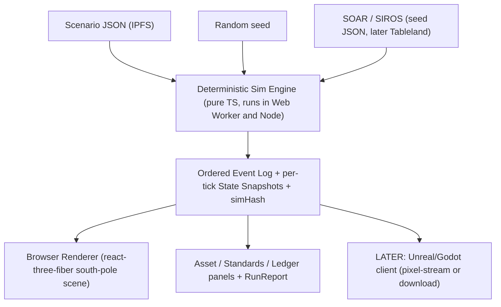
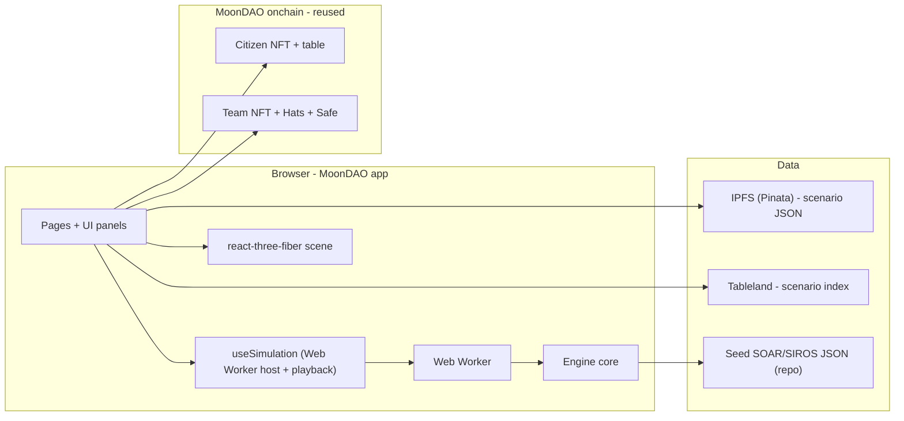
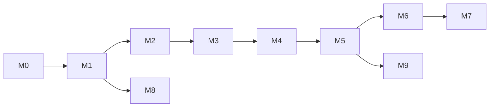

# MoonDAO Lunar Simulator (MoonSim) - Design and Build Plan

## 0. Summary

MoonSim is a browser-native lunar mission simulator embedded directly in the MoonDAO app (`ui/`, Next.js 13 Pages Router). It lets MoonDAO Citizens and Teams place lunar assets (rovers, an ISRU factory, resource deposits) on a south-pole lunar scene and run a deterministic, replayable simulation of the Campfire trustless-transaction model: peer-to-peer identity handshakes, credential and standards checks, counter-signed offline receipts, allowance-bounded offline risk, and cache-flush settlement during communication windows.

The architecture separates a pure, deterministic simulation engine (headless TypeScript) from the renderer (react-three-fiber in the browser). This boundary is the core design bet: the same scenario and event log can drive the in-app browser renderer today and an optional Unreal/Godot "cinematic" client later, without changing the engine.

The first release ("thesis demo") proves one end-to-end scenario: a Worker Rover that mines regolith and successfully sells it to a Factory because it holds the right credential, versus a Lurker Rover that is rejected because it does not. Scenarios are owned by a Citizen or Team, saved as JSON on IPFS, and indexed in Tableland - all reusing infrastructure MoonDAO already runs.

---

## 1. Goals and Non-Goals

### 1.1 Goals (first release)

- Let a user open a south-pole lunar scene inside the MoonDAO app, authenticated with their MoonDAO/Privy account.
- Let a user create and configure a scenario: place assets and a resource deposit, assign capabilities, supported standards, and credential "stamps".
- Run a deterministic, seeded discrete-time simulation that is fully replayable and reproducible (same inputs always produce the same event log and `simHash`).
- Faithfully model the Campfire interaction: identity handshake, SOAR registry lookup, SIROS standards match, credential check, counter-signed receipt, allowance decrement, comms-window cache flush, and settlement.
- Visualize the run in believable real-time 3D (real LOLA topography, low-angle south-pole lighting) with playback controls (play/pause, scrub, speed) plus side panels for assets, standards, and the transaction ledger.
- Let users bring their own asset models: upload web-renderable 3D files (GLB/OBJ/STL) that render in the scene (Tier 1), respecting private visibility.
- Produce a readable end-of-run report (accepted/rejected counts, regolith delivered, unsettled value, allowance remaining, rejection reasons).
- Persist scenarios as IPFS JSON, indexed in a Tableland table, owned by a Citizen or Team, with public/private visibility, and support fork.

### 1.2 Non-Goals (explicit)

- Not flight software; not authoritative navigation, landing-site certification, safety clearance, or operational approval.
- Not a replacement for QuickMap, Lunar Ledger, LOGIC, or NASA datasets - it interoperates conceptually, it does not duplicate them.
- Not physics-grade simulation; it is a coordination, education, and standards-testing tool.
- No real-money settlement in the first release (simulated credits only).
- Not everything onchain - only durable identifiers, ownership, and content hashes are eligible for onchain anchoring, and even those are deferred past the first release.
- No QuickMap frontend scraping; only public-domain LROC/LOLA static assets.

---

## 2. Source Alignment (foundations)

MoonSim synthesizes four bodies of work. Each maps to a concrete subsystem.

- Campfire (ICON / MoonDAO, "Trustless Transaction and Arbitration Framework"): the core interaction model. Robots and a factory identify each other, check cached registry data and credentials, determine standards compatibility, produce counter-signed local receipts, operate within an offline allowance, and reconcile when a comms window opens. This is the simulation engine's behavioral spec.
- LOGIC (JHU APL, Lunar Operating Guidelines for Infrastructure Consortium): standards-interoperability framing. Standards are first-class objects (power, comms, PNT, resource transfer, surveying, traffic). This shapes SIROS.
- Open Lunar / Lunar Ledger: a registry of lunar objects and activities. MoonSim does not duplicate it; SOAR keeps registry-style fields so future interchange is possible.
- QuickMap / LROC: the map and terrain reference. MoonSim uses public-domain LROC/LOLA imagery and elevation as static assets for the south-pole scene; it does not depend on QuickMap's live service.

---

## 3. Primary Users

- MoonDAO Citizens: explore scenarios, run simulations, learn lunar infrastructure concepts, contribute public scenarios.
- MoonDAO Teams: own assets and scenarios, demonstrate lunar-service concepts, propose funded work.
- Lunar operators (external, later): test interoperability scenarios while controlling what data is public vs private.
- Researchers / standards bodies (later): model standards, interfaces, exclusion zones, and coordination risk.
- Public users: view curated, read-only demo scenarios.

The first release targets Citizens and Teams inside the MoonDAO app.

---

## 4. System Architecture

### 4.1 The central decision: engine / renderer separation

The canonical artifact is a deterministic headless engine plus a scenario schema and an event log. Every renderer (browser 3D today, Unreal/Godot later) is a pure consumer of engine output.



Invariants that protect the boundary:

- The engine imports no React, no DOM, and no three.js. It is pure TypeScript so it runs both in a Web Worker (browser) and in Node (so Cypress can test it headless; Cypress is the only test runner in `ui/`, see [ui/cypress.config.js](ui/cypress.config.js)).
- All randomness flows through one seeded PRNG instance. Same scenario + seed + registry version => identical event log => stable `simHash`.
- The renderer never computes simulation state. It reads engine snapshots and interpolates between them for smooth playback and scrubbing.

### 4.2 Layered view



The seven conceptual layers:

1. Scene layer - south-pole 3D scene (react-three-fiber). Terrain from a LOLA south-pole DEM heightmap displaced mesh; basemap from an LROC/LOLA mosaic texture. Static public-domain assets in `ui/public/lunar-sim/`.
2. Scenario layer - versioned JSON, pinned to IPFS, indexed in Tableland.
3. SOAR (Space Object Asset Registry) - simulated assets. Seed JSON first; later a `SOARTable` Tableland contract mirroring `CitizenTable`.
4. SIROS (Standards for Interoperability and Robust Operations in Space) - standards. Seed JSON first; later a `SIROSTable`.
5. Credential layer - sim "stamps" as registry fields first; native mapping to Hats / Citizen / Team later; EAS only if justified later.
6. Engine - deterministic loop, behaviors, event types, report.
7. MoonDAO onchain layer - only durable identifiers (scenario index row owner, content hash, ownership) are eligible; added progressively after the first release.

### 4.3 Coordinate system

The simulation operates in a local East-North-Up (ENU) tangent plane in meters, centered on the scenario's area-of-interest (AOI) anchor (a lat/lon near the south pole). This avoids polar lat/lon distortion, keeps movement and distance math trivial, and maps directly to a flat 3D ground plane. Helper functions convert ENU meters to/from lat/lon for: (a) the optional "where on the Moon" context view, and (b) GeoJSON import/export. The reused whole-Moon globe ([ui/components/globe/Moon.tsx](ui/components/globe/Moon.tsx), [ui/components/globe/LazyMoon.tsx](ui/components/globe/LazyMoon.tsx)) is only a context thumbnail, never the sim playfield.

---

## 5. Simulation Engine

### 5.1 Model

Fixed-step discrete-time loop (default tick = 1 simulated second; `timeScale` controls wall-clock playback speed). Each asset is a state machine driven by a named `behaviorModule`. The first release ships three behaviors:

- `worker_rover_v1`: drive to deposit -> extract regolith to capacity -> drive to factory -> handshake -> sell -> repeat. Holds `CAN_SELL_REGOLITH` and supports the required standards.
- `lurker_rover_v1`: wander/mine opportunistically -> approach factory -> attempt to sell. Holds no valid stamp and/or lacks required standards.
- `isru_factory_v1`: stationary buyer. Accepts regolith only from counterparties that pass identity + standards + credential checks and only while it has buy allowance remaining.

### 5.2 The Campfire interaction (per encounter)

```mermaid
sequenceDiagram
  participant W as Worker Rover
  participant F as ISRU Factory
  participant L as Local Caches
  W->>W: drive to deposit, extract regolith
  W->>F: enter comms range, exchange wallet addresses
  W->>F: encrypted challenge (modeled asymmetric)
  F-->>W: challenge response (identity verified)
  F->>F: look up counterparty in cached SOAR
  F->>F: check SIROS standards + required stamps
  alt has CAN_SELL_REGOLITH and standards match and allowance remains
    F->>W: accept; both counter-sign receipt
    W->>L: append receipt; reduce sell-side offline allowance
    F->>L: append receipt; reduce buy-side allowance
  else missing stamp / standard mismatch / no allowance
    F-->>W: reject with explicit reason
  end
  Note over W,F: comms window opens -> flush caches -> settle receipts -> allowances refill
```

The cryptographic handshake is modeled deterministically (mock public keys and a deterministic challenge/response), not real ECC, in the first release. The data model leaves room to swap in real signatures later.

### 5.3 Event types (first release)

`AssetMoved`, `ResourceExtracted`, `HandshakeStarted`, `HandshakeSucceeded`, `HandshakeFailed`, `CredentialChecked`, `CredentialRejected`, `StandardMatched`, `StandardMismatch`, `TransactionProposed`, `TransactionSigned`, `TransactionRejected`, `AllowanceReduced`, `CommunicationWindowOpened`, `TransactionCacheFlushed`, `SettlementCompleted`.

Each event carries: `tick`, `type`, `actorAssetId`, optional `targetAssetId`, a typed `payload`, and a human-readable `message` (used directly by the Ledger panel and RunReport).

### 5.4 Inputs and outputs

- Inputs: scenario JSON, random seed, SOAR snapshot, SIROS snapshot, simulation parameters (duration, tick, comms-window schedule).
- Outputs: ordered event log; per-tick state snapshots (asset positions, cargo, allowance, caches); receipt ledger; end-of-run report (accepted/rejected transaction counts, regolith delivered kg, total unsettled value, allowance remaining per asset, rejection reasons grouped); and a `simHash` (stable hash of inputs + ordered event log) used for reproducibility and future onchain anchoring.

### 5.5 Determinism strategy

- Single seeded PRNG (small, dependency-free, e.g. mulberry32/xorshift) created from `scenario.seed`. No `Math.random`, no `Date.now`, no unordered iteration over object keys.
- Stable ordering: assets processed in a fixed sorted order each tick; encounters resolved by sorted asset-id pair.
- `simHash` computed from a canonical JSON serialization of inputs plus the event log. A Cypress headless test runs the engine twice and asserts identical `simHash`.

---

## 6. Rendering and Visual Fidelity

### 6.1 Renderer decision (locked): react-three-fiber

The product is rendered in-browser with `@react-three/fiber` + `@react-three/drei`, reusing the `three` already present transitively via `react-globe.gl` (add `@react-three/fiber`, `@react-three/drei`, and `three` as direct dependencies). R3F is the primary and default renderer for every reason that matters for the first release: it is already in the stack (one codebase, no second toolchain), runs client-side with zero GPU/streaming cost, is open-source (matches MoonDAO's ethos), and is more than capable of a convincing south-pole scene. The engine/renderer separation (section 4.1) makes this choice reversible: any future renderer consumes the same event log.

### 6.2 Target fidelity bar (first release)

The scene is genuinely 3D (orbit/pan/zoom of a real WebGL scene with elevation, shadows, and a low sun), targeting "believable real-time" - think well-made real-time 3D, not pre-rendered VFX:

- Real south-pole topography (from LOLA DEM), not hand-sculpted terrain.
- Harsh low-angle sun, long shadows, and dark permanently-shadowed regions - the most recognizable "this is the Moon" cue, cheap to achieve in three.js.
- Detailed GLB asset models (rovers, factory, deposit, beacon) with PBR materials.
- Interactive frame rate on a typical laptop and a fast first load (lazy-mounted scene, compressed assets).

Explicitly out of scope for the first release (deferred to the optional cinematic client): volumetric dust, ray-traced global illumination, ultra-dense regolith microdetail, heavy post-processing.

### 6.3 Scene composition

- Terrain: a ground mesh displaced by the south-pole DEM heightmap, textured with the LROC/LOLA basemap (see 6.4).
- Lighting: a single directional "sun" light at a low angle plus minimal ambient; shadow casting for the dramatic south-pole look.
- Assets: 3D models (GLB) or primitive fallbacks placed at ENU coordinates; labels, selection highlight, and path interpolation between engine snapshots.
- Overlays: comms-range rings, the active resource deposit, and transient handshake/transaction effects driven by event-log entries at the current tick.
- Mount strategy: follow the existing lazy-mount pattern in [ui/components/globe/LazyMoon.tsx](ui/components/globe/LazyMoon.tsx) (`next/dynamic` with `ssr: false` + IntersectionObserver) so the WebGL context is created only when visible and is not torn down on tab switches.
- The run page is added to `fullscreenPaths` in [ui/components/layout/Layout.tsx](ui/components/layout/Layout.tsx) so the scene can use the full viewport.

### 6.4 Environment and asset authoring pipeline

Two intentionally separate pipelines:

- Playable environment (default web sim): data-driven. The terrain is generated at runtime from real LOLA elevation + LROC imagery, kept georeferenced to the AOI anchor so it maps to the engine's ENU meters and is swappable per region. The lunar environment is NOT modeled by hand in Blender - hand-built terrain would be fiction and would not map to coordinates.
- Asset models: authored in Blender (or any DCC/CAD tool), exported to GLB, and brought in via the model-upload pipeline (6.6). Blender is also the right tool to clean up / decimate / retopologize CAD or photogrammetry, bake textures, generate LODs, and author a skybox.
- Optional cinematic "hero" terrain: a Blender-baked, high-detail, PBR-textured environment (DEM imported via BlenderGIS or heightmap displace, NASA CGI Moon Kit materials) is a legitimate beauty-pass for the cinematic client only (6.5) - not coordinate-bound, not interactive.

### 6.5 Optional cinematic client (later)

For high-impact, non-interactive showcases (trailers, partner pitches), an optional high-fidelity renderer can consume the same event log. Web-delivery realities:

- Godot (preferred): open-source (MIT), exports to WASM/WebGL so it runs in-tab with no streaming cost, relatively small builds, and may reuse prior Campfire prototype work.
- Unity: genuine WebGL export, embeddable in the Next.js app via `react-unity-webgl`, best artist tooling - but heavy bundles, closed-source, and a second toolchain. Justified only if MoonDAO already has Unity talent/assets.
- Unreal: best raw fidelity but no native web export (HTML5/WASM removed in UE 4.24); only deliverable via Pixel Streaming (GPU server per concurrent viewer). Reserve for one-off marquee moments where the GPU/ops cost is justified.

This is an explicitly deferred, swappable layer (milestone M8); it never changes simulation logic.

### 6.6 Asset model upload (CAD / 3D), tiered

Bringing user/team CAD or 3D models into the scene is a deliberate differentiator (QuickMap notably cannot import 3D models of future lunar assets). Format reality drives a tiered approach:

- Tier 1 (first release): accept web-renderable meshes - GLB/glTF (preferred), OBJ, STL. Pin to IPFS via the existing pin flow, reference by CID on the asset/class, render with drei `useGLTF` and a primitive-mesh fallback when a model is missing or oversized.
- Tier 2 (later, optional): accept true CAD (STEP/IGES) by tessellating to glTF via `occt-import-js` (OpenCascade WASM), client-side or server-side. Heavier and imperfect; isolated behind its own milestone.
- Tier 3 (later): full asset pipeline - Draco/meshopt compression, auto-LODs, thumbnails, stricter validation.

Cross-cutting concerns (apply from Tier 1):
- Size: enforce an upload size cap and compress (Draco/meshopt); CAD exports are often very large.
- IP / licensing: proprietary geometry is exactly the sensitive data Campfire worries about - model upload must respect the `private` visibility tier (and ideally encrypt private models later).
- Security: validate and sandbox uploaded geometry; never trust arbitrary blobs.
- Normalization: CAD units vary (mm vs m) - a per-model transform (scale/rotation/origin) is mandatory (see data model `modelTransform`).
- Engine impact: none. Models are pure render-layer data; the engine only consumes position/capabilities, so the engine/renderer split absorbs this cleanly.

---

## 7. MoonDAO-Native Integration (concrete reuse)

- Identity / ownership: a scenario's `ownerType` + `ownerTokenId` reference a real Citizen or Team token. Current user via `CitizenContext` ([ui/lib/citizen/CitizenProvider.tsx](ui/lib/citizen/CitizenProvider.tsx)); team membership via `useTeamWearer` and server fetch via `fetchTeamWithOwner` ([ui/lib/team/](ui/lib/team/)). Auth is the existing Privy -> thirdweb v5 bridge; no new auth.
- Persistence: pin scenario JSON via [ui/lib/ipfs/pinBlobOrFile.ts](ui/lib/ipfs/pinBlobOrFile.ts) -> `/api/ipfs/pin` (Pinata, Privy-gated). Index and discover via Tableland: `useTablelandQuery` client-side ([ui/lib/swr/useTablelandQuery.ts](ui/lib/swr/useTablelandQuery.ts)), `queryTable` server-side ([ui/lib/tableland/queryTable.ts](ui/lib/tableland/queryTable.ts)), and `waitForRowById` after writes ([ui/lib/tableland/waitForRow.ts](ui/lib/tableland/waitForRow.ts)). Sanitize input with `cleanData` ([ui/lib/tableland/cleanData.ts](ui/lib/tableland/cleanData.ts)).
- Routing / UX: pages under `pages/lunar-simulator/`; nav item added to [ui/lib/navigation/useNavigation.tsx](ui/lib/navigation/useNavigation.tsx) using a `MoonIcon`; pages wrapped in `Container` + `ContentLayout` + `Head`; built from existing `StandardButton`, `Modal`, `SectionCard`, `Tab`, `LoadingSpinner` in `components/layout/`.
- API: routes under `pages/api/lunar-sim/` wrapped with `withMiddleware(handler, rateLimit)` ([ui/middleware/withMiddleware.ts](ui/middleware/withMiddleware.ts)); mutating routes verify wallet ownership via `addressBelongsToPrivyUser` ([ui/lib/privy/](ui/lib/privy/)).
- Config: any new addresses/table names go in [ui/const/config.ts](ui/const/config.ts) following the existing `Index` (slug -> value) pattern; default chain via [ui/const/defaultChain.ts](ui/const/defaultChain.ts).

---

## 8. Data Model

```ts
type Visibility = 'public' | 'private'
type OwnerType = 'citizen' | 'team'

type ENU = { x: number; y: number } // meters, relative to AOI anchor

type Scenario = {
  id: string
  name: string
  description: string
  ownerType: OwnerType
  ownerTokenId: number
  createdByCitizenId?: number
  visibility: Visibility
  aoi: { body: 'Moon'; anchorLat: number; anchorLon: number; radiusM: number }
  durationSec: number
  tickSec: number
  timeScale: number
  seed: string
  assets: AssetPlacement[]
  resources: ResourceDeposit[]
  standardIds: string[]
  commsWindows: { startSec: number; endSec: number }[]
  registryVersion: { soar: string; siros: string }
  schemaVersion: number
}

type AssetPlacement = {
  id: string
  name: string
  class: string            // references a SOAR asset class
  ownerType: OwnerType
  ownerTokenId: number
  pubKey: string           // mock in first release
  pos: ENU
  mobility: { type: 'static' | 'wheeled'; maxSpeedMps: number }
  commsRangeM: number
  cargoCapacityKg: number
  supportedStandards: string[]  // SIROS ids
  stamps: string[]              // credential ids, e.g. CAN_SELL_REGOLITH
  allowance: { unit: 'credits'; maxOfflineRisk: number; remaining: number }
  behaviorModule: 'worker_rover_v1' | 'lurker_rover_v1' | 'isru_factory_v1'
  modelURI?: string                 // IPFS CID of a GLB/OBJ/STL model; falls back to a primitive
  modelTransform?: ModelTransform   // normalize CAD units/orientation/origin
  visibility: Visibility
}

type ModelTransform = {
  scaleToMeters: number             // e.g. 0.001 for a model authored in mm
  rotationEuler?: [number, number, number]
  originOffset?: [number, number, number]
}

type ResourceDeposit = {
  id: string; name: string; resourceType: 'regolith' | 'ice'
  pos: ENU; quantityKg: number; gradePct: number
}

type SirosStandard = {
  id: string; name: string; version: string; domain: string
  status: 'draft' | 'proposed' | 'adopted'
  applicableClasses: string[]; requiredStamps: string[]; refs?: string[]
}

type SoarAssetClass = {
  id: string; name: string; category: string
  defaultCapabilities: string[]; defaultStandards: string[]
  defaultModelURI?: string; defaultModelTransform?: ModelTransform
}

type Receipt = {
  id: string; scenarioId: string; tick: number
  sellerAssetId: string; buyerAssetId: string
  resourceType: 'regolith' | 'ice'; quantityKg: number
  price: number; currency: 'credits'
  sellerSig: string; buyerSig: string // mock signatures
  settlementStatus: 'pending_downlink' | 'settled' | 'disputed'
}

type SimEvent = {
  tick: number; type: string
  actorAssetId: string; targetAssetId?: string
  payload?: Record<string, unknown>; message: string
}

type RunReport = {
  simHash: string
  acceptedTx: number; rejectedTx: number
  regolithDeliveredKg: number; unsettledValue: number
  allowanceRemaining: Record<string, number>
  rejectionReasons: Record<string, number>
}
```

The Tableland scenario index stores lightweight, queryable fields only (id, name, owner, visibility, AOI anchor, IPFS CID, timestamps); the full scenario JSON lives on IPFS at that CID.

---

## 9. Persistence and Privacy

- Scenario JSON -> IPFS (Pinata) via the existing pin route; receive a CID.
- Scenario index row -> Tableland (first release: a lightweight index; later a dedicated `LunarScenarioTable` contract with NFT row-controller permissions mirroring `CitizenTable`). Until the contract exists, the index can be served from an app-owned Tableland table or a simple server route backed by IPFS + pinned manifest; the design keeps the read API identical so the storage backend can be swapped without touching the UI.
- Visibility: `public` scenarios are listed and viewable by anyone; `private` scenarios are visible only to the owner Citizen/Team (enforced server-side by ownership check). Selective disclosure (proving a stamp/standard/transaction without revealing all internals) is a later phase.
- Reproducibility: storing `seed` + `registryVersion` + `simHash` means any viewer can re-run and verify a scenario produces the recorded outcome.

---

## 10. Repository Layout (file plan)

- `ui/lib/lunar-sim/engine/` - pure TS engine: `prng.ts`, `types.ts`, `events.ts`, `behaviors/`, `loop.ts`, `report.ts`, `simHash.ts`. No React/DOM/three imports.
- `ui/lib/lunar-sim/` - `scenarioIO.ts` (IPFS pin/load), `tablelandIndex.ts`, `geo.ts` (ENU<->lat/lon + GeoJSON), `modelIO.ts` (model pin/validate/size-cap helpers), `seed/soar.json`, `seed/siros.json`, `seed/scenario.regolith-demo.json`.
- `ui/lib/lunar-sim/useSimulation.tsx` - Web Worker host + playback (play/pause/scrub/speed) over the event log + snapshots.
- `ui/lib/lunar-sim/sim.worker.ts` - Web Worker entry that runs the engine and posts snapshots/events.
- `ui/components/lunar-sim/` - `SimScene.tsx` (R3F), `SimSceneLazy.tsx` (lazy mount), `AssetModel.tsx` (GLB/OBJ/STL loader via `useGLTF` with primitive fallback), `Controls.tsx`, `AssetDrawer.tsx`, `LedgerPanel.tsx`, `StandardsPanel.tsx`, `ScenarioBuilder.tsx`, `ModelUpload.tsx`, `RunReport.tsx`, `NonAuthoritativeBanner.tsx`.
- `ui/pages/lunar-simulator/index.tsx` (list/landing), `new.tsx` (builder), `[scenarioId].tsx` (run view, `getServerSideProps` like [ui/pages/project/[tokenId].tsx](ui/pages/project/[tokenId].tsx)).
- `ui/pages/api/lunar-sim/` - `scenarios/index.ts` (list/create), `scenarios/[id].ts` (read/update/fork), `models/upload.ts` (validate + size-cap + pin GLB/OBJ/STL to IPFS), all ownership-checked and rate-limited.
- `ui/public/lunar-sim/` - `south-pole-dem.png` (heightmap), `south-pole-basemap.jpg` (texture), small attribution README.
- `ui/cypress/integration/unit/lunar-sim-*.cy.ts` - engine determinism + scenario-outcome tests.
- Later: `contracts/` - `LunarScenarioTable` / `SOARTable` / `SIROSTable` (mirror `CitizenTable`), with constants added to [ui/const/config.ts](ui/const/config.ts).

---

## 11. Milestones

Each milestone is independently demoable and leaves `main` shippable. Effort estimates assume one engineer and are rough.

### M0 - Foundations and types (est. 2-3 days)

- Objective: lock the contracts (types) and seed data so the engine and UI can be built in parallel.
- Deliverables:
  - `engine/types.ts` with all types from section 8; `engine/events.ts` enumerating event types and payloads.
  - `engine/prng.ts` (seeded, dependency-free) + a unit test proving same seed -> same sequence.
  - Seed data: `seed/soar.json` (asset classes: Regolith Excavator, ISRU Factory, Resource Deposit, Navigation Beacon), `seed/siros.json` (standards: REGOLITH_TRANSFER_1_0, LOCAL_HANDSHAKE_1_0, LOCAL_COMMS_1_0), `seed/scenario.regolith-demo.json` (the canonical demo).
  - `geo.ts` ENU<->lat/lon helpers with a round-trip test.
- Acceptance: types compile under `strict`; PRNG and geo tests pass headless in Cypress; seed JSON validates against the types.
- Dependencies: none.

### M1 - Deterministic engine (est. 5-7 days)

- Objective: a headless engine that runs the demo scenario to a stable event log.
- Deliverables:
  - `loop.ts` fixed-step scheduler; `behaviors/` for worker, lurker, factory; movement, extraction, range detection.
  - Handshake (modeled), SOAR lookup, SIROS standards match, credential check with explicit rejection reasons.
  - Counter-signed receipts, allowance decrement, comms-window cache flush, settlement; `report.ts` + `simHash.ts`.
  - Cypress headless tests: (a) determinism (two runs, identical `simHash`); (b) outcome (worker sells, lurker rejected with the right reason); (c) allowance/flush accounting balances.
- Acceptance: all engine tests green; engine has zero React/DOM/three imports (enforced by a lint/import check).
- Dependencies: M0.

### M2 - Worker host and playback (est. 2-3 days)

- Objective: drive the engine from the browser without blocking the UI thread.
- Deliverables: `sim.worker.ts` running the engine; `useSimulation.tsx` exposing `state`, `events`, `play/pause/seek(tick)/setSpeed`, and current snapshot; graceful handling of long runs (chunked posting).
- Acceptance: a throwaway dev harness page steps through ticks, scrubbing works, and the worker never freezes the main thread for a 72-hour-sim-second run.
- Dependencies: M1.

### M3 - Browser renderer (est. 5-7 days)

- Objective: the 3D south-pole scene reading engine snapshots.
- Deliverables: add R3F/drei/three deps; `SimScene.tsx` (DEM ground, basemap, low-angle sun + shadows, camera controls, asset meshes, labels, comms rings, path interpolation); `AssetModel.tsx` (Tier 1 GLB/OBJ/STL loading via `useGLTF` with a primitive fallback and `modelTransform` normalization); `SimSceneLazy.tsx`; ship `ui/public/lunar-sim/` DEM + basemap (public-domain LROC/LOLA) with attribution.
- Acceptance: scene meets the section 6.2 fidelity bar (real topography, south-pole lighting, GLB models) at interactive frame rate on a typical laptop with a fast first load; assets move smoothly between snapshots; lazy-mount + fullscreen confirmed; no SSR errors.
- Dependencies: M2; deps todo.

### M4 - Panels, controls, report, pages, nav (est. 5-7 days)

- Objective: the full in-app experience around the scene.
- Deliverables: `Controls`, `AssetDrawer`, `LedgerPanel`, `StandardsPanel`, `RunReport`, `NonAuthoritativeBanner`; `pages/lunar-simulator/index.tsx` and `[scenarioId].tsx`; nav item + `fullscreenPaths` entry; loads the seed demo scenario end-to-end.
- Acceptance: a user can open the demo, press play, watch the worker succeed and the lurker fail, scrub the timeline, inspect an asset, read the ledger, and see the final report - all inside the MoonDAO shell.
- Dependencies: M3.

### M5 - Scenario builder and persistence (est. 5-8 days)

- Objective: create/own/save/fork scenarios.
- Deliverables: `ScenarioBuilder` (place assets/deposit, assign standards/stamps, set seed/duration/comms windows); `ModelUpload` + `pages/api/lunar-sim/models/upload.ts` (Tier 1 GLB/OBJ/STL upload to IPFS with size cap, validation, and `private`-visibility respect); `pages/lunar-simulator/new.tsx`; `pages/api/lunar-sim/scenarios/*` (pin JSON to IPFS, write Tableland index, ownership + rate-limit); Citizen/Team ownership wiring; public/private visibility; fork.
- Acceptance: a Citizen or Team can build a scenario, upload a GLB asset model that renders in the scene, save it (CID + index row), reload it by id, fork it, and a non-owner cannot load a private scenario.
- Dependencies: M4.

### M6 (optional) - Native onchain upgrades (est. 2-3 weeks)

- Objective: move SOAR/SIROS/scenario index onchain with NFT row-controller permissions; back credentials with Hats.
- Deliverables: `SOARTable` / `SIROSTable` / `LunarScenarioTable` contracts mirroring `CitizenTable`; constants in [ui/const/config.ts](ui/const/config.ts); read/write helpers; map sim "stamps" to Hats roles / Citizen / Team where appropriate.
- Acceptance: registries are read from Tableland with no UI changes beyond the data source; row writes are gated by token ownership.
- Dependencies: M5; requires contract review/deploy.

### M7 (optional) - Governance and economics (est. 2-3 weeks)

- Objective: make scenarios governable and fundable.
- Deliverables: official scenario templates approved via governance; funded simulation-module bounties; optional real settlement rails (Safe / Juicebox / MOONEY) behind a clearly-isolated flag; competitions for Teams.
- Dependencies: M6.

### M8 (optional) - Cinematic client (est. 3-4 weeks, infra cost if Unreal)

- Objective: a high-fidelity renderer consuming the same event log, for trailers/pitches.
- Engine choice (see 6.5): Godot web export preferred (open-source, in-tab, no streaming cost); Unity via `react-unity-webgl` only if existing talent/assets; Unreal via Pixel Streaming reserved for one-off marquee use due to per-viewer GPU cost.
- Deliverables: an exporter of the event log to a renderer-friendly format; the chosen client; optional Blender-baked "hero" terrain (6.4). The engine boundary guarantees no rework of simulation logic.
- Dependencies: M1 (engine output) only; independent of M3-M7.

### M9 (optional) - CAD conversion, Tier 2 (est. 1-2 weeks)

- Objective: accept true CAD (STEP/IGES) by tessellating to glTF via `occt-import-js` (OpenCascade WASM), client- or server-side, plus Tier 3 polish (Draco/meshopt, LODs, thumbnails) as capacity allows.
- Acceptance: a STEP file uploads, converts, and renders with correct scale; conversion failures degrade gracefully to the primitive fallback.
- Dependencies: M5 (Tier 1 model upload).

### Critical path



First release = M0 through M5 (includes Tier 1 GLB/OBJ/STL model upload). M6+ are optional and sequenced after the thesis demo proves value.

---

## 12. Testing Strategy

- Engine: Cypress component/integration specs run headless in Node (`cypress/integration/unit/`), following the existing pure-logic test pattern (e.g. the vote-tally spec). Cover determinism (`simHash` stability), scenario outcome (worker accepted, lurker rejected with reason), and ledger/allowance accounting.
- UI smoke: extend `cypress/e2e/app.cy.ts` to visit `/lunar-simulator` and assert the page and demo scenario load (mirrors the existing `/launch` mission-data smoke test).
- Manual QA checklist per milestone tied to the acceptance criteria above.

---

## 13. Success Metrics (first release)

- A user can open and run the demo scenario in under 1 minute, and create a new scenario in under 10 minutes.
- The run clearly shows why the Worker succeeds and the Lurker fails.
- The run produces a readable event log and final report.
- Scenarios can be saved, reloaded, forked, and shared; at least one Team can own a scenario.
- Determinism holds: re-running a saved scenario reproduces its `simHash`.
- The engine can absorb new asset classes, standards, and behaviors without core rewrites.

---

## 14. Risks and Mitigations

- Data access: never scrape QuickMap; ship public-domain LROC/LOLA static assets with attribution.
- Authority confusion: persistent "non-authoritative simulation" banner; explicit non-goals in UI copy.
- Over-onchaining: keep large data and fast iteration offchain; anchor only hashes/ownership, and only from M6.
- Simulation validity: surface assumptions and simplifications in the UI; frame as coordination/education tooling.
- WebGL performance: lazy-mount, cap asset counts in the first release, interpolate snapshots rather than simulating in the render loop.
- Renderer lock-in: mitigated by the engine boundary; Unreal/Godot are swappable consumers.
- Tableland write latency: use `waitForRowById` polling after writes; show optimistic UI like existing flows.

---

## 15. Open Questions

- Default AOI: generic south-pole sandbox vs Shackleton-specific (affects which DEM tile ships).
- SOAR/SIROS governance: MoonDAO-managed, partner-managed, or open contribution with governance approval?
- When do real settlement rails (Safe/Juicebox/MOONEY) and EAS become worth the complexity?
- Cinematic client: is it wanted at all, and when? Renderer is R3F (locked) for the product; if a cinematic client is pursued, Godot web export is preferred (Unreal only via pixel-streaming for marquee use).
- Should the first release ship only the read-only demo (M0-M4) before opening the builder (M5)?

