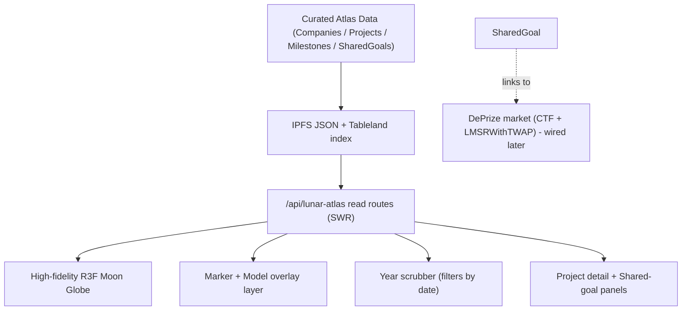
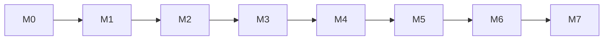

# MoonDAO Lunar Atlas - Design and Build Plan

## 0. Summary

Lunar Atlas is a browser-native, high-fidelity 3D Moon inside the MoonDAO app (`ui/`, Next.js 13 Pages Router). It is **not a simulator**. It is a living visualization of what humanity is actually planning to do on the Moon: real organizations' publicly-stated lunar programs - bases, landers, rovers, ISRU plants, comms/PNT relays - placed at their intended locations on an interactive lunar globe, with each project carrying a timeline of dated milestones.

A **year scrubber** lets anyone scrub across time and watch planned assets appear as their target dates arrive, turning scattered public roadmaps into one legible picture of the coming lunar economy.

Where multiple organizations are chasing the **same objective** (e.g. "first sustained crewed south-pole base," "first commercial ISRU oxygen"), the Atlas surfaces that as a **shared goal**. Shared goals are the bridge to competition: each one is designed to link to a **DePrize prediction market** (reusing MoonDAO's already-built Gnosis Conditional Tokens + `LMSRWithTWAP` stack) where the community bets on which organization delivers first, live odds emerge, and a prize pool grows for the winner. Market wiring is **designed-in now and connected later**; the first release ships the globe, curated plans, and timeline.

Authorship is **MoonDAO-curated**. MoonDAO places projects and defines shared goals based on organizations' public goals; Citizens and Teams explore, not edit. This keeps data quality high and avoids a public CAD/editor surface.

The name and framing align with NASA's Moon Base / LEIA (NextSTEP-3, [80GRC026R0008](https://sam.gov/opp/5a7fe1267f3a40b4a40ac4470149c61e/view)) vision of a cislunar industrial base - Lunar Atlas is the shared map of that build-out and, via DePrize, a market for accelerating it.

### 0.1 Relationship to prior work (PR #1405 / "MoonSim")

The previous direction (a deterministic Campfire trustless-transaction simulator) is **superseded**. From that work we **keep** the reusable foundation and **retire** the simulation-specific parts:

- **Keep / repurpose:** the react-three-fiber setup and lazy-mount/fullscreen page pattern; `three` + R3F/drei dependencies; the ENU/lat-lon geo helpers ([ui/lib/lunar-sim/geo.ts](ui/lib/lunar-sim/geo.ts)); the IPFS-pin + Tableland-index + ownership scaffolding ([ui/lib/lunar-sim/server/ownership.ts](ui/lib/lunar-sim/server/ownership.ts)); nav + `fullscreenPaths` wiring.
- **Retire:** the deterministic engine (PRNG tick loop, behaviors, handshake/credential/standards checks, receipts, allowance, comms-window settlement, `simHash`), the SOAR/SIROS seed registries, the playback host, and the sim panels (Ledger/Standards/RunReport). SOAR/SIROS/Campfire concepts are **not** part of Lunar Atlas.
- **Migration:** code moves from `ui/lib/lunar-sim/` and `ui/components/lunar-sim/` to `ui/lib/lunar-atlas/` and `ui/components/lunar-atlas/`; routes from `/lunar-simulator/*` to `/lunar-atlas/*`.

---

## 1. Goals and Non-Goals

### 1.1 Goals (first release)

- Render a genuinely impressive, high-fidelity **3D Moon globe** (better than the existing `/map` globe) that a user can spin, zoom, and drill into at the regional level, inside the MoonDAO app.
- Show real organizations' **publicly-stated lunar projects** as located items on the globe: markers/pins with rich info cards, and optional 3D models (bases, rovers, landers) placed at their coordinates.
- Represent each project's **timeline** and provide a global **year scrubber** that reveals/filters projects by their target dates.
- Seed with **NASA, SpaceX, and Blue Origin** public plans, each project **citing its public source** and clearly labeled as stated goals (not endorsements or guarantees).
- Handle plans that lack precise coordinates by placing them at their **stated target region** (e.g. south pole) with an explicit **"approximate location"** flag.
- Model **shared goals** (where organizations overlap) as first-class objects, with **link points to a DePrize market** built in but stubbed (no live betting in v1).
- MoonDAO-curated content pipeline: atlas data authored by MoonDAO, persisted via IPFS + Tableland, explorable (read-only) by everyone.

### 1.2 Non-Goals (explicit)

- Not a simulator; no physics, no autonomous-agent behavior, no trustless-transaction engine, no SOAR/SIROS.
- Not a public editor/CAD tool - Citizens/Teams do not place or edit projects in v1.
- Not authoritative or predictive of real outcomes; it visualizes **publicly-stated** plans and cites sources.
- No live prediction market in the first release - only the data model and link points (wired in a later milestone).
- Not real-money anything in v1.
- No scraping of paywalled/ToS-protected sources; only public, citable material and public-domain LROC/LOLA imagery.

---

## 2. Primary Users

- **MoonDAO (curator):** authors the atlas - adds organizations, projects, milestones, locations, sources, and defines shared goals. The only writer in v1.
- **Citizens / community:** explore the globe, scrub the timeline, read project details and sources, follow shared goals; later, bet in linked DePrize markets.
- **Teams / organizations (later):** may be represented as project owners and, later, submit their own plans for MoonDAO review.
- **Partners / researchers / press (later):** cite the Atlas as a shared picture of lunar activity; consume shared-goal markets.

---

## 3. System Architecture

### 3.1 Layers



- **Data layer:** curated JSON authored by MoonDAO, pinned to IPFS, indexed in Tableland (reuse existing `queryTable` / pin patterns). Source of truth for organizations, projects, milestones, and shared goals.
- **Render layer:** a high-fidelity react-three-fiber Moon globe with a marker/model overlay bound to project coordinates. Decoupled from data via a typed read API + SWR.
- **Time layer:** a year scrubber that filters/reveals projects and milestones by date; pure client-side derived state over the loaded dataset.
- **Market layer (designed now, wired later):** each `SharedGoal` carries optional link fields to a DePrize market (question id / registry entry). v1 renders a stub ("market coming soon"); a later milestone connects to the existing contracts.

### 3.2 Reuse of the existing DePrize / prediction stack

The repo already contains a working prediction-market system that fits shared goals exactly:

- **Market maker:** `prediction/contracts/LMSRWithTWAP.sol` (+ factory), on top of Gnosis **Conditional Tokens (CTF)**.
- **DePrize contracts:** `subscription-contracts/src/deprize/` - `DePrizeRegistry`, `DePrizeMint`, `DePrizeRedeem`, registry-aware `LaunchPadPayHook`.
- **UI precedents:** `ui/components/nance/DePrize.tsx`, `ui/pages/deprize-play.tsx`, `ui/const/abis/DePrizeRedeem.json`, `docs/DEPRIZE*.md`.
- **Mechanism fit:** bettors back competing providers toward a shared goal; live odds; Senate-declared winner; 5% of bets grows a prize pool the winner claims on delivery. For Lunar Atlas, the "providers" are the organizations pursuing a shared goal; "delivery" is achieving the objective. This is a **near drop-in** for shared-goal markets - the work is mapping a `SharedGoal` to a market's outcome set and resolution, not building a market from scratch.

### 3.3 Coordinate model

Projects are located by **lat/lon on the Moon**; the globe converts lat/lon to positions on the lunar sphere (reuse/adapt the geo helpers). A per-project `locationPrecision` field (`exact` | `approximate` | `region`) drives marker styling and an "approximate" badge. Regional drill-in focuses the camera on a lat/lon + radius without changing the data model.

---

## 4. Data Model

```ts
type SourceRef = { label: string; url: string; retrievedAt?: string }

type Organization = {
  id: string
  name: string                 // e.g. "NASA", "SpaceX", "Blue Origin"
  kind: 'agency' | 'company' | 'international' | 'consortium'
  country?: string
  logoURI?: string             // IPFS/public asset
  website?: string
  brandColor?: string          // for markers/legend
  summary: string              // stated lunar ambition, 1-3 sentences
  sources: SourceRef[]
}

type LatLon = { lat: number; lon: number }
type LocationPrecision = 'exact' | 'approximate' | 'region'

type ProjectType =
  | 'crewed_base' | 'habitat' | 'lander' | 'rover'
  | 'isru_plant' | 'power' | 'comms_pnt' | 'orbital' | 'other'

type Milestone = {
  id: string
  title: string                // e.g. "Artemis III crewed landing"
  targetDate: string           // ISO year or year-month; may be approximate
  datePrecision: 'year' | 'month' | 'day' | 'estimated'
  status: 'planned' | 'in_progress' | 'achieved' | 'delayed' | 'cancelled'
  sources: SourceRef[]
}

type Project = {
  id: string
  orgId: string                // -> Organization
  name: string                 // e.g. "Artemis Base Camp"
  type: ProjectType
  summary: string
  location?: LatLon            // omit if truly unplaced
  locationPrecision: LocationPrecision
  regionLabel?: string         // e.g. "Lunar south pole", used when approximate/region
  modelURI?: string            // optional GLB for on-surface 3D model
  modelTransform?: ModelTransform
  milestones: Milestone[]
  sharedGoalIds: string[]      // shared goals this project participates in
  sources: SourceRef[]
  visibility: 'public'         // v1: all curated content is public
}

type ModelTransform = {
  scaleToMeters: number
  rotationEuler?: [number, number, number]
  originOffset?: [number, number, number]
}

type SharedGoal = {
  id: string
  title: string                // e.g. "First sustained crewed south-pole base"
  description: string
  projectIds: string[]         // competing projects/orgs
  targetWindow?: { from?: string; to?: string }
  // DePrize link (designed now, wired later):
  market?: {
    status: 'none' | 'planned' | 'live' | 'resolved'
    deprizeQuestionId?: string   // CTF condition / question id
    deprizeRegistryId?: string   // DePrizeRegistry entry
    resolutionAuthority?: 'senate' | 'oracle'
  }
  sources: SourceRef[]
}

type AtlasDataset = {
  schemaVersion: number
  organizations: Organization[]
  projects: Project[]
  sharedGoals: SharedGoal[]
  updatedAt: string
}
```

The Tableland index stores lightweight rows (project id, org, type, lat/lon, precision, earliest/latest milestone date, IPFS CID) for fast querying; full detail lives in the IPFS-pinned `AtlasDataset` JSON.

---

## 5. The "Really Dope" Moon Globe (fidelity bar)

The existing `/map` Moon (`components/globe/Moon.tsx`, `react-globe.gl`) is explicitly the quality floor to beat. Lunar Atlas builds a bespoke R3F globe targeting a striking, premium look:

- **Textures:** high-resolution LROC/LOLA color mosaic as the albedo map, plus a **displacement/height** map and a derived **normal** map for real crater relief at the surface. Public-domain sources (LROC WAC, LOLA DEM); shipped as compressed assets in `ui/public/lunar-atlas/` with attribution.
- **Lighting:** a single strong directional "sun" with subtle ambient/hemisphere fill; crisp terminator, long shadows near the poles, no earthly atmosphere - reads unmistakably as the Moon in space.
- **Interaction:** smooth orbit/zoom (drei `OrbitControls`), inertial spin, and **region drill-in** (animated camera focus to a lat/lon + radius) for the south pole and other hotspots.
- **Space context:** starfield backdrop; optional subtle bloom on markers. Avoid heavy post-processing that tanks first paint.
- **Performance:** progressive texture loading (low-res first), capped DPR, lazy-mount (`next/dynamic` ssr:false + IntersectionObserver, per the existing pattern), fullscreen page. Interactive on a typical laptop; fast first paint.

Deferred beauty passes (later): normal-mapped micro-relief tiles for drill-in regions, LOD terrain patches, atmospheric-free volumetric shadows in PSRs.

---

## 6. Markers, Models, and Timeline

### 6.1 Marker + model layer

- Each located project renders a **marker/pin** anchored to its lat/lon on the sphere, colored by organization `brandColor`, iconized by `ProjectType`.
- Hover shows a compact label; click opens a **project detail panel** (summary, org, milestones, sources, shared goals, "approximate location" badge when relevant).
- Projects with `modelURI` render an **optional 3D model** (GLB via drei `useGLTF`) seated on the surface with `modelTransform` normalization; fall back to the marker when no model, oversized, or still loading.
- Clustering/decluttering when markers overlap at low zoom; expand on drill-in.

### 6.2 Year scrubber / timeline

- A global **year scrubber** (with play/pause auto-advance) sets a "current year."
- Projects/milestones **appear, activate, or dim** based on `targetDate` vs the scrubber: future items are ghosted, achieved items solid, delayed items flagged.
- The timeline is derived client-side from loaded milestones; scrubbing is instant (no refetch).
- A legend/filter lets users filter by organization, project type, and shared goal.

---

## 7. Shared Goals and DePrize (design now, wire later)

- MoonDAO defines a `SharedGoal` when multiple organizations target the same objective (data-driven from their real plans - the specific goals emerge from the seed data, not a fixed theme list).
- The globe highlights a shared goal by grouping its competing projects (e.g. connective styling, a goal panel listing contenders and their milestones).
- Each `SharedGoal.market` carries the **link points** to a DePrize market. In v1 the UI shows a stub ("Prediction market coming soon") and, if useful, a link to existing DePrize pages.
- **Later milestone (M6):** wire a shared goal to a real market by mapping its competing organizations to the market's outcomes, reusing `DePrizeRegistry` + CTF + `LMSRWithTWAP`; resolution via Senate (or an oracle) declares which organization achieved the goal; the prize pool funds/rewards the winner. No new market primitive is built unless the org-as-outcome mapping proves insufficient.

---

## 8. Repository Layout (file plan)

- `ui/lib/lunar-atlas/types.ts` - the data model (section 4). No React/three imports.
- `ui/lib/lunar-atlas/geo.ts` - lat/lon <-> globe-surface position helpers (adapted from the retired sim `geo.ts`).
- `ui/lib/lunar-atlas/seed/atlas.dataset.json` - curated NASA/SpaceX/Blue Origin seed data with sources.
- `ui/lib/lunar-atlas/useAtlasData.ts` - SWR loader over the read API.
- `ui/components/lunar-atlas/MoonGlobe.tsx` - the high-fidelity R3F globe.
- `ui/components/lunar-atlas/MoonGlobeLazy.tsx` - lazy/fullscreen mount.
- `ui/components/lunar-atlas/MarkerLayer.tsx`, `ProjectModel.tsx` (GLB + fallback), `ProjectPanel.tsx`, `TimelineScrubber.tsx`, `Legend.tsx`, `SharedGoalPanel.tsx`, `MarketStub.tsx`, `SourceBadge.tsx`.
- `ui/pages/lunar-atlas/index.tsx` (globe + overlays), `[projectId].tsx` (deep link to a project/region).
- `ui/pages/api/lunar-atlas/` - `dataset.ts` (read), and MoonDAO-curator write routes (`projects`, `shared-goals`) reusing IPFS pin + Tableland + ownership checks.
- `ui/public/lunar-atlas/` - LROC/LOLA color + displacement + normal maps, starfield, attribution README.
- `ui/cypress/integration/unit/lunar-atlas-*.cy.ts` - data-model + timeline-derivation + geo tests.
- Remove/retire: `ui/lib/lunar-sim/engine/*`, sim panels, sim pages, `sim.worker.ts`, `useSimulation.tsx`, SOAR/SIROS seed.

---

## 9. Milestones

Each milestone is independently demoable and leaves `main` shippable.

### M0 - Prune + scaffold (est. 1-2 days)
- Retire sim engine/Campfire/panels/pages (§0.1); create `lib/lunar-atlas/` + `components/lunar-atlas/`; port geo helpers; keep R3F/three deps; add data-model types + a tiny fixture dataset.
- Acceptance: app builds; old `/lunar-simulator` routes removed; types compile under `strict`; a geo round-trip test passes.

### M1 - High-fidelity Moon globe (est. 5-8 days)
- `MoonGlobe.tsx` with LROC/LOLA albedo + displacement + normal, sun lighting, starfield, orbit/zoom, region drill-in; lazy + fullscreen page; nav item + `fullscreenPaths`.
- Acceptance: visibly higher fidelity than `/map`; smooth on a typical laptop; fast first paint; south-pole drill-in works.

### M2 - Markers + project panel (est. 4-6 days)
- `MarkerLayer` bound to project lat/lon; hover labels; `ProjectPanel` with summary/milestones/sources; approximate-location badge; org/type legend + filter.
- Acceptance: seed projects appear at correct locations; clicking opens detail with cited sources.

### M3 - 3D models on surface (est. 3-5 days)
- `ProjectModel` (GLB via `useGLTF`) with transform normalization + marker fallback; a couple of representative models (e.g. a base, a rover).
- Acceptance: at least one project shows a 3D model seated on the terrain; graceful fallback otherwise.

### M4 - Timeline scrubber (est. 3-5 days)
- `TimelineScrubber` (year slider + play) revealing/dimming projects & milestones by date; filters compose with the legend.
- Acceptance: scrubbing across years visibly changes which plans are shown; achieved vs planned vs delayed styling is clear.

### M5 - Curated seed data + persistence (est. 4-6 days)
- Author NASA/SpaceX/Blue Origin datasets (projects, milestones, approximate locations, sources); IPFS pin + Tableland index; MoonDAO-curator write API (ownership-checked); read via SWR.
- Acceptance: the atlas loads real, sourced ABC content from IPFS/Tableland; a curator can add/update a project.

### M6 (later) - Shared-goal DePrize wiring (est. 2-3 weeks)
- Map a `SharedGoal` to a DePrize market (orgs as outcomes) reusing CTF + `LMSRWithTWAP` + `DePrizeRegistry`; live odds on the goal panel; Senate/oracle resolution; prize pool for the winner.
- Acceptance: one shared goal has a live market; bets place, odds move, resolution pays out; no changes to the visualization data model beyond the `market` link.

### M7 (later, optional) - Submissions + governance
- Let Teams/orgs submit plans for MoonDAO review; governance over which shared goals get markets; richer analytics.

### Critical path

First release = M0-M5 (globe + curated plans + timeline, no live markets). M6+ add DePrize markets and submissions.

---

## 10. Testing Strategy

- Data model + timeline derivation + geo placement: Cypress headless unit specs (same pattern as the existing `ui/cypress/integration/unit/` tests).
- UI smoke: visit `/lunar-atlas`, assert the globe mounts (ssr:false) and seed markers/timeline render.
- Manual QA per milestone tied to acceptance criteria; visual review of the globe fidelity bar.

---

## 11. Risks and Mitigations

- **Fidelity disappoints ("dope" bar):** invest early in real LROC/LOLA maps + lighting; review against `/map` before proceeding past M1.
- **Data accuracy / legal:** every project & milestone cites a public source; label as "publicly-stated goals," not endorsements; avoid paywalled/ToS-violating sources.
- **Location ambiguity:** explicit `locationPrecision` + "approximate" badges; region placement when coordinates are unknown.
- **Market/regulatory (DePrize):** deferred to M6 behind the existing DePrize legal/compliance framing; v1 has no live betting.
- **Performance:** progressive textures, capped DPR, lazy-mount, marker clustering.
- **Scope creep back into "simulator":** the engine is retired on purpose; Atlas is visualization + markets, not simulation.

---

## 12. Open Questions

- **Exact shared goals:** which real overlaps among NASA/SpaceX/Blue Origin become the first shared goal(s)? (Emerges from seed data - confirm during M5.)
- **First market:** which shared goal is the pilot DePrize market in M6, and who resolves it (Senate vs oracle)?
- **3D model sourcing:** where do GLB models of bases/rovers come from (commissioned, public-domain, org-provided)? Licensing?
- **Milestone data:** how much dated-milestone detail is publicly available and citable per org, and how often is it refreshed?
- **Globe assets:** which specific LROC/LOLA products (resolution, projection) to ship, and file-size budget?
- **Submissions (M7):** if/when orgs submit their own plans, what's the review + ownership model (Team NFT?)?
- **Naming/routes final:** confirm `/lunar-atlas` and "Lunar Atlas" for nav, SEO, and any redirects from the old `/lunar-simulator`.

