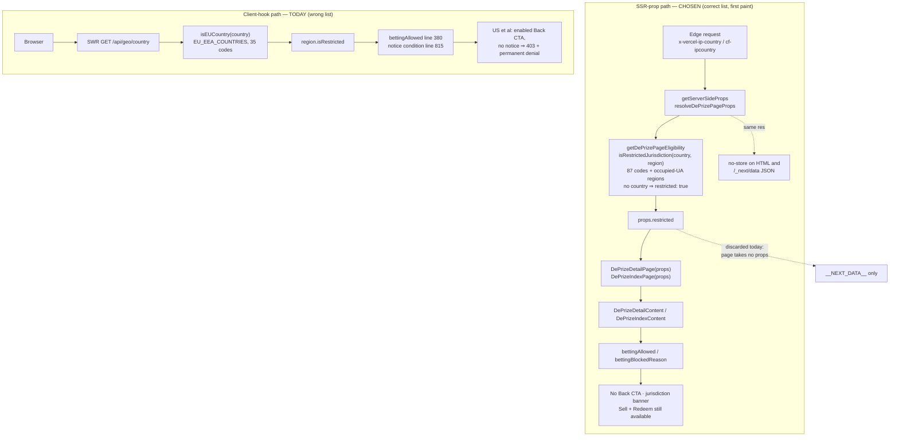

# PR-0 — Fix the DePrize geo gate: use the DePrize restricted list, not the EU/EEA list

- **Status:** **Ready to implement.** The design is settled; this is the program's first merge unit and
  nothing downstream is waiting on a further revision of it. Merge blockers are the named sign-offs
  only — the DePrize contract/compliance owner, the UI owner for `pages/deprize/*`, and the operations
  owner for `docs/DEPRIZE_JURISDICTIONAL_CONTROLS.md` (all required, listed below), plus counsel if any
  reviewer opens the copy question in [Cross-cutting constraints](#cross-cutting-constraints). None of
  those gates is a design question; each is an approval.
- **Authors:** DePrize hardening working group (drafted by Cursor agent from `.cursor/plans/geo-gate-verification.md`)
- **Reviewers:** DePrize contract/compliance owner (required), UI owner for `pages/deprize/*` (required), operations owner for `docs/DEPRIZE_JURISDICTIONAL_CONTROLS.md` (required), PR-D author (FYI — sequencing)
- **Last updated:** 2026-09-16
- **Supersedes / blocks:** blocks `.cursor/plans/pr-d-forecasts.md` step 7 (region-notice copy)
- **Evidence base:** `.cursor/plans/geo-gate-verification.md` — every line reference below is from that read-only verification and is treated here as established fact

---

## Summary

The DePrize client-side region gate reads the wrong list. Both DePrize surfaces gate on
`useRegionRestriction().isRestricted`, which `/api/geo/country` computes as an EU/EEA check
(`isEUCountry`, 35 codes) for GDPR purposes — not the DePrize Schedule A check
(`isRestrictedJurisdiction`, 87 codes). Because `EU_EEA_COUNTRIES ⊂ ALL_RESTRICTED`, the gate has no
false positives and **52 false negatives**: 52 restricted jurisdictions — the US and its territories,
the comprehensively sanctioned set, CA/AU/NZ/SG, and the local-licence list — are served a fully
enabled "Back this team" CTA and no region notice.

The correct value is already computed on the server and already sent to the browser. `getServerSideProps`
calls `resolveDePrizePageProps`, which returns `{ props: { restricted } }` from `isRestrictedJurisdiction`,
but `DePrizeDetailPage` declares no parameter list, so the prop is serialized into `__NEXT_DATA__` and
never read. `DePrizeRestrictedNotice.tsx` — the component built to render for those visitors — has no
importer anywhere in the repo.

This PR threads `props.restricted` into the two DePrize content components and uses it in place of
`region.isRestricted`. It changes gate *conditions*, not copy, not the restricted list, and not
eligibility semantics.

**Three deliverables ship together, and four downstream docs bind to them by name:** (a) the
`restricted` prop threaded into the two DePrize content components, which is what makes the first paint
correct; (b) a `useDePrizeRestricted()` React context, seeded from that prop, so that every descendant
of either DePrize surface reads one symbol instead of re-deriving a verdict; and (c) a **required**
ESLint `no-restricted-imports` rule scoped to `pages/deprize/**`, `components/deprize/**` and
`ui/lib/deprize/**` that turns re-derivation into a build failure. (b) and (c) are not conveniences.
They are the only reason the next
author does not reach for `useRegionRestriction`, which is one import away, reads correct at the call
site, and is precisely how the 52-jurisdiction defect shipped. See
[the context and the lint rule](#the-usedeprizerestricted-context-and-the-lint-rule).

**This is a disclosure/UX defect, not a compliance hole.** See [Severity](#severity) — no funds path is
open, and nobody in a restricted jurisdiction can place a bet today.

---

## Context

Three independent controls guard a DePrize bet, and all three use the correct list on server-derived
edge headers:

1. `/api/deprize/permit` runs `runEligibilityChecks` and returns **403 with no signature** for a
   restricted country (`permit.ts` 67–73). The wallet comes from the verified session, not the request
   body.
2. `DePrizeMint._verifyPermit` recovers the EIP-712 signature on-chain and reverts otherwise
   (`DePrizeMint.sol` 290–296); `bet()` calls it before any state change (201–203). Its NatSpec says
   outright: "the UI gate is not enough."
3. `BetModal` pre-checks `/api/deprize/eligibility` and disables Buy (client-side only, advisory).

What is missing is entirely in layer 3's neighbourhood: the *page* that decides whether to offer the
click. That decision is wired to the GDPR flag.

The two notions have been conflated because they share a word. `GDPR_REGIONS`
(`restrictedJurisdictions.ts` 88–123) is character-for-character the same membership as
`EU_EEA_COUNTRIES` (`lib/geo/index.ts` 43–79), and `GDPR_REGIONS` is one of six sets unioned into
`ALL_RESTRICTED` (148–155). So `isEUCountry(c) ⟹ isRestrictedJurisdiction(c)`, but not the converse —
and both booleans are named `restricted` at their respective boundaries.

---

## Problem statement

### Behavior today

Assumes a live tradable market (`bettingOpen`, `mintBound`, `stage === Running`) and production config
(`NEXT_PUBLIC_ENV=prod`, `DEPRIZE_ELIGIBILITY_BYPASS` unset).

| Visitor | SSR `restricted` prop | Page renders market UI? | Back CTA rendered/enabled? | Region notice? | First hard stop | Bet actually possible? |
|---|---|---|---|---|---|---|
| **US** (`x-vercel-ip-country: US`) | `true` — **discarded** | Yes, in full | **Yes, enabled** (`[id].tsx` 375–384 → `DePrizeTeamCard` 201) | **No** — line 815 tests `region.isRestricted`, false for US | Server: `/api/deprize/permit` 403 (`permit.ts` 67–73), after the advisory modal check | **No** |
| **EU** (`DE`, `GB`) | `true` — discarded | Yes | **No** — CTA not rendered at all | **Yes** (815–819) | Client, at the page; modal unreachable | No |
| **Unknown geo** (header absent, `XX`, `T1`) | `true` — discarded | Yes | **No** — but only via the separate `!!region.country` term, *not* `isRestricted` | **Yes** (815, `!region.country` branch) | Client, at the page | No — `evaluateEligibility` also returns `country-unknown` |

The same pattern holds on `/deprize`: `bettingBlockedReason` (`DePrizeIndexContent.tsx` 130–136) is
`undefined` for a US visitor, so the index banner is absent and `bettingOpenReal` is `true` in every
`RaceMarketCard` (255) and in `LiveDePrizeHero` (88–93).

Note the unknown-geo row: it fails closed **incidentally**, on a `!!region.country` term that is
independent of `isRestricted`. Any refactor must preserve that behavior deliberately rather than
inherit it (see [Hard constraints](#cross-cutting-constraints)).

### Concrete harm

1. **The page solicits a click it will refuse.** A US visitor sees a live, styled, clickable
   "Back this team". In the frameworks that motivated Schedule A, offering is itself the regulated act;
   "they could not complete it" is a weaker position than "they were never offered it". The only US-facing
   disclosure ahead of the modal is `DEPRIZE_AVAILABILITY_LEGEND` in small footer text
   (`[id].tsx` 946), not a gate.
2. **Accepting the invitation permanently denies the user's wallet.** Opening the modal calls
   `/api/deprize/eligibility`; `restricted-jurisdiction` is a permanent-denial reason
   (`shouldCreatePermanentDenial`, `walletObservations.ts` 51–55), so `runEligibility.ts` 81–93 calls
   `denyWallet` and fires a `wallet-denied` compliance alert. The UI gap converts "US visitor browses"
   into "wallet irreversibly denied, operator paged" — for a click the UI itself solicited. That wallet
   may later connect from a permitted jurisdiction and still be denied.
3. **It contradicts a signed-off operations record.** `docs/DEPRIZE_JURISDICTIONAL_CONTROLS.md` 44–46
   states that a listed country's pages "show the location notice." False today for 52 countries. That
   file is the production-open checklist, and its quarterly review (72–84) has no item that would catch
   this, so correcting it is in scope for this PR.
4. **The occupied-Ukraine region match has no client counterpart at all**
   (`restrictedJurisdictions.ts` 176–179).

### Severity

**Disclosure / UX defect — NOT a compliance hole. No funds path is open and this is not an incident.**
Every value-moving path is gated by `isRestrictedJurisdiction` on trusted edge headers, and the terminal
control (`_verifyPermit`) is on-chain and cannot be influenced by the browser. **No US person can place
a bet.** The only bypass is `isNonProdBypassEnabled()`, which requires both `NEXT_PUBLIC_ENV !== 'prod'`
and `DEPRIZE_ELIGIBILITY_BYPASS === '1'` (`eligibility.ts` 101–103).

Reviewers should read this as at the severe end of "disclosure defect" — solicitation surface, an
irreversible side effect on affected wallets, and a compliance doc that describes a control which was
built but never joined up — and should not read it as a loss of funds, an unauthorized bet, or a
reportable control failure.

---

## Goals

- The DePrize page and index gates read the DePrize restricted-jurisdiction verdict, not the EU flag.
- A restricted visitor sees an accurate, jurisdiction-aware banner and **no** Back CTA, on first paint,
  with no loading flash.
- Unknown or missing country stays restricted, by an explicit server decision rather than a side term.
- Sell and redeem stay fully available to existing holders in restricted jurisdictions.
- `docs/DEPRIZE_JURISDICTIONAL_CONTROLS.md` 44–46 describes what the code actually does.
- A regression test that would have caught a discarded prop.
- **Ship `useDePrizeRestricted()`** — one named accessor for the corrected verdict, seeded from the SSR
  prop, so PR-1's page, PR-D, PR-E and PR-F bind to a symbol rather than to a description.
- **Ship the ESLint `no-restricted-imports` rule** that makes the EU-vs-DePrize confusion mechanically
  impossible to repeat under `pages/deprize/**`, `components/deprize/**` and `ui/lib/deprize/**`, rather
  than discouraged by a comment.

## Non-goals

- No change to `evaluateEligibility`, `runEligibilityChecks`, `isRestrictedJurisdiction`, or any
  membership of the restricted sets.
- No change to `/api/geo/country`'s response shape or the meaning of its `restricted` field.
- No Solidity, no contract redeploy, no ABI change.
- No new legal copy. No new env vars, migrations, or feature flags.
- No change to demo-market behavior (`RaceMarketCard` 255–256 — demo markets never gate).
- Not the forecast panel (PR-D) and not a global rename of the geo module (see
  [Naming](#naming-so-this-cannot-recur)).

---

## Alternatives considered

### Option 1 — Thread the server prop into the content components  ✅ **chosen**

Give `DePrizeDetailPage` / `DePrizeIndexPage` their `DePrizePageProps` parameter and pass `restricted`
down to `DePrizeDetailContent` / `DePrizeIndexContent`, replacing `region.isRestricted`.

- **For:** The value already exists, is already correct, is already serialized to the client, and is
  computed from trusted edge headers including region (so the occupied-Ukraine match works for free).
  Available on first paint — no SWR round trip, no `isLoading` tri-state, no flash of an enabled CTA.
  Two-line join per surface. `RaceMarketCard` and `LiveDePrizeHero` need no edits because
  `bettingBlockedReason` already propagates to them.
- **Client-side navigation between prize pages:** safe, and worth stating because it is the obvious
  objection. In the Pages Router a `next/link` transition to another `/deprize/[id]` re-runs
  `getServerSideProps` server-side via `/_next/data/<buildId>/deprize/<id>.json`, carrying the same real
  edge geo headers, so `restricted` is recomputed per navigation rather than being a stale first-paint
  snapshot. `resolveDePrizePageProps` sets `Cache-Control`, `CDN-Cache-Control`, and
  `Vercel-CDN-Cache-Control` to `private, no-store` on that same `res` (`pageEligibility.ts` 23–31), so
  the data response is not CDN-cacheable either — a public HIT cannot leak an allowed-market payload to a
  restricted visitor. Shallow/query-only transitions (`?outcome=N`) do not re-run `getServerSideProps`,
  which is fine: geo cannot change within a shallow transition, and the deep-link handler is keyed off
  `bettingAllowed` anyway (411).
- **Against:** `restricted` is a single boolean, so the index loses its ability to distinguish
  "listed country" from "could not verify your region" in copy. See
  [Open questions](#risks-and-open-questions).

### Option 2 — Fix or extend `/api/geo/country`

Either add a DePrize-specific route or accept `?list=deprize` returning `isRestrictedJurisdiction`.

- **Other consumers of the EU flag: yes, and they constrain the fix.** The verification file already
  establishes that the EU semantics remain correct for the hook's original callers,
  `ui/pages/citizen/index.tsx` and `ui/pages/moonbase/index.tsx`, "which should be left alone"
  (verification §6). Confirmed while scoping this doc: `citizen/index.tsx` 26 and `moonbase/index.tsx`
  160 consume `useRegionRestriction().isRestricted` to gate permanent on-chain storage of personal data,
  `components/layout/CookieBanner.tsx` 26 fetches `/api/geo/country` directly, and `lib/geo/index.ts`
  91–93 is the server-side companion to the same flag. Widening `restricted` in place would silently
  start suppressing on-chain personal-data writes and the cookie banner for ~52 additional
  countries — a behavior change in a GDPR path, shipped inside a DePrize PR. `citizen/index.tsx` 19–20
  carries a comment about a previous incident where non-EU visitors were wrongly treated as restricted
  when this fetch failed, which is direct evidence that this route's semantics are load-bearing and
  fragile. Reviewers can reproduce the consumer list with:

```bash
rg -n "useRegionRestriction|/api/geo/country|isEUCountry|EU_EEA_COUNTRIES" ui/
```

- **Against, beyond that:** a new route adds a client round trip and a loading state to re-derive on the
  client what the server already knows, and — decisively — it does **not** fix the actual defect. The
  discarded `props.restricted` and the unimported `DePrizeRestrictedNotice` would still be dead. It
  would also leave two sources of geo truth for the same page.
- **Verdict:** rejected as the primary mechanism. A separate additive route stays available if a future
  purely-client surface needs the DePrize verdict without SSR.

### Option 3 — Middleware / edge gate

Do the geo check in `ui/middleware.ts`, which already matches `/deprize` and `/deprize/:path*` (19–25).

- **Against:** the matcher exists only for the pre-launch password gate (`isGatedPath` / `isSessionValid`,
  29–36), and that gate's vocabulary is redirect-or-allow. A geo redirect to an interstitial is exactly
  the dead end PR-D forbids — restricted visitors must reach the page body to submit a free forecast.
  The no-store discipline in `pageEligibility.ts` 23–31 is deliberately attached to the SSR response;
  duplicating those three headers at the edge creates two owners of cacheability for a
  country-specific page, which is how a CDN leak gets introduced. And the decision still has to reach
  React, so middleware would have to smuggle it in a header or cookie — a cookie in particular would
  outlive the visitor's geo and is strictly worse than a per-request prop.
- **Verdict:** rejected. Middleware remains a reasonable future home for a hard block (a DDoS-grade or
  sanctions-grade full denial), not for this disclosure fix.

### Decision

**Option 1.** It uses a correct value that already reaches the browser, is the smallest diff over the
hardening surfaces PRs #1579/#1581 established, removes rather than adds client state, strengthens the
unknown-geo case from incidental to explicit, and — unlike Option 2 — actually deletes the dead wiring
that caused this.

---

## Proposed design

Drop `useRegionRestriction` from both DePrize surfaces and make the SSR prop the single source of geo
truth for DePrize gating.



### Detail page (`ui/pages/deprize/[id].tsx`)

```tsx
export default function DePrizeDetailPage({ restricted }: DePrizePageProps) {
  return (
    <DePrizeRestrictedProvider restricted={restricted}>
      <DePrizeDetailContent restricted={restricted} />
    </DePrizeRestrictedProvider>
  )
}
```

The prop and the provider are both present on purpose: the prop is what the content component's own
gate computations read on first paint, and the provider is how descendants that the page does not
directly render reach the same value. See
[the context section](#the-usedeprizerestricted-context-and-the-lint-rule).

Inside `DePrizeDetailContent({ restricted }: DePrizePageProps)`:

- Delete the `useRegionRestriction` import (57) and call (195).
- `bettingAllowed` (375–384): replace the four hook terms (`!!region.country`, `!region.isRestricted`,
  `!region.isLoading`, `!region.isError`) with a single `!restricted`. The remaining terms
  (`bettingOpen`, `mintBound`, `mintConfigured`, `!tradingHalted`, `stage === Running`) are unchanged.
- Notice condition (815): `restricted` alone replaces
  `region.isRestricted || (!region.isLoading && !region.isError && !region.country)`.
- **Copy is unchanged.** The existing amber `Notice` string — "Betting isn't available in your region.
  You can view odds, cash out and claim." — is already accurate for restricted visitors and stays
  verbatim; `DePrizeAvailabilityLegend` / `DEPRIZE_AVAILABILITY_LEGEND` remains the legal text in the
  footer (946). This PR moves a condition, not words.
- The banner should render near the top of the market section rather than below it, so a restricted
  visitor reads it before scrolling the odds; keep it as the existing `Notice tone="amber"` component.

**Fail-closed on unknown is preserved and strengthened.** `getDePrizePageEligibility` returns
`{ restricted: true, country: null }` when the country header is absent (`pageEligibility.ts` 44–46), so
folding the four hook terms into `!restricted` does not weaken the unknown case — it replaces a term
that happened to catch it with a server decision that catches it by design, and it catches it on first
paint instead of after an SWR round trip. A dedicated test locks this in.

### Index (`ui/pages/deprize/index.tsx` + `ui/components/deprize/DePrizeIndexContent.tsx`)

Same thread-through into `bettingBlockedReason` (130–136), which already propagates to the index banner
(164–168), `LiveDePrizeHero` (259), and every `RaceMarketCard` (278, 307) — so those three files need no
edits. The `region.isLoading` → "Checking your region…" branch becomes dead and is removed. Demo-market
behavior at `RaceMarketCard` 255–256 is untouched.

### The `useDePrizeRestricted()` context and the lint rule

Threading the prop fixes the two surfaces that exist today. It does not stop the next surface from being
wrong, and four downstream PRs need the same verdict. So PR-0 also owns the two mechanisms those PRs
bind to. This is the program architecture review's recommendation and PR-0 accepts it: the alternative —
PR-1 landing the context "if PR-0 did not" — leaves the accessor's owner ambiguous at exactly the moment
D, E and F start writing against it.

**`useDePrizeRestricted()`.** A new `ui/lib/deprize/deprizeRestrictedContext.tsx` exporting a
`DePrizeRestrictedProvider` and the hook, written out by name here so that consumers bind to a symbol:

```tsx
const DePrizeRestrictedContext = createContext<boolean | null>(null)

export function DePrizeRestrictedProvider({
  restricted,
  children,
}: {
  restricted: boolean
  children: ReactNode
}) {
  return (
    <DePrizeRestrictedContext.Provider value={restricted}>
      {children}
    </DePrizeRestrictedContext.Provider>
  )
}

export function useDePrizeRestricted(): boolean {
  const value = useContext(DePrizeRestrictedContext)
  if (value === null) {
    throw new Error('useDePrizeRestricted must be used inside DePrizeRestrictedProvider')
  }
  return value
}
```

- **Where it mounts.** In the two page components that receive `DePrizePageProps` — `DePrizeDetailPage`
  in `ui/pages/deprize/[id].tsx` and `DePrizeIndexPage` in `ui/pages/deprize/index.tsx` — each wrapping
  its content component. That covers both `/deprize` and `/deprize/[id]`, including every descendant a
  future PR adds under either, with no further mount work.
- **Not in `_app.tsx`.** Pages outside `/deprize` have no `restricted` prop, so an app-level provider
  would seed itself from `undefined` and hand descendants a value that reads as "not restricted" — the
  original defect with a new import path. The provider exists exactly where the prop exists.
- **It never fetches.** No SWR, no `useEffect`, no `/api/geo/country`, no client-side derivation of any
  kind. It is a carrier for the SSR value and nothing else, which is what preserves Option 1's first-paint
  property: there is no loading state to flash and no second source of geo truth.
- **The hook throws outside a provider rather than defaulting to `false`.** A default would fail open on
  a mounting mistake, and failing open is the defect class this PR exists to close.
- **It does not replace the prop.** Both coexist, with different jobs: the prop is what the content
  components' gate computations read (one value, first paint, no indirection), and the context is how
  descendants consume that same value without a prop-list edit per PR. The context is seeded *from* the
  prop; there is still exactly one origin, `getDePrizePageEligibility`.

**The ESLint `no-restricted-imports` rule — required, not optional.** An override in `ui/.eslintrc.json`
scoped to the three DePrize path globs (the config paths are relative to `ui/`, so `lib/deprize/**` is
the same directory this doc calls `ui/lib/deprize/**`):

```json
{
  "overrides": [
    {
      "files": ["pages/deprize/**", "components/deprize/**", "lib/deprize/**"],
      "excludedFiles": ["lib/deprize/deprizeRestrictedContext.tsx"],
      "rules": {
        "no-restricted-imports": ["error", {
          "paths": [{
            "name": "@/lib/geo/useRegionRestriction",
            "message": "useRegionRestriction is the EU/EEA GDPR flag (35 codes). DePrize gating needs the Schedule A verdict (87 codes): use the `restricted` prop from DePrizePageProps, or useDePrizeRestricted() from @/lib/deprize/deprizeRestrictedContext."
          }]
        }]
      }
    }
  ]
}
```

**Why `ui/lib/deprize/**` is in scope.** Without it, a helper in `ui/lib/deprize/` could import the EU
flag and re-export a wrong verdict into DePrize components without tripping the rule — the original
defect exactly, one indirection deeper, and with the laundering done in a file no compliance reviewer is
watching. A ban that stops at the component boundary bans the symbol, not the mistake.

**The one carve-out.** `ui/lib/deprize/deprizeRestrictedContext.tsx` is exempt, because it is the module
that defines the corrected signal and is the intended single source every other DePrize file reads. The
exemption is by exact filename, not a directory glob: any *other* module under `ui/lib/deprize/` that
wants to wrap the signal must consume `useDePrizeRestricted()` like everyone else. Widening this carve-out
to a second file is a design change that needs the compliance owner, not a lint tweak.

The rule is what makes the guarantee **mechanical rather than conventional.** A JSDoc warning and a
sentence in seven design docs are both read-once artifacts; the failure they are meant to prevent is a
call site that looks correct, written by someone who never opened either. Lint runs on every PR. Cover
the barrel path as well as the direct one if `@/lib/geo` re-exports the hook — a ban the import graph can
route around is not a ban.

### `DePrizeRestrictedNotice.tsx`

**Delete it.** It is unimported dead code, and mounting it as-is would replace the page with its own
`Head` + `Container` shell — blanking the market UI and the forecast panel PR-D needs, which is the
opposite of the intended outcome. Its purpose is served by the in-page banner. Reviewers who prefer to
keep it for a future hard-block surface should say so; if kept, it must be reduced to an inline banner
variant without the page shell so it can never blank a page.

### Documentation

Correct `docs/DEPRIZE_JURISDICTIONAL_CONTROLS.md` 43–46 so both rows describe the in-page banner plus a
withheld Back CTA — i.e. the control that this PR actually wires — rather than a full-page "location
notice", and add an item to the quarterly review (72–84) that checks a `US` header against a live prize
page.

---

## Implementation plan

1. Add the failing tests first (see [Testing](#testing)): the set-relationship assertion, the
   `restricted`-true render assertion, the context assertions, and the lint-rule assertions. They fail
   against `main`, which demonstrates the gap.
2. Add `ui/lib/deprize/deprizeRestrictedContext.tsx` — `DePrizeRestrictedProvider` and
   `useDePrizeRestricted()`. No fetch, no effect; the hook throws outside a provider.
3. `ui/pages/deprize/[id].tsx` — accept `DePrizePageProps` in `DePrizeDetailPage`, wrap
   `DePrizeDetailContent` in `DePrizeRestrictedProvider`, pass `restricted` to it, thread it through the
   component signature.
4. Same file — rewrite `bettingAllowed` (375–384) and the notice condition (815); remove the
   `useRegionRestriction` import and call; move the banner above the market section.
5. `ui/pages/deprize/index.tsx` — accept `restricted`, mount `DePrizeRestrictedProvider`, and pass the
   prop to `DePrizeIndexContent`.
6. `ui/components/deprize/DePrizeIndexContent.tsx` — `bettingBlockedReason` from `restricted`; drop the
   hook and the loading branch.
7. **Before adding the rule, grep the three globs for files that already violate it** —
   `rg -n "useRegionRestriction" ui/pages/deprize ui/components/deprize ui/lib/deprize`. The new
   `ui/lib/deprize/**` glob is the one at risk here: an existing helper importing the banned hook makes
   the rule fail the moment it lands. For each hit, either migrate it in this PR to the `restricted`
   prop / `useDePrizeRestricted()`, or record it in this doc as a named, justified exception with an
   owner and a removal condition. **A blanket `eslint-disable` added to make the build pass is not an
   option** — it reproduces the defect and hides it behind a green check.
8. Add the `no-restricted-imports` override to `ui/.eslintrc.json` for `pages/deprize/**`,
   `components/deprize/**` and `lib/deprize/**`, with `lib/deprize/deprizeRestrictedContext.tsx` in
   `excludedFiles` and the message pointing at `useDePrizeRestricted()`. Confirm under `yarn lint` that
   it is an `error`, not a warning, and that it fires on a scratch import before the scratch file is
   deleted — place one scratch import under `ui/lib/deprize/` specifically, so the widened glob is
   verified rather than assumed.
9. Delete `ui/components/deprize/DePrizeRestrictedNotice.tsx` (or reduce it to an inline variant per
   review).
10. Add the JSDoc warning on `useRegionRestriction`'s return type: EU/GDPR only, never for DePrize
    gating, with a pointer to `getDePrizePageEligibility` and `useDePrizeRestricted()`.
11. Update `docs/DEPRIZE_JURISDICTIONAL_CONTROLS.md` 43–46 and the quarterly-review list.
12. `yarn lint`, `yarn test:deprize`, `yarn test:cypress-unit`; manual header-override pass (US, DE, no
    header) on a preview deployment.

Touched files: two pages, one content component, one new context module, one ESLint config, one
deletion, one hook doc comment, one markdown doc, plus tests. No API route, no change to any eligibility
logic, no Solidity.

### Naming, so this cannot recur

Rename the two notions apart: `isEuPersonalDataRegion` for the GDPR flag (`isEUCountry` and the
`restricted` field of `/api/geo/country`), `isDePrizeRestricted` for the Schedule A verdict.

**Scope: partially in this PR.** In scope — the new local names introduced on the DePrize surfaces
(`restricted` from `DePrizePageProps`, read as the DePrize verdict), `useDePrizeRestricted()` as the one
named accessor for that verdict, the JSDoc warning on `useRegionRestriction`, and the ESLint rule below.
Out of scope — renaming `isEUCountry`, the API field, and the hook's
`isRestricted`, because that reaches `citizen/index.tsx`, `moonbase/index.tsx`, `CookieBanner.tsx`,
`lib/geo/index.ts` 91–93, and the cookie-banner Cypress fixtures, mixing a GDPR-path rename into a
compliance-adjacent gate fix. File it as an immediate follow-up.

**The ESLint `no-restricted-imports` rule is a required deliverable of this PR, not an option.** It bans
`@/lib/geo/useRegionRestriction` (and any barrel re-export of it) under `pages/deprize/**`,
`components/deprize/**` and `ui/lib/deprize/**` — the last so a helper cannot launder the EU flag into a
DePrize component — with `ui/lib/deprize/deprizeRestrictedContext.tsx` carved out as the module that
defines the corrected signal, and with a message naming `useDePrizeRestricted()` as the replacement. It is what
makes the separation mechanical rather than conventional, and it is the part of the naming fix that still
works while the rename itself is deferred: the two notions keep their confusable names for now, so the
only thing standing between a new DePrize surface and the wrong list is a rule the build enforces. Config
and message in [the context section](#the-usedeprizerestricted-context-and-the-lint-rule).

---

## Testing

### Unit — the set relationship and which list the gate uses

New spec under `ui/cypress/integration/lib/deprize/` (runs in `yarn test:deprize`):

- **`ALL_RESTRICTED ⊇ EU_EEA_COUNTRIES`:** for every code in `EU_EEA_COUNTRIES`, assert
  `isRestrictedJurisdiction(code)` is `true`. Assert via the predicate rather than the set, because
  `ALL_RESTRICTED` is a module-private `const` (`restrictedJurisdictions.ts` 148) and should stay
  unexported — the test must not widen the module's API to test it.
- **The gap, stated as an assertion:** `isEUCountry('US') === false` and
  `isRestrictedJurisdiction('US') === true`. Same for a representative of each non-GDPR set:
  `PR`, `KP`, `RU`, `CA`, `SG`, `BR`.
- **The DePrize gate uses the former:**
  `getDePrizePageEligibility({ headers: { 'x-vercel-ip-country': 'US' } }).restricted === true`, and
  `true` for every `EU_EEA_COUNTRIES` code, and `true` for `{ headers: {} }` (fail closed on unknown),
  and `true` for a `UA` + occupied-region header pair. Guard the bypass: assert with
  `DEPRIZE_ELIGIBILITY_BYPASS` unset, since `isNonProdBypassEnabled()` short-circuits at line 42.

The existing `page-eligibility.mocha.ts` (17–98) stays as-is; it tests the function in isolation, which
is precisely why it could not catch a discarded prop.

### Component regression — the prop is actually consumed

Cypress component test mounting the detail content with `restricted={true}` on a live tradable market:

- No element with text matching `/Back (this team|the field)/` exists anywhere. This is the test whose
  absence let the defect ship, and it fails on `main`.
- The amber region banner is present.
- With `restricted={false}`, the CTA is present — so the test cannot pass by rendering nothing.
- `?outcome=N` with `restricted={true}` does not auto-open `BetModal` (`[id].tsx` 411).
- Index equivalent: `restricted={true}` renders the banner and yields `bettingOpenReal === false` in
  `RaceMarketCard` for bound markets, while a demo market stays enabled.

### The context exists, carries the SSR value, and does not fetch

Cypress component tests for `deprizeRestrictedContext.tsx`:

- A consumer inside `<DePrizeRestrictedProvider restricted={true}>` reads `true`; inside
  `restricted={false}` it reads `false`. The value is the prop, not a derivation of it.
- A consumer mounted with **no** provider throws. This is asserted, not merely documented — a default
  return would fail open.
- **No request is made.** Register `cy.intercept('GET', '/api/geo/country', …)` and assert it is never
  called while a provider tree renders. This is the mechanical form of "the context carries the SSR value
  and never fetches"; without it, a later PR can add an SWR call inside the provider and no test notices.
- Both surfaces mount it: a consumer rendered inside the detail page tree and inside the index page tree
  each resolve without throwing, which is how "the provider covers `/deprize` and `/deprize/[id]`" is
  checked rather than asserted in prose.

### The lint rule exists, and DePrize code does not import the banned hook

Two assertions, both required, because they fail for different reasons and each is blind to the other's
failure:

1. **The rule is present, is an `error`, and covers all three globs.** A spec under
   `ui/cypress/integration/lib/deprize/` reads `ui/.eslintrc.json`, finds the override whose `files`
   include `pages/deprize/**`, `components/deprize/**` **and** `lib/deprize/**`, and asserts
   `no-restricted-imports` is at severity `error` with `@/lib/geo/useRegionRestriction` among its banned
   paths and `useDePrizeRestricted` in its message. Assert the glob set explicitly, all three, so that
   dropping one is a test failure rather than a silent narrowing. Assert too that `excludedFiles`
   contains exactly `lib/deprize/deprizeRestrictedContext.tsx` — a carve-out that grows to a directory
   glob reopens the laundering path the third glob exists to close. **This test fails if the lint rule is
   absent, downgraded to a warning, or narrowed to fewer globs** — the failure mode where the guarantee
   still looks present in review while having stopped working.
2. **DePrize code does not import the banned hook.** No file under `ui/pages/deprize/**`,
   `ui/components/deprize/**` or `ui/lib/deprize/**` — excepting
   `ui/lib/deprize/deprizeRestrictedContext.tsx` — imports `useRegionRestriction`.
   Asserted directly over the DePrize file set, independent of whether lint ran, so it also catches an
   `eslint-disable` added to buy a build. It fails on `main` today at `[id].tsx` 57 and
   `DePrizeIndexContent.tsx` 34, which is what makes it a regression test rather than a tautology.

An `eslint-disable-next-line no-restricted-imports` inside DePrize paths is a blocking review finding,
and assertion 2 is what makes one visible instead of quiet.

### Required regression — sell and redeem must stay reachable

**Explicit gate on this PR.** Holders in restricted jurisdictions must always be able to exit and claim;
that is a consumer-protection requirement, not a nice-to-have. Verified while scoping: `ClaimPanel` is
gated only on `showResolved` (`[id].tsx` 821–825) and `ExitPositionModal` only on
`exitIndex !== null && market.marketAddress && account` (909–913) — neither reads any region value
today. The test must lock that in so a future gate cannot creep into them:

- With `restricted={true}` and a resolved market, `ClaimPanel` renders and its claim action is enabled.
- With `restricted={true}` and an open position, the position panel's exit control opens
  `ExitPositionModal` and its submit is enabled.
- Assert `bettingAllowed` is not referenced in either subtree's enablement — i.e. flipping `restricted`
  changes the Back CTA and nothing about claim or exit.

### Simulating a restricted country in the browser

Geo is read server-side from request headers by `getCountryFromHeaders`: `x-vercel-ip-country`, falling
back to `cf-ipcountry`; region from `x-vercel-ip-country-region` / `cf-region-code`
(`lib/geo/headers.ts` 11–34). There is no client-settable input, so simulation means overriding the
request header:

- **SSR only:** `curl -sH 'x-vercel-ip-country: US' http://localhost:3000/deprize/1 | rg '"restricted"'`
  — expect `"restricted":true` in `__NEXT_DATA__`, and no "Back this team" in the HTML after the fix.
- **Full browser session, including client-side navigation:** a request-header override extension
  (ModHeader or equivalent) setting `x-vercel-ip-country: US`. This is the mechanism that matters,
  because the override applies to both the HTML document request and the subsequent
  `/_next/data/<buildId>/deprize/<id>.json` navigation requests, which is exactly the path Option 1's
  correctness depends on. Repeat with `DE` (EU, should be unchanged from today) and with the header
  removed (unknown geo, must stay restricted).
- **Bypass must be off:** `isNonProdBypassEnabled()` forces `restricted: false` when
  `NEXT_PUBLIC_ENV !== 'prod'` *and* `DEPRIZE_ELIGIBILITY_BYPASS === '1'`. Unset
  `DEPRIZE_ELIGIBILITY_BYPASS` locally or every simulation reads as permitted.
- **Not sufficient:** `cy.intercept('GET', '/api/geo/country', …)`, the technique used in
  `cookie-banner.cy.tsx` 10/19. It only moves the client hook, which after this PR no longer gates
  DePrize. Worth noting in review: intercept-shaped testing is part of why this was invisible.

Never capture or log raw IPs in any of this; the header override carries a country code only.

---

## Acceptance criteria

All of these, and a reviewer can check each from the diff or from CI:

1. **The gates read the DePrize verdict.** `bettingAllowed` in `[id].tsx` and `bettingBlockedReason` in
   `DePrizeIndexContent.tsx` derive from the SSR `restricted` prop, and `useRegionRestriction` appears
   nowhere under `ui/pages/deprize/**`, `ui/components/deprize/**` or `ui/lib/deprize/**`.
2. **`useDePrizeRestricted()` ships.** Exported from `ui/lib/deprize/deprizeRestrictedContext.tsx`
   alongside `DePrizeRestrictedProvider`; the provider is mounted in both `DePrizeDetailPage` and
   `DePrizeIndexPage`, seeded from the `restricted` prop; the hook throws outside a provider; neither the
   provider nor the hook performs a fetch.
3. **The ESLint `no-restricted-imports` rule ships**, in `ui/.eslintrc.json`, at severity `error`, scoped
   to all three of `pages/deprize/**`, `components/deprize/**` and `lib/deprize/**`, with
   `lib/deprize/deprizeRestrictedContext.tsx` as the only excluded file, banning
   `@/lib/geo/useRegionRestriction` with a message naming `useDePrizeRestricted()`. No `eslint-disable`
   for it anywhere in DePrize code, and any pre-existing violation under `ui/lib/deprize/` is either
   migrated in this PR or recorded here as a named exception with an owner.
4. **The tests in [Testing](#testing) exist and pass**, including the two lint-rule assertions, the
   context assertions, the no-Back-CTA render at `restricted={true}`, the claim-and-exit-enabled pair, and
   fail-closed on empty headers. Each fails before the change it covers.
5. **`page-eligibility.mocha.ts` is unmodified**, and `yarn lint`, `yarn test:deprize`,
   `yarn test:cypress-unit` are green.
6. **No copy changed.** The amber `Notice` string and `DEPRIZE_AVAILABILITY_LEGEND` are byte-identical to
   `main`; the string-literal multiset of the diff shows no added or removed user-facing copy.
7. **`docs/DEPRIZE_JURISDICTIONAL_CONTROLS.md` 43–46 matches the shipped control**, and the quarterly
   review has the `US`-header item.
8. **Manual header-override pass recorded** for `US`, `DE`, and header-absent on both `/deprize` and a
   live `/deprize/[id]` on the preview deployment, with `DEPRIZE_ELIGIBILITY_BYPASS` unset.
9. **The three required sign-offs are recorded as explicit reviews**, not a batched LGTM. This is a merge
   blocker independent of the design being settled.

---

## Rollout and rollback

- No migrations, no contract change, no new env var, no feature flag. Ship as one PR ahead of PR-D.
- Verify on the preview deployment behind the existing pre-launch password gate, with the three header
  cases above, on both `/deprize` and a live `/deprize/[id]`.
- **Post-deploy signals.** Expect `wallet-denied` compliance alerts with reason `restricted-jurisdiction`
  to fall toward zero for organically browsing wallets — that drop is the primary success metric, since
  those alerts were being generated by the UI's own solicitation. Expect no change in claim or exit
  transaction volume; a drop there means a gate leaked into sell/redeem and should trigger rollback.
  Expect betting volume from permitted jurisdictions to be unchanged.
- **Rollback:** revert the single commit. Rollback carries no compliance exposure — `/api/deprize/permit`
  and `_verifyPermit` are untouched in both directions, so the worst case of a revert is restoring
  today's disclosure defect, not opening a funds path. Reverting does not require a contract action.

---

## Risks and open questions

1. **Copy nuance lost on the index.** Collapsing "listed country" and "could not verify your region"
   into one boolean means one message for both. Acceptable as proposed: the consequence is identical
   (no betting) and the legend carries the detail. If reviewers want the distinction, the additive fix is
   a `restrictedReason: 'listed' | 'unknown-geo' | null` field on `DePrizePageProps` — which changes the
   props contract and `page-eligibility.mocha.ts`, so it is called out here rather than assumed.
2. **Regression to the hardening surface.** `bettingAllowed` and `bettingBlockedReason` are the exact
   gates PRs #1579/#1581 established. Mitigation: the component regression tests above, plus review by
   the DePrize compliance owner rather than only a UI reviewer.
3. **Someone re-adds the hook to a DePrize surface.** This is the program's top risk, not a footnote:
   D, E and F all need a restriction signal, `useRegionRestriction` is one import away, and it reads
   correct at the call site. Mitigation: `useDePrizeRestricted()` gives them the right symbol, the
   required `no-restricted-imports` rule makes the wrong one a build failure, and the JSDoc warning
   explains why to anyone who trips it. The rule is the load-bearing one — the other two are documentation.
4. **Not-on-Vercel deployments.** With neither `x-vercel-ip-country` nor `cf-ipcountry` present, every
   visitor is restricted. That is the correct fail-closed outcome and is what the non-prod bypass exists
   for; worth confirming no self-hosted preview path depends on betting being reachable.
5. **Open: any other DePrize surface reading `region.isRestricted`?** The verification found only
   `[id].tsx` 195/380/815 and `DePrizeIndexContent.tsx` 34/130–136. Re-run the grep in
   [Option 2](#option-2--fix-or-extend-apigeocountry) at review time in case a surface landed since.
6. **Open: the deleted-vs-kept `DePrizeRestrictedNotice` call.** Deletion is proposed; a reviewer who
   wants a hard-block surface later should say so now so the component is reshaped instead of removed.
7. **A DePrize surface rendered outside the provider throws.** That is the deliberate trade for never
   failing open, and it fails loudly in development rather than quietly in production. Mitigation: the two
   mount points cover every descendant of both existing surfaces, and the context spec asserts a consumer
   resolves inside each tree.

   **The rule this creates, binding on every PR after this one:** a new top-level DePrize page must do
   one of exactly two things — **either mount `DePrizeRestrictedProvider` seeded from its own
   `DePrizePageProps`** (which means calling `resolveDePrizePageProps` in its `getServerSideProps`),
   **or not consume `useDePrizeRestricted()` anywhere in its tree.** There is no third option: a page
   that renders a hook consumer without a provider throws at runtime, and a page that mounts a provider
   seeded from anything other than `resolveDePrizePageProps` reintroduces the second source of geo truth
   this PR exists to remove. Descendants of `/deprize` and `/deprize/[id]` are already covered and need
   no action; this is about *new* page routes.

   The likely first cases are PR-G2's `/leaderboard` and `/forecast` pages, which may not call
   `resolveDePrizePageProps` at all. PR-G's doc must state which of the two options each page takes,
   rather than leaving it to be discovered when the page throws. The rule is also recorded in
   [`deprize-engineering-constraints.md`](deprize-engineering-constraints.md) C11 so that it binds
   future PRs rather than living only in PR-0's risk list.

---

## Cross-cutting constraints

This PR is bound by [`deprize-engineering-constraints.md`](deprize-engineering-constraints.md)
**C1** (`ui/` and Yarn only), **C2** (no Solidity, no redeploy), **C3** (`evaluateEligibility` stays
pure — this PR consumes the existing verdict and adds no input to it), **C4** (never gate sell, redeem or
claim), **C5** (never log or store a raw IP), **C6** (no `*.local.md`, no NDA material), **C10** (test
layout and `yarn test:deprize`) and **C11** (the corrected signal is consumed, never re-derived — PR-0 is
the PR that *ships* the plumbing C11 names: the prop, the context, and the lint rule). It does not
implicate C7, C8, C9, C12 bounds or C13: no store, no route, no cron, no ranking, no frozen default.

Below are the requirements specific to this PR: its two core regression risks, its copy discipline, and
the definition of what a restricted visitor should see. These are requirements on the implementation, not
suggestions:

- **Fail closed on unknown or missing country.** `getDePrizePageEligibility` returns
  `{ restricted: true, country: null }` with no country header, and folding the four hook terms into
  `!restricted` must preserve that. Today the unknown case is caught *incidentally* by a `!!region.country`
  term; after this PR it is caught by design. Asserted by test, including the empty-headers case.
- **Sell, redeem and claim must stay reachable.** This is C4's instance on this PR, and it is the single
  most likely way this change causes harm: the restriction flag becomes correct for 52 more countries, and
  a blanket `disabled` derived from it trapping money in a position is a worse outcome than the one the
  gate prevents. `ExitPositionModal` and `ClaimPanel` must not be gated on `restricted` or on anything
  derived from it, and the two "renders **and** is enabled with `restricted={true}`" assertions are a
  required part of this PR that PR-1 then carries forward with zero test edits.
- **Reuse `DEPRIZE_AVAILABILITY_LEGEND`, `DePrizeAvailabilityLegend`, and the existing `Notice`
  component. Write no new legal copy** — this PR changes conditions, not words. Any wording change is
  the compliance owner's call, not the implementer's.
- **What a restricted visitor should see:** the full page body with market data readable, a
  jurisdiction-aware banner above the market section, no Back CTA, and working sell/redeem. Once PR-D
  lands, the banner's primary action is the free forecast. Not a blank page, not a redirect, not a dead
  end.
- **C5's instance here is the SSR path specifically:** country and region codes from edge headers only,
  and no logging of header values added anywhere in `resolveDePrizePageProps` or its callers, including
  error branches.

---

## Relationship to PR-D

- **PR-D must consume the corrected value.** Land this PR first, then rebase PR-D. Anywhere PR-D reads a
  region value for the eligibility banner, it reads the threaded `restricted` prop or
  `useDePrizeRestricted()` — never `region.isRestricted`, which after this PR is a lint error inside
  DePrize paths rather than a review comment. PR-D's earlier instruction to "skip
  `resolveDePrizePageProps` or ignore `restricted`" entrenched the discarded prop; it is struck in
  PR-D §6.6, "Where the signal comes from — the page computes it, forecast code only reads it", which
  now states the positive model instead.
- **PR-D's region-notice-copy step is superseded.** That step amended the sentence at `[id].tsx` ~817 to
  add "and submit a free forecast." Gated on the EU flag, that amended sentence would never have reached
  the 52 countries it was written for. After this PR the condition is correct, so the copy edit becomes a
  one-line change against the right condition, and PR-D must not re-derive or re-gate the banner. PR-D
  records the supersession in §6.6, "Region notice — struck from this PR", and in its Review response
  item "Should-fix — region notice". PR-D §2's description of the page as one that "only disables Buy"
  for restricted visitors — true for EU, false for the other 52 — is likewise corrected there.
- **The forecast panel's visibility must NOT be coupled to `restricted`.** `ForecastPanel` mounts
  unconditionally and must never gate that mount on the restriction signal. It consumes
  `useDePrizeRestricted()` for copy and emphasis only — never to decide whether the panel exists.
  Restricted visitors are precisely its audience: the free forecast is what turns this banner from a
  dead end into an action. Add a PR-D test asserting the panel renders with `restricted={true}`.
- **Division of review.** This PR is compliance-adjacent and touches the betting gates from
  PRs #1579/#1581; PR-D is a scoring feature. Keeping them separate means PR-D's reviewers are not asked
  to evaluate a jurisdictional gate alongside a forecast system.

---

## Revision log (2026-09-16)

1. **PR-0 now owns and ships all three pieces of the corrected-signal plumbing:** the `restricted` prop,
   the `useDePrizeRestricted()` context, and the ESLint `no-restricted-imports` rule. Previously this doc
   delivered only the prop, mentioned the lint rule once as *"optionally"*, and never named the context —
   while [`deprize-engineering-constraints.md`](deprize-engineering-constraints.md) C11, PR-1's header,
   PR-E's header, PR-F's header and step 1, and the parent plan's PR-0 todo all recorded PR-0 as shipping
   all three. Resolved in favour of the consumers.
   - **Rejected option, kept visible:** leave the context and the rule optional here and let PR-1 land the
     context "if PR-0 did not" (the wording in `pr-program-architecture.md` §3(b)). Rejected because it
     leaves the accessor's owner ambiguous at the exact moment D, E and F begin writing against it, and
     because the program's top risk is those three PRs re-deriving jurisdiction via `useRegionRestriction`
     — one import away, correct-looking at the call site, and the mechanism by which the original
     52-jurisdiction defect shipped. A convention cannot prevent that; a context plus a lint rule can.
   - Added: the context in [Proposed design](#the-usedeprizerestricted-context-and-the-lint-rule) with its
     mount points (`DePrizeDetailPage` and `DePrizeIndexPage`, covering both `/deprize` and
     `/deprize/[id]`), its no-fetch guarantee, and its throw-outside-provider behaviour; the required lint
     rule with its config and message; both in [Goals](#goals), the
     [implementation plan](#implementation-plan) (steps 2, 7 and 8), [Testing](#testing) (two new
     subsections, including an assertion that fails if the rule is absent or downgraded and one that fails
     if DePrize code imports the banned hook), and the new
     [Acceptance criteria](#acceptance-criteria) section.
   - **Unchanged:** the decision to thread the SSR prop (Option 1). The context is seeded *from* the prop,
     not a replacement for it — prop for first-paint correctness in the page's own gate computations,
     context so descendants consume one symbol without a prop-list edit per PR.
2. **Status changed from "Draft for review" to Ready to implement.** The named sign-offs (contract/
   compliance, UI, operations) remain merge blockers; they are approvals, not open design questions.
3. **The pasted `## Cross-cutting constraints` block was replaced with a link** to
   [`deprize-engineering-constraints.md`](deprize-engineering-constraints.md) plus the PR-0-specific
   items, matching every other doc in the program. C1, C2, C3, C4, C5 and C10 are now cited rather than
   restated; fail-closed-on-unknown and sell/redeem/claim-stay-reachable are kept as PR-0-specific
   emphasis because they are this PR's core regression risks, and the copy discipline and the
   what-a-restricted-visitor-sees definition are kept because they are genuinely local to this PR.
4. Risk 3 rewritten (the lint rule is the load-bearing mitigation, not an option) and risk 7 added (a
   DePrize surface rendered outside the provider throws — the deliberate trade for never failing open).
5. **The lint rule's scope widened from two globs to three: `ui/lib/deprize/**` is now covered.** The
   two-glob version left a laundering path open — a helper under `ui/lib/deprize/` could import
   `useRegionRestriction` and re-export a wrong verdict into DePrize components without tripping the
   rule, which is the original defect one indirection deeper. Updated in the summary, [Goals](#goals),
   the config block and prose in
   [the context and the lint rule](#the-usedeprizerestricted-context-and-the-lint-rule), the naming
   section, the [implementation plan](#implementation-plan), [Testing](#testing) and
   [Acceptance criteria](#acceptance-criteria) 1 and 3.
   - **Carve-out:** `ui/lib/deprize/deprizeRestrictedContext.tsx` is exempt by exact filename, because it
     is the module that *defines* the corrected signal. Any other module under `ui/lib/deprize/` that
     wants the signal consumes `useDePrizeRestricted()` like every other caller.
   - **New implementation step 7** (pushing the old 7–11 down by one): grep the three globs for existing
     violations *before* adding the rule, and either migrate each in PR-0 or record it as a named,
     justified exception with an owner and a removal condition. Without this, a single pre-existing
     import under `ui/lib/deprize/` makes the rule fail on landing, and the path of least resistance is a
     blanket `eslint-disable` that reproduces the defect behind a green check.
   - The lint-rule test now asserts **all three** globs plus the exact `excludedFiles` entry, not two
     globs — a carve-out that grows into a directory glob reopens what the third glob closes.
6. **Risk 7's provider requirement strengthened from a note into a stated rule.** It now reads: a new
   top-level DePrize page must *either* mount `DePrizeRestrictedProvider` seeded from its own
   `DePrizePageProps` (via `resolveDePrizePageProps`), *or* not consume `useDePrizeRestricted()` at all —
   with no third option, since a consumer without a provider throws and a provider seeded from anything
   else reintroduces the second source of geo truth. PR-G2's `/leaderboard` and `/forecast` pages are
   named as the likely first cases, and PR-G's doc owes a commitment to one of the two options per page.
   The same rule is added to [`deprize-engineering-constraints.md`](deprize-engineering-constraints.md)
   C11's consequences so it binds future PRs rather than living only in this risk list.
7. **[Relationship to PR-D](#relationship-to-pr-d) now cites PR-D by section and quoted phrase instead of
   by line number.** All three citations had rotted: `pr-d-forecasts.md:242` (the "skip
   `resolveDePrizePageProps` or ignore `restricted`" advice) now resolves to §6.6, `pr-d-forecasts.md:238`
   (the region-notice copy step) now resolves to §6.6's "Region notice — struck from this PR" plus the
   "Should-fix — region notice" item in PR-D's Review response, and `pr-d-forecasts.md:22` (the "only
   disables Buy" description) now resolves to §2 — where line 242 had come to point at forecast weight
   validation. Inter-document line numbers rot on every edit to the target, and PR-D has been revised
   twice since those citations were written, so cross-document references in this doc are now section
   number plus short quoted phrase. Line references into **source** files (`[id].tsx`, `permit.ts`,
   `restrictedJurisdictions.ts`, `pageEligibility.ts`) are unchanged: that code is not being rewritten
   under these docs, and the line numbers are how a reviewer finds the call site. The same rewrite also
   updates the three bullets to say that PR-D has *already* struck the superseded advice rather than that
   it *must* — PR-D's 2026-09-16 revision did the work.
8. **[Relationship to PR-D](#relationship-to-pr-d) panel-visibility bullet aligned with PR-D §6.6.**
   The previous wording said `ForecastPanel` "must read no region value at all." That contradicted
   PR-D's consume-for-copy model (`useDePrizeRestricted()` for copy and emphasis only; never to gate
   the mount — §6.6, "Use it **only** to choose *copy and emphasis*"). The visibility rule is
   unchanged: the panel mounts unconditionally. What changed is that reading the corrected signal
   for copy is now required rather than forbidden.
