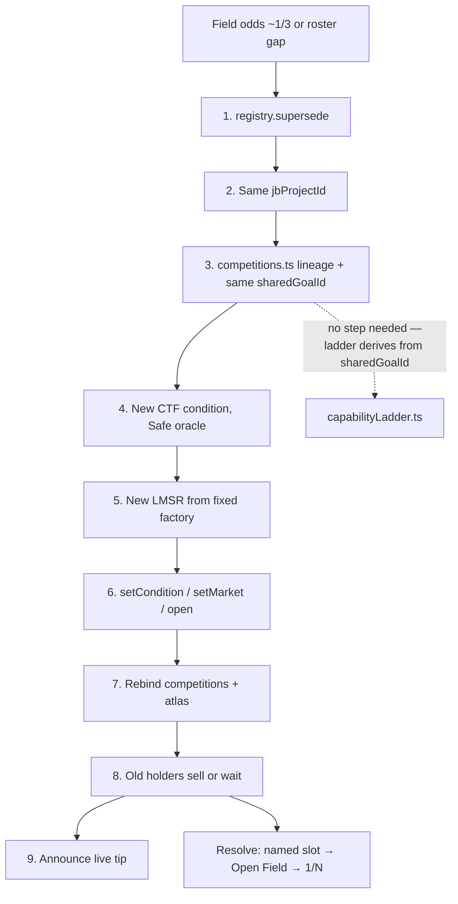

# PR-A′ — Touchdown rules v0.2 and the capability ladder

> **This doc was split.** What ships here is **A′**. The full First Tracks and Ice specs are
> deferred to **A2** and held in §11 until their gate opens. See §5 A3 for the decision and §11 for
> the gate.

| Field | Value |
|---|---|
| **Status** | Revised — A′ ready for review; A2 deferred (gate in §11) |
| **Authors** | MoonDAO DePrize engineering |
| **Reviewers** | DePrize product, engineering; **named counsel gate** on the v0.1 banner strike (§6.2) and on any purse language — a role is not a reviewer, see §6.7 |
| **Decision requested** | Approve (1) the four rung names and their order, (2) the six v0.2 decisions in §6.3, (3) the frozen editorial defaults in §6.7 **with their named owners filled in**. Approving this doc commits MoonDAO to publishing a rules-of-record file for rung 0 only; it commits nothing for rungs 1–3 beyond a name and a one-line bar. |
| **Last updated** | 2026-09-16 (engineering-critique revision) |
| **Depends on** | None. Docs only; no code conflicts |
| **Unblocks** | B′ (the one spec URL that must resolve), C (canonical Test 4 wording), G1 (Discord spec links) |
| **Merge slot** | 3rd, per the parent plan's order: PR-0 → PR-1 → **A′** → C → F → E → B′ → D1 → G1. A2 is a follow-up. |

---

## 1. One-paragraph summary

A′ is **docs only**. It brings the missing Touchdown v0.1 spec onto this branch, strikes its stale
`CONFIDENTIAL — INTERNAL / NDA` banner in place under a named counsel gate, and appends a **v0.2
addendum** recording six decided rules: Touchdown is rung 0, confirmation is uniform across
operators, Test 4 has a shorter-planned-mission clause, ispace becomes a named slot only on the next
generation, the purse is a **payload purchase** as product intent (Terms v1.1 still govern), and
roster changes go through a nine-step `supersede`. It publishes a one-page **capability ladder** —
four rung names, four one-line bars, `PLANNED` for rungs 1–3, **no rosters, no win tests, no purse
language for rungs 1–3** — plus a §0 pointer in GTM. Every file it touches opens with a **freeze
table** saying which of its own blocks can still be amended and which are immutable. Three **CI
gates** replace the prose discipline that this doc previously repeated five times and enforced zero
times. The full First Tracks and Ice specs move to **A2** (§11). No Solidity, no UI, no `*.local.md`.

---

## 2. Context / background

DePrize is live on Sepolia as **Touchdown generation 2** (DePrize **#22**, Juicebox project **268**,
mission 14). The prize-page copy and Moon Base Zero race `shared-next-landing` already describe five
binary tests (after-open, powered descent, upright, ≥24 h surface data, independent confirmation).
See [ui/lib/deprize/competitions.ts](ui/lib/deprize/competitions.ts) (`sepolia[21]` superseded,
`sepolia[22]` live tip) and the atlas goal in
[ui/lib/lunar-atlas/seed/atlas.dataset.json](ui/lib/lunar-atlas/seed/atlas.dataset.json)
(`id: "shared-next-landing"`).

The written rules of record were drafted on branch `cursor/deprize-first-prize-candidates-0dd4` as
[docs/DEPRIZE_TOUCHDOWN.md](docs/DEPRIZE_TOUCHDOWN.md) at commit `ce77f1bfc`. **That file is absent
on this branch.** [docs/DEPRIZE_GTM_TOUCHDOWN.md](docs/DEPRIZE_GTM_TOUCHDOWN.md) already links to it
as "the rules of record" and still treats the $25k purse as an open G6 question.

A chamber Night Shift prize was drafted (10 We, 354 h, vacuum, unplugged) and then **removed from
the public repo** in commit `ccdf9800f` (also `docs/night-shift-brief.html`). Those files carry
**CONFIDENTIAL — INTERNAL / NDA**. The ladder rung is a **2028+ surface-night** capability that does
not exist as a market. No 2026–27 lander on the Touchdown roster is designed to work through a full
lunar night; Zeno RHU on Blue Ghost is NET 2028. **This constraint is now enforced by gate 1 in §8,
not by prose** — see §6.8.

Landing **upright and operational** is no longer a first: Firefly Blue Ghost Mission 1 (March 2025)
did it. The next commercially interesting unanswered questions are rover egress + drive (First
Tracks) and in-situ water ice (Ice, 2027 window). Both are **A2** material: neither has a pool, a
condition, a registration, or a committed date.

---

## 3. Problem statement

1. The Touchdown rules live only on another branch, while GTM, QA, and the live Sepolia market
   already assume they exist. Reviewers and later agents cannot find the rules of record.
2. v0.1 left four load-bearing decisions open: ispace as a named slot, a confirmation standard that
   can be applied to CNSA and CLPS the same way, Test 4 vs short polar missions, and what the purse
   actually buys.
3. B′ and G1 need **one** spec URL that resolves and **one** canonical wording for Test 4. Today they
   have neither, so each would hand-copy the sentence and drift.
4. GTM still presents "cheque to the operator" as a live option. That framing is the G6 failure mode
   (a $25k cheque to a company holding a ~$200M CLPS award).
5. **The doc itself was the risk.** A spec PR for a *live* market can silently invalidate that
   market's outcome set. Nothing in the previous draft told a reader which of its own paragraphs were
   still editable and which had frozen at `prepareCondition` or `open`.

Who is affected: prize authors, counsel, the Senate checklist at resolution, and the B′/C/G1
implementers who will quote this text.

---

## 4. Goals and non-goals

**Goals (A′)**

- Restore Touchdown v0.1 onto this branch from `ce77f1bfc`; strike its stale NDA / "nothing
  on-chain" banner **in place** with a dated one-line footnote, under the named counsel gate in
  §6.2; then add a **v0.2 addendum** that records the decided rules.
- Give every file A′ creates or edits a **freeze table** (§6.1) marking which blocks are amendable
  and which are immutable, and on what event they froze.
- Publish a one-page capability-ladder doc: rung names, one-line bars, `LIVE`/`PLANNED` status, the
  2028+ night-survival constraint, **no public chamber-spec href**. **No rosters, no win tests, no
  purse language for rungs 1–3.**
- Give every frozen editorial default a **named owner, a rationale, a revisit trigger, and an
  abandonment criterion** (§6.7).
- Own the **canonical location** of every resolution sentence that B/C/G quote (§6.9), so Test 4 is
  not hand-copied into three surfaces.
- Add a short §0 pointer in GTM to the ladder and the purse change. Do not rewrite the GTM phase plan.
- Land three **CI gates** (§8): NDA grep, markdown-link resolution, diff-path allowlist.

**Non-goals**

- **The full First Tracks and Ice specs.** Deferred to A2 (§11). A′ publishes their *names and
  one-line bars only*. No roster, no tests, no tie-break, no purse waterfall for rungs 1–3.
- On-chain registration of First Tracks, Ice, or Night Shift.
- Editing [ui/lib/deprize/competitions.ts](ui/lib/deprize/competitions.ts), the atlas, Terms, or
  BetModal copy. The `criteriaNotes` + `atlas.dataset.json` propagation that PR-B used to carry is
  **not** in this docs-only file allowlist — see §8 "Companion".
- Changing eligibility, permits, or `evaluateEligibility`.
- Closing G4 (Safe oracle), U.S. operation, KYC, or creator referral splits.
- Restoring, rewriting, or linking `docs/DEPRIZE_NIGHT_SHIFT.md` or `docs/night-shift-brief.html`.
  Stated once here; **enforced by gate 1**, not by repetition.
- Creating the GTM companions that GTM already links (`DEPRIZE_GTM_SURVIVE_THE_NIGHT.md`,
  `DEPRIZE_GTM_SIX_SECONDS_LATE.md`). When editing GTM, **strike or annotate** the companion-plan
  line so it does not 404.

---

## 5. Alternatives considered

### A1. Rewrite Touchdown v0.1 in place

Fold v0.2 decisions into the original tests and roster so there is one linear spec.

- **Reuse:** High — one file for the live prize.
- **User impact:** Confusing for anyone who reviewed v0.1 (commit `ce77f1bfc`).
- **Complexity:** Low.
- **Legal:** Harder to show what changed for counsel.
- **Fatal:** #22 is `open`. Parts I–V are the frozen outcome-set and rules text of a live market.
  Editing them in place is a supersede wearing a diff's clothes.

Rejected. **Carve-out (new in this revision):** exactly one in-place edit to v0.1 is kept — the
banner strike in §6.2 — because that banner is metadata *about publication*, not rules text, and
leaving it produced the worse outcome in A5.

### A2. New `DEPRIZE_TOUCHDOWN_V02.md`, leave v0.1 on the other branch

- **Reuse:** Poor — GTM and QA already point at `DEPRIZE_TOUCHDOWN.md`.
- **Complexity:** Two files, two homes.
- **User impact:** Reviewers will open the wrong doc.

Rejected: restore the path GTM already uses.

### A3. Ladder only; defer the First Tracks / Ice **specs** until those markets are registered

- **Complexity:** Lowest.
- **User impact:** B′ planned rungs have no per-rung spec to link — but B′ no longer links them
  (planned rungs render as plain text), so the cost is zero.
- **Reuse:** The one-pager shape is not wasted; it is held in §11 and lands unchanged at A2.
- **Risk retired:** Publishing a rules-of-record-shaped document for a prize nobody can win is a
  promise the repo cannot keep. Every volatile fact in those rosters — ispace Mission 3 in 2028,
  VIPER on MK1-2, the Griffin manifest — must be re-verified at registration anyway.

**Chosen for the scope split.** *This reverses the previous draft's rejection.* The previous
rejection said only "the rollout requires FIRST_TRACKS, ICE, and CAPABILITY_LADDER now" — an appeal
to the parent plan, not an argument on merits, and the parent plan has since adopted the split
([pr-program-architecture.md](pr-program-architecture.md) §5). What was actually required was a
*ladder*, and rungs 1–3 need a name and a bar for that, not a roster.

### A4. Treat Night Shift-the-chamber-prize as rung 3 without a timing note / public NDA link

- **User impact:** Implies a 2026–27 lander night, which no roster vehicle is designed for.
- **Legal / product:** Mis-sells the prize and re-publishes an NDA-marked spec removed in `ccdf9800f`.

Rejected: the ladder must say surface night survival is 2028+ and must **not** href
`DEPRIZE_NIGHT_SHIFT.md`.

### A5. Restore v0.1 with its NDA banner intact and override it in Part VI *(previous chosen answer)*

- **Complexity:** Lowest — pure append, zero edits to v0.1.
- **User impact:** **Fatal.** B′/G1 link rung 0's spec at this file. A public visitor clicking
  "Touchdown spec" from a live prize page lands on `CONFIDENTIAL — INTERNAL / NDA` and must read
  several hundred lines to reach the retraction. The correction is 400 lines from the problem.
- **Legal:** Publishing a document that declares itself confidential and then retracts that in an
  appendix is worse than either publishing it cleanly or not publishing it.

**Rejected in this revision** (it was the previous draft's answer). Replaced by A6.

### A6. Strike the banner in place with a dated footnote, under a named counsel gate

- **Complexity:** Two lines — *smaller* than appending an override section.
- **Correctness:** The banner is publication metadata, not rules text, so striking it does not touch
  the frozen outcome set (see the freeze table, §6.1).
- **Gate:** If the banner is legally meaningful, an engineer's assertion does not clear it. The
  restore is then blocked on the named counsel in the Reviewers row.

**Chosen.** A1's file path + A2's addendum discipline + A6's banner handling: restore v0.1, strike
the banner in place with a footnote, append Part VI, publish the ladder, defer the rung 1–3 specs.

---

## 6. Proposed design

### 6.1 Freeze tables — what this doc may and may not change

This is the first thing every file A′ writes must contain, as an `<!-- deprize:freeze-table -->`
anchored block above the one-pager. Gate 2 (§8) asserts the anchor is present.

**The general rule, by lifecycle event:**

| Block | Lifecycle |
|---|---|
| Roster / named slots / outcome labels | **Frozen at `prepareCondition`.** Becomes `teamIds[]` and is immutable for the life of the generation. Roster size is the 1/N prior. Changing it is a `supersede` (§6.3 f), not an edit. |
| Win tests, parameters such as `N`, tie-break rule | **Frozen at `open`.** Freely editable before then. After `open`, changing one is a `supersede`: new CTF condition, new LMSR, nine steps. |
| Purse, waterfall, payout mechanics | **Never in force from this file.** Governed by Terms v1.1 / Prize Rules 1.0 until counsel approves PR-C. |
| Field discussion, "how it goes wrong", reviewer questions, source map, editorial framing | **Editable forever.** No market depends on them. |

**Applied to the files A′ touches:**

| File | Market state | What is already immutable | What A′ may still write |
|---|---|---|---|
| `docs/DEPRIZE_TOUCHDOWN.md` Parts I–V | Sepolia #22 **`open`** | Roster (frozen at `prepareCondition`), all five tests, the tie-break, `N`-equivalents | **Nothing.** Do not edit. One carve-out: the banner strike (§6.2), which is publication metadata, not rules text. |
| `docs/DEPRIZE_TOUCHDOWN.md` Part VI (v0.2) | same | Anything that would change an outcome or a test | Interpretation, evidence standards, Senate checklist, product intent. **Part VI cannot amend a frozen test — it can only say how an already-frozen test is read.** If a reviewer wants a *different* test, that is a supersede. |
| `docs/DEPRIZE_CAPABILITY_LADDER.md` | No market | Nothing | Everything. Rung names and bars are editorial until a rung registers. |
| `docs/DEPRIZE_GTM_TOUCHDOWN.md` | No market | Nothing | §0 pointer + the 404 companion line. Phase plan and G1–G10 untouched. |
| A2 drafts (§11), First Tracks / Ice | No market, not published | Nothing | Everything, **until registration**. At `prepareCondition` the roster freezes; at `open` the tests and `N` freeze. |

**The sentence this replaces.** The previous draft said of First Tracks: *"Write the tests against
`N` so a later addendum can change the number without rewriting the roster."* That is true **only
before registration** and it is the exact misreading that gets a live market's outcome set
invalidated. The corrected statement, which belongs in the A2 draft's own freeze table:

> `N` is a named parameter for editorial convenience **while First Tracks is unregistered**. Once
> First Tracks opens, `N` is frozen with the rest of the tests; changing it is a supersede, not an
> addendum. The roster freezes one step earlier, at `prepareCondition`.

### 6.2 Bringing v0.1 onto this branch, and the banner

Do **not** cherry-pick the whole commit (it may carry unrelated files). Restore the single path:

```bash
git checkout ce77f1bfc -- docs/DEPRIZE_TOUCHDOWN.md
```

Confirm the file opens with `# TOUCHDOWN`, version **0.1-draft**, date **4 September 2026**, and the
five tests in Part III §2.

**Banner handling (changed in this revision — see A5/A6).** The previous plan left the
`CONFIDENTIAL — INTERNAL / NDA` and "pre-registration, nothing on-chain" banners in Part I and
retracted them in Part VI. That is unacceptable for a file that B′ and G1 link publicly as rung 0's
spec: the first thing a visitor reads would be a confidentiality notice, and the retraction is
hundreds of lines below.

Instead, **strike both banners in place** and replace them with one dated line:

> *Historical note (2026-09-16): this file was drafted pre-registration under an internal banner.
> Touchdown generation 2 is live on Sepolia #22 and this file is the public rules of record.
> Parts I–V below are unchanged from v0.1 (`ce77f1bfc`); see Part VI for the v0.2 addendum.*

Constraints on that edit:

- It is the **only** in-place edit to v0.1 permitted by the freeze table (§6.1). Parts I–V test
  wording, roster, and tie-break stay byte-identical.
- **Merge gate:** the Reviewers row names counsel "for any public-facing prize language." This is
  public-facing prize language, on a file whose own header claimed confidentiality. Before merge,
  replace the reviewer placeholder with a **person's name** and record their approval of the strike
  in the PR. If counsel cannot clear it, A′ merges **without** `DEPRIZE_TOUCHDOWN.md` — the ladder
  doc and the GTM pointer stand alone, and rung 0's `specHref` points at the ladder until it clears.
  That fallback is why B′ links only the ladder.

Then append v0.2 below Appendix A. Do not rewrite v0.1 test wording in Parts I–V; quote the new
Test 3 / Test 4 language only in the addendum.

### 6.3 Touchdown v0.2 addendum (exact decisions)

Add a new top-level section after Appendix A:

```
# PART VI — v0.2 ADDENDUM (16 September 2026)
```

Header line: **Version 0.2-draft · Status: addendum to v0.1 · Does not reopen the market.** Per the
freeze table, this addendum **interprets** frozen tests; it cannot change one. Generation-3 roster or
test changes use the supersede procedure.

Record these six decisions:

**(a) Capability ladder.** Touchdown is **rung 0** of Touchdown → First Tracks → Ice → Night Shift.
Link [DEPRIZE_CAPABILITY_LADDER.md](DEPRIZE_CAPABILITY_LADDER.md). Each rung has its own roster of the
companies demonstrating **that** capability (a lander operator is not automatically a rover
operator). Rungs 1–3 have names and bars only until A2.

**(b) ispace named slot — next generation, not a silent rewrite of #22.** v0.1 Part V Q4 asked
whether ispace should be named. **Decision: yes, on the next generation.** Hakuto-R Mission 3 (ULTRA
/ H3, 2028) is too late to be *next* on the current calendar, which is why v0.1 left them in Open
Field. A market that hides the most famous commercial failure will be asked about them on day one.
When Open Field odds sit near or above ~⅓, or when Mission 3 enters a realistic "could be next
successful landing" window, run the nine-step supersede and name ispace as its own slot. **Do not
resize Sepolia #22 / the current CTF condition** — the roster froze at `prepareCondition`. Until
then, ispace remains Open Field and the UI must say so.

**(c) Uniform confirmation standard.** Same bar for every operator, including CNSA.

- **Touchdown UTC** is established by a public statement from NASA, ESA, CNSA, JAXA, ISRO, or
  Roscosmos (or the operator plus one of those agencies). Publish both clocks if they disagree; use
  the more conservative UTC.
- **Test 3 (stable planned orientation)** is not satisfied by an operator livestream alone. It
  requires at least one of: (i) surface imagery from the vehicle that shows the **horizon** (or an
  equivalent attitude reference), (ii) independently received third-party telemetry, or (iii)
  LRO-class orbital imaging of the landed vehicle. The same evidence types apply to Firefly, IM,
  Astrobotic, Blue Origin, and CNSA.
- **Test 5** still accepts an agency success declaration as independent confirmation of *that a
  landing occurred*. Test 3 orientation is a higher bar and is where IM-1 / IM-2 / SLIM fail.

This is an evidence standard for an already-frozen test, which the freeze table permits.

**(d) Test 4 shorter-mission clause.** Replace the implicit "24 h or bust" reading with:

> The vehicle returns telemetry or imagery from the lunar surface for a continuous period of ≥ 24
> hours after touchdown, **or for the full planned surface mission if that planned mission is shorter
> than 24 hours**. "Planned" means the duration published by the operator or the sponsoring agency
> before touchdown. A vehicle that dies at hour 6 of a published 14-day mission still fails. A hopper
> or polar checkout whose published surface mission is 8 hours can clear Test 4 by completing those 8
> hours.

**This paragraph is the canonical Test 4 wording** (§6.9). B/C/G reference it; they do not re-type it.

**(e) Purse = payload purchase, with waterfall.** Open this subsection with a fenced status block
**before** the waterfall, not a trailing qualifier:

> ⚠ **NOT IN FORCE — PRODUCT INTENT ONLY.** Terms v1.1 and Prize Rules 1.0 still say the prize is
> paid in **ETH to the Winner's wallet**. The waterfall below is what product intends to negotiate;
> it becomes contract speech only if counsel approves PR-C. Owner: *(named product owner — §6.7)*.
> Counsel gate: PR-C. Do not quote this block in live UI as in-force terms.

Then: the purse is **not** a cheque to a CLPS operator and **not** a cash transfer to Voyager / IM /
Firefly corporate treasury. It buys a **community payload** (nameplate → data capsule → larger slot
as the pool grows; see PR-C `describePayloadTier`) on a future flight, in this order:

1. **Winner's next qualifying flight** — a payload slot on the winning landing-vehicle operator's
   next vehicle that can carry it.
2. If (1) cannot be contracted within **24 months** of resolution: **any roster member's next
   qualifying flight** in that window (named slots first, then Open Field winner if that is who won).
3. If (2) fails: a **flight-team-named recipient** (the people who flew the attempt — a scholarship,
   a student payload, or a named lab), not the parent company's general treasury.

If the Winner is a public body that cannot accept a payload agreement, skip to (2), then (3). Market
resolution is unaffected (Terms §7.4 / Prize Rules §5). Procurement runbook is PR-C. The $25k figure
is a **seed / target**, not a wire to the operator.

**(f) Nine-step supersede procedure.** Trigger: Open Field implied odds stay near or above **~⅓**, or
a named-slot gap that would mis-price the live question (ispace Mission 3 becoming "next", a
cancelled CLPS award, a new funded lander). Steps, in order:

1. On-chain `supersede` on the current DePrize — registry state `SUPERSEDED` (see
   `DePrizeState.SUPERSEDED` in [ui/lib/deprize/lifecycle.ts](ui/lib/deprize/lifecycle.ts)). New bets
   close on the old generation; sells remain open.
2. Keep the **same Juicebox project** (`jbProjectId`). The pool does not move.
3. Write off-chain lineage in [ui/lib/deprize/competitions.ts](ui/lib/deprize/competitions.ts): old
   `supersededBy: <newId>`, new `supersedes: <oldId>`, and carry the **same `sharedGoalId`** onto the
   new row. `liveTipOf` / `resolveLiveDePrizeId` already walk this.
4. Prepare a **new CTF condition** with the Safe as oracle (G4 — do not leave the deployer EOA as
   oracle on a public generation). Outcome set is frozen at `prepareCondition`.
5. Deploy a **new LMSR from the fixed factory** (H-01 / `tradeWithTWAP` fix). Do not reuse a pre-fix
   clone.
6. `setCondition` / `setMarket` / `open` on the new registry row.
7. Rebind `competitions.ts` outcomes (teamId checksums) and the Moon Base Zero atlas race
   (`shared-next-landing` or the new goal). Named slot → atlas `projectId`; Open Field →
   `OPEN_FIELD_PROJECT_ID` / `field: true`.
8. Old holders **sell** on the superseded market or **wait**. The superseded market still resolves to
   the same real-world result. Payout mapping is named slot if the winner is on that roster, else
   Open Field, else 1/N (`buildSupersededPayouts` in
   [ui/lib/deprize/lifecycle.ts](ui/lib/deprize/lifecycle.ts)).
9. Announce: old `/deprize/<oldId>` shows the existing superseded banner; live tip is
   `/deprize/<newId>` and `/deprize/shared-next-landing`.

**What this procedure deliberately does *not* need a step for.** B′'s
`ui/lib/deprize/capabilityLadder.ts` keys each rung on `sharedGoalId` and resolves the live id
through `findDePrizeIdForGoal`, so step 3 carrying the goal forward is *already* the ladder update.
No tenth step, and no hardcoded id to rot. The one case that does need a human: **a goal retired with
no successor** (the capability is achieved and not re-run, or the prize is withdrawn). Then flip that
rung's status in `capabilityLadder.ts` by hand — the single manual ladder edit in the system, and it
belongs on the resolution checklist, not here.



### 6.4 `docs/DEPRIZE_CAPABILITY_LADDER.md` (one page) — the A′ deliverable

Freeze-table anchor first (§6.1: no market, everything editable), then the ladder, then four short
sections.

```
rung 0  Touchdown      next upright working landing       LIVE (Sepolia #22)
rung 1  First Tracks   commercial rover egress + drive    PLANNED — name and bar only
rung 2  Ice            2027 in-situ surface water ice     PLANNED — name and bar only
rung 3  Night Shift    chamber proxy now · surface 2028+  PLANNED — placeholder only
```

**`PLANNED — name and bar only` is load-bearing copy.** It is the sentence that stops a reader
treating rungs 1–3 as prizes they can enter. Each of rungs 1–3 gets **one line** here and nothing
else: no roster, no tests, no tie-break, no purse waterfall, no deadline. Those land at A2, when the
market is real. State explicitly on the page: *"Rungs 1–3 have no pool, no registration, and no
committed date. Nothing on this page is an offer to award a prize."*

**Why this order.** Upright landing is proven (Blue Ghost 1). Wheels are not. Ice is the 2027 science
prize. Night is later. *(Ordering is a frozen editorial default — owner and revisit trigger in §6.7.)*

**Why Night Shift is 2028+ (placeholder only).** No 2026–27 lander on the Touchdown roster is
designed to operate through a full lunar night. Zeno RHU on Blue Ghost is NET 2028. A chamber prize
was drafted as a proxy and then taken out of the public repo (`ccdf9800f`). This rung's public text
is this paragraph only: chamber proxy now · surface-night market 2028+ · no on-chain id. B′'s rung-3
`specHref` points **here**.

**Each rung has its own roster** (when it has one at all). Touchdown slots are landing-vehicle
operators. First Tracks slots will be rover operators — it is **not** `shared-lunar-rover` / Sepolia
#12, which is crewed LTV. Do not copy Touchdown's six outcomes onto any other rung.

**Per-attempt sub-markets (later, not this PR).** Catalogue only: payload-mass bracket, endurance
bracket, and a binary "clears Touchdown Test 3". Future LMSR conditions, not registrations now.

**Purse rule (one paragraph).** Same fenced **NOT IN FORCE** block as §6.3(e), then: product intent
is that every rung's purse is a payload purchase via the Touchdown v0.2 (e) waterfall, not a cheque
to a CLPS operator.

Link Touchdown, GTM (read-only pointer), and — once A2 and PR-C exist — First Tracks, Ice, and the
payload-purse runbook. Until A2 merges, First Tracks and Ice are **plain text on this page, not
links**; A2's own diff adds the hrefs in the commit that creates the files.

### 6.5 GTM Touchdown — short §0 note

In [docs/DEPRIZE_GTM_TOUCHDOWN.md](docs/DEPRIZE_GTM_TOUCHDOWN.md), immediately after the existing
title block / before "Ten things…", insert a boxed note. **Do not rewrite G6 or the phase plan.**

> **v0.2 pointer (2026-09-16).** The capability ladder is
> [DEPRIZE_CAPABILITY_LADDER.md](DEPRIZE_CAPABILITY_LADDER.md). Touchdown remains rung 0; First
> Tracks and Ice are named rungs with no spec published yet; surface night survival is 2028+
> (placeholder only). The G6 purse decision is now **product intent**: a **payload purchase** with the
> waterfall in [DEPRIZE_TOUCHDOWN.md](DEPRIZE_TOUCHDOWN.md) Part VI, not a cheque to a CLPS operator.
> Terms v1.1 still govern until counsel. This GTM's phase plan is unchanged.

Also **strike or annotate** the existing Companion plans line that 404s to
`DEPRIZE_GTM_SURVIVE_THE_NIGHT.md` and `DEPRIZE_GTM_SIX_SECONDS_LATE.md`. Suggested replacement:
`Companion plans: not published (Survive-the-Night / Six Seconds Late drafts are out of scope; do not
create them in this PR).` Do not add new 404 links. Do not create those files.

### 6.6 Files (A′)

| Path | Action |
|---|---|
| [docs/DEPRIZE_TOUCHDOWN.md](docs/DEPRIZE_TOUCHDOWN.md) | Restore from `ce77f1bfc`; strike the banner per §6.2 (counsel gate); append **Part VI — v0.2 addendum** |
| [docs/DEPRIZE_CAPABILITY_LADDER.md](docs/DEPRIZE_CAPABILITY_LADDER.md) | New, one page |
| [docs/DEPRIZE_GTM_TOUCHDOWN.md](docs/DEPRIZE_GTM_TOUCHDOWN.md) | Insert a short note at the top of §0; strike the 404 companion line |
| `ui/cypress/integration/lib/deprize/docsHygiene.cy.ts` | New — gates 1 and 2 (§8) |
| `.github/workflows/*` or the existing CI job | One step — gate 3 (§8) |

This list **is** gate 3's allowlist. Do not create or commit `*.local.md`. Do not edit `ui/` other
than the one new test file.

### 6.7 Frozen editorial defaults — decision, owner, revisit trigger, abandonment

The previous draft asserted these. Each is now a decision with a named human on the hook. **A merge
gate: no row may ship with `TBD` in the Owner column** — "reviewer question 1" is addressed to a
team, and a team cannot be paged. Gate 2 (§8) fails the build on a remaining `TBD`.

| Decision | Owner | Rationale | Revisit trigger | Abandonment criterion |
|---|---|---|---|---|
| **Rung order** Touchdown → First Tracks → Ice → Night Shift | `TBD — product` | Upright landing is proven (Blue Ghost 1); wheels are not; ice is the 2027 science story; night needs RHUs that fly NET 2028 | A rung's capability is demonstrated before the rung below it (e.g. an in-situ ice dataset publishes before any commercial rover drives) — reorder rather than leave a ladder that misdescribes the frontier | If two of the four rungs are achieved without a market, the ladder becomes a history page and is retitled, not maintained as a roadmap |
| **Four rungs, not three or five** | `TBD — product` | Four is the number of distinct unclaimed capabilities we can state a public bar for today | A fifth capability acquires a credible 2027–28 attempt (sample return, precision landing, surface power) | — |
| **Night Shift stays a public placeholder with no spec** | `TBD — product` + counsel | The chamber spec is NDA-marked and was removed in `ccdf9800f`; the surface-night market is 2028+ | An RHU-equipped lander with a published night-survival objective enters a 12-month window | If no such vehicle is manifested by end-2028, drop the rung from the public ladder rather than carry a placeholder indefinitely |
| **First Tracks `N = 10 m`** *(A2 — drafted, not published)* | `TBD — prize author` | Short enough that a checkout drive counts; long enough that a twitch or a ramp-roll does not | A roster rover publishes a planned checkout traverse **below 10 m**, which would make the bar unwinnable on its first real attempt | If no commercial rover is manifested for a 2027 flight by mid-2027, First Tracks does not register and the draft stays unpublished |
| **First Tracks roster composition** *(A2)* | `TBD — prize author` | Inclusion rule, stated explicitly because roster size **is** the 1/N prior and it freezes at `prepareCondition`: a slot requires a *named vehicle* on a *manifested flight* with a *public operator commitment*; funded-but-unmanifested programmes sit in Open Field | Any listed vehicle loses its ride, or an unlisted vehicle acquires a manifested flight | Re-verify every roster fact at registration; a roster older than 6 months at `prepareCondition` must be re-checked before the condition is prepared |
| **Ice roster composition and the 2027 window** *(A2)* | `TBD — prize author` | The 2027 cluster is the ice-oriented campaign; the window is what makes the question answerable | Any 2027-window mission slips past 2027, or a 2028 mission becomes the credible first in-situ attempt | Ice has a **built-in expiry**: if no 2027-window mission flies an ice-capable payload, the draft is withdrawn rather than re-dated |
| **Purse = payload purchase** | `TBD — product` + counsel (PR-C) | A $25k cheque to a company holding a ~$200M CLPS award is the G6 failure mode | Counsel rules the payload agreement unworkable, or no roster operator will contract a slot | If counsel rejects it, Terms v1.1 ETH-to-wallet stands and the waterfall block is deleted from these files, not softened |

**Abandonment, generally.** A published spec for an unregistered prize is withdrawn by adding a
`WITHDRAWN (date, reason)` line to its own freeze-table block and de-linking it from the ladder. It
is not deleted — B′/G1 may already have the URL, and a 404 is worse than a withdrawal notice.

### 6.8 NDA constraint — stated once, enforced by machine

The previous draft repeated "do not link / restore / quote `DEPRIZE_NIGHT_SHIFT.md`" in §1, §4,
§6.6, §6.8, and the review-response block: five statements, zero enforcement. A constraint written
five times in prose is a constraint asking to be a test.

**The rule, once:** no file under `docs/` or `ui/` may reference `DEPRIZE_NIGHT_SHIFT` or
`night-shift-brief`, and the files removed in `ccdf9800f` are not restored.

**The enforcement,** gate 1 in §8. It covers this PR's ladder placeholder, **B′'s `specHref`
values**, and **G1's Discord copy** — none of which this doc could have policed by asserting things
about itself.

### 6.9 Canonical wording, cross-links, and path stability

**Canonical wording (replaces "reconcile wording at merge").** The previous draft told B/C/G they
"may start from this design's decisions and reconcile wording at merge," which ships three
hand-copies of Test 4 — into B's `criteriaNotes`, into `atlas.dataset.json` thresholds, and into
PR-C's Terms draft — and that is how a Senate checklist ends up disagreeing with the prize page.

| Sentence | Canonical home | Consumers |
|---|---|---|
| Test 4 shorter-planned-mission clause | `DEPRIZE_TOUCHDOWN.md` Part VI (d) | `criteriaNotes`, atlas `surface-data.threshold`, PR-C Terms draft |
| Test 3 evidence standard | `DEPRIZE_TOUCHDOWN.md` Part VI (c) | `criteriaNotes`, atlas `upright.threshold` |
| Purse waterfall + NOT-IN-FORCE fence | `DEPRIZE_TOUCHDOWN.md` Part VI (e) | ladder doc, GTM §0, PR-C |
| Rung names and one-line bars | `DEPRIZE_CAPABILITY_LADDER.md` | `capabilityLadder.ts` `label`/`bar`, G1 Discord copy |

Consumers quote the canonical text verbatim and cite the section. Any change to a canonical sentence
is a change to this file first; the copies follow in the same PR that changes it. **Named
reconciler:** `TBD — must be a person` (same merge gate as §6.7).

**Cross-links that must resolve.** Touchdown v0.2 → ladder. Ladder → Touchdown, GTM. GTM note →
ladder + Touchdown Part VI. **Not** `DEPRIZE_NIGHT_SHIFT.md`, **not** `*.local.md`, **not**
`DEPRIZE_GTM_SURVIVE_THE_NIGHT.md` / `DEPRIZE_GTM_SIX_SECONDS_LATE.md`. First Tracks and Ice are
plain text until A2. Enforced by gate 2.

**Path stability is now an API.** Once B′ builds `blob/main/docs/<file>` URLs and G1 puts them in
Discord, these paths are a public contract with named downstream consumers (B′, G1, PR-C, GTM).
Renaming or moving a `docs/DEPRIZE_*.md` file is a **breaking change**: it requires a same-PR update
to every consumer above, and gate 2 will fail the build if one is missed.

---

## 7. Step-by-step implementation plan (A′)

1. `git checkout ce77f1bfc -- docs/DEPRIZE_TOUCHDOWN.md`. Confirm it is the v0.1 spec (header
   "TOUCHDOWN", Part III five tests, Part V Q4 ispace). If the path is missing on that commit, stop
   and surface it — do not invent v0.1.
2. **Obtain the named counsel sign-off in §6.2**, then strike the NDA / "nothing on-chain" banners in
   place and insert the dated historical note. If sign-off is not available, skip steps 1–3 and merge
   A′ without `DEPRIZE_TOUCHDOWN.md` (the fallback in §6.2).
3. Insert the `<!-- deprize:freeze-table -->` block from §6.1 at the top of the restored file, then
   append **Part VI — v0.2 addendum** with subsections (a)–(f) exactly as §6.3, including the fenced
   **NOT IN FORCE** block before the waterfall. Do not edit v0.1 test wording in Parts I–V.
4. Write `docs/DEPRIZE_CAPABILITY_LADDER.md` per §6.4: freeze table, four rungs, one line each for
   rungs 1–3, the "no pool, no registration, no committed date" sentence, Night Shift placeholder
   paragraph, the NOT-IN-FORCE purse block. First Tracks and Ice are **plain text, not links**.
5. Fill every `TBD` in §6.7 with a person's name and paste the resulting table into the ladder doc's
   appendix. A row without an owner blocks merge (gate 2).
6. Insert the GTM §0 pointer per §6.5 and strike/annotate the 404 companion-plan line. Do not rewrite
   G1–G10 or the phase plan.
7. Write `ui/cypress/integration/lib/deprize/docsHygiene.cy.ts` with gates 1 and 2 (§8) and add the
   gate-3 step to CI. Run `yarn test:deprize` from `ui/` until green.
8. Run the gates locally and paste the output into the PR description:
   `rg -n 'DEPRIZE_NIGHT_SHIFT|night-shift-brief' docs/ ui/` (expect no matches) and
   `git diff --name-only` (expect exactly §6.6's list).

No browser verification. The only code in this PR is the gate test file.

---

## 8. Testing, rollout, and feature flags

**"Tests: none" was the previous answer, and it was wrong** — three of the old acceptance criteria
were already mechanizable. Acceptance is now three gates plus four checkable properties.

**Gate 1 — NDA grep (the one that matters).**

```bash
rg -n 'DEPRIZE_NIGHT_SHIFT|night-shift-brief' docs/ ui/   # must return nothing
```

Wired into `yarn test:deprize` as a case in `ui/cypress/integration/lib/deprize/docsHygiene.cy.ts`
(the existing mocha glob `cypress/integration/lib/deprize/*.cy.ts` already matches). Shell out to
`rg` and fall back to a `fs` walk when `rg` is absent from the CI image, so the gate cannot silently
pass by being unrunnable. This converts the strongest part of this PR from a discipline problem into
a machine-checked invariant, and it guards **B′'s `specHref` values and G1's Discord copy** as well
as this PR — permanently, and for authors who never read this doc.

**Gate 2 — link and structure resolution.** Same test file, ~30 lines over `docs/**/*.md`:
every relative `*.md` link resolves to an existing path; every `docs/DEPRIZE_*.md` contains the
`<!-- deprize:freeze-table -->` anchor; no `docs/` file matches `Owner: *(TBD|TBA|team)`; no link
targets `*.local.md`, `DEPRIZE_GTM_SURVIVE_THE_NIGHT.md`, or `DEPRIZE_GTM_SIX_SECONDS_LATE.md`.

**Gate 3 — diff-path allowlist.** CI step: `git diff --name-only` against the merge base equals
exactly the paths in §6.6 and matches no `*.local.md`.

**Acceptance criteria (falsifiable).** The previous criterion — "a stranger can answer five
questions" — is a read-through by an unnamed person and is not a test. Replaced by:

1. Gates 1, 2, and 3 pass in CI.
2. Each new or edited `docs/DEPRIZE_*.md` contains the `<!-- deprize:freeze-table -->` block, and
   each of its rows names a lifecycle event (`prepareCondition`, `open`, `never`, `always`).
3. Every row of the §6.7 table has an **owner that is a person's name** and a non-empty revisit
   trigger. Machine-checked by gate 2's `TBD` rule.
4. `DEPRIZE_CAPABILITY_LADDER.md` contains the literal sentence "no pool, no registration, and no
   committed date" for rungs 1–3, and contains **no** roster table, no numbered test list, and no
   unfenced purse waterfall. (One `rg` per property.)
5. The counsel decision on §6.2 is recorded in the PR — approved, or the fallback taken.

**Rollout.** Merge slot 3 (PR-0 → PR-1 → **A′** → C → F → E → B′ → D1 → G1). A′ has no code
dependencies and can be written in parallel with everything; it must land before B′ and G1 so the
one spec URL they link resolves and so gate 1 exists before either writes spec copy.

**Companion (B-S3).** The `criteriaNotes` prop and the `atlas.dataset.json` threshold/description
propagation — Touchdown v0.2 copy landing in product surfaces — leave PR-B and ship as a small
companion change sequenced with A′. They are deliberately **outside this doc's allowlist** (§6.6)
because A′ is docs-only and gate 3 enforces that. The parent plan files the companion under A′; if
the program wants it in the same commit, gate 3's allowlist must be widened and the docs-only
non-goal dropped in the same edit. Either way the wording comes from §6.9's canonical home.

**Flags:** none. **Counsel:** v0.2 purse language is product intent, not a Terms bump; the banner
strike is a named merge gate (§6.2).

---

## 9. Risks and open questions

| Risk / question | Default if unanswered |
|---|---|
| Counsel does not clear the v0.1 banner strike | A′ merges without `DEPRIZE_TOUCHDOWN.md`; the ladder is rung 0's link until it clears (§6.2 fallback) |
| An owner cell in §6.7 stays `TBD` | Merge blocked by gate 2. There is no default; a team is not an owner |
| A2 never opens (no rover manifested, no ice mission) | The drafts in §11 stay unpublished; §6.7 abandonment criteria fire and the rung is dropped from the ladder rather than carried as a permanent placeholder |
| Readers treat ladder rungs 1–3 as enterable prizes | The "no pool, no registration, no committed date" sentence, checked by acceptance criterion 4 |
| Night Shift chamber prize vs 2028+ surface night confuses readers | One placeholder paragraph; no public href; gate 1 |
| `docs/DEPRIZE_TOUCHDOWN.md` already landed via another merge | If it exists, **do not overwrite v0.1**; add only the banner strike and Part VI if missing |
| ispace-on-next-gen vs "name them now on #22" | Do **not** resize #22 — the roster froze at `prepareCondition`. Named slot is a supersede |
| Payload tier USD brackets | Editorial in PR-C; this PR only names nameplate → capsule → slot |
| Official Prize Rules still say ETH to a wallet | PR-C drafts the counsel-facing change; the fenced NOT-IN-FORCE block keeps this file honest meanwhile |
| A `docs/DEPRIZE_*.md` file is renamed later | Breaking change with named consumers (§6.9); gate 2 fails the build |

---

## 10. Cross-cutting constraints

See [deprize-engineering-constraints.md](deprize-engineering-constraints.md) for the shared
constraints that apply to every PR in this program (workspace boundaries, `*.local.md`, `hashIp`,
`evaluateEligibility` purity, Redis persistence, API auth, crons, the `yarn test:deprize` glob, and
the prize-page anatomy).

A′-specific notes on top of those:

- This PR touches `docs/` plus **one** new test file under `ui/cypress/integration/lib/deprize/`.
  Gate 3 enforces the boundary.
- Auth / wallet / cron constraints do not apply here; the shared doc's `docs/` and `*.local.md`
  rules do, and gates 1–3 are how this PR discharges them.

---

## 11. A2 — First Tracks and Ice (deferred, not published by this PR)

**Gate:** A2 merges when the corresponding market is **registered**, or when product commits to a
registration date. Until then these are internal drafts; they do not enter `docs/`, the ladder links
them as plain text, and gate 2 will not look for them.

**Why deferred** (see A3): a full rules-of-record document — roster, five tests, tie-break, purse
waterfall, "Deadline: rolling — open until it happens" — for a market with no pool, no condition, no
registration, and no committed date is a promise the repo cannot keep. Every volatile fact in these
rosters must be re-verified at registration anyway (§6.7 abandonment rows).

**When A2 opens, each file must carry the freeze table first** (§6.1), with `N`, the tests, and the
tie-break marked *frozen at `open`* and the roster marked *frozen at `prepareCondition`*.

### 11.1 `docs/DEPRIZE_FIRST_TRACKS.md` — held draft

Same shape as Touchdown: one-pager, field, rules, how it goes wrong, reviewer questions, source map.
**Do not** copy Touchdown v0.1's NDA banner onto a new public spec.

**Header.** Version 0.1-draft · Owner: the §6.7 named prize author · Status: pre-registration,
nothing on-chain. Public editorial listing disclaimer: **named organizations have not been
contacted.** Independent of Touchdown.

**Not Sepolia #12 / `shared-lunar-rover`.** Atlas `shared-lunar-rover` and `competitions.ts` sepolia
**#12** are **crewed LTV** (Astrolab FLEX / CLV-1, Lunar Outpost, IM Moon RACER). First Tracks is
**unmanned commercial egress** (FLIP, CubeRover, MAPP). Do not bind `shared-lunar-rover`, do not
reuse #12's outcome set, do not copy Touchdown's six lander outcomes.

**Bar.** First **commercial** rover to egress a lander and drive **≥ N = 10 metres** on the lunar
surface and return imagery. One milestone; the drive is the prize. Judged on public facts, no referee
panel. Deadline rolling. Purse: payload slot on the winning rover company's next vehicle, via the
Touchdown v0.2 (e) waterfall, behind the same NOT-IN-FORCE fence.

**`N` is frozen at `open`, not "changeable by a later addendum."** Parameterizing the tests against
`N` is an editorial convenience while the prize is unregistered. Owner, rationale, and revisit
trigger are in §6.7.

**Five tests (all must pass).**

1. **Egress.** The rover leaves the lander (or a dedicated deploy mechanism on that lander) under a
   published deploy procedure and is free of the lander deck.
2. **Self-propelled traverse ≥ N m.** Operator odometry (or an equivalent published traverse
   reconstruction) shows ≥ N metres under the rover's own locomotion. A lander that tips and spills a
   rover does not count. A hopper is not a rover.
3. **Imagery from the rover on the surface.** At least one frame originated by the rover after
   egress, showing the lunar surface — not only a deck camera on the lander.
4. **Commercial operator.** Government rovers (NASA/JPL CADRE on IM-3) are listed in the field
   discussion so the market is honest, but **cannot win**. If CADRE drives first, the prize stays open.
5. **Independent confirmation (rover-shaped, not Touchdown Test 3).** At least one of: an agency or
   operator-plus-agency statement that the rover egressed and drove; independently received
   third-party telemetry; LRO-class or other public imaging of the rover on the surface; or a
   published traverse reconstruction another party can read. Operator livestream alone is not enough.

**Roster (held; re-verify at registration — inclusion rule in §6.7).** Astrolab FLIP on Griffin-1;
Voyager CubeRover on Griffin-1; Lunar Outpost MAPP on IM-3; ispace Tenacious-class on Mission 3
(2028); CMU / Iris-class on the next available commercial lander; Open Field for any other commercial
rover. Field discussion, not a winning slot: NASA/JPL CADRE on IM-3.

**Ties.** Earlier first-metre UTC (or first published odometry clearing N) wins; earlier launch UTC
breaks a tie.

**How it goes wrong.** A spilled rover; a 2 m twitch; CADRE drives first and the community thinks the
prize paid; FLIP imagery is only from the lander; ispace Mission 3 slips to 2029; Griffin slips and
the first drive is on IM-3.

**Reviewer questions.** (1) Is 10 m right? (2) Is CADRE-cannot-win the right commercial bar? (3) Does
a tethered or periodically docked rover count after egress? (4) Who did we miss for 2027? (5) Is a
payload-on-next-FLIP the right purse?

### 11.2 `docs/DEPRIZE_ICE.md` — held draft (shorter)

**Header.** Same public disclaimer as First Tracks — **named organizations have not been contacted.**
This applies to CNSA, Blue Origin, and Intuitive Machines exactly as it applies to the First Tracks
roster; the previous draft omitted it here for the same exposure.

**Question.** Which organization will first publish an **in-situ confirmation of lunar surface water
ice** from a 2027-window attempt?

**Bar.** First in-situ confirmation of surface water ice **published by the operator or the
sponsoring agency with data** — not a press-only claim, not an orbital inference alone.

**Window.** 2027, with the built-in expiry recorded in §6.7. Attempts outside a published 2027
campaign are Open Field only if they still meet the in-situ + published-data tests.

**Roster (held; re-verify at registration).** CNSA Chang'e-7 hopper (~May–Jun 2027); Blue Origin /
VIPER on the second MK1; Intuitive Machines IM-4 volatiles (CLPS 2027, Mons Mouton); Open Field.

**Chang'e-7 sits on both Touchdown and Ice.** The same vehicle can clear Touchdown Tests 3/4 and
later publish ice data. Clearing Touchdown does **not** pay Ice. Senate checklists must treat Ice as a
separate published-dataset prize.

**Rules (four tests).** (1) **In-situ** — measured on or immediately above the surface by a landed
asset, not solely from orbit. (2) **Water ice** — the published dataset supports H₂O ice, not only
hydrogen or "volatiles consistent with"; state instrument and claimed detection in the Senate
checklist. (3) **Published with data** — a dataset or citable technical product (PDS-class archive,
DOI'd paper, or an agency science release with plots/tables), not a social-media still. (4)
**Independent readability** — a third party can open the product and see the claim; the language may
be Chinese, the data product must be public.

**The reviewer question.** If Chang'e-7 announces ice on CCTV without a dataset, the prize does not
pay until test 3 is met — possibly months after landing. The market stays open until the dataset
exists or the Senate votes no-winner.

**Purse.** Same waterfall, same NOT-IN-FORCE fence. Ice does not pay a cheque to CNSA or to a CLPS
prime.

**How it goes wrong.** Orbital ice maps sold as in-situ; a hydrated-mineral detection sold as ice; a
dataset that never appears; VIPER slips off the second MK1; IM-4 is a volatiles suite that never
claims ice.

---

## Review response (2026-09-16)

Accepted from the independent correctness review:

- **Blocker — v0.1 NDA / "nothing on-chain" header.** *Handling changed in this revision:* the
  override-in-Part-VI answer is rejected (A5) in favour of striking the banner in place with a dated
  footnote under a named counsel gate (A6/§6.2). The original finding — "do not leave the NDA box as
  the first thing a `/deprize` spec link opens" — is what forced the change.
- **Should-fix — First Tracks ≠ Sepolia #12 / `shared-lunar-rover`.** Retained in the A2 draft (§11.1).
- **Should-fix — Night Shift public link.** Now enforced by gate 1 rather than restated (§6.8).
- **Should-fix — Chang'e-7 on Touchdown and Ice.** Retained in the A2 draft (§11.2).
- **Should-fix / GTM 404 companions.** Strike/annotate; do not create them (§6.5).
- **Nit — First Tracks Test 5.** Rover-shaped confirmation bar (§11.1).
- **Nit — N = 10 m.** Now a decision with an owner and a revisit trigger (§6.7), not an assertion.

Skipped: editing the parent rollout plan (owned elsewhere).

---

## Revision log (2026-09-16)

Addressing [pr-design-docs-eng-critique-a-b.md](pr-design-docs-eng-critique-a-b.md) (verdict: *needs
revision — split it*) and the PR-A section of
[pr-design-docs-ux-critique.md](pr-design-docs-ux-critique.md).

- **A-S1 — split into A′ / A2.** Title, scope, §4 non-goals, §6.6 file list, and §7 steps now cover
  A′ only: Touchdown v0.2 + the ladder + the GTM pointer + the gates. The full First Tracks and Ice
  specs moved to §11 behind a registration gate. §5 A3's rejection is reversed on merits and the
  reversal is recorded rather than silently swapped.
- **A-M1 — immutability asymmetry labelled.** New §6.1: a general lifecycle table plus a per-file
  application table stating which blocks of *this program's own text* are frozen and at which event.
  The "a later addendum can change `N`" sentence is removed and replaced with the corrected statement.
- **A-M2 — acceptance is now falsifiable.** §8 replaces "Tests: none" and the stranger read-through
  with gates 1–3 (NDA grep wired into `yarn test:deprize`, link/structure resolution, diff-path
  allowlist) and five checkable acceptance criteria.
- **A-M3 / UX "NDA banner is the first thing a visitor sees" — banner struck in place** under a named
  counsel merge gate, with an explicit fallback if counsel does not clear it (§6.2, A5/A6).
- **A-S2 — frozen defaults now have owners.** §6.7 gives each of seven defaults a decision, owner,
  rationale, revisit trigger, and abandonment criterion. Owners ship as `TBD` placeholders that gate 2
  fails on: this doc cannot invent a person's name, but it can refuse to merge without one.
- **A-S3 — abandonment criteria added** to §6.7, including Ice's built-in 2027 expiry, plus the
  general `WITHDRAWN`-not-deleted rule.
- **A-S4 — "reconcile wording at merge" removed.** §6.9 names a canonical home for each quoted
  sentence and a (to-be-named) reconciler.
- **A-S5 — purse waterfall fenced.** A `NOT IN FORCE — PRODUCT INTENT ONLY` block now opens §6.3(e)
  and the ladder's purse paragraph, instead of a trailing caveat.
- **A-S6 — listing disclaimer added to the Ice draft** (§11.2), matching First Tracks.
- **A-C1 — path stability stated as an API** with named downstream consumers (§6.9).
- **B-M1, from the A side** — §6.3(f) step 3 carries `sharedGoalId` forward and the section states
  explicitly why no tenth step is needed, plus the one case (goal retired with no successor) that
  does require a manual ladder edit.
- **Cross-cutting constraints** replaced with a link to
  [deprize-engineering-constraints.md](deprize-engineering-constraints.md).

**Not applied, with reasons.**

- **Naming actual humans in §6.7, §6.2, and §6.9.** This doc has no roster of people to draw from and
  inventing names would be worse than an empty cell. Every slot is `TBD` *and* wired to a merge-blocking
  gate, which is the strongest thing a document can do about a fact it does not have.
- **A-S4's alternative of "name the person who reconciles post-merge and the commit by which it must
  happen."** Superseded by the stronger option in the same finding: a canonical home per sentence, so
  there is nothing to reconcile.
- **Absorbing B's `criteriaNotes` + `atlas.dataset.json` edits into A′ (B-S3).** The parent plan files
  them under A′, but they are `ui/` changes and A′ is docs-only with a diff-path gate that would fail.
  §8 "Companion" states the tension and the condition for folding them in, rather than quietly
  widening the allowlist.

**Cross-document consistency pass**

- **Merge-order label corrected: `D′` → `D1`.** Both occurrences (the header table's Merge slot row
  and §8 "Rollout") used a stale label for the forecast PR. `D1` is the canonical label used by the
  parent plan, PR-D itself, PR-E, PR-F, and PR-G. The sequence and A′'s position in it are unchanged.
