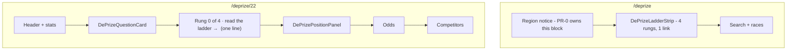

# PR-B′ — Capability ladder module and minimal surfacing

> **This doc was descoped.** The previous version (a four-rung stepper between the question card and
> the position panel, with ladder metadata inside `competitions.ts`) was rated **Weak** by both the
> engineering and the design review and **is not being built**. What ships is B′: one pure module,
> one line on the prize page, one strip on the index. §5 records what was cut and why.

| Field | Value |
|---|---|
| **Status** | Revised — **B′ ready for review**: the pure `capabilityLadder.ts` helper, one provenance line under the question card, and the four-rung strip on the `/deprize` index only. The four-rung stepper is deferred, not descoped-and-forgotten (§5 B6). Prior verdict retained: *Ready with nits*, rated **Weak** by two independent reviews — that rating was earned by the stepper design this revision cut, and the descope is what answers it |
| **Authors** | MoonDAO DePrize engineering |
| **Reviewers** | DePrize product, engineering; **named reviewer required before merge** — `TBD — must be a person` |
| **Decision requested** | Approve shipping the ladder as **one module + one line + one index strip**, and deferring the four-rung stepper until a second rung is a real market (§5 B6) |
| **Last updated** | 2026-09-16 (engineering + design critique revision) |
| **Depends on** | **PR-0** (the index anchor is the block PR-0 rewrites — §6.5) and **A′** for the one spec URL that must resolve. Not blocked on A2 |
| **Must not** | Register First Tracks or Ice on-chain; change betting logic; edit `competitions.ts` except to import from it |
| **Merge slot** | 7th, per the parent plan: PR-0 → PR-1 → A′ → C → F → E → **B′** → D1 → G1 |

---

## 1. One-paragraph summary

Add **one new pure module**, [ui/lib/deprize/capabilityLadder.ts](ui/lib/deprize/capabilityLadder.ts):
a four-entry `CAPABILITY_LADDER` keyed on **`sharedGoalId`** (never a hardcoded DePrize id) and a pure
`getLadderForCompetition(chainSlug, deprizeId)` that derives live ids through the existing memoized
`findDePrizeIdForGoal` in [ui/lib/deprize/competitions.ts](ui/lib/deprize/competitions.ts) (~513).
Surface it in exactly two places: **one line** under the question card on a prize page — *"Rung 0 of 4
· Touchdown — read the capability ladder →"* — and a **four-rung strip on the `/deprize` index only**,
where rungs 1–3 render as plain text with a status chip, not as links. No new field on
`DePrizeCompetition`. No stepper. No `aria-current="step"`. No edits to `competitions.ts` or the
atlas. Night Shift never hrefs the NDA chamber file removed in `ccdf9800f` — now enforced by A′'s
gate 1, not by prose.

---

## 2. Context / background

Competition copy lives in [ui/lib/deprize/competitions.ts](ui/lib/deprize/competitions.ts):
`DePrizeCompetition` has `title`, `tagline`, `metaDescription`, `questionId`, race binding,
`sharedGoalId`, and `supersedes` / `supersededBy`. Lookups are `getDePrizeCompetition`,
`getDePrizeRaceBinding`, `resolveLiveDePrizeId`, `liveTipOf`, and — the one this PR is built on —
**`findDePrizeIdForGoal(chainSlug, sharedGoalId)`** (~513), which is memoized per chain and already
walks `liveTipOf` to return the live tip of a lineage.

That file's own header comment states its contract: seeding `questionId` is what derives the oracle
role (`keccak(caller, questionId, numOutcomes) == conditionId`) and unlocks the admin resolve panel;
`teamId` is the alignment checksum that makes `mapOutcomeOddsToProjectIds` refuse a mismatched
roster; race binding is "chain-keyed here on purpose." It is **on-chain-binding data** and is
reviewed as such. That matters for §5 B4.

Sepolia **#22** is the live Touchdown generation, superseding **#21**. Both carry
`sharedGoalId: 'shared-next-landing'`, so `findDePrizeIdForGoal('sepolia', 'shared-next-landing')`
returns **22** today and returns **23** the instant PR-A's supersede runbook writes the lineage — with
zero edits to this PR's code. Arbitrum **#1** is **"The Moon Is A Harsh Mistress"** — placeholder
teams `[2, 6, 7, 8]`, **not** Touchdown. Do not tag it as rung 0.

The prize page [ui/pages/deprize/[id].tsx](ui/pages/deprize/[id].tsx) renders header →
`DePrizeQuestionCard` → `DePrizePositionPanel` → Odds → Competitors → `ClaimPanel` →
`DePrizeAdminPanel` → lineage. The index
[ui/components/deprize/DePrizeIndexContent.tsx](ui/components/deprize/DePrizeIndexContent.tsx) is
atlas-sourced races plus an optional `LiveDePrizeHero`, with a `bettingBlockedReason` notice
(~127–135) above a search input (~170). **PR-0 is rewriting that notice block**, which is why §6.5
anchors to the search block instead.

Unit tests for the registry are
[ui/cypress/integration/lib/deprize/competitions.cy.ts](ui/cypress/integration/lib/deprize/competitions.cy.ts),
run by `yarn test:deprize` via [ui/scripts/.mocharc-deprize-unit.json](ui/scripts/.mocharc-deprize-unit.json).

---

## 3. Problem statement

Touchdown is rung 0 of a ladder that A′ publishes, and nothing in the product says so. A visitor on
`/deprize/22` cannot tell whether this is MoonDAO's only prize or the first of a series, and a
visitor on `/deprize` sees a list of races with no sense of direction. Downstream, **PR-D's forecast
copy and PR-G's Discord `/odds` embed both need a canonical rung name, bar, and spec URL**, and
without a shared module each will hardcode its own — so a rung rename ships half-applied.

**Honest framing of the user-facing half.** No ticket, metric, or user question is cited for the
visitor need; it is a product bet, and it is stated as one here rather than asserted as a known
problem. That is precisely why v1 spends one line on the prize page instead of a component. The
*downstream-consumer* half of the problem is not a bet: PR-D and PR-G have a concrete duplication
problem today, and the module solves it with zero UI risk.

Who is affected: anyone on `/deprize`, and the PR-D / PR-G implementers.

---

## 4. Goals and non-goals

**Goals**

- A pure, dependency-light `ui/lib/deprize/capabilityLadder.ts`: ordered `CAPABILITY_LADDER` +
  `getLadderForCompetition`, with ids **derived, never stored**.
- Correct behaviour across a supersede, proven by a named test that fails if the ladder resolves the
  wrong id (§6.6 case 2).
- Every non-empty `specHref` proven to resolve to a file that exists, by test (§6.6 case 3).
- One provenance line on the prize page; one four-rung strip on `/deprize`.
- Planned rungs render as **plain text with a status chip**, never as links to files that do not
  exist yet.
- Hand PR-D and PR-G the rung list they would otherwise each hardcode.

**Non-goals**

- **The four-rung stepper on the prize page.** Deferred until a second rung is a live market (§5 B6).
- **Any edit to `competitions.ts`.** B′ imports from it and adds nothing to it — including no
  `ladder?` field on `DePrizeCompetition` (§5 B4).
- **`criteriaNotes` on `DePrizeQuestionCard` and the `atlas.dataset.json` threshold/description
  edits.** These are Touchdown v0.2 copy propagation, not ladder work; they ship with A′ as its
  product-surface companion. The atlas is Moon Base Zero seed data and has its own owner.
- `register` / `prepareCondition` / LMSR for rungs 1–3.
- Changing `evaluateEligibility`, permits, BetModal, or odds math.
- Tagging Arbitrum #1 as Touchdown.
- Publishing specs onto the Legal docs site (`ui/content/docs`). Spec hrefs are GitHub blob URLs.
- Reusing `components/layout/Steps.tsx` or any step semantics (§6.4).

---

## 5. Alternatives considered

### B1. Derive the ladder from `sharedGoalId`, with no new field on `DePrizeCompetition`

- **Reuse:** High. `findDePrizeIdForGoal` already exists, is memoized, and already walks `liveTipOf`.
- **Complexity:** Lower than the alternative — one module, no registry edit.
- **Correctness:** Survives a supersede by construction, because the lineage carries the goal.

**Chosen.** *This reverses the previous draft's rejection, which was made on a false premise.* The
old text rejected B1 because "First Tracks / Ice have no `sharedGoalId` and would be invisible." That
does not follow: the rung **list** comes from `CAPABILITY_LADDER` under either design, and
`sharedGoalId` is only the mechanism for resolving the **live id** of rungs that are actual markets.
Rungs with no goal resolve to no id and render `planned` — which is exactly the behaviour the old
design's status rule wanted anyway. The second stated objection — that a future `shared-night-shift`
goal would make rung 3 look live — is handled by simply not putting a `sharedGoalId` on rung 3 until
product says the chamber prize *is* that rung.

That mis-rejection is what produced both must-fix defects below, so it is recorded rather than
quietly corrected.

### B2. Hardcode the rung list in `DePrizeIndexContent` / `[id].tsx` with no shared helper

- **Complexity:** UI-only, fast.
- **Reuse:** Poor — Discord `/odds` (G1) and PR-D want the same rung list and would each re-type it.
- **Tests:** None possible without a module.

Rejected: the module is the part of this PR with unambiguous value; the UI is the speculative part.

### B3. Register First Tracks / Ice as DRAFT DePrize rows on Sepolia

- **User impact:** Empty markets with 1/N odds look like live prizes.
- **Legal:** Outcome sets freeze at `prepareCondition`.
- **Complexity:** Needs owner key + team NFTs.

Rejected: "Do not register First Tracks/Ice on-chain."

### B4. Ladder metadata as an optional `ladder?` field on `DePrizeCompetition`, inside `competitions.ts` *(previous chosen answer)*

- **Reuse:** Apparently high — one registry, one import.
- **Redundancy:** **Fatal.** Every field on the row (`rung`, `key`, `label`, `deprizeId`, `specHref`)
  duplicates the `CAPABILITY_LADDER` entry with the same `key`, and the design's own consumer rule
  said to **ignore** `competition.ladder.status`. A field whose documented contract is "the reader
  must ignore this" should not exist.
- **Review lane:** `competitions.ts` is the module that decides whether a live market can be resolved
  (`questionId` → oracle role) and whether odds map to the right competitors (`teamId` checksum).
  Colocating a roadmap means an editorial edit to the word "Ice" lands in the same diff-review lane
  as a checksum, and it grows a 649-line load-bearing file for no reuse benefit. Editorial content
  and on-chain-binding data have opposite lifecycles: one changes when product changes its mind and a
  typo is harmless; the other changes on-chain and a typo bricks a resolve.
- **Conflicts:** It puts B in the six-way merge-conflict set on `competitions.ts` and
  `ui/pages/deprize/[id].tsx` alongside A, C, D, E, F, G.

**Rejected in this revision** (it was the previous answer). Replaced by a sibling module with a
one-way dependency: **content → chain, never the reverse.**

### B5. A CMS or content-file layer for rung copy

- **Complexity:** A fetch, a schema, a cache — for four rows.
- **Correctness:** The component must not fetch (it renders inside a page that already has its data).

Rejected: over-engineering. A pure sibling module is the right size for four rows that change when
product publishes a new spec.

### B6. Ship the four-rung stepper on the prize page now *(previous chosen answer)*

- **User impact:** **Fatal on two counts.** (1) Three of four rungs would link to GitHub blob URLs
  that 404 until A′/A2 merge — and the old doc called that "acceptable; do not block the UI." A
  navigation control where three of four destinations are dead teaches the opposite of what it exists
  to teach. (2) Placed between `DePrizeQuestionCard` and `DePrizePositionPanel`, it puts a roadmap
  between the question and the user's own money; on a 390px viewport four rungs of label + bar +
  chip is roughly a full viewport pushing the position panel and the odds chart below the fold, on
  the only page that has a market.
- **Semantics:** `aria-current="step"` tells a screen-reader user they are mid-task in a process
  they are completing. Three of these four steps are not completable by anyone, ever.

**Rejected / deferred.** Revisit when a second rung is a registered market: the stepper then has two
real destinations and a reason to exist, and the step-semantics question disappears with it.

**Chosen overall:** B1's derivation + a sibling module (rejecting B4) + one provenance line and an
index-only strip (rejecting B6).

---

## 6. Proposed design

### 6.1 New module — `ui/lib/deprize/capabilityLadder.ts`

Pure and dependency-light, exactly as `liveTipOf` is, so mocha imports it directly. It imports
`findDePrizeIdForGoal` from `competitions.ts` and **nothing imports it from `competitions.ts`** —
one-way, content → chain.

```ts
import { findDePrizeIdForGoal } from './competitions'

export type DePrizeLadderKey = 'touchdown' | 'first-tracks' | 'ice' | 'night-shift'

/** Three states, each with exactly one producer — see the table below. */
export type DePrizeLadderStatus = 'live' | 'planned' | 'achieved'

// Do **not** pass DEPRIZE_NIGHT_SHIFT.md here (removed from the public tree in ccdf9800f).
// A′'s gate 1 (`rg -n 'DEPRIZE_NIGHT_SHIFT|night-shift-brief' docs/ ui/`) fails the build if anyone does.
const SPEC = (file: string) =>
  `https://github.com/Official-MoonDao/MoonDAO/blob/main/docs/${file}`

export type CapabilityRung = {
  rung: number
  key: DePrizeLadderKey
  label: string
  bar: string
  /** Goal id of the market that satisfies this rung. Absent = not a market. NEVER a DePrize id. */
  sharedGoalId?: string
  /** Empty until the spec file exists on `main`. Empty = render as plain text, not a link. */
  specHref: string
  /** Only producer of `'achieved'`. Set by hand when a goal is retired with no successor. */
  statusOverride?: 'achieved'
}

export const CAPABILITY_LADDER: readonly CapabilityRung[] = [
  {
    rung: 0,
    key: 'touchdown',
    label: 'Touchdown',
    bar: 'Next upright working lunar landing',
    sharedGoalId: 'shared-next-landing',
    specHref: SPEC('DEPRIZE_TOUCHDOWN.md'),
  },
  {
    rung: 1,
    key: 'first-tracks',
    label: 'First Tracks',
    bar: 'First commercial rover egress and drive',
    specHref: '', // A2's own diff sets this in the commit that creates the file
  },
  {
    rung: 2,
    key: 'ice',
    label: 'Ice',
    bar: '2027 in-situ surface water ice',
    specHref: '', // A2's own diff sets this in the commit that creates the file
  },
  {
    rung: 3,
    key: 'night-shift',
    label: 'Night Shift',
    bar: 'Chamber proxy now · surface night 2028+',
    specHref: '', // permanently: its only correct target is the ladder page, which the strip already links
  },
]
```

**Why no id is stored.** The previous design hardcoded `deprizeIdByChain: { sepolia: 22 }`, and PR-A's
nine-step supersede runbook contains **no step that updates it**. After a supersede to #23 the
`current` comparison `23 === 22` goes false — the live prize page would render a ladder with no
current rung — and the rung-0 link would point at `/deprize/22`, a **superseded market where new bets
are closed**. A component whose only job is orientation would actively misdirect, on exactly the
event PR-A calls the normal lifecycle. Keying on `sharedGoalId` makes that case correct by
construction: both #21 and #22 carry `shared-next-landing`, PR-A §6.3(f) step 3 carries it onto #23,
and `findDePrizeIdForGoal` returns the tip.

**`specHref: ''` on rungs 1–3 is deliberate,** not a placeholder to fill in later by hand. A rung
renders as a link **only** when `specHref` is non-empty, so a file that does not exist cannot be
linked. A2's diff — the diff that knows the URL is valid because it creates the file — flips First
Tracks and Ice. That removes the merge-ordering dependency in both directions instead of documenting
it away.

**Status producers.** Every state is reachable, and nothing else is in the union. The previous design
carried a `'draft'` member that no code path could produce, so an implementer would have designed and
styled a chip nobody could ever see.

| Status | Sole producer |
|---|---|
| `live` | `sharedGoalId` is set **and** `findDePrizeIdForGoal(chainSlug, sharedGoalId)` returns an id |
| `planned` | no `sharedGoalId`, or it resolves to no id on this chain |
| `achieved` | explicit `statusOverride: 'achieved'` — a hand edit, made when a goal is retired with no successor (PR-A §6.3 f) |

A **withdrawn** rung is removed from `CAPABILITY_LADDER` entirely; its spec file keeps a `WITHDRAWN`
header rather than 404ing. There is no `withdrawn` chip to style.

### 6.2 `getLadderForCompetition`

```ts
export type LadderRung = {
  rung: number
  key: DePrizeLadderKey
  label: string
  bar: string
  status: DePrizeLadderStatus
  /** Present only when status === 'live'. */
  deprizeId?: number
  /** '/deprize/<id>' when live; specHref when non-empty; otherwise undefined → render as text. */
  href?: string
  current: boolean
}

export type LadderForCompetition = {
  rungs: LadderRung[]
  currentKey: DePrizeLadderKey | undefined
}

export function getLadderForCompetition(
  chainSlug: string,
  deprizeId: number | undefined,
  // Seam for the supersede test (§6.6 case 2). Defaults to the real registry lookup.
  deps: { findDePrizeIdForGoal: typeof findDePrizeIdForGoal } = { findDePrizeIdForGoal }
): LadderForCompetition
```

Rules:

1. Build `rungs` from `CAPABILITY_LADDER` in order.
2. `liveId` = `rung.sharedGoalId ? deps.findDePrizeIdForGoal(chainSlug, rung.sharedGoalId) : undefined`.
3. `status` = `statusOverride` ?? (`liveId != null ? 'live' : 'planned'`). There is no other source of
   truth — in particular no per-competition-row field, because none exists (§5 B4).
4. `href` = `/deprize/${liveId}` when `liveId` exists; else `specHref` when non-empty (off-site, open
   in a new tab); else **undefined**, and the renderer must emit plain text.
5. `current` is true when `liveId != null && resolveLiveDePrizeId(chainSlug, deprizeId) === liveId`.
   Passing a superseded id (#21) still marks rung 0 current and still links **#22**, because both
   sides of the comparison resolve through the lineage.
6. Unknown / unbound competitions (`undefined`, or Arbitrum #1): all rungs `current: false`,
   `currentKey` undefined. Still return the full ladder so the index strip renders.

Keep the function **pure** — no fetch, no React, no `window`. `findDePrizeIdForGoal` is already
memoized per chain, so calling this on every render is cheap.

**What happens on a supersede or a resolution.**

| Event | Ladder behaviour | Manual step |
|---|---|---|
| #22 superseded by #23 (PR-A §6.3 f) | Step 3 carries `sharedGoalId` onto #23; `findDePrizeIdForGoal` returns 23; rung 0 stays `live` and links `/deprize/23` | **None.** This is the whole point of §5 B1 |
| #22 resolves, a new generation opens under the same goal | Same as above — the ladder follows the tip | None |
| #22 resolves and the goal is retired with no successor | No id resolves; the rung would silently fall back to `planned`, which is wrong for a capability that was just demonstrated | Set `statusOverride: 'achieved'` on that rung. **The only manual ladder edit in the system**; it belongs on the resolution checklist, and PR-A §6.3(f) names it |
| A rung's prize is withdrawn before registering | Remove the entry from `CAPABILITY_LADDER`; the spec keeps a `WITHDRAWN` header | One-line deletion |

The module is pure and static, so it cannot read on-chain state: it reports what the **registry**
knows, not what the chain knows. That is the right scope for a roadmap — `DePrizeState` belongs to
the prize page, not the ladder — and it is stated here so nobody later tries to make the chip
authoritative about resolution.

### 6.3 Prize page — one provenance line, no stepper

Under `DePrizeQuestionCard`, for a competition whose `currentKey` is defined, render **one line** of
text using existing card chrome:

> Rung 0 of 4 · Touchdown — next upright working landing · **Read the capability ladder →**

One link, one destination: `DEPRIZE_CAPABILITY_LADDER.md`, the single URL A′ guarantees exists. It
cannot 404 in three places, it is roughly 24px rather than a full mobile viewport, so it does not push
`DePrizePositionPanel` below the fold, and there is no step list so there is no `aria-current`
question. When `currentKey` is undefined (Arbitrum #1, unbound ids) render **nothing**.

This is a `<p>` with an `<a>`, not a component with a props API. If it grows past one line, that is
the signal to revisit §5 B6 rather than to grow this.

### 6.4 `DePrizeLadderStrip.tsx` — index only

New [ui/components/deprize/DePrizeLadderStrip.tsx](ui/components/deprize/DePrizeLadderStrip.tsx).

```ts
{ chainSlug: string }
```

Calls `getLadderForCompetition(chainSlug, undefined)`. Does not fetch. Renders four rungs — number,
label, one-line `bar`, status chip — plus one trailing link, *"Read the capability ladder →"*.

**Markup and semantics.** A `<section aria-labelledby>` wrapping a plain `<ul>`. **Not** `<ol>`,
**not** `components/layout/Steps.tsx`, **not** `aria-current="step"` — this is a product roadmap, not
a process the visitor is completing, and step semantics would tell a screen-reader user they are
mid-task on a page where three of the four "steps" are not completable by anyone. Mark the live rung
with `aria-current="true"` plus `<span className="sr-only">Current prize</span>` alongside its visible
chip.

**Links.** A rung is an `<a>` only when `href` is defined (§6.2 rule 4); otherwise it is a `<span>`.
In v1 that means exactly one rung is a link. Off-site hrefs get `target="_blank"` +
`rel="noopener noreferrer"`.

**Chip tokens (specified, because the obvious choice fails).** The page's small-text neutral,
`text-gray-500`, measures **3.69:1** on the card background and fails WCAG AA. Chip text must be
≥ 4.5:1 and the chip border ≥ 3:1 against the card:

| Status | Text | Fill | Border |
|---|---|---|---|
| `live` | `text-emerald-200` | `bg-emerald-500/10` | `border-emerald-400/40` |
| `planned` | `text-gray-300` | `bg-white/5` | `border-white/20` |
| `achieved` | `text-sky-200` | `bg-sky-500/10` | `border-sky-400/40` |

Verify the final pair with a contrast checker before merge; the tokens above are the starting point,
not an unchecked assertion.

**Responsive.** Horizontal on `sm`+, stacked below. Four short rows on the index is acceptable — the
index has no position panel to push down and the visitor is browsing, so a roadmap is on-topic there.
That is the reason the strip lives here and not on the prize page.

### 6.5 Placement

**Prize page** — [ui/pages/deprize/[id].tsx](ui/pages/deprize/[id].tsx): the one line from §6.3,
immediately after `<DePrizeQuestionCard … />`. One JSX expression, no new import beyond the helper.

**Index** — [ui/components/deprize/DePrizeIndexContent.tsx](ui/components/deprize/DePrizeIndexContent.tsx):
mount `<DePrizeLadderStrip />` **immediately above the search input block** (~170), full width.
Deliberately *not* anchored to "after the region notice": that notice (~127–135, built from
`useRegionRestriction`) is the exact block **PR-0 rewrites** to read the DePrize restricted list
instead of the EU/EEA flag. Anchoring to the search block keeps B′ out of PR-0's diff; B′ also
sequences after PR-0 in the merge order, so if the anchor still moves, PR-0's version is what B′
rebases onto. Always show the strip, not only when a featured live id exists.



### 6.6 Tests — `ui/cypress/integration/lib/deprize/ladder.cy.ts`

Mocha + the existing cypress-expect setup (see `competitions.cy.ts`). The glob
`cypress/integration/lib/deprize/*.cy.ts` already matches, so `yarn test:deprize` picks it up.

**The two that matter are 2 and 3.** Case 2 is the named test that fails if the ladder resolves the
wrong id — *it could not have been written at all against the previous design*, which is the
strongest argument for §5 B1.

1. `'CAPABILITY_LADDER has four rungs, 0..3, in order touchdown → first-tracks → ice → night-shift'`
   — a change-detector on purpose: adding a rung must be a deliberate edit, and the test name says so.
2. **`'survives a supersede: with 23 superseding 22 under the same goal, getLadderForCompetition("sepolia", 23) keeps touchdown current and hrefs /deprize/23'`**
   — inject a stub `findDePrizeIdForGoal` returning `23` via the §6.2 `deps` seam. Assert
   `status === 'live'`, `current === true`, `href === '/deprize/23'`, `currentKey === 'touchdown'`.
   **This is the test that fails if the ladder resolves the wrong id.** Also assert the negative: no
   rung's `href` ever contains the superseded id.
3. **`'every non-empty specHref resolves to a file that exists under docs/'`** — derive the filename
   from each `specHref` and assert `fs.existsSync(path.join(repoRoot, 'docs', file))`. ~5 lines. It
   fails loudly on a merge-day 404, on an A′/A2 rename, and on a typo — and it makes A′'s
   link-resolution gate executable from this side too.
4. `'getLadderForCompetition("sepolia", 22): touchdown is live, current, href /deprize/22'`.
5. `'getLadderForCompetition("sepolia", 21): touchdown still current via lineage; href points at 22, not 21'`
   — passes for free under the derived design.
6. `'planned rungs have no href and no deprizeId'` — First Tracks, Ice, Night Shift: `status === 'planned'`,
   `href === undefined`, so the renderer cannot emit a link.
7. `'no ladder entry references the chamber spec'` — no `specHref` contains `NIGHT_SHIFT`; rung 3's
   `specHref` is `''`. Redundant with A′'s gate 1 by design: a repo-wide grep and a unit assertion
   fail in different places, and the unit test is the one that fires in a library author's editor.
8. `'getLadderForCompetition("arbitrum", 1): no current key, touchdown not live on this chain'`
   — Harsh Mistress is not on the ladder.
9. `'getLadderForCompetition("sepolia", undefined) returns four rungs, none current'` — the index case.
10. `'every status value in the union has a producer'` — assert the three states are exactly
    reachable via: a resolving goal, no goal, and `statusOverride`.

Do not call `evaluateEligibility`. Do not import BetModal.

---

## 7. Step-by-step implementation plan

1. Write `ui/lib/deprize/capabilityLadder.ts` per §6.1 and §6.2. **Do not touch `competitions.ts`** —
   the only contact is `import { findDePrizeIdForGoal } from './competitions'`. If that import needs
   an export added, that single-line export is the entire allowed diff to that file.
2. Write `ladder.cy.ts` per §6.6 — **cases 2 and 3 first**, before the component exists — and run
   `yarn test:deprize` from `ui/` until green. `competitions.cy.ts` must be untouched and still pass;
   if it breaks, something edited the registry and step 1 was violated.
3. Add the one-line provenance render in `[id].tsx` per §6.3. One JSX expression; no new props on
   `DePrizeQuestionCard`.
4. Create `DePrizeLadderStrip.tsx` per §6.4. Presentational; `<ul>`, no step semantics; links only
   when `href` is defined; chip tokens from the table.
5. Mount the strip above the search block in `DePrizeIndexContent` per §6.5, rebased on PR-0.
6. `yarn lint` on the touched TS/TSX files.
7. **Browser verification (required):** `/deprize` on Sepolia — strip visible, four rungs, only
   Touchdown `live`, rungs 1–3 are **plain text with a chip and no link**, the trailing ladder link
   opens `DEPRIZE_CAPABILITY_LADDER.md`. `/deprize/22` — one provenance line under the question card,
   **`DePrizePositionPanel` still above the fold at 390px** (this is the regression the descope
   exists to prevent — screenshot it). `/deprize/21` — superseded banner still works; the line still
   reads "Rung 0" and the ladder link still works. `/deprize/1` on Arbitrum — **no** provenance line.
   Confirm BetModal / odds / cash-out unchanged. The featured hero may still be Harsh Mistress
   (`getFeaturedLiveDePrizeId`) while the strip shows Touchdown `live` — **not a bug**.
8. Screenshot the index strip and the mobile prize page for the PR.

---

## 8. Testing, rollout, and feature flags

- **Unit:** `yarn test:deprize` — new `ladder.cy.ts` (§6.6) plus the untouched `competitions.cy.ts`.
- **Browser:** step 7. Restricted-region visitors still see the strip; it is not betting.
- **Flags:** none, and none needed — **removal is two line-deletions**: the `<DePrizeLadderStrip />`
  mount in `DePrizeIndexContent` and the provenance expression in `[id].tsx`. The module is inert
  when nothing renders it. An on-call asking "how do I turn this off" has a one-line answer, which is
  why a flag would be ceremony.
- **Rollout:** merge slot 7, after **PR-0** (index anchor) and **A′** (the one spec URL). The old
  plan's "if PR-A is late, blob URLs will 404 — acceptable" is gone: rungs 1–3 carry `specHref: ''`
  and cannot render a link at all, so a late A2 degrades to plain text rather than to a 404. Rung 0's
  single link is the only ordering constraint, and case 3 fails the build if it is not satisfied.
- **Moved out of this PR:** `criteriaNotes` on `DePrizeQuestionCard` and the `shared-next-landing`
  threshold + `description` edits in `atlas.dataset.json` now ship with A′ (§4 non-goals). They are
  Touchdown v0.2 copy propagation, the atlas is Moon Base Zero seed data with its own owner, and A′
  holds the canonical wording those copies must match.

---

## 9. Risks and open questions

| Risk / question | Default |
|---|---|
| The visitor-facing need is a product bet with no cited evidence | Stated as a bet in §3. Mitigated by spending one line rather than a component; the module's value to PR-D/PR-G does not depend on the bet |
| A2 never ships, so rungs 1–3 never become links | Fine. They render as plain text with a `planned` chip indefinitely; nothing 404s |
| Someone later re-adds a hardcoded id "just for now" | Case 2 fails. Case 2 is the reason it exists |
| A goal is retired with no successor and the rung silently reads `planned` | Set `statusOverride: 'achieved'`; named on PR-A's resolution checklist (§6.2) |
| PR-0 moves the index anchor again | B′ merges after PR-0 and anchors to the search block, not the region notice |
| Chip contrast | Tokens specified in §6.4; verify with a checker before merge — `text-gray-500` at 3.69:1 is the trap |
| Night Shift chamber prize later gets a real market | Still `planned` here until product adds a `sharedGoalId` deliberately; still never a `DEPRIZE_NIGHT_SHIFT.md` href (case 7 + A′ gate 1) |
| Featured hero is Harsh Mistress while Touchdown is `live` on the strip | Intended; `getFeaturedLiveDePrizeId` is unchanged |
| Stepper pressure returns before a second rung is real | §5 B6 is the record: it is deferred, not forgotten, and the precondition is named |

---

## 10. Cross-cutting constraints

See [deprize-engineering-constraints.md](deprize-engineering-constraints.md) for the shared
constraints that apply to every PR in this program (workspace boundaries, `*.local.md`, `hashIp`,
`evaluateEligibility` purity, Redis persistence, API auth, crons, the `yarn test:deprize` glob, and
the prize-page anatomy).

B′-specific notes on top of those:

- **`competitions.ts` is off-limits.** The one-way dependency is content → chain. B′ imports
  `findDePrizeIdForGoal` and adds nothing to the registry, which also takes B′ out of the six-way
  merge-conflict set on that file and on `ui/pages/deprize/[id].tsx`.
- The prize page gains **one line**, not a section, so the anatomy in the shared doc is unchanged.
- `capabilityLadder.ts` must stay importable by mocha with no React, no fetch, and no `window`.

---

## Review response (2026-09-16)

Accepted from the independent correctness review:

- **Blocker — Night Shift `specHref`.** Rung 3 never references `DEPRIZE_NIGHT_SHIFT.md`. *Strengthened
  in this revision:* its `specHref` is now `''` (the ladder page is the strip's single link), asserted
  by case 7 and by A′'s repo-wide gate 1.
- **Should-fix — livestream claim.** Moot here: `criteriaNotes` left this PR (§4 non-goals). The
  "do not replace livestream copy that is not there" warning travels with it to A′.
- **Should-fix — unused per-row `status`.** *Superseded:* the entire per-row `ladder?` field is gone
  (§5 B4), so there is no row status to drop.
- **Should-fix — atlas description.** Moved to A′ with the rest of the v0.2 copy propagation.
- **Nit — GitHub blob 404 until A merges.** *Superseded:* empty `specHref` means planned rungs cannot
  render as links, so there is nothing to 404.
- **Nit — featured hero is Harsh Mistress.** Documented so QA does not file a bug.

---

## Revision log (2026-09-16)

Addressing [pr-design-docs-eng-critique-a-b.md](pr-design-docs-eng-critique-a-b.md) (verdict: **Weak
— do not ship as written**) and the PR-B section of
[pr-design-docs-ux-critique.md](pr-design-docs-ux-critique.md) (also **Weak**).

- **B-M1 — the supersede bug is fixed at the root.** `deprizeIdByChain: { sepolia: 22 }` is gone.
  Rungs key on `sharedGoalId` and ids are derived through the existing memoized
  `findDePrizeIdForGoal`, so a supersede to #23 is correct with zero edits (§6.1, §6.2). §6.2 adds a
  table of what the ladder does on supersede, resolution, retirement, and withdrawal.
- **B-M2 — `ladder?: DePrizeLadderMeta` deleted.** Every field duplicated the `CAPABILITY_LADDER`
  entry with the same key, and the old consumer rule told readers to ignore one of them. One source
  of truth (§5 B4).
- **B-M3 — metadata moved to `ui/lib/deprize/capabilityLadder.ts`.** Editorial roadmap copy no longer
  shares a review lane with `questionId` (oracle role) and `teamId` (odds checksum). B′ now touches
  `competitions.ts` only to import, which also removes it from the six-way conflict set on
  `ui/pages/deprize/[id].tsx` (§5 B4, §10).
- **B-S1 / UX "never render a 404 as a link" — structural, not documented away.** Rungs 1–3 ship
  `specHref: ''`; a rung is a link only when `specHref` is non-empty; A2's own diff flips them.
- **B-S2 — index anchor moved off PR-0's block** to the search block, with the dependency stated (§6.5).
- **B-S3 — `criteriaNotes` + atlas edits left this PR** and ship with A′ (§4, §8).
- **B-S4 — the two missing tests are now the two headline tests**, named in §6.6 as cases 2 and 3,
  written before the component.
- **B-S5 — removal path stated:** two line-deletions, no flag (§8).
- **B-C1 — the problem statement no longer asserts an unevidenced user need.** §3 marks the visitor
  half as a product bet and separates it from the concrete PR-D/PR-G duplication problem.
- **B-C2 — B1's false-premise rejection reversed and recorded**, not silently swapped (§5 B1).
- **UX must-fix — the stepper is gone.** One provenance line on the prize page, four-rung strip on the
  index only, so nothing pushes `DePrizePositionPanel` below the fold (§5 B6, §6.3, step 7).
- **UX must-fix — `aria-current="step"` dropped.** Plain `<ul>`, `aria-current="true"` plus an sr-only
  "Current prize" on the live rung; `components/layout/Steps.tsx` explicitly not reused (§6.4).
- **UX should-fix — `'draft'` removed from the status union**, and every remaining state has exactly
  one named producer (§6.1).
- **UX should-fix — chip colour tokens specified** with a ≥4.5:1 text / ≥3:1 border requirement, and
  the `text-gray-500` trap called out by name (§6.4).
- **Process hygiene — status corrected** from "Ready with nits" to a descoped revision, with a stated
  decision request and a named-reviewer merge gate.
- **Cross-cutting constraints** replaced with a link to
  [deprize-engineering-constraints.md](deprize-engineering-constraints.md).

**Not applied, with reasons.**

- **UX's "move the provenance line to the footer slot."** The brief for this revision places the one
  line under the question card, and the fold argument that motivated the footer was about a four-rung
  stack, not a single 24px line — provenance is also more useful next to the question it qualifies
  than buried under the admin panel. Step 7 makes the position panel's above-the-fold position a
  required check, so if the line does cost the fold, verification catches it and the footer is the
  fallback. Product's call, recorded rather than decided silently.
- **UX's "attach each v0.2 note under its own criterion"** in the criteria accordion. Correct, but
  `criteriaNotes` left this PR under B-S3; the finding travels to A′'s product-surface companion.
- **Naming the reviewer.** Same as A′: this doc cannot invent a person. The slot is explicit and
  marked as a merge gate.

**Cross-document consistency pass**

- **A current verdict for B′.** The Status row recorded the descope but stated no reviewability
  verdict, so B′ read as revised-into-limbo next to A′'s "ready for review." It now reads **ready for
  review** against the descoped scope — the pure `capabilityLadder.ts` helper, one provenance line
  under the question card, and the index-only four-rung strip — while keeping the prior *Ready with
  nits* / **Weak** history visible and attributing that rating to the stepper design §5 B6 cut.
- **Merge-order label corrected: `D′` → `D1`** in the Merge slot row. `D1` is the canonical label used
  by the parent plan, PR-D, PR-E, PR-F, and PR-G. B′'s position (7th, before D1) is unchanged.
