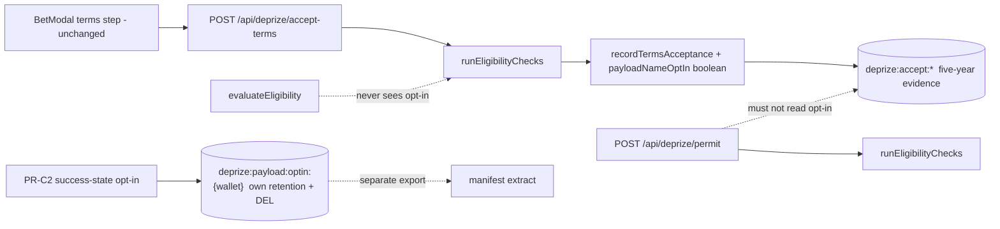

# PR-C — Payload purse

| Field | Value |
|---|---|
| **Status** | **PR-C: Ready** (copy mode + tier helper + runbook). **PR-C2: Blocked — do not start** (display-name opt-in; gated, see §4 and §6.6) |
| **Authors** | MoonDAO DePrize engineering |
| **Reviewers** | Counsel gate owner: **`<name>` — a person, not "Counsel"** (see §9, merge blocker). Product owner for the tier brackets: **`<name>`** (§6.4). Engineering reviewer: **`<name>`** |
| **Last updated** | 2026-09-16 (engineering-critique revision — see Revision log) |
| **Depends on** | **PR-0** (geo gate fix; merges first), **PR-1** (prize-pool slot container), **A′** (canonical waterfall / Test-4 wording so C's draft is not hand-copied). Merges at position 4 in the program order; **must precede PR-F and PR-E** (shared `BetModal.tsx` and header-grid slot) |
| **Blocks** | PR-F (BetModal layout), PR-E (prize-pool slot container) |
| **Must not** | Bump `DEPRIZE_TERMS_VERSION` unless counsel-approved text lands; feed opt-in fields into eligibility or permits; put a user-supplied display name on `AcceptanceRecord` (see §5 C3) |

---

## 1. One-paragraph summary

**PR-C** drafts the prize pool as a **payload purchase** (nameplate → data capsule → larger slot as the pool grows) rather than a cheque to a CLPS operator — **in `docs/` only, pending counsel** — and makes the legal state of that claim a *derived, testable property of the code* instead of prose discipline. A pure `payloadCopyMode(DEPRIZE_TERMS_VERSION)` returns `'proposed'` or `'in-force'`; every payload surface renders from that mode. The code therefore merges **without counsel**, in `'proposed'` mode, and counsel approval later is a one-constant edit rather than a six-file copy hunt. PR-C also adds pure `describePayloadTier(poolUsd)`, one always-visible disclosure sentence under the header stats grid (not a `title` tooltip), and the procurement runbook `docs/DEPRIZE_PAYLOAD_PURSE.md`.

**PR-C2** — the optional payload **display-name opt-in** — is split out and **does not ship with PR-C**. It requires its own Redis store with its own retention clock and erasure path, a grapheme-cluster allowlist sanitizer, escaping at every sink (PR-G renders the same string into Discord embeds), and a **named human moderator**. PR-C may land the consent *boolean* on `AcceptanceRecord`; the *name* waits for C2's three preconditions.

---

## 2. Context / background

Bettors already send ~5% of each bet to the bound Juicebox project (`SLICE_DENOMINATOR` in [ui/lib/deprize/quote-math.ts](ui/lib/deprize/quote-math.ts); router comment in [ui/components/deprize/BetModal.tsx](ui/components/deprize/BetModal.tsx)). The pool number on the prize page is `useTotalFunding(jbProjectId)` in [ui/pages/deprize/[id].tsx](ui/pages/deprize/[id].tsx), labeled **"Prize pool · to winner"** with tooltip "Paid to the winning competitor when the race settles."

`LiveDePrizeHero` and `RaceMarketCard` show a generic **"prize pool"** label ([ui/components/deprize/LiveDePrizeHero.tsx](ui/components/deprize/LiveDePrizeHero.tsx) ~166, [ui/components/deprize/RaceMarketCard.tsx](ui/components/deprize/RaceMarketCard.tsx) ~589 / ~678). BetModal disclosure: **"5% of every bet funds this DePrize's launchpad prize pool"**.

That is **six surfaces** carrying the same claim. §6.3 of the previous revision of this doc asked an implementer to hand-edit a legal hedge into each of them while §8 said "Flags: none." §6.2 below replaces that with one derived value.

Published legal docs:

| Doc | Path | Version constant |
|---|---|---|
| Terms | [ui/content/docs/Legal/DePrize/DePrize Terms and Conditions.md](ui/content/docs/Legal/DePrize/DePrize%20Terms%20and%20Conditions.md) | `DEPRIZE_TERMS_VERSION = '1.1'` in [ui/lib/deprize/constants.ts](ui/lib/deprize/constants.ts) |
| Prize Rules | [ui/content/docs/Legal/DePrize/DePrize Official Prize Rules.md](ui/content/docs/Legal/DePrize/DePrize%20Official%20Prize%20Rules.md) | Version 1.0, pending counsel |
| Risk Disclosures | [ui/content/docs/Legal/DePrize/DePrize Risk Disclosures and Disclaimers.md](ui/content/docs/Legal/DePrize/DePrize%20Risk%20Disclosures%20and%20Disclaimers.md) | — |
| Internal pointer | [ui/docs/DEPRIZE_TERMS_AND_CONDITIONS.md](ui/docs/DEPRIZE_TERMS_AND_CONDITIONS.md) | Says "edit the published documents, not this file" |

Prize Rules **§6.3** currently: the Prize "is paid in ETH … to the Winner's designated wallet. No cash or fiat alternative is offered." Terms **§7.5** talk about milestone tranches to the Prize-Eligible Winner. That is the cheque framing GTM G6 warned about.

**The acceptance log is an evidence artifact, and that is why C2 exists.** [ui/lib/deprize/acceptanceLog.ts](ui/lib/deprize/acceptanceLog.ts) writes each `AcceptanceRecord` **twice**: `SET` on `deprize:accept:latest:*` and `LPUSH` onto `deprize:accept:history:*`. The history list is append-only *by design* — that is what makes it evidence. [ui/scripts/export-deprize-compliance-log.ts](ui/scripts/export-deprize-compliance-log.ts) (`yarn export:deprize-compliance`) dumps acceptance list values **as-is** to counsel, and the record carries a five-year retention clock. Records are written only by [ui/pages/api/deprize/accept-terms.ts](ui/pages/api/deprize/accept-terms.ts), after gates on `accepted`, `termsVersion === DEPRIZE_TERMS_VERSION`, `areAttestationsAccepted` ([attestations.ts](ui/lib/deprize/attestations.ts)) and `runEligibilityChecks`.

`evaluateEligibility` in [ui/lib/deprize/eligibility.ts](ui/lib/deprize/eligibility.ts) is a pure function of country / VPN / sanctions / deny / insider. It must stay that way.

USD formatting already exists: `fmtUsdFromEth` / `EthUsd` / `useETHPrice`.

---

## 3. Problem statement

The product has decided the purse buys a **community payload** on a future flight (PR-A waterfall). The UI and legal text still say the pool is paid to the winning organization. That is the "Voyager Technologies accepts $25,000" story, which induces nothing and invites the G6 journalist question.

Two second-order problems follow from *how* we say the payload thing:

1. **The claim is only true at Terms 1.2, and its truth changes on a date nobody controls.** A hedge implemented as prose in six components has no single flip. Missing one surface on the day counsel approves produces a page that says both "proposed, Terms v1.1 govern" and "buys the payload" simultaneously — the exact contradiction the hedge existed to prevent. There is no test that can fail on that.
2. **Collecting a display name for the manifest is a data-protection decision, not a copy change.** It has a retention period, an erasure obligation, an impersonation surface, and (via PR-G) a Discord rendering sink. None of those belong to the same PR as a stat label.

Who is affected: bettors (what they think 5% buys), counsel, the Safe that will sign an operator payload agreement, and compliance export.

---

## 4. Goals and non-goals

### PR-C goals (this PR)

- Draft legal language for the waterfall + optional manifest name, marked **pending counsel**, in `docs/` (not the click-wrap target).
- Keep `DEPRIZE_TERMS_VERSION` at `'1.1'`. Add pure `payloadCopyMode(termsVersion)` so the version constant *is* the switch.
- Every payload-bearing surface renders from the mode — **one string per surface per mode**, no implementer choice.
- One **always-visible** disclosure sentence under the header stats grid saying where the 5% goes and that the payload change is a draft. Not a `title` attribute.
- Pure `describePayloadTier(poolUsd)` with an `'unknown'` tier, $500 rounding, a named owner and a revisit trigger.
- `docs/DEPRIZE_PAYLOAD_PURSE.md` runbook, including the dated tier decision and the manifest-export moderation step.
- Optional `payloadNameOptIn` **boolean** on `AcceptanceRecord` (consent timestamp in the legal log) — **no name**.
- Tests: tier cases, copy-mode property, and the two eligibility/permit **leak tests** named in §6.7.

### PR-C2 goals (separate, gated follow-up)

PR-C2 collects and stores the payload **display name**. It does not start until all three preconditions are recorded in `docs/DEPRIZE_PAYLOAD_PURSE.md`:

| Precondition | Why it gates |
|---|---|
| A **named moderator** and a queue for manifest-name review | "MoonDAO may refuse" with no owner is not a control. Impersonation is not a sanitization problem |
| A **decided retention period** for the name, distinct from the acceptance record's five years | Nobody chose five years for a nickname |
| A working **erasure path** (`DELETE` endpoint + operational runbook step) | Erasure must never require rewriting the append-only compliance history |

Design for C2 is specified in §6.6 so the interface is settled now and the store is not improvised later.

### Non-goals (both)

- Changing `evaluateEligibility`, `runEligibilityChecks`, permit issuance, or the 1 ETH cap (`DEPRIZE_MAX_BET_WEI`).
- On-chain payload escrow or a new Solidity payee.
- Bumping Terms version "to be safe."
- Making the opt-in required to bet.
- Implementing the Safe ↔ operator contract (runbook only).

---

## 5. Alternatives considered

### C1. Treat the payload story as unqualified live UI until counsel rewrites Terms

- **Legal:** UI would contradict Prize Rules §6.3 (ETH to winner's wallet) and Terms §7.5 / Prize Rules §9 (30/70 ETH milestone wires).
- **User impact:** Bettors see "buys the payload"; click-wrap still binds v1.1 cheque language.
- **Complexity:** Lowest — and this is the failure mode the review named.

Rejected. Draft the legal text in `docs/`. Live chrome renders from `payloadCopyMode`. A "Proposed 1.2" banner next to unqualified "buys the payload" product speech does **not** save you.

### C2. Bump to Terms 1.2 immediately with engineering's draft

- **Legal:** Acceptance keys on `DEPRIZE_TERMS_VERSION` (`accept-terms` and `permit` reject a mismatched version). A bump re-prompts every wallet and implies the draft is live.
- **Compliance:** Export and attestations assume the published version.

Rejected until counsel approves. Note that with §6.2 the bump is now a *deliberate, single, reviewable* edit rather than a coordination exercise — which is the point.

### C3. Where the display name lives — **decision reversed**

**Chosen: a separate store, `deprize:payload:optin:{wallet}`**, modeled on [ui/lib/deprize/complianceStore.ts](ui/lib/deprize/complianceStore.ts), with its own retention clock and its own `DEL` path (§6.6). Shipped as **PR-C2**.

**Rejected: optional `payloadDisplayName` on `AcceptanceRecord`** (the previous chosen option). The previous rejection reason for a separate store — *"two writes, two export paths"* and *"easy to accidentally read it in eligibility if it lives next to deny-lists"* — was backwards on both counts, and the record-based option fails on five grounds:

| Failure | Detail |
|---|---|
| **Unerasable** | The name rides an `LPUSH`-ed, append-only history list. Erasure would mean mutating or filtering the one data structure whose value is that it is never rewritten |
| **Exported to counsel** | `export-deprize-compliance-log.ts` dumps acceptance values as-is; a marketing consent artifact lands in a legal extract |
| **Wrong retention** | Five years, inherited, because the carrier is a five-year artifact. Nobody decided five years was right for a nickname on a plaque |
| **Unreachable for existing users** | Fields are written only by `accept-terms`, which gates on the current `termsVersion`, attestations and `runEligibilityChecks`. Anyone who already accepted cannot opt in without a fresh accept; a restricted user can never opt in at all |
| **Revocation does not work** | Unchecking writes a *new* record; the old record carrying the name stays in the history list forever |

On the two original objections: **two export paths is the feature.** The manifest extract *should* be a different artifact from the compliance extract, with a different retention clock and a delete endpoint. And a distinct `deprize:payload:optin:` prefix is *harder* to leak into eligibility than a field hanging off the record the eligibility-adjacent path already writes.

**Kept from the rejected option:** an optional `payloadNameOptIn?: boolean` on `AcceptanceRecord`, so the consent *timestamp* is in the legal log. The name is not.

### C4. Put names on-chain / Tableland for the manifest

- **Complexity / cost:** Unnecessary before a flight is booked.
- **Privacy:** Harder to honor an opt-out — an immutable ledger is the worst possible carrier for erasable personal data.

Rejected: Redis + a scoped export is enough until procurement.

### C5. A feature flag for the payload copy — **rejected**

The task posed the fork as "feature flag vs conditional copy." Both are wrong, and the flag is wrong for reasons worth recording, because it is the option a future agent will reach for:

- **Env-scoped.** Flags are per-environment. Staging and production can disagree about what the legal posture is.
- **Flippable by anyone with dashboard access**, with no review and no audit trail tied to the legal artifact.
- **Uncoupled from the thing that makes the copy true.** You could serve in-force payload language on a build still serving Terms 1.1 — precisely the blocker the prior review raised. The flag's value and `DEPRIZE_TERMS_VERSION` are two independent variables that must agree, and nothing forces them to.
- **Not a property.** "No surface shows unqualified payload copy at Terms 1.1" is not expressible as a test, because the flag is runtime configuration, not an input to a pure function.

Rejected in favour of C6.

### C6. Derive the copy mode from `DEPRIZE_TERMS_VERSION` — **chosen**

- **One flip:** the counsel-approved version bump. Which is already the change counsel's approval authorizes.
- **Drift impossible by construction:** the copy cannot claim in-force status on a build serving 1.1, because the same constant produces both.
- **Rollback is reverting one constant.**
- **Testable:** *"for `termsVersion = '1.1'`, no exported copy string is unqualified payload copy"* is a unit test that fails on the C1 failure mode.
- **Cost:** one pure function, and every surface must read from it rather than inlining a string. That refactor is the whole PR's diff and it is small.

**Chosen overall:** counsel drafts in `docs/DEPRIZE_PAYLOAD_PURSE.md` (not click-wrap) + `payloadCopyMode`-driven surfaces + one always-visible disclosure sentence + `describePayloadTier` + consent boolean only + runbook. Version stays 1.1. Display-name collection is **PR-C2**.

---

## 6. Proposed design

### 6.1 Legal drafts (do not bump version; do not edit the click-wrap target)

**Do not** put Proposed 1.2 on the click-wrap file [ui/content/docs/Legal/DePrize/DePrize Terms and Conditions.md](ui/content/docs/Legal/DePrize/DePrize%20Terms%20and%20Conditions.md) (`DEPRIZE_TERMS_URL` / BetModal). Draft counsel text lives in [docs/DEPRIZE_PAYLOAD_PURSE.md](docs/DEPRIZE_PAYLOAD_PURSE.md) (and optionally another `docs/` draft that is **not** the published Legal path). Leave published Terms §10.1–10.2 in force as 1.1.

**Internal pointer** — [ui/docs/DEPRIZE_TERMS_AND_CONDITIONS.md](ui/docs/DEPRIZE_TERMS_AND_CONDITIONS.md): add one sentence that Proposed 1.2 lives in `docs/DEPRIZE_PAYLOAD_PURSE.md` (not the click-wrap file) and **must not** change `DEPRIZE_TERMS_VERSION` until counsel approves.

Counsel-facing draft **must** list every in-force cheque-machine clause that would otherwise contradict the waterfall, not only Prize Rules §6.3:

| In-force text | Why it must be in the draft |
|---|---|
| Prize Rules **§6.3** — paid in ETH to the Winner's designated wallet; no cash/fiat alternative | Destination of the purse |
| Prize Rules **§9** — claim window, **30/70** Milestone 1 / Milestone 2 ETH wires, 18-month M2 deadline, forfeiture | Payment mechanics; amending §6.3 alone leaves the milestone machine in force |
| Terms **§7.5** — Prize is paid in milestone tranches | Same machine in the click-wrap |
| Terms **§10.1–10.2** | 5% contribution / project token — stay in force; note they fund the pool, not a new payee |
| [ui/lib/deprize/lifecycle.ts](ui/lib/deprize/lifecycle.ts) copy (`M1_RELEASED` / `M2_COMPLETE` / "30% of the prize has been released") | Product chrome still describes ETH milestones |

Suggested `docs/` headings (draft pending counsel — not in force): waterfall 10.A, manifest opt-in 10.B, and a checklist that §9 / §7.5 / lifecycle milestone copy are replaced *for ladder prizes* by contracting and paying the payload. Do **not** change the Prize Rules Version 1.0 header or published Risk Disclosures in this PR (optional `docs/` draft bullets only).

After counsel approval (**separate change, one constant plus the published text**): bump `DEPRIZE_TERMS_VERSION` to `'1.2'`, move text into the published Terms, amend Prize Rules §6.3 **and** §9, Terms §7.5, then `yarn docs:generate`. No component changes are required by the bump — that is the property §6.2 buys.

### 6.2 `payloadCopyMode` — the switch is the version constant

New in [ui/lib/deprize/payloadPurse.ts](ui/lib/deprize/payloadPurse.ts):

```ts
export type PayloadCopyMode = 'proposed' | 'in-force'

/**
 * 'in-force' iff termsVersion >= PAYLOAD_IN_FORCE_TERMS_VERSION ('1.2').
 * Comparison is numeric per dot-separated segment — NOT lexicographic.
 * ('1.10' > '1.2' numerically; '1.10' < '1.2' as strings. The lexicographic
 *  bug ships unqualified payload copy on a build serving Terms 1.10, so the
 *  comparison is its own test case.)
 * Unparseable or missing version -> 'proposed' (fail closed).
 */
export function payloadCopyMode(termsVersion: string): PayloadCopyMode

export const PAYLOAD_IN_FORCE_TERMS_VERSION = '1.2'
```

**Every payload-bearing string is exported from `payloadPurse.ts` as a function of the mode.** No component inlines payload copy, and no component reads `DEPRIZE_TERMS_VERSION` directly:

```ts
export type PayloadCopyKey =
  | 'poolStatLabel'      // header Stat label
  | 'poolStatTooltip'    // header Stat title (supplementary only — see 6.3)
  | 'fivePercentLine'    // BetModal 5% disclosure
  | 'heroPoolLabel'      // LiveDePrizeHero
  | 'cardPoolLabel'      // RaceMarketCard
  | 'disclosureSentence' // always-visible sentence under the stats grid
  | 'explainerPrefix'    // tier explainer qualifier

export function payloadCopy(key: PayloadCopyKey, mode: PayloadCopyMode): string
```

Properties this makes testable (§6.7):

1. `payloadCopyMode(DEPRIZE_TERMS_VERSION) === 'proposed'` today.
2. For `mode = 'proposed'`, **every** `PayloadCopyKey` string either contains the disclaimer token (`'draft'` / `'not in force'`, asserted on a shared `PAYLOAD_PROPOSED_TOKEN`) or contains no payload claim at all.
3. For `mode = 'proposed'`, no string matches `/buys? the (community )?payload/i` without the token.
4. Segment-wise version comparison: `'1.1' → proposed`, `'1.2' → in-force`, `'1.10' → in-force`, `'2.0' → in-force`, `''`/garbage `→ proposed`.

Property 2 is the test that fails if someone ships the C1 failure mode. There is no way to write it against scattered prose or a feature flag.

### 6.3 Copy surfaces — one string per surface per mode

The previous revision's table offered the implementer *"keep X **or** label Y"* on five surfaces. That fork is deleted. An implementer must not be the one choosing between two legal postures.

| Surface | `mode = 'proposed'` (today) | `mode = 'in-force'` (after counsel) |
|---|---|---|
| `PrizeHeader`'s prize-pool `Stat` label — **PR-1 extracts this `Stat` out of [ui/pages/deprize/[id].tsx](ui/pages/deprize/[id].tsx) into `PrizeHeader`, and PR-E's Fund link lands in the same component** | `Prize pool · to winner` | `Prize pool · community payload` |
| Same `Stat` `title` tooltip, same component | "Paid to the winning competitor when the race settles." | "Buys a community payload on the winner's next flight." |
| **Disclosure sentence** under the stats grid (new, always rendered) | see below | in-force variant |
| [ui/components/deprize/LiveDePrizeHero.tsx](ui/components/deprize/LiveDePrizeHero.tsx) | `prize pool` | `prize pool · payload` |
| [ui/components/deprize/RaceMarketCard.tsx](ui/components/deprize/RaceMarketCard.tsx) | `prize pool` (leave `demo pool` as-is) | `prize pool · payload` |
| [ui/components/deprize/BetModal.tsx](ui/components/deprize/BetModal.tsx) ~451 | `5% of every bet funds this DePrize's launchpad prize pool` | payload wording |
| Tier explainer prefix | `Proposed / not a contract (Terms v1.1 govern).` | no prefix |

**The prize-pool `Stat` is no longer on the page — it is in `PrizeHeader`.** PR-1 extracts it, so C's label and tooltip rewrite edits that component and not `[id].tsx`. PR-1 also puts **PR-E's Fund link** in the same component, which makes `PrizeHeader` a shared surface between C and E: both edit it, neither may restructure it, and whichever lands second rebases rather than reformats.

**The stat label stays plain fact at `'proposed'`.** Per the design review: dropping "· to winner" is itself a *reduction* in disclosure, and "· proposed payload" puts a contested claim in a stat label where a qualifier cannot survive — nobody reads a suffix as a caveat. The payload story goes in a full sentence with its own subject and verb.

**The disclosure does not live in a `title` attribute.** `title` is not keyboard reachable, is unreliable with screen readers, and does not exist on touch. Risk and benefit need comparable prominence. Add **one always-rendered sentence** under the header stats grid (`text-gray-400`, 7.03:1), in the prize-pool slot PR-1 defines and PR-E later shares:

> **Where the 5% goes.** Every bet sends 5% to this prize's pool. Today that pool pays ETH to the winning competitor. MoonDAO has proposed buying a community payload on the winner's next flight instead — that change is a draft and is **not in force**.

The tooltip stays, unchanged in content, as *supplementary* text only. Nothing load-bearing is reachable only by hover.

Do not change `GoalDePrizeDetail`'s generic "Prize pool" (atlas / planned races without a live ladder purse).

### 6.4 `describePayloadTier` — owned, dated, and stable against FX

Pure, mocha-testable, in `payloadPurse.ts`:

```ts
export type PayloadTierId = 'unknown' | 'nameplate' | 'data-capsule' | 'larger-slot'

export type PayloadTier = {
  id: PayloadTierId
  label: string
  /** One sentence for the explainer. Aspirational, never a promise. */
  blurb: string
  /** USD needed for the next tier, or null at the top / when unknown. */
  nextThresholdUsd: number | null
}

export const PAYLOAD_TIER_CAPSULE_USD = 5_000
export const PAYLOAD_TIER_SLOT_USD = 25_000
export const PAYLOAD_TIER_ROUNDING_USD = 500

export function describePayloadTier(poolUsd: number | null | undefined): PayloadTier
```

| Input | `id` | Notes |
|---|---|---|
| `null` / `undefined` / not finite / `< 0` — **including price-feed failure and missing funding** | `unknown` | The UI must not assert a tier when it has no data. Previously these folded into `nameplate`, which had the page claim a purchase from no inputs |
| rounded `< 5_000` | `nameplate` | Nameplate / plaque |
| `5_000 ≤` rounded `< 25_000` | `data-capsule` | Small data capsule (names, settlement hash, constitution) |
| rounded `≥ 25_000` | `larger-slot` | Larger outreach / payload slot on the winner's next flight |

**Boundary behavior — this is the FX fix.** Bracket on `poolUsd` **rounded to the nearest `PAYLOAD_TIER_ROUNDING_USD` ($500)**, not on the raw product of two moving numbers. `poolUsd = (Number(totalFunding) / Number(UNIT)) * ethPrice`; both factors move continuously, and unrounded brackets make a pool parked near $5,000 render "nameplate" and "data capsule" on alternating page loads.

Rounding alone is not sufficient, so the **copy also stops making a categorical claim.** Lead with the live number, own the estimate, and show the next threshold without manufacturing urgency:

> **Proposed / not a contract (Terms v1.1 govern).** The pool is about **$4,900** today. At this size we'd be aiming for a **nameplate**; a **data capsule** needs roughly **$5,000**. Pool value uses the ETH price as of **{asOf}**.

`asOf` is required whenever a tier is shown: the sentence is forward-looking procurement speech generated from a spot price, and it must say when the price was taken. At `id === 'unknown'` the explainer renders the disclosure sentence only and **no tier claim** ("once the pool has a USD quote").

**Owner and revisit trigger.** The brackets are a **dated editorial decision, not a quote**, and they get an owner in `docs/DEPRIZE_PAYLOAD_PURSE.md`:

> Payload tier brackets set by **`<name>`** (DePrize product) on 2026-09-16. Not a quote from any operator or broker. **Revisit when** any of: (a) a broker or operator quote lands for any tier, (b) the pool first crosses `PAYLOAD_TIER_SLOT_USD`, (c) 12 months elapse. Whoever revisits updates this line and the constants together.

The PR does not merge with `<name>` unfilled (§9). At $26k the page promises "a larger outreach slot"; someone has to be accountable for that sentence being roughly true.

Do **not** call `useTotalFunding.refetch` from the explainer (`refetch` is `router.reload()`).

### 6.5 Consent boolean on acceptance — PR-C

PR-C adds **only** the boolean, so the consent timestamp lands in the legal log where it belongs:

```ts
export type AcceptanceRecord = {
  // existing fields unchanged
  /** Consent timestamp lives in the legal log. The NAME does not (see 6.6). */
  payloadNameOptIn?: boolean
  /** Present on records written on or after PR-C. Lets the export branch instead of emitting a ragged shape. */
  recordVersion?: 2
}
```

`recordVersion` is added **now**, while there is one historical shape rather than three. Absent `recordVersion` means "pre-PR-C"; the export branches on it rather than inferring from a missing optional field.

**accept-terms** — [ui/pages/api/deprize/accept-terms.ts](ui/pages/api/deprize/accept-terms.ts):

1. Keep the current gates (`accepted`, `termsVersion === DEPRIZE_TERMS_VERSION`, `areAttestationsAccepted`, `runEligibilityChecks`).
2. After those pass, coerce `payloadNameOptIn` (`true` only when the body value is strictly `true`) and pass it to `recordTermsAcceptance`.
3. **Do not** pass it into `runEligibilityChecks` or `evaluateEligibility`.
4. Response may echo `{ ok, wallet, termsVersion, payloadNameOptIn }` — not required.

**permit.ts** — does not read the field. Permit body stays `{ wallet, deprizeId, chainId, accepted, termsVersion, attestations }`.

**BetModal** — PR-C adds **no new checkbox to the terms step.** Per the design review, stacking an optional marketing consent as a fourth checkbox after three required attestations dilutes the required disclosures and is an attention-competition failure. The opt-in belongs on the **post-bet success state** — better timing, better mood, zero contamination of the consent flow — and that surface is **PR-C2**. PR-C therefore has no BetModal dependency-array change; the `useEffect` at [BetModal.tsx](ui/components/deprize/BetModal.tsx) 205–237 is untouched.

**Export** — add a header comment to `export-deprize-compliance-log.ts` noting `recordVersion` and `payloadNameOptIn` on v2 rows. Do not log IPs (already uses stored `ipHash` only).



### 6.6 PR-C2 — display-name store, retention, erasure, sanitization, moderation

**Not in PR-C.** Specified here so the interface is settled and C2 is not improvised.

**Store** — new `ui/lib/deprize/payloadOptinStore.ts`, its own two-line Upstash constructor modeled on `complianceStore.ts` (the duplication is deliberate: it buys an import-graph guarantee that the manifest path cannot reach compliance code, and vice versa).

| Key | Type | Value |
|---|---|---|
| `deprize:payload:optin:{wallet}` | JSON | `{ v: 1, optIn: true, displayName: string, updatedAt: ISO, source: 'success-state' }` |
| `deprize:payload:optin:index` | SET | wallets with a live opt-in (drives the manifest extract without a `SCAN`) |

`SET`, not `LPUSH`. **There is no history list.** A superseded name is overwritten, and that is the point: the store's job is to hold the *current* consent, not to prove what someone once typed.

| Property | Decision |
|---|---|
| **Retention** | Until **flight + 12 months**, or on request, whichever is sooner. Recorded in the runbook next to the moderator's name. Not five years — the acceptance record's clock does not apply here and never did |
| **Erasure / GDPR** | `DELETE /api/deprize/payload-optin` (authenticated, own wallet only) → `DEL` the key, `SREM` from the index, respond 204. Also honored by an ops step in the runbook for out-of-band requests. **No compliance-log mutation is involved** — that is the whole reason for the separate key. The `payloadNameOptIn` boolean stays in the acceptance history; the boolean is consent evidence, the name is not |
| **Revocation** | Unchecking on the success state performs the same `DEL` + `SREM`. Unlike the record-based design, revocation actually removes the name |
| **Reachable after acceptance** | Yes. C2's endpoint gates on an authenticated session and wallet ownership only — **not** on `termsVersion`, attestations or `runEligibilityChecks`. Someone who accepted last week can opt in; a restricted user can opt in (they cannot bet, but a nickname on a plaque is not a regulated activity). If product wants the opposite, that is a decision to write down, not an accident of which handler happens to write the field |

**Sanitization — allowlist, not blocklist.** The previous spec (trim, 40 chars, strip `<>`, reject `://` or a raw IP, NFC, collapse whitespace) is a blocklist and blocklists lose: it passes `javascript&#58;`, homoglyph domains, RTL-override tricks, and 40 code points of combining marks that render as a smear on a plaque. Replace with:

1. Unicode **NFC** normalize first.
2. Collapse internal whitespace runs to a single space; trim.
3. **Allowlist:** Unicode categories `L*` (letter), `M*` (mark), `N*` (number), plus space, hyphen-minus, apostrophe, period. Reject — do not silently strip — anything else.
4. Reject any string containing a bidi control or explicit directional override (`U+202A`–`U+202E`, `U+2066`–`U+2069`).
5. Cap combining marks at **2 consecutive** (anti-Zalgo).
6. **Length: 40 grapheme clusters**, measured with `Intl.Segmenter('und', { granularity: 'grapheme' })` — *not* code points and *not* UTF-16 length. "40 chars" was ambiguous enough to implement three ways.
7. Empty after normalization → treated as opt-out (`DEL`, not an empty stored name).

**Escaping at every sink, because there are now two.** The stored string is the *sanitized* value; each renderer still escapes for its own context. PR-G renders this same field into **Discord embeds with no mention suppression specified** — and `@everyone` passes every rule above, because it is a legitimate-looking display name under an allowlist that permits letters and `@`-free text is not what Discord parses. Requirements:

- Store the sanitized name; never trust it at a sink.
- **Discord (PR-G):** wrap in `allowed_mentions: { parse: [] }` **and** escape Markdown control characters (`` * _ ~ ` | \ > [ ] ( ) ``) **and** neutralize `@everyone` / `@here` / `<@…>` patterns. A display name is untrusted input in an embed, exactly like a user-supplied title.
- **Web:** rendered as a text node, never `dangerouslySetInnerHTML`.
- **Manifest CSV:** prefix-escape leading `= + - @` (formula injection) on export.
- **This constraint is C2's, and it must be restated in PR-G's doc.** Two sinks, one sanitizer, escaping at both.

**Impersonation and moderation — a human gate, because sanitizers cannot do this.** "MoonDAO Official" and "Vitalik Buterin" defeat every sanitizer ever written. The good news is the timing is easy: **names are collected now and flown much later**, so moderation happens exactly once, at manifest-export time.

> **Manifest name review.** Owner: **`<name>`**. Trigger: manifest export, before the operator agreement is signed. Queue: the output of `yarn export:deprize-payload-manifest`, reviewed row by row. Outcome per row: accept, or decline with a reason recorded. Declined rows are `DEL`-ed and the user is notified at the address on file. Target: complete within 5 business days of export.

**User-facing feedback on rejection (design review).** Silent failure is not acceptable. At the point of entry: a live grapheme counter (`n/40`), inline validation naming the specific rule that failed, and one standing line — *"Names are reviewed before flight. We may decline anything we can't fly."* A name must never silently become something else, and an opt-in must never silently flip off.

**Export** — `yarn export:deprize-payload-manifest` reads `deprize:payload:optin:index` only. It is a **different script and a different artifact** from `yarn export:deprize-compliance`, and a C2 test asserts the compliance export's scan pattern does not match `deprize:payload:optin:*`.

### 6.7 Tests

New `ui/cypress/integration/lib/deprize/payload-purse.cy.ts` (existing mocha glob).

**Copy mode (C6):**

- `payloadCopyMode(DEPRIZE_TERMS_VERSION)` is `'proposed'`.
- Segment-wise comparison: `'1.1'`, `'1.1.9'`, `''`, `'abc'`, `undefined as any` → `'proposed'`; `'1.2'`, `'1.10'`, `'2.0'` → `'in-force'`.
- **The property test:** for `mode = 'proposed'`, iterate **every** `PayloadCopyKey`, and assert each returned string either contains `PAYLOAD_PROPOSED_TOKEN` or matches no payload claim (`/payload/i`). This is the test that fails when a future edit ships unqualified payload copy at Terms 1.1.

**Tier (C4):**

- `describePayloadTier(undefined)`, `(null)`, `(NaN)`, `(Infinity)`, `(-1)` → `'unknown'`, `nextThresholdUsd === null`, and the blurb contains no purchase claim.
- `0`, `4_700` → `nameplate`; `4_800` → `data-capsule` (rounds to $5,000 — the rounding is asserted, not incidental); `5_000`, `24_000` → `data-capsule`; `24_800` → `larger-slot`; `25_000`, `1e6` → `larger-slot`.
- `nextThresholdUsd` is `5_000` at nameplate, `25_000` at data-capsule, `null` at larger-slot.

**The leak tests — the ones the previous revision was missing.** The old guarantee was *"the diff of `eligibility.cy.ts` must be empty."* That proves nobody edited a test file; it proves nothing about the opt-in reaching eligibility. `evaluateEligibility` is pure and typed, so the direct path is already blocked by TypeScript. The real leak vectors are `accept-terms` forwarding the request body into `runEligibilityChecks`, and `permit.ts` reading the acceptance record and branching on it.

1. **Behavioral — `payload opt-in does not change eligibility`.** Build two `evaluateEligibility` inputs that differ **only** by `payloadNameOptIn` / `payloadDisplayName`, cast through `as any` to defeat the type guard (defeating it is the entire point of the test), and assert deep-equal results. Repeat for `canSubmitDePrizeBet`.
2. **Source-level — `payload opt-in is not referenced on the eligibility or permit path`.** Read the *text* of `ui/lib/deprize/eligibility.ts`, `ui/lib/deprize/attestations.ts` and `ui/pages/api/deprize/permit.ts`, and assert no match for `/payloadNameOptIn|payloadDisplayName/`. This is an ugly test and it is the one that actually fails when a future agent "helpfully" wires the opt-in into the permit path so a permit can carry a nameplate.

Test 2 is the answer to "name the test that fails if the opt-in ever reaches eligibility or the permit path." It is five lines, it runs in CI, and it is the only mechanism here that survives six months of unrelated edits.

Do **not** change [ui/cypress/integration/lib/deprize/eligibility.cy.ts](ui/cypress/integration/lib/deprize/eligibility.cy.ts). After the PR, that file's tests must still pass unchanged — kept as a weak secondary signal, no longer presented as the guarantee.

**PR-C2 adds:** allowlist sanitizer cases (homoglyph, bidi override, Zalgo, `javascript&#58;`, emoji-ZWJ grapheme counting at the 40 boundary), Discord-sink escaping of `@everyone` and Markdown controls, CSV formula-injection prefixes, `DELETE` erasure removing key **and** index membership, and the compliance-export-does-not-match-`deprize:payload:optin:*` assertion.

### 6.8 Runbook — [docs/DEPRIZE_PAYLOAD_PURSE.md](docs/DEPRIZE_PAYLOAD_PURSE.md)

Ops document, not legal advice. Sections:

1. **What the pool is.** Juicebox project `jbProjectId` on the DePrize (Sepolia Touchdown #22 = JB **268**, mission 14). 5% bet slice + direct pays + live market fees.
2. **Who signs.** MoonDAO admin Safe pays the operator / broker from that project (or a Safe-controlled withdrawal). G4 still applies; this runbook does not migrate the oracle.
3. **Contracting order.** Waterfall (1)→(2)→(3) from PR-A. Start winner outreach at Senate determination, not at `open`.
4. **Tier decision.** The dated, owned brackets paragraph from §6.4, verbatim.
5. **What goes in the payload.** (a) opted-in display names from the **manifest** extract (PR-C2 — not the compliance extract); (b) settlement record hash (condition id + `reportPayouts` tx); (c) a copy or hash of the MoonDAO constitution / prize one-pager. Mass/volume budget = whatever the tier and the operator agreement allow.
6. **Manifest name review.** The moderation paragraph from §6.6, with the owner named.
7. **Retention and erasure.** Name retention = flight + 12 months or on request. The `DELETE` endpoint and the out-of-band ops step.
8. **Fallback.** If the winner cannot fly a community payload in 24 months, any roster member's next qualifying flight; then flight-team-named recipient. Public-body winner → skip (1).
9. **What this is not.** Not a CLPS task-order change. Not a cash prize. Not a bet. Not tax-deductible (Terms §10.1 still in force).
10. **Exports.** Two artifacts, two retention clocks: `yarn export:deprize-compliance` (five-year legal) and `yarn export:deprize-payload-manifest` (flight + 12 months). Never write raw IPs.

---

## 7. Step-by-step implementation plan

**PR-C:**

1. Add `payloadPurse.ts`: `payloadCopyMode`, `PAYLOAD_IN_FORCE_TERMS_VERSION`, `payloadCopy`, `describePayloadTier`, tier constants. Add `payload-purse.cy.ts` with the copy-mode property test, tier cases, and both leak tests. `cd ui && yarn test:deprize`.
2. Write counsel drafts in `docs/DEPRIZE_PAYLOAD_PURSE.md` covering the waterfall **and** Prize Rules §9 / Terms §7.5 / lifecycle milestone copy, plus the dated tier decision with `<name>` filled. Pointer sentence in `ui/docs/DEPRIZE_TERMS_AND_CONDITIONS.md`. Do **not** edit `ui/content/docs/Legal/DePrize/DePrize Terms and Conditions.md`. Confirm `DEPRIZE_TERMS_VERSION` is still `'1.1'`.
3. Convert the six surfaces in §6.3 to read `payloadCopy(key, payloadCopyMode(DEPRIZE_TERMS_VERSION))`. **No inline payload strings survive in components** — grep the diff for `/payload/i` in JSX and confirm every hit is a `payloadCopy` call.
4. Add the always-visible disclosure sentence in PR-1's prize-pool slot. Keep the `Stat` tooltip as supplementary text.
5. Tier explainer in the same slot, leading with the live number, `asOf`, and `nextThresholdUsd`; render no tier claim at `'unknown'`. Do **not** call `useTotalFunding.refetch`.
6. Add `payloadNameOptIn?: boolean` and `recordVersion?: 2` to `AcceptanceRecord`; thread the boolean through `accept-terms` only. No BetModal change.
7. Export-script header comment. Do not print IPs.
8. Link the runbook from PR-A ladder/Touchdown if those files are present (optional one-liner).
9. `yarn test:deprize` again. `eligibility.cy.ts` unchanged and passing.
10. **Browser verification:** Sepolia `/deprize/22` — label reads `Prize pool · to winner`; the disclosure sentence is visible without hover, focusable content unaffected; the explainer leads with a dollar figure and an `asOf`, and says "draft / not in force." Force the price feed to fail and confirm the `'unknown'` path renders no tier claim. Open BetModal — 5% line is the `'proposed'` string. Confirm ineligible users still cannot bet. Screenshot the header slot and the terms step.
11. **Counsel-mode rehearsal (no counsel required):** in a scratch build only, set `DEPRIZE_TERMS_VERSION = '1.2'`, load the page, confirm every surface flips together and no "proposed" text remains, then revert. This rehearses the exact production change and is the acceptance test for C6.

**PR-C2 (separate, after its three preconditions):** opt-in store + `DELETE` endpoint + success-state UI + allowlist sanitizer + manifest export script + moderation runbook step + the tests in §6.7.

---

## 8. Testing, rollout, and feature flags

- **Tests:** `yarn test:deprize`; eligibility suite unchanged; the copy-mode property test is the gate.
- **Docs site:** Proposed 1.2 is **not** on `/docs/Legal/DePrize/DePrize-Terms-and-Conditions`. The live click-wrap still cites **v1.1** only. Drafts live in `docs/DEPRIZE_PAYLOAD_PURSE.md`.
- **Flags: none, deliberately** — see §5 C5 for why a flag was rejected. The switch is `DEPRIZE_TERMS_VERSION`, which is a build-time constant, environment-independent, reviewed as code, and coupled by construction to the document that makes the copy true.
- **Rollout:** PR-C merges **before counsel returns**, in `'proposed'` mode. That is the point of C6 — the code is not blocked on the legal gate. After counsel: a separate PR bumps the constant, moves the text into the published Terms, amends Prize Rules §6.3 and §9 and Terms §7.5, and runs `yarn docs:generate`. That PR touches no components.
- **Rollback:** revert `DEPRIZE_TERMS_VERSION` to `'1.1'`. One line, every surface follows.

---

## 9. Risks and open questions

| Risk / question | Default |
|---|---|
| **Counsel gate has a role, not a person** | **Merge blocker.** `<name>` in the header table must be filled before merge. "Counsel" cannot unblock anything, and this is the single longest-pole dependency in the PR |
| **Tier brackets have no owner** | **Merge blocker.** `<name>` in §6.4 and the runbook must be filled. The page makes procurement claims; someone owns them |
| **PR-C2 moderator not named** | **C2 start blocker** (§4). C may ship without it |
| **The program has two consent models for publishing a contributor's identity, and they disagree** | **Pending program-level decision. Owner: *unassigned — product/privacy*.** PR-C2 requires an explicit **opt-in** (`payloadNameOptIn`, §6.5) before a chosen display name is published; [`pr-e-patrons.md`](pr-e-patrons.md) publishes a patron's **address plus ENS with opt-out only**. PR-E's §9.2 escalated this rather than settling it, on the grounds that it "is a policy inconsistency inside one program, not two independent choices" — so it is open from both directions, and a reader arriving at this doc first must not read §6.5's opt-in as a settled program norm. **This doc does not settle it:** which model is correct, and whether an address is meaningfully less personal than a nickname, is a product/privacy call for a human. **Blocker on whichever of C2 or PR-E ships the contested behavior first** — no name and no address may be published until the decision is recorded in `docs/DEPRIZE_PAYLOAD_PURSE.md`. PR-C itself is unaffected: it ships the consent *boolean* only, publishes nothing |
| **Counsel rejects the payload framing entirely** | (1) `DEPRIZE_TERMS_VERSION` stays `'1.1'` forever, so every surface stays in `'proposed'` mode — no code change needed to be *safe*. (2) Remove the tier explainer and the proposed clause of the disclosure sentence in a follow-up, leaving "Every bet sends 5% to this prize's pool. That pool pays ETH to the winning competitor." (3) **Data:** stop collecting names immediately; **purge all `deprize:payload:optin:*` keys and the index within 30 days**, because they were collected for a purpose that will not exist; **keep** the `payloadNameOptIn` booleans in the acceptance history as consent evidence. This row is cheap now and impossible later if the names are inside the append-only compliance log — which is the other half of why C3 was reversed. (4) Mark the runbook draft sections superseded; keep the pool/Safe/waterfall ops sections, which are true either way |
| Pool crosses a tier boundary, or ETH/USD moves | Bracket on the pool rounded to the nearest $500; copy leads with the live number, states `asOf`, and frames the tier as "aiming for" with the next threshold shown. A tier change is a change in an estimate, not in a promise. If even the rounded tier proves visibly jumpy in production, the follow-up is to widen `PAYLOAD_TIER_ROUNDING_USD`, not to add session state |
| Price feed down / pool empty | `id === 'unknown'`; no tier claim rendered. Never fold missing data into `nameplate` |
| Prize Rules §6.3 / §9 / Terms §7.5 vs UI | `'proposed'` mode keeps the UI consistent with 1.1; counsel draft must list all three plus lifecycle copy |
| Ragged export shapes | `recordVersion?: 2` added now, with one historical shape to branch on rather than three |
| `useTotalFunding.refetch` is `router.reload()` | Explainer waits for the next navigation; do not reload on accept-terms |
| Display-name impersonation / slurs | **C2 only.** Allowlist sanitizer + human review at manifest-export time by a named owner + escaping at every sink (web, Discord, CSV) |

---

## 10. Cross-cutting constraints

See [`.cursor/plans/deprize-engineering-constraints.md`](deprize-engineering-constraints.md) for the shared constraints. PR-C is bound by its `ALL`, `UI`, `API`, `PERSIST`, `ELIG`, `PII` and `SPEC` scopes — in particular **C1** (work in `ui/` and `docs/`, Yarn), **C2** (no Solidity), **C3** (`evaluateEligibility` stays pure; no new input reaches it), **C5** (never log a raw IP), **C7** (Upstash via a per-domain helper), **C8** (middleware composition), **C10** (test glob), and **C12** (every frozen default has an owner and a revisit trigger — which is what §6.4's tier decision and §9's merge blockers discharge). `CRON` does not apply: PR-C adds no scheduled work.

PR-C-specific additions on top of that document:

- **No component may read `DEPRIZE_TERMS_VERSION` directly.** Payload copy comes from `payloadCopy(key, payloadCopyMode(...))` only. This is what makes the §6.7 property test meaningful.
- **No user-supplied string may be written to `AcceptanceRecord`.** The acceptance history is append-only evidence with a five-year clock; anything erasable goes in its own store.
- **`evaluateEligibility` and the permit path never reference the opt-in.** Enforced by the source-level test in §6.7, not by convention.
- **PR-C owns the prize-pool slot's container**, which PR-E later fills. C must define it; E must not redefine it.

---

## Review response (2026-09-16)

Accepted from the independent correctness review:

- **Blocker — live UI vs Terms 1.1.** Now enforced by `payloadCopyMode`, not by copy discipline.
- **Should-fix — Prize Rules amendment incomplete.** Counsel draft must list §6.3 **and** §9 (30/70, M2, forfeiture), Terms §7.5, and lifecycle milestone copy.
- **Should-fix — do not put Proposed 1.2 on the click-wrap target.** Drafts live in `docs/DEPRIZE_PAYLOAD_PURSE.md` only.
- **Should-fix — accept-terms `useEffect` deps.** Superseded: the opt-in moved off the terms step entirely (§6.5), so there is no new dependency. The requirement carries to PR-C2 if that surface ever posts through the same effect — it does not; C2 uses its own endpoint.
- **Should-fix — `useTotalFunding.refetch`.** Do not call it (`router.reload()`).

---

## Revision log (2026-09-16)

Second-pass revision against [`pr-design-docs-eng-critique-c-d.md`](pr-design-docs-eng-critique-c-d.md) (verdict: *needs revision*; Operational rigor, Trust & safety and Process hygiene all Weak) and the PR-C section of [`pr-design-docs-ux-critique.md`](pr-design-docs-ux-critique.md).

**Addressed**

| Finding | Change |
|---|---|
| **Split** (program architecture §5) | PR-C = copy mode + tier + runbook, ships without counsel. **PR-C2** = display-name opt-in, gated on a named moderator, a retention decision and an erasure path (§4, §6.6) |
| **C-1** prose hedge is not a switch | Replaced with derived `payloadCopyMode(DEPRIZE_TERMS_VERSION)` + `payloadCopy(key, mode)`; one string per surface per mode; segment-wise version comparison; §6.7 property test. The feature-flag option is recorded as rejected with reasoning (§5 C5) |
| **C-2** opt-in on `AcceptanceRecord` | **Decision reversed** (§5 C3). Name moves to `deprize:payload:optin:{wallet}` with its own retention, `DELETE` erasure, working revocation, and reachability after acceptance. Only the consent boolean stays in the legal log. The old rejection reason is quoted and refuted rather than dropped |
| **C-3** counsel-rejection rollback for data | Four-part row in §9 covering copy, code, a 30-day purge of collected names, and retention of consent booleans |
| **C-4** unowned oscillating tiers | `'unknown'` tier; bracketing on the pool rounded to the nearest $500; `asOf` on the price; `nextThresholdUsd`; named owner and a three-clause revisit trigger in §6.4 and the runbook |
| **C-5** blocklist sanitizer, impersonation | Allowlist over Unicode `L`/`M`/`N` + four punctuation marks after NFC; bidi-control and Zalgo rejection; 40 **grapheme clusters** via `Intl.Segmenter`; human review at manifest-export time with a named owner, a queue and a 5-day target |
| **C-6** reviewers and defaults unowned | Named-person slots in the header table and §6.4, with two of them marked **merge blockers** in §9 |
| **C-7** the "or" in the copy policy | Deleted. §6.3 is a two-column table with exactly one string per surface per mode |
| **C-8** no schema marker | `recordVersion?: 2` added now, while there is one historical shape |
| **Verifiability** — name the leak test | §6.7 tests 1 (behavioral, `as any` past the type guard) and 2 (source-level grep-as-test over `eligibility.ts`, `attestations.ts`, `permit.ts`). The empty-diff "guarantee" is demoted to a secondary signal |
| **Discord sink** (new, from PR-G) | §6.6 requires `allowed_mentions: { parse: [] }`, Markdown escaping, and `@everyone`/`@here`/`<@…>` neutralization, plus CSV formula-injection escaping — escaping at every sink, restated as a constraint PR-G must carry |
| **UX must-fix** — label doing a disclosure's job | Label stays `Prize pool · to winner` at `'proposed'`. Payload story moves to a full sentence |
| **UX must-fix** — disclosure in a `title` | One always-rendered sentence under the stats grid; tooltip demoted to supplementary |
| **UX must-fix** — tier editorializes a moving number | Copy leads with the live number, states `asOf`, frames the tier as an aim, shows the next threshold |
| **UX should-fix** — marketing consent inside a legal consent group | Opt-in moved off the terms step to the post-bet success state (**PR-C2**); PR-C adds no fourth checkbox |
| **UX should-fix** — silent name rejection | Live grapheme counter, per-rule inline validation, standing "names are reviewed before flight" line (C2) |
| **Constraints block** | §10 replaced with a link to `deprize-engineering-constraints.md` plus four PR-C-specific additions |

**Deliberately not applied**

- **UX consider — comprehension metric via an inline poll on the success state.** Right instinct, wrong PR. The success state is PR-C2's surface, and an inline poll is its own product decision (sampling, storage, another personal-data question) that would re-import everything C2 was split off to defer. Recorded as a C2 follow-up rather than added to either scope. PR-C's own success criterion is the §6.7 property test and the counsel-mode rehearsal in step 11 — both falsifiable, neither dependent on instrumentation that does not exist.
- **Ratcheting the displayed tier so it never downgrades.** The critique offered ratchet *or* round; rounding is chosen. A ratchet needs per-prize persisted state to survive page loads, which turns a pure function into a stateful one and creates a second thing to migrate. It also lies in the direction that flatters us: a pool that fell below $5,000 would keep claiming a data capsule. Rounding plus estimate-framed copy solves the flicker without either cost.
- **Naming actual people in this document.** Left as `<name>` slots with two of them marked merge blockers. A design doc cannot assign accountability the author does not have; inventing names would be worse than an explicit blocker.

**Cross-document consistency pass**

- **The header stat now lives in `PrizeHeader`.** §6.3's surface table targeted the `Stat` label in `ui/pages/deprize/[id].tsx`, a pre-PR-1 location. PR-1 extracts that `Stat` into a `PrizeHeader` component and puts **PR-E's Fund link in the same component**, so the row is retargeted and the co-tenancy is stated: C and E share `PrizeHeader`, neither restructures it, and whichever lands second rebases. C's two *new* sections (the disclosure sentence and the tier explainer) were already aimed at PR-1's prize-pool slot and are unchanged.
- **The consent inconsistency is now recorded here too, not only in PR-E.** §9 gains a row stating both models — C2's opt-in for a display name against PR-E's opt-out for address plus ENS — noting that PR-E's §9.2 escalated it, and marking it a **pending program-level decision with an `*unassigned — product/privacy*` owner slot** that blocks whichever of C2 or PR-E ships the contested behavior first. The policy is deliberately **not** settled here; it is a product/privacy call. PR-C's own scope (the consent boolean, no published name) is unaffected.
