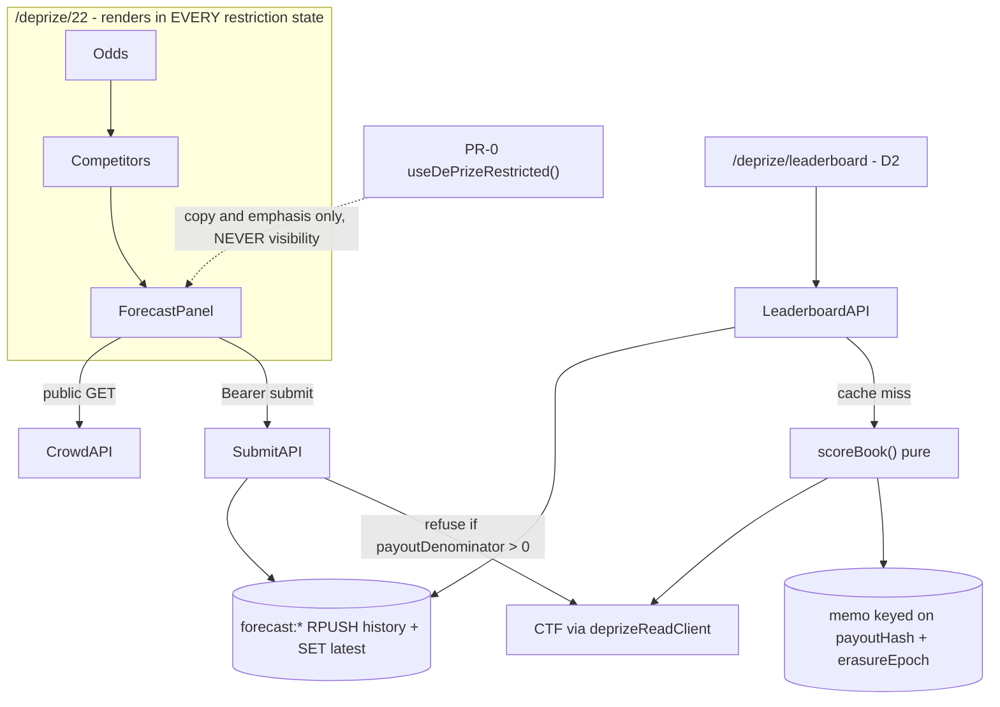

# PR-D — Free forecasts and Brier leaderboard

| Field | Value |
|---|---|
| **Status** | **PR-D1: Ready** (forecast panel + submission path). **PR-D2: Blocked — do not start** (leaderboard; gated on the §4 preconditions) |
| **Authors** | MoonDAO DePrize engineering |
| **Reviewers** | Product owner for the sybil posture: **`<name>`** (§6.9, D2 start blocker). Owner of the "free forecasts are not a bet" determination: **`<name>`** (§9, merge blocker). Engineering reviewer: **`<name>`** |
| **Last updated** | 2026-09-16 (engineering-critique revision — see Revision log) |
| **Depends on** | **PR-0** (region gate fix — merges first; D1 consumes its `useDePrizeRestricted()` context hook). **PR-1** (prize-page section slot + `serverMarket.ts`). `Depends on: None` was false |
| **Blocks** | PR-G2 `/forecast` (needs D1's submit path) and PR-G2 `/leaderboard` (needs D2's API). **PR-G1 depends on neither** — that is the point of the split |
| **Must not** | Call `evaluateEligibility` or the permit path; move the LMSR; require a wallet; **couple the panel's visibility to PR-0's `restricted` flag**; mount `DePrizeRestrictedNotice` |

---

## 1. One-paragraph summary

**PR-D1** adds free, Privy-identified (email is enough; **`userId` only**, never `walletFromSession`) probability forecasts that **never** touch the market. Users enter **unnormalized non-negative weights** per outcome; the server normalizes. Forecasts are stored in Upstash Redis as versioned `[0, 1]` vectors, with history `RPUSH`-ed as an append-only list and `latest` as a separate key. `submit` / `mine` / `crowd` ship with a `ForecastPanel` (`id="deprize-forecast"`) that renders in **every** restriction state — restricted, wallet-less visitors are the audience, not an edge case.

**PR-D2** adds scoring and the leaderboard, and it is **not a pipeline**. Once `resolvedAt` is the **block timestamp of the payout report**, a book's score is a pure function of immutable inputs, so there is **no scoring cron** and no writer of record: `scoreBook()` is computed **on read** and memoized under a **content-addressed key derived from the payout-vector hash**. Ranking is by **Brier skill score against the 1/N baseline** (higher is better), aggregated per user across prizes by an idempotent accumulator, on a season key namespaced by **chain and environment**.

---

## 2. Context / background

Betting is geo-gated (`useRegionRestriction` + `evaluateEligibility` + permit). **After PR-0**, the prize page still **renders** for restricted visitors, and what changes for them is that the Back/Buy affordance is disabled **and** the restriction notice is shown, across the **full** DePrize restricted list ([ui/pages/deprize/[id].tsx](ui/pages/deprize/[id].tsx) `bettingAllowed`, notice ~815). *Before* PR-0 that held only inside the EU/EEA: the client gate read an EU flag, so the other ~52 restricted jurisdictions got neither — fully enabled Back CTAs and no notice at all. The earlier description of this page as one that *"only disables Buy"* therefore understated the defect PR-0 fixes; PR-0 is what makes that sentence true. Forecasts use the hole that survives PR-0: the page renders for everyone, and a forecast is not a bet.

**PR-0 changes the population this PR serves.** The client gate currently reads an EU/EEA flag rather than the DePrize restricted list, so roughly 52 jurisdictions **including the US** render enabled Back CTAs and see no notice. PR-0 corrects that and exposes the corrected value. Two consequences: the panel's audience **grows** after PR-0 (all those visitors flip to restricted and become exactly the users §3 names first), and any "restricted region" browser verification performed before PR-0 is meaningless.

Identity: [ui/lib/privy/privyAuth.tsx](ui/lib/privy/privyAuth.tsx) `verifyPrivyAuth` returns Privy JWT claims including **`userId`**. [ui/lib/privy/index.ts](ui/lib/privy/index.ts) `getPrivyUserData` loads `userData` + wallets, but [ui/lib/deprize/sessionWallet.ts](ui/lib/deprize/sessionWallet.ts) `walletFromSession` returns `null` without a linked wallet. Forecasts **must not** use `walletFromSession` as the identity key.

[ui/middleware/authMiddleware.ts](ui/middleware/authMiddleware.ts) verifies the bearer and calls `next()` **without attaching claims**, and it also admits a **NextAuth session with no Privy bearer at all**. Both facts shape §6.4.

[ui/middleware/rateLimit.ts](ui/middleware/rateLimit.ts) keys on IP + method + path + a 48-char user-agent fragment, allows 500 req/min, and **returns `next()` immediately unless `NEXT_PUBLIC_ENV === 'prod'`**. It is not a per-identity control and it does not exist outside production. Anything this PR needs enforced must be enforced in the handler against Redis.

Persistence pattern: [ui/lib/deprize/complianceStore.ts](ui/lib/deprize/complianceStore.ts) — `getComplianceRedis()` from `UPSTASH_REDIS_URL` + `UPSTASH_REDIS_TOKEN`, `execCompliancePipeline`. **Pipelines are batched, not transactional** — they give ordering, not isolation. No Postgres. The same Upstash instance also holds compliance keys and `rateLimit`'s high-churn sliding-window keys.

API pattern: `withMiddleware(handler, authMiddleware, rateLimit)` for authenticated routes; public routes use [ui/middleware/publicHeaders.ts](ui/middleware/publicHeaders.ts) + [ui/middleware/cacheHeaders.ts](ui/middleware/cacheHeaders.ts) `setCDNCacheHeaders`. Client: `getAccessToken()` from `@privy-io/react-auth` and `Authorization: Bearer <token>`.

Market resolution for scoring: CTF `payoutNumerators` / `payoutDenominator` via `rpcRead` in [ui/lib/deprize/useDePrizeMarket.tsx](ui/lib/deprize/useDePrizeMarket.tsx); interpret with `resolvePayoutVector` in [ui/lib/deprize/lifecycle.ts](ui/lib/deprize/lifecycle.ts) (single winner, or all-positive 1/N refund). Registry record via `getDePrize`. Server reads use `deprizeReadClient` / `rpcRead` from [ui/lib/deprize/read.ts](ui/lib/deprize/read.ts), not the React hooks. `serverMarket.ts` is **PR-1's** deliverable; D consumes it.

Mocha unit tests: [ui/scripts/.mocharc-deprize-unit.json](ui/scripts/.mocharc-deprize-unit.json) currently globs only `cypress/integration/lib/deprize/*`. Forecast tests live under `cypress/integration/lib/forecasts/` — **add that glob**.

Pages Router: `ui/pages/deprize/leaderboard.tsx` wins over `[id].tsx` for `/deprize/leaderboard`.

---

## 3. Problem statement

Only people who can bet (and fund gas) can express a view, and that view moves the LMSR. A large audience — including U.S. and other restricted-jurisdiction visitors who can already *see* odds — cannot participate. There is no skill leaderboard disconnected from money.

Three problems the previous revision of this doc did not state:

1. **The scoring design was a pipeline where a pure function belonged.** An hourly cron was the writer of record for scores derived from immutable inputs. That framing generated the key collision, the partial-failure window, the 60-second ceiling, the cron-auth hole and the observability gap — six findings that are all the same finding.
2. **`resolvedAt` derived from the cron tick was exploitable, not merely imprecise.** See §6.5.
3. **A free, email-identity, public leaderboard has a sybil problem, and the word did not appear.** See §6.9.

Who is affected: restricted-region visitors, email-only Privy users, and later the Discord `/forecast` command.

---

## 4. Goals and non-goals

### PR-D1 goals (this PR)

- Pure `brier.ts`: multi-outcome Brier, **Brier skill score** against the 1/N baseline, an unambiguous `timeAveragedBrier`, crowd aggregate.
- Redis store with §6.2's **split shape** (`RPUSH` history + separate `latest`), schema-versioned, `forecast:books` index.
- `submit` / `mine` / `crowd` routes. Weights-model validation. Server-assigned timestamps. 30-second write-abuse cooldown plus a per-UTC-day entry cap.
- `ForecastPanel` (`id="deprize-forecast"`) in PR-1's `ForecastSlot` at position 8, **after** Competitors, rendering in **every** restriction state, consuming **PR-0's** `useDePrizeRestricted()`.
- Refuse submit once the market has reported (`payoutDenominator > 0`) and on superseded generations.
- Retention, erasure endpoint, and an asserted compliance-export boundary.
- Copy that says what the thing *is* before what it is not.

### PR-D2 goals (separate, gated follow-up)

PR-D2 adds `scoreBook()`, the memo, the accumulator, `/api/forecasts/leaderboard` and `/deprize/leaderboard`. It does not start until:

| Precondition | Why it gates |
|---|---|
| **A recorded sybil posture** signed off by a named product owner (§6.9) | The board's data model differs depending on the answer. Building it first means building it twice |
| **The season/accumulator key shape frozen** before anything writes to it (§6.7) | `FORECAST_SEASON` is also consumed by PR-G. A key written once is a migration |
| **A decided retention period** for forecast history and profiles (§6.10) | The aggregate/raw split is only cheap if it is designed in |

D1 writes **no** leaderboard or accumulator keys. That is what makes D2 a clean follow-up rather than a rewrite.

### Non-goals (both)

- Forecasts affecting `calcMarginalPrice`, mint, or Juicebox.
- KYC, eligibility, permits, or geo-blocking the panel.
- Collecting forecasts in Discord (PR-G2 calls D1's API).
- Wallet-required login **for forecasting**. (Leaderboard *ranking* may require an identity cost — see §6.9. Submitting never does.)
- On-chain storage, Tableland, or Postgres.
- **A scoring cron.** Explicitly dropped — see §5 D5.

---

## 5. Alternatives considered

### D1. Redis (chosen — storage)

- **Reuse:** Same Upstash already used for acceptance / permits (`complianceStore.ts`).
- **Complexity:** Low. Domain helper `getForecastRedis` wrapping the same env vars.
- **User impact:** Instant submit.
- **Legal:** Off-chain opinions; not bets.

### D2. Tableland

- **Complexity:** Wallet signatures to write — breaks "email OK, no wallet."
- **User impact:** Restricted users without wallets cannot play.

Rejected.

### D3. On-chain commitments / CTF-less "forecast tokens"

- **Complexity:** Solidity + deploy (forbidden this rollout).
- **User impact:** Gas, eligibility gravity.
- **Legal:** Looks like another market.

Rejected.

### D4. Store forecasts on the acceptance / compliance keys

- **Safety:** Mixes opinions with geo/sanctions records; export would leak into the five-year compliance archive.

Rejected: separate `forecast:*` keys, **plus** a duplicated Upstash constructor. §6.2 explains why the duplication is an argument, not an apology.

### D5. A scheduled job as the writer of record for scores — **rejected**

The previous revision's design. All four alternatives above are storage backends; the axis that actually determines this system's shape — *must a scheduled job write the scores at all?* — was never on the table. It is now, and the answer is no.

**Why it is rejected.** Once `resolvedAt` is a block timestamp (§6.5), the inputs to a book's score are all immutable: the forecast history is append-only and frozen at resolution, the payout vector is final on chain, and `resolvedAt` never changes. A scheduled writer is the right tool when inputs drift or when work must happen exactly once. **Neither applies.** What this is, is a pure function and a cache — and the pipeline framing generated six findings' worth of machinery to protect a computation that needs none of it:

| Deleted by recompute-on-read | What it was |
|---|---|
| `ui/pages/api/cron/forecast-score.ts` | The route |
| `.github/workflows/forecast-score.yml` | The schedule. Also: scheduled workflows are auto-disabled after repository inactivity, a real way for this to stop with nobody touching it |
| `CRON_SECRET` exposure on this path | `authorizeCronRequest` returns `{ok: true}` when `production` is false and the secret is undefined. A staging POST would have written the production leaderboard, because the season key had neither chain nor environment in it |
| The `scored`-key collision | The same key was the idempotency flag **and** the `resolvedAt` store. Read literally: the first tick that observes resolution writes `resolvedAt` into the skip key, and every later tick skips *before* scoring anyone. Either nothing is ever scored, or the one tick that does both uses a `resolvedAt` equal to its own scoring time |
| The partial-failure window | "The cron died halfway through 800 users" stops being a state you can be in |
| `maxDuration: 60` and a resumable cursor | No 60-second ceiling on a request path that can serve stale on miss |
| The observability gap | A cron that acts only on resolved prizes makes "working correctly" and "the Action stopped firing" produce identical evidence: an unchanged leaderboard for two months. A leaderboard that cannot compute returns an error to a user **now** |
| Engineered idempotency | Computing a pure function twice is the definition of idempotent |

**What it costs, honestly.** Cold-cache latency on the first request after a resolution, O(users in that book) — at hundreds of users, one pipelined batch read plus arithmetic, well inside a serverless budget; at tens of thousands, the calculus changes and §6.8 states the ceiling. Thundering herd, fixed by a short Redis lock with serve-stale-on-lock: **about a dozen lines, and the only thing this alternative adds.** And an inverted cost profile — the cron pays hourly whether or not anyone looks; recompute-on-read pays once per resolution plus misses. Given how rarely these prizes resolve, read-driven is cheaper by a wide margin, with a viral cold-cache moment as the bad case.

**The strongest counter-argument, recorded.** A cron moves work off the user's request path and bounds tail latency. That is real — and it does not require a *writer of record*. §6.8 keeps `scoreBook()` plus the content-keyed memo as the source of truth; a cron may be added later whose **only** job is to **warm** that cache. A warmer that fails, runs twice, dies halfway, or is triggered by an unauthenticated staging request costs one slow request. A writer of record doing any of those corrupts the leaderboard, silently. Same schedule, same code, categorically different blast radius — and it can wait for a p95 measurement that says it is needed.

### D6. Client-side scoring — **rejected**

Not previously considered, and worth one line so nobody proposes it as a latency fix: the client would compute its own rank from public data. Trivially forgeable, and the leaderboard would be a list of self-reported numbers.

### D7. Rank on raw time-averaged Brier — **rejected**

The previous revision's choice (`ZADD` with `−timeAveragedBrier`). Rejected for three reasons, one of which is a correctness bug and not presentation:

- **Not comparable across prizes.** Raw Brier is unnormalized Σ over N outcomes. A 2-outcome prize and a 12-outcome prize produce numbers on different effective scales, and any cross-prize accumulator would be averaging incommensurable quantities. Restyling the column does not fix that.
- **Reads backwards.** A bare `0.412`, lower-is-better, no unit, no direction. Every reader assumes higher is better.
- **The negate-before-`ZADD` hack** is a latent sign bug with nothing to catch it.

Replaced by the **Brier skill score** `1 − B / B_uniform` (§6.1): higher is better, so no negation; `0` means "no better than knowing nothing"; positive means skill; comparable across N. Raw Brier survives as a secondary column for people who want it.

### D8. Auto-normalizing sliders — **rejected**

The previous revision's control. Rejected on three independent grounds, each disqualifying:

- **Silent side effects.** Editing outcome *i* rewrites values the user deliberately set. With no live region anywhere in `components/deprize/`, a screen-reader user hears their own value change and nothing else.
- **Not invertible.** Many valid vectors are unreachable without fighting the control.
- **Order-dependent.** With n > 3 the result depends on edit order, so the same intent produces different vectors — and the vector becomes un-auditable, because the user cannot tell which numbers are theirs.

Dragging is also a single-pointer-alternative and target-size problem: default range thumbs are ~16px against a ≥24px requirement.

The replacement is **not a better slider — it is a different input** (§6.6): unnormalized non-negative weights entered through `NumberStepper`, with read-only normalized percentages shown beneath and normalization performed server-side. That deletes the `sum 100 ± 0.5` validation and its arbitrary tolerance outright; the ±0.5 fudge existed only to paper over client-side float drift that a weights model never produces.

### D9. Leaderboard as declared decoration — **recorded as the fallback**

See §6.9. If product declines the identity cost, this is what ships, and it is a legitimate v1: labeled "unranked, unverified, for fun," with nothing of value ever attached. It is recorded rather than chosen because the minimum-prizes floor plus a one-account-cost is cheap and makes the board mean something.

**Chosen overall:** D1 (Redis) for storage; **recompute-on-read with a content-addressed memo** for scoring; **skill score** for ranking; **weights** for input; **(b) identity cost + minimum floor** for the sybil posture, with D9 as the recorded fallback.

---

## 6. Proposed design

### 6.1 Brier math — [ui/lib/forecasts/brier.ts](ui/lib/forecasts/brier.ts)

Work in **[0, 1]** internally **and in Redis**. Never persist 0–100 or raw weights in `latest` / history vectors.

```ts
/** Multi-outcome Brier: Σ (f_i − o_i)². Lower is better. Unnormalized Σ — do not divide by N.
 *  THROWS on length mismatch (see 6.7 supersede handling). */
export function brierScore(forecast: number[], outcome: number[]): number

/** Brier of the uniform 1/N forecast against `outcome`. For a one-hot outcome this is 1 − 1/N. */
export function uniformBaselineBrier(outcome: number[]): number

/** Skill score: 1 − B / B_uniform. Higher is better. 0 = no better than knowing nothing.
 *  Returns null when B_uniform === 0 (uniform is exactly right — a refund/1-N resolution).
 *  See 6.7: such books are not skill-scored at all. */
export function brierSkillScore(brier: number, outcome: number[]): number | null
```

#### `timeAveragedBrier` — specified to be implementable identically twice

The previous docstring said *"the last forecast with `at <= dT00:00Z + 24h` (i.e. standing at 00:00 UTC of that day)"*. Those two clauses **describe different rules** (`d 00:00Z + 24h` is the *end* of day `d`), and the second one contradicts the frozen test case, which scores D0 from a forecast made at D0 12:00Z. Two engineers would implement it two ways. The rule below is normative; where it disagrees with any earlier phrasing, this wins.

```ts
export function timeAveragedBrier(
  forecastHistory: Array<{ at: string; vector: number[] }>,
  resolvedAt: string,      // block timestamp of the payout report — 6.5
  resolvedVector: number[]
): { brier: number; daysScored: number; calls: number } | null
```

1. **Drop post-resolution entries.** Discard every entry with `at >= resolvedAt`, at the *entry* level, before anything else. Day-boundary exclusion alone is not sufficient. If nothing remains → return `null` (the user is not scored for this book).
2. **`at` is server-assigned**, `Date.now()` at submit, ISO-8601 with `Z`. Never client-supplied. Ties (identical `at`) resolve to the **later list index** — history is `RPUSH`-ed, so list order is authoritative and the rule is deterministic.
3. **Day range.** `firstDay` = UTC calendar date of the earliest surviving entry. `lastDay` = UTC calendar date of `resolvedAt` **minus one day** — the resolution calendar day is **excluded**. If `lastDay < firstDay` → return `null` (the user forecast only on the resolution day; they get no score rather than a score computed from a partial day).
4. **Standing vector for day `d`** = the vector of the last surviving entry with `at < (d + 1) 00:00:00.000Z` — that is, **the vector standing at the end of day `d`**, equivalently at 00:00:00Z on day `d + 1`. This is the reading consistent with the frozen test case. Because `lastDay + 1` is `resolvedAt`'s own calendar date at 00:00Z, no boundary ever reads past `resolvedAt`.
5. **Result** = arithmetic mean of `brierScore(standing_d, resolvedVector)` over every day in `[firstDay, lastDay]` inclusive; `daysScored` = that day count; `calls` = number of surviving history entries (this is the number `forecastsCount` renders — see §6.7).
6. **Prizes that never resolve** have no `resolvedAt`, are never passed to this function, contribute nothing to any aggregate, and are surfaced to the user as "scored after this prize resolves" (§6.7 tombstones).
7. **Length mismatch** anywhere in the history throws out of `brierScore`; the caller catches **per user** and records a counted, logged skip (§6.7). Users are never silently dropped.

Worked example, kept as the frozen mocha case: first forecast D0 12:00Z, update D1 15:00Z, `resolvedAt` D3 08:00Z → days scored are **D0, D1, D2** (D3 excluded); D0 and D1 use the D0 and D1 vectors respectively; D2 uses the D1 vector; `daysScored = 3`, `calls = 2`.

#### Crowd aggregate

```ts
/** Mean of each user's latest vector, plus dispersion for honest presentation.
 *  `excludeUserId` removes the caller: comparing yourself to a crowd containing you is not a comparison. */
export function crowdAggregate(
  latestByUser: Array<{ userId: string; vector: number[] }>,
  excludeUserId?: string
): { vector: number[]; count: number; p25: number[]; p75: number[] }
```

`resolvedVector` is one-hot for a single winner, or `1/N` for a refund / lineage 1/N (`resolvePayoutVector.isRefundVector` or `payoutNums[i]/payoutDen`). Lineage named-slot / field mapping is the CTF vector already reported on **that** prize — do not re-implement `buildSupersededPayouts` in the scorer; read the chain.

#### Validation — the weights model

At the **API** boundary, `submit` accepts **unnormalized non-negative weights**:

- length in **2–12**
- every component finite, `>= 0`, and `<= 1e6`
- **at least one component `> 0`**
- reject otherwise, with the failing rule named in the response

Then normalize server-side: `v_i = w_i / Σw`, persisted as `[0, 1]` summing to `1 ± 1e-9`. **There is no `sum 100 ± 0.5` rule** — it existed only to tolerate client float drift a weights model never produces, and its 0.5 tolerance was arbitrary.

### 6.2 Redis — [ui/lib/forecasts/store.ts](ui/lib/forecasts/store.ts)

```ts
export function getForecastRedis(): Redis | null {
  // same UPSTASH_REDIS_URL / UPSTASH_REDIS_TOKEN as getComplianceRedis
}
```

**Do not import `getComplianceRedis` into forecast code.** The duplicated two-line constructor is not a compromise: it buys an **import-graph guarantee** that no forecast route can reach compliance code, and no compliance path can reach forecasts. That is the same class of structural argument as the prefix separation, and it is what keeps §6.10's export boundary a property of the build rather than a convention. Do not "DRY it up."

Every stored value carries `v: 1`. `{env}` is `NEXT_PUBLIC_ENV` (`prod` / `staging` / `dev`); `{chain}` is the chain slug.

**PR-D1 keys:**

| Key | Type | Value |
|---|---|---|
| `forecast:{env}:{chain}:{id}:user:{privyUserId}:latest` | JSON | `{ v: 1, vector: number[], updatedAt, weights: number[] }` — `vector` is **`[0, 1]`**, sums to 1. `weights` retained so the panel can rehydrate exactly what the user typed |
| `forecast:{env}:{chain}:{id}:user:{privyUserId}:history` | **LIST** | `RPUSH`-ed `{ v: 1, at, vector }` entries |
| `forecast:{env}:{chain}:{id}:users` | SET | privyUserIds with a forecast on this book |
| `forecast:{env}:books` | SET | `"{chain}:{id}"`, `SADD`-ed on first write to a book |
| `forecast:{env}:{chain}:{id}:void` | JSON | Tombstone: `{ v: 1, reason: 'superseded' \| 'cancelled', at, liveTipId? }` |
| `forecast:profile:{env}:{privyUserId}` | JSON | `{ v: 1, displayName, optIn: boolean, updatedAt }` |
| `forecast:erasure:{env}:epoch` | integer | `INCR`-ed on every erasure; participates in memo keys (§6.8) so a deletion busts caches |

**PR-D2 keys** are in §6.8. D1 writes none of them.

**The split shape is a concurrency fix, not a style preference.** The previous design stored `{ latest, updatedAt, history[] }` as one JSON value with a "pipeline SET user doc + SADD users" write path. Upstash pipelines are batched, not transactional. Two submits racing — double-click, two tabs, a retried request — both read the old doc and the second `SET` silently drops the first's history entry, and the 10-minute cooldown did not close the window because the cooldown was itself read from the same non-atomic doc. `RPUSH` appends are atomic, submit becomes O(1) instead of O(history), and the value stops growing without bound.

**Book index instead of `SCAN`.** `SADD forecast:{env}:books` on first write costs one command on a path already writing, and removes an `O(keyspace)` `SCAN MATCH forecast:*:users` from every read. That matters here specifically: the same Upstash database holds compliance keys **and** `rateLimit`'s sliding-window keys — a very large, high-churn population — so a `SCAN` walks all of it to find a handful of books.

**Write-abuse controls** (enforced in the handler against Redis, because `rateLimit` middleware is a no-op outside production):

| Control | Value | Why |
|---|---|---|
| Cooldown | **30 s** (was 10 min) | Ten minutes protected nothing — only the end-of-day standing vector is ever read, so edits between boundaries are free — while locking a user out for ten minutes after they fat-finger a stepper, which is the single most likely thing a first-time user does |
| History entries per user per book per UTC day | **20**, `429` beyond | This is the quantity scoring actually cares about |
| Sybil | **Not addressed here.** A new email is a new identity with a fresh cooldown. The real control is identity cost — §6.9 | |

`FORECAST_SEASON = '2026'` only, exported from the forecasts lib. **v1 has exactly one season**; there is no "calendar year of `resolvedAt`" branch, and a second season is an explicit key addition, not a derived value. PR-G reads the same constant.

Never log raw IPs. Forecasts need no geo; if that ever changes, `hashIp` only.

### 6.3 Identity — [ui/lib/forecasts/identity.ts](ui/lib/forecasts/identity.ts)

```ts
export async function privyUserIdFromRequest(req: NextApiRequest): Promise<string | null>
```

`verifyPrivyAuth(bearer)` → `verifiedClaims.userId`, then `sub`. **No wallet required.** Do not call `walletFromSession` on any forecast path.

Display name: `forecast:profile` if `optIn`; else a stable pseudonym `Forecaster ` + first 4 hex of a hash of `userId` (never the raw id). The pseudonym default is the right default.

**`null` → `401`, explicitly, in the handler.** `authMiddleware` verifies the bearer and calls `next()` **without attaching claims**, so `privyUserIdFromRequest` verifies a second time (both local when `PRIVY_VERIFICATION_KEY` is set, both an 8-second JWKS fetch when it is not). More importantly, `authMiddleware` also admits a **NextAuth session with no Privy bearer**, in which case `privyUserIdFromRequest` returns `null`. Without this rule a route ends up writing to `forecast:…:user:null` — a shared bucket for every NextAuth visitor. Do **not** "fix" `authMiddleware` in this PR; it is a shared surface with other consumers.

### 6.4 APIs — [ui/pages/api/forecasts/](ui/pages/api/forecasts/)

**PR-D1:**

| File | Auth | Cache | Body / query |
|---|---|---|---|
| `submit.ts` | `authMiddleware` + `rateLimit` | no | POST `{ chainSlug, deprizeId, weights: number[], displayName?, profileOptIn? }` |
| `mine.ts` | `authMiddleware` + `rateLimit` | no | GET `?chain=&deprizeId=` → `{ weights, vector, updatedAt, calls, scoreState }` |
| `crowd.ts` | `publicHeadersMiddleware` + `rateLimit` | `setCDNCacheHeaders(res, 60, 60)` | GET `?chain=&deprizeId=&excludeMe=1` → `{ vector, count, p25, p75, staleSeconds: 60 }` |
| `me.ts` (`DELETE`) | `authMiddleware` + `rateLimit` | no | Erasure — §6.10 |

**PR-D2:** `leaderboard.ts` — public + `rateLimit`, cache 60 s, `GET ?season=2026&chain=&limit=50` → `{ rows, unranked, computedAt, booksScored, usersSkipped, sybilPosture }`. May accept a Bearer token to set `isYou`; still public without it.

`submit` steps, in order:

1. Parse and validate `weights` (§6.1). Reject with the failing rule named.
2. `privyUserIdFromRequest` → `null` ⇒ **401**.
3. **Refuse if the market has reported.** Read `payoutDenominator` for the condition via `deprizeReadClient` and refuse with **409** when `> 0`. This is the *chain* state, not "once the cron notices" — it is the same read the panel already needs to render a resolved state. Closes the front-running window in §6.5.
4. Refuse when `resolveLiveDePrizeId(chainSlug, deprizeId) !== deprizeId` — no forecast book on a superseded generation; **409** with the live-tip id.
5. Refuse when the void tombstone exists — **409** with the reason.
6. Cooldown (30 s) and the per-UTC-day entry cap — **429** with `retryAfterSec`.
7. Normalize, `RPUSH` history, `SET` latest, `SADD` users, `SADD` books. Server-assigned `at`.
8. Optional profile update.

**Never** import `runEligibilityChecks`, `evaluateEligibility`, `walletFromSession`, or permit code into anything under `ui/pages/api/forecasts/`. Asserted by a source-level test (§6.11), not by a manual grep.

### 6.5 `resolvedAt` — block timestamp, always

The previous spec: *"`resolvedAt` = block time of the report if cheap; otherwise ISO of the cron tick when `resolved` first becomes true."* **"If cheap" is not a specification**, and the fallback is exploitable rather than merely imprecise.

**The exploit.** Scoring includes every UTC day up to but excluding the `resolvedAt` calendar date. §9 correctly required the scorer to wait for `shouldSurfaceResolution` rather than the raw CTF report. Combine those and there is a window — hours, or **days** while the Senate surfaces a determination — in which the payout vector is **publicly readable on chain** but `resolvedAt` is unrecorded. Anyone watching the chain submits a one-hot on the known winner during that window; it becomes the standing vector at the next end-of-day boundary; that day scores a perfect **0** and pulls their time-average down. They did not forecast anything. They read the answer. The design *deliberately delayed* `resolvedAt` past the on-chain report, which is exactly what opened the window.

**Three changes, all required:**

1. **`resolvedAt` is the block timestamp of the payout report. Always.** One `getBlock` on a log the scorer already has to find. `serverMarket.ts` (PR-1) returns it; if the report log cannot be located, the book is **not scored** and is reported as `scoreState: 'awaiting-resolution-timestamp'` — it is never approximated.
2. **Drop history entries with `at >= resolvedAt`** before scoring, at the entry level (§6.1 step 1). Day-boundary exclusion is not sufficient.
3. **`submit` refuses once `payoutDenominator > 0`** (§6.4 step 3), so the window cannot be written into in the first place.

`shouldSurfaceResolution` still governs what the **UI announces** and when a book becomes visible on the leaderboard. It no longer governs what `resolvedAt` *is*. Those were conflated.

**The second-order benefit is determinism.** With a block timestamp the score is a pure function of immutable inputs, and two independent runs produce identical numbers — which is what makes recompute-on-read (§6.8) possible at all, and what makes a dispute auditable. With the tick, a Redis flush or a re-run produced different scores for the same forecasts.

### 6.6 UI — `ForecastPanel`

[ui/components/deprize/ForecastPanel.tsx](ui/components/deprize/ForecastPanel.tsx), root `id="deprize-forecast"` (one id only — not `#forecast`; PR-G links to this fragment).

**Visibility — the constraint most likely to be broken by the next change.** The panel renders in **every** restriction state, for signed-out visitors, and when `bettingAllowed` is false. Restricted, wallet-less users are **precisely the audience**; wiring visibility to PR-0's new flag "to be consistent with the rest of the page" is the obvious mistake and it deletes the reason this PR exists. Concretely:

- **Consume PR-0's `useDePrizeRestricted()`** for restriction state. Do **not** call `useRegionRestriction` directly and do not re-derive the restricted set — PR-0 owns that computation, and a second derivation is a second thing to get wrong. PR-0 ships an ESLint `no-restricted-imports` rule banning the region hook under `components/deprize/**`, so this is enforced rather than requested.
- **Where the signal comes from — the page computes it, forecast code only reads it.** PR-0's `resolveDePrizePageProps` derives the corrected value server-side, the page threads it as the `restricted` prop, and PR-0's `DePrizeRestrictedProvider` provides it to the tree. Forecast code **consumes**: `useDePrizeRestricted()` normally, or the `restricted` prop directly where the component already sits inside PR-1's extracted section tree and is handed it. There is no third option in which a forecast route or the panel skips `resolveDePrizePageProps` or ignores `restricted` — any earlier text in this doc to that effect predates PR-0 and is struck. `useDePrizeRestricted()` **throws outside a provider** by design, so a page carrying the panel must be a page that mounts the provider; the panel cannot and must not paper over a missing one with a default of *"not restricted."*
- Use it **only** to choose *copy and emphasis*, and to suppress **bet affordances** inside the panel — in D1 there are none, because the panel takes no bet, so in practice this is copy. **Never** to gate the mount: **restricted users must see the forecast panel and must be able to submit through it.** Restricted, wallet-less visitors are the audience; the signal shapes what the panel *says*, never whether it *exists*. A test asserts the panel renders under every restriction value (§6.11).
- Do **not** mount `DePrizeRestrictedNotice`. It replaces the whole page and would blank both the market UI and this panel.
- Do not render inside `BetModal`.

**Region notice — struck from this PR.** The previous §6.7 amended the notice string at `[id].tsx` ~817. **PR-0 owns that block and that string**; the edit is a guaranteed textual conflict on the same lines. PR-0's notice makes the forecast panel the primary next step for restricted visitors and anchors to `#deprize-forecast`; PR-D's only obligation is that the anchor exists.

**Control — steppers over weights, not auto-normalizing sliders** (§5 D8):

- One row per outcome, built from [ui/components/layout/NumberStepper.tsx](ui/components/layout/NumberStepper.tsx) (min/max clamping, 32px mobile buttons, typeable input). Fix its hardcoded `id="number-stepper"` first — six instances otherwise produce six duplicate ids.
- Values are **relative weights**, defaulting to a **uniform 1/N** starting point. Editing one row changes nothing else.
- **Read-only normalized percentages beneath each row**, recomputed live, in an `aria-live="polite"` region: *"your call: 32%"*. The user sees exactly what will be stored without the control ever rewriting their input.
- An **explicit** optional "even it out" action. Never normalize silently on keystroke.
- The server normalizes; the client's percentages are a preview.

**Comparison — a dot plot, not three stacked percentage columns.** Three stacked rows imply a ranking (readers scan top-to-bottom as increasing authority) and invite an arithmetic-error reading. One shared 0–100 axis per outcome, marking the uninformed **1/N** baseline, distinguished by **shape and position, not colour alone**:

```text
            0%        20%       40%       60%       80%      100%
            |---------|---------|---------|---------|---------|
Firefly     · · · · · · · · · ·◇· · ·●· ·△· · · · · · · · · · ·
IM          · · ·◇●△· · · · · · · · · · · · · · · · · · · · · ·
                 ┊
                 └ 1/6 = 17% — no-information baseline

  ● you    ◇ market (normalised)    △ crowd (n=23, bar = middle 50%)
```

**The market row must be made comparable in `serverMarket.ts`, not in the component.** Per-outcome `calcMarginalPrice` values converted through `(Number(p) / 2**64) * 100` are LMSR marginal prices and **need not sum to 100**, while the user's vector and the crowd mean both do. Rendering all three on one axis without saying so implies a comparability that does not exist. `serverMarket.ts` (PR-1) returns **both** `probabilities` (raw) and `probabilitiesNormalized`; the comparison plots the normalized vector, labels it *"market, normalised"*, and footnotes the raw sum (*"market prices sum to 103%"*). Silence is the one unacceptable option. If product would rather show raw prices, the row is relabeled "market price" and drops out of the comparison entirely.

**Crowd requires n ≥ 5, excludes the caller, and always prints n.** At `count = 1` the "crowd" is the user's own forecast presented as social proof — manufactured, and also just wrong. Below 5: *"Crowd shows once 5 people have called it (3 so far)."* At or above 5: print `n` next to the label and render dispersion (the `p25`/`p75` bar), because sample size and spread are the two things you cannot omit. The caller is **excluded** from the aggregate — comparing yourself to a crowd that includes you is not a comparison — which also resolves the `setCDNCacheHeaders(res, 60, 60)` artifact where a user's own submit would not appear in the crowd for up to a minute and read as a bug. The response carries `staleSeconds: 60` so the UI can say so.

**Copy — say what it is before what it is not.** The previous spec's only copy was four negations (*"Free. No wallet, no money, does not move the market"*), sitting directly above six **"Back this team"** buttons, where a stack of percentage inputs reads as bet sizing. Telling someone four times what a thing *isn't* does not tell them what it is:

> **Call it — free.** Set your odds for who lands next. You're scored against what actually happens and ranked on the leaderboard. No wallet, no money, and your call doesn't move the market.

- Button: **"Save my call."** "Submit forecast" reads like a bet slip.
- Do **not** use `bg-moon-green` — that fill is the Bet/Claim colour on this page and fails white-text contrast at 3.50:1. Use the outline/secondary treatment PR-E specifies for Fund.
- Signed out: `useLogin()` (email is enough — do not use `useActiveAccount` as a gate).
- Superseded page: panel still renders, Submit disabled, link to `/deprize/<liveTip>` ("Forecasts are on the live generation"). Do not open a second book for the old id.
- Resolved market: Submit disabled with "This prize has reported — forecasting is closed."
- Per-user score state, from `mine`: `awaiting-resolution` / `scored` / `void` / `not-scorable` (§6.7). Silence is never the signal.

**Prize page slot** — PR-1's `ForecastSlot`, **position 8, after the Competitors section**. **PR-1 owns slot order**, and it moved the panel off the between-Odds-and-Competitors position this doc originally specified for itself: a grid of probability inputs sitting directly between the odds card and the roster reads as bet sizing, and separating the two is the cheapest way to stop that confusion. D does not hand-insert into `[id].tsx`.

### 6.7 Schema versioning, supersede, and skips

Every stored value carries **`v: 1`** (§6.2). A reader that sees an unknown `v` **refuses** rather than guessing, and the refusal is counted.

**Vector length can change under a stored forecast.** A prize superseded onto a new roster means a stored 6-length vector can meet a 4-length `resolvedVector`. The exact analogue already bit PR-G (`maxProbDelta` returning `Infinity` on a length mismatch, which then compares `>= 5` as true). Specified behavior:

- `brierScore` **throws** on mismatched lengths. It does not pad, truncate, or return a sentinel.
- The scorer catches **per user** and records that user as **skipped**, with the reason.
- Skips are **counted and logged**, surfaced as `usersSkipped` in the leaderboard response and in the page footer. Users are never silently dropped.

**Forecasts stranded on a superseded generation.** Refusing *new* submits (§6.4 step 4) does not help forecasts already sitting on an id that later becomes SUPERSEDED — that prize may never report its own CTF vector, so those users would wait forever with no signal. Write the tombstone `forecast:{env}:{chain}:{id}:void` = `{ reason: 'superseded', at, liveTipId }` at the moment supersession is observed, and:

- Those books are excluded from every season aggregate.
- `mine` returns `scoreState: 'void'` with the reason and the live-tip link; the panel says forecasts on a superseded generation are void, and points at the live book.
- The tombstone makes this **observable rather than inferred from silence**, which is the actual requirement.

**Books where skill is undefined.** When the resolution is a refund / all-positive 1/N vector, `uniformBaselineBrier` is **0**, so `1 − B/0` is undefined — the uniform forecast was exactly right and no forecast can demonstrate skill against it. Such books are **not skill-scored**: `brierSkillScore` returns `null`, the book contributes nothing to any aggregate, and `mine` returns `scoreState: 'not-scorable'` with "this prize refunded; there was no outcome to be right about." This edge was previously unstated and would have produced `Infinity` or `NaN` in the accumulator.

### 6.8 Scoring and the leaderboard — PR-D2, recompute-on-read

`scoreBook()` is a pure function; the memo is a cache. There is no cron (§5 D5).

**Memo — content-addressed on the payout vector:**

```
forecast:memo:{env}:{chain}:{id}:{payoutHash}:{erasureEpoch}
```

`payoutHash` = first 16 hex of a hash over `chainId | conditionId | payoutDenominator | payoutNumerators.join(',') | resolvedAtUnix`. Content-addressed, not time-addressed: it **self-invalidates** if a condition is ever re-reported, with no invalidation logic to get wrong. `erasureEpoch` (§6.2) makes a deletion bust every memo containing that user, which is what makes §6.10's erasure path actually work against a cache of immutable results.

Memo value: `{ v: 1, resolvedAt, computedAt, usersScored, usersSkipped, perUser: { [userId]: { rawBrier, skill, daysScored, calls } } }`.

`perUser.calls` is where **`forecastsCount` lives.** The previous design returned `forecastsCount` in the API response with **no key storing it** — it could not be computed from the ZSET, and after a book was scored nothing linked a user back to their entries.

**Per-user season accumulator, idempotent per `(user, prize)`:**

```
forecast:acc:{env}:{chain}:{season}:user:{privyUserId}   HASH
  skillSum, prizeCount, callsSum, books (JSON set of scored book ids)
```

Writes are keyed on the book id inside `books`, so applying the same `(user, prize)` result twice is a no-op — a re-run cannot double-count. **This replaces `ZADD forecast:lb:2026 <-score> <privyUserId>`, which was last-write-wins per member:** a user scored on prize A and later on prize B ended up ranked by **B alone**, nothing aggregated across prizes, and nothing in the doc said B-only was intended.

**Ranking value** = `skillSum / prizeCount` (mean skill score). Higher is better, so **no negation** — the sign hack is gone with the raw-Brier ranking (§5 D7).

**The season key is namespaced by chain *and* environment.** `forecast:lb:{season}` was the only key in the previous design without a chain, while every other key had one — so Sepolia test prizes, whose resolution you control, would rank against Arbitrum mainnet. That was the leaderboard's cheapest exploit. Environment is included for the same reason a staging write must not reach a production board. **Freeze this shape before anything writes to it**, because `FORECAST_SEASON` is also consumed by PR-G (§4).

**Read path** for `/api/forecasts/leaderboard`:

1. Cache hit on `forecast:lb:{env}:{chain}:{season}:{booksDigest}` → serve. `booksDigest` is a hash of the sorted `(bookId, payoutHash)` pairs, so the snapshot self-invalidates when any book resolves or re-reports.
2. Miss → `SMEMBERS forecast:{env}:books`, skip unresolved, voided and not-scorable books, and for each remaining book read its memo or compute and write it.
3. Fold memos into accumulators, apply the §6.9 ranking rules, write the snapshot with a 10-minute TTL. A 60-second CDN cache sits on top.
4. **Thundering herd:** `SET forecast:lock:{key} NX EX 30`. If the lock is held: serve the previous snapshot if one exists, else `202` with `{ status: 'computing' }` and a retry hint. This is the ~dozen lines recompute-on-read *adds*, and it is the whole added cost.

**Observability comes free and is still stated.** The response carries `computedAt`, `booksScored`, `usersScored`, `usersSkipped`; the page footer prints "scores computed <time> from N resolved prizes, M forecasters skipped." A computation that fails returns an error **to a requester now**, instead of a cron silently serving a stale table for two months. One structured log line per cold computation with the same fields.

**Scale ceiling, stated rather than discovered.** Cold-cache cost is O(users in that book), served as one pipelined batch read plus arithmetic. This design is specified for up to **~5,000 users per book**. Above that, add the **warmer** cron from §5 D5 — never a writer of record — and revisit batch sizes. Below it, no scheduled job exists.

### 6.9 Sybil resistance — the posture, decided

The identity is a Privy `userId` obtainable with any email address, at zero cost, in unlimited quantity. The only per-identity control in the previous design was a 10-minute edit cooldown, and `rateLimit` keys on IP + method + path + a UA fragment (rotate the UA, multiply the budget), allows 500 req/min, and **returns `next()` immediately outside production**. Register 200 accounts, spray the outcome space, and one of them tops the board with a "skill" score. The word "sybil" did not appear in the previous revision.

**Chosen: (b) — the board means something.** Three controls, all in D2:

1. **A cost on identity for *ranking* only.** A ranked row requires a **linked wallet or a linked Discord account**. Forecasting itself stays wallet-less and email-only — that preserves the entire point of the PR — but appearing on a *ranked* board costs one non-free identity.
2. **A minimum of 3 scored prizes** before a user is ranked at all. This kills the cheapest farm on its own: spraying works because a one-prize sample has enormous variance, and requiring three scored prizes makes the spray strategy need 3× the accounts for a strictly worse expected score. Everyone else is listed under **"Not yet ranked"** with their `prizeCount`, so nobody is hidden — they are just not competing.
3. **Per-`(user, prize)` uniqueness**, which §6.8's accumulator provides structurally.

Controls 1 and 2 are **scoring-rule changes, not UI changes**, which is why they are here and not in a styling pass.

**Recorded fallback (§5 D9):** if product declines control 1, D2 ships as **declared decoration** — the page labeled "unranked, unverified, for fun," control 2 still applied, and **nothing of value ever attached to rank**. The API's `sybilPosture` field states which regime is live so PR-G's embed cannot misrepresent it. What must not ship is a board with competitive framing and no posture at all.

**Owner:** `<name>` (product). This is a **D2 start blocker** (§4).

### 6.10 Privacy, retention, and the compliance boundary

This system's entire point is collecting data from people who may never bet — including in restricted jurisdictions. Forecast history plus an optional display name, keyed to an email-derived identity, was previously held indefinitely with no erasure path and no stated export boundary.

| Property | Decision |
|---|---|
| **Retention — raw history** | **24 months** after the book resolves, or on request. Then the history list is deleted |
| **Retention — aggregates** | Season accumulators (`skillSum`, `prizeCount`, `callsSum`) **may survive** the raw history. That is the entire reason §6.2 separates them: the number that makes the leaderboard work is not the personal data |
| **Retention — profile** | `forecast:profile:*` until erasure request, or 24 months after the user's last submit |
| **Erasure** | `DELETE /api/forecasts/me` (authenticated, own identity only): delete `latest` and `history` for every book, delete the profile, `SREM` from every `users` set, remove the user from every accumulator, and `INCR forecast:erasure:{env}:epoch` so every memo containing them is invalidated by construction (§6.8). Respond `204` |
| **Display name** | Pseudonym `Forecaster <hash4>` by default; a real name only on explicit opt-in. Reuse PR-C2's allowlist sanitizer and its escaping-at-every-sink rule — the same string reaches Discord embeds via PR-G |
| **Compliance export boundary** | `yarn export:deprize-compliance` **must not** pick up `forecast:*`. The export walks `scanComplianceKeys(match)` against the **same Upstash instance**, so the separation is one match-pattern edit away from failing. "Different prefix" is a convention until a test asserts it — §6.11 asserts it |

**"Free forecasts are not a bet" is the load-bearing legal claim of this entire PR and it appeared nowhere in §9.** It now has an owner (`<name>`, merge blocker) and a standing constraint: **the day anything of value attaches to leaderboard rank — a token, a whitelist slot, a prize, priority access — that determination has to be re-made.** Written next to the sybil posture so both are read together.

### 6.11 Tests — `ui/cypress/integration/lib/forecasts/*.cy.ts`

Add to [ui/scripts/.mocharc-deprize-unit.json](ui/scripts/.mocharc-deprize-unit.json):

```json
"cypress/integration/lib/forecasts/*.cy.ts"
```

The previous revision's `brier.ts` cases are kept in full — they are the strongest test list in the rollout, and the 2/3 uniform-vs-one-hot case with its "do not fix this to 1/N-averaged" warning is exactly right. What is added is everything §7 previously deferred to a manual browser pass, which was carrying six subsystems. Browser verification is non-repeatable, is not run in CI, and — for the restricted-region check especially — **cannot be performed by a reviewer in the wrong country**.

**Kept:**

- Perfect forecast vs one-hot → Brier 0.
- Uniform on 3 outcomes vs one-hot → `(1/3−1)² + 2(1/3)² = 4/9 + 2/9 = ` **2/3** (unnormalized Σ; do not "fix" to 1/N-averaged).
- Wrong-confident `(1,0,0)` vs outcome 1 → 2.
- Frozen time-average case: first forecast D0 12:00Z, update D1 15:00Z, `resolvedAt` D3 08:00Z → score **D0, D1, D2** only. In the mocha case **and** the docstring.
- Storage units: a Redis-writing helper persists `[1, 0]`, not `[100, 0]`.
- `crowdAggregate`: two users `[1,0]` and `[0,1]` → `[0.5, 0.5]`.

**Added — D1:**

1. **Post-resolution forecasts do not score** (§6.5): a history containing an entry timestamped after `resolvedAt` yields exactly the result of the same history without it.
2. **Determinism**: the same inputs scored twice produce identical output, with **no reference to `Date.now()`** anywhere in the scoring path.
3. **Day-boundary rule**, asserted against the normative wording: an entry at `D1 00:00:00.000Z` is the standing vector for D1 and not for D0; an entry at `D0 23:59:59.999Z` is D0's; a history whose only entry falls on the resolution day returns `null`.
4. **Length mismatch is explicit** (§6.7): `brierScore([a,b,c,d,e,f], [1,0,0,0])` throws, and the scorer records a counted skip rather than dropping the user.
5. **Skill is null on a refund resolution** (§6.7): `uniformBaselineBrier` is 0 and the book is excluded rather than producing `Infinity`/`NaN`.
6. **Weights validation at the API boundary** (§6.1): length 1 rejects; 13 rejects; all-zero rejects; a negative rejects; `[3, 1]` normalizes to `[0.75, 0.25]`. The old `sum 99.4 / 99.6` cases are **deleted** with the rule.
7. **Panel renders under every restriction value**: parameterized over PR-0's restriction states, asserting the panel mounts in all of them. This is the test that fails when someone couples visibility to the flag, and it replaces a browser check a reviewer in the wrong country cannot perform.
8. **Source-level isolation**: read the text of every file under `ui/pages/api/forecasts/` and assert no match for `/evaluateEligibility|runEligibilityChecks|walletFromSession|permit/`. §7 previously asked the implementer to grep by hand; making the grep a test is five lines and it is the only thing that keeps the constraint true in six months.
9. **Compliance-export boundary** (§6.10): the export's scan pattern does not match a `forecast:*` key.
10. **Unknown schema version refuses** (§6.7) rather than guessing.

**Added — D2:**

11. **Accumulator idempotency**: applying the same `(user, prize)` result twice leaves `skillSum`, `prizeCount` and `callsSum` unchanged.
12. **Leaderboard ordering**: given three users' aggregates, the emitted rows are best-first — asserted on the **rendered** ordering, which is the test that catches a sign flip.
13. **Memo self-invalidation**: changing the payout vector changes `payoutHash`, so the previous memo is not served.
14. **Erasure busts the memo**: `INCR` on the erasure epoch changes the memo key.
15. **Ranking floor**: a user with 2 scored prizes appears under "Not yet ranked," never in the ranked rows.

Do not import eligibility modules in any of these tests.



---

## 7. Step-by-step implementation plan

**PR-D1:**

1. Write `brier.ts` (`brierScore`, `uniformBaselineBrier`, `brierSkillScore`, `timeAveragedBrier`, `crowdAggregate`) + the kept and D1-added mocha cases. Add the mocha glob. `yarn test:deprize`. **This step has no dependencies and can start against `main` today** — it is a pure module.
2. Write `store.ts` (split shape, `v: 1`, book index, tombstones, erasure epoch) + `identity.ts` (`null → 401`).
3. Fix `NumberStepper`'s hardcoded `id="number-stepper"`.
4. Implement `submit` / `mine` / `crowd` / `me` (DELETE). Add test 8 (source-level isolation) in the same commit as the routes, not after.
5. Build `ForecastPanel`: weight steppers with a uniform default, read-only normalized preview in a live region, explicit "even it out," dot-plot comparison, crowd suppressed below n = 5 and excluding the caller, "Call it — free" copy, "Save my call" button, secondary button treatment. Mount via **PR-1's** `ForecastSlot` (position 8, after Competitors). Consume **PR-0's** `useDePrizeRestricted()` for copy only, and add test 7.
6. Consume `serverMarket.ts`'s `probabilitiesNormalized` for the market row; footnote the raw sum.
7. Retention and erasure documented in the DePrize ops doc; export-boundary test (9).
8. `yarn lint` on new files.
9. **Browser verification — narrow, because the tests now carry the load:** Sepolia `/deprize/22` signed out (panel visible, "Save my call" prompts Privy); email login without a wallet (submit succeeds); second submit inside 30 s (429); crowd hidden at n < 5 with the "3 so far" line; superseded id (panel present, Submit disabled, live-tip link); a reported market (Submit disabled). Screenshot the panel at n < 5 and n ≥ 5.

**PR-D2** (after §4's three preconditions): `scoreBook()`, memo, accumulator, lock, `leaderboard.ts`, `/deprize/leaderboard` with ranked and "Not yet ranked" sections, skill presentation per §6.8, footer with `computedAt` / `booksScored` / `usersSkipped`, and tests 11–15. **Do not create `ui/pages/api/cron/forecast-score.ts` or `.github/workflows/forecast-score.yml`** (§5 D5).

On the leaderboard page: `setDePrizePageNoStoreHeaders` is fine; **do not** hide the page when `getDePrizePageEligibility` is restricted — forecasts are for those visitors. It is a new top-level DePrize page, so it owns the provider decision §6.6 describes: if anything it renders calls `useDePrizeRestricted()`, this page must mount PR-0's `DePrizeRestrictedProvider` seeded from its own `resolveDePrizePageProps` result, because the hook throws outside a provider. If D2 chooses not to mount it, no descendant may call the hook. Present skill as a percentage with the direction stated, and keep raw Brier on the row detail only:

```text
  #  Forecaster        Skill    Calls   Prizes
  1  Forecaster 4c1a    +38%       11        3      <- higher is better,
  2  dana.eth           +31%        9        3         vs. guessing evenly
  3  Forecaster 90ff     +6%        4        2
  ---------------------------------------------
     You (Forecaster 3b7e)  -4%      2        1   (not yet ranked - needs 3 prizes)

  Scored on every day your call stood, not just the last one.
```

Empty state: *"No scored forecasts yet. Submit a forecast on a live prize."*

---

## 8. Testing, rollout, and feature flags

- **Unit:** `yarn test:deprize` including the new glob. Tests 7, 8 and 9 are gates: panel visibility, route isolation, export boundary.
- **Cron:** **none.** There is no cron in this PR and no `CRON_SECRET` on this path (§5 D5). A warmer may be added later, gated on a p95 measurement, and it will never be the writer of record.
- **Flags:** none. If Redis is unset, APIs return 503 (fail closed, like compliance writes) — do not fail open with a fake crowd. **The panel's visibility is not behind a flag and not behind PR-0's restricted value.**
- **Rollout:** D1 merges after PR-0 and PR-1 (position 8 in the program order). D2 is a follow-up. PR-G1 depends on neither; PR-G2's `/forecast` needs D1 and its `/leaderboard` needs D2.
- **Rollback:** D1 — remove the panel mount; the store is additive and reads nothing else. D2 — the memo and snapshot are caches; deleting them costs one recomputation. There is no partially-written leaderboard state to repair, which is the operational payoff of §5 D5.

---

## 9. Risks and open questions

| Risk / question | Default |
|---|---|
| **"Free forecasts are not a bet" has no named owner** | **Merge blocker.** `<name>` in the header table. Standing constraint: re-make the determination the day anything of value attaches to rank (§6.10) |
| **Sybil posture unowned** | **D2 start blocker.** `<name>` (product). Chosen posture is (b): identity cost for ranking + a 3-prize floor; declared decoration is the recorded fallback (§6.9) |
| **Panel visibility gets coupled to PR-0's flag** | The highest-probability regression in this PR. Guarded by test 7, by an explicit **Must not** in the header table, and by consuming PR-0's `useDePrizeRestricted()` for copy only |
| Front-running the resolution window | `resolvedAt` is the block timestamp; entries at or after it are dropped; `submit` refuses once `payoutDenominator > 0` (§6.5) |
| Scoring before the Senate surfaces resolution | `shouldSurfaceResolution` still governs what the **UI announces** and when a book appears on the board. It no longer defines `resolvedAt` |
| Prize never resolves | Never scored, contributes nothing, `scoreState: 'awaiting-resolution'` in `mine`. No silent waiting |
| Prize superseded under stored forecasts | Void tombstone written at observation; book excluded; `mine` returns `void` with the live-tip link (§6.7) |
| Refund / 1-N resolution | Skill undefined; book excluded; `scoreState: 'not-scorable'` (§6.7) |
| Vector length changes under a stored forecast | `brierScore` throws; per-user counted, logged skip; surfaced as `usersSkipped` (§6.7) |
| Cold-cache latency on a viral leaderboard | Lock + serve-stale; stated ceiling ~5,000 users per book; add a **warmer** above it (§6.8) |
| Privy claim field is `userId` vs `sub` | Read `userId` first, then `sub`. `null` → **401** |
| NextAuth session with no Privy bearer | `privyUserIdFromRequest` returns `null` → **401** in the handler. Do not modify the shared `authMiddleware` here (§6.3) |
| Season definition | `FORECAST_SEASON = '2026'` only, namespaced by chain **and** environment. No year-of-`resolvedAt` branch. Freeze before the first write — PR-G reads it too |
| Display-name abuse | PR-C2's allowlist sanitizer + escaping at every sink, including Discord embeds via PR-G (§6.10) |
| Index page has no ForecastPanel | Out of scope; prize page + leaderboard only |

---

## 10. Cross-cutting constraints

See [`.cursor/plans/deprize-engineering-constraints.md`](deprize-engineering-constraints.md) for the shared constraints. PR-D1/D2 are bound by its `ALL`, `UI`, `API`, `PERSIST`, `ELIG` (must **not** gate) and `PII` scopes — in particular **C1**, **C3** (`evaluateEligibility` stays pure), **C4** (never gate sell/redeem/claim), **C5** (never log a raw IP), **C7** (Upstash via a per-domain helper), **C8** (middleware composition), **C10** (test glob), **C11** (**consume** the corrected jurisdiction signal, never re-derive it — §6.6), **C12** (bounded stores; owned defaults — §6.2 and §9) and **C13** (state the cheapest attack — §6.9). **`CRON` does not apply**, and that is a design decision rather than an omission: see §5 D5.

PR-D-specific additions on top of that document:

- **The panel's visibility is NOT coupled to PR-0's restricted flag.** Restricted, wallet-less users are the audience. PR-0's `useDePrizeRestricted()` drives copy and emphasis only. Asserted by test 7.
- **Consume PR-0's `useDePrizeRestricted()`; never call `useRegionRestriction` in forecast code** and never re-derive the restricted set. PR-0's ESLint `no-restricted-imports` rule over `pages/deprize/**` and `components/deprize/**` enforces the second half.
- **A page that calls the hook mounts the provider.** `useDePrizeRestricted()` throws outside `DePrizeRestrictedProvider`. The prize page mounts it in PR-0; any *new* DePrize page in this PR — D2's `/deprize/leaderboard` — either mounts it from its own `resolveDePrizePageProps` result or has no descendant that consumes the hook (§7).
- **Do not mount `DePrizeRestrictedNotice`** on any page carrying the panel — it replaces the whole page.
- **No cron, no `CRON_SECRET`, on the forecast path.** Any future scheduled job is a cache **warmer** and never the writer of record.
- **Forecast identity is Privy `userId` only.** Never `walletFromSession` / `sessionWallet.ts`. Email-only sessions must submit. `null` → 401.
- **Do not import `getComplianceRedis` into forecast code**, and do not factor a shared Upstash constructor. The duplication is an import-graph guarantee, not debt (§6.2).
- **`forecast:*` keys must never be reachable by `yarn export:deprize-compliance`.** Asserted by test 9.
- **Add the `cypress/integration/lib/forecasts/*.cy.ts` mocha glob.** Tests that are not globbed do not run.
- **The panel sits after Competitors, in PR-1's `ForecastSlot` (position 8).** PR-1 owns slot order; the position changed from D's original between-Odds-and-Competitors specification to keep the forecast inputs away from the bet controls. D does not hand-insert into `[id].tsx`.

---

## Review response (2026-09-16)

Accepted from the independent correctness review:

- **Blocker — `timeAveragedBrier` day-inclusion.** Frozen, and the ambiguity in the original phrasing is now resolved normatively in §6.1: day `d` uses the vector standing at the **end** of day `d`, and the resolution calendar day is excluded. Docstring + mocha case + boundary test.
- **Should-fix — Redis units `[0, 1]`.** Convert at the API boundary only.
- **Should-fix — `FORECAST_SEASON = '2026'`.** No year-of-`resolvedAt` waffle. Now also namespaced by chain and environment.
- **Should-fix — superseded #21.** Refuse submit unless `resolveLiveDePrizeId === deprizeId`, **and** write a tombstone so already-stored forecasts are not stranded.
- **Should-fix — strike `sessionWallet` from §10.** Forecast identity is Privy `userId` only.
- **Should-fix — region notice.** **Superseded:** PR-0 owns that block and that string; PR-D's edit is struck.
- **Nit — `#forecast` vs `id="deprize-forecast"`.** Panel root is `id="deprize-forecast"`.
- **Nit — keep unnormalized Brier 2/3.** Kept in the test list; skill score is a separate, derived quantity.

---

## Revision log (2026-09-16)

Second-pass revision against [`pr-design-docs-eng-critique-c-d.md`](pr-design-docs-eng-critique-c-d.md) (verdict: *do not start as written*; Decision quality, Operational rigor and Trust & safety all Weak) and the PR-D section of [`pr-design-docs-ux-critique.md`](pr-design-docs-ux-critique.md) (Weak; two of four defects are scoring design, not UI).

**Addressed**

| Finding | Change |
|---|---|
| **Split** (program architecture §4/§5) | **D1** = panel + submission path, ships after PR-0/PR-1. **D2** = leaderboard, gated on a recorded sybil posture, a frozen key shape, and a retention decision. D1 writes no leaderboard keys, so D2 is a follow-up rather than a rewrite. **PR-G1 now depends on neither**, and only G2's `/leaderboard` waits on D2 |
| **D-1** exploitable `resolvedAt` | Block timestamp, **always** — "if cheap" deleted. Entries at or after `resolvedAt` dropped at the entry level. `submit` refuses once `payoutDenominator > 0` on chain. The `shouldSurfaceResolution`/`resolvedAt` conflation is named and separated (§6.5) |
| **D-2** overloaded `scored` key | Gone with the cron. The collision is documented in §5 D5 as one of the six things recompute-on-read deletes |
| **§4 / D-2, D-10, D-11, D-12** cron as writer of record | **Rejected and recorded** (§5 D5) with the full ledger of what it deletes and what recompute-on-read costs. `scoreBook()` + memo content-addressed on the payout-vector hash + erasure epoch; lock with serve-stale for thundering herd; a future cron may only **warm** |
| **D-3** leaderboard data model | Per-user accumulator idempotent per `(user, prize)` replacing last-write-wins `ZADD`; `forecastsCount` given a home (`perUser.calls` in the memo); season key namespaced by **chain and environment**, frozen before first write |
| **D-4** sybil unmentioned | Posture **decided** (§6.9): identity cost for ranking only (wallet or Discord — forecasting stays wallet-less), a 3-scored-prize floor, per-`(user, prize)` uniqueness. Declared-decoration recorded as the fallback with `sybilPosture` exposed in the API |
| **D-5** false dependencies | `Depends on: None` replaced with PR-0 + PR-1. Audience-grows-after-PR-0 stated. Region-notice step struck. **Panel visibility explicitly decoupled** from PR-0's flag, with test 7 and a header-table **Must not** |
| **D-6** non-atomic read-modify-write | `RPUSH` history + separate `latest`; submit is O(1); the value stops growing without bound; the pipelines-are-not-transactional fact is stated |
| **D-7** raw Brier / sliders / crowd / market | All four treated as scoring-design changes: **skill score** ranking (kills the negate hack, comparable across N); **weights via `NumberStepper`** with server normalization (deletes the ±0.5 tolerance); **crowd requires n ≥ 5**, excludes the caller, prints n and dispersion; **market normalized in `serverMarket.ts`** with the raw sum footnoted |
| **D-8** no schema version, length mismatch, supersede | `v: 1` everywhere with refuse-on-unknown; `brierScore` throws on mismatch; per-user counted, logged skips surfaced as `usersSkipped`; void tombstone so stranded forecasts are observable rather than inferred from silence. Plus the unstated `B_uniform = 0` refund case |
| **D-9** privacy and retention | 24-month history retention with aggregates surviving separately, `DELETE /api/forecasts/me` with an erasure epoch that busts memos, explicit compliance-export exclusion **asserted by test 9**, and the "not a bet" determination given an owner and a re-make trigger |
| **D-10** observability | Structural: `computedAt` / `booksScored` / `usersSkipped` in the response and the page footer; a failed computation errors to a requester now. The invisible-failure mode is gone with the cron |
| **D-11** `SCAN` on a hot keyspace | `forecast:{env}:books` index; stated ~5,000-users-per-book ceiling instead of an unbounded loop |
| **D-13** wrong cooldown | 30 s write-abuse cooldown + a 20-entries-per-UTC-day cap (the quantity scoring cares about), enforced in the handler because `rateLimit` is a no-op outside prod |
| **D-14** double verification, NextAuth slip | `null → 401` spelled out; the double verification and the shared-middleware reason for not fixing it here are stated |
| **D-15** duplicated constructor | Reframed as an import-graph guarantee and promoted to a §10 constraint |
| **Verifiability** | Fifteen named unit tests replacing a manual browser pass that was covering six subsystems, including the two a reviewer in the wrong country cannot perform (panel visibility, route isolation) |
| **UX must-fix** — audience never finds it | PR-0 owns the notice and anchors it to `#deprize-forecast`; D's only obligation is that the anchor exists. Do-not-mount-`DePrizeRestrictedNotice` is a §10 constraint |
| **UX must-fix** — panel never says what it is for | "Call it — free" leads with the job and the reward before the negations; button is "Save my call"; secondary treatment, not `bg-moon-green` |
| **UX must-fix** — dishonest three-way comparison | Dot plot on one shared axis with the 1/N baseline marked, shape plus position, normalized market row labeled and footnoted |
| **UX should-fix** — no minimum for a ranked row | 3-scored-prize floor with an explicit "Not yet ranked" section |
| **Constraints block** | §10 replaced with a link to `deprize-engineering-constraints.md` plus nine PR-D-specific additions |

**Deliberately not applied**

- **`crowd.ts` returning IQR as specified vs. the simpler "always print n."** Both are in, but the dispersion bar is marked as the part D1 may ship as min–max rather than IQR if `p25`/`p75` on small samples proves noisier than it is informative. The non-negotiable half — suppress below n = 5, exclude the caller, always print n — is specified without an escape hatch. Flagged here so a reviewer does not read the simplification as an omission.
- **Fixing `authMiddleware` to attach verified claims** (D-14's underlying cause). Correct, and out of scope: it is a shared surface with consumers outside DePrize, and changing what it puts on the request in the same PR that adds four routes would make a regression there indistinguishable from a regression here. PR-D pays the double verification and 401s on `null`; the middleware fix belongs in its own change with its own consumer audit.
- **A comprehension metric / success metric for the panel.** The design critique's PR-C metric finding has an obvious analogue here, and it is not adopted: instrumenting comprehension needs an analytics decision this program has not made, and it would add a third personal-data question to a PR that just acquired retention and erasure obligations. D1's success criterion is behavioral (submissions from wallet-less, restricted-region sessions, which the existing logs already show) rather than survey-based.
- **Naming actual people.** Left as `<name>` slots, with the "not a bet" owner marked a merge blocker and the sybil owner a D2 start blocker. A design doc cannot assign accountability the author does not have.

**Cross-document consistency pass**

Applied after [`pr-1-page-slots-and-helpers.md`](pr-1-page-slots-and-helpers.md) and PR-0 fixed their own interfaces. No design decision in this doc changed except the panel's position, which PR-1 owns.

- **Panel placement follows PR-1, not this doc.** All three placement statements (§4 goals, §6.6 prize-page slot, §10 constraints) and the §6.11 diagram now read **`ForecastSlot`, position 8, after Competitors** instead of "between the Odds card and the Competitors heading." PR-1 owns slot order and moved it to keep a grid of probability inputs from sitting between the odds card and the roster, where it reads as bet sizing. Recorded, not re-argued.
- **Bound to the accessor's actual symbol.** Every descriptive reference to "PR-0's `restricted` context accessor" / "restriction accessor" is now the hook name **`useDePrizeRestricted()`** (header table, §4, §6.6, §7 step 5, §9, §10, and the diagram node). The existing `useRegionRestriction` mentions are prohibitions and are unchanged; §6.6 and §10 now also note that PR-0's ESLint `no-restricted-imports` rule enforces the prohibition under `pages/deprize/**` and `components/deprize/**`.
- **`probabilitiesNormalized` confirmed unchanged.** §6.6 and §7 step 6 already consume that exact field name from PR-1's `serverMarket.ts`; nothing was edited.

**Post-PR-0 jurisdiction-text pass**

Applied after PR-0 froze its deliverables (the SSR `restricted` prop, the `useDePrizeRestricted()` context in `ui/lib/deprize/deprizeRestrictedContext.tsx`, and the required ESLint `no-restricted-imports` rule). PR-0's *Relationship to PR-D* section flagged two lines in this doc as stale; both are now corrected. No design decision changed.

- **§2 no longer says the prize page *"only disables Buy."*** That understated the defect: the client gate read an EU/EEA flag, so ~52 restricted jurisdictions including the US saw fully enabled Back CTAs and no notice at all. §2 now describes the **post-PR-0** state (page renders, Back/Buy disabled, notice shown, across the full restricted list) and names what was true before it.
- **The "may skip `resolveDePrizePageProps` or ignore `restricted`" advice is struck and replaced with the positive model** (§6.6). That advice was written when the prop was dead. The model is: **the page computes and provides the corrected signal; forecast code only reads it** — `useDePrizeRestricted()`, or the `restricted` prop where the component sits inside PR-1's extracted tree. No forecast route or component derives or skips it.
- **Panel visibility restated unambiguously** (§6.6, and unchanged in the header **Must not**, §8 flags, §9 risks and §10): the signal drives **copy and bet-affordance suppression only**. Restricted, wallet-less users **must see the panel and must be able to submit through it**. Visibility is not gated on the signal, and test 7 asserts it. Placement and visibility were not re-argued.
- **The hook throws outside a provider, so provider mounting is now a stated page-level obligation.** §7's D2 leaderboard page and a new §10 constraint say it: mount `DePrizeRestrictedProvider` from that page's own `resolveDePrizePageProps` result, or have no descendant that calls the hook. This is the same commitment PR-G2 records for its own surfaces.
- **`useRegionRestriction` mentions kept as prohibitions**, with PR-0's ESLint rule named as the enforcement mechanism in §6.6 and §10. Every remaining `restricted` / `isRestricted` / eligibility mention in this doc (header table, §1, §3, §4, §6.6, §7, §8, §9, §10, the §6.11 diagram) was re-read against the model above; apart from the edits listed here, all were already consistent.
