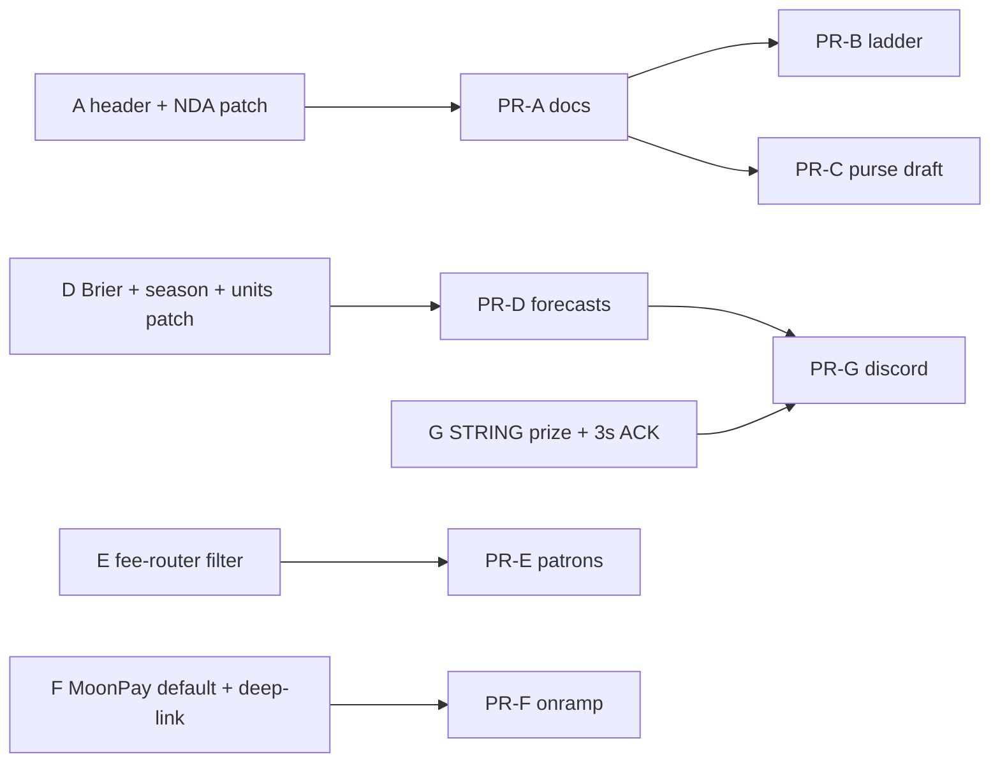

# Design-doc review — DePrize capability-ladder rollout

> **Patches applied 2026-09-16.** Every Blocker replacement paragraph and every concrete Should-fix was written into `pr-a`…`pr-g`. Each child doc has a “Review response (2026-09-16)” footer. **Do not re-apply these patches.** This file remains the review record. Section 1 below is the **pre-patch** verdict; post-patch status is the `Status` field on each child doc (A Ready, B Ready with nits, C–G Ready).
>
> **Remaining open questions only** (not design defects):
> 1. **Parent plan is still stale** (`deprize_capability_ladder_rollout.md`): still hedges tagging Arbitrum #1 as Touchdown, still prefers `MissionContributeModal`, still says odds-wire posts via `send.ts`, still says First Tracks “N metres.” Out of the seven-PR-doc edit scope.
> 2. **Counsel 1.2** — Terms / Prize Rules §6.3+§9 / Terms §7.5 / live payload copy stay draft until counsel. Live UI keeps v1.1 ETH-to-winner wording or “proposed.”
> 3. **Night Shift declassify** — chamber spec stays out of the public tree (`ccdf9800f`). Product/legal must decide whether to declassify later; implementers must not restore it.
> 4. **Fund geo-open** — PR-E documents “geo-open until counsel says otherwise.” Counsel may later treat direct `pay` as new participation.
> 5. First Tracks **10 m** remains reviewer question 1 (frozen for v0.1). Ice dataset delay is intended. Odds-wire 4.9/5.1 flicker accepted for v1. `DISCORD_GUILD_ID` is an ops fill-in.

| Field | Value |
|---|---|
| **Reviewer** | Independent adversarial pass (not the authoring agent) |
| **Date** | 2026-09-16 |
| **Scope** | Parent plan + PR-A…G designs vs current `ui/` + `docs/` |
| **Did not** | Implement product code; commit; edit Solidity |

Source of truth read: [`.cursor/plans/deprize_capability_ladder_rollout.md`](deprize_capability_ladder_rollout.md) and `pr-a`…`pr-g`. Cited files were opened, not trusted.

---

## 1. Verdict

**Overall: Needs revision.** Several PRs are implementable after targeted patches; none of C–G should start as written. A and B are close but will publish NDA-marked specs if followed literally.

| PR | Verdict | Blockers | Should-fix | Nits |
|---|---|---|---|---|
| **A** Capability specs | **Needs revision** | 1 | 3 | 2 |
| **B** Ladder UI | **Needs revision** | 1 | 3 | 2 |
| **C** Payload purse | **Needs revision** | 1 | 4 | 2 |
| **D** Forecasts | **Needs revision** | 1 | 5 | 3 |
| **E** Patrons | **Needs revision** | 1 | 3 | 2 |
| **F** Onramp | **Needs revision** | 1 | 4 | 2 |
| **G** Discord | **Needs revision** | 2 | 4 | 2 |

What is actually good (one sentence each, then defects below):

- **A** correctly restores v0.1 via `git checkout ce77f1bfc -- docs/DEPRIZE_TOUCHDOWN.md` (commit exists; path exists; header is `# TOUCHDOWN`, 4 September 2026, five tests in Part III) and does not resize Sepolia #22.
- **B** correctly refuses to tag Arbitrum #1 as Touchdown (`competitions.ts` title is **The Moon Is A Harsh Mistress**; featured live id is Arbitrum #1 / Sepolia #20).
- **C** correctly freezes `DEPRIZE_TERMS_VERSION = '1.1'` in [`ui/lib/deprize/constants.ts`](../../ui/lib/deprize/constants.ts) and keeps opt-in off `evaluateEligibility`.
- **D** correctly forbids `walletFromSession` (`selectSessionWallet` returns `null` with no linked wallet) and slots the panel between Odds (~732–749) and Competitors (~751) in [`ui/pages/deprize/[id].tsx`](../../ui/pages/deprize/[id].tsx).
- **E** correctly rejects mounting [`MissionContributeModal.tsx`](../../ui/components/mission/MissionContributeModal.tsx) (2,850 lines; `pay` at 1607–1626 is real).
- **F** BetModal `insufficient` at ~108 and dead-end copy at ~594–597 are accurate.
- **G** correctly refuses `/api/discord/send` from cron (`authMiddleware` in [`ui/pages/api/discord/send.ts`](../../ui/pages/api/discord/send.ts); [`sendDiscordMessage.tsx`](../../ui/lib/discord/sendDiscordMessage.tsx) is a browser `fetch` to that route).

---

## 2. Cross-cutting issues

### 2.1 Parent plan is stale vs the child docs (and vs the code)

The parent still hedges **“Tag Sepolia #22 (and Arbitrum #1 if it is the Touchdown entry)”**. It is not. [`ui/lib/deprize/competitions.ts`](../../ui/lib/deprize/competitions.ts) lines 103–115 and 249–258: Arbitrum #1 / Sepolia #20 = Harsh Mistress, placeholder teams `[2, 6, 7, 8]`. PR-B already resolved this; the parent will re-confuse a parallel agent.

The parent PR-E paragraph still says *“If reusing `MissionContributeModal` directly is simpler … prefer that.”* That contradicts the known constraint and PR-E §5. An agent that only reads the parent will import the 2,850-line modal.

The parent PR-G paragraph still says the odds wire posts *via* `send.ts` / `sendDiscordMessage`. Cron cannot. PR-G §6.4 is right; the parent is wrong.

### 2.2 Copy-pasted §10 “Shared conventions” fights PR-D and PR-G

Every child doc’s §10 repeats:

> API auth = `withMiddleware(handler, authMiddleware, rateLimit)` … wallet via `sessionWallet.ts`.

That is the **betting** convention. Forecast submit/mine must use Privy `userId` only. Discord interactions must use Ed25519, not Privy. An implementer who obeys §10 on those routes will break email-only forecasts or lock Discord behind a session. PR-D/PR-G body text is correct; the footer is a foot-gun.

### 2.3 Merge conflicts — `[id].tsx` and `BetModal.tsx` are the blast radius

All of B, C, D, E, F edit [`ui/pages/deprize/[id].tsx`](../../ui/pages/deprize/[id].tsx). C and F both edit [`ui/components/deprize/BetModal.tsx`](../../ui/components/deprize/BetModal.tsx). D and G both introduce `ui/lib/deprize/serverMarket.ts` and both touch `ui/scripts/.mocharc-deprize-unit.json`.

Slots that do **not** overlap if everyone stays in their lane:

| Slot | Owner |
|---|---|
| After `DePrizeQuestionCard` (before position panel) | B ladder |
| Header stats label + explainer + Fund button | C + E (same grid — will conflict) |
| Between Odds and Competitors | D `ForecastPanel` |
| After Competitors, before region notice (~815) | E patrons |
| BetModal insufficient branch + terms checkbox | F + C (same file — will conflict) |

`refreshNonce` already exists on the prize page (~186). E can increment it; do not invent a second nonce.

### 2.4 Shared helpers that must be written once

| Helper | First writer | Consumers | Risk if duplicated |
|---|---|---|---|
| `serverMarket.ts` | **D** (canonical). G copies only if D is not merged | G `/odds` `/pool`, D cron | Two RPC conversions, two `state()` probe bugs |
| Display-name sanitize (40 chars, no `://`, no raw IP, NFC) | **C** | D profile opt-in | Divergent XSS/IP rules |
| `FORECAST_SEASON = '2026'` | **D** | G `/leaderboard` | G reads `forecast:lb:2026` while D writes calendar year of `resolvedAt` |
| `postDiscordChannelMessage` | **G** | `send.ts` refactor | Cron calling Privy route |

### 2.5 Night Shift identity is not one thing

[`docs/DEPRIZE_NIGHT_SHIFT.md`](../../docs/DEPRIZE_NIGHT_SHIFT.md) is a **chamber** prize (10 We, 354 h, <100 K, unplugged) and opens with **CONFIDENTIAL — INTERNAL / NDA**. The ladder bar “Survive a lunar night — 2028+” is a **surface** capability that does not exist as a market. A, B, and the parent all point the public UI at the chamber file. That is a product lie and a confidentiality problem (see A/B).

### 2.6 First Tracks N, payload tiers, season key

| Topic | Parent | A | C | D | G | Freeze |
|---|---|---|---|---|---|---|
| First Tracks traverse | “≥ N metres” | **10 m** as named parameter | — | — | — | **10 m** in v0.1; parent should say so |
| Payload tiers | nameplate → capsule → slot (no USD) | names only | **&lt;5k / 5–25k / ≥25k** | — | — | C constants; A must not invent other brackets |
| Forecast season | `forecast:lb:{season}` | — | — | `'2026'` **or** year of `resolvedAt` | `forecast:lb:2026` | **`FORECAST_SEASON = '2026'`** only |
| Discord outbound | `send.ts` | — | — | — | extract server helper | **G is right** |

### 2.7 `*.local.md` already in tree

[`docs/DEPRIZE_US_NEXUS_HARDENING_PLAN.local.md`](../../docs/DEPRIZE_US_NEXUS_HARDENING_PLAN.local.md) is already present. These PRs must not add another. Do not link it.

---

## 3. Per-PR findings

### PR-A — Capability specs

Verified: `ce77f1bfc` is `docs: add Touchdown — DePrize for the next successful lunar landing` and contains `docs/DEPRIZE_TOUCHDOWN.md`. GTM already cites that path as rules of record ([`docs/DEPRIZE_GTM_TOUCHDOWN.md`](../../docs/DEPRIZE_GTM_TOUCHDOWN.md) line 4). Sepolia #22 / JB **268** / mission 14 / `shared-next-landing` matches `competitions.ts` comments. `DePrizeState.SUPERSEDED = 11`, `liveTipOf` / `resolveLiveDePrizeId` / `buildSupersededPayouts` exist as cited.

**Blocker — v0.1 header is NDA / “nothing on-chain” and §6.2 forbids touching it.**  
`git show ce77f1bfc:docs/DEPRIZE_TOUCHDOWN.md` opens with `CONFIDENTIAL — INTERNAL / NDA`, **Version 0.1-draft**, **Status: pre-registration, nothing on-chain**. That is now false (Sepolia #22 is the live tip) and unsafe to treat as the public rules of record. An agent who “does not rewrite v0.1” will commit an NDA banner that GTM and PR-B then publish.

**Should-fix — distinguish First Tracks from Sepolia #12 / `shared-lunar-rover`.**  
[`competitions.ts`](../../ui/lib/deprize/competitions.ts) 164–177 and atlas `shared-lunar-rover` are **crewed LTV** (Astrolab FLEX / CLV-1, Lunar Outpost, IM Moon RACER). First Tracks is unmanned commercial egress (FLIP, CubeRover, MAPP). The design never says “this is not #12.” The next agent will bind the wrong atlas goal or copy Touchdown’s six lander outcomes.

**Should-fix — Night Shift public link.**  
Do not make [`DEPRIZE_NIGHT_SHIFT.md`](../../docs/DEPRIZE_NIGHT_SHIFT.md) a public ladder href while it still carries the NDA header. The ladder page can describe 2028+ surface night and say the chamber spec is internal.

**Should-fix — Chang'e-7 sits on both Touchdown and Ice.**  
Same vehicle can clear Touchdown Test 3/4 and later publish ice data. Say so, or Senate checklists will treat Ice as “already paid on Touchdown.”

**Nit — First Tracks Test 5 cites Touchdown v0.2 (c), which is the Test 3 orientation bar**, not Test 5 (agency success declaration). A rover drive does not need “horizon in frame from the lander.” Write a rover-shaped confirmation bar.

**Nit — parent still says “N metres”; this doc froze 10 m.** Update the parent so B’s one-line bar matches.

---

### PR-B — Ladder UI

Verified: `DePrizeCompetition` has no `ladder` field today (lines 65–87). `getDePrizeCompetition` / `liveTipOf` / `resolveLiveDePrizeId` are pure. Mocha glob already matches `ladder.cy.ts`. Index has a region notice then search ([`DePrizeIndexContent.tsx`](../../ui/components/deprize/DePrizeIndexContent.tsx) 164–180) — placement “after region notice, before search” is real. QuestionCard accordion is a single `<details>` around `raceGoal.criteria` — `criteriaNotes` fits. Atlas `shared-next-landing` `market.status` is `"planned"` (do not flip). Arbitrum #1 correctly left untagged.

**Blocker — `specHref` for Night Shift points at an NDA-marked file.**  
`SPEC('DEPRIZE_NIGHT_SHIFT.md')` on the public `/deprize` strip publishes a document that says “not for publication.” Use the ladder doc’s Night Shift paragraph, or omit the href until the chamber spec is declassified.

**Should-fix — wrong claim that QuestionCard currently shows “operator livestream.”**  
Atlas upright threshold is *“Excludes tip-overs such as IM-1, IM-2, and SLIM”* ([`atlas.dataset.json`](../../ui/lib/lunar-atlas/seed/atlas.dataset.json) ~3285–3292). Livestream language lives only in v0.1 Part III (not on this branch). The accordion shows **hard 24 h**, not livestream. v0.2 notes are still worth adding; do not tell the implementer to “replace livestream copy” that is not there.

**Should-fix — `getLadderForCompetition` ignores `competition.ladder.status`.**  
§6.1 writes `status: 'live'` onto #21 (superseded). §6.2 computes status only from `CAPABILITY_LADDER`. Either drop the per-row `status` or define which one wins. Test 3 (`href` → `/deprize/22` for id 21) is right; the unused field will rot.

**Should-fix — atlas description paragraph still says “at least 24 hours”** after you change only `threshold` strings. Moon Base Zero and the prize accordion will disagree unless the `shared-next-landing` description is updated too (or you accept the contradiction and say so).

**Nit — GitHub blob URLs on `main` 404 until A merges.** Already acknowledged. Prefer `SPEC` relative to the default branch of this PR’s repo, or link `/docs/...` only if you also publish to the docs site (you correctly said you will not).

**Nit — featured hero on `/deprize` is still Harsh Mistress** (`getFeaturedLiveDePrizeId`). The ladder strip will show Touchdown as `live` while the hero is a meme prize. Worth one sentence so QA does not file a bug.

---

### PR-C — Payload purse

Verified: pool label `Prize pool · to winner` at [`[id].tsx`](../../ui/pages/deprize/[id].tsx) 625–627; tooltip is the cheque sentence. Hero / race card “prize pool” at LiveDePrizeHero ~166 and RaceMarketCard ~589 / ~678. BetModal 5% line at 451. Terms §7.5 / §10.1–10.2 and Prize Rules **§6.3** (“paid in ETH … to the Winner's designated wallet”) plus **§9** 30/70 milestones are the in-force cheque machine. `AcceptanceRecord` has no opt-in fields. `accept-terms` already 403s on failed eligibility. `DEPRIZE_TERMS_VERSION` is `'1.1'`. `evaluateEligibility` is country/VPN/sanctions/deny/insider only.

**Blocker — live UI will assert the waterfall while v1.1 / Prize Rules 1.0 still say ETH to the winner’s wallet.**  
§6.3 copy table changes the pool stat, tooltip, hero, cards, and BetModal to “buys the community payload” as **fact**. Click-wrap still binds **Terms v1.1** + Prize Rules §6.3 / §9.4–9.5 (Milestone 1/2 ETH wires, 18-month M2). A “Proposed 1.2 (not in force)” banner on the same page does not save you: the **product chrome** is making a representation the click-wrap contradicts. That is the C1 failure mode you rejected as the *only* change, then shipped as the UI change anyway.

**Should-fix — Prize Rules amendment is incomplete if it only restates §6.3.**  
Payment mechanics live in §9 (claim window, 30/70, M2 deadline, forfeiture). Terms §7.5 (“Prize is paid … in milestone tranches”). Lifecycle copy in [`lifecycle.ts`](../../ui/lib/deprize/lifecycle.ts) (`M1_RELEASED` / `M2_COMPLETE` / “30% of the prize has been released”). Counsel-facing draft must list those, or the next agent will only edit §6.3 and leave the milestone machine in force.

**Should-fix — do not put Proposed 1.2 on the click-wrap target.**  
[`ui/content/docs/Legal/DePrize/DePrize Terms and Conditions.md`](../../ui/content/docs/Legal/DePrize/DePrize%20Terms%20and%20Conditions.md) is what BetModal links (`DEPRIZE_TERMS_URL`). Draft counsel text belongs in [`docs/DEPRIZE_PAYLOAD_PURSE.md`](../../docs/DEPRIZE_PAYLOAD_PURSE.md) or a non-click-wrap `docs/` draft until version bumps.

**Should-fix — accept-terms `useEffect` deps.**  
BetModal saves acceptance on `[wallet, termsAccepted, allAttested, attestations]` (lines 205–237). Adding `payloadNameOptIn` / `payloadDisplayName` to the JSON without adding them to the deps means toggling the checkbox after attestations are saved **does not re-POST**. Spell the new deps.

**Should-fix — `useTotalFunding.refetch` is `router.reload()`** ([`useTotalFunding.tsx`](../../ui/lib/juicebox/useTotalFunding.tsx) 46–48). Already noted. Do not call it from the explainer.

**Nit — `useETHPrice` returns `{ ethPrice, data, isLoading }`.** BetModal already uses `ethPrice`. Fine.

**Nit — GoalDePrizeDetail “Prize pool” left alone.** Correct.

---

### PR-D — Forecasts

Verified: `authMiddleware` accepts a Privy JWT with **no wallet**. `verifyPrivyAuth` → Privy claims; `getPrivyUserData` uses `verifiedClaims.userId`. `walletFromSession` → `selectSessionWallet` → `null` if `walletAddresses.length === 0`. `evaluateEligibility` is unused by forecasts in this design (good). Mocha glob is **only** `cypress/integration/lib/deprize/*` — forecasts glob must be added. Pages Router: `pages/deprize/leaderboard.tsx` wins over `[id].tsx`. `logs.ts` is `withMiddleware(handler, rateLimit)` + `setCDNCacheHeaders` — it does **not** use `publicHeadersMiddleware`. `getDePrize` **reverts** on unknown ids; `useDePrize` probes `state()` first (lines 74–77). `calcMarginalPrice` conversion at `useDePrizeMarket.tsx` 426 is `(Number(p) / 2 ** 64) * 100`. `shouldSurfaceResolution` exists. `authorizeCronRequest` + `cronSecretFromRequest` + `deprize-reconcile.yml` are the right cron template. `resolveDePrizePageProps` does **not** hide the page; `[id].tsx` ignores the `restricted` SSR prop and uses client `useRegionRestriction` only to disable Buy.

**Blocker — `timeAveragedBrier` day-inclusion is an OR, not a spec.**  
§6.1: *“exclusive of the resolution day if you need Metaculus no peeking; include it if the forecast existed at 00:00 UTC.”* Two implementations will disagree on every resolved prize. Freeze one rule (recommendation: **include a UTC day iff the latest forecast existed at 00:00 UTC that day, and the day is `< resolvedAt` date** — i.e. exclude the resolution calendar day). Put that in the function docstring and in the mocha case.

**Should-fix — freeze storage units as `[0, 1]` in the Redis JSON.**  
UI is 0–100; math is `[0, 1]`. If history is stored as 0–100, Brier scores explode. Say `latest` / `history[].vector` are unit-sum probabilities in `[0, 1]`. Convert at the API boundary only.

**Should-fix — freeze `FORECAST_SEASON = '2026'`.**  
Delete the “unless calendar year of `resolvedAt`” waffle. G already hard-codes `forecast:lb:2026`.

**Should-fix — superseded #21 will grow a second forecast book.**  
`ForecastPanel` on every prize page includes `/deprize/21`. Same real-world event, different Redis id. Either refuse submit unless `resolveLiveDePrizeId(chain, id) === id`, or document that #21 forecasts are scored only when #21’s own CTF vector surfaces (they may never).

**Should-fix — §10 still tells the agent to use `sessionWallet`. Strike it for this PR.**

**Should-fix — region notice copy** (`[id].tsx` ~817): “You can view odds, cash out and claim.” Add “and submit a free forecast” or QA will think the panel is a bug.

**Nit — `getServerSideProps` / `restricted`:** the prize page already ignores SSR `restricted`. Leaderboard can copy `resolveDePrizePageProps` blindly; nothing hides. Over-warned.

**Nit — `publicHeadersMiddleware` allows `GET, OPTIONS` only.** Fine for crowd/leaderboard; do not wrap `submit` in it.

**Nit — Brier test arithmetic for uniform-vs-one-hot (2/3) is correct** (unnormalized Σ). Keep it; do not “fix” to 1/N-averaged Brier.

---

### PR-E — Patrons

Verified: `buildPayEventsQuery` in [`fetchMissionFundingStats.ts`](../../ui/lib/mission/fetchMissionFundingStats.ts) is **not exported**, hardcodes `DEFAULT_CHAIN_V5.id`, and does **not** select `from` or `memo`. [`recent-donations.ts`](../../ui/pages/api/mission/recent-donations.ts) does select `from, beneficiary, amount, timestamp, memo`. [`/api/juicebox/query`](../../ui/pages/api/juicebox/query.ts) is POST `{ query, variables }`, `rateLimit` only. Mint addresses match `DEPRIZE_MINT_ADDRESSES`. `JBV5_TERMINAL_ADDRESS = 0x2dB6…1846`. Prize page already calls `useTotalFunding(jbProjectId, chain)` — same terminal + **DePrize chain**. `usePrizePatrons` / `FundPrizeModal` do not exist. `refreshNonce` exists. `useDePrizeLaunchpadToken` does not return a ruleset. `sendDePrizeTx` and `useDePrizeChainGuard` exist. `DEPRIZE_AVAILABILITY_LEGEND` / `DEPRIZE_TERMS_URL` exist.

**Blocker — fee-router `pay` events will become the whale “patron.”**  
[`DePrizeFeeRouter.sol`](../../subscription-contracts/src/deprize/DePrizeFeeRouter.sol) 141–148: while live, `sweepFees` calls `jbTerminal.pay{value: swept}(..., owner(), 0, "DePrize trade fees", "")`. `from` = `DEPRIZE_FEE_ROUTER_ADDRESSES` (Sepolia `0xbe8c…783a`), **not** mint. Beneficiary = router `owner()` (deployer / future Safe). Filter `from !== mint` only → the wall shows the treasury as the top patron and `totalDirectWei` includes 1% trade fees. Required exclusions: **mint and fee router** (case-insensitive), plus fail-closed on missing `from`. Add a synthetic fee-router event to `patrons-math.cy.ts`.

**Should-fix — US / restricted visitors can fund.**  
[`docs/DEPRIZE_JURISDICTIONAL_CONTROLS.md`](../../docs/DEPRIZE_JURISDICTIONAL_CONTROLS.md) gates **new participation**; sell/redeem are the explicit exceptions. Direct `pay` is new money into the prize pool. The design calls this intended. Counsel may not. Minimum: keep the legend **and** add a one-line product decision in the doc (“Fund is geo-open until counsel says otherwise”) so the implementer does not “helpfully” wire `evaluateEligibility`.

**Should-fix — validate `jbProjectId` / `chainId` as integers** before interpolating into the GraphQL string. The mission helper interpolates too; do not copy that sloppiness into a new public POST.

**Should-fix — `95n` vs `BigInt(95)`.** Mission modal uses `BigInt(95) / BigInt(100)`. Either is fine; do not invent a `ruleset` fetch that blocks Sepolia.

**Nit — `buildPayEventsQuery` cannot be imported.** “Mirror” is the right verb; do not write `import { buildPayEventsQuery }`.

**Nit — parent still prefers MissionContributeModal.** Ignore the parent.

---

### PR-F — Onramp

Verified: `insufficient` ~108; dead-end ~594–597; eligibility effect ~164–201; accept-terms ~205–237; cap `DEPRIZE_MAX_BET_WEI = UNIT`. `useOnrampJWT.generateJWT` / `verifyJWT` accept optional `missionId` + `context`. `FundOnramp` exists with `defaultProvider`, `coinbaseRedirectUrl`, `onCoinbaseBeforeNavigate`, `onCoinbaseSuccessInApp`. Default provider state is **`'moonpay'`**; region auto-select is Coinbase for US, MoonPay otherwise. `useOnrampFlow` reopens a **mission** contribute modal, not BetModal — do not mount it on the prize page. `?outcome=` deep-link (~398–425) waits for `userAddress && bettingAllowed`. `sepoliafaucet.com` is already mentioned in `deprize-play.tsx`. `NEXT_PUBLIC_MOCK_ONRAMP` short-circuits `CBOnramp`. `LiveDePrizeHero` and `RaceMarketCard` already mount `BetModal` with `deprizeId`. JWT localStorage key is a single `'onrampJWT'`. `/api/coinbase/onramp-jwt` is Privy-gated and accepts any `context` / `missionId`.

**Blocker — forcing `defaultProvider="coinbase"` fights eligibility.**  
DePrize eligibility **excludes U.S. persons** (`DEPRIZE_AVAILABILITY_LEGEND`, `evaluateEligibility` + restricted list). `FundOnramp`’s own comment: Coinbase for US, MoonPay for everyone else. Eligible bettors are the MoonPay population. Forcing Coinbase sends them down the US-default path. Omit `defaultProvider` (keep the region toggle) or default `moonpay`. Coinbase remains available as a manual switch. Missions force Coinbase because missions **are** US-reachable; this is not that flow.

**Should-fix — `?outcome=` race.**  
Existing deep-link effect no-ops until `bettingAllowed`. Onramp return must **own** `outcome` when `onrampSuccess=true` and the deep-link effect must `return` immediately in that case. Otherwise a restricted user never sees the reopened modal, or the deep-link latches and then you strip `outcome`.

**Should-fix — do not put `missionId: String(deprizeId)`.**  
Sepolia Touchdown is DePrize **22** and launchpad mission **14**. `verifyJWT` “Mission ID mismatch” is built for Juicebox mission ids. Use `context: 'deprize'` and either omit `missionId` or pass `launchpad.missionId` only if you are not auto-paying the mission (you must not — `useOnrampAutoTransaction` stays in the mission modal).

**Should-fix — shared `localStorage` key `onrampJWT`.**  
A mid-flight mission onramp JWT is overwritten by BetModal `generateJWT`. Document: `clearJWT` on BetModal unmount; always `verifyJWT(..., undefined, 'deprize')` on return; mismatch → error, no bet.

**Should-fix — index BetModals.**  
Hero/card already have `deprizeId`. Their redirect **must** be `buildOnrampReturnUrl` (detail path), not `useOnrampRedirect.generateRedirectUrl()` on `/deprize`.

**Nit — `useOnrampFlow` is the wrong hook to import.** Copy the once-ref + 500 ms delay; do not open `contributeModalEnabled`.

**Nit — Sepolia faucet copy is right. Do not mount FundOnramp on testnet.**

---

### PR-G — Discord

Verified: no Interactions route; no `discord-interactions` / `tweetnacl` in [`ui/package.json`](../../ui/package.json). `send.ts` is Privy-gated. `maxProbDelta` is percentage points and returns **`Infinity`** on NaN or length mismatch ([`lmsr-history.ts`](../../ui/lib/deprize/lmsr-history.ts) 88–96). `authorizeCronRequest` matches reconcile. Raw-body pattern already exists in [`ui/pages/api/typeform/webhook.ts`](../../ui/pages/api/typeform/webhook.ts) (`bodyParser: false` + `readRawBody`). `DEPLOYED_ORIGIN` exists. `CAPABILITY_LADDER` does not exist yet (G’s “plus any live ladder id” is optional). Mocha has no `lib/discord` glob. `tsx` is used in scripts but is **not** a declared dependency — pre-existing; copy the `export:deprize-compliance` invocation anyway.

**Blocker — `<prize>` cannot be a Discord INTEGER if you also accept `touchdown`.**  
§6.2: resolve numeric id **or** the string `touchdown` → 22. §6.3: `odds` / `forecast` / `pool` take **integer** `prize`. Integer options cannot receive `touchdown`. Use a **STRING** option (required for `/odds` `/pool` `/forecast`), parse `^\d+$` or `^touchdown$`.

**Blocker — Discord’s 3 s budget vs `serverMarket`.**  
`rpcRead` concurrency is 3, timeout 15 s ([`read.ts`](../../ui/lib/deprize/read.ts)). A 6-outcome prize is `state` + `getDePrize` + `marketOf` + 6 `calcMarginalPrice` + CTF payouts. If you `await serverMarket` before the ACK, Discord records “application did not respond” and will disable the endpoint. “If RPC is slow, respond with an error” only works if you **race a ~2.0 s timer** or send **type 5 (DEFERRED)** then edit. Write that as a mandatory step, not a risk-table footnote.

**Should-fix — `maxProbDelta` + `>= 5` posts on garbage.**  
NaN / length mismatch → `Infinity >= 5` → **true**. `shouldPostOddsWire` must reject non-equal finite lengths **before** calling `maxProbDelta`.

**Should-fix — copy `readRawBody` from the typeform webhook.** Do not invent a second stream reader. Verify against **raw bytes** (`Buffer` / `rawBody.toString('utf8')` must be the exact signed string).

**Should-fix — `/pool` must not import `useTotalFunding`.** That is a React hook. Spell a server `balanceOf` + `usedPayoutLimitOf` read (same params as the hook) or ETH-only.

**Should-fix — mocha glob.** `cypress/integration/lib/discord/*.cy.ts` will not run until `.mocharc-deprize-unit.json` is updated. `odds-wire.cy.ts` under `lib/deprize/` will.

**Nit — `#forecast` vs `id="deprize-forecast"`.** Pick one fragment and put it in D’s panel props. Discord cannot scroll to a missing id.

**Nit — `publicHeadersMiddleware` CORS methods are GET/OPTIONS.** Discord server POSTs do not need CORS. Do not add `authMiddleware`.

---

## 4. Cross-doc contradictions (explicit)

1. **Arbitrum #1.** Parent: maybe Touchdown. B + code: Harsh Mistress. **B wins.**
2. **MissionContributeModal.** Parent: prefer if simpler. E + size (2,850) + known constraint: never mount. **E wins.**
3. **Odds-wire outbound.** Parent: `send.ts` / `sendDiscordMessage`. G: extract `postDiscordChannelMessage`. **G wins.**
4. **Payload tiers.** A names three editorial tiers; only C assigns USD. No conflict if A stays qualitative.
5. **First Tracks N.** Parent: N; A: 10 m. **A wins**; update parent.
6. **Night Shift.** A: chamber proxy + 2028+ surface. B: one bar “Survive a lunar night — 2028+” linking the chamber NDA spec. **Not one identity.** Split the label (“Chamber proxy · 2028+ surface”) or drop the href.
7. **Forecast season.** D waffle vs G `2026`. **Freeze `2026`.**
8. **Discord `/forecast`.** D: website only. G: link + optional `#forecast` id. Compatible if D adds the id.
9. **§10 auth boilerplate** vs D/G actual auth. **Body text wins; delete the footer on D/G.**
10. **Terms version.** Parent + C agree: stay 1.1. Do not let a “helpful” agent bump it.

---

## 5. Recommended patches (Blockers only)

Apply these as replacement paragraphs. Enough to edit without reinventing.

### A — replace §6.2 last sentence + add header override

```
Confirm the file opens with `# TOUCHDOWN`, version **0.1-draft**, date **4 September 2026**,
and the five tests in Part III §2. Then append v0.2 below Appendix A.

**Header override (required, in Part VI, not by silently editing Part I):** state that
v0.1’s “CONFIDENTIAL — INTERNAL / NDA” and “pre-registration, nothing on-chain” banners
are **historical**. Generation 2 (Sepolia #22) is the live tip; this file is the public
rules of record GTM already cites. The NDA banner does not apply to the published
addendum. Do not leave the NDA box as the first thing a /deprize spec link opens.

Do not rewrite v0.1 test wording in Parts I–V; quote new Test 3 / Test 4 language
only in the addendum.
```

### B — replace Night Shift `CAPABILITY_LADDER` entry

```
{
  rung: 3,
  key: 'night-shift',
  label: 'Night Shift',
  bar: 'Chamber proxy now · surface night 2028+',
  specHref: SPEC('DEPRIZE_CAPABILITY_LADDER.md'), // not DEPRIZE_NIGHT_SHIFT.md
  deprizeIdByChain: {},
  statusOverride: 'planned',
}
```

Do not set `specHref` to `DEPRIZE_NIGHT_SHIFT.md` while that file’s NDA header remains.

### C — replace §6.3 opening + copy table policy

```
**Copy policy until counsel approves 1.2.** Do not present the waterfall as in-force
product speech. Pool label may become `Prize pool` (drop “· to winner”) or
`Prize pool · proposed payload`. Tooltip and BetModal 5% line must say
“proposed: community payload on the winner’s next flight (draft pending counsel);
Terms v1.1 still govern.” The explainer is allowed only with a “proposed / not a
contract” prefix. Do not ship “buys the payload” as an unqualified fact.

Draft counsel text lives in docs/DEPRIZE_PAYLOAD_PURSE.md (and optionally a
docs/ draft), **not** in the click-wrap file at
ui/content/docs/Legal/DePrize/DePrize Terms and Conditions.md.
After counsel: bump DEPRIZE_TERMS_VERSION to '1.2', move text into the published
Terms, amend Prize Rules §6.3 **and** §9 (30/70 milestones), Terms §7.5, then
yarn docs:generate.
```

### D — replace `timeAveragedBrier` docstring

```
/**
 * Metaculus-style time-averaged Brier.
 * For each UTC calendar date d from the UTC date of the first forecast
 * through the UTC date **before** resolvedAt (resolution day excluded):
 *   take the last forecast with at <= dT00:00Z + 24h (i.e. standing at
 *   00:00 UTC of that day), score brierScore(vector, resolvedVector).
 * Return the mean of those daily scores. If history is empty, throw.
 * `forecastHistory[].vector` and `resolvedVector` are [0, 1] and sum to 1.
 * Storage in Redis uses the same [0, 1] units. FORECAST_SEASON = '2026'.
 */
```

Also add: **Refuse submit when `resolveLiveDePrizeId(chainSlug, deprizeId) !== deprizeId`** (no forecast book on superseded generations).

### E — replace `isPatronEvent`

```
isPatronEvent(ev, mintAddress, feeRouterAddress):
  from is a 0x address
  AND amount > 0
  AND from.toLowerCase() !== mintAddress.toLowerCase()
  AND from.toLowerCase() !== feeRouterAddress.toLowerCase()

Sepolia fee router: DEPRIZE_FEE_ROUTER_ADDRESSES.sepolia
  (0xbe8cbc97d4ddee28b938c0ed8245f1b5133b783a).
Memo "DePrize trade fees" is supporting evidence, not the only filter
(beneficiary is the router owner / Safe — aggregating by beneficiary would
still list treasury as a patron if from is not excluded).

Required test: from = fee router, beneficiary = 0xSafe, memo = "DePrize trade fees"
→ excluded. from = mint, beneficiary = 0xBettor → excluded. from = 0xAlice → included.
```

### F — replace §6.2 Arbitrum CTA provider

```
**Provider.** Do **not** force defaultProvider="coinbase". Eligible DePrize
users are not U.S. persons; FundOnramp’s region split is Coinbase-for-US /
MoonPay-otherwise (see FundOnramp.tsx comments). Omit defaultProvider so
region detection runs, or pass defaultProvider="moonpay". Keep the in-widget
provider toggle. Pass selectedChain = Arbitrum One so Coinbase (if chosen)
quotes the Arbitrum network, same as missions.

JWT: { address, chainSlug: 'arbitrum', context: 'deprize' } — omit missionId.
On return, verifyJWT(token, address, undefined, 'deprize').
When parseOnrampReturn().active, the existing ?outcome= deep-link effect
must return immediately (do not wait on bettingAllowed).
```

### G — replace command schema + ACK rules

```
Command option `prize` is a **STRING** (required on /odds /pool /forecast;
optional on /bet /leaderboard, default "22"). Parse:
  - /^\d+$/ → that Sepolia id
  - /^touchdown$/i → 22
  - else → ephemeral error “Try /odds 22 or /odds touchdown”

Interactions ACK (mandatory):
  1. Verify signature on the raw body (copy readRawBody from
     ui/pages/api/typeform/webhook.ts; bodyParser: false).
  2. PING → type 1 immediately.
  3. For /odds /pool /leaderboard: either
     (a) race serverMarket against a 2000 ms timer and type-4 the embed
         or “Couldn’t read the market — try the site”, or
     (b) type 5 DEFERRED_CHANNEL_MESSAGE_WITH_SOURCE then PATCH the
         webhook with the embed.
  Never await an unbounded rpcRead before the first Discord response.

shouldPostOddsWire:
  if previous == null → false (store snapshot)
  if lengths differ or any non-finite → false
  else maxProbDelta(previous, current) >= 5
```

---

## 6. Suggested implementation order

**Do not start C, E, F, or G until the matching blocker patch is in the design.** A and D can start the same day those two patches land.



**Truly parallel after this review (once the short patches above are written into the docs):**

| Wave | PRs | Why they do not collide |
|---|---|---|
| **1** | **A** (docs only), **D** (`ui/lib/forecasts/**` + APIs + cron; panel mount is a late step), **E** (`patrons-math` + hook first), **F** (`onrampReturn.ts` + tests first) | Different files until the last UI step |
| **2** | **B** after A’s paths exist; **C** legal drafts in `docs/` only (no live chrome until counsel) | B needs spec URLs; C must not ship unqualified payload copy |
| **3** | Prize-page integration: B ladder → D panel → E wall + Fund button → C explainer (if counsel-ready) → F BetModal CTA | Serialize `[id].tsx` / `BetModal.tsx` edits or stack PRs in that order |
| **4** | **G** after D’s `serverMarket.ts` is on the branch (or G vendors the same file from D §6.5). Ship `/odds` `/pool` `/bet` first; `/leaderboard` `/forecast` when D’s store exists | |

**Do not parallelize** B+C+D+E+F all landing `[id].tsx` in the same week without a designated integrator. The parent’s “A, D, E, F can start immediately” is true for **libraries and docs**, false for the prize page.

**G without D:** `/odds`, `/pool`, `/bet`, odds-wire, register script — yes, if G owns `serverMarket.ts` temporarily and D rebases onto it. `/forecast` and `/leaderboard` wait.

---

## Appendix — citations that checked out

| Claim | Result |
|---|---|
| Arbitrum #1 = Harsh Mistress; Sepolia #22 = Touchdown | True |
| JB 268 / mission 14 | True (`competitions.ts` 260–283) |
| Mint sepolia `0xa6f9…7cc8` / arbitrum `0xfa36…d838` | True |
| `JBV5_TERMINAL_ADDRESS` `0x2dB6…1846` | True |
| `DEPRIZE_TERMS_VERSION` `'1.1'` | True |
| BetModal 108 / 451 / 594–597 | True |
| Mission `pay` 1607–1626; file 2,850 lines | True |
| `send.ts` + `authMiddleware` | True |
| `walletFromSession` needs a wallet | True |
| `evaluateEligibility` pure | True |
| `maxProbDelta` in percentage points | True (but `Infinity` on bad input) |
| `ce77f1bfc` Touchdown v0.1 | True |
| `useTotalFunding.refetch` = `router.reload()` | True |
| Prize page anatomy + line numbers ±0 | True |
| Fee router `jbTerminal.pay` to prize pool | True (`DePrizeFeeRouter.sol` 141–148) |

| Claim | Result |
|---|---|
| Parent: maybe tag Arbitrum #1 as Touchdown | **False** |
| Parent: cron can use `send.ts` | **False** |
| QuestionCard currently shows livestream | **False** (atlas does not) |
| `buildPayEventsQuery` selects `from` | **False** |
| `buildPayEventsQuery` is importable | **False** |
| `logs.ts` uses `publicHeadersMiddleware` | **False** |
| `tsx` / `discord-interactions` in `package.json` | **False** (tsx used in scripts, not declared; Discord dep missing as G said) |
| `serverMarket.ts` exists | **False** (proposed — OK if written as new) |
