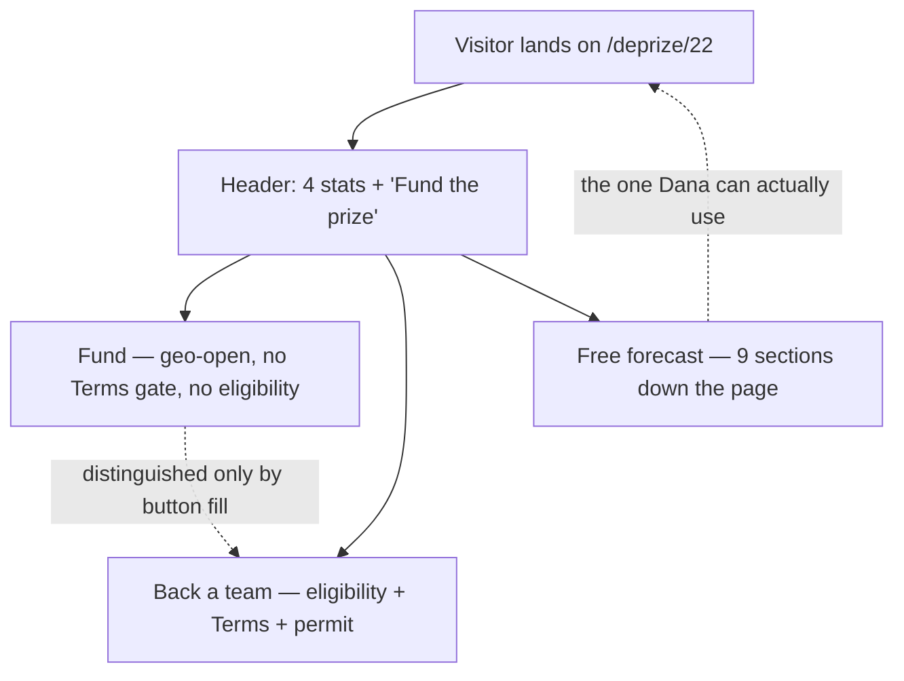

# Design review — DePrize capability-ladder rollout (PRs A–G)

| Field | Value |
|---|---|
| **Type** | Product-design critique of seven engineering design docs |
| **Reviewer** | Principal product designer (independent) |
| **Date** | 2026-09-16 |
| **Scope** | `.cursor/plans/pr-a…pr-g`, read against the live UI in `ui/pages/deprize/[id].tsx` and `ui/components/deprize/` |
| **Out of scope** | Correctness/engineering review (already done in `pr-design-docs-review.md`), legal sign-off, product strategy |
| **Deliverable** | This file only. No product code was changed. |

This review is deliberately adversarial. Where a design is good it gets one sentence;
the rest of the words go to defects. Every claim about the existing UI was checked
against the files, not assumed — contrast ratios are computed, not estimated, and the
method is in §3.

---

## 1. Method

I ran a heuristic evaluation (Nielsen-style, single evaluator) against an 18-criterion
rubric built from the sources in §2, then walked the resulting page as three personas
the docs actually name:

- **Kenji** — non-US, has ETH, wants to back Firefly. Can bet. The docs optimise for him.
- **Dana** — US, arrived from a Discord `/odds` post, cannot bet, *can* forecast. PR-D
  exists for her. The docs never actually get her to the panel (§3, G1).
- **Sam** — EU, email-only Privy login, no wallet, wants the free game. Also PR-D's user.

Figma's critique guidance is that feedback is worthless unless it is aimed at a stated
goal and a stated fidelity ([Figma][s1]). These docs are ~90% done as *engineering*
specs and ~30% done as *design* specs, so I am critiquing them at the fidelity they
claim: "Ready." A doc marked Ready should not leave a designer guessing what the empty
state says.

---

## 2. The rubric

18 checkable criteria. Each cites a source I read; the takeaway is one line.

| # | Criterion | Check | Source + takeaway |
|---|---|---|---|
| R1 | **Primary job is nameable** | Can you state, in one sentence, who the surface is for and the single thing they do on it? Is that thing the visually dominant element? | [NN/g, 10 Usability Heuristics][s2] — "Aesthetic and minimalist design": every extra unit of information competes with the relevant units. |
| R2 | **Information hierarchy matches user priority** | Does read order match the order a first-time visitor needs answers in, not the order features were built in? | [NN/g, Heuristic Evaluation][s3] — evaluate the interface as a whole, repeatedly, not feature by feature. |
| R3 | **Progressive disclosure is used, ≤2 levels** | Is secondary detail collapsed behind a label with strong information scent, rather than stacked inline? | [NN/g, Progressive Disclosure][s4] — the first level must carry ~80% of need, and the disclosure label must predict what's behind it. |
| R4 | **Empty state teaches** | Does the empty state explain what belongs there, why it's empty, and the next step — rather than just being blank? | [NN/g, Designing Empty States][s5] — an empty container that stays empty "creates confusion and decreases user confidence." |
| R5 | **Loading is distinguishable from empty** | Is there a specified loading treatment, and does it differ from "zero results"? | [NN/g, Response Times][s6] + [NN/g, Progress Indicators][s7] — >1 s needs an indicator; >10 s needs percent-done. [NN/g, Skeleton Screens][s8] — skeletons suit full-page loads, not in-place refreshes. |
| R6 | **Errors are recoverable and specific** | Does every failure path name what happened, in plain language, with a way forward? | [NN/g, Error Message Guidelines][s9] — be explicit, human-readable, polite, and offer a constructive next step. |
| R7 | **Error prevention over error messaging** | Are impossible actions disabled with an explanation, instead of allowed and then rejected? | [NN/g, 10 Heuristics][s2] — heuristic 5 ranks prevention above good error messages. |
| R8 | **Contrast ≥4.5:1 text / ≥3:1 non-text** | Computed, not eyeballed, against the real token values. | [WCAG 2.2 SC 1.4.3][s10]; [Material 3 colour & contrast][s11] — non-text boundaries need 3:1. |
| R9 | **Not colour-alone** | Is any meaning (outcome identity, up/down, win/lose) carried by colour with no text/shape backup? | [WCAG 2.2 SC 1.4.1][s12] — colour must never be the only visual means of conveying information. |
| R10 | **Keyboard + AT operable; no drag-only** | Every control reachable and operable by keyboard; any drag has a single-pointer alternative; correct roles. | [WCAG 2.2 SC 2.5.7 Dragging Movements][s13]; [APG Slider (Multi-Thumb)][s14]; [APG Spinbutton][s15]. |
| R11 | **Async changes are announced** | Do updates that happen without a page change hit a live region? | [WCAG 2.2 SC 4.1.3 Status Messages][s16] — status changes must be programmatically determinable without focus change. |
| R12 | **Focus is managed and visible** | Dialogs trap and restore focus; focus is never obscured by sticky chrome after a redirect. | [APG Dialog (Modal)][s17]; [WCAG 2.2 SC 2.4.11 Focus Not Obscured][s18]; [What's new in WCAG 2.2][s19]. |
| R13 | **Touch targets ≥24px (WCAG) / 48dp (Material)** | Measured on the smallest viewport, including stacked controls. | [WCAG 2.2 SC 2.5.8 Target Size][s20]; [Material 3, target sizes][s21] — 48×48dp, 8dp spacing. |
| R14 | **Motion respects preference** | Is celebratory/decorative motion gated on `prefers-reduced-motion`? | [MDN prefers-reduced-motion][s22]; [WCAG 2.2 SC 2.3.3][s23]. |
| R15 | **Copy is in-voice and non-overstating** | Product lexicon held (prize/purse/back/chance; never invest/returns/wager); no claim stated as fact that the Terms contradict. | [FCA FG23/3][s24] — promotions must be "fair, clear and not misleading"; [FCA COBS 4.12A][s25] — risk warnings must be prominent and not disguised. |
| R16 | **No dark patterns around money** | No false urgency, no preselected amounts, no confirmshaming, no hidden cost, no manufactured social pressure. | [Deceptive Design, types][s26]; [OECD, Dark Commercial Patterns][s27] — framing, preselection, false hierarchy and social proof are the most prevalent categories; [Mathur et al., Dark Patterns at Scale][s28]. |
| R17 | **Visualisation is honest** | Units comparable, normalisation stated, uncertainty and sample size shown, no implied authority, no unlabeled score direction. | [Tufte, data-ink][s29] + [lie factor / misleading graphs][s30]; [FT Visual Vocabulary][s31]; [Padilla, Kay & Hullman, Uncertainty Visualization][s32]; [Hullman et al., In Pursuit of Error][s33]; [Brier score & skill score][s34]; [ECMWF on BSS][s35]. |
| R18 | **Reuses the design system + is measurable** | Names the existing primitive it is built from; and names the one metric that would prove the surface worked, with the event that measures it. | [NN/g, Trustworthy Design][s36] — consistency and transparency are what earn trust in money UI; [Figma critique][s1] — feedback must be aimed at a goal you can check. |

### Sources

All URLs were fetched and confirmed to resolve on 2026-09-16.

| Ref | Source | URL | One-line takeaway |
|---|---|---|---|
| s1 | Figma — How we do design critiques | `figma.com/blog/design-critiques-at-figma/` | Match the critique format to the problem, state how done the work is, and ask for specific feedback rather than opinions. |
| s2 | NN/g — 10 Usability Heuristics | `nngroup.com/articles/ten-usability-heuristics/` | Error prevention outranks error messages, and every extra element competes with the relevant ones. |
| s3 | NN/g — How to Conduct a Heuristic Evaluation | `nngroup.com/articles/how-to-conduct-a-heuristic-evaluation/` | Pass over the interface more than once: first for flow, then for individual elements. |
| s4 | NN/g — Progressive Disclosure | `nngroup.com/articles/progressive-disclosure/` | The first level must serve the majority need and the disclosure label must predict what is behind it. |
| s5 | NN/g — Designing Empty States | `nngroup.com/articles/empty-state-interface-design/` | A container left blank "creates confusion and decreases user confidence"; say what belongs there and how to fill it. |
| s6 | NN/g — Response Times: 3 Important Limits | `nngroup.com/articles/response-times-3-important-limits/` | Past ~1 s users notice the delay; past ~10 s they leave unless you hold attention. |
| s7 | NN/g — Progress Indicators | `nngroup.com/articles/progress-indicators/` | Looping indicators are for short waits; anything long needs percent-done, not a spinner. |
| s8 | NN/g — Skeleton Screens | `nngroup.com/articles/skeleton-screens/` | Skeletons suit initial full-page loads, not in-place refreshes of already-visible data. |
| s9 | NN/g — Error Message Guidelines | `nngroup.com/articles/error-message-guidelines/` | Explicit, human-readable, polite, and always offering a constructive next step. |
| s10 | WCAG 2.2 — SC 1.4.3 Contrast (Minimum) | `w3.org/WAI/WCAG22/Understanding/contrast-minimum.html` | 4.5:1 for normal text, 3:1 for large text — measured, not eyeballed. |
| s11 | Material 3 — Colour & contrast | `m3.material.io/foundations/designing/color-contrast` | Non-text elements such as button containers need 3:1 against their background. |
| s12 | WCAG 2.2 — SC 1.4.1 Use of Color | `w3.org/WAI/WCAG22/Understanding/use-of-color.html` | Colour must never be the only visual means of conveying information. |
| s13 | WCAG 2.2 — SC 2.5.7 Dragging Movements | `w3.org/WAI/WCAG22/Understanding/dragging-movements.html` | Any drag interaction needs a single-pointer alternative unless dragging is essential. |
| s14 | W3C APG — Slider (Multi-Thumb) | `w3.org/WAI/ARIA/apg/patterns/slider-multithumb/` | Interdependent sliders need per-thumb labels and value text; changes must be perceivable. |
| s15 | W3C APG — Spinbutton | `w3.org/WAI/ARIA/apg/patterns/spinbutton/` | Stepper inputs are spinbuttons: labelled, with min/max/now exposed and keyboard increments. |
| s16 | WCAG 2.2 — SC 4.1.3 Status Messages | `w3.org/WAI/WCAG22/Understanding/status-messages.html` | Status changes must be announced without moving focus. |
| s17 | W3C APG — Dialog (Modal) | `w3.org/WAI/ARIA/apg/patterns/dialog-modal/` | Dialogs need `role="dialog"`, `aria-modal`, a focus trap, and focus restore on close. |
| s18 | WCAG 2.2 — SC 2.4.11 Focus Not Obscured | `w3.org/WAI/WCAG22/Understanding/focus-not-obscured-minimum.html` | The focused element must not be hidden behind sticky chrome. |
| s19 | W3C — What's New in WCAG 2.2 | `w3.org/WAI/standards-guidelines/wcag/new-in-22/` | The new AA criteria are focus visibility, dragging alternatives, target size, and accessible authentication. |
| s20 | WCAG 2.2 — SC 2.5.8 Target Size (Minimum) | `w3.org/WAI/WCAG22/Understanding/target-size-minimum.html` | Pointer targets must be at least 24×24 CSS px unless spaced or inline. |
| s21 | Material 3 — Accessibility: structure & target sizes | `m3.material.io/foundations/designing/structure` | 48×48dp touch targets with ~8dp spacing, even when the icon inside is smaller. |
| s22 | MDN — `prefers-reduced-motion` | `developer.mozilla.org/en-US/docs/Web/CSS/@media/prefers-reduced-motion` | Decorative motion must be gated behind the user's OS-level motion preference. |
| s23 | WCAG 2.2 — SC 2.3.3 Animation from Interactions | `w3.org/WAI/WCAG22/Understanding/animation-from-interactions.html` | Non-essential motion triggered by interaction must be disableable. |
| s24 | FCA — FG23/3, cryptoasset financial promotions | `fca.org.uk/publications/fg23-3-finalised-non-handbook-guidance-cryptoasset-financial-promotions` | Promotions must be "fair, clear and not misleading," and firms should test that consumers actually understand them. |
| s25 | FCA Handbook — COBS 4.12A | `handbook.fca.org.uk/handbook/COBS/4/12A.html` | Risk warnings must be prominent and must not be disguised or diminished by surrounding content. |
| s26 | Deceptive Design — Types of deceptive pattern | `deceptive.design/types` | Named patterns to avoid: hidden costs, false urgency, preselection, confirmshaming, forced action. |
| s27 | OECD — Dark Commercial Patterns (DEP No. 336, 2022) | `oecd.org/en/publications/dark-commercial-patterns_44f5e846-en.html` | Framing, preselection, false hierarchy, urgency and social proof are the most prevalent categories, and design-based tricks are as common as text-based ones. |
| s28 | Mathur et al. — Dark Patterns at Scale | `arxiv.org/abs/1907.07032` | Empirical taxonomy linking hidden costs to sunk-cost bias and countdown timers to scarcity bias. |
| s29 | Tufte — data-ink ratio | `en.wikipedia.org/wiki/Data-ink_ratio` | Maximise the share of ink that carries data; erase decoration that carries none. |
| s30 | Misleading graphs / Tufte's lie factor | `en.wikipedia.org/wiki/Misleading_graph` | The size of the visual effect must be proportional to the size of the effect in the data. |
| s31 | FT — Visual Vocabulary | `github.com/Financial-Times/chart-doctor/tree/main/visual-vocabulary` | Pick the chart from the relationship you're showing; dot plots are the standard for comparing a few values per category. |
| s32 | Padilla, Kay & Hullman — Uncertainty Visualization | `onlinelibrary.wiley.com/doi/10.1002/9781118445112.stat08296` | Omitting uncertainty removes the reader's ability to judge the signal; representations that require mental arithmetic produce errors. |
| s33 | Hullman et al. — In Pursuit of Error | `idl.cs.washington.edu/files/2019-UncertaintyEval-InfoVis.pdf` | Survey of 86 studies: how uncertainty is encoded systematically changes the decisions people make. |
| s34 | Brier score (incl. Brier skill score) | `en.wikipedia.org/wiki/Brier_score` | Lower is better and 0 is perfect; the skill score `1 − BS/BS_ref` reverses direction and is what makes scores comparable. |
| s35 | ECMWF — Probabilistic verification / BSS | `confluence.ecmwf.int/spaces/FUG/pages/673551875/Section+12.B+Statistical+Concepts+-+Probabilistic+Data` | BSS = 0 means no better than the reference, 1 is perfect, negative is misleading. |
| s36 | NN/g — Trustworthy Design | `nngroup.com/articles/trustworthy-design/` | Trust is earned through transparency and consistency, and lost fastest where money is involved. |

Also read and drawn on: [WCAG 2.2 spec][sA], [W3C WAI forms-validation tutorial][sB],
[MDN `<input type=range>`][sC], [Princeton Dark Patterns at Scale project][sD],
[NN/g Aesthetic–Usability Effect][sE].

---

## 3. Ground truth — what the live UI actually does

Several findings below depend on facts the docs get wrong or never state. These were
verified in the code, and the contrast ratios were computed with the WCAG relative
luminance formula against `#0f172a` (the dominant `slate-900` stop of the shared `CARD`
gradient in `ui/pages/deprize/[id].tsx`).

**G1 — The "region restricted" notice does not fire for the audience PR-D targets.**
`useRegionRestriction().isRestricted` is fed by `/api/geo/country`, which returns
`restricted: isEUCountry(country)`. It is an **EU/EEA flag**, not the DePrize
restricted-jurisdiction list. The broader `ALL_RESTRICTED` set (US + territories,
sanctions, GB/IE/AU/CA/…) lives in `lib/deprize/restrictedJurisdictions.ts` and is only
consulted server-side by the eligibility API. So today:

- an **EU** visitor sees the amber notice and `bettingAllowed === false`;
- a **US** visitor sees `restricted: false`, a fully-live page, and enabled
  **"Back this team"** buttons — and only discovers the block after opening BetModal and
  waiting on `/api/deprize/eligibility`.

PR-D §6.7 proposes amending that notice's copy to mention free forecasts. That helps EU
visitors and **misses the single largest restricted population entirely**. This is the
root of Risk #1.

**G2 — `DePrizeRestrictedNotice.tsx` is dead code.** Zero call sites (`grep` returns only
its own definition). It renders a full-page replacement. An implementer "fixing" G1 by
mounting it would blank the market UI *and* the ForecastPanel PR-D is trying to promote.
PR-D must say so explicitly or someone will do it.

**G3 — `Notice` is a local function inside `[id].tsx`**, not a shared primitive. Five of
these seven PRs need a notice. None of them names one.

**G4 — There is no live region anywhere in `components/deprize/`.** `grep` for
`aria-live|role="status"|role="alert"` across the directory returns **0**. Every async
surface these PRs add (forecast submit, crowd refresh, patrons refresh, "Funds arrived")
would be silent to a screen reader.

**G5 — `components/layout/Modal.tsx` has no dialog semantics.** No `role="dialog"`, no
`aria-modal`, no focus trap, no focus restore on close. The only ARIA present is
`aria-label="Close modal"` on the X. PR-E and PR-F both add modals on top of this.

**G6 — `prefers-reduced-motion` is honoured exactly once in the entire app**
(`components/home/landing/Starfield.tsx`). `lib/deprize/confetti.ts` fires 150 particles
on bet, cash-out and claim with no guard.

**G7 — Computed contrast against the card background:**

| Token | Used for | Ratio | Verdict |
|---|---|---|---|
| `text-gray-400` `#9ca3af` | body secondary | **7.03:1** | Pass |
| `text-gray-500` `#6b7280` | `DePrizeAvailabilityLegend`, prize id, criteria thresholds, empty states | **3.69:1** | **Fail** (needs 4.5:1) |
| `text-gray-600` `#4b5563` at 11px | `ROSTER_DISCLAIMER` — a legal disclosure | **2.36:1** | **Fail badly** |
| `text-white` on `bg-moon-green` `#5C9572` | the primary **Bet** / **Claim** button | **3.50:1** | **Fail** |
| `text-white` on `bg-moon-orange` `#D7594F` | **Cash out** button | **3.87:1** | **Fail** |
| `text-amber-300` on card | BetModal risk block | 12.38:1 | Pass |

The pattern is inverted: the risk text passes and the **legally required availability
legend fails**, at the very bottom of the page, outside the content column, below the
footer. Every new button these PRs add on `bg-moon-green` inherits the 3.50:1 failure.

**G8 — `OUTCOME_COLORS` has 8 entries** and `OddsHistoryChart` strokes with
`colors[i % colors.length]`. PR-D validates forecast vectors of length **2–12**. A
9-outcome prize gives outcomes 0 and 8 the same green. Colour is currently the *only*
link between a chart line and a competitor card (R9 already at risk; at ≥9 outcomes it
breaks outright).

**G9 — `components/layout/NumberStepper.tsx` hardcodes `id="number-stepper"`.** Six
instances = six duplicate DOM ids.

**G10 — `components/layout/Steps.tsx` already exists** and already sets
`aria-current="step"`. PR-B specifies building that from scratch.

**G11 — The pool tooltip is a `title` attribute** on `Stat`. Not keyboard reachable, not
reliably announced, invisible on touch. PR-C proposes putting the 5%-destination
disclosure *into* it.

---

## 4. Verdicts

| PR | Surface | Verdict | Single highest-impact change |
|---|---|---|---|
| **A** | Capability specs (docs) | **Adequate** | Lead every spec with a *current-rules resolution checklist* and a *decided-cases* table; demote version history to the back. The reader's job is judging a prize, not diffing v0.1 against v0.2. |
| **B** | Capability-ladder stepper | **Weak** | Demote it. It is provenance, not navigation — one line above the lineage footer, not a four-rung stepper above the fold with three links that 404. |
| **C** | Payload purse framing | **Adequate** | Move the 5%-destination disclosure out of the `title` tooltip and the stat label into **one visible sentence** under the stats grid. A qualifier in a label is not a disclosure. |
| **D** | Free forecasts + leaderboard | **Weak as specified** (strongest idea in the set) | Two things, inseparable: (a) make the restricted majority actually *see* the panel by gating on real eligibility, not the EU flag (G1); (b) drop sliders for `NumberStepper` + an explicit Normalize button. |
| **E** | Patrons wall + Fund modal | **Adequate** | Get the **Fund** button out of the header. Two money CTAs above the fold with different legal status, distinguished only by button fill, is the worst possible arrangement. |
| **F** | Onramp in BetModal | **Adequate** | Design the failure half: abandoned flow, partial funds, poll timeout, and focus on modal reopen. The doc specifies only the happy path. |
| **G** | Discord bot + odds wire | **Adequate** | Put `DEPRIZE_AVAILABILITY_LEGEND` in the footer of **every** DePrize embed, and convert the odds wire from a per-move alert into a rate-capped digest. |

---

## 5. Per-PR findings

### PR-A — Capability specs (reviewed as communication design)

The one-pager tables and the numbered five-tests lists are genuinely scannable, and
"how it goes wrong" is an excellent section that most spec writers skip.

**Must-fix — the reader has to diff two versions to learn the current rules.**
§6.2–6.3 restore v0.1 unchanged and append "Part VI — v0.2 addendum," with the
instruction *do not rewrite v0.1 test wording*. That is correct for provenance and wrong
for the reader. The stated acceptance test in §7.9 is that "a stranger can answer 'what
does $25k buy?'" — but a stranger opening `DEPRIZE_TOUCHDOWN.md` reads Test 3 in Part III,
then must scroll past Appendix A to Part VI to learn Test 3 has been amended. Progressive
disclosure requires the first level to carry the answer ([NN/g][s4]); here the first level
carries a *superseded* answer.
→ Add, immediately under the title, a **Current rules (v0.2)** block: the five tests as
they now stand, each one line, with "(amended v0.2)" markers and anchors into Part VI.
Parts I–V stay byte-identical below it as the historical record.

**Must-fix — the NDA banner is the first thing a `/deprize` visitor sees.**
§6.2 puts the header override *in Part VI*. PR-B links rung 0's `specHref` to this file's
top. A visitor clicking "Touchdown spec" from a public prize page lands on
"CONFIDENTIAL — INTERNAL / NDA" and has to read to Part VI to learn it doesn't apply.
The correction is 400 lines away from the problem.
→ Put a one-line status banner at the very top: *"Public rules of record for DePrize #22.
The confidentiality notice in Part I is historical — see Part VI."* The doc already
forbids editing Part I's wording; prepending a new line above it does not violate that.

**Should-fix — no decided cases.** The tests are abstract. The docs assert IM-1/IM-2/SLIM
fail Test 3 and Blue Ghost 1 passes, but scattered in prose.
→ One table per spec: *Mission · Outcome · Which test decided it*. Readers calibrate from
worked examples faster than from rules, and the Senate gets a precedent list for free.

**Should-fix — Test 4's "published duration" is retroactively editable.** §6.3(d) defines
"planned" as the duration published by the operator *before touchdown*, with no archival
requirement. If the operator quietly updates the page after a short mission, the bar moves.
→ Require the planned-duration citation (URL + retrieval timestamp) to be captured in the
market record **at open**, not at resolution.

**Should-fix — First Tracks has two sources of truth for N.** §6.4 fixes N = 10 m in the
one-pager *and* says "write the tests against `N` so a later addendum can change the
number." Two mechanisms, one of which is invisible to the reader.
→ Pick one. Lock 10 m; any change goes through a formal addendum like every other rule.

**Consider — Ice's open-ended horizon is buried.** §6.5 says the market "stays open until
the dataset exists or the Senate votes no-winner," which for a bettor is the single most
important fact about the prize and it sits in a paragraph near the end.
→ Surface it in the one-pager row: *Deadline — none. Resolution waits on a published
dataset, which may be months after landing.*

---

### PR-B — Ladder UI

**Must-fix — the primary job is unresolved, and the doc specifies both answers.**
§6.4 calls it a "stepper" with `aria-current="step"` and links; §8 calls it
"informational." It cannot be navigation and decoration at once. Three of four rungs link
to GitHub blob URLs the doc itself admits will **404 until PR-A merges** (§9), which it
calls "acceptable." Shipping a navigation control with three dead items is not acceptable
at any fidelity — it is the clearest R1/R6 failure in the set.
→ Decide: **provenance**. Render a single line, not a stepper:
`Rung 0 of 4 · Touchdown — next upright working landing · Read the ladder →` where the
one link points at a page that exists. If PR-A has merged, individual rung links may be
added; if not, they must not render as links.

**Must-fix — `aria-current="step"` is semantically wrong.** A screen-reader user hears
"step 1 of 4, current step" and reasonably concludes they are mid-task on this page.
They are not; this is a product roadmap. Per [APG][s17] conventions, step semantics belong
to processes the user is completing.
→ Use `aria-current="true"` on the current rung inside a `nav > ol`, or drop ARIA entirely
if it degrades to a caption.

**Must-fix — placement inverts page priority.** §6.5 mounts it after `DePrizeQuestionCard`
and **before** `DePrizePositionPanel`. On a 390px viewport that pushes the user's own
money and the odds chart below two prizes that do not exist, have no market, and cannot be
acted on. `getFeaturedLiveDePrizeId` even points elsewhere, which the doc flags as "not a
bug" (§9) — correct, but it means the strip's `live` chip contradicts the page's own hero.
→ Move to the provenance footer (see §6). If product insists on top placement, it must be
a single line, not a four-item stack.

**Should-fix — `draft` is an unreachable state.** `DePrizeLadderStatus` includes `'draft'`,
but §6.2 rule 2 computes status as `statusOverride ?? (id ? 'live' : 'planned')`. No code
path produces `draft`. An implementer will design and style a chip nobody can ever see.
→ Delete `'draft'` from the union, or define the rule that produces it.

**Should-fix — status chips have no specified colours, and the obvious choice fails.**
The doc says "status chip (live / draft / planned)" and nothing else. The page's existing
amber notice token renders small text at `text-amber-200` on a 10% amber fill; the neutral
equivalent in this codebase is `text-gray-500`, which measures **3.69:1** (G7) and fails.
→ Specify the exact tokens and require ≥4.5:1 for chip text and ≥3:1 for the chip border
([Material 3][s11]).

**Should-fix — the v0.2 notes are filed where nobody will diff them.** §6.3 appends
`criteriaNotes[]` *below* `CriteriaList` inside a `<details>` whose summary reads
"5 criteria." The notes **amend criteria 3 and 4**. The user must hold five numbered rules
in memory and mentally apply two addenda at the bottom.
→ Attach each note under its own criterion, reusing the existing threshold sub-line
pattern in `CriteriaList`, with a small "amended v0.2" marker. If the ladder must stay a
separate block, at least change the summary to "5 criteria · 2 amended."

**Consider — mobile.** §9 resolves overflow by "stack vertically below `sm`," turning a
strip into four stacked cards. A horizontal chip scroller using the repo's existing
`scrollbar-hide` utility keeps it one line tall. Moot if the ladder becomes a caption.

**Measurement.** The acceptance criteria are screenshots. Nothing measures whether anyone
cares.
→ **Metric:** clickthrough rate from the ladder to a spec. **Instrument:** a click event
with `{ rung, status, destination }`. If CTR is under ~1%, cut the feature; it is costing
above-the-fold space for nothing.

---

### PR-C — Payload purse

The copy discipline here is the best in the set: refusing to state "buys the payload" as
fact while Prize Rules §6.3 still says ETH-to-winner is exactly right, and exactly what
[FCA FG23/3][s24]'s fair-clear-not-misleading standard asks for.

**Must-fix — the label is doing a disclosure's job.** §6.3 offers three variants:
`Prize pool · to winner`, `Prize pool`, or `Prize pool · proposed payload`. These are not
equivalent. Dropping "· to winner" is itself a **reduction** in disclosure, and
"· proposed payload" puts a contested claim in a stat label where a qualifier cannot
survive — nobody reads a suffix as a caveat.
→ Keep the label as plain fact: **`Prize pool · to winner`**. Put the payload story in the
explainer sentence below the grid, where it can be a full sentence with its own subject
and verb. A label suffix is not a place to be careful.

**Must-fix — the disclosure lives in a `title` attribute.** The 5%-destination explanation
is proposed for the `Stat` tooltip (G11) and the BetModal fine print. `title` is not
keyboard reachable, is unreliable with screen readers, and does not exist on touch. Risk
and benefit must have comparable prominence ([COBS 4.12A][s25]).
→ One visible sentence under the header stats grid, `text-gray-400` (7.03:1) or lighter,
always rendered:

> **Where the 5% goes.** Every bet sends 5% to this prize's pool. Today that pool pays
> ETH to the winning competitor. MoonDAO has proposed buying a community payload on the
> winner's next flight instead — that change is a draft and is not in force.

**Should-fix — `describePayloadTier` editorialises a moving number as a certainty.**
The blurbs read "buys a nameplate / data capsule / larger slot," keyed to hard USD
brackets, while both the pool size and the ETH price move continuously. A user at $4,990
and a user at $5,010 get categorically different sentences about an outcome neither is
promised. That is the "framing" pattern the [OECD][s27] lists as the single most prevalent
dark-pattern category.
→ Lead with the live number and own the uncertainty: *"The pool is about $4,900 today. At
this size we'd be aiming for a nameplate; a data capsule needs roughly $5,000."* Same
information, honest about being an estimate, and it shows the next threshold without
manufacturing urgency about it.

**Should-fix — a marketing opt-in is buried inside a legal consent group.** §6.4 stacks
the payload-name checkbox as a fourth checkbox after three required attestations, inside
the terms step, which already holds the amount input, quick-amount chips, payout box, two
risk paragraphs and the eligibility line. Mixing an optional marketing consent into a
required-disclosure cluster dilutes the disclosures ([COBS 4.12A][s25] requires risk
warnings not be disguised or diminished by surrounding content) and is a textbook
attention-competition failure (R1).
→ Move it out of the terms step entirely. Offer it on the **success state**, after the bet
confirms: *"Want your name on the community payload manifest? (optional)"* — better
timing, better mood, zero contamination of the consent flow.

**Should-fix — name rejection is a silent failure.** §6.4 sanitises to 40 chars, strips
tags, rejects `://`, and specifies that "empty after sanitize → treat as opt-out." No UI
feedback is specified. A user types `<b>Dana</b>`, the field silently becomes `Dana`; a
user types a URL and their opt-in silently flips off. §9 also notes "MoonDAO may refuse"
a name — never surfaced to the user.
→ Live character counter, inline validation on the reject rules, and one line at the point
of entry: *"Names are reviewed before flight. We may decline anything we can't fly."*

**Consider — the wrong metric.** §8 has no metric; the parent plan implies opt-in rate.
Opt-in rate measures checkbox clicks, not comprehension, and it rises when the checkbox is
better placed regardless of whether the framing worked.
→ **Metric:** share of bettors who can correctly say where the 5% goes. **Instrument:** a
one-question inline poll on the success state (three options, one correct), sampled.
Comprehension testing is exactly what [FG23/3][s24] expects of a firm relying on a
disclosure.

---

### PR-D — Free forecasts and Brier leaderboard

Best idea in the rollout: a free, wallet-less, money-less way to participate that is
genuinely not a bet. The Redis-over-Tableland rationale in §5 is well argued. Everything
below is about the specification, not the concept.

**Must-fix — the audience this exists for will never find it.** §6.7 mounts the panel
"regardless of `region.isRestricted`" and amends the notice at `[id].tsx:815`. Per **G1**,
that notice only fires for EU/EEA and unknown-country visitors. A US visitor — the largest
restricted group, and the one the problem statement in §3 names first — sees no notice at
all, sees enabled "Back this team" buttons, and is funnelled toward a modal that will
reject them. Nothing points them at the free panel.
→ Compute a page-level `canBet` from the eligibility data the server **already computes
and throws away** (`resolveDePrizePageProps` passes a `restricted` prop that `[id].tsx`
never reads). Render the notice for everyone in the restricted set, with the forecast panel
as the primary next step:

> **Betting isn't available in your region.** You can still view odds, cash out, claim —
> and call this prize for free. **Make a free forecast →** (anchors to `#deprize-forecast`)

→ And state loudly in the doc: **do not** mount `DePrizeRestrictedNotice` (G2). It replaces
the whole page and would delete the panel this PR exists to ship.

**Must-fix — a slider is the wrong control.** §6.7 specifies "sliders per outcome… on
change, auto-normalize others." Three problems, each independently disqualifying:

1. **Silent side effects.** Moving outcome 0 from 20→30 rescales five other values. With
   no live region anywhere in `components/deprize/` (**G4**), a screen-reader user hears
   their own value change and nothing else. Violates [SC 4.1.3][s16].
2. **Drag-only.** [SC 2.5.7][s13] requires a single-pointer alternative to dragging unless
   dragging is essential. A native `<input type=range>` provides click-to-set; every
   custom-styled range in this repo restyles the thumb smaller.
3. **Target size.** A vertical stack of thumbs needs ≥24×24px ([SC 2.5.8][s20]); Material
   asks 48dp ([s21]). Default range thumbs are ~16px.

→ Build from **`components/layout/NumberStepper.tsx`**, which already is a percentage
stepper with min/max clamping, 32px mobile buttons, and a typeable input. Six steppers,
a running total in a live region, and an **explicit** normalize action:

```text
┌─ Call it — free ──────────────────────────────────────────┐
│ No wallet, no money. Your call doesn't move the market.   │
│                                                            │
│  Firefly            [ − ]  32 %  [ + ]   market 41%       │
│  Intuitive Machines [ − ]  20 %  [ + ]   market 18%       │
│  Blue Origin        [ − ]  14 %  [ + ]   market 12%       │
│  ispace             [ − ]  10 %  [ + ]   market  9%       │
│  Astrobotic         [ − ]  10 %  [ + ]   market  8%       │
│  Open Field         [ − ]  10 %  [ + ]   market 12%       │
│  ─────────────────────────────────────────────────────    │
│  Total 96%  — needs 100%        [ Even it out to 100% ]   │  ← aria-live="polite"
│                                                            │
│  [ Save my call ]   Updates allowed every 10 min.          │
└────────────────────────────────────────────────────────────┘
```

Auto-normalising on every keystroke also makes the vector un-auditable — the user can
never tell which numbers are theirs. Normalise on demand, never silently.
→ Also fix **G9** first: `NumberStepper` hardcodes `id="number-stepper"`; six instances
produce six duplicate ids.

**Must-fix — the panel never says what it is *for*.** The only specified copy is four
negations: *"Free. No wallet, no money, does not move the market."* Sitting directly above
six **"Back this team"** buttons, a stack of percentage inputs reads as bet sizing. Telling
someone what a thing *isn't* four times does not tell them what it is, and for a
restricted user the confusion is the exact failure mode the constraints forbid.
→ Lead with the job and the reward, then the negations:

> **Call it — free.** Set your odds for who lands next. You're scored against what actually
> happens and ranked on the leaderboard. No wallet, no money, and your call doesn't move
> the market.

→ Rename the button. "Submit forecast" reads like a bet slip; **"Save my call"** does not.
→ Do **not** use `bg-moon-green`: that fill is the Bet/Claim colour on this page (and it
fails white-text contrast at 3.50:1 anyway — **G7**). Use the outline/secondary treatment
PR-E already specifies for Fund.

**Must-fix — the three-way comparison is not honest as specified.** §6.7 compares "your
latest vs crowd vs market." Your vector sums to 100 by validation; the crowd mean of
normalised vectors sums to 100; **market probabilities are per-outcome LMSR marginal
prices and need not sum to 100**. Rendering all three in one percentage column implies a
comparability that does not exist ([Tufte's lie factor][s30] — the visual effect must be
proportional to the data).
→ Either normalise the market row and label it *"market, normalised"*, or show the raw sum
(*"market prices sum to 103%"*). Silence is the one unacceptable option.

**Must-fix — the crowd column is a mirror at launch.** `crowdAggregate` is a plain mean
with no floor. On day one, `count` is 1 — your own forecast — presented as "crowd." That
is manufactured social proof, the pattern [OECD][s27] flags as among the most prevalent,
and it is also just wrong. Sample size and spread are the two things uncertainty
visualisation research says you cannot omit ([Padilla/Kay/Hullman][s32]).
→ Suppress the crowd column below **n = 5**, replacing it with *"Crowd shows once 5 people
have called it (3 so far)."* Once shown, always print `n` next to the label, and render a
spread (IQR or min–max), not a bare mean.

**Must-fix — three stacked columns imply a ranking.** Readers scan top-to-bottom as
increasing authority. The crowd mean has no mechanism behind it; the market has real money.
→ Use a **dot plot per outcome** on one shared 0–100 axis, which the [FT Visual
Vocabulary][s31] recommends for exactly this "compare several values across categories"
job, and mark the uninformed baseline (1/N):

```text
            0%        20%       40%       60%       80%      100%
            |---------|---------|---------|---------|---------|
Firefly     · · · · · · · · · ·◇· · ·●· ·△· · · · · · · · · · ·
IM          · · ·◇●△· · · · · · · · · · · · · · · · · · · · · ·
Blue Origin · ·◇●△· · · · · · · · · · · · · · · · · · · · · · ·
                 ┊
                 └ 1/6 = 17% — no-information baseline

  ● you    ◇ market (normalised)    △ crowd (n=23, bar = middle 50%)
```

Shape plus position, not colour alone ([SC 1.4.1][s12]).

**Must-fix — the Brier score is unpresentable as specified.** §6.7 says "score
(time-averaged Brier, 3 decimals)." A bare `0.412` where lower is better, with no unit and
no explanation, is meaningless to a first-time reader — and worse, a raw Brier score is
**not comparable across prizes** because it depends on the underlying outcome distribution,
while `forecast:lb:2026` mixes prizes into one ranking ([Brier score][s34]).
→ Rank by **skill score** against the uninformed 1/N baseline — `1 − BS/BS_ref`, the
standard construction, where 0 = no better than guessing, 1 = perfect, negative = worse
than guessing ([ECMWF][s35]). Present it as a percentage with the direction stated:

```text
  #  Forecaster        Skill    Calls   Prizes
  1  Forecaster 4c1a    +38%       11        3      ← higher is better,
  2  dana.eth           +31%        9        3         vs. guessing evenly
  3  Forecaster 90ff     +6%        4        2
  ─────────────────────────────────────────────
     You (Forecaster 3b7e)  −4%      2        1

  Scored on every day your call stood, not just the last one.
```

→ Keep raw Brier available on the row detail for the people who want it; never as the
ranked column.

**Should-fix — no minimum for a ranked row.** Nothing stops a user with one scored prize
from topping the board on luck. First leaderboard = coin flip, and it will be screenshotted.
→ Require ≥3 scored prizes for a ranked row; list everyone else under "Not yet ranked."

**Should-fix — the time-averaging rule is invisible.** §6.1 scores every UTC day the
forecast stood, so early-and-right beats late-and-right. That is the best thing about the
mechanic and no user-facing copy mentions it.
→ One line under the panel: *"You're scored on every day your call stands — calling it
early and being right beats calling it late."*

**Should-fix — the cooldown is an error message where it should be prevention.** §6.2
returns 429 after a second submit inside 10 minutes. A user composes an update, presses
Save, and gets rejected. R7 ranks prevention above messaging.
→ Disable Save with a visible countdown: *"You can update again in 6:12."*

**Should-fix — superseded generations strand the user's score.** §6.4 refuses submit when
`resolveLiveDePrizeId !== deprizeId`. Nothing says what happens to a forecast already made
on generation 1 when generation 2 opens with a possibly different outcome set. The user is
scored on a vector they can no longer correct.
→ Specify one: migrate with consent ("Carry your call over to #22?") or explicitly freeze
and label it *"Scored as of the supersede."* Also: nothing validates a stored vector's
length against the current outcome count on read; a supersede that adds a slot will
mis-score silently.

**Consider — pseudonym collisions.** `Forecaster ` + 4 hex chars is 65,536 values; by the
birthday bound, duplicates become likely around ~300 users. Two identical names on a
trust-bearing leaderboard is a bad look.
→ 6 hex chars, or a deterministic two-word name.

**Consider — no accountability links.** Rows are inert. A leaderboard you cannot inspect is
a scoreboard, not a track record.
→ Link each row to a public record for opted-in users.

**Measurement.** This is the whole thesis and it is uninstrumented.
→ **Metric:** share of forecast submissions from sessions where betting is **not** allowed.
Below ~50% and the feature only serves people who could already bet. **Instrument:**
`forecast_panel_view`, `forecast_submit_success`, `forecast_login_prompted`,
`leaderboard_view`, each dimensioned by `canBet`. None of this exists in the doc.

---

### PR-E — Patrons wall and Fund the prize

Refusing to reuse the 2,800-line `MissionContributeModal` (§5, E2) is the right call and
well reasoned, and the fee-router exclusion is a real catch.

**Must-fix — two money CTAs above the fold, different legal status, distinguished only by
fill.** §6.5 puts **Fund the prize** in the header stats row next to the pool stat. **Bet**
is gated by eligibility + Terms + permit. **Fund** is deliberately geo-open (§9). So a US
visitor who cannot bet *can* fund — and the only signal separating the two is that one
button is green and one is outlined.



→ Move Fund into the patrons section, where the concept is explained. Leave a plain text
link in the header: `Fund the prize →`. **Bet** stays the page's one unambiguous primary
action.

**Must-fix — the modal's whole explanation is one line, item 8 of a behaviour list.**
§6.5(8): *"This is a contribution to the prize pool, not a bet."* Meanwhile item 1 says the
modal reuses **BetModal's input styling**, and §9 admits the patron receives a Juicebox
project token, to be "mentioned in the modal one-liner if `launchpad.symbol` is known."
So: a bet-shaped modal, in which you receive a token, explained by one conditional
sentence.
→ Lead the modal with a plain what-you-get / what-you-don't block, above the amount input:

> **You're adding ETH to the Touchdown prize pool.**
> **You get:** a bigger prize for whoever wins · your name on the patrons wall ·
> {SYMBOL} project tokens from the launchpad.
> **You don't get:** a bet, a position, or a payout if a competitor wins. This doesn't move
> the odds.

→ And state whether the project token is redeemable. The doc never says, and that is the
first question a patron asks.

**Must-fix — `minTokens: 0n` is unbounded slippage, silently.** §6.5(5) permits `0n` when
no quote is available. `ExitPositionModal` in the same product explicitly discloses its 1%
slippage allowance. Accepting *zero* tokens without telling the user is a hidden-cost
pattern ([Deceptive Design][s26]).
→ Either block funding until a quote exists, or require explicit acknowledgement:
*"We can't price the launchpad tokens right now. You'll still fund the pool, but you may
receive none. Continue?"*

**Should-fix — the wall is a donation ranking.** §6.2 sorts by `totalWei` desc with no
display cap. That is competitive giving — the "social proof" lever [OECD][s27] names.
→ Default sort **recent**, optional "largest" toggle, cap at 10 with "show all," and lead
with honest aggregates (count and total) rather than a podium.

**Should-fix — user-supplied memos are rendered with no sanitiser.** `PatronRow.memos` is
"last few unique, trimmed," displayed truncated. PR-C writes a 40-char sanitiser for
exactly this class of input, and the parent review already flagged it as shared.
→ Reuse PR-C's sanitiser, cap displayed length, and name the moderation path. Memos are
public, permanent-ish, and attacker-controlled.

**Should-fix — the empty state explains nothing, and is indistinguishable from a failure.**
"Be the first patron" (§6.4) tells the user neither what a patron is nor why to become one
([NN/g][s5]). Worse, **loading and error states are unspecified** for a 20-page paginated
Bendystraw query, so a subgraph outage renders as an empty wall — the anti-pattern R5
exists to prevent.
→ Empty: *"No direct patrons yet. Every bet already sends 5% here automatically — funding
directly puts in 100%."* (That sentence is also the feature's core pitch and appears
nowhere in the UI.) Add a skeleton for loading and an explicit error with retry: *"Couldn't
load patrons — the funding index is unavailable. The pool total above is unaffected."*
→ Also: hitting `MAX_PAGES = 20` silently under-reports the total. Label it *"20,000 most
recent contributions"* when the cap is hit.

**Should-fix — Fund stays enabled on a settled prize.** §6.5 disables only when
`jbProjectId` is missing. Funding a resolved or `SUPERSEDED` pool has no recipient story.
→ Disable when `showResolved || state === SUPERSEDED`, with: *"This prize has settled. New
contributions go to the live generation →"*

**Should-fix — the user pays and the number doesn't move.** §6.5 refreshes the wall via
`refreshNonce` but deliberately leaves the pool stat stale ("acceptable for v1"). The one
number the patron just changed is the one that doesn't update. That reads as a failed
transaction.
→ Optimistically add the contribution to the displayed pool with a "· pending" marker, or
show the confirmed amount in the success state so the user sees their own effect.

**Consider — no balance check.** The amount input has no `spendableEth` guard, unlike
BetModal. The user types more than they have and learns from a reverted transaction.

**Measurement.** → **Metric:** direct-funding ETH as a share of total pool growth. If the
wall and button don't move that ratio, the section is decoration. **Instrument:**
`fund_modal_open`, `fund_submit`, `fund_success` with amount buckets, plus wall
impressions — and split by `canBet`, since the geo-open decision means restricted visitors
are a distinct cohort worth watching.

---

### PR-F — Onramp in BetModal

Catching that missions force Coinbase (the US-default provider) while DePrize eligibility
*excludes* US persons is a sharp, non-obvious catch that would have shipped a broken
funnel.

**Must-fix — a monetary amount the user never typed gets prefilled.** §6.2 shows the CTA
when `spendableEth === 0` *before any input*, and §9 resolves the empty-input case by
prefilling **`0.01`** into `buildOnrampReturnUrl`. The user returns to a bet box containing
an amount they did not choose, and cannot tell whether it is their input, a minimum, or a
suggestion. Preselected defaults on money fields are exactly the "preselection" pattern
[OECD][s27] catalogues.
→ Never prefill a monetary amount the user didn't type. Use `0.01` for the *onramp widget's*
suggested purchase if a number is required there, and return with `amount` **empty**, with
the CTA reading: *"Funds arrived. Enter how much you want to back Firefly with."*

**Must-fix — focus is lost across the redirect.** §6.3 reopens BetModal after a full
navigation plus a 500 ms delay. Per **G5**, `Modal` has no `role="dialog"`, no
`aria-modal`, no focus trap and no restore. After the redirect, focus sits on `<body>`: a
screen-reader user is never told a dialog opened, and a keyboard user tabs from the top of
the page. Separately, the amount input's `autoFocus` fires on mount — stealing focus half a
second after the page settles and popping the mobile keyboard over the modal.
→ PR-F should specify (and fund) the fix in `Modal.tsx`: `role="dialog"` + `aria-modal`
+ focus trap + restore-on-close ([APG][s17]) — every other modal in the app benefits. On
onramp return, move focus to the modal **heading**, not the input, and announce arrival
through a live region (**G4**), not a green line only:
`<p role="status">Funds arrived. You can place your bet.</p>`

**Must-fix — the failure half of the flow is unspecified.** The doc designs the happy path
only. Missing:

- **Abandoned** — user closes the widget, comes back later with a stale JWT and no
  `onrampSuccess`. §6.2 says `clearJWT` on unmount; no user-facing state is defined.
- **Partial arrival** — funds land, but below the typed amount. `fundsArrived` is
  false, so the user sees the same "you only have ≈ X" dead-end they started at, having
  just spent money. This is the worst state in the whole rollout and it is not mentioned.
- **Poll timeout** — §6.3(4) polls for ~2 minutes. Nothing specifies what the user sees at
  2:01. A looped indicator is for seconds, not minutes ([NN/g][s7]).
- **Wrong-chain delivery** — named in §9 as a risk, never handled in the UI.

→ Specify all four. Partial arrival in particular deserves honest progress and an out:
*"0.004 ETH arrived — you asked for 0.01. Back Firefly with 0.004 now, or wait for the rest."*
Timeout: *"Still waiting on your purchase. It can take a few minutes — refresh this page and
your balance will update."*

**Should-fix — the CTA nudges toward spending.** §6.2 keeps the "you only have ≈ X" line and
puts **Add funds** under it as the visible action. Lowering the bet costs nothing and is
always available; buying more crypto costs money and has a failure surface.
→ Make lowering the bet the plain default (a "Bet 0.004 instead" text action) and **Add
funds** the secondary outline button. Never let the spend path be the visually dominant one
in a gambling-adjacent flow.

**Should-fix — eligibility can hang forever.** §6.2 gates the CTA on `eligibility.allowed`,
and BetModal's eligibility fetch has no timeout. A hung request leaves "Checking
eligibility…" indefinitely with no retry.
→ Add a timeout and a retry affordance: *"Couldn't check your region. Try again."*

**Consider — the faucet copy is a raw URL.** §6.2 pastes `https://sepoliafaucet.com` inline.
Make it a real link and say what to paste: *"Get Sepolia ETH from a faucet — paste your
wallet address `0xabc…def0`."*

**Consider — do not celebrate money arriving.** `fireDePrizeConfetti` already fires on bet,
cash-out and claim with no reduced-motion guard (**G6**). Extending it to "funds arrived"
would celebrate the act of putting money into a gambling-adjacent product. Leave that moment
uncelebrated — and add the `prefers-reduced-motion` guard to the existing three.

**Measurement.** → **Metric:** bet-completion rate *after* returning from onramp. Funds
arriving is not success; funds arriving and then sitting idle is a stranded-deposit problem.
**Instrument:** `onramp_cta_shown`, `onramp_started` (with provider), `onramp_returned`,
`onramp_partial`, `bet_after_onramp`. Partial-arrival rate is the number that will tell you
whether the unspecified state above matters.

---

### PR-G — Discord bot and odds wire

Keeping `/bet` and `/forecast` link-only rather than embedding transaction flows is the
right product *and* compliance call, and the ACK-timing analysis is genuinely careful
engineering.

**Must-fix — `/odds` publishes odds with no jurisdiction context.** §6.2 attaches
`DEPRIZE_AVAILABILITY_LEGEND` to `/bet` only. But `/odds` posts a live odds table with a
clickable prize link into a public channel — that is promotion, and it carries benefit
(numbers, a link) with zero risk disclosure. Risk and benefit need comparable prominence
([COBS 4.12A][s25]; [FG23/3][s24]).
→ Legend in the **footer of every DePrize embed**. Discord embed footers are the right
affordance for exactly this and cost nothing.

**Must-fix — the odds wire is an urgency machine aimed at people who can't act.**
§6.4 posts on any ≥5-point move, checked every 10 minutes, and §9 accepts that a market
oscillating around the threshold "can still flap — accept for v1." Accepting flap is
choosing to spam. Repeated "odds moved!" pings are manufactured urgency ([Deceptive
Design][s26]), aimed at a channel where most readers are geo-blocked.
→ Three changes, all cheap: (a) minimum interval between posts per prize (≥6 h) plus a
daily cap; (b) make the wire a **24-hour digest** by default — *"Touchdown, last 24h:
Firefly 41% (+6), IM 18% (−4)"*; (c) no call-to-action in wire messages. State the cap in
the doc so "accept for v1" isn't the standing decision.

**Should-fix — the default prize is testnet data.** §6.2 defaults `prize` to `"22"` —
Sepolia. The most common invocation (`/leaderboard`, bare `/bet`) points at test fixtures
in a production channel.
→ Resolve the default through `CAPABILITY_LADDER` / `resolveLiveDePrizeId` to the live tip;
if nothing is live, reply with the list of valid prizes rather than a hardcoded id.

**Should-fix — recall instead of recognition.** Users must type `22` or `touchdown`, and
the error is *"Try /odds 22 or /odds touchdown."*
→ Register `prize` with Discord **autocomplete**. Nobody should have to remember a numeric
id ([NN/g heuristic 6][s2]). Keep the error message, but list valid prizes in it.

**Should-fix — `/leaderboard` inherits PR-D's unlabeled Brier problem.** §6.2 shows the top
10 from `forecast:lb:2026`. A bare column of decimals in Discord reads as points where
higher wins — the exact inversion.
→ Carry whatever PR-D lands on (skill %, direction stated) into the embed, including the
one-line explanation. An embed has room.

**Should-fix — `/odds` on a resolved prize prints fiction.** Nothing branches on resolution;
a closed LMSR still returns marginal prices.
→ When resolved, show the result, not probabilities. Same for the wire: stop watching
resolved and superseded prizes.

**Consider — `/pool` in ETH only.** §6.2 says "ETH-only is fine." Most readers cannot price
ETH mentally, and a small ETH number reads as a small prize.
→ Add the USD approximation, or label it clearly as ETH-denominated.

**Consider — colour-coded odds.** If the embed uses red/green for movement, add a glyph or
word (▲ +6 / ▼ −4). Colour alone fails [SC 1.4.1][s12], and Discord themes vary.

**Measurement.** → **Metric:** clickthrough from bot embeds to `#deprize-forecast`. That is
the only number that proves the bot routes the blocked majority to the surface they can
use. **Instrument:** UTM or `?src=discord-odds` on every embed link, plus a counter-metric
— channel mutes / wire opt-outs — because the wire's failure mode is annoyance, which
otherwise shows up as silence.

---

## 6. The whole page

### 6.1 What lands where today

```text
/deprize/22  (max-w 860px)
 1  Header card ......... title · #id · state badge · 4 stats · winner banner
 2  Notice (amber) ...... blocked reason, when abnormal
 3  Notice (red) ........ market load error
 4  QuestionCard ........ tagline + <details> "What counts as winning"
 5  PositionPanel ....... only when connected and holding
 6  Odds card ........... line chart
 7  Competitors ......... N ranked cards, each with "Back this team"
 8  Notice (amber) ...... "Betting isn't available in your region"   ← EU/unknown only (G1)
 9  ClaimPanel .......... resolved only
10  AdminPanel .......... renders null for everyone else
11  Lineage footer ...... supersede line · ROSTER_DISCLAIMER (2.36:1)
    AvailabilityLegend .. outside the column, below the footer (3.69:1)
```

### 6.2 What lands after all seven PRs

PR-B inserts after #4. PR-C inserts under the header grid **and** a button into it (PR-E).
PR-D inserts between #6 and #7. PR-E inserts after #7. That is **16 blocks, 11 of them
always rendered** — roughly double the mobile scroll depth before a visitor reaches a
single competitor card, which is the page's actual primary action.

Three of the four new sections (ladder, payload explainer, patrons) are about *the prize as
an institution*. None of them is what a first-time visitor needs before deciding whether to
back a team, and two of them (ladder, patrons) are things a returning visitor reads once.

The deeper problem is that the page currently answers four questions in a sensible order —
*what is this · what are the odds · who can I back · what do I hold* — and the new sections
interleave *what else is coming* and *who funded this* into the middle of that sequence
without anyone deciding they earned the position.

### 6.3 Proposed section order

Ordered by what each audience needs, not by which PR owns which slot.

```text
/deprize/22  (proposed)

 1  Header ............. title · state · 4 stats · [Fund the prize →] as a TEXT LINK
                         + one visible sentence: where the 5% goes          (PR-C)
 2  Eligibility banner . jurisdiction-aware (not EU-only).                  (PR-D fix)
                         "Betting isn't available in your region. You can
                          still view odds, cash out, claim — and call this
                          prize for free.  → Make a free forecast"
 3  QuestionCard ....... criteria, with v0.2 notes attached inline to the
                         criteria they amend                                (PR-B §6.3)
 4  Your position ...... only when you hold
 5  Odds ............... chart + "View as table" toggle                     (a11y, §7)
 6  Competitors ........ THE primary action. Unmoved.
 7  Free forecast ...... #deprize-forecast                                  (PR-D)
                         open by default when the visitor cannot bet;
                         collapsed to one line when they can
 8  Prize pool ......... ONE collapsed section: payload explainer (PR-C)
                         + patrons wall + [Fund the prize] (PR-E)
 9  Claim / refund ..... resolved only
10  Admin .............. invisible
11  Provenance ......... Rung 0 of 4 · Touchdown — read the ladder →        (PR-B)
                         · lineage · roster disclaimer · availability legend
                         (all promoted to text-gray-400, 7.03:1)
```

**Rationale for the four contentious moves.**

- **Ladder → #11.** It is provenance, like the lineage line it now sits beside. It has no
  action, three of its four links 404, and it currently pushes the user's own money below
  the fold.
- **Forecast → after Competitors, not before.** PR-D asks for the Odds/Competitors slot.
  That puts a stack of percentage inputs immediately above six "Back this team" buttons —
  maximising exactly the bet/forecast confusion the constraints forbid. After Competitors,
  it reads as "…or call it for free," which is the correct frame. The banner at #2 is what
  gets restricted users there; placement no longer has to do that work.
- **Patrons + payload → one collapsed "Prize pool" section.** Both answer *where does the
  money go*. Splitting them across the header and the page bottom means the user encounters
  the payload story with no pool context and the patrons wall with no payload context.
- **Fund → out of the header.** See PR-E Must-fix 1. One primary money action per page.

**Off-page:** the leaderboard stays at `/deprize/leaderboard`; the capability ladder strip
stays on `/deprize`; the procurement runbook and tier tables stay in `docs/`. None of them
belongs on a prize detail page.

---

## 7. States matrix

**S** = specified · **P** = partial (mentioned, no UI defined) · **—** = missing · **n/a**

| Surface (PR) | Empty | Loading | Error | Offline | Unauth | Wallet-less | Geo-restricted | Resolved / superseded |
|---|---|---|---|---|---|---|---|---|
| `DePrizeLadder` (B) | n/a | n/a | — (404 href) | — | n/a | n/a | S | **—** rung 0 stays `live` forever |
| Criteria notes (B) | n/a | P | — | — | n/a | n/a | S | n/a |
| Payload explainer (C) | S (no-price fallback) | P | — | — | n/a | n/a | S | **—** |
| Name opt-in (C) | **—** sanitize-to-empty | n/a | **—** silent drop | — | n/a | n/a | n/a | n/a |
| `ForecastPanel` (D) | **—** what do sliders default to? | **—** | **—** 503 has no copy | **—** | S | S | P — visible but no entry point (G1) | P — submit refused; **no scorecard** |
| Leaderboard (D) | S | **—** | **—** | — | P | n/a | S | **—** ties undefined |
| Patrons wall (E) | S (weak copy) | **—** | **—** reads as empty | — | n/a | n/a | S | **—** |
| `FundPrizeModal` (E) | n/a | P | P toast only | — | P | S (needs wallet) | S geo-open + legend | **—** Fund stays enabled |
| Add-funds CTA (F) | n/a | P | **—** eligibility hang | — | n/a | n/a | S hidden when denied | — |
| Onramp return (F) | n/a | P 2-min poll | **—** timeout undefined | **—** | n/a | n/a | S | **—** |
| Discord commands (G) | n/a | S (defer/race) | S ephemeral | n/a | n/a | n/a | P legend on `/bet` only | **—** `/odds` prints fiction |
| Odds wire (G) | S first snapshot | n/a | S skip if unset | n/a | n/a | n/a | **—** no legend | **—** keeps posting |

**The eight gaps that will bite first**

1. **ForecastPanel default vector.** Unspecified. Defaulting to market odds anchors every
   forecast and destroys the signal; defaulting to zeros fails sum-100 validation on first
   submit. → Default to uniform 1/N, labelled *"Starting at even odds."*
2. **ForecastPanel on a resolved prize.** Should become the payoff moment — *"You said 32%,
   Firefly landed. Brier 0.41, +12% skill."* Currently unspecified, so it will render as a
   dead input form.
3. **Patrons error = patrons empty.** A subgraph outage renders as "Be the first patron."
   Wrong and unrecoverable.
4. **Onramp partial arrival.** Money spent, bet still blocked, no designed state.
5. **Leaderboard ties.** ZSET ordering falls back to lexical member id — arbitrary and
   unexplainable. → Same rank, then sort by scored-prize count, then earliest submission.
6. **Name opt-in silent drop.** Sanitiser rejection produces no feedback at all.
7. **Ladder rung 0 after Touchdown resolves.** Status is computed from
   `deprizeIdByChain` presence, so it reads `live` forever.
8. **Odds wire on a resolved prize.** Keeps posting movement in a settled market.

---

## 8. Accessibility checklist for implementers

Scoped to these surfaces. SC references are WCAG 2.2 AA.

**Applies to every new surface**

- [ ] Any async result (forecast saved, crowd refreshed, patrons refreshed, funds arrived,
      cooldown expired) is announced via `role="status"` / `aria-live="polite"`. There are
      currently **zero** live regions in `components/deprize/` (**G4**). — [SC 4.1.3][s16]
- [ ] No new text on `text-gray-500` (**3.69:1**) or `text-gray-600` (**2.36:1**). Body
      secondary is `text-gray-400` (7.03:1). — [SC 1.4.3][s10]
- [ ] No new `text-white` on `bg-moon-green` (**3.50:1**) or `bg-moon-orange` (**3.87:1**)
      at default size. Darken the fill or use a dark label. — [SC 1.4.3][s10]
- [ ] Interactive targets ≥24×24px, ideally 48dp with 8dp spacing. — [SC 2.5.8][s20],
      [Material 3][s21]
- [ ] No information carried by colour alone; every colour-coded value has a text or shape
      companion. — [SC 1.4.1][s12]
- [ ] Explanatory text is never delivered solely by a `title` attribute (**G11**); use the
      existing `Tooltip` with a focusable trigger, `role="tooltip"` and `aria-describedby`.

**Forecast panel (PR-D)**

- [ ] Use `NumberStepper`, not sliders — no drag-only interaction. If a slider is kept
      anyway, provide a single-pointer alternative. — [SC 2.5.7][s13], [APG][s14]
- [ ] Fix `NumberStepper`'s hardcoded `id="number-stepper"` before rendering N of them
      (**G9**); generate per-outcome ids and bind each to its `<label>`.
- [ ] Each stepper is a labelled `spinbutton` with `aria-valuemin/max/now` and a visible
      outcome name. — [APG][s15]
- [ ] Running total lives in a polite live region; the sum-100 error is programmatically
      associated with the group, not just coloured red. — [SC 4.1.3][s16], [WAI forms][sB]
- [ ] Normalisation is user-initiated. If any automatic rescaling survives review, it must
      announce *"Other outcomes adjusted to total 100%."*
- [ ] Comparison view encodes you/market/crowd by **shape + position**, not colour, and
      offers a table alternative.

**Odds chart (existing, but PR-D compares against it)**

- [ ] Add "View as table" — a `<table>` of outcome × probability. The chart is currently
      hover-only and colour-only. — [SC 1.4.1][s12]
- [ ] With >8 outcomes, `colors[i % 8]` repeats (**G8**). Either cap outcomes at 8 or add
      dash patterns / direct line labels.

**Modals (PR-E `FundPrizeModal`, PR-F onramp reopen)**

- [ ] `components/layout/Modal.tsx` gains `role="dialog"`, `aria-modal="true"`,
      `aria-labelledby` pointing at its title, a focus trap, and focus restore on close
      (**G5**). — [APG Dialog][s17]
- [ ] On onramp return, focus moves to the dialog **heading**, not the amount input; drop
      `autoFocus` on that path.
- [ ] Focus is not obscured by sticky headers after the redirect. — [SC 2.4.11][s18]
- [ ] `Esc` closes; the close control is ≥24px and labelled.

**Motion**

- [ ] `fireDePrizeConfetti` checks `prefers-reduced-motion` (**G6** — the only place in the
      app that does this today is `Starfield.tsx`). — [MDN][s22], [SC 2.3.3][s23]
- [ ] Do not add confetti to "funds arrived" or "contribution confirmed."

**Ladder (PR-B)**

- [ ] `aria-current="true"`, not `"step"`.
- [ ] Never render a 404 destination as a link; render it as plain text until the target
      exists.
- [ ] Status chip text meets 4.5:1 and the chip border 3:1.

**Discord (PR-G)**

- [ ] Movement indicators carry a glyph or word, not colour alone.
- [ ] Every embed's link text is descriptive, not a bare URL.

---

## 9. Measurement summary

One metric per surface; the instrumentation column is what the docs are missing.

| Surface | The one metric that proves it worked | Missing instrumentation |
|---|---|---|
| Ladder (B) | Clickthrough to a spec | `ladder_rung_click { rung, status }` |
| Payload framing (C) | Share of bettors who can say where the 5% goes | Inline comprehension poll on success state |
| Forecasts (D) | **Share of submissions from sessions where betting is blocked** | `forecast_*` events dimensioned by `canBet` |
| Leaderboard (D) | Return rate — forecasters who submit on a second prize | `leaderboard_view`, repeat-forecaster cohort |
| Patrons (E) | Direct funding as a share of pool growth | `fund_*` funnel with amount buckets |
| Onramp (F) | **Bet completion after return**, not funds arrival | `onramp_returned` → `bet_after_onramp`; partial-arrival rate |
| Discord (G) | Clickthrough from embeds to `#deprize-forecast` | `?src=` on every link; mute/opt-out counter-metric |

---

## 10. Top 5 design risks, ranked

**1. The free forecast panel never reaches the audience it was built for.**
PR-D's entire justification is restricted-jurisdiction and wallet-less users. The gate it
relies on (`region.isRestricted`) is an **EU/EEA flag** (**G1**). US visitors — the largest
blocked group — get no notice, see live Back buttons, and hit a wall inside a modal with
nothing pointing them at the panel. The feature ships, the metric is flat, and the
conclusion drawn will be "nobody wants free forecasts" rather than "nobody found it."
*Mitigation:* jurisdiction-aware banner at slot #2 with the forecast panel as its primary
action (PR-D Must-fix 1).

**2. A restricted user believes they placed a bet.**
A stack of percentage inputs, a green submit button and a confirmation toast, positioned
directly above six "Back this team" buttons, with the only differentiating copy being four
negations. This is the one failure the hard constraints explicitly forbid, and the current
spec makes it likely rather than unlikely.
*Mitigation:* positive job statement first, "Save my call" not "Submit forecast", non-Bet
button treatment, placement after Competitors (PR-D Must-fix 3, §6.3).

**3. Two money CTAs above the fold with different legal status.**
**Bet** (eligibility + Terms + permit) and **Fund** (geo-open, no gate) sit side by side in
the header, distinguished only by button fill. A user who was just told they cannot
participate finds a fully-enabled money button one row away. Whatever counsel eventually
decides about geo-gating Fund, the *design* should not make the two look interchangeable.
*Mitigation:* Fund out of the header; text link only (PR-E Must-fix 1).

**4. The page doubles in length and the primary action sinks.**
Sixteen blocks, eleven always rendered, three of the four new sections institutional rather
than actionable. The competitor cards — the page's actual job — move meaningfully further
down on mobile. Each PR reasonably claims its own slot; nobody owns the sum.
*Mitigation:* the section order in §6.3; collapse payload + patrons into one "Prize pool"
section; ladder to the provenance footer.

**5. The leaderboard's headline number is uninterpretable and not comparable.**
A raw time-averaged Brier to three decimals, lower-is-better, unlabeled, ranking users
across prizes whose Brier scales differ by outcome distribution ([Brier score][s34]).
Readers will assume higher wins. The leaderboard is the retention mechanic for the whole
free tier, and its central column currently means nothing to a first-time reader.
*Mitigation:* rank by skill score against the 1/N baseline, shown as a signed percentage
with direction stated, minimum 3 scored prizes to rank (PR-D Must-fix 6).

---

## 11. What is already good

Briefly, because these are load-bearing and should survive review:

- **PR-C's refusal to state the payload purchase as fact** while Prize Rules §6.3 still
  says ETH-to-winner. Rare discipline; most teams ship the aspiration.
- **PR-E rejecting `MissionContributeModal`** with a documented reason (§5 E2) rather than
  reusing 2,800 lines because it was there.
- **PR-F catching the Coinbase/US-default mismatch** — a funnel that would have failed
  silently for the exact population that is allowed to bet.
- **PR-G keeping `/bet` and `/forecast` link-only.** The right answer, and the doc argues
  it on both product and compliance grounds.
- **PR-D's identity choice** — Privy `userId`, email is enough, explicitly not
  `walletFromSession`. That single decision is what makes the free tier genuinely free.
- **Every doc has an "alternatives considered" section with real rejected options.** That is
  more design rationale than most engineering specs carry, and it is why this review could
  be specific rather than speculative.

---

<!-- Reference definitions -->

[s1]: https://www.figma.com/blog/design-critiques-at-figma/
[s2]: https://www.nngroup.com/articles/ten-usability-heuristics/
[s3]: https://www.nngroup.com/articles/how-to-conduct-a-heuristic-evaluation/
[s4]: https://www.nngroup.com/articles/progressive-disclosure/
[s5]: https://www.nngroup.com/articles/empty-state-interface-design/
[s6]: https://www.nngroup.com/articles/response-times-3-important-limits/
[s7]: https://www.nngroup.com/articles/progress-indicators/
[s8]: https://www.nngroup.com/articles/skeleton-screens/
[s9]: https://www.nngroup.com/articles/error-message-guidelines/
[s10]: https://www.w3.org/WAI/WCAG22/Understanding/contrast-minimum.html
[s11]: https://m3.material.io/foundations/designing/color-contrast
[s12]: https://www.w3.org/WAI/WCAG22/Understanding/use-of-color.html
[s13]: https://www.w3.org/WAI/WCAG22/Understanding/dragging-movements.html
[s14]: https://www.w3.org/WAI/ARIA/apg/patterns/slider-multithumb/
[s15]: https://www.w3.org/WAI/ARIA/apg/patterns/spinbutton/
[s16]: https://www.w3.org/WAI/WCAG22/Understanding/status-messages.html
[s17]: https://www.w3.org/WAI/ARIA/apg/patterns/dialog-modal/
[s18]: https://www.w3.org/WAI/WCAG22/Understanding/focus-not-obscured-minimum.html
[s19]: https://www.w3.org/WAI/standards-guidelines/wcag/new-in-22/
[s20]: https://www.w3.org/WAI/WCAG22/Understanding/target-size-minimum.html
[s21]: https://m3.material.io/foundations/designing/structure
[s22]: https://developer.mozilla.org/en-US/docs/Web/CSS/@media/prefers-reduced-motion
[s23]: https://www.w3.org/WAI/WCAG22/Understanding/animation-from-interactions.html
[s24]: https://www.fca.org.uk/publications/fg23-3-finalised-non-handbook-guidance-cryptoasset-financial-promotions
[s25]: https://www.handbook.fca.org.uk/handbook/COBS/4/12A.html
[s26]: https://www.deceptive.design/types
[s27]: https://www.oecd.org/en/publications/dark-commercial-patterns_44f5e846-en.html
[s28]: https://arxiv.org/abs/1907.07032
[s29]: https://en.wikipedia.org/wiki/Data-ink_ratio
[s30]: https://en.wikipedia.org/wiki/Misleading_graph
[s31]: https://github.com/Financial-Times/chart-doctor/tree/main/visual-vocabulary
[s32]: https://onlinelibrary.wiley.com/doi/10.1002/9781118445112.stat08296
[s33]: https://idl.cs.washington.edu/files/2019-UncertaintyEval-InfoVis.pdf
[s34]: https://en.wikipedia.org/wiki/Brier_score
[s35]: https://confluence.ecmwf.int/spaces/FUG/pages/673551875/Section+12.B+Statistical+Concepts+-+Probabilistic+Data
[s36]: https://www.nngroup.com/articles/trustworthy-design/
[sA]: https://www.w3.org/TR/WCAG22/
[sB]: https://www.w3.org/WAI/tutorials/forms/validation/
[sC]: https://developer.mozilla.org/en-US/docs/Web/HTML/Reference/Elements/input/range
[sD]: https://webtransparency.cs.princeton.edu/dark-patterns/
[sE]: https://www.nngroup.com/articles/aesthetic-usability-effect/
