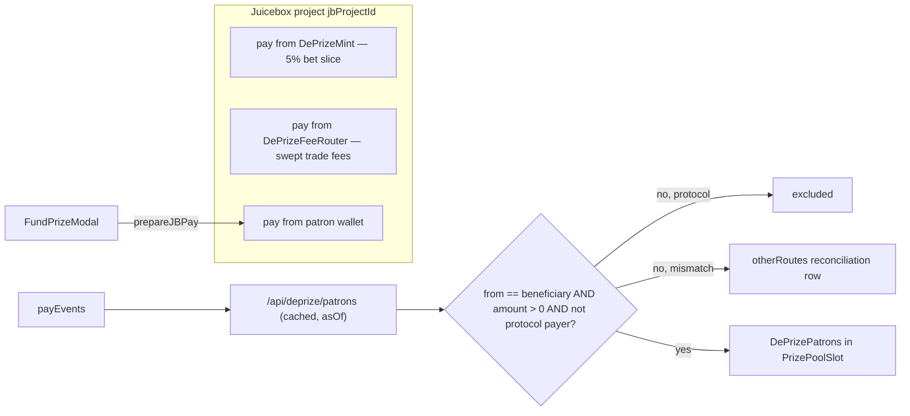

# PR-E — Patrons wall and Fund the prize

| Field | Value |
|---|---|
| **Status** | Ready (revised 2026-09-16 — second engineering pass applied) |
| **Verdict carried** | **Adequate.** Was **Weak** in [`pr-design-docs-eng-critique-e.md`](pr-design-docs-eng-critique-e.md). All three Must-fix items and S1–S7 are applied or explicitly deferred with an owner in §9.2. |
| **Authors** | MoonDAO DePrize engineering |
| **Reviewers** | *unassigned — DePrize eng lead* (design), *unassigned — DePrize product* (§9.1 defaults), *unassigned — counsel liaison* (geo-open decision) |
| **Last updated** | 2026-09-16 |
| **Depends on** | **PR-0** (`restricted` prop + `useDePrizeRestricted()` + the `no-restricted-imports` rule), **PR-1** ([`pr-1-page-slots-and-helpers.md`](pr-1-page-slots-and-helpers.md): `PrizePoolSlot`, `payerClassification.ts`), **PR-C** (defines the `PrizePoolSlot` container this PR fills part of) |
| **Merge position** | 6th. Order is `PR-0 → PR-1 → A′ → C → F → E → B′ → D1 → G1` ([`pr-program-architecture.md`](pr-program-architecture.md) §4). **F merges before E.** |
| **Must not** | Route funding through permit / `evaluateEligibility`; treat a patron pay as a bet; re-derive jurisdiction with `useRegionRestriction`; render on-chain memo text |
| **Constraints** | [`deprize-engineering-constraints.md`](deprize-engineering-constraints.md) — this PR is bound by C1, C3, C5, C7, C8, C10, C11, C12, C13 |

---

## 1. One-paragraph summary

Show who funded the prize **directly** and let visitors add to the pool without buying outcome tokens. A "direct patron pay" is a Juicebox `pay` where **`from == beneficiary`**, the amount is non-zero, and `from` is not a known protocol address. The wall credits **`from`** — the address that actually spent the money — which is the same axis it filters on. Aggregation happens **server-side** behind a cached `ui/pages/api/deprize/patrons.ts` that returns an `asOf` timestamp, not in the browser. The wall renders into PR-1's **`PrizePoolSlot`**, sharing that section with PR-C's payload explainer. Memos are sent on-chain and **not rendered** in v1. `FundPrizeModal` calls a new shared `prepareJBPay` helper rather than copying twenty lines out of `MissionContributeModal`. Fund is **geo-open until counsel says otherwise** — but it reads PR-0's `useDePrizeRestricted()` today so reversing the policy is a one-line predicate change, not a new data path.

---

## 2. Context / background

Every bet already pays ~5% into the bound Juicebox project as `DePrizeMint` (`from` = mint, `beneficiary` = bettor). `DePrizeFeeRouter.sweepFees` pays swept trade fees with `from` = router, `beneficiary` = router owner (`DePrizeFeeRouter.sol` 141–148). Direct `JBV5MultiTerminal.pay` hits the same `jbProjectId`. **Every protocol flow in this list has `from != beneficiary`; every honest self-funded patron pay has `from == beneficiary`.** That asymmetry, not an address list, is the mechanism this PR classifies on (§6.2).

The prize page already shows the pool via `useTotalFunding` ([ui/lib/juicebox/useTotalFunding.tsx](ui/lib/juicebox/useTotalFunding.tsx)) and links it to `launchpad.missionHref` from [ui/lib/deprize/useDePrizeLaunchpad.ts](ui/lib/deprize/useDePrizeLaunchpad.ts).

Bendystraw `payEvents` are a known schema. [ui/lib/mission/fetchMissionFundingStats.ts](ui/lib/mission/fetchMissionFundingStats.ts) `buildPayEventsQuery` pages by `timestamp_lte` but **does not select `from`**. [ui/pages/api/mission/recent-donations.ts](ui/pages/api/mission/recent-donations.ts) selects `from, beneficiary, amount, timestamp, memo, projectId`.

**The existing client-side subgraph route is not a safe base for this feature.** [ui/pages/api/juicebox/query.ts](ui/pages/api/juicebox/query.ts) builds its urql client as:

```10:12:ui/pages/api/juicebox/query.ts
const subgraphClient = createClient({
  url: subgraphUrl,
  exchanges: [fetchExchange, cacheExchange],
```

`fetchExchange` is a terminating exchange, so a `cacheExchange` placed after it is never reached. **This design assumes that branch: the endpoint does no caching at all.** See §6.1 for why the assumption stops mattering once aggregation moves server-side.

DePrize already has a house pattern for reading its own events: [ui/lib/deprize/events.ts](ui/lib/deprize/events.ts) is explorer-first with an RPC fallback (`getContractEvents(..., useIndexer: false)` at ~149/161) and a truncation guard, precisely because a single indexer is a single point of failure. §5 E5 argues why Juicebox `payEvents` still go to the subgraph and what happens when it is down.

Mint / fee-router addresses: `DEPRIZE_MINT_ADDRESSES`, `DEPRIZE_FEE_ROUTER_ADDRESSES` in [ui/const/config.ts](ui/const/config.ts). **Do not compare them inline** — PR-1 lands `ui/lib/deprize/payerClassification.ts` with `isProtocolPayer(address, chainSlug)` and one normalization (§6.2).

Mission contribute `pay` ([ui/components/mission/MissionContributeModal.tsx](ui/components/mission/MissionContributeModal.tsx) 1607–1626):

```ts
prepareContractCall({
  contract: primaryTerminalContract,
  method: 'pay',
  params: [
    mission.projectId,
    JB_NATIVE_TOKEN_ADDRESS,
    toWei(inputValue),
    address,                              // beneficiary = payer
    (toWei(output) * 95n) / 100n,         // min tokens
    message,
    '0x00',
  ],
  value: toWei(inputValue),
})
```

Terminal address used by `useTotalFunding` is `JBV5_TERMINAL_ADDRESS` (`0x2dB6…1846`) from `const/config`. Token quote helper: [ui/lib/juicebox/tokenCalculations.ts](ui/lib/juicebox/tokenCalculations.ts) `calculateTokensFromPayment`.

Address display: [ui/lib/utils/hooks/useENS.ts](ui/lib/utils/hooks/useENS.ts) (`ensideas.com` — a third party; see §6.1 on why resolution moves server-side). Short form `0xabc…def0` as in [ui/components/project/AuthorCitizenLink.tsx](ui/components/project/AuthorCitizenLink.tsx). Amounts: [ui/components/deprize/EthUsd.tsx](ui/components/deprize/EthUsd.tsx).

Terms / legend: `DEPRIZE_TERMS_URL`, `DEPRIZE_AVAILABILITY_LEGEND` in [ui/lib/deprize/constants.ts](ui/lib/deprize/constants.ts).

Sepolia Touchdown #22 is JB **268** (mission 14) — the verification target.

---

## 3. Problem statement

The pool number is a black box. Bettors and patrons are mixed. There is no way to grow the prize without taking market risk, so the "fund the prize" story in `DEPRIZE.md` is not a button. Who is affected: visitors who want to sponsor the payload without betting, and anyone reading the pool stat.

A second, quieter problem this revision takes as in scope: **a public wall that prints names is a publication surface.** Getting a name wrong is not a display bug, it is MoonDAO asserting in public that a person funded a prediction market. §6.2 is designed around being right about the names it prints, at the cost of being complete.

---

## 4. Goals and non-goals

**Goals**

- Classify payEvents with one predicate, filtering and crediting on the **same axis** (`from`). Fail closed on anything malformed, mismatched, or protocol-owned.
- Pure, tested aggregation (`patrons-math.ts`) consuming PR-1's `payerClassification.ts`.
- Server-side, cached aggregation endpoint with an `asOf` timestamp and an explicit partial-data policy.
- Patrons wall inside PR-1's `PrizePoolSlot`, with **distinct** loading / error / empty / stale / pending states.
- **Fund the prize** entry point in the prize-pool slot (text link in the header), opening `FundPrizeModal`.
- A shared `prepareJBPay` helper so the DePrize and mission `pay` call sites cannot drift.
- Legend + Terms in the modal. No permit, no `evaluateEligibility`.

**Non-goals**

- Rendering memo text (§6.4, and §5 E7 for the decision).
- Reusing `MissionContributeModal` wholesale (§5 E2).
- Migrating the mission modal onto `prepareJBPay` — follow-up, so this PR's blast radius stays small.
- Cross-chain LayerZero pay, Apple Pay, or Coinbase (PR-F owns onramp, and only in BetModal).
- Changing the 5% bet slice or mint router.
- Gating sell/redeem (C4).
- Making funding available as a substitute for a bet on a restricted-region banner.

---

## 5. Alternatives considered

Every decision this PR makes has a row here. The first engineering pass found three decisions that had been *made* without being *argued* (E5, E6, E7) and one whose answer this revision reverses (E4/E8); those are recorded rather than silently swapped.

### E1. New `FundPrizeModal` that calls a shared `prepareJBPay` (chosen)

- **Reuse:** The `pay` params, `JBV5_TERMINAL_ADDRESS` and `JB_NATIVE_TOKEN_ADDRESS`, through one helper (E7).
- **Complexity:** Small modal (what-you-get block, amount, memo, submit, legend, Terms).
- **User impact:** Stays on `/deprize/<id>`.
- **Legal:** Easy to *not* pull in mission attestations / onramp.

### E2. Open `MissionContributeModal` on the prize page

Needs `mission`, `token`, `primaryTerminalAddress`, `ruleset`, `usdInput` / `setUsdInput` ([MissionContributeModal.tsx](ui/components/mission/MissionContributeModal.tsx) 85–108). The file is ~2,800 lines (cross-chain, onramp JWT, Apple Pay, Overview back-a-candidate). `useDePrizeLaunchpadToken` only gives `missionId` / token symbol — not a ruleset.

- **Reuse:** Highest raw reuse, worst coupling.
- **User impact:** Modal copy talks about mission tokens and may open onramp.
- **Legal:** Easy to accidentally imply a mission contribution is a DePrize bet, or the reverse.

Rejected. If a future PR already has a hydrated `mission` object on the prize page, revisit — **this PR should not**.

### E3. Deep-link to `/mission/{id}` only

- **Complexity:** Zero new tx code.
- **User impact:** Leaves the prize page; memo prefix is lost; patrons wall does not feel connected.

Rejected as the only path. `missionHref` can remain a secondary link.

### E4. Filter on `beneficiary` instead of `from`

Bet slices set `beneficiary` to the **bettor**, so this lists every bettor as a patron. Rejected — unchanged from the original doc.

### E5. Credit `beneficiary` while filtering on `from` (the previous answer — **now rejected**)

This is what the doc said until this revision: filter `isPatronEvent` over `ev.from`, then "aggregate by `beneficiary`." Two different addresses with nothing constraining them to match.

**Why it is rejected.** It is a dust-priced impersonation primitive on a page MoonDAO publishes:

- Pay 1 wei with `from = <attacker EOA>`, `beneficiary = <any address with a recognizable ENS name>`. The filter passes. The wall prints that person's name as a patron of a prediction market they have never touched.
- Pay 10 ETH with `beneficiary = <friend>` and you are invisible while your friend is the top patron — the opposite of the stated goal.
- It also defeats the fee-router exclusion the first correctness review added: the exclusion is on `from`, so a third party pays dust with `beneficiary = <fee-router owner Safe>` and puts the treasury back on the wall.

The tell that this was never tested is that **every "included" fixture in the original §6.6 happened to set `from == beneficiary`**, so no test could fail. §6.6 now carries the fixture that does not.

### E6. Credit `from` and require `from == beneficiary` (chosen)

One predicate that filters and credits on the same axis. It subsumes both hardcoded exclusions — mint pays have `from` = mint and `beneficiary` = bettor; fee-router pays have `from` = router and `beneficiary` = owner — so the address deny list becomes defense-in-depth rather than the mechanism. It also survives a contract redeploy, which a deny list does not: a stale `DEPRIZE_MINT_ADDRESSES` entry after a redeploy would otherwise turn every historical bet slice from the old mint into a "patron" whose name is a bettor's.

**The honest cost, stated because it is real:** this drops gift-pays and smart-account / relayer pays where `from` is an entry point, Safe, or module. The wall will be *incomplete*. That is the intended direction — a deny list fails **open** (anything unknown gets published), this predicate fails **closed** (anything unknown is omitted), and a missing patron is a support ticket while a wrong patron is a screenshot. §6.4's reconciliation row recovers the arithmetic: *"plus N contributions via other routes · X ETH."*

### E7. Copy the `pay` call vs. extract a shared helper (chosen: extract)

Not argued in the original doc, which offered only copy / mount / deep-link. Copying ~20 lines out of a 2,800-line modal means two `pay` call sites that will drift on min-tokens policy, memo format, and terminal constant — and the mission copy is the one that gets maintained.

**Chosen:** PR-E writes `ui/lib/juicebox/payProject.ts` exporting `prepareJBPay(...)` (§6.5.2) and is its only caller on merge. The mission call site migrates in a follow-up. **Owner of the helper and of the follow-up migration: *unassigned — DePrize eng lead*.** PR-C and PR-F are the other likely consumers; neither is blocked on it.

Rejected alternative — copy the call inline: cheaper now, guarantees drift. Rejected alternative — migrate the mission modal in this PR: correct end state, but it puts a 2,800-line file in the blast radius of a feature PR.

### E8. Client-side vs. server-side aggregation (chosen: server-side)

Also not argued in the original doc; the browser fan-out was inherited from the mission helper's shape. The client version issues up to `MAX_PAGES = 20` sequential POSTs per page view per visitor against MoonDAO's paid Bendystraw key, through a route with no cache headers, and ships the patron rule to the browser.

There is a second problem, and it is the reason this cannot be left to inherit whatever `/api/juicebox/query` happens to do. Either the urql `cacheExchange` is dead (unreachable after the terminating `fetchExchange` — the branch §2 assumes) and the cost is the fan-out; **or** it is live, in which case urql's document cache is cache-first with no mutation to invalidate it, so bumping `refreshNonce` after a successful pay replays the identical query string and the patron **does not see their own row** — defeating the one thing the post-pay refresh promises. The design should not depend on which is true.

**Chosen:** `ui/pages/api/deprize/patrons.ts` (§6.1). Server-side aggregation collapses both branches: the fan-out happens once per prize per TTL instead of once per visitor, the endpoint owns its own cache headers explicitly, and the post-pay refetch is an explicit cache-bypassing request rather than a hope about urql's request policy. It also gives the UI a real staleness signal (`asOf`) and keeps the patron rule out of the browser bundle.

Rejected alternative — keep the client fan-out and pass an explicit `requestPolicy`: fixes the refresh branch only, leaves the cost and the leaked rule.

### E9. Subgraph vs. explorer/RPC vs. server-side indexed cache (chosen: subgraph, behind the server endpoint)

The third undebated decision. DePrize's own event reads are explorer-first with an RPC fallback ([ui/lib/deprize/events.ts](ui/lib/deprize/events.ts)), so "use Bendystraw" deserved an argument rather than an assumption.

- **Bendystraw `payEvents` (chosen).** It decodes and pages Juicebox pays for free; `events.ts` knows nothing about the Juicebox terminal and teaching it would be a larger change than this PR. Behind the server endpoint the cost is bounded.
- **`getContractEvents` on the terminal.** No Bendystraw dependency, but it means decoding `Pay` logs, handling the explorer's truncation guard, and re-implementing pagination over a log range with no timestamp index. Rejected as disproportionate.
- **A server-side indexed cache (Redis, cron-refreshed).** Strictly better freshness/cost behavior and the natural next step if the endpoint's TTL proves too coarse. Rejected for v1 as premature: it adds a cron, a key prefix (C7), and a staleness story before we know the read volume.

**Consequence that must be designed for, not assumed away:** Bendystraw is the *only* source, so an outage means no wall. That is exactly why §6.4 has a distinct `error` state and why "empty" and "couldn't load" must never render the same copy.

### E10. Render the memo vs. do not render it in v1 (chosen: do not render)

The original doc capped the memo at ~80 characters *in MoonDAO's modal* and rendered "optional memo (truncate)" on the wall. Those are different layers: the wall renders whatever any caller passed to `pay`, including a direct contract call with arbitrary length and content, and the memo is on-chain and permanent. With §8's "no feature flag," removing an offensive memo meant a code revert and a deploy.

XSS is not the risk — the precedent renders memos as escaped JSX text ([MissionActivityList.tsx](ui/components/mission/MissionActivityList.tsx) 255–257). The risk is slurs, harassment, phishing URLs, RTL-override and zero-width tricks, and layout-breaking length on a page MoonDAO publishes.

**Chosen:** v1 sends the memo on-chain (the `DePrize #<id>:` prefix is still useful for off-chain reconciliation) and does not render it. The aggregator does not even select `memo`, and `PatronRow` has no memo field, so "just show the memo" is a deliberate change across three layers rather than a one-line JSX addition.

Rejected alternative — render with a sanitizer now: PR-C already owns a display-text sanitizer (NFC, control/bidi/zero-width strip, length cap, no `://`) for its `payloadNameOptIn` flow. Writing a second one here is the duplication that reviewer note asked us to avoid, and it still leaves no report path and no way to take a string down without a deploy.

**If memo rendering is added later**, the follow-up must specify all five of: escaping (inherited from JSX, stated explicitly), a render-time normalization/strip filter reusing PR-C's sanitizer, a hard length policy enforced at render and not at submit, a report path with a named owner and an SLA, and a runtime flag that suppresses a specific memo without a deploy. Anything less is not a rendering feature, it is an unmoderated publication surface.

### E11. Fund CTA in the header stats row vs. in the prize-pool slot (chosen: prize-pool slot)

The original doc put **Fund the prize** in the header next to the pool `Stat`. That places two money CTAs above the fold with different legal status — Bet is gated by eligibility + Terms + permit, Fund is deliberately geo-open — distinguished only by button fill. It also collides with PR-C, which rewrites the same stat grid.

**Chosen:** the button lives in `PrizePoolSlot` next to the wall, where the concept is explained; the header keeps a plain text link `Fund the prize →` that scrolls to it. **Bet** stays the page's one unambiguous primary action, and the header-grid conflict with PR-C reduces to one anchor.

**Chosen overall:** E1 + E6 + E7 + E8 + E9 + E10 + E11.

---

## 6. Proposed design

### 6.1 Server-side aggregation — `ui/pages/api/deprize/patrons.ts`

New route. `withMiddleware(handler, rateLimit)` plus `setCDNCacheHeaders`, following the shape `logs.ts` already uses. **No `authMiddleware`** — this is a public read of public chain data with no wallet and no PII; that is the one deliberate deviation from C8 in this PR and it is why it is named here rather than left to the reader.

**Request:** `GET /api/deprize/patrons?deprizeId=<int>&chainId=<int>`. Resolve `jbProjectId` server-side from the DePrize config rather than trusting a client-supplied project id.

**Validation before anything else:** `Number.isInteger` + finite + `> 0` on `deprizeId`, `chainId`, and the resolved `jbProjectId`, **before** any value is interpolated into a GraphQL string. The mission helper interpolates without this; do not copy that into a new public route. A failed check is a 400 and issues no upstream request.

**Upstream read.** POST the paginated query directly to the Bendystraw URL with the key that already lives server-side — reuse whatever env the existing `ui/pages/api/juicebox/query.ts` reads, do not re-declare it — using plain `fetch`. **Do not route through `/api/juicebox/query` and do not use urql here.** That is what removes E8's ambiguity from the critical path rather than reasoning about it.

Query shape mirrors `buildPayEventsQuery` (`limit 1000`, `timestamp_lte` cursor, dedupe by `id`, `MAX_PAGES = 20`) but selects:

```
id, amount, from, beneficiary, timestamp
```

`memo` is deliberately **not** selected (E10). `where` uses `projectId`, `version: BENDYSTRAW_JB_VERSION`, and the **DePrize chain's** `chainId` — not `DEFAULT_CHAIN_V5`, which `fetchMissionFundingStats` hardcodes because missions settle there. DePrize Sepolia fixtures pay on Sepolia.

**Do not** `import { buildPayEventsQuery }` — it is not exported, hardcodes `DEFAULT_CHAIN_V5.id`, and does not select `from`. Mirror the pagination; write the query here.

**Partial-data policy**, which the original doc said to "mirror" without saying what it mirrors. The source helper refuses to publish undercounted aggregates:

```173:178:ui/lib/mission/fetchMissionFundingStats.ts
  if (!exhausted) {
    console.warn(
      `[fetchMissionFundingStats] hit MAX_PAGES (${MAX_PAGES}) cap for project ${projectId}; refusing to return partial aggregates`
    )
    return null
  }
```

PR-E does the same, and returns `{ complete: false }` with no rows and no totals. The UI renders the **error** family, not a partial wall. A wall that is silently missing the top patron is worse than a wall that admits it could not load — same fail-closed logic as E6.

**Response:**

```ts
{
  asOf: number            // ms epoch, when the upstream read completed
  complete: boolean       // false ⇒ MAX_PAGES tripped; rows/totals omitted
  chainId: number
  projectId: number
  patronCount: number
  totalDirectWei: string  // decimal string; bigints never cross JSON as numbers
  patrons: Array<{
    payer: string         // lowercased `from`, and the credit key
    displayName?: string  // ENS, resolved server-side (below)
    totalWei: string
    count: number
    firstTs: number
    lastTs: number
  }>
  otherRoutes: { count: number; totalWei: string }   // the E6 reconciliation row
}
```

**Caching.** `s-maxage=60, stale-while-revalidate=300`. A post-pay refetch passes `?fresh=1`, which bypasses the CDN and responds `Cache-Control: no-store`; that request path is rate-limited more tightly than the cached one because it is the only uncached leg. This is the concrete answer to "the patron never sees their own row": the refresh is a different request, not the same query string handed back by a cache-first client.

**ENS resolution moves here.** Resolving on the client means every page view discloses every patron address to `ensideas.com`. Resolving in the aggregator makes it one batch per prize per TTL and keeps visitors out of it entirely. Failures degrade to the short `0xabc…def0` form; ENS is never load-bearing.

**Suppression.** The handler filters out addresses in a small server-side suppression set before aggregating (they still count toward `otherRoutes`, so the arithmetic ties out). This is the opt-out path §8 promises. Owner and SLA in §9.1.

**Observability** (C13-adjacent; the failure modes of this feature are specifically the invisible kind). The handler logs, per request, counts of events excluded by reason: `protocolPayer`, `mismatchedBeneficiary`, `zeroAmount`, `malformed`. Two alertable conditions: upstream error rate, and **"a prize whose patron count was non-zero now returns zero"** — the silent-empty mode from §6.4. No addresses in logs beyond what is already public, no IPs (C5).

### 6.2 Pure math — [ui/lib/deprize/patrons-math.ts](ui/lib/deprize/patrons-math.ts)

```ts
export type PayEventLike = {
  id?: string
  from?: string | null
  beneficiary?: string | null
  amount?: string | number | null
  timestamp?: number | null
}

export type PatronRow = {
  payer: string        // lowercased `from` — filter axis and credit axis are the same
  totalWei: bigint
  count: number
  firstTs: number
  lastTs: number
}

export function isDirectPatronPay(ev: PayEventLike, chainSlug: string): boolean

export function aggregatePatrons(
  events: readonly PayEventLike[],
  chainSlug: string
): {
  patrons: PatronRow[]
  totalDirectWei: bigint
  patronCount: number
  otherRoutes: { count: number; totalWei: bigint }
  excluded: {
    protocolPayer: number
    mismatchedBeneficiary: number
    zeroAmount: number
    malformed: number
  }
}
```

`isDirectPatronPay(ev, chainSlug)` is true iff **all** of:

1. `ev.from` is a well-formed 0x address;
2. `ev.beneficiary` is a well-formed 0x address;
3. `normalize(ev.from) === normalize(ev.beneficiary)`;
4. `amount > 0n`;
5. `!isProtocolPayer(ev.from, chainSlug)`.

Anything missing, malformed, or mismatched is **not** a patron (fail closed). Credit key is `normalize(ev.from)`. Sort by `totalWei` desc, tie-break by `firstTs` asc so ordering is deterministic across reloads.

Condition 5 uses **PR-1's [`ui/lib/deprize/payerClassification.ts`](pr-1-page-slots-and-helpers.md)** — `isProtocolPayer(address, chainSlug)` over `DEPRIZE_MINT_ADDRESSES` and `DEPRIZE_FEE_ROUTER_ADDRESSES`, with lowercase/checksum normalization in exactly one place, shared with the compliance reconcile path. **Do not compare addresses inline here.** One case-sensitivity slip turns every bet slice into a patron, and the wall becomes a public list of bettors on a compliance-adjacent surface.

Condition 5 is defense-in-depth, not the mechanism: conditions 1–3 already exclude mint pays (`from` = mint, `beneficiary` = bettor) and fee-router pays (`from` = router, `beneficiary` = owner). Keeping it means a future protocol payer that happens to pay itself still cannot appear, and it is the layer that must be extended — in `payerClassification.ts`, not here — if config adds one. **Owner of that registry: PR-1's helper owner.** The memo `"DePrize trade fees"` is supporting evidence only and is never a filter.

Reference values for test assertions (still read from config at runtime):

| Chain | Mint | Fee router |
|---|---|---|
| sepolia | `0xa6f9632ee9848f7c1f252da5a1e869ac90e57cc8` | `0xbe8cbc97d4ddee28b938c0ed8245f1b5133b783a` |
| arbitrum | `0xfa36cAb21415B4e23a1eecCFe7B07693A690d838` | `0x0EF00977e37e2e106BB6E9fa15952bB43a2761e1` |
| arbitrum-sepolia | *(none configured)* | *(none configured)* |

`otherRoutes` accumulates events that are well-formed with `amount > 0` and are **not** protocol payers but fail the equality — gift pays, smart-account and relayer pays. It exists so the wall's arithmetic ties out against the pool without printing a name we cannot attribute.

### 6.3 Hook — [ui/lib/deprize/usePrizePatrons.ts](ui/lib/deprize/usePrizePatrons.ts)

```ts
usePrizePatrons({ deprizeId: number; chainId: number; refreshNonce?: number })
```

One `GET` to `/api/deprize/patrons`; no pagination, no classification, no GraphQL in the browser. Returns:

```ts
{
  patrons, totalDirectEth, patronCount, otherRoutes,
  asOf: number | null,
  status: 'loading' | 'ready' | 'error',
  stale: boolean,            // asOf older than STALE_AFTER_MS
  refresh: (opts?: { fresh?: boolean }) => void
}
```

`refresh({ fresh: true })` is what `refreshNonce` triggers after a successful pay, and it is the only caller that sets `?fresh=1`. Convert wei → ETH with `UNIT` from [ui/lib/deprize/constants.ts](ui/lib/deprize/constants.ts).

### 6.4 `DePrizePatrons` — inside `PrizePoolSlot`

New [ui/components/deprize/DePrizePatrons.tsx](ui/components/deprize/DePrizePatrons.tsx), rendered **inside PR-1's `PrizePoolSlot`** (slot 9, after Competitors and the forecast slot, before Claim). PR-C defines the slot container and its payload explainer; PR-E fills the patrons half. **Do not insert JSX into [ui/pages/deprize/[id].tsx](ui/pages/deprize/[id].tsx) directly** — the page renders an ordered list of section components after PR-1, and adding a section inline is how the composed page stops being anyone's responsibility.

Contents:

- Header: "Patrons" + total direct ETH/USD (`EthUsd`) + count.
- Rows: `displayName` from the API, else `0x1234…abcd`; amount via `EthUsd`. **No memo** (E10). No bettors, no outcome tokens.
- Reconciliation line when `otherRoutes.count > 0`: *"plus {n} contributions via other routes · {x} ETH"*, with a short explanation that gift pays and smart-account pays are counted in the pool but not attributed by name.
- Relationship line, because "Prize pool 12 ETH" beside "Patrons 3 ETH" reads as a bug: *"The prize pool also includes {pool − direct} ETH from bet fees. Patrons are direct contributions only."*
- Freshness: *"Updated {relative to `asOf`}"* whenever rows are shown.

**States — four distinct ones plus a post-pay case. `error` and `empty` must never render the same copy.**

| State | Condition | Render |
|---|---|---|
| `loading` | first load, nothing cached | Skeleton rows. Never the empty copy. |
| `error` | request failed, non-200, or `complete: false` | *"Couldn't load patrons right now."* + Retry. **Never** "Be the first patron", and never a total. |
| `empty` | 200, `complete: true`, `patronCount === 0` | *"Be the first patron."* |
| `populated` | 200, `complete: true`, rows | Rows + totals + reconciliation + `asOf`. |
| `stale` | `populated` and `asOf` older than `STALE_AFTER_MS` | Same, with the freshness line emphasized and a manual refresh. |
| `pending-own` | this session has a confirmed pay whose payer is absent from `patrons` | Banner: *"Your contribution is confirming — the wall updates within a minute."* Cleared when the row appears or after `PENDING_TTL_MS`. |

The `error` state is the whole point of M3: with Bendystraw as the only source (E9), an outage previously made a prize with forty patrons tell every visitor there were zero and invite them to be the first. That is a confident wrong answer where "we couldn't load this" was available.

### 6.5 Fund entry point + `FundPrizeModal`

#### 6.5.1 Entry point and jurisdiction

**Placement.** Primary button inside `PrizePoolSlot` beside the wall; plain text link `Fund the prize →` in the header stat area anchoring to it (E11). Visual: secondary / outline (`border-white/20`), **never** `bg-moon-green` — that fill means Bet. Label: **Fund the prize**. Hidden (not merely disabled) when `jbProjectId` is missing.

**Verb discipline with PR-F.** Two money buttons can end up on this page. PR-E's is *"Fund the prize"* / *"Donate to the prize pool"* — money leaves the user permanently and goes to the pool. PR-F's is *"Add funds to your wallet"* — money stays the user's. Neither doc may drift onto the other's verb; owner for the pair is *unassigned — DePrize product*.

**Jurisdiction, and why this is written down in detail.** Fund is geo-open (§9.1). The failure this PR is guarding against is not today's behavior, it is the reversal: when counsel says "gate it," the nearest thing on the page is the client region signal PR-0 exists to stop trusting, and the implementer reproduces the 52-jurisdiction defect in a brand-new surface.

So, **even while the policy is open**:

- `PrizePoolSlot`'s Fund entry point and `FundPrizeModal` both read `restricted` from **PR-0's `useDePrizeRestricted()`** context accessor.
- They gate on a single named constant: `FUND_GEO_OPEN = true` in `ui/lib/deprize/constants.ts`, with a comment pointing at the open counsel question, such that the predicate is literally `FUND_GEO_OPEN || !restricted`.
- **Never** import `useRegionRestriction`, and never call `/api/deprize/eligibility` from this path. Per C11 the corrected signal is consumed, never re-derived; PR-0 lands an ESLint `no-restricted-imports` rule that makes this a lint failure rather than a review catch.

Reversing the policy is then flipping one boolean against an already-correct signal. Owner and revisit trigger in §9.1.

#### 6.5.2 The shared `pay` helper

New `ui/lib/juicebox/payProject.ts`:

```ts
export function prepareJBPay(opts: {
  client, chain, terminalAddress, projectId: number,
  token: string, amountWei: bigint, beneficiary: string,
  minReturnedTokens: bigint, memo: string, metadata?: `0x${string}`,
}): PreparedTransaction
```

It owns the param order, the terminal constant, the native-token constant, and the metadata default — the four things that drift when a `pay` call is copied. PR-E is its only caller on merge; the mission modal migrates in a follow-up (E7). Unit-tested on param construction alone; no network.

#### 6.5.3 Modal behavior — [ui/components/deprize/FundPrizeModal.tsx](ui/components/deprize/FundPrizeModal.tsx)

Props: `deprizeId`, `jbProjectId`, `chain`, `account`, `onClose`, `onDone`.

1. **Lead with what this is**, above the amount input — not as item 8 of a behavior list:

   > **You're adding ETH to the {prize} prize pool.**
   > **You get:** a bigger prize for whoever wins · your name on the patrons wall{ · `{SYMBOL}` project tokens from the launchpad}.
   > **You don't get:** a bet, a position, or a payout if a competitor wins. This does not move the odds.
   > **This is not refundable by MoonDAO.**

   The `{SYMBOL}` clause renders only when `launchpad.symbol` is known. Whether those project tokens are redeemable depends on a Juicebox ruleset this PR deliberately does not read, so the copy says plainly that MoonDAO cannot reverse the contribution and does not make a redemption claim either way. Copy owner in §9.1.

2. ETH amount input. **Minimum `FUND_MIN_WEI`** (§9.1) — dust rows pollute the wall and make griefing free. **Above `FUND_CONFIRM_ABOVE_WEI`, require a second explicit confirmation step** — unlike BetModal there is no `DEPRIZE_MAX_BET_WEI` here and no withdraw path, so a fat-fingered decimal is unrecoverable. There is no hard maximum; that is a decision, not an oversight (§9.1).
3. Optional memo, sent as `DePrize #<id>: ${userMemo}`, capped at ~80 characters after the prefix. **It is not rendered anywhere** (E10); the cap exists so the on-chain memo does not overflow, and the doc must not imply the cap protects the wall — it does not, because the wall's input is the chain.
4. `beneficiary = account.address`, which is also the `from`. **The modal must not offer a "pay on behalf of" field**: `from == beneficiary` is the wall's entire integrity predicate (E6), and a UI that breaks the equality would produce contributions that silently never appear.
5. Min tokens: `95%` of `calculateTokensFromPayment` when a quote is cheap to read; **else `0n`** with a comment (Sepolia fixtures may have no usable issuance curve). Never block funding on a failed quote. When `0n` is used, **say so in the UI** — "no minimum token amount is guaranteed for this contribution" — rather than accepting unbounded slippage silently; `ExitPositionModal` discloses its 1% allowance and this surface should not be quieter than that.
6. Submit via `prepareJBPay` + the existing `sendDePrizeTx` / receipt pattern. Toasts via `react-hot-toast` + `toastStyle`.
7. **Do not** call `/api/deprize/eligibility`, `/api/deprize/permit`, or `canSubmitDePrizeBet` (C3).
8. **Do** render `<DePrizeAvailabilityLegend />` and the `DEPRIZE_TERMS_URL` link.
9. Wrong network: reuse `useDePrizeChainGuard`, same as BetModal, so Sepolia funding cannot land on Arbitrum.

#### 6.5.4 `pay` failure semantics — what the UI promises

The original doc had success and error toasts and nothing else. Explicitly:

| Case | Detection | UI | What we promise |
|---|---|---|---|
| **User rejects in wallet** | thirdweb rejection | Modal stays open, amount preserved, neutral toast (*"Cancelled"* — not an error) | Nothing happened |
| **Wrong chain** | `useDePrizeChainGuard` | Switch-network prompt replaces submit; submit disabled until switched | Nothing sent |
| **Tx reverts** | receipt `status !== 'success'` | Error toast + inline: *"The contribution didn't go through. Nothing was charged beyond gas."* Modal stays open | No funds moved; gas is spent |
| **Insufficient balance** | pre-flight against balance + gas reserve | Inline, before submit | Nothing sent |
| **Below `FUND_MIN_WEI`** | pre-flight | Submit disabled with the minimum stated | Nothing sent |
| **Succeeds, wall does not show it yet** | receipt success, payer absent from `patrons` | Success toast + `pending-own` banner (§6.4) | **The contribution is on-chain. The wall reflects it within about a minute.** |
| **Succeeds, aggregator erroring** | receipt success, `status: 'error'` | Success toast + the `error` state on the wall | Same promise; the wall says it cannot load, not that there are no patrons |

The last two rows are the `asOf` story, and the rule behind them is: **never promise inclusion before it is observable.** The success toast confirms the *transaction*, never the *row*. The old copy's implicit promise — pay and your name appears — is the one the subgraph cannot keep, and pretending otherwise is what makes a normal one-minute indexing delay read as lost money.

On success: `onDone()` → the page increments `refreshNonce` → `usePrizePatrons` calls `refresh({ fresh: true })`. Prefer **not** calling `useTotalFunding.refetch()` (it is `router.reload()`); the pool stat catches up on the next read. The wall/stat disagreement is acceptable in one direction (wall ahead of stat) and is explained by the relationship line in §6.4.



### 6.6 Tests

`ui/cypress/integration/lib/deprize/patrons-math.cy.ts` (C10, `yarn test:deprize`).

**The fixture that would have caught the shipped bug, listed first because the old suite could not fail:**

- **Impersonation:** `from = 0xAlice`, `beneficiary = 0xVitalik`, `amount = 1` → **no row**, `totalDirectWei` unchanged, `otherRoutes.count === 1`, `excluded.mismatchedBeneficiary === 1`. Every "included" fixture below sets `from == beneficiary`, which is exactly why this case has to be written explicitly.
- **Treasury re-insertion:** `from = 0xAttacker`, `beneficiary = <fee-router owner Safe>`, `amount = 1` → no row.

Classification:

- Empty list → zero patrons, zero totals.
- Mint: `from = DEPRIZE_MINT_ADDRESSES.sepolia`, `beneficiary = 0xBettor` → excluded, `excluded.protocolPayer === 1`.
- Fee router: `from = DEPRIZE_FEE_ROUTER_ADDRESSES.sepolia`, `beneficiary = 0xSafe` → excluded.
- **Protocol payer that pays itself:** `from == beneficiary == mint` → excluded by condition 5, proving the deny list is still load-bearing as defense-in-depth.
- Direct: `from == beneficiary == 0xAlice` → included, credited to `0xAlice`.
- Two direct pays from the same payer → one row, summed, `count === 2`.
- Different payers → two rows sorted by total desc; equal totals tie-break by `firstTs` asc.
- Checksummed vs lowercase vs uppercase for the same address → one row.
- Missing `from`, missing `beneficiary`, non-0x `from`, `amount = 0` → excluded, counted under the right `excluded` key.
- Unconfigured chain slug (no mint/router in config) → protocol check excludes nothing, and conditions 1–4 still hold. This is the case where `?? ''` used to mean "exclude nothing" silently.

Query / endpoint layer (`ui/cypress/integration/lib/deprize/patrons-endpoint.cy.ts`, pure functions only):

- `deprizeId` / `chainId` / `jbProjectId` non-integer, negative, `NaN`, or `Infinity` → validation rejects, **no upstream request issued**.
- Pagination: a page boundary where two events tie on `timestamp` → both retained exactly once (dedupe by `id`), no infinite cursor loop. This is the subtlest logic in the PR and the only part copied wholesale.
- `MAX_PAGES` tripped → `complete: false`, no rows, no totals.
- Suppression list entry → absent from `patrons`, still counted in `otherRoutes`.

### 6.7 Acceptance criteria

Replacing the unfalsifiable "backer count vs patron count should differ":

1. The configured mint address **appears** in a raw `payEvents` response for JB 268 **and does not appear** in the rendered wall.
2. The wall's `patronCount` equals the number of distinct `from` values in that response satisfying §6.2's five conditions.
3. `totalDirectWei` + `otherRoutes.totalWei` + protocol-payer total equals the sum of all non-zero `payEvents` amounts for the project. The wall's arithmetic ties out.
4. With the aggregator forced to fail, the wall renders "Couldn't load patrons right now" and **never** "Be the first patron".
5. With the aggregator returning `complete: false`, the wall renders the error family, not a partial list.
6. Two consecutive page loads within the TTL produce **one** upstream Bendystraw read, not two, and not forty.

---

## 7. Step-by-step implementation plan

1. Rebase onto PR-0, PR-1, and PR-C. Confirm `useDePrizeRestricted()`, `payerClassification.ts`, and `PrizePoolSlot` all exist; if any does not, stop — do not reimplement them here.
2. Write `patrons-math.ts` + the §6.6 fixtures, impersonation case first. `yarn test:deprize`.
3. Write `ui/lib/juicebox/payProject.ts` (`prepareJBPay`) + its param test.
4. Write `ui/pages/api/deprize/patrons.ts`: validation, pagination, classification, ENS batch, suppression, cache headers, `asOf`, exclusion logging. Endpoint tests.
5. Write `usePrizePatrons` against the endpoint. No GraphQL in the browser.
6. Build `DePrizePatrons` with all six states and render it inside `PrizePoolSlot` alongside PR-C's explainer. **No edit to the render block of `[id].tsx`.**
7. Build `FundPrizeModal` (what-you-get block, min/confirm thresholds, `prepareJBPay`, chain guard, legend, Terms) and the slot button + header anchor link.
8. Wire `onDone` → `refreshNonce` → `refresh({ fresh: true })`, and the `pending-own` banner.
9. Confirm no imports of `evaluateEligibility`, permit helpers, or `useRegionRestriction` in any new file. `yarn lint` (the `no-restricted-imports` rule must pass, not be suppressed).
10. **Browser verification on Sepolia #22:** load the wall; connect a wallet; fund a small amount with memo `test`; confirm the row appears crediting **your** address, that the memo is **not** rendered anywhere, and that historical bet slices do not appear. Force the endpoint to 500 and confirm the error copy. Screenshot wall (populated + error) and modal (what-you-get block, legend, Terms).
11. **Adversarial verification:** send a pay with `beneficiary` set to a different address you control and confirm **no row appears** and `otherRoutes` increments. This is the M1 regression check and it must be done on-chain at least once, because it is the case the unit tests assert and the chain is the actual input.

---

## 8. Testing, rollout, and feature flags

- **Unit:** `yarn test:deprize` (C10).
- **Kill switch.** The original "no feature flag" was argued from the *write* path ("hide the button when `jbProjectId` is missing"); the risk is on the *read* path — a public wall printing names. `PrizePoolSlot` reads `DEPRIZE_PATRONS_ENABLED` (env-backed, default on) so the wall can be turned off without a deploy. The Fund button has its own switch so read and write fail independently.
- **Row removal.** The §6.1 suppression set is the takedown mechanism. Owner and SLA in §9.1. This is a real commitment: the wall publishes a name, so someone must be able to remove one.
- **Rollout:** safe on Sepolia immediately. Arbitrum uses the same terminal constant once a live Touchdown exists — and note that geo-open on testnet and geo-open with real money are different risk postures (§9.1).
- **Compliance:** funding is not a bet; no acceptance records (C3, C4). Legend + Terms are the disclosure.

---

## 9. Frozen defaults, risks, open questions

### 9.1 Frozen defaults — owner and revisit trigger required (C12)

Every row must carry a human name before implementation starts. `*unassigned*` here is a blocker, not a placeholder.

| Default | Value | Owner | Revisit trigger |
|---|---|---|---|
| **Fund is geo-open** | No jurisdiction gate; `FUND_GEO_OPEN = true` against `useDePrizeRestricted()` | *unassigned — counsel liaison* | **Before Arbitrum mainnet funding goes live**, or on any change to the DePrize restricted-jurisdiction list. Reversal = flip the constant; no new data path, no `useRegionRestriction`. |
| `FUND_MIN_WEI` | 0.001 ETH | *unassigned — DePrize product* | Dust rows appear on the wall, or gas costs make the floor absurd on Arbitrum |
| `FUND_CONFIRM_ABOVE_WEI` | 1 ETH (second confirm; no hard cap) | *unassigned — DePrize product* | First report of an unintended large contribution |
| Endpoint TTL | `s-maxage=60, stale-while-revalidate=300` | *unassigned — DePrize eng lead* | Bendystraw cost or a complaint that the wall is slow to update |
| `STALE_AFTER_MS` | 5 min | *unassigned — DePrize eng lead* | With the TTL |
| `MAX_PAGES` / refuse-partial | 20, refuse | *unassigned — DePrize eng lead* | A real prize trips the cap |
| Memo not rendered | v1 | *unassigned — DePrize product* | A rendering proposal that answers all five requirements in E10 |
| Suppression request SLA | Removed within 2 business days of a verified request | *unassigned — DePrize product* | First request, or any volume at all |
| Modal copy (what-you-get / not-refundable) | §6.5.3 | *unassigned — DePrize product* | Counsel review, or PR-F's verb split changing |
| `prepareJBPay` + mission migration | PR-E writes, mission migrates later | *unassigned — DePrize eng lead* | The mission modal's `pay` changes before the migration lands |
| Protocol-payer registry | PR-1's `payerClassification.ts` | PR-1's helper owner | A new protocol payer is deployed. **This is the one promise with no automatic enforcement** — nothing fails and no alert fires if config gains a payer and nobody extends the registry; §6.1's exclusion-count logging is the compensating signal. |

### 9.2 Risks and open questions

| Risk / question | Position |
|---|---|
| `from == beneficiary` drops gift-pays and smart-account pays | Accepted and disclosed (E6). Recovered arithmetically by the `otherRoutes` row, never by name. |
| Bendystraw is the only source and can be down | Distinct `error` state (§6.4). E9 names the indexed-cache upgrade if it becomes chronic. |
| Bendystraw `from` missing on some rows | Fail closed. |
| Mission-token redeemability | Not read by this PR. The modal states non-refundability and makes no redemption claim. Open question for *unassigned — DePrize product*. |
| Patrons of JB 268 who contributed via `/mission/14` believing they backed a mission will be listed on a prediction-market page | **Open, and deliberately surfaced.** The wall cannot distinguish intent from a pay event. Suppression (§6.1) is the mitigation; whether this is acceptable is a product call, not an engineering one. |
| **Consent parity with PR-C** | PR-C builds an opt-**in** (`payloadNameOptIn`) before publishing a contributor's chosen name; PR-E publishes address + ENS with opt-**out** only. That is a policy inconsistency inside one program, not two independent choices. §9.3 states why PR-E did not simply adopt opt-in, and it is escalated to the program level rather than settled here. |
| `useTotalFunding.refetch` reloads the page | Do not call it. |

### 9.3 Deliberately not applied

- **Opt-in consent before appearing on the wall** (critique S6). PR-E ships opt-out + server-side ENS + no memo instead. Reason: an opt-in gate makes the wall empty at launch, because nobody who has already paid can retroactively consent, and the wall's purpose is to make existing contributions visible. The data published is derived entirely from public chain events and is now strictly narrower than the original design (no user-authored text, no third-party disclosure of visitor-driven ENS lookups). Escalated as a program-level policy question with an owner rather than resolved unilaterally in one of two sibling PRs.
- **Migrating the mission modal onto `prepareJBPay` in this PR.** Deferred to a follow-up with a named owner (E7), as the critique itself recommended, to keep a 2,800-line file out of a feature PR's blast radius.
- **Building a display-text sanitizer.** Unnecessary once memos are not rendered (E10). If rendering lands later it consumes PR-C's sanitizer; it must not write a second one.

---

## 10. Cross-cutting constraints

This PR is bound by the standing decisions in [`deprize-engineering-constraints.md`](deprize-engineering-constraints.md) — specifically C1 (ui/ + docs/, Yarn), C3 (`evaluateEligibility` stays pure), C5 (no raw IPs), C7 (Upstash Redis if server state is ever added), C8 (middleware composition — see §6.1 for this PR's one named deviation), C10 (tests under `ui/cypress/integration/lib/**`), C11 (consume the corrected jurisdiction signal, never re-derive it), C12 (every frozen default has an owner and a revisit trigger), C13 (state the cheapest attack). Do not restate them here; that block is maintained in one place.

**Blast radius and coordination.** This PR touches: `ui/lib/deprize/patrons-math.ts` (new), `ui/lib/deprize/usePrizePatrons.ts` (new), `ui/lib/juicebox/payProject.ts` (new), `ui/pages/api/deprize/patrons.ts` (new), `ui/components/deprize/DePrizePatrons.tsx` (new), `ui/components/deprize/FundPrizeModal.tsx` (new), and **one insertion into PR-C's `PrizePoolSlot`** plus **one anchor link in `PrizeHeader`**. It does not edit the render block of `[id].tsx`.

**Shared surfaces with siblings:** `PrizePoolSlot` with PR-C (C owns the container, E fills part); `PrizeHeader` with PR-C (C rewrites the stat grid, E adds one text link — merge after C, which the order already guarantees); `payerClassification.ts` with PR-1 and the compliance path (consume, never fork). Integrator for the composed prize-pool section: *unassigned — DePrize eng lead*.

The parent plan's older guidance — `MissionContributeModal` reuse, a header Fund button, and "new sections slot between Odds and Competitors" — is superseded by E2, E11, and PR-1's slot order respectively.

---

## Revision log (2026-09-16)

Second engineering pass ([`pr-design-docs-eng-critique-e.md`](pr-design-docs-eng-critique-e.md)), baseline verdict **Weak**. Applied:

- **M1 — impersonation.** Credit `from`, require `from == beneficiary`, keep `isProtocolPayer` as defense-in-depth (§6.2). Alternatives record the reversal as E5 (rejected) → E6 (chosen). Added the fixture that fails if the display axis is wrong, plus an on-chain adversarial check in §7.
- **M2 — memo.** Not rendered in v1; not even selected by the aggregator (E10, §6.1, §6.4). Requirements for any future rendering are spelled out.
- **M3 — false empty.** Six distinct wall states; `error` and `empty` never share copy; `complete: false` renders as error; `MAX_PAGES` refuse-partial policy carried over from the source helper (§6.1, §6.4).
- **S1/E8 — server-side aggregation.** `/api/deprize/patrons`, cached with `asOf`, ENS resolved server-side, `?fresh=1` for the post-pay refetch. The urql exchange-order ambiguity is stated as an assumption and then removed from the critical path.
- **S2/E9, E7, E8** — the three unargued decisions (transport, aggregation locus, copy-vs-extract) are now alternatives with rationale; `prepareJBPay` has a named owner.
- **S4 — `pay` semantics.** Failure table in §6.5.4 including succeeded-but-invisible, with the rule "never promise inclusion before it is observable." Minimum, confirm threshold, and non-refundability copy added.
- **S5 — observability.** Per-reason exclusion counts and two alertable conditions (§6.1).
- **S7 — geo decision.** Owner, revisit trigger, and `FUND_GEO_OPEN` against `useDePrizeRestricted()` so reversal is one line (§6.5.1, §9.1).
- **C1–C6** — constraints block replaced with a link; reviewers/owners are named slots that block on being filled; acceptance criteria made falsifiable (§6.7); integer-validation and pagination-tie tests added; blast radius and the PR-C coordination point stated.

Structural updates from the program review: depends on PR-0 and PR-1; merges **after PR-F** in `PR-0 → PR-1 → A′ → C → F → E → B′ → D1 → G1`; renders into `PrizePoolSlot` rather than into `[id].tsx`; consumes `useDePrizeRestricted()` and never `useRegionRestriction`.

Not applied, with reasons, in §9.3.
