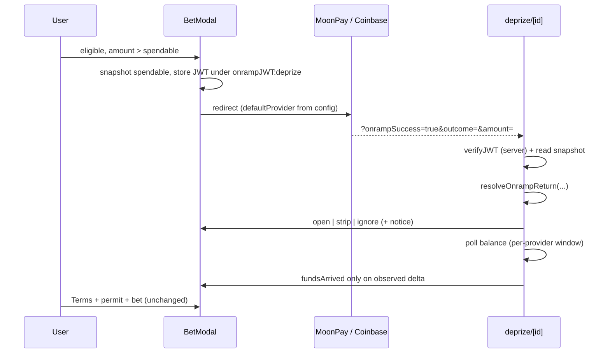

# PR-F — Onramp in BetModal

| Field | Value |
|---|---|
| **Status** | Ready (revised 2026-09-16 — second engineering pass applied) |
| **Verdict carried** | **Adequate.** Was **Weak — not ready to implement** in [`pr-design-docs-eng-critique-f.md`](pr-design-docs-eng-critique-f.md). MF-1…MF-5 and SF-1…SF-6 are applied or deferred with an owner in §9.3; the flow is now a specified state machine with a pure reducer behind it. |
| **Authors** | MoonDAO DePrize engineering |
| **Reviewers** | *unassigned — DePrize eng lead* (design + reducer), *unassigned — DePrize product* (§9.1 defaults and copy), *unassigned — counsel liaison* (pre-purchase disclosure wording) |
| **Last updated** | 2026-09-16 |
| **Depends on** | **PR-0** (`restricted` prop + `useDePrizeRestricted()` + the `no-restricted-imports` rule) — see §10.1 for why this is a hard dependency; **PR-1** (`[id].tsx` section slots, so the return handler is not a fourth effect wedged into the page body); **PR-C** (lands in `BetModal.tsx` first) |
| **Merge position** | 5th. Order is `PR-0 → PR-1 → A′ → C → F → E → B′ → D1 → G1` ([`pr-program-architecture.md`](pr-program-architecture.md) §4). **F merges before E**, and both merge after PR-1. |
| **Must not** | Weaken eligibility, Terms, permit, or the 1 ETH cap; run Coinbase on Sepolia; trust the return URL; re-derive jurisdiction with `useRegionRestriction`; introduce a second geo authority |
| **Constraints** | [`deprize-engineering-constraints.md`](deprize-engineering-constraints.md) — this PR is bound by C1, C3, C5, C7, C8, C10, C11, C12 |

---

## 1. One-paragraph summary

Replace BetModal's dead-end "Lower your bet or add funds" copy with an **Add funds** path, on chains where a provider exists. Provider and chain behavior come from a `FUNDING_STRATEGY_BY_CHAIN` config map, not an `if (Arbitrum)` branch: Arbitrum gets `FundOnramp` with `defaultProvider` set explicitly from config (MoonPay — eligible DePrize users are not U.S. persons, and Coinbase remains an in-widget toggle), Sepolia gets a faucet link, anything else gets today's copy. The return from the provider is decided by a **pure `resolveOnrampReturn` reducer** that requires a **verified, fresh, unconsumed JWT** before it will reopen anything; the URL's `outcome` and `amount` are untrusted hints that may prefill and may never confirm. **"Funds arrived" is derived from an observed balance delta on the DePrize market chain, never from a URL parameter.** The return handler bypasses only the *region* term of `bettingAllowed`, never the market-state terms. The whole flow is instrumented, because a conversion feature with no telemetry cannot be evaluated after launch.

---

## 2. Context / background

[ui/components/deprize/BetModal.tsx](ui/components/deprize/BetModal.tsx) computes `insufficient = betAmountNum > 0 && betAmountNum > spendableEth + 1e-12` (~108). When true, the primary button is replaced (~594–597) with:

> You only have ≈ {spendable} available (a little is kept back for gas). Lower your bet or add funds.

There is no action behind "add funds." `spendableEth` comes from `spendableFromBalanceEth` ([ui/lib/deprize/gas-reserve.ts](ui/lib/deprize/gas-reserve.ts)) on the prize page.

The cap remains `DEPRIZE_MAX_BET_WEI = UNIT` (1 ETH) in [ui/lib/deprize/positionCap.ts](ui/lib/deprize/positionCap.ts). Eligibility + accept-terms + permit are unchanged (BetModal ~164–237, ~283–297).

Missions already onramp:

- [ui/lib/coinbase/useOnrampJWT.tsx](ui/lib/coinbase/useOnrampJWT.tsx) — `generateJWT({ address, chainSlug, usdAmount?, context?, missionId? })` → `/api/coinbase/onramp-jwt`; `verifyJWT` is a **server round-trip** that checks address / optional missionId / context (~121–125) and carries a `timestamp` (~14). `getAddressFromJWT` (~163–181) `atob`s the payload with **no signature check** — it is a display helper and **must never be used as a gate**. Only `verifyJWT` counts. `generateJWT` returns `null` and only `console.error`s on failure (~88).
- [ui/lib/mission/useOnrampFlow.ts](ui/lib/mission/useOnrampFlow.ts) — reopens the *mission* contribute modal when `onrampSuccess === 'true'` **and** a wallet **and** a stored JWT are present (~84–94). Note ~96–102: it force-reopens on every render while the param is in the URL, and ~104–108 uses a 500 ms timer as a hydration guess.
- [ui/lib/coinbase/useOnrampRedirect.tsx](ui/lib/coinbase/useOnrampRedirect.tsx) — `generateRedirectUrl` / `clearRedirectParams`.
- [ui/components/onramp/FundOnramp.tsx](ui/components/onramp/FundOnramp.tsx) + [ui/components/coinbase/CBOnramp.tsx](ui/components/coinbase/CBOnramp.tsx) — Coinbase (`generateOnRampURL` / headless Apple Pay) plus a MoonPay leg, with an internal US/non-US region split (~78–97).

Two properties of the current code that this design leans on and should be said out loud:

- **The permit is fetched inside `placeBet`** (`BetModal.tsx` 276), so a redirect cannot strand an expired permit. This is the one hard state the design gets for free. Nobody may "helpfully" pre-fetch the permit when the modal opens (§6.7).
- **`onrampJWT` is a single global `localStorage` key** (`useOnrampJWT.tsx` 41, 77, 152–156), shared with the mission flow. §6.5 namespaces it rather than clearing it.

Prize-page deep link today: `?outcome=N` opens BetModal after wallet + `bettingAllowed` ([id].tsx ~398–425). `bettingAllowed` (~374–384) is **five gates fused into one boolean**: `deprize.bettingOpen`, `market.mintBound`, `mintConfigured`, region, `!tradingHalted`, `market.stage === Running`. There is no `onrampSuccess` handling.

Prod market chain is Arbitrum; the public Touchdown tip is still Sepolia #22. Coinbase does not faucet Sepolia. [ui/pages/deprize-play.tsx](ui/pages/deprize-play.tsx) already mentions `sepoliafaucet.com`.

---

## 3. Problem statement

Eligible bettors who pass Terms and still have 0 ETH (or less than the typed amount) hit a dead end. Missions already solved this with `FundOnramp`, but missions **are** US-reachable and force Coinbase; DePrize eligibility **excludes U.S. persons**. Who is affected: first-time non-US Arbitrum bettors, and Sepolia QA testers (faucet, not an onramp).

The harder problem, and the one the first version of this doc did not treat as a problem: **this is a state machine that survives a full-page redirect to a third party and comes back holding real money.** The user leaves the app, the provider settles on its own schedule, and the only thing that comes back into our process is a URL. A design that specifies one happy path plus a green banner is not a design for that.

---

## 4. Goals and non-goals

**Goals**

- Add-funds CTA when `insufficient` **or** `spendableEth === 0`, **and** DePrize has already said the user may bet.
- One jurisdiction authority for the whole flow (§6.3).
- Config-driven provider/chain strategy with a kill switch (§6.1).
- A pure `resolveOnrampReturn` reducer that decides the return, with the ten named tests in §6.9.
- "Funds arrived" derived from an **observed balance delta** on the market chain.
- A complete terminal-state table (§7), including the states the default provider will actually produce.
- Funnel instrumentation sufficient to judge the feature after launch (§8.2).
- Leave eligibility, Terms click-wrap, permit, and the 1 ETH cap untouched.

**Non-goals**

- Onramp on the index page (`RaceMarketCard` / `LiveDePrizeHero`) — removed from this PR; see F7.
- Lowering `DEPRIZE_MAX_BET_WEI`.
- A second DePrize-only onramp widget, or a second MoonPay integration (§9.1).
- Skipping Terms so someone can onramp before attestations.
- Changing `evaluateEligibility` (C3).
- Fixing `Modal.tsx` dialog semantics (focus trap, `role="dialog"`) — deferred with an owner in §9.3.

---

## 5. Alternatives considered

F1–F4 are unchanged in substance. F5–F8 record decisions this revision changes; the previous answers are kept with the reason they were rejected rather than swapped out.

### F1. Reuse mission onramp primitives in BetModal (chosen)

`useOnrampJWT` + `FundOnramp` + a return reducer on the detail page.

- **Reuse:** Highest — same JWT API, same `onrampSuccess` query key, same widget.
- **Complexity:** Medium. BetModal is already large, so the decision logic goes in a pure module, not the component.
- **User impact:** Eligible (non-US) users see MoonPay first; Coinbase remains a toggle.
- **Legal:** Onramp funds a **wallet**; it is not a bet. Bet still requires permit.

### F2. Deep-link out to `/mission/{id}` contribute to "add funds" — rejected

Leaves the bet, may auto-contribute to the mission, wrong amount, and confuses a mission contribution with a bet.

### F3. Inline instructions only — rejected

Lowest complexity, still a dead end on mobile. The rollout requires a CTA.

### F4. Coinbase on Sepolia via a test widget — rejected

Coinbase onramp targets mainnet / Arbitrum ETH, not Sepolia. Faucet only on testnets.

### F5. Provider chosen by `FundOnramp`'s internal region detection (the previous answer — **now rejected**)

The doc previously said: *"Omit `defaultProvider` so region detection runs."* That was the right fix to the wrong layer. It removed the forced-Coinbase bug and, in doing so, delegated provider choice to `FundOnramp`'s US/non-US heuristic — **a second geo authority, weaker than the one DePrize already has.** A user in a sanctions-restricted non-US jurisdiction is, by that heuristic, "not US," and is therefore offered MoonPay.

**Rejected.** Two sources of jurisdiction truth in one CTA is the defect class PR-0 exists to end, and it is worse here because the weaker source is inside a shared component nobody on this PR owns.

**Chosen (F6):** `defaultProvider` is passed **explicitly from config** so the heuristic never runs as a decision-maker, and the invariant in §6.3 is stated in the doc: *the provider heuristic may never decide whether funding is offered, only which widget renders after DePrize has already said yes.*

### F6. `FUNDING_STRATEGY_BY_CHAIN` config map vs. `if (Arbitrum) … else faucet` (chosen: config map)

A branch inside a 700-line modal means a third chain, a provider outage, or "disable MoonPay in region X" is JSX surgery. A map makes each of those a config edit plus a unit test, and it supplies the kill switch §8 previously lacked (`kind: 'none'` restores today's copy). `NEXT_PUBLIC_MOCK_ONRAMP` is a screenshot aid, not a rollback. Shape in §6.1.

### F7. Onramp from the index-page BetModals (the previous answer — **now rejected**)

The doc previously required `RaceMarketCard` and `LiveDePrizeHero` to build detail-path return URLs, and waved through "the user lands on a different page than they left" as acceptable.

**Rejected.** It adds a cross-page redirect class — a whole column of new states in §7 — to a CTA that §8 concedes is dormant on Arbitrum until a mainnet Touchdown exists. Index mounts keep today's copy plus a "View prize" link; the onramp ships only on `/deprize/<id>`. Fewer states, same user outcome, two fewer files in the blast radius.

### F8. Prefill the return `amount` with `0.01` when the box was empty (the previous answer — **now rejected**)

§9 previously resolved the empty-input case by putting `0.01` into `buildOnrampReturnUrl`, so the user returned to a bet box containing a monetary amount they never typed and could not tell was a suggestion.

**Rejected.** Never prefill a money field with a number the user did not choose. `0.01` survives only as `ONRAMP_SUGGESTED_PURCHASE_ETH`, the *widget's* suggested purchase amount where a number is required (§9.1), and the return URL carries `amount` **only when the user typed one**. With no amount, the return reads: *"Funds arrived. Enter how much you want to back {competitor} with."*

**Chosen overall:** F1 + F6, with F5, F7, F8 rejected as recorded.

---

## 6. Proposed design

### 6.1 Funding strategy config

`FUNDING_STRATEGY_BY_CHAIN` in `ui/lib/deprize/fundingStrategy.ts` (pure; the repo already keys DePrize config by chain via `DEPRIZE_MINT_ADDRESSES` / `DEPRIZE_FEE_ROUTER_ADDRESSES`):

```ts
type FundingStrategy =
  | { kind: 'none' }                                   // today's copy; the kill switch
  | { kind: 'faucet'; faucetUrl: string }
  | {
      kind: 'onramp'
      defaultProvider: 'moonpay' | 'coinbase'          // explicit — never inferred (F5)
      allowProviderToggle: boolean
      pollIntervalMs: number
      pollWindowMs: number                             // per provider (§6.6)
      chainSlug: string                                // what the JWT and widget are pinned to
    }

export function getFundingStrategy(chainId: number): FundingStrategy
```

Defaults: Arbitrum → `onramp` / `moonpay` / toggle on; Sepolia → `faucet`; everything else → `none`. Every value is a frozen default with an owner in §9.1. A provider outage is `defaultProvider` flipped or `kind: 'none'`; a third chain is a new row and a test.

### 6.2 Pure URL helpers — [ui/lib/deprize/onrampReturn.ts](ui/lib/deprize/onrampReturn.ts)

```ts
export function buildOnrampReturnUrl(opts: {
  origin: string
  deprizeId: number
  outcomeIndex: number
  amountEth?: string        // omitted entirely when the user typed nothing (F8)
  capEth: string
}): string

export function parseOnrampReturn(query: Record<string, string | string[] | undefined>):
  | { active: false }
  | { active: true; outcomeIndex: number; amountEth?: string }
```

Rules:

- `active` only when `onrampSuccess === 'true'`.
- `outcome` is a non-negative integer; anything else → `{ active: false }`.
- `amount`, when present, matches `/^\d+(\.\d+)?$/`, is **≤ 18 decimal places**, has a **bounded total string length**, and is **clamped to `capEth` in both directions** — outbound so we never send a user off to *purchase* 999 ETH, inbound so a crafted link cannot prefill above `DEPRIZE_MAX_BET_WEI`.
- Ignore `privy_*` params.
- Never put an address, IP, or JWT in the URL (C5).

**These helpers test string handling only.** They cannot fail if the reopen logic is wrong; that is §6.4's job.

### 6.3 When the CTA appears — one jurisdiction authority

Branch order in BetModal, replacing the `insufficient` dead end (~594–598):

```
eligibility not ready       → "Checking eligibility…" (with the timeout in §6.8)
!eligibility.allowed        → existing eligibility message, NO funding CTA
overCap                     → existing cap message (unchanged)
wrongNetwork                → existing switch prompt (unchanged)
!canBet                     → existing router-not-deployed message (unchanged)
insufficient || spendable===0 → "Bet {spendable} instead" (primary text action)
                              + [Add funds] (secondary, outline)
else                        → Bet button (unchanged disabled logic)
```

**Jurisdiction invariant.** There is exactly one authority for whether funding is offered: BetModal's **server-derived `eligibility.allowed`**, backed by PR-0's `restricted` signal from `useDePrizeRestricted()` for anything rendered before that resolves. `FundOnramp`'s internal US/non-US heuristic decides **nothing** here, because `defaultProvider` is passed explicitly (F5/F6). **Never import `useRegionRestriction`** in any file this PR touches — per C11 the corrected signal is consumed, never re-derived, and PR-0's ESLint `no-restricted-imports` rule makes a violation a build failure rather than a review catch.

**Spend-path framing.** Lowering the bet is free and always available; buying crypto costs money and has a failure surface. The "Bet {spendable} instead" action is the plain default and **Add funds** is the secondary outline button. The spend path is never the visually dominant one.

**Pre-redirect disclosure**, required before any navigation to a provider:

> This buys ETH into your own wallet. It is not a bet, MoonDAO never holds it, and MoonDAO cannot reverse it. You may still be unable to bet afterwards.

That last clause is the honest one: the user can buy ETH and then be refused the bet (ineligible, over cap, market closed), and MoonDAO cannot refund a third-party purchase. Wording owner in §9.1.

**Verb discipline with PR-E.** PR-F's money button is *"Add funds to your wallet"* — the money stays the user's. PR-E's is *"Fund the prize"* / *"Donate to the prize pool"* — the money leaves permanently. Two similarly-worded money buttons on one page is the failure mode; neither doc may drift onto the other's verb.

**Widget mounting.** On an `onramp` strategy, embed `FundOnramp` with `selectedChain` = the market chain and `ethAmount = betAmountNum || ONRAMP_SUGGESTED_PURCHASE_ETH`, passing `defaultProvider` from config and keeping the in-widget toggle. If it is too tall inside `Modal`, a second "Add funds" step using the same component is fine. Call `onCoinbaseBeforeNavigate` to persist the JWT before a Coinbase redirect. **Do not import `useOnrampFlow`** — it reopens a *mission* modal, and its force-reopen loop (~96–102) is a bug we are specifically not inheriting (§7 row 12).

**JWT:** `generateJWT({ address, chainSlug: <from config>, context: 'deprize' })` — **omit `missionId`**. Sepolia Touchdown is DePrize **22** and launchpad mission **14**; `verifyJWT`'s "Mission ID mismatch" is built for Juicebox mission ids. Do not pass `launchpad.missionId` (`useOnrampAutoTransaction` stays in the mission modal). If `generateJWT` returns `null` (rotated key, 500), **do not navigate**: keep the modal open, toast the failure, and count `jwt_generate_error` (§8.2).

**Faucet strategy** (Sepolia and any non-onramp chain): no widget, no JWT, no MoonPay. Link, matching `deprize-play.tsx` copy:

> Get Sepolia ETH from a faucet (e.g. https://sepoliafaucet.com), then come back — your balance will refresh.

### 6.4 The return decision — a pure reducer

The reopen decision moves out of a `useEffect` and into `ui/lib/deprize/resolveOnrampReturn.ts`, because a decision that lives inside an effect inside a page component cannot be unit-tested and the previous acceptance criteria for it were browser screenshots of a path dormant on the production chain.

```ts
resolveOnrampReturn(input: {
  parsed: ReturnType<typeof parseOnrampReturn>
  jwtVerified: boolean            // result of the verifyJWT server round-trip — never getAddressFromJWT
  jwtAddress?: string
  jwtIssuedAtMs?: number
  jwtConsumed: boolean
  nowMs: number
  userAddress?: string
  numOutcomes: number
  marketAcceptsBets: boolean      // §6.5 — market-state terms only, no region term
  spendableEthAtReturn?: number   // snapshot taken before navigating away; undefined on a cold return
  spendableEthNow?: number
  capEth: number
}): {
  action: 'ignore' | 'strip' | 'open'
  betIndex?: number
  prefillEth?: string
  fundsArrived?: boolean
  notice?: ReturnNotice
}
```

Decision order, each step naming the state-table row it implements:

1. `!parsed.active` → `ignore`.
2. **`!jwtVerified` → `ignore`.** A verified JWT is a hard precondition, not a suggestion. This is the entire fix for the crafted-link problem: without it, `/deprize/22?onrampSuccess=true&outcome=3&amount=0.99` from a DM, a bookmark, or a search result reopens the bet modal pre-aimed at an outcome the user never chose. `getAddressFromJWT` is `atob` with no signature check and may never substitute for the round-trip.
3. `jwtAddress !== userAddress` → `strip` + wrong-wallet notice **naming the funded address**, so the user knows which wallet to reconnect (row 9).
4. `nowMs - jwtIssuedAtMs > JWT_FRESHNESS_MS` → `strip`, no banner (row 4).
5. `jwtConsumed` → `ignore` (row 13, replay).
6. `!marketAcceptsBets` → `ignore` + a page-level notice explaining the market state (rows 5–7). **Never open a bet modal on a paused, resolved, or superseded market.**
7. `outcomeIndex` out of range, negative, or non-integer → `strip`, never `open`.
8. Otherwise → `open`, with `prefillEth` = `parsed.amountEth` clamped to `capEth` (absent if the user typed nothing, F8), and:
   - `fundsArrived = true` iff **both** snapshots exist **and** `spendableEthNow - spendableEthAtReturn > 0` **and** `spendableEthNow + 1e-12 >= prefillEth` (or, with no prefill, `spendableEthNow > 0`).
   - Delta short of the amount → `fundsArrived: false` + shortfall notice (row 2).
   - No snapshot (cold return) → `fundsArrived: undefined`; no banner, and the live sufficient/insufficient state speaks for itself.

**`fundsArrived` is never computed from the URL.** `?amount=0.000001` previously rendered a green financial confirmation to anyone with gas money, and in the honest case the banner contradicted the "you only have ≈ X" line the moment the user typed a bigger number. The banner is a statement about an observed balance change during this return, or it is absent.

The balance snapshot is written to `sessionStorage` under `onrampReturn:deprize:<jwtId>` at CTA-click time, before navigating away, and it carries the `consumed` marker for step 5. Session-scoped storage is deliberate: a cold return in a new session gets no banner rather than a wrong one.

**Balance reads are pinned to the DePrize market chain**, never `chain.id` of whatever the wallet currently has selected. Otherwise "Funds arrived" is computed against the wrong balance whenever the user switched networks at the provider (row 10).

### 6.5 Narrowing the `bettingAllowed` bypass

The previous doc said the onramp handler "must not wait on `bettingAllowed`." That is too broad: the boolean fuses `deprize.bettingOpen`, `market.mintBound`, `mintConfigured`, region, `!tradingHalted`, and `market.stage === Running`. Discarding it wholesale invites someone who just spent money to bet into a paused, resolved, or superseded market — and **BetModal has no branch for any of those**, because the page-level check is what normally stops the modal from opening at all.

Split the predicate into `ui/lib/deprize/marketGates.ts` (pure, testable):

```ts
export function marketAcceptsBets(m: {
  bettingOpen: boolean; mintBound: boolean; mintConfigured: boolean
  tradingHalted: boolean; stage: MarketStage
}): boolean
```

`[id].tsx` then computes `bettingAllowed = marketAcceptsBets(...) && !restricted`, where `restricted` is PR-0's signal. **The onramp return bypasses the `restricted` term only, and requires `marketAcceptsBets` unconditionally.** A restricted user still sees the reopened modal and its eligibility message — the original intent — while a user returning to a market that changed does not.

**What the user sees when the market changed while they were away:** no modal, and a page-level notice naming the state — *"This market is paused; you can still hold your funds and come back"* / *"This prize has resolved"* / *"This prize continues as #{n}"* with a link to the live tip via `resolveLiveDePrizeId`. Their ETH is in their own wallet and is not lost, and the notice says so. Reopening a bet modal on a superseded generation is the worst outcome in the whole table and it is now unreachable by construction.

### 6.6 Timing: the default path is not the fast path

The previous doc polled "every 2–3 s for up to ~2 minutes." That cadence was calibrated to Coinbase's headless Apple Pay, which settles in seconds. **Making MoonPay the default invalidated the model and the doc did not notice** — MoonPay's non-card rails can settle in hours, so the *default* path was: redirect, come back, poll fruitlessly, fall into an unspecified state.

Per-provider constants in the strategy map (§6.1), with expected settlement stated rather than implied:

| Provider | Typical settlement | `pollIntervalMs` | `pollWindowMs` | Expected outcome of the poll |
|---|---|---|---|---|
| Coinbase (headless Apple Pay) | seconds | 3000 | 120000 | Usually **funds observed** inside the window |
| MoonPay, card | minutes | 3000 | 90000 | **Often times out**, and that is normal |
| MoonPay, bank rails | hours to a day | 3000 | 90000 | **Times out essentially always** |

So for the default path, poll expiry is the **expected** terminal state, not an error, and its copy must read that way:

> **Your purchase is on its way.** Card purchases usually take a few minutes; bank transfers can take hours. The ETH goes straight to your wallet — you can close this page and come back any time. Your amount is saved.

Three consequences the design must honor:

- The poll indicator is for the first ~90 seconds only. A looping spinner for minutes is a lie about progress.
- The message explicitly gives permission to leave. Holding a user on a polling page for a rail that settles in hours is the actual product failure here.
- **Cold return.** When the user comes back later with no in-memory state and no session snapshot, there is no delta to compute, so there is no banner (§6.4 step 8). The page renders normally and BetModal's existing sufficient/insufficient branch tells the truth from the live balance. If the JWT is beyond `JWT_FRESHNESS_MS`, params are stripped and nothing reopens — the user is simply on the prize page with funds in their wallet, which is the correct end state for a purchase that took a day.

### 6.7 Wiring on the page

The return handler is one effect that (a) parses, (b) kicks off `verifyJWT`, (c) reads the snapshot, (d) calls `resolveOnrampReturn`, (e) applies the result. It holds no decision logic of its own.

- **Strip immediately after copying params into React state** — not "after the modal has opened." Those are different contracts, and wait-for-open inherits `useOnrampFlow`'s force-reopen loop (~96–102) where the user cannot dismiss the modal, plus a refresh window. `router.replace({ pathname, query: rest }, undefined, { shallow: true })` so the once-ref survives.
- **Mark the JWT consumed** in the same step, so browser-back does not replay the banner (row 13).
- **Drop the copied 500 ms timer.** `useOnrampFlow` uses it as a hydration guess; here there are real conditions to wait on (`router.isReady`, `userAddress`, `numOutcomes`, `!market.loading`), so wait on those. Cap the wait for `userAddress` at `WALLET_WAIT_MS` (§9.1), then strip and show *"Connect the wallet you funded to continue"* (row 8) rather than leaving params in the URL forever.
- **When `parseOnrampReturn().active`, the existing `?outcome=` deep-link effect returns immediately.** The onramp handler owns `outcome`. Do not let the deep-link effect latch and then strip it.
- **Do not pre-fetch the permit** when the modal opens. It is fetched inside `placeBet` (`BetModal.tsx` 276), which is why a redirect cannot strand an expired one (§7 row 17). Moving it earlier would introduce the one failure mode this design currently gets for free.
- If `FundOnramp` stays mounted and an in-app Apple Pay succeeds without a full redirect, the same snapshot/delta logic applies — refresh the balance and reuse `resolveOnrampReturn` with `parsed.active = true` synthesized locally.

BetModal gains two optional props: `initialAmountEth?: string` (initializes `betAmount` once; do not fight user edits) and `fundsArrived?: boolean`.

**Announcing arrival.** The banner appears after a full-page redirect with no focus change, so a screen-reader user is told nothing. Render it as `<p role="status">Funds arrived. You can place your bet.</p>` and move focus to the **modal heading** — not the amount input, whose `autoFocus` otherwise steals focus half a second after the page settles and pops the mobile keyboard over the modal. The deeper `Modal.tsx` gap (no `role="dialog"`, no `aria-modal`, no focus trap or restore) is real and is **not** fixed here; see §9.3.

### 6.8 JWT storage and the eligibility hang

**Namespace the storage key: `onrampJWT:deprize`.** The previous patch — `clearJWT` on BetModal unmount — collides with the thing it is protecting: a full-page redirect to the provider **unmounts BetModal**, so cleanup can delete the token before the return ever reads it, and §6.4's hard JWT precondition would then always fail. Cross-tab, one tab's close wipes another tab's mid-flight *mission* token, since `onrampJWT` is one global key. Namespacing solves the mission collision the earlier review worried about, removes the unmount hazard, and makes two tabs independent (row 11). Clear on explicit user dismissal and after a successful bet — **never on unmount**.

**Eligibility timeout.** BetModal's eligibility fetch has no timeout, so a hung request leaves "Checking eligibility…" forever with no retry and no CTA. Add `ELIGIBILITY_TIMEOUT_MS` (§9.1) and a retry affordance. This is not scope creep: the funding CTA is gated on that fetch, so its hang is now a funding dead end as well as a betting one.



### 6.9 Tests

Unit, under `ui/cypress/integration/lib/deprize/` via `yarn test:deprize` (C10). The ten cases that must fail if the logic is wrong, against `resolveOnrampReturn`:

1. `onrampSuccess=true` with **no verified JWT** → `ignore`. *(This is the case the previous design would have failed.)*
2. JWT address ≠ connected wallet → `strip` + wrong-wallet notice naming the funded address.
3. JWT older than `JWT_FRESHNESS_MS` → `strip`, no banner.
4. `outcome` ≥ `numOutcomes`, negative, or non-integer → `strip`, never `open`.
5. `amount` above `capEth` → `open` with `prefillEth` clamped to the cap.
6. `marketAcceptsBets === false` (paused / resolved / superseded) → `ignore` + notice, never `open`.
7. `spendableEthNow === spendableEthAtReturn` → `fundsArrived: false` regardless of `amount`, **including `amount=0.000001`**.
8. Delta observed but short of the amount → `open`, `fundsArrived: false`, shortfall notice.
9. Second invocation with the same consumed JWT → `ignore`.
10. `buildOnrampReturnUrl` → `parseOnrampReturn` round-trips losslessly for 18-decimal amounts, and drops `amount` entirely when none was typed.

Plus: `marketAcceptsBets` truth table (each of the five terms false in turn); `getFundingStrategy` for Arbitrum / Sepolia / unknown chain / `kind: 'none'`; and `parseOnrampReturn` rejecting 40-digit decimals, scientific notation, and over-long strings.

### 6.10 What must not change

- `evaluateEligibility` / `runEligibilityChecks` / permit body (C3).
- `canSubmitDePrizeBet` (Terms + attestations + saved acceptance).
- `betExceedsCap` / `DEPRIZE_MAX_BET_WEI`.
- Slice 5% / mint `bet()` params.
- Sell / redeem (C4).

The CTA does not place a bet and does not write an acceptance record.

---

## 7. State table — every terminal state named

Row 1 was the only specified path in the previous version.

| # | State | Behavior |
|---|---|---|
| 1 | Funds arrive ≥ typed amount, same wallet, market accepting | Reopen on `outcome`, prefill (clamped), `role="status"` "Funds arrived", strip params, focus the heading |
| 2 | Funds arrive **short** of the amount | `open`, no "Funds arrived". Show the shortfall explicitly (*"≈0.004 ETH short"*), offer **"Bet 0.004 instead"** as the primary action, and rebuild any next return URL for the **shortfall**, not the original amount |
| 3 | **Funds never arrive** within the poll window | Terminal, named, non-error state with the §6.6 copy. Stop polling, keep the prefill, do not imply failure. **This is the expected MoonPay outcome, not an edge case** |
| 4 | User returns **hours or days later** | JWT beyond `JWT_FRESHNESS_MS` → strip params, no modal, no banner. The page renders normally; funds are in their wallet |
| 5 | Market **paused / halted** while away | `marketAcceptsBets === false` → no modal, page-level notice naming the state and confirming the funds are theirs |
| 6 | Market **resolved** while away | Same, pointing at the claim panel |
| 7 | Prize **superseded** while away (#21 → #22 is live in this repo) | Same, plus a link to the live tip via `resolveLiveDePrizeId`. Never reopen a bet modal on a dead generation |
| 8 | **Wallet disconnected** on return | Wait `WALLET_WAIT_MS`, then strip and show *"Connect the wallet you funded to continue"* |
| 9 | **Different account** on return | `verifyJWT` address mismatch → strip + notice naming the funded address. No bet |
| 10 | **Chain switched** at the provider | Balance read pinned to the DePrize market chain; `wrongNetwork` branch precedes `insufficient`, so the CTA hides and a switch prompt shows |
| 11 | **Two tabs**, one mid-flight | Independent: `onrampJWT:deprize` is namespaced and the snapshot is keyed by JWT id. A mission onramp in another tab is untouched |
| 12 | User **closes** the reopened modal | Stays closed. Params were stripped on copy, so nothing re-forces it open |
| 13 | Browser **back** after the return | Consumed marker → `ignore`. No banner replay |
| 14 | **Crafted / edited** `outcome` or `amount` | Untrusted hints. No verified JWT → `ignore`; out-of-range `outcome` → `strip`; oversized `amount` → clamped; `fundsArrived` unaffected because it comes from the observed delta |
| 15 | **Abandoned at the provider** | No return, nothing breaks. Visible only through `cta_clicked` without `return_received` (§8.2) — the funnel gap the feature exists to close |
| 16 | **`generateJWT` fails** (rotated key, 500) | Do not navigate. Toast, keep the modal open, count `jwt_generate_error` |
| 17 | **Permit expired** during the flow | Safe by construction: the permit is fetched inside `placeBet` (`BetModal.tsx` 276), so there is nothing to expire across a redirect. Recorded so nobody pre-fetches it (§6.7) |
| 18 | User returns **having already placed the bet** (second tab, or a return after betting) | The consumed marker plus the post-bet `clearJWT` mean `ignore`. If a stale link still resolves, `spendableEthNow` reflects the spent balance, so `fundsArrived` is false and the modal opens on the normal insufficient branch — never a success affordance |
| 19 | **Non-Arbitrum, non-Sepolia chain** | `kind: 'none'` → today's copy, no CTA |

---

## 8. Testing, rollout, flags, and measurement

### 8.1 Rollout

- **Unit:** `yarn test:deprize` (§6.9).
- **Kill switch:** `FUNDING_STRATEGY_BY_CHAIN[chain] = { kind: 'none' }` restores today's copy without a deploy-shaped code change. `NEXT_PUBLIC_MOCK_ONRAMP` is a screenshot aid, not a rollback.
- **Secrets:** existing `CB_API_KEY` / `CB_API_SECRET` for `/api/coinbase/onramp-jwt`. No new env beyond the strategy config.

**Exercising the Arbitrum path before launch**, since the previous plan's acceptance rested on browser screenshots of a path dormant on the production chain:

1. **Reducer tests** (§6.9) cover every branch of the return decision with no browser at all. This is the primary evidence.
2. **Extend `NEXT_PUBLIC_MOCK_ONRAMP`** so it short-circuits the whole flow, not just `CBOnramp`: a mocked JWT verification and a scripted balance delta, so the full return handler can be driven on a local **Arbitrum-configured** fixture. Required scripts: instant arrival, short arrival, no arrival, stale JWT, market closed on return.
3. **One real end-to-end purchase** on Arbitrum by a team member in an eligible jurisdiction, for the minimum the provider allows, before the CTA is enabled for anyone else. A conversion feature whose money path has never moved real money is not verified.
4. Sepolia `/deprize/22` remains the live QA path for the faucet branch and for the no-widget assertions.

### 8.2 Instrumentation — the feature is a conversion claim, so it must be measurable

Day-bucketed counters in Upstash Redis via a domain helper modeled on `ui/lib/deprize/complianceStore.ts` (C7), no PII and no raw IPs (C5). `/api/coinbase/onramp-jwt` is already a server-side chokepoint and can count "starts" by `context: 'deprize'` for free.

`cta_shown`, `cta_clicked`, `provider_selected:{coinbase|moonpay|faucet}`, `jwt_generate_error`, `return_received`, `return_rejected:{no_jwt|stale|address|outcome|market_closed|consumed}`, `funds_observed`, `poll_timeout`, `bet_placed_within_session`.

**Falsifiable success criterion**, replacing "dormant until mainnet": the feature is judged on `funds_observed / cta_clicked` and `bet_placed_within_session / funds_observed`, with thresholds set by *unassigned — DePrize product* **before** the CTA is enabled, not after the numbers are in. Without these counters, nobody can answer whether users reach the provider, whether they come back, or whether `/api/coinbase/onramp-jwt` has been quietly 500ing since a key rotation — `generateJWT` swallows that into a `console.error`.

---

## 9. Frozen defaults, risks, open questions

### 9.1 Frozen defaults — owner and revisit trigger required (C12)

Every row must carry a human name before implementation starts. `*unassigned*` here is a blocker, not a placeholder.

| Default | Value | Owner | Revisit trigger |
|---|---|---|---|
| `defaultProvider` (Arbitrum) | `moonpay`, toggle on | *unassigned — DePrize product* | A provider outage, a fee complaint, or a change to the eligible-jurisdiction list |
| **Not reusing any other MoonPay integration in the repo** | PR-F uses `FundOnramp`'s MoonPay leg only and builds no second integration. **This is a decision, not an omission.** The implementer greps for existing MoonPay call sites before writing provider code and either reuses one or records here why not | *unassigned — DePrize eng lead* | A second MoonPay entry point is found, or `FundOnramp`'s leg is changed by its owner |
| `pollIntervalMs` | 3000 | *unassigned — DePrize eng lead* | RPC cost, or observed settlement data |
| `pollWindowMs` | 120000 Coinbase / 90000 MoonPay | *unassigned — DePrize eng lead* | Real settlement distribution from `funds_observed` vs `poll_timeout` |
| `JWT_FRESHNESS_MS` | 60 min | *unassigned — DePrize eng lead* | Users legitimately returning inside a window and being refused |
| `WALLET_WAIT_MS` | 10 s | *unassigned — DePrize eng lead* | Slow-wallet reports |
| `ELIGIBILITY_TIMEOUT_MS` | 10 s | *unassigned — DePrize eng lead* | Eligibility latency changes |
| `ONRAMP_SUGGESTED_PURCHASE_ETH` | 0.01, **widget suggestion only — never a bet prefill** | *unassigned — DePrize product* | ETH price moves materially, or provider minimums change |
| Faucet URL | `sepoliafaucet.com`, matching `deprize-play.tsx` | *unassigned — DePrize eng lead* | The faucet dies |
| JWT `context` | `'deprize'` | *unassigned — DePrize eng lead* | A second DePrize onramp surface needs its own context |
| Storage key | `onrampJWT:deprize` | *unassigned — DePrize eng lead* | A third flow needs a namespace convention |
| Pre-purchase disclosure wording | §6.3 | *unassigned — counsel liaison* | Counsel review, or PR-E's verb split changing |
| Success thresholds | Set before enabling the CTA (§8.2) | *unassigned — DePrize product* | First month of data |

### 9.2 Risks and open questions

| Risk / question | Position |
|---|---|
| Coinbase delivers ETH on L1, not Arbitrum | Pin funding to the destination chain via `selectedChain` / `chainSlug` from the strategy map, exactly as missions do |
| MoonPay's slow rails make the in-page flow mostly a no-op | Accepted and designed for: row 3 is the expected outcome and its copy gives permission to leave (§6.6) |
| User buys ETH and is then refused the bet | Disclosed before the redirect (§6.3). MoonDAO cannot refund a third-party purchase, and the copy says so |
| Provider heuristic vs. DePrize jurisdiction | One authority (§6.3). `defaultProvider` is explicit so the heuristic never decides visibility |
| `FundOnramp` is shared with missions and changes under us | Real coupling, no owner on that component. Flagged; the strategy map limits the blast radius to config |
| Two money buttons on one page (PR-E's Fund, PR-F's Add funds) | Verb split stated in both docs; product owns the pair |

### 9.3 Deliberately not applied

- **`Modal.tsx` dialog semantics** — `role="dialog"`, `aria-modal`, focus trap, restore-on-close (UX critique G5). PR-F mitigates locally with `role="status"` and focus-to-heading (§6.7), but fixing the shared `Modal` affects every modal in the app and is a separate PR with its own verification. **Owner: *unassigned — DePrize eng lead*; trigger: before the Arbitrum CTA is enabled for non-team users.** Recording it rather than silently absorbing it, because a partially-accessible reopened dialog is exactly the kind of thing that never gets a second look once the feature ships.
- **Migrating the index-page mounts to the onramp** — removed from this PR (F7), not deferred with a promise. If a mainnet Touchdown makes index-originated funding worth the extra state class, it is a new PR with its own state table.
- **A provider-agnostic settlement webhook** (server-side confirmation instead of balance polling). Strictly better than polling and a plausible follow-up, but it needs a provider account change, a new endpoint, and a store; polling an observed balance delta is honest, has no new secrets, and works identically for both providers.

---

## 10. Cross-cutting constraints and dependencies

This PR is bound by the standing decisions in [`deprize-engineering-constraints.md`](deprize-engineering-constraints.md) — specifically C1 (ui/ + docs/, Yarn), C3 (`evaluateEligibility` stays pure), C5 (no raw IPs), C7 (Upstash Redis for the §8.2 counters), C8 (middleware composition), C10 (tests under `ui/cypress/integration/lib/**`), C11 (consume the corrected jurisdiction signal, never re-derive it), C12 (owners and revisit triggers). Do not restate them here; that block is maintained in one place.

### 10.1 Why PR-0 is a hard dependency

Not because the CTA's own gate is broken — it is not. The CTA is gated on BetModal's server-derived `eligibility.allowed` (`BetModal.tsx` 597–604, eligibility effect ~164–201), so a restricted user reaching the modal today sees the eligibility message and no funding CTA.

The asymmetry is the problem. The CTA inherits the **correct** gate while the path that *opens* the modal inherits the **broken** one (`bettingAllowed` → client `region.isRestricted`, `[id].tsx` 374–384) — and this PR then instructs the return handler to bypass part of `bettingAllowed` deliberately. On top of that, the previous design added a **second, weaker geo authority** in `FundOnramp`'s US/non-US heuristic (F5), so the only thing between a US visitor and a "buy crypto" affordance was one server fetch resolving before render. Finally, PR-F's entire thesis is a conversion rate measured over whoever reaches the bet modal; until PR-0 lands that population includes ~52 restricted jurisdictions, so any launch judgment is measured against a contaminated funnel — and §8.2's thresholds would be set against the wrong denominator.

PR-0 is a prop-threading fix, so the ordering cost is near zero and the downside it removes is inviting a restricted user to purchase crypto for a bet that will be refused.

### 10.2 Blast radius

`ui/lib/deprize/onrampReturn.ts` (new), `ui/lib/deprize/resolveOnrampReturn.ts` (new), `ui/lib/deprize/marketGates.ts` (new), `ui/lib/deprize/fundingStrategy.ts` (new), `ui/components/deprize/BetModal.tsx` (CTA branch + two props), and **one return-handler effect on `/deprize/[id]`**, added against PR-1's structure rather than as a fourth effect in the page body. Index pages are untouched (F7).

**Shared surfaces:** `BetModal.tsx` with PR-C — C merges first, F rebases. `[id].tsx` gate expression with PR-0 — F refactors `bettingAllowed` into `marketAcceptsBets(...) && !restricted` **preserving PR-0's corrected conditions verbatim**; if the expression does not look like PR-0 left it, stop and rebase rather than re-baselining. `FundOnramp` with missions — consume, do not edit.

---

## 11. Step-by-step implementation plan

1. Rebase onto PR-0, PR-1, and PR-C. Confirm `useDePrizeRestricted()`, the ESLint rule, and the page slots exist.
2. `fundingStrategy.ts` + `marketGates.ts` + their tests. Pure, no React.
3. `onrampReturn.ts` (build/parse with clamping) + `resolveOnrampReturn.ts` + the ten §6.9 tests. **This is the bulk of the PR and it runs with no browser.**
4. Add `initialAmountEth` / `fundsArrived` to BetModal without touching `placeBet`.
5. Replace the insufficient dead end: "Bet {spendable} instead" primary, **Add funds** secondary, gated on `eligibility.allowed`, rendered from the strategy map. Add the pre-redirect disclosure.
6. Wire `useOnrampJWT` with the namespaced key, `context: 'deprize'`, no `missionId`, explicit `defaultProvider`, no-navigate on `generateJWT` failure. Snapshot spendable balance before redirecting.
7. Add the return effect on the detail page: parse → `verifyJWT` → snapshot → `resolveOnrampReturn` → apply, strip-on-copy, consumed marker, per-provider poll window, `role="status"` announcement, focus to heading.
8. Add the §8.2 counters.
9. Extend `NEXT_PUBLIC_MOCK_ONRAMP` to drive the five scripted return scenarios (§8.1).
10. `yarn lint` — the `no-restricted-imports` rule must pass, not be suppressed. Grep the diff for `useRegionRestriction` and `getAddressFromJWT`; neither may appear.
11. **Browser verification.** Sepolia `/deprize/22` with a low-balance wallet: faucet copy, no widget, no JWT request. Mocked Arbitrum fixture: each of the five scripted scenarios, including `?onrampSuccess=true&outcome=0&amount=0.000001` with **no** JWT, which must reopen nothing and show nothing green. Confirm Terms still required, over-cap still blocked, ineligible wallet still refused, and no funding CTA when eligibility is denied. Screenshot each terminal state in §7 that has copy.

---

## Revision log (2026-09-16)

Second engineering pass ([`pr-design-docs-eng-critique-f.md`](pr-design-docs-eng-critique-f.md)), baseline verdict **Weak — not ready to implement**. Applied:

- **MF-1 — the return handler trusted the URL.** A **verified, fresh, unconsumed** JWT is now a hard precondition (§6.4 step 2); `getAddressFromJWT` is named as a display helper that may never gate. §6.2 and §6.3 no longer contradict each other because the decision lives in one reducer.
- **MF-2 — "Funds arrived" off dust.** Derived from an observed balance delta across the return window, pinned to the market chain, never from the URL `amount` (§6.4). Test 7 fails if this regresses.
- **MF-3 — `clearJWT` on unmount.** Replaced with a namespaced key `onrampJWT:deprize` (§6.8). Clearing on unmount would have deleted the token during the redirect that is the whole flow.
- **MF-4 — `bettingAllowed` bypass too broad.** Split into `marketAcceptsBets` (market-state terms) and the region term; only the region term is bypassed (§6.5). Rows 5–7 of §7 specify what the user sees when the market changed.
- **MF-5 — timing invalidated by the MoonPay default.** Per-provider settlement expectations and poll windows (§6.6); poll expiry is the *expected* default outcome with "you can close this and come back" copy; cold return specified.
- **SF-1/F6 — config-driven strategy** with `kind: 'none'` as the kill switch. **SF-2/F5 — one jurisdiction authority**; `defaultProvider` explicit so `FundOnramp`'s heuristic never decides visibility. **SF-3 —** strip-on-copy, consumed marker, `shallow` replace, 500 ms timer dropped. **SF-4 —** amount clamped and bounded in both directions. **SF-5 —** pre-purchase disclosure plus the verb split with PR-E. **SF-6/F7 —** index-page onramp removed.
- **Verifiability and measurement.** `resolveOnrampReturn` extracted as a pure reducer with ten named tests (§6.9); §8.1 states how the Arbitrum path is exercised before launch (mock scripts, Arbitrum fixture, one real minimum purchase); §8.2 adds funnel counters and requires thresholds to be set before enabling the CTA.
- **Process.** Owners and revisit triggers for every frozen default (§9.1); reviewers are named slots that block; the pasted constraints block is replaced with a link; blast radius and shared surfaces stated (§10.2).

Structural updates from the program review: depends on PR-0 and PR-1; merges at position 5 in `PR-0 → PR-1 → A′ → C → F → E → B′ → D1 → G1`, **before PR-E**; consumes `useDePrizeRestricted()` and never `useRegionRestriction`.

Not applied, with reasons, in §9.3.
