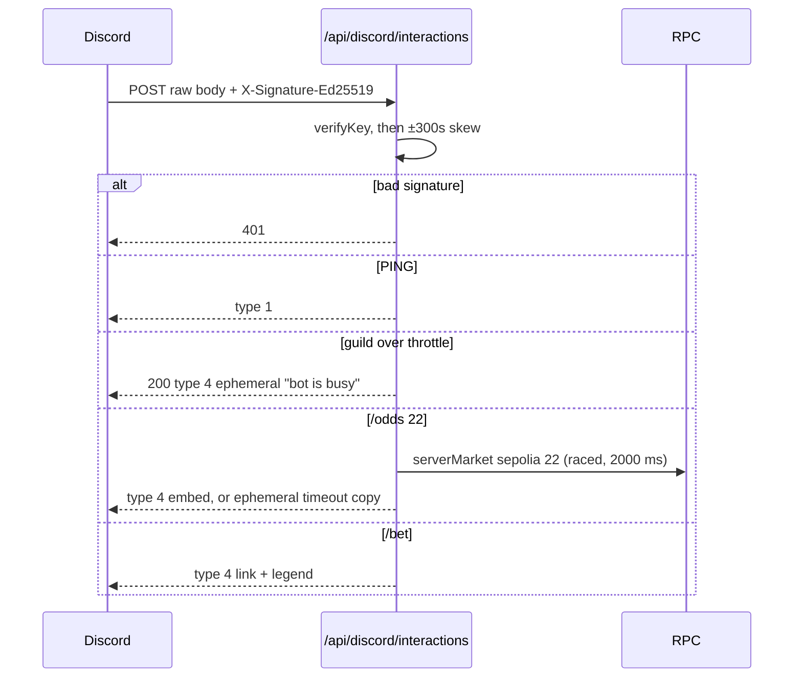

# PR-G — Discord bot and odds wire (ships as G1, then G2)

| Field | Value |
|---|---|
| **Status** | **G1 — Ready to implement.** **G2 — Blocked** (gated on PR-D2, which is itself Blocked). |
| **Authors** | MoonDAO DePrize engineering |
| **Reviewers** | *unassigned — DePrize product* (threshold, cooldown, cap, copy); *unassigned — engineering* (ACK strategy, snapshot transition); *unassigned — community ops* (guild id, wire channel id, on-call for a red wire job) |
| **Last updated** | 2026-09-16 (engineering-critique revision) |
| **Depends on** | **G1:** PR-1 (`serverMarket.ts`, widened mocha glob, Redis key registry), B′ (`capabilityLadder.ts` for embed copy), PR-C (Discord sink escaping requirements). **No dependency on PR-D.** **G2:** PR-D2 (leaderboard store) for `/leaderboard`; PR-D1 (the forecast panel and its `#deprize-forecast` anchor) for `/forecast`. **No dependency on PR-0's `restricted` signal:** G2 adds no page, so it never calls `resolveDePrizePageProps`, and therefore **no G2 code may call `useDePrizeRestricted()`** — committed in §6.1. |
| **Must not** | Collect forecasts in-bot; place bets; call `evaluateEligibility`; be the last gate before a bet. |

**Decision requested.** Three, explicitly:

1. **ACK strategy** — this doc chooses the bounded race (§5.2). Engineering signs off or names the hosting primitive that would make the deferred branch safe.
2. **Suppression values** — `ODDS_WIRE_THRESHOLD_PT`, `ODDS_WIRE_MIN_INTERVAL_MIN`, `ODDS_WIRE_DAILY_CAP`, and the **accepted ceiling of 6 posts per prize per day** that follows from them (§9).
3. **Ids and on-call** — `DISCORD_GUILD_ID`, `DEPRIZE_ODDS_WIRE_CHANNEL_ID`, and a named person who is paged when the wire job goes red (§6.9).

Every `*unassigned*` in §9 is a blocker on merge, not a placeholder to merge past.

---

## 1. One-paragraph summary

**G1** adds a Discord **Interactions** endpoint (Ed25519-verified PING + slash commands) serving `/odds`, `/pool`, and a link-only `/bet`; a server-side channel-post helper that the existing `/api/discord/send` route is refactored onto; and an **odds wire** that posts to a channel when any outcome moves **≥ 5 percentage points** against the last *posted* baseline, subject to a cooldown and a daily cap, driven by a 10-minute cron. **G2** adds `/leaderboard` and link-only `/forecast` once PR-D has landed the data and the panel they point at. No Discord surface takes a forecast or a bet, in either phase, ever — because Discord gives us no jurisdiction signal (§4).

---

## 2. Context / background

Outbound Discord today:

- [ui/pages/api/discord/send.ts](../../ui/pages/api/discord/send.ts) — `POST` with **`authMiddleware` (Privy/session)** to `https://discord.com/api/v10/channels/{id}/messages` using `DISCORD_BOT_TOKEN`. Channel map is only `GENERAL_CHANNEL_ID` / `TEST_CHANNEL_ID`, and `channelIds?.[type]` (line 21) lets an unknown `type` POST to `/channels/undefined/messages`.
- [ui/lib/discord/sendDiscordMessage.tsx](../../ui/lib/discord/sendDiscordMessage.tsx) — a **browser-only** helper. It `fetch`es the *relative* URL `/api/discord/send?type=networkNotifications` (line 11), so from a serverless cron there is no origin to resolve, and the channel is fixed by that `type` literal — there is no channel parameter at all. **It cannot be used from a cron, and a prior draft of this doc said to reuse it.** G1 owns a new server-side helper instead (§6.5).
- Embeds: `sanitizeDiscordEmbeds` in [ui/lib/og/preview.ts](../../ui/lib/og/preview.ts). It governs embed **shape**. It is not an escaper and it is not mention suppression.
- Compliance alerts use a **webhook** URL (`DEPRIZE_COMPLIANCE_WEBHOOK_URL`), a different path with a different audience and retention posture. This PR does not reuse it.

There is **no** Interactions endpoint and **no** `tweetnacl` / `discord-interactions` dependency in [ui/package.json](../../ui/package.json).

**Market reads come from PR-1's [`ui/lib/deprize/serverMarket.ts`](../../ui/lib/deprize/serverMarket.ts)**, not from a reader this PR writes. Per [`pr-1-page-slots-and-helpers.md`](pr-1-page-slots-and-helpers.md) §5.3 that module lands **before** either consumer and exposes, for a `(chainSlug, deprizeId)`: `resolved`, `payoutNumerators`, `payoutDenominator`, the block timestamp of the payout report, per-outcome marginal price, pool size, **one** price normalization, and — critically for this PR — both the raw `resolved` flag and the `shouldSurfaceResolution` interpretation under distinct names. G1 keys off the interpreted value. Two independent derivations of "resolved" is exactly how `/odds` ends up printing live prices for a settled prize.

Outcome names: [ui/lib/deprize/competitions.ts](../../ui/lib/deprize/competitions.ts) + atlas, same as the prize page's `outcomeDisplayName`.

Move detector: [ui/lib/deprize/lmsr-history.ts](../../ui/lib/deprize/lmsr-history.ts) already exports `maxProbDelta(a, b)` (max absolute difference in **percentage points**). Use it. Do not invent a second delta.

Cron auth: `authorizeCronRequest` / `cronSecretFromRequest` in [ui/lib/deprize/reconcile.ts](../../ui/lib/deprize/reconcile.ts) lines 109–129. Workflow template: [.github/workflows/deprize-reconcile.yml](../../.github/workflows/deprize-reconcile.yml).

**The state-transition precedent this PR mirrors** is in the same file: [`reconcile.ts`](../../ui/lib/deprize/reconcile.ts) lines 80–88 expose the pure `nextReconcileCursor({ lastProcessedBlock, succeeded, processedThrough })`, whose comment reads *"On failure the previous cursor is kept so the next run retries the same range."* Lines 90–95 expose `parseStoredCursor`, the in-repo precedent for defensively parsing stored state. §6.6 follows both.

Redis: same Upstash pattern as [ui/lib/deprize/complianceStore.ts](../../ui/lib/deprize/complianceStore.ts), with a per-domain constructor (not a shared factory — see the constraints doc). Prefixes are registered in PR-1's key-prefix registry.

Privy Discord linking exists on `getPrivyUserData.discordAccount` — **not** sufficient to collect forecasts in-bot. `/forecast` is a link until a later identity-link PR.

---

## 3. Problem statement

Odds live on the website. Discord — where MoonDAO already talks — cannot ask "what's Touchdown at?" or hear about a 5-point swing without a human taking a screenshot. Affected: community ops, town hall, and everyone who should **not** be scraped into a grey-market Discord bookie.

That last clause is the design constraint, not a slogan. The bot is a read surface and a link surface. Every action that has a jurisdiction, a Terms acceptance, or a permit attached to it stays on the website.

---

## 4. Goals, non-goals, standing constraints, blast radius

### Goals

**G1**

- `POST /api/discord/interactions` with Ed25519 verify (`DISCORD_PUBLIC_KEY`) over the raw body.
- Commands: `/odds <prize>`, `/pool <prize>`, `/bet` (link). `prize` is a **STRING** (accepts `22` or `touchdown`), never INTEGER.
- `ui/scripts/register-discord-commands.ts` + `yarn discord:register` + `yarn discord:register --clear`.
- `ui/lib/discord/postChannelMessage.ts` — a server-side channel post with a discriminated result, mandatory `allowed_mentions: { parse: [] }`, and a **mandatory** refactor of `send.ts` onto it.
- Pure `ui/lib/deprize/oddsWire.ts`: `planOddsWirePost` + `nextOddsWireSnapshot` + `parseOddsWireSnapshot`, tested as a transition table.
- Cron `ui/pages/api/cron/deprize-odds-wire.ts` every 10 minutes + GitHub Action, with an inspectable response shape and a job that goes **red** when the wire is broken.
- Ops doc [docs/DEPRIZE_DISCORD_BOT.md](../../docs/DEPRIZE_DISCORD_BOT.md).

**G2** (after PR-D2)

- `/leaderboard` reading PR-D2's store, with user-supplied display names escaped.
- `/forecast <prize>` (link only) once PR-D1 has mounted `id="deprize-forecast"`.

### Non-goals, and the one sentence they all follow from

- Slash-command forecast submission or bet placement.
- Eligibility / Terms / permit inside Discord.
- Replacing the compliance webhook.
- A general-purpose bot platform (no music, no roles). No DMs.

### Standing constraints

**C-GEO. Discord gives us no reliable jurisdiction signal.** The Interactions payload carries no IP, no billing country and no user location; `guild.preferred_locale` is a language preference set by a server admin. Therefore **no Discord surface may ever be the last gate before a bet, and the website gate is the only gate.** The non-goals above are consequences of this sentence, not v1 scope cuts — which is why they are written here rather than left as a list someone can extend by analogy. The next person who proposes a "Bet 0.01 ETH" button must first produce the jurisdiction signal this constraint says does not exist.

**C-DISCLOSE. Every Discord surface that mentions betting carries the exact `DEPRIZE_AVAILABILITY_LEGEND` constant** — the constant, not hand-written copy that drifts. That covers the user-initiated `/bet` response *and* the wire's proactive channel broadcast, which is the stronger solicitation of the two because nobody asked for it. Confirmed for this revision: `/bet` and `/forecast` remain **link-only**, so eligibility, Terms and the permit stay web-only and unchanged by this PR.

**C-IDEM. Every interaction handler in G1 and G2 is a read or a link.** Discord's redelivery of an interaction is therefore idempotent by construction. This is a real property earned by the non-goals, and it is the reason §6.3 can decline replay storage (S5). It stops being true the first time a state-changing command is added — see the note in §6.3.

### Blast radius (so a reader of this PR alone can see it)

| Shared artifact | Who else touches it | Resolution |
|---|---|---|
| `ui/lib/deprize/serverMarket.ts` | PR-D1 | **Resolved by PR-1**, which lands it before both consumers with both consumers' field sets. G1 imports; G1 does not create it. The add/add conflict and the two divergent price normalizations are gone. |
| `ui/scripts/.mocharc-deprize-unit.json` | PR-D | **Resolved by PR-1**, which widens the spec array to `cypress/integration/lib/**/*.cy.ts`. G1 adds no glob and does not edit this file. |
| `ui/pages/api/discord/send.ts` | Nobody else in the program | G1 takes ownership of the channel POST on its behalf; the refactor is in the same PR (§6.5). |
| `ui/package.json` + lockfile | Everyone, by churn | G1 adds one dependency. This is the reason G1 is late in the merge order. |
| Redis prefixes `deprize:oddswire:*` | PR-1's key registry | G1 adds three rows in the same PR: snapshot, health, lock. |

**Merge order:** `PR-0 → PR-1 → A′ → C → F → E → B′ → D1 → G1`, then `D2 → G2` as a follow-up. Per [`pr-program-architecture.md`](pr-program-architecture.md) §4. G1 sits after D1 for lockfile-churn reasons only; it has no code dependency on D.

---

## 5. Alternatives considered, and the decisions

> **Naming note.** The surface-architecture alternatives were labelled G1–G4 in the previous revision. They are now ALT-1…ALT-4, because **G1 and G2 are now the two shipping phases** and reusing the letters made the dependency table unreadable.

### 5.1 Surface architecture

**ALT-1. Interactions endpoint (chosen).** Discord-required Ed25519 verify + respond within 3 s.
*Reuse:* bot token already in env; channel-post pattern in `send.ts`. *Complexity:* raw-body parsing + Ed25519 (one new dep). *User impact:* `/odds 22` in a test guild. *Legal:* `/bet` and `/forecast` stay behind the web gates.

**ALT-2. Outbound-only webhook, no slash commands.** Post odds on a timer; humans cannot ask.
*Complexity:* lowest. *Reuse:* the compliance webhook pattern. *Rejected as the only surface* — it is the outbound half of the product; commands are the inbound half. Its mechanism survives as the wire.

**ALT-3. discord.js gateway bot on a long-running worker.** New process, hosting, intents; conflicts with Next.js API routes. **Rejected.**

**ALT-4. Collect `/forecast` numbers in Discord, map author → Privy later.** Identity linking does not exist; would fork the Brier store; forbidden by C-GEO and the non-goals. **Rejected.**

**Chosen: ALT-1 + the ALT-2 wire.**

### 5.2 ACK strategy — bounded race (chosen) vs type-5 deferred (rejected)

The previous revision offered both. Two options with different hosting requirements and different user-visible failure modes produce two implementations, so this is now a decision.

**Chosen: (a) bounded race.** Race `serverMarket` against `ODDS_ACK_BUDGET_MS = 2000` and answer with a type-4 response either way. One response, no post-response work, no interaction-token lifetime to reason about, one tunable.

**Rejected: (b) type 5 `DEFERRED_CHANNEL_MESSAGE_WITH_SOURCE` then PATCH the webhook.** Recorded with its reasons so it is not silently re-adopted:

1. **It depends on a serverless guarantee we cannot claim.** On Next.js Pages API routes as hosted today, the invocation is not guaranteed to keep running after the response is flushed. The ACK can return and the process can be frozen before the PATCH fires. The user then sees *"MoonDAO is thinking…"* until the interaction token expires, and **nothing logs it** — the endpoint returned 200. That is a worse failure than the type-4 timeout copy and an invisible one.
2. **It needs `DISCORD_APPLICATION_ID` at request time in the interactions route.** The PATCH target is `/webhooks/{application_id}/{interaction_token}/messages/@original`. §6.9's env table assigns that variable to the **register script only** — the route would `undefined` its way into a 404. The env table is the tell that this branch was never costed.
3. It needs failure copy for the deferred path and a statement of what the PATCH's own failure does. Neither existed.

**Revisit trigger:** an explicit `waitUntil` / `after` primitive is available on the deployment target *and* `DISCORD_APPLICATION_ID` is added to the interactions row of §6.9. Until both hold, deferred stays rejected. *Owner: unassigned — engineering.*

### 5.3 Snapshot key — one key, three jobs (rejected) vs an explicit pure transition (chosen)

**Rejected: the previous design.** `deprize:oddswire:{chain}:{id}` held `{ p, postedAt }` and simultaneously served as (i) the last-posted probability baseline, (ii) the dedup token and (iii) an implicit fingerprint of the outcome set. Those three want different update rules and had one, and two of the doc's own rules composed into a permanent silent wedge: `shouldPostOddsWire` returned **false** when outcome lengths differ, and a no-move run **kept** the previous snapshot. Supersede a market onto a different outcome count — live work on a sibling branch — and the stale baseline's length never matches again, the "no post" path never rewrites it, and the wire returns false on every subsequent run **forever, with nobody notified**. The same design also stored `postedAt` and never read it.

**Chosen:** an explicit stored shape `{ v, p, outcomeCount, postedAt, postedCount }`, a pure decision function, and a pure `nextOddsWireSnapshot({ previous, current, plan, posted, now })` mirroring `nextReconcileCursor` — one tested transition table, no logic inline in the cron handler. Health and locking move to their own keys, because the whole lesson of the rejected design is that one key doing three jobs is the defect. §6.6.

### 5.4 Throttle key — IP (rejected) vs verified `guild_id` (chosen)

**Rejected: the existing IP-keyed `rateLimit` middleware as the interaction limiter.** It cannot see guilds. Every interaction arrives from Discord's small egress set, so an IP-keyed limiter on this route is effectively **global across every guild and every command** — one busy guild degrades the bot for everyone. Worse, a 429 is a non-2xx, so Discord **retries into the same bucket**, the retry is also limited, and the user gets "application did not respond." It is a self-DoS that Discord amplifies.

**Chosen:** verify the Ed25519 signature *first* (it is the real admission control — an unsigned request cannot be forged), then throttle on the **verified** `guild_id`, and answer a throttled request with **200 + an ephemeral message**, never 429. The IP limiter survives only as a coarse flood backstop sized well above Discord's aggregate volume. §6.3.

### 5.5 `/pool` — server read (chosen, via PR-1) vs link (fallback)

The critique's C1 was right that `/pool` was the weakest value-to-cost item **when it implied a fresh server-side Juicebox read path in this PR**, including the magic `2` copied out of [useTotalFunding.tsx](../../ui/lib/juicebox/useTotalFunding.tsx) lines 29–44 without being named. PR-1's `serverMarket` already owns pool size, which removes the cost. **Chosen:** `/pool` reads through `serverMarket`.

**Escalation, stated so it is not resolved by whoever implements first:** if PR-1 ships without the pool field, the fix is to **add the field to PR-1** — one module, both consumers — not to open a second Juicebox read path inside G1. If PR-1's owner declines, `/pool` becomes a **link** like `/bet` in v1 and the effort goes to §6.6. Under no branch does a bare `2` get copied into a second call site: whoever lands the read names it in a shared constant with a comment saying what it is.

### 5.6 Wire off-switch — unset the channel env (rejected as the primary lever) vs disable the schedule (chosen)

**Rejected as primary:** unsetting `DEPRIZE_ODDS_WIRE_CHANNEL_ID`. It needs an env change plus a redeploy, and — combined with the previous revision's "return 200 `{skipped:true}`, do not 500 the Actions job" — it made a permanently unconfigured wire indistinguishable from a healthy one: a green checkmark every ten minutes, forever.

**Chosen:** the fast lever is **disabling the workflow schedule** while keeping `workflow_dispatch`. Consequently an *unset* channel id in an *enabled* workflow is a **misconfiguration**, and the job goes red. §6.8, §8.

---

## 6. Proposed design

### 6.1 Phase split

| | G1 | G2 |
|---|---|---|
| Commands | `/odds`, `/pool`, `/bet` (link) | `/leaderboard`, `/forecast` (link) |
| Infra | interactions route, verify helper, register script, `postChannelMessage`, escaper wiring, `oddsWire.ts`, cron, workflow, ops doc | none new |
| Gated on | PR-1, B′ | PR-D2 (leaderboard store); PR-D1 (forecast anchor) |
| Status | Ready | Blocked |

**`/leaderboard` is not registered in G1.** The previous revision registered it with a degraded reply ("Leaderboard ships with free forecasts — {site}/deprize/leaderboard"). A registered command that answers *"this feature does not exist yet"* is worse than an unregistered one, and §6.4 establishes that guild commands propagate immediately — so adding it later is free. The governing rule for both phases: **register a command only when the thing it points at exists.**

`/forecast` strictly needs only **D1** (the panel and its `#deprize-forecast` anchor), not D2. If D1 has merged and D2 has not, the integrator may pull `/forecast` forward into G1's registration set under that same rule. `/leaderboard` may not.

#### G2 and PR-0's `restricted` signal — the decision, not a default

PR-0 ships `useDePrizeRestricted()`, and that hook **throws outside `DePrizeRestrictedProvider`** — deliberately, so a missing provider fails loudly instead of silently reading as *"not restricted."* Every new top-level DePrize page therefore has to pick one of two options explicitly: mount the provider seeded from its own `DePrizePageProps`, or consume the hook nowhere in its tree. G2's `/leaderboard` and `/forecast` are the program's likely first case, so the choice is recorded here rather than discovered at implementation time.

**G2 takes the second option: it mounts no provider, and no G2 code calls the hook.** The reason is that G2's `/leaderboard` and `/forecast` are **Discord commands, not web pages** — the phase table's Infra row is *none new*, and G2 adds no file under `pages/deprize/**`. `/leaderboard` reads PR-D2's store server-side inside the interactions handler; `/forecast` returns a link. Neither has a React tree, so there is no `DePrizePageProps` to seed a provider from and nothing that could consume the hook. The web pages the commands point at own the signal themselves and are not this PR's: `/deprize/leaderboard` belongs to **PR-D2**, and `/deprize/<id>#deprize-forecast` to **PR-D1 / PR-1** on top of PR-0's provider mount.

**The consequence, stated so it survives a later edit: because G2 never calls `resolveDePrizePageProps`, no G2 descendant may call `useDePrizeRestricted()`.** That prohibition holds only as long as G2 stays page-less. If a change under this PR adds a top-level DePrize page — the most plausible being someone moving `/deprize/leaderboard` out of PR-D2 and into G2 — that page **must** flip to the first option: call `resolveDePrizePageProps` and mount `DePrizeRestrictedProvider` from its own `DePrizePageProps` before any descendant consumes the hook. It does not get to keep the prohibition instead. A page carrying availability copy that cannot state jurisdiction is a disclosure gap, and *"just don't consume the hook"* is a rule the next person breaks; on a real page the provider is the mechanism, not the manners.

None of this weakens or duplicates the Discord-side answer, which is a different mechanism for a different reason: by **C-GEO** there is no jurisdiction signal in an interactions payload at all, so disclosure on Discord surfaces is carried by the exact `DEPRIZE_AVAILABILITY_LEGEND` constant (**C-DISCLOSE**), never by a region-derived boolean. `useDePrizeRestricted()` is a browser-tree hook with no meaning in a handler, and it must not be reached for there.

### 6.2 Signature verification

New [ui/lib/discord/verifyInteraction.ts](../../ui/lib/discord/verifyInteraction.ts).

Discord signs `timestamp + rawBody` with the app's Ed25519 key. Add `discord-interactions` (`verifyKey`) with Yarn in `ui/` — it matches Discord's docs. `tweetnacl.sign.detached.verify` is an acceptable substitute; pick one, not both.

```ts
export function verifyDiscordRequest(opts: {
  publicKeyHex: string
  signature: string
  timestamp: string
  rawBody: string
}): boolean
```

**Next.js body parser.** Interactions **must** see the raw bytes. In [ui/pages/api/discord/interactions.ts](../../ui/pages/api/discord/interactions.ts):

```ts
export const config = { api: { bodyParser: false } }
```

**Copy `readRawBody` from [ui/pages/api/typeform/webhook.ts](../../ui/pages/api/typeform/webhook.ts)** (a local, non-exported `function readRawBody` returning `Promise<Buffer>` — copy the implementation; do not invent a second stream reader). Verify against **raw bytes**: `rawBody.toString('utf8')` must be the exact signed string. Then `JSON.parse`. If you parse first, verification fails and Discord disables the endpoint. Never log the raw body in production.

**Known-answer vectors — the fixture may not be self-generated.** Pin **committed hex constants** (public key, signature, timestamp, body) taken from Discord's published verify-key example. A pair generated by the same library under test proves self-consistency, not conformance to Discord's signing scheme, and it will keep passing through an incorrect `discord-interactions` → `tweetnacl` swap. If Discord's published example is unavailable at implementation time, generate the vector with an **independent** implementation (`openssl pkeyutl`, or Python `cryptography`) and commit the exact generating command in a comment above the fixture so the vector's provenance is reviewable and reproducible. A fixture with no stated provenance fails review.

### 6.3 Interactions handler

`POST` only (anything else → 405). The order of operations is the security design, not an implementation detail:

1. **Method check.** Non-POST → 405.
2. **`DISCORD_PUBLIC_KEY` unset → 503**, fail closed. (Not a rollback lever — see §8.)
3. **Coarse IP flood backstop** via the existing `rateLimit` middleware, sized **well above** Discord's aggregate volume (starting point: 600 req/min/IP). This exists to survive a flood from a non-Discord source, not to shape guild behavior.
4. **Read the raw body and verify Ed25519. Bad or missing signature → 401**, fail closed, no parse, no downstream work.
5. **Timestamp skew.** Reject `X-Signature-Timestamp` outside **±300 s** → 401. Two lines, no storage. Ed25519 proves authenticity, not freshness; a captured valid body otherwise replays forever. Today a replay is harmless because of **C-IDEM** — every handler is a read or a link — but that is a property of the current command set, not of the endpoint, so the skew check is what keeps it from becoming load-bearing.
6. **Parse.** `PING` (type 1) → `{ type: 1 }` immediately, before any throttling — Discord uses PINGs to health-check the endpoint and must never be throttled.
7. **Per-guild throttle on the verified payload.** Key on `guild_id` (fallback `member.user.id`, then `user.id`). `INCR` + `EXPIRE` on `deprize:discord:rl:{guildId}` against the same Upstash client, **implemented in the route** — do not change the shared `rateLimit` middleware's semantics for every other route in the app. Over the limit → **200** with a type-4 **ephemeral** body: *"MoonDAO's bot is busy in this server — try again in a minute."* Never 429 to Discord.
8. **Dispatch** the command.

`publicHeadersMiddleware` CORS methods are GET/OPTIONS; Discord server POSTs do not need CORS — skip it. Do not use `authMiddleware`: Discord servers are not Privy users. Never log raw IPs (`hashIp`).

**When a state-changing command is proposed**, step 5's skew window stops being sufficient on its own and an interaction-id dedup store is required. That dependency is recorded here so the first such PR inherits it rather than rediscovering it.

#### Prize argument

`prize` is a **STRING** — required on `/odds` `/pool` `/forecast`, optional on `/bet` `/leaderboard` with default `"22"`. INTEGER options cannot receive `touchdown`; do not register `prize` as INTEGER.

- `/^\d+$/` → that id
- `/^touchdown$/i` → 22
- else → ephemeral *"Try /odds 22 or /odds touchdown"*

Default chain: `sepolia` until an Arbitrum Touchdown exists (§9 owns the migration). Optional `chain` string option later.

#### ACK, per the §5.2 decision

```
1. verify (raw body)            [steps 1–5 above]
2. PING → type 1
3. /odds /pool [/leaderboard, G2]:
     race serverMarket(chain, id) against ODDS_ACK_BUDGET_MS = 2000
       → resolved in time  : type 4 with the embed
       → timed out         : type 4, ephemeral, timeout copy
       → rejected          : type 4, ephemeral, error copy
4. link commands: type 4 immediately, no RPC
```

Never `await` an unbounded `rpcRead` before the first Discord response. `rpcRead` concurrency is 3 and its timeout is 15 s ([ui/lib/deprize/read.ts](../../ui/lib/deprize/read.ts)); a 6-outcome prize is `state` + `getDePrize` + `marketOf` + 6 × `calcMarginalPrice` + CTF payouts. Await that before the ACK and Discord records "application did not respond" and eventually disables the endpoint.

**Why 2000 ms.** Discord's budget is 3 s of wall clock measured from its own send. 2000 ms of RPC leaves roughly 1 s for TLS, a possible cold start, raw-body read, verify, and response flush. It is a ceiling on the RPC, not on the handler.

**Timeout and error copy (raced branch), specified so it does not get invented at the keyboard.** Both are **ephemeral** so a slow read never litters the channel, and both carry the link so the user has somewhere to go:

| Condition | Copy |
|---|---|
| Race timed out | *"Odds are taking longer than usual to read — they're live at {site}/deprize/{id}"* |
| `serverMarket` rejected | *"Couldn't read the market — try {site}/deprize/{id}"* |
| Prize id unparseable | *"Try /odds 22 or /odds touchdown"* |
| Guild throttled | *"MoonDAO's bot is busy in this server — try again in a minute."* |

Implementation notes that are easy to get wrong: clear the timer on the winning path, and attach `.catch(() => {})` to the losing `serverMarket` promise so a late rejection does not surface as an unhandled rejection that takes down the invocation.

#### Commands

| Command | Phase | Response |
|---|---|---|
| `/odds <prize>` | G1 | Embed: title, outcome names, implied odds (`p%`, and `100/p` when `p > 0`), link to `/deprize/<id>`. **If `serverMarket.shouldSurfaceResolution` is true, do not print live prices** — report the resolved outcome and payout plus the link. Printing live odds for a settled market is fiction, and it is the same bug as the wire announcing a "94-point move" at resolution. |
| `/pool <prize>` | G1 | Embed: prize pool in ETH (USD optional) from `serverMarket`. **Do not import `useTotalFunding`** (a React hook). See §5.5 for the escalation if PR-1 lacks the field. |
| `/bet` | G1 | **Link only:** `{site}/deprize/<id>` plus the **exact** `DEPRIZE_AVAILABILITY_LEGEND` (C-DISCLOSE). No amounts. No buttons that encode a bet. |
| `/leaderboard` | **G2** | Top 10 from PR-D2's store (`FORECAST_SEASON = '2026'`; call the store, not HTTP-to-self). Display names are escaped per §6.5. Not registered before D2. |
| `/forecast <prize>` | **G2** | **Link only:** `{site}/deprize/<id>#deprize-forecast` plus *"Submit on the website (free, no wallet). Discord does not take forecasts."* |

Fragment is **`#deprize-forecast`** only — PR-D1 mounts `id="deprize-forecast"` on `ForecastPanel`, and PR-1 carries the anchor through the section extraction. Discord cannot scroll to a missing id, which is precisely why `/forecast` is not registered until D1 has landed. Do not advertise `#forecast`.

Site origin: `DEPLOYED_ORIGIN` from `const/config` (already used by CBOnramp).



### 6.4 Registration script

[ui/scripts/register-discord-commands.ts](../../ui/scripts/register-discord-commands.ts):

`PUT https://discord.com/api/v10/applications/{DISCORD_APPLICATION_ID}/guilds/{DISCORD_GUILD_ID}/commands` with `Authorization: Bot ${DISCORD_BOT_TOKEN}`.

Guild-scoped first — it propagates immediately. The script **refuses** to run without `DISCORD_GUILD_ID` and **refuses** a global scope in v1; "do not register globally" is a rule the script enforces rather than a sentence in a doc. It is an ops action run with a bot token from the ops secret store, and it is **never** a CI step.

`yarn discord:register --clear` PUTs an empty array to the same endpoint. This is the bot's rollback lever (§8) — instant, reversible, and it leaves the endpoint healthy.

```json
"discord:register": "tsx --tsconfig tsconfig.json scripts/register-discord-commands.ts"
```

(same `tsx` pattern as `export:deprize-compliance`).

Command schemas: `odds`, `pool` (G1) and `forecast` (G2) take a **required STRING** `prize`; `bet` (G1) and `leaderboard` (G2) take an optional STRING `prize` defaulting to `"22"`. Description: *"Sepolia id or `touchdown`."*

### 6.5 Discord sinks: the channel-post helper and escaping

Two things must be true of every Discord sink in this PR: exactly one implementation of the channel POST, and no user-supplied string reaching Discord unescaped.

#### `ui/lib/discord/postChannelMessage.ts` (new, server-only)

Specified tightly enough that two implementations cannot appear.

```ts
export type DiscordPostResult =
  | { ok: true; messageId: string }
  | { ok: false; status: number; code?: number; retryable: boolean; reason: string }

export async function postDiscordChannelMessage(opts: {
  channelId: string
  content?: string
  embeds?: DiscordEmbed[]
  botToken?: string    // default: process.env.DISCORD_BOT_TOKEN
  timeoutMs?: number   // default: 10_000
}): Promise<DiscordPostResult>
```

**Why a result and not `Promise<boolean>`.** A boolean makes 429 (retry, do not advance the baseline), 403 missing-permission (permanent, alert ops, stop retrying), 404 wrong channel id (permanent, config error) and 500 (retry) indistinguishable — so the cron *cannot* implement §6.6's transition even if it wants to. The result type is what makes rows 3 and 11 of §6.7 expressible.

**Configuration and guards**

- `channelId` must match `/^\d{17,20}$/`, else `{ ok: false, status: 0, retryable: false, reason: 'invalid-channel-id' }`. This closes `send.ts`'s `channels/undefined` hole at the helper rather than propagating it to a second caller.
- At least one of `content` / `embeds` must be non-empty, else `reason: 'empty-message'`.
- Missing bot token → `reason: 'missing-bot-token'`, `retryable: false`.
- Throws if `typeof window !== 'undefined'`. This module is never bundled into the browser.

**Behavior**

- `POST https://discord.com/api/v10/channels/{channelId}/messages` with `Authorization: Bot <token>`, `Content-Type: application/json`, and an `AbortController` timeout.
- **`allowed_mentions: { parse: [] }` is set unconditionally inside the helper and is not a parameter.** There is no caller-facing way to turn it off.
- `embeds` always pass through `sanitizeDiscordEmbeds` (shape) — which is *not* a substitute for escaping (content).
- **429:** read `Retry-After`. If ≤ 5 s, sleep once and retry **exactly once**; otherwise, or if the retry also 429s, return `{ ok: false, status: 429, retryable: true }`. Discord's per-channel message limit is tight enough that a loop over several watched prizes can hit it.
- **400 / 401 / 403 / 404:** `retryable: false`. **5xx, network error, timeout:** `retryable: true`.
- **Never throws** on a Discord response. **Never logs** the bot token or the message body; logs `{ channelIdTail, status, code }`.

**The `send.ts` refactor is mandatory in the same PR, not optional.** The stated reason for extracting the helper is that there should be one implementation of the channel POST; making the second call site optional guarantees two. *Behavior-preserving* means concretely: same HTTP status codes and same response bodies for the same inputs. Today the route throws on `!response.ok` and returns 500, so it maps `{ ok: false }` → its existing 500 shape. **One intentional behavior change, called out for review:** an unknown `type` now returns **400** instead of posting to `/channels/undefined/messages` and surfacing Discord's 404 as a 500.

#### Escaping user-supplied text — every sink, not just the leaderboard

`@everyone` is a valid Discord display name. `](https://evil.example)` in a name smuggles a link out of an embed. `sanitizeDiscordEmbeds` governs embed *shape* and does not help. PR-C has specified the sink requirements; **G1 adopts them verbatim and applies them to every Discord sink in this PR**:

1. `allowed_mentions: { parse: [] }` — on channel posts (inside the helper) **and** on every interaction response body.
2. Markdown escaping of any string that originated from a user.
3. `@everyone` / `@here` neutralization.

**One implementation.** The merge order puts C before G1, so the default is that **G1 imports PR-C's escaper**. If C landed the requirement without a reusable export, G1 creates `ui/lib/discord/escapeUserText.ts` **and refactors C's call site onto it in the same PR** — the same rule as `send.ts`. G1 never ships a second escaper. *Owner of the escalation: unassigned — engineering.* This is stated as a rule rather than "do not duplicate if it already exists," because the previous revision's version of that sentence was an instruction to inspect branch state at implementation time, which is not a decision.

**Where it applies:** `/leaderboard` display names (G2 — the motivating case), outcome names from the competitions atlas in `/odds`, `/pool` and **the wire embed** (atlas entries are competitor-supplied), and any future string that is not a literal in this repo. The rule is "escape at the sink," so it holds for strings whose provenance changes later.

### 6.6 Odds wire

#### The pure module — `ui/lib/deprize/oddsWire.ts`

```ts
export const ODDS_WIRE_THRESHOLD_PT = 5
export const ODDS_WIRE_MIN_INTERVAL_MIN = 60
export const ODDS_WIRE_DAILY_CAP = 6

export type OddsWireSnapshot = {
  v: 1
  p: number[]          // last POSTED probabilities, percentage points
  outcomeCount: number
  postedAt: number | null   // epoch ms of the last confirmed post
  postedCount: number       // posts already made on the UTC day of postedAt
}

export type OddsWireReason =
  | 'first-run'             // no baseline yet
  | 'unparseable-baseline'  // stored value unreadable or wrong version
  | 'outcome-set-changed'   // supersede / redeploy
  | 'bad-read'              // non-finite probability
  | 'market-closed'         // resolved or superseded
  | 'below-threshold'
  | 'cooldown'
  | 'daily-cap'
  | 'move'                  // post

export function parseOddsWireSnapshot(raw: string | null): OddsWireSnapshot | null

export function planOddsWirePost(opts: {
  previous: OddsWireSnapshot | null
  current: number[]
  closed: boolean
  now: number
  thresholdPt?: number
  minIntervalMin?: number
  dailyCap?: number
}): { post: boolean; reason: OddsWireReason }

export function nextOddsWireSnapshot(opts: {
  previous: OddsWireSnapshot | null
  current: number[]
  plan: { post: boolean; reason: OddsWireReason }
  posted: DiscordPostResult | null   // null = no post attempted
  now: number
}): { write: true; value: OddsWireSnapshot } | { write: false }
```

**Precedent.** This mirrors `nextReconcileCursor` in [reconcile.ts](../../ui/lib/deprize/reconcile.ts) lines 80–88 — *"On failure the previous cursor is kept so the next run retries the same range."* — and `parseOddsWireSnapshot` mirrors `parseStoredCursor` (lines 90–95). Both are pure, both are tested, and the transition logic lives in the module rather than inline in the cron handler where nothing tests it.

`nextOddsWireSnapshot` takes the plan rather than re-deriving it, so the decision and the transition cannot drift apart. The return is a discriminated `{ write }` — not a nullable snapshot — because `previous` is itself nullable and a sentinel would be ambiguous.

**The transition table. This is the contract; the tests are one case per row.**

| `plan.reason` | `posted` | Write? | Value | Post? |
|---|---|---|---|---|
| `first-run` | `null` | **yes** | `{ p: current, outcomeCount, postedAt: null, postedCount: 0 }` | no |
| `unparseable-baseline` | `null` | **yes** | same as `first-run` | no |
| `outcome-set-changed` | `null` | **yes** | **overwrite** with `current`, `postedAt: null`, `postedCount: 0` | no |
| `bad-read` | `null` | **no** | — (a bad RPC read must not poison the baseline) | no |
| `market-closed` | `null` | **no** | — (prize leaves the watch list) | no |
| `below-threshold` | `null` | **no** | — (baseline is last-*posted*, not last-*observed*) | no |
| `cooldown` | `null` | **no** | — (suppression delays; it does not cancel) | no |
| `daily-cap` | `null` | **no** | — | no |
| `move` | `{ ok: true }` | **yes** | `p: current`, `postedAt: now`, `postedCount: sameUtcDay(previous.postedAt, now) ? prev+1 : 1` | yes |
| `move` | `{ ok: false }` | **no** | — (the move stays pending and retries next run) | attempted |

**`outcome-set-changed` is the fix for the wedge in §5.3**, and the cron reports the re-baseline in its response so the reset is visible rather than silent.

**Slow drift is an intended property, not an accident.** Because the baseline is the last *posted* state, ~1 pt of drift per run accumulates and posts once it crosses 5 pt. This is desirable and it gets its own test (`below-threshold` × 6 runs, then a post).

**Suppression bounds the duplicate window.** The cooldown reading `postedAt` — the field the previous revision stored and never read — is what turns §6.7 row 4's unbounded 10-minute duplicate loop into **at most one extra post per cooldown window**.

`maxProbDelta` returns **`Infinity`** on NaN or a length mismatch ([lmsr-history.ts](../../ui/lib/deprize/lmsr-history.ts) 88–96), and `Infinity >= 5` is **true** — garbage would post every tick. `planOddsWirePost` therefore screens `outcomeCount` and finiteness **before** calling `maxProbDelta`, and those screens have their own tests.

#### The cron — `ui/pages/api/cron/deprize-odds-wire.ts`

- `authorizeCronRequest` + `CRON_SECRET` ([reconcile.ts](../../ui/lib/deprize/reconcile.ts) 109–129). Never Privy.
- Watch list: sepolia **22**, plus any `CAPABILITY_LADDER` live id once B′ has merged.
- Per prize, in a **try/catch** so one failing RPC does not abandon the rest of the loop:
  1. Acquire `SET NX EX 300` on `deprize:oddswire:lock:{chain}:{id}`. Held → record `lockHeld` and skip. This removes the overlapping-run class (a `workflow_dispatch` during a scheduled run otherwise gives two invocations the same baseline and two posts).
  2. Read via `serverMarket`. Use `shouldSurfaceResolution` — **not** the raw `resolved` flag — plus superseded, to compute `closed`. A closed prize is skipped and drops off the watch list. No terminal "resolved" post in v1; *considered and declined* because it adds a second post shape with its own idempotency question for one message per prize per lifetime. Revisit if ops asks for it.
  3. `GET` + `parseOddsWireSnapshot` the snapshot key.
  4. `planOddsWirePost`.
  5. If `post`, call `postDiscordChannelMessage` and keep the `DiscordPostResult`.
  6. `nextOddsWireSnapshot`, and `SET` only when `write` is true. **A failed `SET` after a confirmed post is a hard error in the response** (row 5) — it is the only case where the log is the sole record that a duplicate is coming.
  7. Update the health key.
- **Ordering and its consequence, stated rather than assumed.** The post happens before the snapshot write and the baseline advances **only** on `{ ok: true }`. The wire is therefore **at-least-once**: a crash between a confirmed post and the `SET` yields one duplicate, bounded to one per cooldown window. The previous revision's only claim was "Idempotent: same snapshot → no second post," which is true only on the happy path it already assumed. A `pending` marker written before the post would tighten this further and is left as a follow-up.

**The wire embed** carries: prize title, each outcome's new probability and the signed delta, a link to `/deprize/<id>`, escaped outcome names (§6.5), and **`footer.text = DEPRIZE_AVAILABILITY_LEGEND`** (C-DISCLOSE). The legend is asserted by a test against the constant, not eyeballed — an unsolicited "Touchdown just moved 6 points" push into a channel whose membership certainly includes restricted jurisdictions is a stronger solicitation than a user-initiated `/odds`, and it was the one surface the previous revision left with no legend requirement.

**Keys.** Three, each with one job — the whole lesson of §5.3:

| Key | Holds |
|---|---|
| `deprize:oddswire:{chain}:{id}` | the snapshot above |
| `deprize:oddswire:health:{chain}:{id}` | `{ streak, lastError, lastOkAt, lastPostAt }` |
| `deprize:oddswire:lock:{chain}:{id}` | the `SET NX EX 300` run lock |

All three are registered in PR-1's key-prefix registry in the same PR.

Workflow [.github/workflows/deprize-odds-wire.yml](../../.github/workflows/deprize-odds-wire.yml): `*/10 * * * *` + `workflow_dispatch`, same curl shape as reconcile, **plus** the assertion in §6.8.

### 6.7 Failure-mode table — odds wire

| # | Failure point | Behavior under the previous revision | Specified behavior |
|---|---|---|---|
| 1 | First run, no snapshot | No post, SET snapshot | Keep. Also persist `outcomeCount` and `postedAt: null`. `reason: 'first-run'`. |
| 2 | Move ≥ 5 pt, post OK, SET OK | One post | Keep. The only path the previous revision covered. |
| 3 | Move ≥ 5 pt, **post fails** (429 / 5xx) | Unspecified — "POST … then SET" with no success condition; if SET ran, the move was lost permanently | Do not advance. `retryable` comes from `DiscordPostResult`. Surfaced in `errors`. Retries next run. |
| 4 | Move ≥ 5 pt, post OK, **process dies before SET** | Re-detects the same move against the stale baseline and posts again every 10 min until the odds drift | Cooldown via `postedAt` bounds it to **one extra post per window**. `pending` marker is a follow-up. |
| 5 | Move ≥ 5 pt, post OK, **Redis SET fails** | Same unbounded loop, silently | Same bound, **plus** a hard error in the response so the Action goes red and the impending duplicate is on the record. |
| 6 | **Outcome count changes** (supersede / redeploy) | `false`, and "keep the previous snapshot" never rewrote the baseline → **false forever, wire silently dead** | Overwrite the baseline with `current`, do not post, report `reason: 'outcome-set-changed'`. |
| 7 | **Prize resolves** | Unhandled — probabilities jump toward 100/0 and the wire posts a fake "94-point move" as market action | `closed` from `shouldSurfaceResolution` + superseded; skip and stop watching. |
| 8 | Market oscillates 5.1 pt around the baseline | Posts every run, up to 144/day. §9 said "accept for v1" | Cooldown (60 min) + daily cap (6). **Accepted ceiling: 6 posts per prize per day.** |
| 9 | Slow drift, ~1 pt per run | Posts at cumulative 5 pt — correct, but never stated as intent | Stated as an intended property (§6.6) with a dedicated accumulate-then-post test. |
| 10 | `DEPRIZE_ODDS_WIRE_CHANNEL_ID` unset | 200 `{ skipped: true }`, job green | **Misconfiguration** — counted in `errors`, job red. The intentional off switch is a disabled schedule (§5.6). |
| 11 | Wrong channel id or missing permission (403 / 404) | `boolean` false, indistinguishable from a 429, retried every 10 min forever, silently | `retryable: false`; alert after `ODDS_WIRE_ALERT_STREAK`; stop retrying that prize until the next deploy or manual dispatch. |
| 12 | `serverMarket` RPC fails for one prize in the loop | Unspecified; likely throws and abandons the remaining prizes | Per-prize try/catch: do not advance that prize, continue the others, report in `errors`. |
| 13 | Non-finite probability from a bad read | `false` (correct) | Also **do not advance** — `reason: 'bad-read'` — so a bad read cannot poison the comparison state. |
| 14 | Two runs overlap (dispatch during schedule) | Both read the same baseline, both post | `SET NX EX 300` lock per prize; the loser records `lockHeld`. |
| 15 | Malformed / hand-edited snapshot JSON | Unspecified; throws → red Action with no diagnosis | `parseOddsWireSnapshot` → `null` → `reason: 'unparseable-baseline'`: no post, re-baseline, report. Mirrors `parseStoredCursor`. |
| 16 | Cron returns 200 with `errors` non-empty | `curl -fsS` passes → **Action green while the wire is dead** | Non-2xx on hard failure **and** a `jq` assertion in the workflow (§6.8). |

### 6.8 Observability: making a silent wire detectable

The previous revision composed two reasonable-looking decisions into an undetectable failure. [`deprize-reconcile.yml`](../../.github/workflows/deprize-reconcile.yml) line 20 is `curl -fsS`, which fails the job only on a non-2xx; §8 then told the wire to return **200** when unconfigured and not to 500 the Actions job. Together, a permanently broken or permanently misconfigured wire is a green checkmark every ten minutes.

**A "no moves" run and a "broken" run must be distinguishable.** They are, three ways:

**1. The response shape is inspectable in the Action log.**

```json
{
  "ok": true,
  "configured": true,
  "checked": 2,
  "posted": 1,
  "skipped": { "belowThreshold": 1, "cooldown": 0, "dailyCap": 0, "marketClosed": 0, "lockHeld": 0 },
  "rebaselined": [{ "prizeId": "22", "reason": "outcome-set-changed" }],
  "errors": []
}
```

A healthy quiet run is `ok: true`, `configured: true`, `checked > 0`, `errors: []`, with the reason for each non-post named. A broken run is any of: `configured: false`, `checked: 0`, or `errors` non-empty.

**2. The job goes red on a hard failure.** The route returns **500** when `errors` is non-empty or `configured` is false. The workflow additionally asserts `jq -e '.configured and (.errors | length == 0) and (.checked > 0)'` on the body, so a future change that softens the status code does not re-open the hole. Two independent checks, deliberately.

**3. Repeated failures alert a human.** `deprize:oddswire:health:{chain}:{id}` carries `{ streak, lastError, lastOkAt, lastPostAt }`. `lastOkAt` advances on every run that completed read-and-decide **whether or not it posted** — so "quiet" and "stalled" are different timestamps. On `streak >= ODDS_WIRE_ALERT_STREAK (3)`, the route posts **one** message (not one per run) to `DEPRIZE_OPS_ALERT_WEBHOOK_URL` and does not repeat until the streak resets.

**Who is alerted.** The webhook points at the community-ops channel that owns the wire channel, and the GitHub Actions failure notification goes to the workflow's configured recipients. **`DEPRIZE_COMPLIANCE_WEBHOOK_URL` is deliberately not reused** — it has a different audience and a different retention posture, and bot-ops noise in a compliance channel degrades the channel that matters more. If `DEPRIZE_OPS_ALERT_WEBHOOK_URL` is unset, the red Action is the only alert, and the ops doc says so in those words rather than implying an alert exists. *Named on-call owner: unassigned — community ops.* This is one of the three decisions the doc is asking for.

### 6.9 Ops doc and environment — [docs/DEPRIZE_DISCORD_BOT.md](../../docs/DEPRIZE_DISCORD_BOT.md)

Mirror the table style in [docs/DEPRIZE_JURISDICTIONAL_CONTROLS.md](../../docs/DEPRIZE_JURISDICTIONAL_CONTROLS.md).

| Var | Used by | Notes |
|---|---|---|
| `DISCORD_BOT_TOKEN` | `send.ts`, register script, `postChannelMessage` | Existing. Ops secret store. |
| `DISCORD_APPLICATION_ID` | **register script only** | New. Deliberately *not* used at request time — that is a consequence of rejecting the deferred ACK (§5.2). If deferred is ever adopted, this row changes first. |
| `DISCORD_PUBLIC_KEY` | interactions verify | New. Unset → 503. |
| `DISCORD_GUILD_ID` | register script (test guild) | New. Script refuses to run without it. |
| `DEPRIZE_ODDS_WIRE_CHANNEL_ID` | odds-wire cron | New. Unset while the schedule is enabled = misconfiguration, job red. |
| `DEPRIZE_OPS_ALERT_WEBHOOK_URL` | odds-wire cron | New, optional. Unset = red Action is the only alert. |
| `CRON_SECRET` | cron route | Existing. |
| `UPSTASH_REDIS_*` | snapshot, health, lock, guild throttle | Existing. |
| `DEPLOYED_ORIGIN` / `MOONDAO_SITE_URL` | links + Actions | Existing. |

Setup: create the Application → set the Interactions URL to `https://<host>/api/discord/interactions` → `yarn discord:register` → invite the bot to the guild with `applications.commands` and send-messages in the wire channel.

State clearly in the doc: no forecast collection; `/bet` is a link; never log raw IPs; `bodyParser: false` is mandatory and deleting it silently breaks verification (which is why a test asserts it); the two rollback levers in §8; and that `yarn discord:register` is run by ops from the ops secret store and is never a CI step.

### 6.10 Tests

Unit specs run under `ui/cypress/integration/lib/**` via `yarn test:deprize`. **PR-1 widens the mocha glob to `cypress/integration/lib/**/*.cy.ts`, so this PR adds no glob and does not edit `.mocharc-deprize-unit.json`.**

**`lib/discord/verify-interaction.cy.ts`**

- One **pinned hex** positive vector (public key, signature, timestamp, body) with stated provenance — Discord's published example, or an independently generated vector with the generating command in a comment. **Not** a pair generated by the library under test (§6.2).
- Three negatives, each asserting `false`: one flipped signature byte, an altered body, an altered timestamp.

**`lib/discord/interactions-route.cy.ts` — the two tests that make a disabled verifier detectable**

- An **unsigned POST to the exported handler asserts 401**, and asserts `serverMarket` was not called.
- `import { config } from '.../interactions'; expect(config.api.bodyParser).to.equal(false)`. Three lines; fails the instant someone deletes the export. Without these two, deleting the body-parser config or commenting out the verify call while debugging breaks **no test** and leaves a green suite over an open endpoint.
- A throttled guild gets **200** with an ephemeral body, never 429.

**`lib/discord/post-channel-message.cy.ts`** (mocked `fetch`)

- `allowed_mentions: { parse: [] }` is present in the request body on every call, including when the caller passes neither.
- Invalid `channelId` returns `{ ok: false, retryable: false }` and **does not** call `fetch`.
- 429 with `Retry-After: 1` retries exactly once; 429 with `Retry-After: 30` returns `retryable: true` without sleeping; 403 returns `retryable: false`.

**`lib/deprize/odds-wire.cy.ts`**

- The §6.6 transition table, **one case per row** — including the three the previous revision's acceptance criteria could not reach: post fails → baseline unchanged → next run retries; confirmed post → baseline advances with `postedAt`; outcome count changed → re-baseline, no post.
- Threshold edges: +5.0 posts, +4.9 does not, the same vector does not, NaN and length mismatch are `false` and **must not** reach `Infinity >= 5`.
- Cooldown and daily cap suppress; cooldown expiry then posts (suppression delays, it does not cancel).
- Slow drift: six runs of ~1 pt, no post, then a post at cumulative ≥ 5.
- `parseOddsWireSnapshot` on `null`, `"{"`, `"{}"`, and `{ v: 2 }` → all `null`.

**Embed content**

- The wire embed's `footer.text` equals `DEPRIZE_AVAILABILITY_LEGEND` (the constant, compared by reference to the export).
- A display name of `@everyone` renders escaped and inert (G2's leaderboard embed; the same assertion on an outcome name in G1).

**Grep gates on the PR:** no `evaluateEligibility`, no forecast POST from the bot, no `sendDiscordMessage` import in server code, no second `escapeDiscordUserText`-shaped helper.

---

## 7. Step-by-step implementation plan

### G1

1. Confirm PR-1 has merged: `serverMarket.ts` exports the pool field and both resolution values; the mocha glob is widened; the key registry exists. If not, stop — §5.5's escalation, not a workaround.
2. `yarn add discord-interactions` in `ui/`.
3. `verifyDiscordRequest` + the pinned-vector spec (positive + three negatives).
4. `postDiscordChannelMessage` with the §6.5 result type, guards and 429 handling; **refactor `send.ts` onto it in this step**, noting the unknown-`type` 400; its spec.
5. Wire up escaping: import PR-C's escaper, or create it and refactor C's call site (§6.5).
6. `oddsWire.ts` — `parseOddsWireSnapshot`, `planOddsWirePost`, `nextOddsWireSnapshot` — plus the full transition-table spec. Do this **before** the cron so the cron has nothing to decide.
7. `interactions.ts`: `bodyParser: false`, copied `readRawBody`, the §6.3 order of operations (verify → skew → parse → PING → guild throttle → dispatch), the 2000 ms race, `/odds` `/pool` `/bet`. Route-level specs, including the unsigned-POST 401 and the `bodyParser` assertion.
8. `register-discord-commands.ts` + `yarn discord:register` + `--clear`. `prize` is STRING. G1 command set only — **no `/leaderboard`**.
9. `deprize-odds-wire.ts` + workflow + the three Redis keys + the §6.8 response shape and `jq` assertion; add the key-registry rows.
10. `docs/DEPRIZE_DISCORD_BOT.md`.
11. `yarn test:deprize` + `yarn lint`.
12. **Verification.** Most of what used to be manual is now a unit assertion; exactly one manual smoke test remains, because the Discord round-trip is the part tests cannot reach.
    - Automated: the transition table, the two route-level regression tests, the `allowed_mentions` assertion, the legend assertion.
    - Manual, once, in the test guild: PING → type 1; `/odds 22` and `/odds touchdown`; `/bet` (legend visible, no bet form); a synthetic ≥ 5 pt baseline written to Redis + `workflow_dispatch` → **one** channel message with the legend footer.
    - Manual, once: `yarn discord:register --clear` removes the commands; re-running restores them.

### G2 — after PR-D2

**Precondition, decided in §6.1:** G2 adds no page and no React component, so it calls neither `resolveDePrizePageProps` nor `useDePrizeRestricted()` — and because it does not call the former, nothing in G2 may call the latter (the hook throws outside `DePrizeRestrictedProvider`). If a G2 diff acquires a file under `pages/deprize/**`, that page mounts the provider from its own `DePrizePageProps` first.

13. `/leaderboard` against D2's store, names escaped, registered only now.
14. `/forecast` link with `#deprize-forecast`, registered only once D1's anchor exists (it may move to G1 under §6.1's rule if D1 landed first).
15. Extend the escaping spec with a leaderboard fixture whose display name is `@everyone`.

---

## 8. Testing, rollout, rollback, flags

- **Unit:** §6.10. The two axes that used to be untestable — the snapshot transition and "is verification actually on" — are now both covered.
- **Flags:** `DISCORD_PUBLIC_KEY` unset → interactions **503** (fail closed). `DEPRIZE_ODDS_WIRE_CHANNEL_ID` unset **while the schedule is enabled** → `configured: false`, **500**, job red (§5.6).
- **Rollout:** guild commands in a test server first; promote the Interactions URL to production when the route is live. Enable the wire schedule last, after one successful `workflow_dispatch`.
- **Rollback — two levers, and one non-lever:**

| Surface | Lever | Cost to undo |
|---|---|---|
| Bot | `yarn discord:register --clear` (PUT `[]` to the guild endpoint) | Re-run `yarn discord:register`. Instant, reversible, endpoint stays healthy. |
| Wire | Disable the workflow schedule; keep `workflow_dispatch` | Re-enable. No deploy. |
| ~~Bot~~ | ~~Unset `DISCORD_PUBLIC_KEY` for a 503~~ | **Not a rollback.** Repeated failures are how Discord decides to disable your Interactions URL, so this costs a re-validation to undo. It is a fail-closed default, not a lever. |

- **Auth:** Discord-signed for interactions; `CRON_SECRET` for the wire; never Privy on either route.

---

## 9. Frozen defaults, risks, and open questions

### Frozen defaults — every value has an owner and a revisit trigger

Per the program's C12 convention. An `unassigned` owner is a **blocker on this PR**, not a placeholder to merge past.

| Value | Frozen at | Rationale | Owner | Revisit when |
|---|---|---|---|---|
| `ODDS_WIRE_THRESHOLD_PT` | `5` | 5 pt is roughly the smallest move a reader would call news on a 6-outcome market whose uniform prior is 16.7. **It is not calibrated against this market's depth, because no depth measurement exists yet** — that is the honest state, and it is why the revisit triggers are two-sided. | *unassigned — DePrize product* | The wire posts > 6×/day for a week (too low for a thin book), **or** posts < 1×/week while the prize page's own history shows 10-pt swings (too high). |
| `ODDS_WIRE_MIN_INTERVAL_MIN` | `60` | Bounds the §6.7 row-4 duplicate window and the oscillation flap in one mechanism. | *unassigned — DePrize product* | Ops reports the wire feeling stale during a genuinely fast-moving event. |
| `ODDS_WIRE_DAILY_CAP` | `6` | **The accepted ceiling is 6 posts per prize per day.** The previous revision accepted flap without naming a number; the uncapped arithmetic was 144/day. | *unassigned — DePrize product* | Two consecutive days hit the cap, which means the threshold is the wrong lever. |
| `ODDS_WIRE_ALERT_STREAK` | `3` | Three consecutive 10-minute failures ≈ 30 min of silence before a human is pinged. | *unassigned — community ops* | A real outage is missed, or the alert cries wolf. |
| Cron cadence | `*/10 * * * *` | Matches the reconcile workflow; the cooldown, not the cadence, controls post volume. | *unassigned — engineering* | Cost, or a cadence the cooldown makes pointless. |
| `ODDS_ACK_BUDGET_MS` | `2000` | 3 s Discord budget minus ~1 s for TLS, cold start, verify and flush (§6.3). | *unassigned — engineering* | p95 handler latency moves, or "application did not respond" appears in the guild. |
| Default `prize` | `"22"` | The only live prize. | *unassigned — DePrize product* | A second live prize exists — at which point a default is a guess and the option becomes required. |
| Default `chain` | `sepolia` | No Arbitrum Touchdown exists yet. | *unassigned — engineering* | **An Arbitrum Touchdown exists.** The migration is: add the `chain` option, change the default in one module constant. Named here because the previous revision anticipated this transition without assigning it. |
| Guild throttle | 30 commands/min/guild | Well above human use, well below abuse. | *unassigned — community ops* | A legitimate guild is throttled. |
| IP flood backstop | 600 req/min/IP | Must stay **well above** Discord's aggregate egress volume; it is not the guild limiter (§5.4). | *unassigned — engineering* | Discord's egress volume grows, or a legitimate request is ever backstopped. |

### Risks and open questions

| Risk / question | Resolution |
|---|---|
| Body parser silently breaks verify | `bodyParser: false` is mandatory, **and a test asserts it** (§6.10). Documented in the ops doc. |
| Someone comments out the verify call while debugging | The unsigned-POST-401 route test fails (§6.10). |
| `send.ts` cannot be used from a cron | `postDiscordChannelMessage`, with the `send.ts` refactor mandatory in the same PR. |
| `sendDiscordMessage.tsx` is browser-only | Stated in §2 and grep-gated in §6.10. It was the previous revision's stated reuse plan and it cannot work. |
| Prize argument `touchdown` vs `22` | STRING option; `/^\d+$/` or `/^touchdown$/i`; default `"22"`. |
| RPC timeout inside Discord's 3 s budget | Bounded race at 2000 ms (§5.2). Deferred is rejected with reasons and a revisit trigger. |
| Wire spam on a thin LMSR | Cooldown + daily cap; **accepted ceiling 6/prize/day**; threshold has an owner and a two-sided revisit trigger. |
| Wire goes silent and nobody notices | §6.8: response shape, red job on two independent checks, streak alert with a named on-call owner. |
| `@everyone` as a display name | §6.5, applied to every sink, not only the leaderboard. |
| Replay of a captured interaction | ±300 s skew window; harmless today by **C-IDEM**, with the dependency written down for the first state-changing command. |
| Which guild is `DISCORD_GUILD_ID`; which channel is the wire | Ops fills both; the script refuses to run without the guild; an unset channel is now a red job rather than a silent skip. One of the three decisions requested. |
| PR-D2 slips indefinitely | G2 does not ship. G1 is unaffected — it has no D dependency, which is the point of the split. |

---

## 10. Cross-cutting constraints

See [`deprize-engineering-constraints.md`](deprize-engineering-constraints.md) for the program-wide constraints (workspace boundaries, persistence, cron conventions, eligibility purity, IP handling, test layout, prize-page anatomy). They apply to this PR unchanged and are not restated here.

PR-G-specific constraints on top of those:

- **Interactions auth is Ed25519, not Privy.** `POST /api/discord/interactions` uses signature verification as its admission control, with rate limiting applied *after* verification and keyed on the verified `guild_id` (§5.4). Do **not** wrap it in `authMiddleware` or `sessionWallet.ts`.
- The odds-wire cron uses `CRON_SECRET` via `authorizeCronRequest`, and **never** `/api/discord/send` or `sendDiscordMessage` — both are Privy-gated browser paths.
- Redis keys: `deprize:oddswire:{chain}:{id}`, `deprize:oddswire:health:{chain}:{id}`, `deprize:oddswire:lock:{chain}:{id}`, `deprize:discord:rl:{guildId}`. All four registered in PR-1's key-prefix registry in this PR.
- **C-GEO and C-DISCLOSE (§4) bind every current and future Discord surface**, not just the ones enumerated in the non-goals.
- **No G1 or G2 code calls `useDePrizeRestricted()`** (§6.1). This PR ships no page, so it mounts no `DePrizeRestrictedProvider`, and the hook throws outside one. Jurisdiction disclosure on Discord is the `DEPRIZE_AVAILABILITY_LEGEND` constant, not a region boolean. Any page added under this PR later mounts the provider from its own `resolveDePrizePageProps` result **before** a descendant consumes the hook.

---

## Review response (2026-09-16)

Accepted from the independent correctness review (carried forward from the previous revision):

- **Blocker — `prize` cannot be INTEGER if it accepts `touchdown`.** STRING option; parse `/^\d+$/` or `/^touchdown$/i`.
- **Blocker — 3 s ACK vs `serverMarket`.** Mandatory bound; now resolved to the race specifically (§5.2).
- **Should-fix — `maxProbDelta` garbage posts.** Screen non-equal / non-finite lengths **before** calling it.
- **Should-fix — copy `readRawBody`** from the typeform webhook; verify raw bytes.
- **Should-fix — `/pool` must not import `useTotalFunding`.** Now read through PR-1's `serverMarket` (§5.5).
- **Should-fix — mocha glob.** Superseded: PR-1 widens the glob, so this PR no longer touches the file.
- **Should-fix — strike sessionWallet / Privy** for interactions and the cron.
- **Nit — fragment `id="deprize-forecast"`.**

Skipped: none of the concrete Should-fix items.

---

## Revision log (2026-09-16)

Response to [`pr-design-docs-eng-critique-g.md`](pr-design-docs-eng-critique-g.md), which rated the previous revision **Weak** — "the inbound half is close to implementable; the odds wire is a distributed-systems problem written as four bullets."

**Structural**

1. **Split into G1 and G2.** G1 = `/odds`, `/pool`, `/bet`, the wire, and all the infrastructure; G2 = `/leaderboard` and `/forecast`, gated on PR-D2. G1 now has **no dependency on PR-D at all**, which removes Discord from behind the program's least-specified PR. Merge order recorded: `PR-0 → PR-1 → A′ → C → F → E → B′ → D1 → G1`.
2. **Alternatives relabelled G1–G4 → ALT-1–ALT-4** to free the letters for the shipping phases.
3. **§10 replaced with a link** to [`deprize-engineering-constraints.md`](deprize-engineering-constraints.md); only PR-G-specific constraints remain inline.
4. **`serverMarket.ts` is PR-1's, consumed not created** (was: "add it if PR-D has not, do not duplicate if it already exists" — an instruction to inspect branch state, not a decision). The same move retires the `.mocharc` conflict, since PR-1 widens the glob.

**The wire (M1, M2, M3, M6, and failure-table rows 3–16)**

5. **The snapshot key stopped doing three jobs.** The previous shape was simultaneously the baseline, the dedup token and an implicit outcome-set fingerprint; two of its own rules composed into a permanent silent wedge on any outcome-count change. Replaced with `{ v, p, outcomeCount, postedAt, postedCount }` plus a pure `planOddsWirePost` / `nextOddsWireSnapshot` pair mirroring `nextReconcileCursor` ([reconcile.ts](../../ui/lib/deprize/reconcile.ts) 80–88), specified as a **ten-row transition table** that is also the test list. Health and locking moved to separate keys.
6. **Write ordering has a success condition.** The baseline advances only on a confirmed post; the at-least-once consequence is stated rather than assumed away by "same snapshot → no second post."
7. **`postedAt` is now read.** Cooldown (60 min) + daily cap (6) — the tell that the previous revision needed suppression was that it stored the field and never used it. The accepted flap ceiling is stated as a number: **6 posts per prize per day**, down from an uncapped 144.
8. **Resolved and superseded prizes leave the watch list**, so the wire cannot announce a resolution jump as a 94-point market move, and `/odds` cannot print live prices for a settled prize. Both use `serverMarket`'s `shouldSurfaceResolution`, not a second derivation.
9. **A broken wire is now red, and a quiet wire is not.** Response shape, 500 on hard failure, an independent `jq` assertion in the workflow, and a streak alert to a dedicated ops webhook with a named on-call owner. The intentional off switch moved from "unset the channel env" (which was indistinguishable from broken) to "disable the schedule."
10. Malformed snapshot JSON, per-prize try/catch, and a `SET NX EX` run lock added (C4, C5, rows 12/14/15).

**Inbound (M4, M5, M8, S1, S2, S4, S5)**

11. **The ACK fork is closed.** Bounded race chosen; type-5 deferred **recorded as rejected** with its three reasons — unguaranteed post-response execution on serverless, an invisible "MoonDAO is thinking…" failure, and a `DISCORD_APPLICATION_ID` it needs at request time that the env table assigns to the register script only — plus a revisit trigger. Timeout, error, unparseable-prize and throttle copy are all specified.
12. **The rate limiter stopped being a self-DoS.** IP-keyed limiting on a route whose only caller is Discord's small egress set was a global limiter that Discord retries into, producing "application did not respond." Now: verify first, throttle on the verified `guild_id`, answer **200 + ephemeral**, never 429. The IP limiter survives only as a coarse flood backstop.
13. **Verification failure is detectable.** The known-answer vector may no longer be self-generated by the library under test; provenance must be stated. Added the unsigned-POST-401 route test and the `config.api.bodyParser === false` assertion — previously, deleting the body-parser config or commenting out the verify call broke no test.
14. **Escaping applies to every sink.** `allowed_mentions: { parse: [] }` unconditionally inside the helper and on every interaction response, plus PR-C's Markdown escaping and `@everyone`/`@here` neutralization — on outcome names and wire embeds too, not only the leaderboard.
15. **`postDiscordChannelMessage` fully specified** — discriminated result instead of `boolean` (a boolean cannot express row 3 or row 11), channel-id validation, single `Retry-After` retry, never-throws, server-only guard — and the `send.ts` refactor is **mandatory**, with its one intentional behavior change called out.
16. **±300 s timestamp skew** added, with C-IDEM written down as the reason a replay is harmless *today* and as a constraint on the first state-changing command.

**Framing, T&S, process (M7, M9, S6, S7, S8)**

17. **C-GEO written down:** Discord provides no reliable jurisdiction signal, therefore no Discord surface may ever be the last gate before a bet. The non-goals are now consequences of a stated reason rather than an enumerable list. `/bet` and `/forecast` confirmed link-only; eligibility, Terms and the permit stay web-only.
18. **C-DISCLOSE:** the wire's proactive broadcast now carries the `DEPRIZE_AVAILABILITY_LEGEND` constant in its footer, asserted by a test. It was the one surface with no legend requirement, and it is the least solicited.
19. **Rollback added** — `yarn discord:register --clear` and disabling the schedule — with unsetting `DISCORD_PUBLIC_KEY` explicitly marked a **non-lever**, since repeated failures are how Discord disables an Interactions URL.
20. **Blast radius table in §4** so a reader of this PR alone sees the shared artifacts, and **a frozen-defaults table in §9** with rationale, owner and a revisit trigger for every value. The threshold's rationale states plainly that it is uncalibrated against market depth, because that is true.
21. **Acceptance criteria rebuilt.** The three paths most likely to break became unit assertions; exactly one manual guild smoke test remains.

**Considered and not applied**

- **C1 — make `/pool` a link in v1.** Declined on the merits: C1's cost argument was the fresh server-side Juicebox read path, and PR-1's `serverMarket` already owns pool size, so the cost is gone. Recorded as the explicit fallback in §5.5 if PR-1 ships without the field and its owner declines to add it. Either way the magic `2` gets a named constant rather than a second bare literal.
- **A terminal "resolved" post before the wire stops watching** (failure-table row 7's optional half). Declined for v1: a second post shape with its own idempotency question, for one message per prize per lifetime. Revisit if ops asks.
- **A `pending` marker written before the post** (M2's tighter option). Declined for v1: the cooldown already bounds the duplicate to one per window, and the marker adds a second write to the path whose extra write is the thing being defended against. Recorded as a follow-up.
- **Reusing `DEPRIZE_COMPLIANCE_WEBHOOK_URL` for wire alerts** (M6 offered it as one acceptable answer). Declined: different audience, different retention posture, and bot-ops noise degrades the channel that matters more. A dedicated optional `DEPRIZE_OPS_ALERT_WEBHOOK_URL` is used instead, with the unset case stated honestly.
- **Named individual reviewers and owners** (M9). Not applied because this agent cannot assign people. Every slot is marked `*unassigned — <role>*` and §9 states that unassigned is a blocker on merge, not a placeholder — the same convention PR-1 uses. Filling them is the third of the three decisions requested in the header.

**Post-PR-0 provider-mount commitment**

Added after PR-0 froze its deliverables: the SSR `restricted` prop, the `useDePrizeRestricted()` context in `ui/lib/deprize/deprizeRestrictedContext.tsx`, and the required ESLint `no-restricted-imports` rule. Because that hook **throws outside `DePrizeRestrictedProvider`**, provider mounting is a decision every new top-level DePrize page must make, and G2 was named as the program's likely first case. No design decision in this PR changed.

22. **§6.1 now commits G2 to one of the two options, with the reason and the consequence.** Chosen: **do not consume the hook**, and mount no provider — because G2's `/leaderboard` and `/forecast` are **Discord commands, not pages** (the phase table's Infra row is already *none new*, and G2 adds no file under `pages/deprize/**`), so there is no React tree to provide to and no `DePrizePageProps` to seed from. The recommended "mount the provider" option was not taken because its premise does not hold here: the web pages these commands point at are **PR-D2**'s `/deprize/leaderboard` and **PR-D1 / PR-1**'s `/deprize/<id>#deprize-forecast`, and each mounts and provides the signal itself. The consequence is stated in the same place: **because G2 never calls `resolveDePrizePageProps`, no G2 descendant may call `useDePrizeRestricted()`** — and if a later change adds a page under this PR (most plausibly `/deprize/leaderboard` migrating out of PR-D2), that page must flip to the other option and mount the provider from its own `DePrizePageProps` rather than inherit the prohibition. Referenced from the header **Depends on** row, from §7's G2 preconditions, and as a §10 constraint.
23. **Kept consistent with C-GEO / C-DISCLOSE rather than duplicating them.** Jurisdiction on the Discord surfaces is not this signal's job: C-GEO says the interactions payload carries no jurisdiction signal at all, so disclosure is the exact `DEPRIZE_AVAILABILITY_LEGEND` constant (C-DISCLOSE). §6.1 says so explicitly, so the two mechanisms are not read as alternatives.
