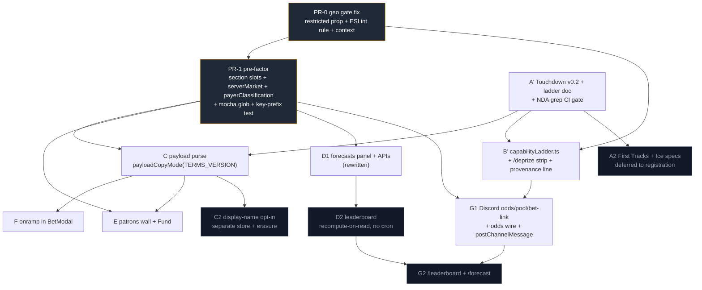

# Cross-PR architecture and sequencing review — DePrize capability-ladder program (8 PRs)

| Field | Value |
|---|---|
| **Lens** | Cross-PR architecture, coupling, sequencing. **Not** a per-PR critique — [`pr-design-docs-review.md`](pr-design-docs-review.md), [`pr-design-docs-eng-critique-a-b.md`](pr-design-docs-eng-critique-a-b.md), [`pr-design-docs-eng-critique-c-d.md`](pr-design-docs-eng-critique-c-d.md) and [`pr-design-docs-ux-critique.md`](pr-design-docs-ux-critique.md) already did that, and their findings are taken as given here. |
| **Subjects** | PR-0, A, B, C, D, E, F, G plus a proposed pre-factor PR-1 |
| **Date** | 2026-09-16 |
| **Did not** | Write product code, commit, or edit any file other than this one |

**Headline.** The program's real problem is not in any single PR. It is that six of the eight PRs
converge on one 1,000-line file, two of them create the same new module, and the one PR that fixes a
live defect (PR-0) produces a signal three others must consume but nothing mechanically forces them
to. Sequencing alone does not solve that; a mechanical pre-factor PR does, and it is cheap because
its acceptance criterion is an empty rendered diff.

---

## 1. Conflict matrix

Line numbers for `[id].tsx` are from the current file (render block 587–930).

| File | PRs touching it | Conflicting pairs and why |
|---|---|---|
| `ui/pages/deprize/[id].tsx` | **PR-0, B, C, D, E, F** (six) | **PR-0 × D** — same lines. PR-0 rewrites the region-notice condition at 815–819 (`restricted` replaces `region.isRestricted \|\| (!isLoading && !isError && !country)`); PR-D amends that sentence's copy ([`pr-d-forecasts.md`](pr-d-forecasts.md) step 7). Guaranteed textual conflict; PR-0 owns the block and D's step is struck. **PR-0 × F** — PR-0 changes the semantics of the `?outcome=N` deep-link handler (411) by re-keying it on `restricted`; F adds `?onrampSuccess`/`outcome`/`amount` parsing and an auto-reopen in the same effect. Semantic, not just textual: if F's reopen is not keyed off the corrected value, a US visitor returning from the onramp gets the exact modal PR-0 exists to withhold. **C × E** — both edit the header stat grid (623–669). C rewrites the `Stat label="Prize pool · to winner"` node at 624–627 plus its tooltip and adds an explainer beside it; E adds a Fund-the-prize CTA adjacent to the same node. Same JSX subtree. **D × E** — after the UX critique's reorder both insert at the same anchor: the point where the Competitors block closes (813). D's `ForecastPanel` is slot #7, E's patrons wall slot #8. **B × D × E** — the UX order moves B's ladder to the provenance footer (852+) and collapses C's explainer + E's patrons into one "Prize pool" section, so the 813–852 range becomes a three-way insert zone rather than three independent ones. **All six** — every PR edits the component signature region or the flat `
` child list; whichever merges last re-anchors by hand with no test that the composed page is still coherent. |
| `ui/components/deprize/BetModal.tsx` | **C, F** (+ PR-0 adjacency) | **C × F.** C adds a payload opt-in checkbox to the terms step and rewrites the "5% of every bet funds…" line; F replaces the dead-end copy at ~594–597 with an Add-funds CTA keyed off `insufficient` (~108). Both add component state (C: checkbox + `accept-terms` payload; F: onramp JWT + redirect/return state) and both edit the modal's lower body. Ordering is not symmetric: C's terms step is *upstream* of F's insufficient-funds branch, so C first means F re-finds one anchor, while F first means C's checkbox lands into a layout F just changed. Merge C before F. PR-0 touches no lines here but F's CTA visibility depends on the gates PR-0 re-conditions, so F must be verified against PR-0. |
| `ui/lib/deprize/competitions.ts` | **B** (as written), **A** (supersede runbook + atlas rebind), **G** (reads metadata for `/odds`) | **B × everything.** As written B adds `ladder?: DePrizeLadderMeta` to `DePrizeCompetition` and a `CAPABILITY_LADDER` constant to the 649-line chain-binding registry. Per [`pr-design-docs-eng-critique-a-b.md`](pr-design-docs-eng-critique-a-b.md) B-M2/B-M3, moving that into a new `ui/lib/deprize/capabilityLadder.ts`, dropping the `ladder?` field and keying rungs on `sharedGoalId` via the existing `findDePrizeIdForGoal` (~513) means **B stops editing `competitions.ts` at all except to import — B leaves the conflict set entirely.** Cheapest de-confliction in the program; adopt it. Residual: PR-A's nine-step supersede runbook mandates future `competitions.ts` lineage edits, and B-S3 moves the `atlas.dataset.json` + `criteriaNotes` edits out of B and into A — so that conflict moves from B×A to an A-side change, where it belongs (the atlas is Moon Base Zero seed data with a different owner). |
| `ui/const/config.ts` | **E** (reads `DEPRIZE_MINT_ADDRESSES`, `DEPRIZE_FEE_ROUTER_ADDRESSES`, `JBV5_TERMINAL_ADDRESS`), **G** (reads `DEPLOYED_ORIGIN`; adds Discord env plumbing), **D** (`FORECAST_SEASON`) | No two PRs edit the same DePrize constant, and E is read-only. The risk is external: **the file has 40 insertions / 26 deletions uncommitted** from the unrelated project-cycle workstream (lines ~758–830: `ProjectCyclePhase` gains `'intake'`, new `enforceSubmissionDeadline` field, budget changed from 5% of liquid non-MOONEY to 3% of AUM, `phase: 'senate'` → `'intake'`). Two consequences. (a) Any DePrize branch cut from this working tree silently carries those hunks into its PR. (b) When the project-cycle branch lands on `main`, every DePrize branch that touched `config.ts` rebases through a 66-line diff in a file that also holds contract addresses. Mitigation: cut all DePrize branches from a clean `main`, and keep **server-only** DePrize env reads out of `const/config.ts` entirely — read `process.env` in the API/cron module, exactly as `CRON_SECRET` already does. That removes D and G from this row. |
| `docs/DEPRIZE_JURISDICTIONAL_CONTROLS.md` | **PR-0, G** (+ **E** should) | **PR-0 × G.** PR-0 rewrites lines 43–46 so both rows describe the in-page banner plus a withheld Back CTA, and adds a quarterly-review item (72–84) that checks a `US` header against a live prize page. G mirrors this file's ops-table style into a new `docs/DEPRIZE_DISCORD_BOT.md` and, per the parent plan, adds its env vars to an ops table — if that lands *in* this file rather than G's own, it collides with PR-0's review-list edit. Rule: PR-0 owns 43–46 and the quarterly-review list; G appends only to `DEPRIZE_DISCORD_BOT.md`. **E should also edit it** — [`pr-design-docs-review.md`](pr-design-docs-review.md):216 requires a one-line product decision here ("Fund is geo-open until counsel says otherwise"), because direct `pay` is new money into the pool and this doc gates new participation. Land that after PR-0. |
| `ui/scripts/.mocharc-deprize-unit.json` | **D, G** (+ B, C, PR-0 tests already globbed) | **D × G on the same line.** The file is 14 lines with a two-element `spec` array. D appends `cypress/integration/lib/forecasts/*.cy.ts`; G appends `cypress/integration/lib/discord/*.cy.ts`. Both append to the same array element list — a guaranteed textual conflict, trivially resolved but it means whichever merges second has red CI (its new specs silently do not run) until rebased. B's `ladder.cy.ts`, C's `payload-purse.cy.ts` and PR-0's new spec all land under `lib/deprize/` and need no edit. Fix once: widen to `cypress/integration/lib/**/*.cy.ts` in the pre-factor PR. |
| `ui/lib/deprize/serverMarket.ts` | **D, G** — both **create** it | Add/add conflict, the worst kind: git cannot three-way-merge a file with no common ancestor, and the two intended shapes differ. D needs `resolved`, `payoutNumerators`, `payoutDenominator` and (per D-1) the block timestamp of the payout report. G needs per-outcome `calcMarginalPrice` plus pool size. Already flagged by `pr-design-docs-review.md`:69. Land it once, ahead of both. |
| `ui/components/deprize/DePrizeIndexContent.tsx` | **PR-0, B** | Direct overlap. PR-0 rewrites `bettingBlockedReason` (130–136) from `restricted`, drops the `useRegionRestriction` hook and deletes the now-dead "Checking your region…" branch. B anchors its four-rung strip "after the region notice and before search" — i.e. the gap between 127–135 and the search input at ~170, precisely the block PR-0 rewrites (B-S2). B must sequence after PR-0 and anchor to the search block, not the notice. |
| `ui/lib/deprize/constants.ts` | **C, E** | Small file, both edit. C makes `DEPRIZE_TERMS_VERSION` load-bearing (per C-1 the copy mode derives from it); E adds patron/terminal constants. Likely textual conflict, cheap to resolve, but note that C's change gives this file a new semantic role: it becomes the legal switch. E should not reorganize it. |
| `ui/components/deprize/LiveDePrizeHero.tsx`, `RaceMarketCard.tsx` | **C** only | No conflict — PR-0 explicitly needs no edits here because `bettingBlockedReason` already propagates. But both read that propagated value, so C's browser verification of restricted-state copy is only meaningful after PR-0. |
| `ui/lib/deprize/read.ts` | **G** (edits), **D** (consumes) | Low risk. Existing exports are `deprizeReadClient`, `deprizeReadChain(chainId)`, `rpcRead`. Both PRs should consume it via `serverMarket.ts` rather than edit it. |
| `ui/package.json` + `yarn.lock` | **G** only | G adds `discord:register` and a signature dependency (`tweetnacl` / `discord-interactions`). Only G, but a lockfile change is the churn every other branch pays on rebase — an argument for G merging last. |
| `ui/lib/deprize/lifecycle.ts` | **A** (referenced), **C** | Mentioned by both; C's is the only real edit. Watch, do not plan around. |

---

## 2. Shared-helper table

| Helper | PRs that need it | Recommended owner | What breaks if each PR writes its own |
|---|---|---|---|
| **Server-side market/payout read** — `ui/lib/deprize/serverMarket.ts`, built on the existing `lib/deprize/read.ts` (`deprizeReadClient`, `deprizeReadChain`, `rpcRead`) | **D** (`resolved`, `payoutNums`, `payoutDen`, block time of the report), **G** (`/odds`, `/pool`, odds-wire snapshot: per-outcome price + pool) | **PR-1** (pre-factor). If no pre-factor, **D**, with G importing it. | Add/add merge conflict, then two divergent price normalizations — the UX critique's risk #5 and D-7's "market row will not sum to 100 next to two rows that do." Worse, two different notions of "resolved": D must use `shouldSurfaceResolution`, G must not print odds for a settled market (the UX states matrix already records "`/odds` prints fiction"). D-1's post-resolution exploit window reappears in G's copy path if G derives resolution independently. |
| **Discord channel post callable from a cron** — new `ui/lib/discord/postChannelMessage.ts` | **G** (odds-wire cron); wanted by `lib/deprize/complianceAlerts.ts` and any future alerting | **G**, but as a server module | **The existing helper cannot be reused, and PR-G's plan says to reuse it.** `ui/lib/discord/sendDiscordMessage.tsx` is a browser helper: it `fetch`es the *relative* URL `/api/discord/send?type=networkNotifications`, so from a serverless cron it has no origin to resolve, and the channel is fixed by the `type` literal — there is no channel parameter for `DEPRIZE_ODDS_WIRE_CHANNEL_ID`. Left unfixed, G either inlines a `fetch` in the cron (hardcoded channel, no 429 handling, no retry) or discovers this at integration time. Build it server-side taking `(channelId, { content, embeds })` and calling Discord REST with `DISCORD_BOT_TOKEN` directly, not the internal API route. |
| **Protocol-payer / address classification** — new pure `ui/lib/deprize/payerClassification.ts` (`isProtocolPayer(address, chainSlug)`) | **E** (exclude bet slices where `from = DePrizeMint`, and fee-router flows, from the patrons wall), **compliance reconcile path** (`compliancePermit.ts`, `runReconcile.ts` classify the same addresses) | **E** (or PR-1), as a pure module with tests | Today `DEPRIZE_MINT_ADDRESSES` / `DEPRIZE_FEE_ROUTER_ADDRESSES` are read in 12 files with ad-hoc lowercase comparisons. One case-sensitivity or checksum slip turns every bet slice into a "patron" — the patrons wall silently becomes a public list of bettors, which is both wrong and a privacy surprise on a compliance-adjacent surface. E already plans the right test (a synthetic `from = mint` event); make the thing it tests reusable so the reconcile path's notion of "protocol address" cannot drift from the UI's. |
| **Redis domain-store factory** modeled on `complianceStore.ts` (`getComplianceRedis`, `execCompliancePipeline`, `scanComplianceKeys`) | **D** (`getForecastRedis`), **G** (odds-wire snapshot), **C2** (payload opt-in store per C-2) | **Do not factor it.** Own the *convention* in PR-1; keep the constructors duplicated per domain. | This is the one row where sharing is the wrong answer, and D-15 has the reason backwards as an apology instead of an argument. Duplicating the two-line Upstash constructor buys an **import-graph guarantee** that no forecast route can reach compliance code. A shared factory re-couples them and downgrades D-9's requirement ("`yarn export:deprize-compliance` must not pick up `forecast:*`") from a structural property to a runtime convention — and `scanComplianceKeys(match)` runs against the *same* Upstash instance that also holds `middleware/rateLimit` keys. What PR-1 should land instead: a key-prefix registry in the ops docs plus one test asserting the compliance export's scan pattern matches nothing outside `deprize:`. Then `getForecastRedis`, `getOddsWireRedis` and `getPayloadOptInRedis` are each two duplicated lines, deliberately. |
| **Jurisdiction-signal accessor** — `restricted` from `DePrizePageProps`, produced by `getDePrizePageEligibility` / `resolveDePrizePageProps` in `ui/lib/deprize/pageEligibility.ts`; plus a `useDePrizeRestricted()` context | **D** (banner copy — and must *not* gate the panel on it), **E** (Fund is geo-open by product decision, but that decision must be recorded against this signal, with the availability legend rendered), **F** (Add-funds CTA and `?onrampSuccess` reopen must be keyed off it), **B** (index strip anchoring) | **PR-0**, which ships the prop, the `useDePrizeRestricted()` context, the JSDoc warning on `useRegionRestriction`, and the required ESLint `no-restricted-imports` rule under `pages/deprize/**` + `components/deprize/**` + `ui/lib/deprize/**` (the context module itself carved out). All four are PR-0 deliverables; no other PR is a fallback owner for any of them. | The precise defect PR-0 exists to fix reappears in three new call sites, and it fails the same way: silently, for 52 jurisdictions, with no test that would catch it. Concretely: `region.isRestricted` is one import away and reads correct. Two additions to PR-0 make this mechanical rather than aspirational — the ESLint rule, and a `DePrizeRestrictionProvider` + `useDePrizeRestricted()` so five new components consume the signal without five separate edits to the prop-threading lines in `[id].tsx`. The second is a sequencing win, not a style preference: it converts five conflicting prop-list edits on one file into five independent hook calls. |
| **Capability-ladder module** — `ui/lib/deprize/capabilityLadder.ts` (`CAPABILITY_LADDER` keyed on `sharedGoalId`, pure `getLadderForCompetition`, ids derived via `findDePrizeIdForGoal`) | **B** (strip + provenance line), **G** (embed naming and spec links in Discord copy), **A** (its link-integrity CI gate asserts against these `specHref` values) | **B** | Without it, B's `deprizeIdByChain: { sepolia: 22 }` rots on the first supersede — PR-A's own nine-step runbook has no step that updates it, so the live page renders a ladder with no current rung and links rung 0 at a superseded market (B-M1). And G re-hardcodes rung names in Discord copy, so a rung rename ships half-applied. The eng critique is right that this module is the only part of PR-B unambiguously worth having today. |

---

## 3. Pre-factor PR recommendation: **yes** — insert PR-1, immediately *after* PR-0

### What PR-1 contains

**(a) Section slots in `ui/pages/deprize/[id].tsx`.** Extract the flat 340-line JSX child list (587–930) into named section components under a new `ui/components/deprize/detail/` folder, each taking props the page already computes:

`PrizeHeader` (588–696, including the pool `Stat` at 624–634) · `RegionBanner` (698–701 and 815–819, unified into one slot in the position PR-0 chose — above the market section) · `MarketErrorNotice` (703) · `PrizeQuestion` (705–710) · `PositionSection` (712–730) · `OddsSection` (732–749) · `CompetitorsSection` (751–813) · `ForecastSlot` (empty) · `PrizePoolSlot` (empty) · `ClaimSection` (821–834) · `AdminSection` (837–850) · `ProvenanceFooter` (852–930, where the ladder line lands).

The page then renders an explicit ordered list, in the final order from
[`pr-design-docs-ux-critique.md`](pr-design-docs-ux-critique.md) §6.3 — header · eligibility banner ·
question · position · odds · competitors · forecast · prize pool · claim · admin · provenance. The two
empty slots (`ForecastSlot`, `PrizePoolSlot`) render `null` in PR-1. A feature PR then adds **one file
and one line**, instead of editing the middle of a 1,000-line file. Landing the slots in the UX order
also means the reorder is decided once, here, rather than litigated inside five feature PRs that each
specified a different position for themselves.

**(b) Shared helpers, no behavior change.** `ui/lib/deprize/serverMarket.ts` (server market/payout read
over `read.ts`); pure `ui/lib/deprize/payerClassification.ts`; `.mocharc-deprize-unit.json` widened to
`cypress/integration/lib/**/*.cy.ts` (one edit, kills the D×G conflict permanently); and the Redis
key-prefix registry plus the compliance-export scan-boundary test.

**PR-1 does not land the `useDePrizeRestricted()` context, under any circumstance.** PR-0 owns and
ships it, together with the `restricted` prop and the required ESLint `no-restricted-imports` rule. For
PR-1 the context is a **hard precondition**, not a fallback deliverable: if PR-1 opens and the context is
not on `main`, the response is **stop and amend PR-0**, not absorb it here.

- *Recorded alternative, rejected:* the earlier wording in this section had PR-1 land the context "if
  PR-0 did not." Rejected because a fallback owner is exactly how a mechanical guarantee degrades back
  into a convention — with two possible owners, the accessor's owner is ambiguous at the moment D, E and
  F begin writing against it, and the cheapest path for whoever is under deadline is to re-derive the
  verdict from `useRegionRestriction` instead. Kept visible here so the option is not re-proposed.

### The case against

It is a large diff in a compliance-adjacent file that PRs #1579/#1581 just hardened, and it has zero
user-visible benefit — if the program slips, the repo carries the churn for nothing. PR-0 is *also*
rewriting `bettingAllowed` (375–384) and the notice condition (815) in that file, so PR-1 either blocks
the defect fix or rebases onto it. Component extraction can change React identity and remount behavior
if done carelessly, and pushing `bettingAllowed` consumers down into children risks widening a gate's
blast radius — the opposite of what a hardening surface wants. The five feature PRs still conflict on
the ordered `SECTIONS` list, just one line each. And two of the five (B, D) are being descoped or
rewritten anyway, which shrinks the payoff.

### The case for

Six PRs edit this file and two pairs edit the same JSX nodes (C×E in the header stat grid, D×E at the
Competitors boundary). The UX critique's finding #4 is the point: *"each PR reasonably claims its own
slot; nobody owns the sum."* No per-PR fix reaches that, and no merge order reaches it either — the
last two PRs to land still re-anchor by hand with no test that the composed page is coherent. A
refactor is also the *only* kind of change here verifiable to a very high standard, because the
expected diff in rendered output is empty. And it is what lets PR-0's corrected signal reach five
consumers through one accessor instead of five prop-list edits on the file everyone is fighting over.

### Recommendation

**Do it, as PR-1, after PR-0 — not before.** PR-0 is small, fixes a live disclosure defect, and its
diff must be readable line-by-line by the compliance owner; putting a 300-line extraction ahead of it
delays the fix and forces that reviewer to read a refactor. PR-1 rebases the extraction onto PR-0's
corrected conditions **and onto the `useDePrizeRestricted()` context PR-0 has already shipped**, so the
extraction's only consumer of the signal is correct before the first component moves.

### How PR-1 is verified behavior-preserving

1. **Rendered-HTML equality.** A Cypress component spec mounts `DePrizeDetailContent` against four
   fixed fixtures — open market, resolved market, `restricted={true}`, no wallet — and asserts
   `cy.get('main').invoke('html')` is byte-identical to a snapshot captured on the PR-0 commit. Four
   identical snapshots is the whole acceptance criterion.
2. **PR-0's required regressions re-run unchanged:** no "Back this team" with `restricted={true}`;
   amber banner present; `ClaimPanel` and `ExitPositionModal` still render and are enabled with
   `restricted={true}`; `?outcome=N` does not auto-open `BetModal` with `restricted={true}`.
3. **Move-only diff, asserted.** Lines removed from `[id].tsx` ≈ lines added across
   `components/deprize/detail/*`, and **no string literal is added or removed anywhere in the PR** — a
   grep over the diff for changed quoted text. Copy changes are out of scope for PR-1 by construction,
   which is what stops it absorbing PR-C's and PR-D's copy edits.
4. `yarn lint`, `yarn test:deprize`, `yarn test:cypress-unit` green **with no test edits** other than
   the new snapshot spec. Any existing test that needs touching is evidence the refactor changed
   behavior — treat it as a failure, not a fixup.
5. Manual: PR-0's three header-override cases (`US`, `DE`, header absent) on the preview deployment,
   with before/after screenshots on both `/deprize` and a live `/deprize/[id]`.

---

## 4. Recommended merge order

**PR-0 → PR-1 → A′ → C → F → E → B′ → D1 → G1 → (D2 → G2, A2, C2 as follow-ups)**

| # | PR | Why here |
|---|---|---|
| 1 | **PR-0** geo gate fix | The only PR fixing a live defect, the smallest diff, and it changes the gate conditions in `[id].tsx` and `DePrizeIndexContent.tsx` that four other PRs read. It also produces the `restricted` signal D/E/F must consume. Merging it late makes every other PR's "restricted region" browser verification meaningless (D-5). Everyone rebases onto it, never the reverse. |
| 2 | **PR-1** slots + shared helpers | Must land before the first feature PR inserts a section, or the extraction rebases through that insert. Depends on PR-0 only in that it must preserve PR-0's corrected conditions verbatim. |
| 3 | **A′** Touchdown v0.2 + ladder doc | Docs only, zero code conflicts. It is what makes B′'s spec link non-404 (B-S1) and gives C's Terms draft the canonical Test-4 wording so it is not hand-copied three times (A-S4). Also lands the NDA-grep CI gate (A-M2 gate 1), which needs to exist before B′ and G write any spec copy. |
| 4 | **C** payload purse (copy + `payloadPurse.ts`) | Owns the header pool `Stat` and defines the "Prize pool" slot that E later fills, so C must define the container. Its long pole is counsel, but with C-1's `payloadCopyMode(DEPRIZE_TERMS_VERSION)` the code merges in `'proposed'` mode **without** counsel — approval later is a one-constant edit, not a PR. That is what moves C from "blocked" to "early." Must precede F because both edit `BetModal.tsx` and C's terms step sits upstream of F's insufficient-funds branch. |
| 5 | **F** onramp | Depends on PR-0 (CTA and reopen keyed off `restricted`) and on C (BetModal layout). Otherwise the smallest and best-specified feature PR: one pure helper, clear acceptance. |
| 6 | **E** patrons + Fund | Depends on PR-1 (`payerClassification`, `PrizePoolSlot`) and C (slot container, plus the geo-open-Fund product decision recorded in `DEPRIZE_JURISDICTIONAL_CONTROLS.md`). Independent of D and G — it can be developed all the way through while C and F are in review. |
| 7 | **B′** `capabilityLadder.ts` + `/deprize` strip + one provenance line | Depends on A′ for a spec URL that resolves. Must follow PR-0 because the index strip's anchor is the block PR-0 rewrites (B-S2). Descoped: no detail-page stepper. |
| 8 | **D1** forecasts (panel + submit/mine/crowd) | Blocked on PR-0 (correct audience and banner), PR-1 (`serverMarket.ts`), and on its own design rewrite (D-1 block-time `resolvedAt`, D-3 accumulator, chain+env-namespaced season key, a stated sybil posture). Largest and least-specified PR in the program — it must not be the thing blocking anything else, which today it is, for G. |
| 9 | **G1** Discord `/odds` `/pool` `/bet`-link + odds wire + `postChannelMessage` | Needs `serverMarket.ts` (PR-1) and `capabilityLadder.ts` (B′) for embed copy. Adds `package.json` deps and a lockfile change — the churn you want last. No dependency on D. |
| — | **D2** leaderboard, **G2** `/leaderboard` + `/forecast`, **A2** First Tracks / Ice specs, **C2** display-name opt-in | Follow-ups, each gated on its own precondition (D2 on the rewritten data model; G2 on D2; A2 on a registered market or a committed registration date; C2 on a named moderator, a retention decision and an erasure path). |

### Can start now vs can merge now

- **Can start now**, against `main` plus PR-0's branch, with no shared-file contact: A′ (docs only);
  PR-1's helper half; C's Terms drafts and pure `payloadPurse.ts`; E's `patrons-math.ts` and
  `patrons-query.ts`; F's `onrampReturn.ts`; G's `verifyInteraction.ts` and `oddsWire.ts`; D's
  `brier.ts` and its design rewrite. **Every one of these is a pure module or a doc** — that is not a
  coincidence, it is the shape of work that parallelizes in this program.
- **Can merge now:** PR-0 only. Everything else is behind PR-0's conditions or PR-1's slots.
- **Truly parallel development:** A′ ∥ the pure-lib halves of C/D/E/F/G ∥ PR-1's helpers. The moment a
  PR touches `[id].tsx`, `BetModal.tsx`, `DePrizeIndexContent.tsx` or `.mocharc-deprize-unit.json`, it
  is sequential and should be treated as such rather than "parallel with conflicts."
- **Must be sequential in merge:** PR-0 → PR-1; C → F (BetModal); C → E (prize-pool slot); A′ → B′
  (spec URL); PR-1 → D1; D2 → G2 (leaderboard API).
- **Correction to the parent plan.** [`deprize_capability_ladder_rollout.md`](deprize_capability_ladder_rollout.md)
  states "A, D, E, F can start immediately in parallel; B and C after A." That is wrong in three ways
  now: PR-0 precedes everything; D cannot start as written and is the *last* feature PR, not among the
  first; and C is mergeable early rather than gated on A, once `payloadCopyMode` derives from
  `DEPRIZE_TERMS_VERSION`.

---

## 5. Scope changes

- **PR-A — split.** **A′** = Touchdown v0.2 addendum + `DEPRIZE_CAPABILITY_LADDER.md` (rung names,
  one-line bars, `PLANNED` status, **no rosters, no tests, no purse language** for rungs 1–3) + the GTM
  §0 pointer + three CI gates (NDA grep, markdown-link resolution, diff-path allowlist) + a per-file
  freeze table. **A2** = the full First Tracks and Ice specs, merged when the corresponding market is
  registered or a registration date is committed (A-S1). A′ additionally owns the *canonical* location
  of every quoted resolution sentence, so B/C/G reference rather than re-copy Test 4 (A-S4). A′ also
  absorbs the `criteriaNotes` and `atlas.dataset.json` edits currently in B (B-S3).
- **PR-B — descope hard; do not ship as written.** Keep `ui/lib/deprize/capabilityLadder.ts` with the
  supersede-survival and spec-file-exists tests. Ship the four-rung strip on `/deprize` only, planned
  rungs as plain text with a status chip, not links. On the detail page ship **one provenance line** in
  the footer slot, not a stepper. Defer the stepper until a second rung is a real market — it then has
  a reason to exist, and the `aria-current` question disappears with the step list.
- **PR-C — keep, revise, and split off the data.** Adopt `payloadCopyMode(DEPRIZE_TERMS_VERSION)`
  (C-1) so the PR merges in `'proposed'` mode without counsel. **Move the display-name opt-in to a
  separate PR-C2**: it needs its own key (`deprize:payload:optin:{wallet}`), a stated retention period,
  a delete path, an allowlist sanitizer over grapheme clusters, and a named human moderator at
  manifest-export time (C-2, C-5). Merging it inside C couples a copy change to a five-year-retention
  decision that has no owner. C may keep the consent *boolean* on `AcceptanceRecord`; the *name* waits.
- **PR-D — do not start as written; rewrite the design, then split.** **D1** = `brier.ts` (rank on a
  skill score against the 1/N baseline, not raw Brier), `serverMarket.ts` consumption, the store with
  D-6's split shape (`RPUSH` history + separate `latest`), `submit`/`mine`/`crowd`, and a
  `ForecastPanel` taking unnormalized weights with a uniform 1/N default. **D2** = leaderboard:
  per-user accumulator written idempotently per `(user, prize)`, season key namespaced by chain **and**
  environment, recompute-on-read with a content-addressed memo, a stated sybil posture and a
  minimum-3-scored-prizes floor. **Drop outright:** `ui/pages/api/cron/forecast-score.ts` and
  `.github/workflows/forecast-score.yml`. The eng critique's §4 is right that this is a pure function
  over immutable inputs plus a cache; deleting the writer-of-record removes D-2, D-10, D-11 and D-12
  wholesale. Add a warmer cron later only if a p95 measurement demands it.
- **PR-E — keep, two changes.** Fund CTA out of the header, text link only (UX must-fix 1, risk #3);
  patrons wall and payload explainer land together in C's single "Prize pool" slot. Keep the documented
  `MissionContributeModal` rejection. Record the geo-open-Fund product decision in
  `docs/DEPRIZE_JURISDICTIONAL_CONTROLS.md` in the same PR, after PR-0.
- **PR-F — keep as is, merge after C.** Add the missing designed state for partial onramp arrival (UX
  gap #4) and key both the CTA and the reopen off `restricted`.
- **PR-G — split.** **G1** = interactions endpoint, `verifyInteraction`, `/odds` `/pool` `/bet`-link,
  the server-side `postChannelMessage`, the odds-wire cron, `DEPRIZE_DISCORD_BOT.md`. **G2** =
  `/leaderboard` and `/forecast`, after D2. Fix two UX-matrix gaps in G1: `/odds` must not print
  fiction on a resolved prize, and the wire must stop posting on a resolved or superseded market.
- **Deferred or dropped, summarized:** `forecast-score` cron — **dropped**. Detail-page stepper —
  **deferred**. First Tracks / Ice full specs — **deferred to A2**. Display-name collection —
  **deferred to C2**. Nothing else should be cut; the remaining scope is proportionate.

---

## 6. Program-level risks, ranked

1. **PR-0's corrected signal gets re-derived instead of consumed, in three places at once.** D, E and F
   each independently decide what "restricted" means, and D additionally must *not* gate its panel on
   it. Nothing today prevents `useRegionRestriction` from reappearing under `components/deprize/**`,
   and it reads correct at the call site — that is exactly how the original defect shipped, silently,
   for 52 jurisdictions. *Mitigation:* PR-0 ships the ESLint `no-restricted-imports` rule and the
   `useDePrizeRestricted()` context; each of D/E/F carries one assertion (D: panel renders with
   `restricted={true}`; E: legend renders and Fund never calls `evaluateEligibility`; F: CTA and
   `?onrampSuccess` reopen both suppressed with `restricted={true}`).
2. **`ui/pages/deprize/[id].tsx` is a six-way merge point and nobody owns the resulting page.** Two
   pairs edit the same JSX nodes (C×E in the header stat grid at 623–669, D×E at the Competitors
   boundary at 813), and the UX critique's final order disagrees with the slot three of the PRs
   specified for themselves. Without PR-1 the last two PRs to merge each re-anchor by hand, and no test
   or reviewer ever looks at the composed page. *Mitigation:* PR-1's slots landed in the final order,
   plus a single composed-page screenshot review gate at the end of the program with the four fixture
   states.
3. **PR-D sits on PR-G's critical path while being the one PR rated "do not start as written."** The
   parent plan's `D → G` edge means a data-model rewrite in D stalls Discord entirely, and D is also
   the PR most likely to need a second design pass. *Mitigation:* the D1/D2 and G1/G2 splits above —
   G1 has no D dependency at all, and only `/leaderboard` waits on D2.
4. **Uncommitted `ui/const/config.ts` changes from the project-cycle workstream contaminate DePrize
   branches.** 40 insertions and 26 deletions are sitting in the working tree right now — a new
   `'intake'` phase, `enforceSubmissionDeadline`, a budget-basis change from 5% of liquid non-MOONEY to
   3% of AUM, and `phase` flipped from `'senate'` to `'intake'`. A branch cut from this tree carries
   them into a DePrize PR, where no DePrize reviewer will recognize them; and when project-cycle lands
   on `main`, every DePrize branch that touched `config.ts` rebases through that diff in the same file
   that holds contract addresses. *Mitigation:* cut every DePrize branch from a clean `main`; keep
   server-only DePrize env reads out of `const/config.ts` (read `process.env` in the API or cron module,
   as `CRON_SECRET` already does); and check that no DePrize PR diff includes the project-cycle hunks
   before review.
5. **Two PRs create the same new file and two append to the same 14-line JSON array, so the second to
   merge has red CI for reasons unrelated to its own change.** `serverMarket.ts` is an add/add conflict
   git cannot resolve, and the two intended shapes genuinely differ (D wants resolution and payout
   vectors, G wants prices and pool). `.mocharc-deprize-unit.json` is worse in one way: the second PR's
   new specs *silently do not run* rather than failing loudly. *Mitigation:* both land once in PR-1,
   with the mocha glob widened to `cypress/integration/lib/**/*.cy.ts` so no future PR touches that
   file again.

**Noted, below the top five:** the Test-4 sentence being hand-carried into three PRs (A-S4) — three
copies of a resolution criterion is how the prize page ends up disagreeing with the Terms; PR-G's plan
to post from a cron via `sendDiscordMessage`, which is a browser-only relative-URL helper and will fail
at integration time; and PR-C's counsel gate having a role rather than a person attached to it, which
is the program's longest pole and the only one no engineering decision can shorten.

---

## Revision log (2026-09-16)

1. **§3(b)'s PR-1 fallback for the `useDePrizeRestricted()` context is removed.** The section previously
   had PR-1 land the context "if PR-0 did not." PR-0 now owns and ships all of it — the `restricted`
   prop, the context, and the required ESLint `no-restricted-imports` rule — and for PR-1 the context is
   a **hard precondition** whose failure response is *stop and amend PR-0*, not absorb it.
   - **Rejected alternative, kept visible in §3(b):** the fallback wording itself. A fallback owner is
     how a mechanical guarantee degrades back into a convention — two possible owners means no owner at
     the moment D, E and F start writing against the accessor, and the cheapest path under deadline is
     re-deriving the verdict from `useRegionRestriction`.
   - Two other places in this file carried the same stale assignment and were corrected: §3's
     Recommendation, which called PR-1 "the natural moment to introduce the `restricted` context" (it
     now rebases onto the context PR-0 already shipped), and the §2 shared-helper row, where the ESLint
     rule was marked "(recommended)" rather than a required PR-0 deliverable.
2. **The §2 jurisdiction-signal row now states the lint rule's full scope:** `pages/deprize/**` +
   `components/deprize/**` + `ui/lib/deprize/**`, with `ui/lib/deprize/deprizeRestrictedContext.tsx`
   carved out. The third glob closes a laundering path — a helper under `ui/lib/deprize/` importing the
   EU flag and re-exporting a wrong verdict into DePrize components. Owned by
   [`pr-0-geo-gate-fix.md`](pr-0-geo-gate-fix.md) and recorded in
   [`deprize-engineering-constraints.md`](deprize-engineering-constraints.md) C11.
3. **The stale prime-marked `D` label — `D` written with a prime, as `A′` and `B′` still are — was
   replaced with `D1`,** the label every other doc in the program uses, in all three places it appeared:
   the §4 merge-order string, the §4 row-8 heading (previously a hybrid naming both forms), and the
   "must be sequential in merge" dependency line after `PR-1 →`. Sequences and positions are unchanged —
   this was a labelling fix only, and this file was the last doc carrying the old label, which now
   appears nowhere in it.
