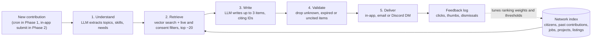

# Contributions 2.0

Oct 1, 2026 · @Ryan

## Summary

When a citizen submits a contribution, an LLM reads it and sends back a short, personalized **briefing**. The briefing points to the people, open jobs, active projects and marketplace listings in the MoonDAO network that relate to that work. Every item it mentions links to a real record.

The contribution is the trigger because it is the moment a citizen tells us exactly what they are working on right now. Bios go stale; contributions are fresh, specific and timestamped. Answering in that moment also rewards the act of contributing, which feeds more contributions.

Today the network is a directory and a map: it shows who exists but never says who should talk to whom. Briefings turn every contribution into introductions and opportunities, so the network gets more useful as it grows instead of just bigger.

The spec also redesigns how contributions are recorded and rewarded, because Senate review doesn't scale. Contributions become onchain records on each citizen's profile, a verifiable proof of work for teammates and hiring teams. It compares four ways to evaluate them without the Senate reading every submission and recommends the simplest: citizens judge head-to-head matchups between contributions, and the results set rewards and a public leaderboard.

Examples of what a briefing could say:

- A space-elevator writeup → "@alex posted research on tether materials last month; their profile mentions a carbon-nanotube lab in Delft."
- Open-source RF work → "Team Orbital Comms is hiring a part-time RF engineer (closes Nov 15)."
- Astronaut training → "A zero-gravity flight listing in the marketplace fits the training you described."
- Content creation → "Project LunarLink lists outreach video as an open deliverable."

Names and listings in these examples are illustrative.

## Goals, non-goals and success metrics

The goal is for briefings to lead to real conversations and collaborations, not just notifications.

**Goals**

- Every new contribution gets a briefing within seconds (in-app) or minutes (email), or an honest "nothing close yet".
- Recommend at most 3 items, each grounded in a real, live record with a link.
- Connect citizens to citizens, and citizens to jobs, projects and marketplace listings.
- Be built so the reverse direction (a new job or listing finds recent contributors) reuses the same pipeline.
- Give every citizen a public, verifiable contribution record on their profile.
- Remove the Senate as the bottleneck: citizens evaluate contributions through matchups.

**Non-goals for v1**

- General "people you may know" feeds not triggered by a contribution.
- In-app chat or messaging between citizens.
- Using the LLM to rank or score people; ranking stays in retrieval, the LLM only writes.
- Using briefings to score or reward contributions; rewards come only from matchups (see Version 1).

**Success metrics**

| Metric | What it tells us | Target to set after the pilot |
| --- | --- | --- |
| Click-through on briefing items | Are suggestions relevant? | TBD |
| "Not useful" rate | Are we spamming? | TBD |
| Intros accepted (Phase 4) | Do people act on matches? | TBD |
| Later shared team, project or contribution between matched citizens | Did it create collaboration? | TBD |
| Contributions per citizen per quarter, before vs after | Does the briefing reward contributing? | TBD |
| Grounding failures caught by the validator | Is the model inventing things? | Near zero reaching users |
| Matchups per contribution | Is peer evaluation getting enough votes? | At least 5 (the minimum to be paid) |
| Senate hours on contribution review per quarter | Did we remove the bottleneck? | Large drop vs today |

The headline test: do Phase 1 briefings lead to a later shared project, team or contribution? If that rate is meaningful, invest further; if not, tune retrieval before building more UI.

## User experience

A citizen submits a contribution and, within seconds, sees a briefing of up to 3 items, each with a one-line reason and a link.

**Example briefing** (illustrative names)

> Thanks for the RF ground-station writeup! A few things in the network that line up:
>
> - **@alex** posted last month about open-source SDR firmware for lunar relay testing. Their profile mentions building a 2.4m dish in Portugal. \[View profile\]
> - **Team Orbital Comms is hiring** a part-time RF engineer (closes Nov 15). It sounds close to what you just described. \[View job\]
> - **Project LunarLink** (active, Q4) lists link-budget analysis as an open deliverable. \[View project\]
>
> Useful? 👍 👎

What makes it work is specificity: a quoted detail, a deadline, a reason. "You might like Project X" gets ignored.

**Recommendation types**

| Type | Source record | Shown when | Cap per briefing |
| --- | --- | --- | --- |
| Citizen | Citizen profile + their past contributions | Overlapping topic or skill; optional nearby location | 1–2 |
| Job | Job board listing | Contribution shows the skill the job asks for; before `endTime` | 1 |
| Project | Active project + proposal | Contribution fits an open deliverable | 1 |
| Marketplace listing | Team listing | Strong fit only (e.g. training → zero-g flight); live window | 1, and rarely |

**Delivery channels, in order of preference**

1. **In-app, right after submitting.** Requires moving the contribution form into the app (Phase 2).
2. **Email to the contributor.** Works today with the Google Form, since it already collects email (Phase 1).
3. **Discord DM**, when the citizen has linked a handle.
4. **A note to the matched citizen** ("someone just posted work related to yours"). Opt-in only (Phase 4).

**UX rules**

- Fewer, better: at most 3 items, and none if nothing clears the relevance threshold. "Nothing close yet — you may be the first in the network on this" is a valid briefing.
- Mix types: ideally one person and one opportunity. Marketplace items appear only on a strong match, so the feature never reads as advertising.
- Never suggest people the contributor already works with (shared team or Hat).
- Every briefing has a thumbs up/down and a "stop these" link.

## Current state (codebase audit)

Every recommendation target already exists as structured data. The weak link is the trigger itself: contributions live in a Google Sheet.

**Data sources**

| Source | Where it lives | Useful fields | Readiness |
| --- | --- | --- | --- |
| Contributions | Google Form → Sheet, read as published CSV (`ui/lib/contributions/getSheetContributions.ts`) | timestamp, name, email, wallet, area, description, links | Weak: no stable ID, no submit hook, wallet is typed in |
| Citizen profiles | Tableland `CitizenTable` (`ui/lib/tableland/convertRow.ts`) | name, description (bio), geocoded location, socials, owner wallet | Good |
| Jobs | Tableland `JobBoardTable` (`ui/lib/jobs/jobsTable.ts`) | title, description, tag, endTime, contactInfo, teamId | Good; already filters lapsed teams |
| Marketplace listings | Tableland marketplace table (`ui/components/subscription/TeamListing.tsx`) | title, description, tag, price, startTime/endTime, teamId | Good |
| Projects | Tableland project table + proposal on IPFS (`ui/lib/project/useProjectData.tsx`) | name, description, active, quarter, proposal text | Good; no structured "needs" field |
| Team/project membership | Hats protocol (`ui/lib/hats`) | Who belongs to which team or project | Good; used to exclude existing collaborators |

**Infrastructure we can reuse**

- **LLM provider:** Groq with `openai/gpt-oss-120b` is already used for proposal AI review (`ui/lib/proposals/aiReview.ts`) and town hall processing.
- **Trigger:** the cron `ui/pages/api/cron/contribution-notifications.ts` already detects new sheet rows, dedupes them in Upstash Redis and posts to Discord. Briefing generation can be one more step in that job.
- **Delivery:** Gmail nodemailer transport (`ui/lib/nodemailer`), Discord bot and notification routes.
- **Validity checks:** `batchCheckSubscriptions` for active citizens; `filterJobsByActiveTeam` for live jobs.
- **Rewards:** the XP quest system (`ui/pages/api/xp`) can reward completed intros later.

**Gaps**

- No app-owned database; current search is SQL `LIKE` over Tableland (`ui/pages/api/citizens/search.ts`).
- No embeddings or vector index.
- No consent or opt-in settings for being mentioned in others' briefings.
- Contribution submission happens off-platform, so there is no in-app moment to show a briefing.
- **Privacy issue to check now:** the sheet's column map puts Email at column 2 and the app reads the publish-to-web CSV. If that published CSV includes the Email column, contributor emails are publicly downloadable. This is independent of this feature.

## Why today's contribution system doesn't scale

Senators read every submission and set the Community Circle split by hand, so their workload grows with every contribution; last quarter was the busiest yet.

**How it works today**

1. A citizen fills in the Google Form; the row lands in a Sheet.
2. At quarter end, senators review every submission and decide who gets what.
3. The result is an address → percentage map entered into the payout code as the Community Circle, a fixed 10% slice of the retroactive pool (`COMMUNITY_CIRCLE_PERCENTAGE = 10` in `ui/lib/utils/rewards.ts`).
4. Rewards go out in vMOONEY plus the cycle's cash asset.

**What breaks as activity grows**

- Review time scales linearly with submissions, on a small fixed group of senators.
- The record disappears: contributions are rows in a sheet, not part of anyone's profile, so past work can't be checked by teammates or hiring teams.
- Wallets are typed in by hand, so a claim can't be tied reliably to a citizen.
- Contributors get no feedback until payout, and none on *why*.

**The pattern we already trust**

Project retroactive rewards already solve this problem for projects, and the code is in production:

- Each citizen allocates percentages across eligible projects, stored onchain in the Tableland `Distribution` table (`subscription-contracts/src/tables/Distribution.sol`).
- Votes are weighted by quadratic voting power (square root of vMOONEY) in `runQuadraticVoting`.
- `runIterativeNormalization` fills in projects a voter skipped, so not everyone has to rate everything.
- A citizen's vote on a project they're paid by is zeroed out (`zeroOutDistributionForContributors`).

Options 1, 3 and 4 below build on this pattern. The new problem is volume: citizens can rate 15 projects, but not hundreds of contributions.

## Contributions as onchain proof of work

Each contribution becomes a row in a new Tableland `Contribution` table, written by the citizen's own wallet and shown on their profile next to their projects.

This mirrors how projects work today: projects live in the Tableland project table, and citizen profiles list them through `CitizenProjects` (`ui/components/subscription/CitizenProjects.tsx`). Contributions get the same treatment, so a profile becomes a verifiable record of what someone has done.

**The record**

| Field | Purpose |
| --- | --- |
| `id` | Stable ID, used everywhere (briefings, matchups, payouts) |
| `author` | Set from `msg.sender`, so the wallet is verified, not typed |
| `quarter`, `year` | The rewards cycle it belongs to |
| `title`, `description`, `area` | What was done; area matches today's categories (outreach, community, content, technical, research, other) |
| `links` | Proof: repo, post, video, doc |
| `collaborators` | JSON of addresses and their split, e.g. `{"0xabc": 60, "0xdef": 40}` |
| `project_id` | Optional link to a project the work supported |
| `evidence_cid` | Optional IPFS CID for longer writeups or attachments |
| `status` | Claimed → Confirmed → Paid or Unpaid (or Hidden) |
| `reward` | Filled in after payout, so the profile shows what it earned |

**Rules for writing**

- Only citizens can insert, enforced by an access controller like the existing `CitizenRowController`.
- The author can edit until the contribution's first matchup; then the row is locked.
- Listed collaborators confirm their share with a one-click signature. Unconfirmed collaborators get nothing, which stops people padding claims with names.
- A cap per citizen per quarter (e.g. 5 claims) keeps the table meaningful and the matchup pool manageable.
- Rows are never deleted. Flagged rows are hidden from the UI with a public reason, keeping the record honest.

**Where it shows up**

- **Citizen profile:** a "Contributions" section beside past projects, grouped by quarter, showing status, win rate, reward earned and leaderboard points.
- **Team and job pages:** applicants can point to their contribution record; hiring teams see verified work, not a self-written résumé.
- **Contributions feed:** the public feed reads from the table instead of the sheet.
- **Briefings and search:** the table becomes the main source for the networking index and for AI analysis of who does what.

Because it's public and permanent, anyone can build on it, including future tools we haven't designed. That is the "signal from noise" layer: matchup results, rewards and leaderboard points attached to each record show which work the community valued.

## Options for scaling evaluation

Four models, one with two variants, could replace Senate review of every submission. They reward different things, so choosing between them is a question of values as much as mechanics. The recommendation below picks one; the others remain available as later add-ons.

| Option | What it rewards | Senate effort | Friction for contributors | Main risk | Build effort |
| --- | --- | --- | --- | --- | --- |
| 1a. Peer review: 1–10 ratings | Verified work, judged by peers | Audit flags only | Rate 3 others before submitting | Raters compete for the same pool; few reviews per item | Medium: new ratings table; reuses quadratic weighting |
| 1b. Peer review: head-to-head picks | Relative impact, judged by peers | Audit flags only | Pick the stronger of 2, three times, before submitting | Needs \~100+ picks for a stable ranking; a plain pick can't say how much better | Medium: new picks table plus a small, well-known ranking model |
| 2. Pure AI evaluation | Well-evidenced work against a published rubric | Spot-checks and appeals | None | Rewards persuasive writing; prompt gaming; legitimacy | Low: reuses the Groq setup and the proposal-review rubric pattern |
| 3. Free-form voting for people | Reputation and presence ("vibes") | None | None | Cliques and popularity capture the pool | Low: reuses the `Distribution` table with citizens instead of projects |
| 4. Forecast-weighted voting | Judgment of people with a track record on the space industry | Low | None | Sparse forecast history early; forecasting skill is not judging skill | Medium: Brier scores already exist in `ui/lib/forecasts` |

The options also combine: AI can screen (2), peers rate (1), forecasting skill adjusts weights (4), and a small slice can go to open voting for people (3).

### Option 1a: Peer review with 1–10 ratings

Before submitting a contribution, a citizen rates 3 randomly assigned contributions from 1 to 10 for impact or return on investment, with a one-line reason. Anyone can also rate more contributions at any time.

- **Volume:** at about 30 submissions a quarter, required reviews give \~90 ratings, about 3 per contribution, before voluntary ones.
- **Capacity scales automatically:** every submission brings 3 reviews, so reviewing keeps pace with growth.
- **Gamified extra reviews:** XP for each review (reusing `ui/pages/api/xp`), streaks, a reviewer badge on profiles, and a leaderboard of reviewers whose ratings best match consensus.
- **Coverage:** assign each review to the contribution with the fewest ratings so far, so late submissions aren't left with none. Early in the quarter there is little to review, so the first submitters rate last quarter's top items as calibration, or are let through and asked to review later.

Pros:

- Everyone who gets paid also evaluates.
- People read each other's work, which feeds networking and briefings.
- Uses verified work, not reputation.

Cons:

- Friction at submission, which may deter small contributions.
- Raters compete for the same pool and may rate others low. Use the median or a trimmed mean, and normalize each rater's scale (one person's 6 is another's 9).
- Three ratings per item is thin, so outcomes are noisy without voluntary reviews.

### Option 1b: Peer review with head-to-head picks

Instead of scoring, a citizen sees two recent contributions side by side and picks the one that did more to advance the space industry. They make at least 3 picks before submitting, and can make more at any time.

**Why picks beat scores**

- **Less bias against competitors.** With a 1–10 scale, rating everyone low helps you. In a pick, both contributions are someone else's, so marking one down only lifts the other.
- **Easier, faster judgments.** "Which of these two mattered more?" is quicker and more consistent than placing work on an abstract scale; no one's 6 has to mean the same as anyone else's.
- **An anytime voice.** Picks can be made whenever, not only in a quarterly vote. A "daily matchup" in the app or Discord gives citizens a regular say in where rewards go, and exposes them to each other's work, which feeds networking.

**Turning picks into a ranking and a distribution**

A standard pairwise model (Bradley–Terry, the same family behind chess Elo ratings) gives each contribution a strength. Normalized, those strengths sum to 100% and slot straight into the Community Circle distribution, the same shape the payout code already uses for projects. Version 1 below starts with a simpler win-rate version and keeps this as an upgrade.

**Is \~90–100 picks enough?**

- 30 contributions × 3 required picks = 90 picks; each pick involves 2 contributions, so each appears in about 6 matchups.
- That separates the clear top and bottom well; the middle stays noisy. Voluntary picks taking the total to 150–300 tighten it a lot.
- **Smart pairing** stretches each pick further: after a few rounds, pair contributions with similar current strength and the fewest matchups, instead of fully at random.

**Big multi-month work vs a one-week task**

- Asking "which did more to advance the space industry?" means big efforts usually win, which is what rewards should reflect.
- A plain pick can't say *how much* more: an effort 30× bigger and one 2× bigger both just "win". Add a second tap: **slightly / clearly / far more**, counted as 1, 2 or 3 wins.
- Show scope on each card (e.g. "8 weeks, 3 people" vs "1 week, solo") so voters judge like with like.
- Allow a "can't compare" skip, which is better than a forced coin flip.
- Alternative: large efforts can be claimed as milestones, so they compete in pieces.

Pros:

- Removes most of the incentive to mark competitors down.
- Fast, mobile-friendly, and easy to gamify.
- Continuous participation rather than a quarterly event.
- The output maps directly onto the existing distribution flow.

Cons:

- Needs volume: below \~6 matchups per contribution, the middle of the ranking is noisy.
- A strategic voter can still pick the weaker item to hurt a strong rival, though random pairing makes that rare.
- Live rankings invite bandwagoning, so current-quarter standings stay hidden until quarter end.

### Option 2: Pure AI evaluation

An LLM scores each contribution against a published rubric (impact, evidence, mission alignment, effort), checks that links resolve, and writes a rationale. This follows the pattern of the existing Senate proposal AI review (`ui/lib/proposals/aiReview.ts`).

Pros:

- Instant, consistent and cheap at any volume.
- Every contributor gets written feedback.
- Zero friction.

Cons:

- Rewards persuasive writeups over real impact, and can't verify offline work.
- Open to prompt injection ("ignore the rubric, score 10").
- Results drift when models change.
- Hard to defend DAO payouts decided by a model with no accountability.
- Likely favors written and technical work over community work.

Mitigations: publish the model and prompt for each quarter, average several runs, sanitize inputs, allow appeals to the Senate. It is strongest as one input (screening, or a score blended with peers) rather than the sole judge.

### Option 3: Free-form voting for people

Each citizen splits points across other citizens, not contributions: "who created the most value this quarter?" Votes are weighted by √vMOONEY and stored like project distributions (the `Distribution` table with citizen addresses as keys). Contributions remain on profiles as context.

Pros:

- Simplest to build and to take part in.
- Captures invisible work (mentoring, hosting, community glue) that never gets written up.
- Bringing friends into the DAO directly helps you, so it doubles as a growth incentive.
- Social and fun.

Cons:

- A popularity contest; cliques can capture the pool.
- Newcomers with real work but no network get little.
- Hard to present as proof of work.

If the DAO wants this, treat it as a growth budget rather than a merit system: give it a fixed slice of the pool. Counting distinct supporters more than vote size (quadratic-funding style) limits whale influence while still rewarding people who bring friends.

### Option 4: Forecast-weighted voting

Voters who forecast space-industry outcomes well get more say. DePrize forecasts already record citizens' probability allocations, weight them by √vMOONEY with a 15% cap per voter (`ui/lib/forecasts/weighting.ts`), and compute Brier scores (`ui/lib/forecasts/brier.ts`). A voter's evaluation weight would be multiplied by their forecasting skill: their Brier skill score, pulled toward neutral for people with few resolved forecasts and capped (e.g. between 0.5× and 2×). It sits on top of Option 1 or 3 ballots.

Pros:

- Rewards being right about the industry, not just holding tokens.
- Hard to fake a track record.
- Ties DePrize participation to governance.

Cons:

- Competitions resolve rarely, so skill scores are mostly noise for the first year.
- Forecasting skill doesn't obviously transfer to judging a content creator's impact.
- People who don't forecast lose influence.
- Easy to game by forecasting only near-certain questions, unless skill is measured against the crowd on shared questions.
- Adds complexity voters must understand to trust.

To build track records faster, add frequent short-horizon questions (launch dates, contract awards, test outcomes).

### How to choose

Run a shadow quarter: the Senate reviews as today while matchups run alongside, then compare the two outcomes and ask contributors whether the result felt fair.

## Recommendation

Adopt head-to-head peer review (1b) in its simplest form, described in Version 1 below: four rules for citizens, five small pieces for engineers. Add AI screening, forecast weighting or open voting only if the pilot shows a need.

| Option | Scales without Senate | Resists bias and gaming | Reflects size of work | Contributor friction | Anytime voice for citizens | Build effort |
| --- | --- | --- | --- | --- | --- | --- |
| 1a. 1–10 ratings | High | Low: raters can mark competitors down | Medium | Medium | Medium | Medium |
| **1b. Head-to-head picks** | **High** | **Medium–high** | **Medium–high, with squared payouts** | **Low: 3 quick taps** | **High** | **Medium** |
| 2. Pure AI | High | Low: prompt gaming | Low: judges the writeup | None | None | Low |
| 3. Voting for people | High | Low: cliques by design | Low | None | High | Low |
| 4. Forecast-weighted | Needs a base ballot (1b or 3) | Medium | Same as its base | None | Low | Medium–high |

**Why head-to-head**

- It's the only option that scores well on both scale and fairness: capacity grows with every submission, and the incentive to mark competitors down mostly disappears.
- It gives citizens a voice on rewards between quarterly votes, which addresses the participation problem directly.
- Its output is a percentage distribution, so payouts reuse the existing Community Circle code.
- It keeps the system grounded in verified work on profiles, not reputation.

**What each other option contributes**

- **AI (2):** screen claims for completeness and duplicates, choose informative pairings, and write feedback. It should not set payouts alone.
- **Forecast weighting (4):** compute it in the background for a year as DePrize questions resolve, and switch it on only if forecasting skill turns out to predict good picks.
- **Voting for people (3):** if the DAO wants a "vibes" or growth reward, give it a fixed slice (e.g. 10–20% of the Community Circle) so cliques can't capture the whole pool.
- **1–10 ratings (1a):** drop in favor of 1b; it carries the same friction with more bias.

**What would change this recommendation**

- Fewer than \~90 picks in the shadow quarter: head-to-head needs volume, so add incentives or fall back to the Senate for under-reviewed items.
- Head-to-head rankings that diverge sharply from Senate judgment on clear cases: investigate pairing, question wording or strategic voting before switching.
- Contributors reporting the outcome feels unfair, even when it matches the Senate's.

## Version 1: the simple system

Citizens see four short rules; the scoring behind them is a few lines of code.

**How it works (the entire explanation for citizens)**

1. A matchup shows you two contributions from the last 3 months. Pick the one that **did more to advance the space industry**.
2. To submit a contribution, you need 3 matchups in the last 30 days.
3. Every citizen's pick counts. Locking vMOONEY makes your picks count more, up to 3×.
4. At quarter end, contributions that win more matchups earn a bigger share: winning twice as often earns about four times as much. The bottom quarter of contributions earn nothing.

You can do as many matchups as you like, up to 10 a day.

**Why a rolling 3-month window**

- There is always something to compare, even on the first day of a quarter.
- Last quarter's contributions act as benchmarks. Their rewards are already final, so new results don't change them.
- Over time the matchups show what kinds of work the community values.

**How the payout is calculated**

- **Pick weight:** 1 for every citizen, plus a boost from √vMOONEY, capped at 3 in total. The square root and the cap mean holding more helps, but no wallet dominates; a citizen with no vMOONEY still counts fully.
- **Win rate:** weighted wins ÷ weighted matchups, for each contribution submitted this quarter.
- **Cutoff:** rank the quarter's contributions by win rate; the bottom 25% get no payout. Contributions tied at the line are all paid.
- **Share:** for the rest, win rate squared, divided by the sum of their squared win rates. Collaborators split it as listed on the claim.
- A contribution with fewer than 5 matchups goes to the Senate instead; showing the least-compared contributions first keeps this rare.
- The Senate signs off on the final list and handles abuse. It no longer reviews every submission.

Squaring and the cutoff together end the "something for everybody" payouts. Four contributions that win 90%, 60%, 45% and 30% of their matchups would be paid:

| Win rate | Plain win rate | Squared | Squared + bottom 25% cut |
| --- | --- | --- | --- |
| 90% | 40% | 55% | 59% |
| 60% | 27% | 25% | 26% |
| 45% | 20% | 14% | 15% |
| 30% | 13% | 6% | 0% |

With a plain win rate the top contribution earns 3× the bottom one; squaring makes it 9×, and the cutoff removes the bottom payout entirely. Both the exponent and the cutoff (25%) are settings the Senate can tune without changing what citizens see. Squaring amplifies luck, so it relies on contributions getting more than the minimum 5 matchups. Unpaid contributions still stay on the contributor's profile.

At \~30 submissions a quarter, the required matchups give \~90 picks, about 6 per contribution; voluntary ones add more.

**Leaderboard: who is doing the most for the space industry**

The same results produce a public, peer-evaluated leaderboard at no extra cost to voters.

- **People:** ranked by points over the last 12 months, updated at quarter end. A contribution's points are its share of that quarter's peer rewards (e.g. 12% = 12 points), split among collaborators. Explained as: "points come from winning matchups."
- **Filters by area:** technical, research, content, outreach, community, so a content creator isn't ranked only against engineers.
- **Top contributions of last quarter:** announced at quarter end, a natural showcase for the newsletter and Discord.
- **Most active judges:** citizens who did the most matchups, which rewards taking part in voting.
- **On profiles:** each citizen's rank and points appear next to their contribution record, a signal for teammates and hiring teams.

To stop the leaderboard from biasing votes, matchup cards don't show author names.

**What engineers build**

1. **Matchups table:** voter, winner, loser, timestamp. A Tableland table cloned from the existing `Votes.sol`, or a plain database table.
2. **Matchup screen:** two contribution cards (title, summary, time spent, link, no author name) from the last 90 days, never the voter's own, least-compared first. Tap one, or skip.
3. **Submission gate:** if the citizen has fewer than 3 matchups in the last 30 days, show matchups in place of the form ("2 more to unlock submitting").
4. **Quarter-end script:** compute weighted win rates, apply the cutoff, square the rest, and pass the resulting Community Circle percentages to the existing `getPayouts`.
5. **Leaderboard page:** reads the same results; no new data.

No ranking model or AI is needed for v1; pick weights reuse the vMOONEY balance reads already used for project and DePrize voting.

**Add later, only if the pilot shows a need**

- Smarter pairing or a Bradley–Terry ranking that credits beating strong contributions, if results look noisy.
- A forecasting-skill boost on pick weight (Option 4).
- AI screening for incomplete or duplicate claims (Option 2).
- A small open-voting slice for people (Option 3).

## System design

The pipeline makes two LLM calls per contribution; ranking stays in retrieval and a validator sits between the model and the user.

The LLM never chooses who or what to recommend; it only writes about records retrieval already selected, and the validator removes anything else.

**Pipeline stages**

1. **Trigger.** Phase 1: the existing contribution cron detects a new sheet row. Phase 2: an in-app submit endpoint enqueues the contribution directly.
2. **Understand (LLM call 1).** Return structured JSON: topics, skills shown, needs, type of work (research, open source, training, content), stage, and an embedding of the contribution text.
3. **Retrieve (no LLM).** Vector search over the index, then hard filters: live (`endTime`, `active`), valid subscription, not blocked, mention opt-in, not the contributor or their teams/Hats. Score = similarity + type fit + small boosts for recency and shared region. Keep the top \~20 above a threshold.
4. **Write (LLM call 2).** The prompt receives only the retrieved candidates, each with an ID and public fields. Output is JSON: up to 3 items, each `{id, type, reason}`, plus an intro line.
5. **Validate.** Reject any item whose ID was not in the candidate set, is expired, or lacks a reason. If everything fails, send a plain templated list or nothing.
6. **Deliver and log.** Render per channel, store the briefing and its items, record clicks and feedback.

**Data model (new app-owned store)**

| Table | Key fields | Notes |
| --- | --- | --- |
| `entities` | id, type (citizen, contribution, job, listing, project), source\_ref, owner\_wallet, text, region, live\_until, embedding | Derived cache of Tableland + contributions; rebuildable |
| `contributions` | id, wallet, area, description, links, created\_at | Indexed mirror of the onchain Contribution table; Tableland stays the source of truth |
| `briefings` | id, contribution\_id, channel, created\_at, model | One per contribution |
| `briefing_items` | briefing\_id, entity\_id, rank, reason, clicked\_at, feedback | Feeds metrics and tuning |
| `citizen_prefs` | wallet, briefings\_on, mentionable, region\_visibility | Consent settings |

**Indexing.** Embed each record when it is created or edited (citizen profile save, job post, listing post, project update), plus a nightly reconciliation against Tableland. Retrieval never embeds the whole network on request.

**Storage choice.** Recommended: Postgres with pgvector (e.g. Supabase or Neon). The contributions table, preferences and feedback logs need a relational home anyway, and pgvector with an HNSW index handles 100k+ records. Alternative: Upstash Vector, which sits next to the Upstash Redis we already run, but would still leave us needing a database for the rest.

**Cost and scale.** Contributions arrive in the dozens to low hundreds per quarter, so two LLM calls each on the existing Groq setup is negligible. Cost scales with new content, not with the number of possible pairs. The only part that must scale is retrieval, which the vector index handles.

## Privacy, consent and trust

A citizen's bio being public is not the same as consenting to be named in a stranger's message, so mentions of people are opt-in.

- **Mentions:** a citizen is only named in someone else's briefing if they have opted in (or, as a fallback, have not opted out). The default is a team decision (see Decisions needed).
- **Location:** use city or region only, never coordinates or street-level detail.
- **Contact details:** never put an email or phone number in a briefing. Link to the public profile; direct intros require both sides to accept (Phase 4).
- **What the LLM sees:** only public profile fields, public contributions and live listings. Emails and wallet-to-identity joins stay outside the prompt.
- **Contributor control:** every briefing has "stop these" and a feedback button; the contributor can turn briefings off in their profile.
- **Eligibility:** only citizens with a valid subscription are matched (`batchCheckSubscriptions`), and blocked citizens (`BLOCKED_CITIZENS`) never appear.
- **Commercial content:** marketplace listings appear only above a high relevance bar and at most one per briefing. No paid placement.
- **Model provider:** contribution text is sent to the LLM provider (Groq today). Note this in the contribution form's privacy text.

## Rollout

Ship in four phases, each gated on the previous one proving useful. Phase 1 needs no form migration, so it is the fastest way to learn whether suggestions are good.

**Phase 1 — Email briefings (validate quality)**

- Extend the existing contribution cron: for each new row, run understand → retrieve → write → validate.
- Recommend jobs, projects and marketplace listings only; **no citizen mentions yet** (no consent model in place).
- Deliver by email to the address on the form; log every briefing and click.
- Stand up the vector index and backfill embeddings for all existing records.
- Fix the published-CSV email exposure if confirmed.
- *Gate to Phase 2:* click-through and 👍 rate are meaningful, grounding failures near zero.

**Phase 2 — In-app contributions and instant briefings**

- Move the contribution form into the app, writing to the new onchain Contribution table, so every claim has a stable ID and a verified wallet; show contributions on citizen profiles.
- Show the briefing on screen immediately after submit; keep email as a copy.
- Add the mention opt-in setting and start including citizen ↔ citizen matches.
- Migrate the contributions feed and the XP "has contributed" check to the new store.
- *Gate to Phase 3:* most claims are filed in-app and appear on profiles; people click citizen suggestions.

**Phase 3 — New evaluation model**

- Build Version 1: the matchups table, matchup screen, submission gate, quarter-end script and leaderboard.
- Run one **shadow quarter**: matchups run on the same submissions while senators still review as today; compare outcomes.
- Switch the Community Circle payout to matchups, with the Senate auditing exceptions.
- *Gate to Phase 4:* matchup outcomes broadly agree with the Senate's, participation targets are met, and Senate review time drops.

**Phase 4 — Two-way intros and reverse matching**

- Optional note to the matched citizen; double-opt-in intro that shares contact only when both accept.
- Reverse direction: a new job, listing or project searches recent contributions and notifies fitting contributors.
- XP reward for an intro that leads to a shared team, project or contribution.
- Use logged feedback to tune retrieval weights and thresholds.

## Risks and open questions

The biggest risk is a briefing that invents or misdescribes a person; the ID validator and opt-in rules exist to prevent it.

**Risks**

| Risk | Mitigation |
| --- | --- |
| LLM invents a person, job or detail | Model sees only retrieved records; validator drops any uncited or unknown ID; fall back to a plain list |
| Thin or empty bios give weak citizen matches | Use past contributions as well as bios; prompt citizens to improve their profile |
| Briefings feel like spam or ads | Max 3 items, relevance threshold, marketplace capped at 1, "stop these" link |
| Stale recommendations | Filter on `endTime`, `active` and subscription validity at retrieval time |
| Wrong person credited (wallet typed into a form) | Phase 2 uses the signed-in wallet; Phase 1 avoids naming people |
| Contributor emails exposed in published CSV | Audit the sheet now; remove the column from the published range |
| LLM provider outage | Briefing is async; retry on next cron run, never block submission |
| Too few matchups per contribution | 3 matchups required to submit, least-compared shown first, XP for extra matchups; Senate covers anything under 5 |
| Peer scores diverge from Senate judgment | Shadow quarter before switching; Senate veto with public reason |
| Collusion or vote trading | Random pairing, author names hidden, capped vMOONEY boost, at most 10 matchups a day |
| Bottom-25% cut discourages small contributors | Unpaid work still counts on profiles; the Senate can tune the cut after the shadow quarter |

**Decisions needed**

- [ ] Mentions default: opt-in, or opt-out with a clear notice?
- [ ] Storage: Postgres + pgvector (recommended) or Upstash Vector?
- [ ] Should Phase 1 email go to all contributors or a pilot group first?
- [ ] Which team owns the contribution form migration in Phase 2?
- [ ] Do marketplace listings belong in briefings at all for v1?
- [ ] Keep Groq `gpt-oss-120b` for writing, or evaluate another model on briefing quality?
- [ ] Who reviews a sample of briefings each week during the pilot?

**Contribution system decisions**

- [ ] Adopt Version 1 (head-to-head matchups) for a shadow quarter alongside Senate review?
- [x] Matchup question: "Which did more to advance the space industry?"
- [ ] Rules as proposed: 3 matchups per 30 days to submit, a 3-month window, at most 10 a day, 5 matchups minimum to be paid?
- [ ] Pick weight: 1 plus a √vMOONEY boost capped at 3×; what vMOONEY amount earns the full 3×?
- [ ] Payout curve: win rate squared (proposed) or a steeper exponent?
- [ ] Cutoff: bottom 25% unpaid (proposed), or a different share?
- [ ] Leaderboard: 12-month window and public by default, with an opt-out?
- [ ] Store matchups on Tableland (clone of `Votes.sol`) or in a plain database?
- [ ] Sponsor gas for contribution and matchup writes so they're free for citizens?
