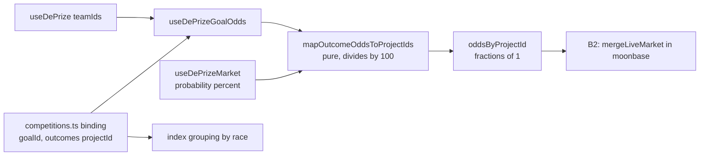

# DePrize Phase B1 Plan

> Design draft — not an implementation PR. Read and discuss before building.

# Phase B1: race binding and the odds bridge

## Goal and hard constraint

B2 ([docs/DEPRIZE_PHASE_B2.md](DEPRIZE_PHASE_B2.md)) opens with two prerequisites: the chain-keyed race binding in [ui/lib/deprize/competitions.ts](../ui/lib/deprize/competitions.ts) and a `useDePrizeGoalOdds` bridge returning odds keyed by `projectId`. B1 builds exactly those, plus the two supporting pieces B2 assumes (competitor identity overrides, index grouping).

**The constraint that shapes everything:** Moon Base Zero is not merged. PR #1405 is open on `origin/feat/lunar-simulator`; `ui/lib/lunar-atlas/`, `ui/components/lunar-atlas/`, and `ui/pages/moonbase/` do not exist on `main`. So B1 must not import a single atlas type. The binding stores plain strings that structurally match the atlas shape, which makes B1 mergeable today and reduces B2 to wiring. It also keeps the highest-conflict file (`atlas.dataset.json`) untouched.



## The two traps worth naming up front

**1. Percent vs fraction.** [ui/lib/deprize/useDePrizeMarket.tsx](../ui/lib/deprize/useDePrizeMarket.tsx) L405-414 computes `probability` as `(Number(p as bigint) / 2 ** 64) * 100` — a percent. The atlas `SharedGoalMarket.impliedOdds` type comment says "as fractions of 1" and `SharedGoalPanel` renders `Math.round(p * 100)`. The bridge must divide by 100. This lives in one pure function with a unit test asserting the scale, because visually 3400% and 34% both "look like a number rendered".

**2. Index alignment.** Registry `teamIds[i]` aligns with LMSR outcome index `i`. The binding's `outcomes` array must be in the same order. A mis-ordered array silently attributes Lockheed's odds to Westinghouse — plausible-looking and undetectable by eye. The mapper must **verify and refuse**, not trust: if `outcomes.length !== numOutcomes`, or any `outcomes[i].teamId` disagrees with `teamIds[i]`, return no odds. Blank is recoverable; wrong is not.

## Work items

### 1. Extend the binding in `competitions.ts`

Add to `DePrizeCompetition` ([ui/lib/deprize/competitions.ts](../ui/lib/deprize/competitions.ts) L16-25):

```ts
/** Moon Base Zero capability race this DePrize settles (SharedGoal.id). */
sharedGoalId?: string
/** Short race label for index grouping, e.g. "Fission surface power". */
raceLabel?: string
/**
 * CTF outcome index -> atlas competitor. Order MUST match registry teamIds.
 * `teamId` is the alignment checksum; `consented` gates public markets.
 */
outcomes?: { projectId: string; teamId?: number; consented?: boolean }[]
```

New accessors alongside the existing ones (all pure, all mocha-testable):

- `getDePrizeRaceBinding(chainSlug, deprizeId)` — returns `{ sharedGoalId, raceLabel, outcomes }` or `undefined`.
- `findDePrizeIdForGoal(chainSlug, sharedGoalId)` — the reverse index the hook needs. Build it as a memoized map, and have it throw in dev if one chain maps two DePrize ids to the same goal.
- `isDePrizeGoalMarketPublishable(chainSlug, sharedGoalId)` — the consent gate (item 5).

Deliberate choice: consent lives here as `outcomes[].consented`, not read from the atlas `Project.rosterStatus`. `rosterStatus` isn't importable on `main`, and the binding is the right source of truth for a legal gate anyway — it sits next to the chain id and the questionId it's gating.

### 2. Pure mapper

New `ui/lib/deprize/goal-odds.ts` (pure module, no React — `yarn test:deprize` runs under mocha and cannot render hooks):

```ts
export function mapOutcomeOddsToProjectIds(args: {
  outcomes: { projectId: string; teamId?: number }[]
  teamIds: bigint[]
  probabilities: number[] // percent, as useDePrizeMarket returns
}): Record<string, number> | undefined
```

Returns fractions of 1, drops non-finite entries, and returns `undefined` on any length or `teamId` mismatch. This is where both traps are contained.

### 3. `useDePrizeGoalOdds` hook

Thin wrapper in `ui/lib/deprize/useDePrizeGoalOdds.tsx`: `findDePrizeIdForGoal` → `useDePrize` → `useDePrizeMarket` → `mapOutcomeOddsToProjectIds`. Returns `{ deprizeId, oddsByProjectId, status, loading }` where `status` is `'live' | 'resolved' | 'planned'` so B2 can drop it straight onto `market.status`.

Two behaviors B2 depends on: it mounts **one** market (B2 item 2 fetches only the open race — eight concurrent 30s polls on the r3f scene is the thing being avoided), and it inherits the existing `ODDS_POLL_MS = 30000` and hidden-tab skip from [ui/lib/deprize/constants.ts](../ui/lib/deprize/constants.ts) rather than introducing a new cadence. It reports `'planned'` — never `'live'` — when the consent gate fails.

### 4. Competitor identity overrides on `DePrizeTeamLink`

[ui/components/deprize/DePrizeTeamLink.tsx](../ui/components/deprize/DePrizeTeamLink.tsx) reads `getNFT` and links to `/team/{teamId}`. ICON, Redwire, and Westinghouse will never hold a Team NFT. Add optional `nameOverride`, `imageOverride`, `hrefOverride`, and set `queryOptions.enabled` false when name and image are both supplied so we skip a doomed NFT read. Keep the NFT path as fallback.

One gotcha: the component uses a bare `<a>`. An internal `hrefOverride` like `/moonbase/{projectId}` will trip the `next/link` ESLint rule that already failed a Vercel build in Phase A — use `Link` for internal hrefs.

### 5. Consent gate

`isDePrizeGoalMarketPublishable` returns false outside `sepolia` unless every entry in `outcomes` has `consented: true`. All 8 atlas races currently carry `rosterStatus: 'listed'`, which is curatorial judgment and not agreement — this is the only item in B1/B2 with real legal exposure, so it ships in the same PR as the binding it protects, not later.

### 6. Group the index by race

[ui/components/deprize/DePrizeIndexContent.tsx](../ui/components/deprize/DePrizeIndexContent.tsx) L571-581 renders a flat `Array.from({ length: count })`, and each row self-hides unless its async-resolved bucket matches the active tab. So a naive parent-rendered heading can appear above zero visible rows.

The fix is already available: the parent holds `statusMap` (L417-422). Partition ids by `raceLabel` from the synchronous binding, and render a heading only when some id in that group satisfies `statusMap[id] === activeTab`. Unbound ids collect under "Other challenges". When a chain has no bindings at all, render the current flat list unchanged so `main` and Arbitrum look exactly as they do today.

### 7. Right-size the outcome cap

The audit result here is better than expected. Production is already dynamic: `numOutcomes = deprize?.teamIds.length ?? 0` ([ui/pages/deprize/[id].tsx](../ui/pages/deprize/[id].tsx) L108-117), and `MAX_OUTCOMES = 3` ([ui/const/config.ts](../ui/const/config.ts) L450) is referenced only by the `deprize-play` harness and `ui/archive/`. The largest planned race is 4 competitors (landing pads, comms), not 8.

So: move the constant into [ui/pages/deprize-play.tsx](../ui/pages/deprize-play.tsx) as a local (or rename to `PLAY_MAX_OUTCOMES`) so nobody mistakes it for a production limit, and extend `OUTCOME_COLORS` ([ui/lib/deprize/constants.ts](../ui/lib/deprize/constants.ts) L41-48) from 6 to 8 entries since it wraps with `% length`. The index's `ranked.slice(0, 3)` (L215-229) plus the existing `teamIds.length > 3` footer (L392-395) already degrade correctly for 4 competitors — leave them.

### 8. Sepolia end-to-end fixture

Bind existing Sepolia DePrize 9 (3 Team NFTs, live LMSR, FeeRouter-owned) to `shared-fission-power`, whose 3 competitors (`westinghouse-fission-surface-power`, `lockheed-fission-surface-power`, `ix-fission-surface-power`) match the fixture's outcome count exactly. Record the index-to-project mapping in `docs/DEPRIZE_QA.md`. This gives B2 a real live race to merge against on day one instead of a mock.

### 9. Tests — `yarn test:deprize`

Extend [ui/cypress/integration/lib/deprize/competitions.cy.ts](../ui/cypress/integration/lib/deprize/competitions.cy.ts) for the new accessors and add `goal-odds.cy.ts`: the percent-to-fraction scale, `undefined` on length mismatch, `undefined` on `teamId` mismatch, non-finite entries dropped, reverse lookup hit and miss, and the consent gate returning false on a non-Sepolia chain with an unconsented competitor.

## Raise with Miguel before merging

B1 defines the binding, so B2 item 7 becomes actionable now: `SharedGoalMarket.deprizeRegistryId` and `deprizeQuestionId` are plain strings with no chain dimension, but a DePrize id is chain-specific. Nothing on `feat/lunar-simulator` reads either field yet, so the cheap resolution is to drop both in favor of the chain-keyed binding. Worth settling before either side writes code.

## Scope boundary

B1 touches only `ui/lib/deprize/` and `ui/components/deprize/`. No file under `ui/pages/moonbase/`, `ui/components/lunar-atlas/`, or `ui/lib/lunar-atlas/` — that is all B2, after #1405 merges. Zero merge conflicts with Miguel by construction.
