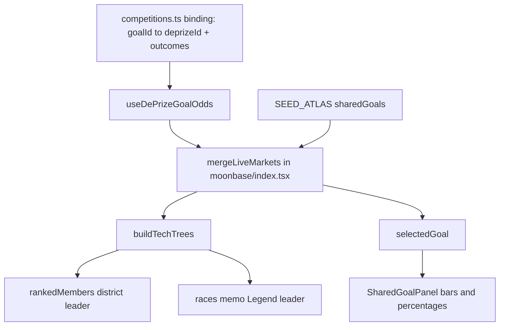
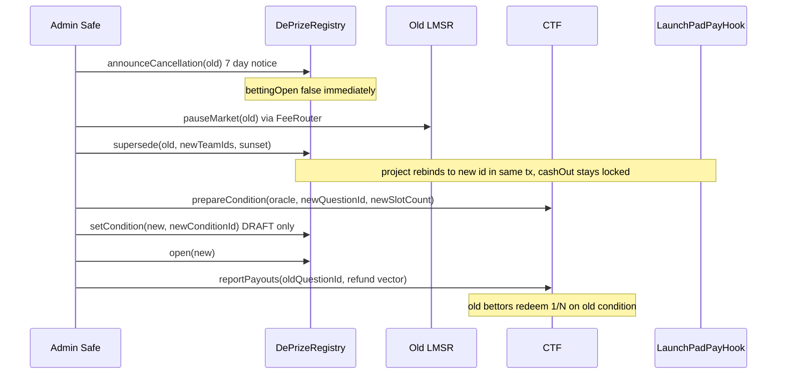

# DePrize Phase B2 Plan

> Design draft — not an implementation PR. Read and discuss before building.

# Phase B2: live markets in Moon Base Zero, plus in-flight roster migration

## Prerequisites

- B1 landed on `main`: the chain-keyed race binding in [ui/lib/deprize/competitions.ts](ui/lib/deprize/competitions.ts) (`sharedGoalId`, `outcomes: { projectId, teamId? }[]`) and the `useDePrizeGoalOdds` bridge that returns odds keyed by `projectId`.
- PR #1405 merged (currently `REVIEW_REQUIRED`, 19k additions). Its description still describes the old MoonSim engine at `/lunar-simulator` rather than Moon Base Zero at `/moonbase` — worth fixing before review.

Good news from the branch audit: `/moonbase` renders inside all global providers (`ChainContextV5`, thirdweb, Privy per [ui/pages/_app.tsx](ui/pages/_app.tsx)); `fullscreenPaths` in [ui/components/layout/Layout.tsx](ui/components/layout/Layout.tsx) only strips layout chrome. Only the r3f globe is `ssr: false`. So chain hooks are safe to call in the page and panels.

## Part 1 — Wiring live odds

### The key structural insight

Three separate consumers read `goal.market.impliedOdds`, all keyed by `project.id`:

- `SharedGoalPanel` sorts and renders bars (`ui/components/lunar-atlas/SharedGoalPanel.tsx` L44-51, L107, L130-154)
- `rankedMembers()` picks the district leader (`ui/components/lunar-atlas/MarkerLayer.tsx` L48-53)
- the `races` memo builds the Legend leader (`ui/pages/moonbase/index.tsx` L225-242)

Because B1's bridge already returns odds keyed by `projectId`, we do not touch any of those three. We merge live values into the goal's `market` **once**, upstream of `buildTechTrees`, and all three inherit it.



### Work items

**1. Pure merge helper.** Add `mergeLiveMarket(goal, live)` to [ui/lib/deprize/competitions.ts](ui/lib/deprize/competitions.ts) or a sibling module: given a `SharedGoal` and `{ oddsByProjectId, status, deprizeId }`, return a goal whose `market.impliedOdds` is the live map and `market.status` is `live`/`resolved`. Falls through untouched when there is no live market. Pure and unit-tested under `yarn test:deprize`.

**2. Fetch only the open race.** In [ui/pages/moonbase/index.tsx](ui/pages/moonbase/index.tsx), call the bridge for `selectedGoalId` only, then merge. Eight concurrent markets on a heavy r3f scene with a 30s poll is the thing to avoid; districts and the Legend keep curator priors until a race is opened. Merge into both `selectedGoal` (L271-273) and the `sharedGoals` passed to `buildTechTrees` so the open district's leader reflects live odds.

**3. `SharedGoalPanel` — link out and fix the copy.** Add a "Back a competitor" link to `/deprize/{deprizeId}` next to `MarketPill` in the header (L57-63). The odds caption at L159-165 already branches on `oddsLive` and needs no change. The footer at L257-260 says "No market exists yet" unconditionally and must become conditional. Competitor rows need no change.

**4. Competitor identity, both directions.** On the DePrize side, feed atlas org name, logo, and brand color into the B1 override props on [ui/components/deprize/DePrizeTeamLink.tsx](ui/components/deprize/DePrizeTeamLink.tsx), pointing competitor links at `/moonbase/{projectId}` instead of `/team/{id}` — ICON, Redwire, and Westinghouse will never hold a Team NFT. Keep the NFT path as fallback.

**5. Consent gate in code.** All 8 races are `rosterStatus: 'listed'`, which the panel correctly discloses is curatorial judgment, not agreement. The binding helper must refuse to report a market as live outside `sepolia` unless every competitor is `consented`. This is the only item here with real legal exposure.

**6. Deep links.** Only `/moonbase/{projectId}` is linkable today ([ui/pages/moonbase/[projectId].tsx](ui/pages/moonbase/[projectId].tsx) re-exports the index). Add a `?race=` param (and optionally `?year=`) so a live race is shareable, wiring through `handleSelectTree` (L377-385) and `handleSelectSharedGoal` (L389-405).

**7. Schema reconciliation with Miguel.** `SharedGoalMarket.deprizeRegistryId` / `deprizeQuestionId` are plain strings with no chain dimension, and a DePrize id is chain-specific. Either drop them in favor of the chain-keyed binding, or make them a per-chain map. Agree this before either side writes code, since `atlas.dataset.json` is the highest-conflict file.

**8. Tests.** Merge helper and binding in `ui/cypress/integration/lib/deprize/*.cy.ts` (`yarn test:deprize`); any atlas selector changes in `ui/cypress/integration/unit/lunar-atlas-*.cy.ts` (`yarn test:cypress-unit`). Include a test that `outcomes.length` equals the seeded `numOutcomes` — a mis-ordered array silently shows the wrong company's odds.

## Part 2 — In-flight roster change ("deep copy")

### Can a competitor be added or removed on a live prize? Not in place.

The outcome set is frozen at four independent layers:

- CTF: `conditionId = keccak256(oracle, questionId, outcomeSlotCount)`, and `prepareCondition` is one-shot ("condition already prepared"). Slot count is the length of `payoutNumerators[conditionId]`; there is no resize.
- LMSR: `atomicOutcomeSlotCount`, `conditionIds`, and `cumulativeProbabilities` are set in the clone constructor and never mutated. `changeFunding` moves collateral only, never slots.
- Registry: `teamIds` is only ever `push`ed inside `register`. There is no `setTeams` / `addTeam` / `removeTeam`.
- Mint: `setMarket` reverts `MarketSlotMismatch` unless `atomicOutcomeSlotCount == teamIds.length`, and `bet` reverts `BadOutcomeIndex` past the roster.

`docs/DEPRIZE.md:810` already states the provider list is locked at DePrize-open, and `docs/DEPRIZE_M4.md:27` explicitly rejected an extra outcome slot because it irreversibly changes the conditionId. The "mark a provider withdrawn via Registry" path at `docs/DEPRIZE.md:806` and `:841` was never implemented.

### Removal needs no migration at all

This is the recommendation. If a competitor drops out, the market prices them toward zero on its own, and `settleWinner` only validates membership in `_isTeam` — any remaining team can win. So removal is a disclosure and resolution-policy question, not a contract one. Escalate to `settleNoWinner` or the cancel path only if the field collapses entirely. Building machinery for removal would be solving a problem the market already solves.

### Addition is the real case, and it is a fork, not an edit

Adding a competitor means a new `conditionId`, therefore a new LMSR, therefore a new registry entry. Two hard blockers:

- `_deprizeIdByJBProject[jbProjectId]` is written once in `register` and **never cleared** — not by `cancel`, `settleNoWinner`, or `failM2`. A second `register` on the same project always reverts `JBProjectAlreadyBound`. Since the Juicebox project *is* the prize pool and the project token, a naive fork strands both.
- There is an atomicity trap. [subscription-contracts/src/LaunchPadPayHook.sol](subscription-contracts/src/LaunchPadPayHook.sol) resolves its DePrize by `deprizeRegistry.deprizeIdByJBProject(projectId)` and gates cashOut on `isRefundable`. If you cancel the old DePrize while the project still points at it, the hook re-opens refunds and contributors can drain the prize pool.

### Design: `supersede` on the registry

The registry is UUPS with `_authorizeUpgrade` gated on `owner()` and a `uint256[45] __gap`, so this is a contained upgrade.

Add one owner-gated function that forks the roster and rebinds the pool in a single transaction:

```solidity
function supersede(uint256 oldDeprizeId, uint256[] calldata newTeamIds, uint256 sunset)
    external onlyOwner returns (uint256 newDeprizeId);
```

It should: create a new entry in `DRAFT` reusing `old.jbProjectId`; rebind `_deprizeIdByJBProject[jbProjectId] = newDeprizeId`; move the old entry to a new `SUPERSEDED` terminal state; and record `supersededBy[old] = new` / `supersedes[new] = old` for UI lineage (two new mappings, `__gap` 45 to 43).

Two properties make this work. Rebinding in the same transaction means the pay hook never observes a refundable state for that project, so **cashOut stays locked and the prize pool and project token survive intact**. And `SUPERSEDED` must be terminal (no further betting) but **not** refundable, so nobody JB-cashes-out against the old id.

Bettors on the old market are made whole through a different channel: pause the old LMSR, `reportPayouts` the 1/N refund vector on the old condition, and they redeem via [subscription-contracts/src/deprize/DePrizeRedeem.sol](subscription-contracts/src/deprize/DePrizeRedeem.sol), which derives positions from the old `conditionId` and is unaffected by the new entry. Concentrated bettors recover roughly 80-95% under CTF parimutuel, which `docs/DEPRIZE.md` already documents for cancellation — that loss is the honest cost of a roster change and must be disclosed before it happens.



Also required: new LMSR via the factory with fresh funding (roughly 1 ETH per outcome), `DePrizeMint.setMarket(new, lmsr)` and `DePrizeFeeRouter.setMarket(new, lmsr)` (both re-pointable, both validate the condition), plus `lmsr.transferOwnership(feeRouter)`.

On the app side: `SUPERSEDED = 11` in [ui/lib/deprize/lifecycle.ts](ui/lib/deprize/lifecycle.ts) with `DEPRIZE_STATE_META` copy and `deprizeListBucket` handling; the competitions binding points the race at the current `deprizeId` while `/deprize/{oldId}` stays reachable for redemption; and a lineage banner on both pages linking old to new.

### The no-contract-change alternative, and why it loses

Create a fresh JB project plus a fresh DePrize, then reconfigure the old project's payout split to sweep its balance to the new project. It needs no upgrade, but it strands the old project token holders, requires JB ruleset surgery, and races the pay hook's refund window the moment the old prize is cancelled. Strictly worse than `supersede`.

### Recommendation

Do not build this now. Keep "roster locked at open" as the shipped policy, add the disclosure to the Terms annex, and make each prize's `sunset` short enough that waiting for the next cycle is a real option. Build `supersede` only when a concrete dropout or late entrant forces it, and land it **with the pre-mainnet audit in Phase D** rather than as a standalone upgrade, since it touches the registry's most safety-critical invariants. What is worth doing now, cheaply, is a spike: a Forge test that asserts the current reverts (`JBProjectAlreadyBound`, `MarketSlotMismatch`, `setCondition` after open) so the constraint is pinned in CI and nobody assumes it is mutable later.
