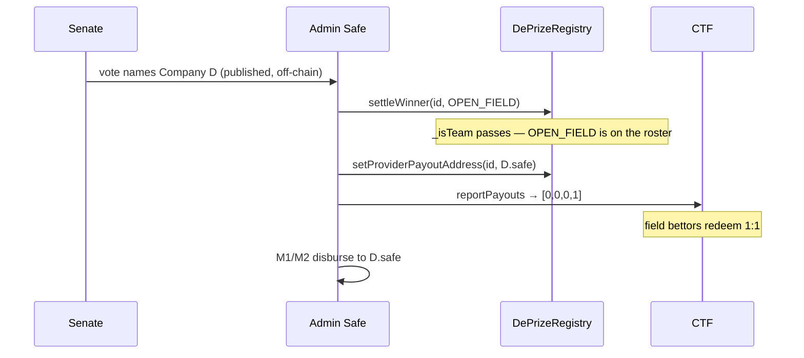

# Adding and removing competitors after a DePrize is created

## The question

Long-running prizes ("fission surface power", "regolith oxygen extraction") will outlive
their opening roster. Companies enter the field, pivot, get acquired, or drop out. Today the
roster is frozen at registration and there is no way to change it. This document works out
what is actually possible, what each option costs, and what we should build.

## What is actually immutable (verified against the code, not assumed)

Three separate layers pin the roster, and they pin it for different reasons.

**The Gnosis CTF pins the outcome count into the condition's identity.**
`getConditionId` is `keccak256(abi.encodePacked(oracle, questionId, outcomeSlotCount))`
([CTHelpers.sol:10-12](../prediction/node_modules/@gnosis.pm/conditional-tokens-contracts/contracts/CTHelpers.sol)),
and `prepareCondition` refuses to touch an id that already exists
([ConditionalTokens.sol:65-73](../prediction/node_modules/@gnosis.pm/conditional-tokens-contracts/contracts/ConditionalTokens.sol)).
A 4-slot condition is a *different condition* from the 3-slot one. There is no resize.

**The LMSR pins the slot count at clone time.** `atomicOutcomeSlotCount`,
`conditionIds`, `cumulativeProbabilities` and `positionIds` are all set in `cloneConstructor`
([LMSRWithTWAPFactory.sol:57-100](../prediction/contracts/LMSRWithTWAPFactory.sol)) and
`trade` hard-requires `outcomeTokenAmounts.length == atomicOutcomeSlotCount`
([MarketMaker.sol:166](../prediction/node_modules/@gnosis.pm/conditional-tokens-market-makers/contracts/MarketMaker.sol)).
No function resizes it.

**The registry has no roster setter at all.** `teamIds` and `_isTeam` are written only
inside the `register` loop ([DePrizeRegistry.sol:92-99](../subscription-contracts/src/deprize/DePrizeRegistry.sol)),
and `setCondition` is DRAFT-only ([:107-112](../subscription-contracts/src/deprize/DePrizeRegistry.sol)).

So: **the outcome set of a live market can never change.** Any "add a competitor" story is
really a story about a *second* condition and a *second* market. The only open questions are
what happens to the prize pool, what happens to existing bettors, and whether we can avoid
the problem entirely by planning for it at registration.

### The two couplings that make this hard

**The Juicebox binding is write-once and never cleared.** `_deprizeIdByJBProject[jbProjectId]`
is set in `register` ([:101](../subscription-contracts/src/deprize/DePrizeRegistry.sol)) and a
second `register` on the same project reverts `JBProjectAlreadyBound`
([:81](../subscription-contracts/src/deprize/DePrizeRegistry.sol)). Nothing — not `cancel`,
not `settleNoWinner`, not `failM2` — ever clears it. The prize pool ETH and the project token
live on that JB project, so a naive "new prize" means a new pool and orphaned token holders.

**Cancelling to free things up opens the cash-out floodgates.** `LaunchPadPayHook`
un-gates `cashOut` the moment `isRefundable` is true
([LaunchPadPayHook.sol:153-165](../subscription-contracts/src/LaunchPadPayHook.sol)), and
`isRefundable` covers `CANCELLED | NO_WINNER | M2_FAILED`
([DePrizeRegistry.sol:307-310](../subscription-contracts/src/deprize/DePrizeRegistry.sol)).
Cancel a live DePrize to re-register it and token holders can drain the prize pool pro-rata
before you finish the migration.

### One thing that is helpfully *not* coupled

The prize money does **not** follow the winning Team NFT. `settleWinner` validates
`_isTeam` ([:152](../subscription-contracts/src/deprize/DePrizeRegistry.sol)), but the payout
destination is a free-form address the owner sets afterwards via `setProviderPayoutAddress`
([:248-259](../subscription-contracts/src/deprize/DePrizeRegistry.sol)), and the disbursement
script pays `providerPayoutAddress`, never an NFT owner
([DePrizeDisburse.s.sol:91-114](../subscription-contracts/script/deprize/DePrizeDisburse.s.sol)).

**This is the hinge the whole design turns on.** The outcome slot a bettor holds and the
entity that receives the prize are already independent. That is what makes the reserved-field
option below work with zero contract changes.

---

## Removal is a non-problem

Worth separating, because it gets bundled with addition and it shouldn't be.

Nothing breaks when a competitor drops out. The market prices them toward zero on its own.
`settleWinner` only requires the *winner* to be on the roster, so a dead slot is inert.
`DePrizeResolve.buildReport` pays `[0,…,1,…,0]` at the winner's index and ignores the rest
([DePrizeResolve.s.sol:71-85](../subscription-contracts/script/deprize/DePrizeResolve.s.sol)).

Removing a slot for real would be actively *harmful*: it would strip holders of that outcome
token of the ability to sell, and there is no honest price at which to force-close them.
Leaving the slot open lets them exit at whatever the market says it is worth.

So removal is a **disclosure** feature, not a mechanism feature: mark the competitor
withdrawn, badge them in the UI, and let the price finish the job. [docs/DEPRIZE.md:806](DEPRIZE.md)
already proposed exactly this ("mark a provider withdrawn via Registry") and
[:841](DEPRIZE.md) lists it as an unbuilt future enhancement.

One wording to correct while we are here: DEPRIZE.md:806 says a withdrawn provider's "team
tokens become worth 0". That is a *market outcome* — they go to zero because someone else
wins — not an enforced write-down, and the distinction matters. If we ever implemented it as
a write-down we would be confiscating positions. Keeping the slot tradable is what turns
"your bet is now worthless" into "your bet is now cheap, and you can sell it".

The rest of this document is about **addition**.

---

## Options

### O1 — Do nothing. Roster locked, next roster next cycle.

The shipped policy: *"Provider list is locked at DePrize-open. New providers can be added in
future DePrizes"* ([docs/DEPRIZE.md:810](DEPRIZE.md)). Keep sunsets short so "next prize" is
never far away.

Honest baseline. Fails the actual use case: a fission-surface-power race runs to the early
2030s, and telling a new entrant to wait for the 2031 prize is telling them to go away.

### O2 — Withdrawal disclosure only

Registry gains an event-only flag: `markWithdrawn(uint256 deprizeId, uint256 teamId)` emitting
`TeamWithdrawn`, plus a `withdrawn(deprizeId, teamId)` view. It changes **no** outcome set, no
slot count, no condition. `bet` stays open on that slot so holders can exit.

UI badges the row "Withdrawn — you can still sell your position". Costs one mapping and one
event; storage comes out of `__gap`.

This is the removal half of the feature and it is nearly free. It should ship regardless of
which addition option we choose.

### O3 — DRAFT-only `setTeams`

`setTeams(uint256 deprizeId, uint256[] calldata teamIds)`, guarded by `_requireDraft`, clearing
and rewriting `_isTeam`. Only usable before `open`.

This does not solve the stated problem at all — but it fixes a **live footgun**. Today a typo
in the `register` roster is unrecoverable: you cannot re-register because the JB project is
already bound, so a mistyped team id in DRAFT costs you the whole Juicebox project. Cheap
insurance while we are in the registry anyway.

### O4 — Reserve an "Open Field" slot at registration ⭐

Register the race with one extra outcome beyond the named competitors:

> `teamIds = [Westinghouse, Lockheed, IX, OPEN_FIELD]`

`OPEN_FIELD` is a real MoonDAOTeam NFT owned by the admin Safe, named "Open Field". The market
question becomes *"which provider is selected — one of these three, or anyone else?"* Bettors
who think the eventual winner isn't on the board yet buy the field.

When a late entrant wins, the settlement is a single Safe batch:



Every step is an existing function. **Zero contract changes.** `buildReport` finds
`OPEN_FIELD` in `teamIds` so there is no `WinnerNotFound`; `DePrizeRedeem` still matches slot
counts; the pay hook never sees a refundable state.

Cost is one extra outcome's worth of LMSR seed funding and one honest limitation: field
bettors don't know *which* unlisted company they're backing. That is a well-understood
instrument — it is the "field" bet in horse racing and the "Other candidate" line in election
markets — but it must be disclosed plainly rather than presented as a normal competitor.

**On the M4 precedent.** [docs/DEPRIZE_M4.md:27](DEPRIZE_M4.md) rejected an extra outcome
slot, so this needs squaring. That rejection was of a **"None flies by X date"** slot, and
four of its five objections are about that specific slot rather than about extra slots:
(a) it funds people whose payday is the mission failing — Open Field pays only when *someone*
wins, so it is long the mission, not short it; (b) honest resolution must wait for the
flight — Open Field resolves at `SETTLED` with everything else; (c) it converts the disclosed
partial refund into a total loss — Open Field doesn't change refund math; (d) it touches the
audited M3 router — this slot exists from registration, so nothing is retrofitted. Objection
(e), that the multisig controls an outcome people hold positions on, **does apply** and is the
real cost. Mitigation is procedural: publish objective field-eligibility criteria at open,
require the Senate vote to name the entity before the Safe batch runs, and put the payout
address in the same batch as `settleWinner` so the record is atomic.

Open Field's limitation is that it must be decided **at registration**. It does nothing for
prizes already live — which is what O5 is for.

### O5 — `supersede`: prize generations

A registry upgrade that atomically forks a DePrize onto a new roster while keeping the
Juicebox project — and therefore the prize pool and the project token — intact:

```solidity
function supersede(uint256 oldDeprizeId, uint256[] calldata newTeamIds, uint256 sunset)
    external onlyOwner returns (uint256 newDeprizeId);
```

It creates a new DRAFT entry reusing `old.jbProjectId`, rebinds
`_deprizeIdByJBProject[jbProjectId] = newDeprizeId`, moves the old entry to a new `SUPERSEDED`
state, and records `supersededBy[old]` / `supersedes[new]` for UI lineage. Two mappings plus
one enum member; `__gap` goes 45 → 43.

**`SUPERSEDED` must be terminal but NOT refundable.** Terminal so the old entry stops
accepting bets and `sweepFees` routes to the treasury rather than re-inflating the pool
(the double-count guard, [DEPRIZE_M4.md:175-182](DEPRIZE_M4.md)); not refundable so no
cash-out window ever opens on that project. Atomicity matters: the rebind and the state change
must be one transaction, or the pay hook briefly sees a refundable DePrize on a funded project.

Then the normal provisioning run: new condition, new LMSR, `setMarket` on Mint and FeeRouter
(both are re-pointable — neither has an "already set" guard,
[DePrizeMint.sol:121-139](../subscription-contracts/src/deprize/DePrizeMint.sol),
[DePrizeFeeRouter.sol:96-112](../subscription-contracts/src/deprize/DePrizeFeeRouter.sol)).

**Correcting the B2 draft on bettor cost.** [.cursor/plans/deprize_phase_b2.plan.md](../.cursor/plans/deprize_phase_b2.plan.md)
assumed superseding forces a 1/N refund on the old market. It doesn't, in the common case.
CTF collateral is per-condition, so the two markets settle independently: if the winner is
someone who was on the *old* roster, the old condition reports `[0,…,1,…,0]` honestly and its
bettors redeem 1:1 from their own market's collateral, while the new condition does the same
from its own. The 1/N refund is only forced when the winner is a competitor who exists **only**
on the new roster — precisely the case Open Field would have covered.

The unavoidable cost is **illiquidity**: the old market is paused at supersede and its holders
cannot exit until settlement, which may be years. That is a real harm and needs disclosure,
but it is not principal loss.

### O6 — In-place reset (same `deprizeId`, new roster + new condition)

The tempting shortcut: skip the new id and just let the owner overwrite `teamIds` and
`ctfConditionId` on the existing DePrize. No rebind needed, `deprizeId` stays stable
everywhere in the UI.

**This is the trap, and it is worse than it looks.** Both the resolution and redemption paths
read the *current* registry record to reconstruct the *historical* condition:

- `DePrizeResolve.buildReport` computes `conditionId = getConditionId(oracle, questionId, n)`
  from `n = dp.teamIds.length` and reverts `ConditionMismatch` against `dp.ctfConditionId`
  ([DePrizeResolve.s.sol:99-102](../subscription-contracts/script/deprize/DePrizeResolve.s.sol)).
- `DePrizeRedeem._positions` reverts `SlotCountMismatch` unless `teamIds.length` equals the
  condition's on-chain slot count
  ([DePrizeRedeem.sol:133-153](../subscription-contracts/src/deprize/DePrizeRedeem.sol)).

Overwrite the roster and the old condition becomes **permanently unresolvable through our
tooling** and its holders lose the redeem helper — they'd be left calling
`ctf.redeemPositions` by hand against a condition nobody ever reported payouts for. O5 avoids
all of this for free by leaving the old record immutable and readable.

### O7 — Per-competitor binary markets

Replace the one N-way categorical market with one YES/NO condition per competitor. Adding a
competitor is then just deploying another binary market; the shared-slot constraint disappears
entirely.

Genuinely the most flexible architecture, and it is how open-ended fields are handled
elsewhere. But probabilities no longer normalise to 1 (you get an incoherent book that has to
be reconciled in the UI), each market needs its own seed so liquidity fragments across the
roster, and it is a rewrite of M3/M4 plus the resolution runbook plus the odds bridge B1 just
shipped. Right answer for a v2 architecture, wrong answer for adding a competitor next quarter.

### Rejected: migrate bettor collateral from the old generation into the new one

The intuition is that superseding should carry positions across so capital isn't stranded.
It is mechanically possible — collateral is conserved, so the recovered LMSR inventory plus
surrendered bettor positions form complete sets that `mergePositions` can unwind back to WETH
and reissue against the new condition.

It is nonetheless **less fair than doing nothing**. Migration has to price every position at
the moment of the fork, and the two generations have different outcome sets, so P(competitor)
genuinely differs between them: a 1:1 token swap hands people a position worth a different
amount, and a value-based swap requires an administrative price mark. Either way somebody's
P&L is crystallized at a number MoonDAO chose, on a question the market hadn't answered yet.
Letting the old condition resolve honestly is the only path where no outcome depends on our
valuation. It also re-instruments a position the holder bought without their consent, and it
only unwinds cleanly at full participation — any non-participating holder leaves a stub that
cannot be merged.

And it solves a problem we do not have: because the legacy LMSR stays Running, holders can sell
out at any time at a market price, so nobody is locked in and there is nothing to migrate them
out of. Note also that nothing here dilutes anyone — each condition's collateral pays only its
own holders, and the Juicebox prize pool is separate from both and goes to the winning company
rather than to bettors.

### Rejected: let the market refund and pay the prize anyway

"Keep the roster locked; if an unlisted entrant wins, resolve the market no-winner but award
the prize to the real winner." This is not possible without a contract change: `settleWinner`
requires `_isTeam`, and `releaseM1`/`completeM2` require `SETTLED`
([DePrizeRegistry.sol:176-203](../subscription-contracts/src/deprize/DePrizeRegistry.sol)).
Calling `settleNoWinner` instead puts the prize in a refund terminal and there is no path from
there to paying anyone. It also 1/N-refunds a market that answered its question correctly,
which reads as a rug.

---

## Weighing the options

| | Contract change | Handles **add** | Handles **remove** | Bettor impact | Prize pool + token | Ops cost | Ship |
|---|---|---|---|---|---|---|---|
| **O1** do nothing | none | ✗ | disclosure only | none | intact | none | shipped |
| **O2** withdrawal flag | tiny (event + mapping) | ✗ | ✓ | none — can still exit | intact | 1 tx | days |
| **O3** DRAFT `setTeams` | small, DRAFT-gated | pre-open only | pre-open only | none (no market yet) | intact | 1 tx | days |
| **O4** Open Field ⭐ | **none** | ✓ (unnamed) | ✓ via price | none | intact | +1 outcome of seed | now |
| **O5** supersede | registry upgrade + audit | ✓ (named) | ✓ | old market illiquid until settlement; 1/N **only** if a new-roster-only competitor wins | intact | full re-provision | ~1 quarter |
| **O6** in-place reset | registry upgrade | ✓ | ✓ | **old condition unresolvable, redeem helper broken** | intact | full re-provision | — |
| **O7** binary markets | architecture rewrite | ✓ | ✓ | liquidity fragmented | intact | new market per entrant | v2 |

Reading across the rows: O4 dominates on every axis except one — the new competitor is
anonymous until settlement. O5 is the only option that names a mid-flight entrant, and it pays
for that with an audit and an illiquid legacy market. O6 is strictly worse than O5. O2 and O3
are cheap enough that their cost barely registers.

The two dimensions that actually separate them:

**Can it be used on a prize that is already live?** Only O5, O6, O7. O4 must be decided at
registration. This is why the sequencing below front-loads O4 for the Moon Base Zero races we
have not seeded yet, and treats O5 as the escape hatch for the ones we have.

**Does a bettor know what they are buying?** O4's field bettor does not, which caps how much
of a race's probability mass should sit there. If Open Field's implied odds climb past roughly
a third, the honest response is not to keep selling an opaque slot — it is to supersede into a
roster that names the entrants. **O4 and O5 are complements, not alternatives**: O4 absorbs
routine field growth, O5 handles the moment the field has genuinely reshaped.

---

## Recommendation

### The cadence decision that reorders everything

Races run as **generations over one accumulating Juicebox prize pool**. Sunsets stay in the
18-24 month range and the race rolls into a new generation until it is won, rather than one
prize with a 2035 deadline that nobody will lock capital against for nine years.

That decision promotes O5 from escape hatch to **core infrastructure**. The Juicebox binding is
write-once, so the only way to start a new generation while keeping the pool and the project
token is `supersede`. The alternative — a fresh JB project per generation — splits the pool and
orphans the previous generation's token holders, which is the opposite of accumulating.

Two constraints follow directly from an accumulating pool:

- **`supersede` is legal only from `OPEN` or `LOCKED`.** `DRAFT` uses `setTeams`; `SETTLED` and
  later are excluded because the prize is already being paid and the race is over. The race
  ends at `M2_COMPLETE`, not at a generation boundary.
- **Sweep fees before superseding, in the same Safe batch.** `sweepFees` routes to the prize
  pool only while the entry is non-terminal ([DePrizeFeeRouter.sol:123-155](../subscription-contracts/src/deprize/DePrizeFeeRouter.sol)),
  so once `SUPERSEDED` is set the old market's residual fees would go to the treasury instead of
  the pool they belong to.

The bigger the pool grows across generations, the more expensive an accidental refundable state
becomes — so the atomicity requirement and the cashOut hazard test matter more each cycle, not
less.

### Sequence

**Now, no contract change.** Reserve an Open Field slot in every Moon Base Zero race we seed
from here on (O4). Add the field-eligibility criteria and the settlement procedure to the terms
before the first one opens. This handles entrants who show up *within* a generation, which is
what stops every new name from forcing a supersede.

**In parallel, one contract PR and one audit.** Bundle O5 (`supersede`), O2 (withdrawal flag)
and O3 (DRAFT-only `setTeams`) into a single registry upgrade, plus an extend-only `setSunset`
while `OPEN` so a deadline slip does not cost a full generation fork. Three new storage slots,
`__gap` 45 to 42. Gate the work behind the Forge spike below.

**Never.** O6. O7 belongs in a v2 architecture conversation, not this one.

### Two related decisions

**Open Field on every race whose eligibility is criteria-based.** The exemption is a race whose
eligible set is fixed by an external gate we do not control. Beyond roster flexibility, the slot
is a pricing fix: without it the named competitors must sum to 1, so their odds are
systematically overstated — and B1 now feeds those odds into Moon Base Zero as `impliedOdds`.

**No "None" outcome.** "Nobody qualified" already exists as `settleNoWinner` with the disclosed
1/N equal payout. Making it a tradable slot would pay None-holders 1:1 while zeroing every team
bettor, contradicting Terms section 6, and would settle the prize into `SETTLED` with no winner
to pay. See the M4 discussion under O4.

---

## Work items

### Phase 0 — Prove the constraints in CI (no production code)

A Forge spike that pins today's behaviour so a future upgrade can't silently break it. This is
the B2 plan's outstanding migration-spike item.

`subscription-contracts/test/deprize/DePrizeRosterSpike.t.sol`:

1. `testCannotReRegisterSameJBProject` — `JBProjectAlreadyBound`.
2. `testSetConditionRevertsAfterOpen` — exists; assert the DRAFT gate is the only window.
3. `testSetMarketRevertsWhenRosterLengthDiffers` — build a 4-slot condition + LMSR, try to
   bind to a 3-team DePrize, expect `MarketSlotMismatch(4, 3)`.
4. `testRedeemRevertsSlotCountMismatch` — currently **uncovered**. Force the divergence with
   `vm.store` or a mock registry and assert `SlotCountMismatch`. This is the test that makes
   the O6 failure mode visible in CI.
5. `testCancelOpensCashOutOnBoundProject` — the migration hazard, asserted end-to-end through
   `LaunchPadPayHook`.

### Phase 1 — Open Field (O4), no contract change

1. **Mint the reserved Team NFT.** One MoonDAOTeam token owned by the admin Safe, named
   "Open Field", image = a neutral field glyph. Record the id in `docs/DEPRIZE_QA.md` next to
   the other fixtures.
2. **`ui/lib/deprize/competitions.ts`** — extend `DePrizeRaceOutcome` with `field?: true`.
   A field outcome has no `projectId` in the atlas sense, so `mapOutcomeOddsToProjectIds`
   must skip it rather than emit a bogus key: add the guard and a test in
   `ui/cypress/integration/lib/deprize/goal-odds.cy.ts`.
3. **UI rendering** — `DePrizeTeamLink` already takes `nameOverride` / `imageOverride` /
   `hrefOverride` from B1, so the field slot renders as "Open Field — any qualifying entrant
   not listed above" with a link to the eligibility criteria and no Team NFT read. Add an
   explanatory tooltip on the bet row; this is the one outcome a bettor can misread.
4. **Moon Base Zero bridge** — a field slot's odds are *not* a competitor's implied odds.
   `useDePrizeGoalOdds` should return them separately (`fieldOdds`) so B2's `mergeLiveMarket`
   can render "unlisted entrants: 12%" rather than attributing it to a project.
5. **Terms** — new section in `ui/docs/DEPRIZE_TERMS_AND_CONDITIONS.md`: what the field slot
   is, the objective eligibility criteria, that the Senate names the entity and the Safe
   records the payout address atomically with settlement, and that MoonDAO's multisig is the
   resolver for that slot.
6. **Runbook** — `docs/DEPRIZE_M5.md`: the field-winner Safe batch is
   `settleWinner(id, OPEN_FIELD)` + `setProviderPayoutAddress(id, winner)` in one batch, never
   two.

### Phase 2 — One registry upgrade: generations, withdrawal, DRAFT edits (O5 + O2 + O3)

Single UUPS upgrade adding three storage slots (`_withdrawn`, `supersededBy`, `supersedes`),
`__gap` 45 → 42. One audit covers all of it.

**`supersede(oldId, newTeamIds, sunset)`** — new DRAFT id reusing `old.jbProjectId`, old entry
to `SUPERSEDED`, `_deprizeIdByJBProject` rebound, lineage recorded, all in one transaction.
Legal only from `OPEN` or `LOCKED`. `SUPERSEDED` is terminal but **not** refundable. Append the
enum member (never insert — it is ABI) and mirror it in `ui/lib/deprize/lifecycle.ts`.

**`setSunset` extend-only while `OPEN`** — closes the gap where [docs/DEPRIZE.md:886](DEPRIZE.md)
promises a 6-month extension that `_requireDraft` makes impossible. Shortening stays forbidden
so the deadline cannot be pulled in on bettors.

Then the two smaller pieces:

1. `mapping(uint256 => mapping(uint256 => bool)) private _withdrawn;`
   `markWithdrawn(deprizeId, teamId)` / `unmarkWithdrawn` / `withdrawn(...)` view, `onlyOwner`,
   valid in any non-terminal state, emitting `TeamWithdrawn` / `TeamReinstated`.
   Explicitly **does not** gate `bet` — holders must be able to exit.
2. `setTeams(deprizeId, teamIds)` behind `_requireDraft`, re-running every `register`
   validation (`TooFewTeams`, `ZeroTeamId`, `DuplicateTeam`) and clearing the old `_isTeam`
   entries before writing the new ones. The clear-then-write ordering is the whole bug surface
   here; test it directly.
3. Tests: upgrade-persistence (the existing UUPS test pattern in `DePrizeRegistry.t.sol`),
   `setTeams` reverts after `open`, stale `_isTeam` cleared, `markWithdrawn` leaves
   `bettingOpen` true.
4. UI: withdrawn badge on the outcome row, and `competitions.ts` gains nothing — the flag is
   read on-chain so it needs no redeploy to take effect.

Tests for the upgrade:

- **The hazard, directly:** at no point in the supersede transaction does
  `LaunchPadPayHook.beforeCashOutRecordedWith` stop reverting for that project.
- Supersede reverts from `DRAFT`, `SETTLED`, `M1_RELEASED` and every terminal state.
- UUPS storage persistence across the upgrade.
- `setTeams` reverts after open; stale `_isTeam` cleared.
- `setSunset` cannot shorten, and cannot be called outside `DRAFT` / `OPEN`.
- `DePrizeResolve` on the old condition, both branches: honest `[0,…,1,…,0]` when the winner
  was on the old roster, 1/N only when the winner exists solely on the new one.

Audit before mainnet. This is the first registry change that isn't purely additive at the end.

### Phase 3 — Operate generations

1. **Runbook** ([DEPRIZE_M5.md](DEPRIZE_M5.md)) — announce the supersede publicly, then execute
   one ordered batch: `sweepFees(oldId)` first while the entry is still non-terminal, then
   `supersede(...)`, then provision the new condition, LMSR, `setCondition`, `open` and
   `setMarket` on both Mint and FeeRouter.

   **Leave the old LMSR Running.** Sells go directly to the LMSR from
   [ExitPositionModal](../ui/components/deprize/ExitPositionModal.tsx) while only
   `DePrizeMint.bet` consults `bettingOpen`, so a `SUPERSEDED` generation becomes sell-only for
   free: new bets blocked, exits working indefinitely through the existing UI, no contract
   change. Pausing or closing would revert `trade` and strand holders until settlement — not an
   acceptable price for recycling seed capital, which returns at settlement regardless.

   Two consequences. Sell fees keep accruing on the legacy market and `sweepFees` routes to the
   treasury once the entry is terminal, so while the race continues the runbook sweeps them to
   the prize pool manually. And at final settlement the legacy LMSR must be paused or closed
   before `reportPayouts`, because `DePrizeResolve` refuses to build a report against a Running
   market.
   **Blocker:** `DePrizeResolve.buildReport` reverts `WrongState` on anything outside
   `SETTLED`/`M1_RELEASED`/`M2_COMPLETE`/`NO_WINNER`/`CANCELLED`, and a `SUPERSEDED` entry never
   transitions again — so it needs a lineage branch that walks `supersededBy` to the settling
   generation and maps that winner onto the old roster (named slot, else the old generation's
   field slot, else 1/N). Without it every superseded condition is permanently unresolvable.
2. **UI lineage** — `competitions.ts` gains `supersedes` / `supersededBy`; generations collapse
   under one race heading via the `partitionDePrizeIndexByRace` seam from B1; the detail page
   shows "Generation N" with a link back; withdrawn badge on outcome rows.
3. **Terms** — the prize pool accumulates across generations and is paid to the winner on
   success, so project tokens are only a *contingent* claim on it, realised through cashOut
   solely in a refund terminal; outcome tokens are per-generation, but every generation resolves
   to the same real-world winner and pays from its own collateral; a superseded market stays
   open for selling while accepting no new bets, and its price may diverge from the live
   generation.

## Open questions

1. **Does the field slot need a cap?** If Open Field trades above ~⅓ the market is telling us
   the roster is wrong. Now that supersede is core, the natural answer is a policy trigger —
   field odds over the threshold at any monthly review open a supersede proposal — rather than
   a judgement call. Needs a number agreed before the first race opens.
2. **One field slot or two?** Two would let a race distinguish "known-but-unconsented
   entrants" from "genuinely unknown". Probably over-engineering; revisit if a race actually
   has a large unconsented set.
3. **Should `markWithdrawn` block new buys on that slot?** Argues both ways: blocking prevents
   someone buying a dead outcome by mistake, but it also removes the counterparty that lets
   existing holders exit. Current lean is not to block, and to make the UI loud instead.
4. **Do old-generation project-token holders keep a full claim on a pool later generations
   funded?** Only contingently. On success the pool is disbursed to the winner and cashOut never
   opens, so the token pays nothing; in a refund terminal it is pro-rata over the whole JB
   balance, including contributions from later generations. That rewards early participants,
   which seems right, but someone should sanity check the dilution math before generation 2.
