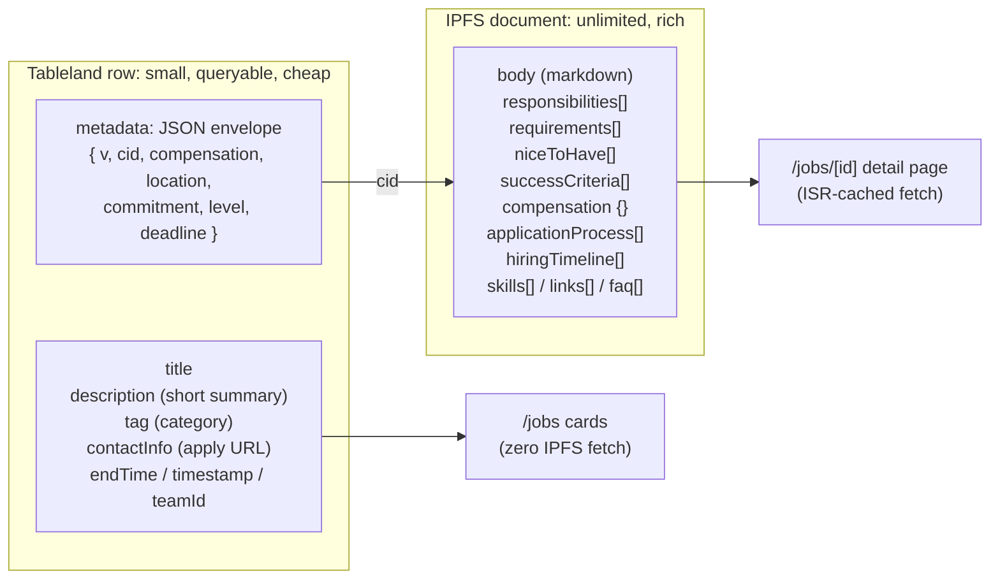

# Jobs Board Upgrade Plan

Written against the Social Media Manager (X/Instagram) listing as the driving example, but
designed so every future listing benefits. The short version: today a MoonDAO job is a
1,024-byte plain-text blurb on a card that has no URL of its own. That is not enough surface
area to hire for a role like this one, and it is not shareable on the very platform we are
hiring someone to grow.

---

## 1. Where the board is today

| Area | Current state |
|---|---|
| Routes | `/jobs` list only. No per-job page, so no link to share, no SEO, no OG preview. |
| Storage | Tableland table `JOBBOARD_*`, written through `JobBoardTable.sol`. |
| Fields written by the UI | `title`, `description`, `teamId`, `endTime`, `timestamp`, `contactInfo`. |
| Fields in the schema but never written | `tag`, `metadata` — both hardcoded to `''` on insert/update. |
| Description limit | 1,024 UTF-8 bytes, enforced in `TeamJobModal`. Roughly 150 words. |
| Description rendering | One `
`, `line-clamp-3`, "Read more" toggles the clamp. No markdown, no headings, no lists, no links. |
| Search | Client-side substring match on `title` only. No filters, no sort, no result count. |
| Access | Whole board blurred behind a Citizen gate. Nothing about a job is publicly linkable. |
| Authoring | `TeamJobModal` on a team page: 4 inputs (title, description, apply link, expiry). |
| Post-write | Hardcoded 25-second `setTimeout` before refetch, instead of `waitForRow`. |
| Discord notification | Links to `/jobs`, not to the job. |
| Bug | `getStaticProps` in `pages/jobs.tsx` filters with an `async` predicate, so `Array.filter` receives Promises (always truthy) and the team-expiration filter silently does nothing. |

### Why this blocks the Social Media Manager hire specifically

The drafted description is ~7,600 characters. The field holds 1,024 bytes — it is **7.4× over
budget**. Compressing it to fit would delete exactly the parts that make the role filter
correctly: the "no vanity metrics" bar, the requirement for before/after numbers, the
lunar-industry literacy expectation, and the application package spec. Those are the filter.
Without them we get generic applicants, which is the failure mode the draft is explicitly
trying to avoid.

Second problem: we want to recruit for this role **on X**. A tweet needs a link. Right now the
only link is `/jobs`, which renders a blur overlay and a "Become a Citizen" wall to anyone who
is not already a Citizen. The recruiting funnel is closed before it opens.

---

## 2. Design constraints worth stating up front

1. **Long text does not belong on-chain.** Every Tableland write goes through calldata on
   Arbitrum, and the repo caps free-text fields at 1,024 bytes everywhere (citizens, teams,
   marketplace listings, jobs) to keep gas predictable and avoid opaque reverts. A 10 KB job
   description should not be pushed through `insertIntoTable`.
2. **Contract changes are expensive.** `JobBoardTable.sol` creates its Tableland table in the
   constructor, so new columns mean redeploy + migrate + re-point three chain configs. We
   should not need that for v1.
3. **The `metadata` column is free real estate.** It already exists, is already writable via
   `updateTable`, is already read (and JSON-parsed) by the card, and is currently always empty.

Those three facts point at one architecture.

---

## 3. Proposed architecture: on-chain pointer, IPFS body

Keep the fast, cheap, queryable facts on-chain. Put the long-form posting on IPFS. Store the
pointer plus a handful of display facts in the existing `metadata` column as a compact JSON
envelope.

The envelope stays around 250 bytes, comfortably inside the 1,024-byte convention, so cards
still render entirely from one Tableland query with no IPFS round-trip. The full document is
only fetched when someone opens the job, and that fetch is cached by ISR.

Everything on-chain stays backwards compatible: a job with `metadata = ''` renders exactly as
it does today, and the legacy `{compensation, location}` shape the card already understands
keeps working.

### `description` gets a clear job

Today `description` is "the whole posting, truncated." It becomes "the 280-character hook" —
what shows on the card, in the OG preview, in the Discord ping, and in the X share text. The
full posting lives in the IPFS body. That single redefinition is most of why the board starts
feeling designed rather than cramped.

---

## 4. What a great job page actually contains

The test for the detail page: **can a qualified candidate decide whether to apply, and produce
a strong application, without asking us a single question?** Concretely that means:

**Above the fold**
- Title, team (with logo and link), category tag, posting date, and a live "closes in N days".
- Quick-facts rail: compensation range, commitment type, hours/week, location + timezone
  expectations, seniority, start date, application deadline.
- One sticky Apply button that does not move as you scroll, plus a share-on-X button.

**The body**
- Real markdown: headings, lists, bold, links, tables. A long posting gets a table of contents
  and anchor links.
- Why the role exists and what problem it solves — not just a duty list.
- Responsibilities, requirements, and nice-to-haves as separate scannable lists, so a candidate
  can self-assess in 30 seconds instead of parsing prose.
- **What success looks like**, with a timeframe. For this role: the first-90-days bar.
- Compensation stated openly, including the fiat/$MOONEY split and how it is decided.
- The actual application package — what to send, in what form — and the hiring timeline with
  dates, so nobody wonders whether we ghosted them.

**Context only MoonDAO can give**
- The team's on-chain track record next to the job: projects funded, treasury, governance
  activity. A candidate can verify us instead of trusting us.
- For a growth role: the **starting line**. Publish the current @OfficialMoonDAO and
  @official_moondao numbers on the page. It signals confidence, filters out people who think
  38k followers is a rounding error, and makes "measurable growth" concrete.
- Links to the last few Town Halls, the treasury, the Launchpad, the governance forum — the
  reading list that lets a serious applicant show up informed.

**Footer**
- Other roles at this team, other roles on the board, and a Citizen CTA for the visitor who
  arrived from a shared link and did not know the Space Acceleration Network exists.

---

## 5. Phased plan

### Phase 1 — what this PR implements

1. **`lib/jobs/jobMetadata.ts`** — one typed schema for the envelope and the IPFS document, with
   a tolerant parser (empty string, legacy `{compensation, location}`, and v1 envelope all
   parse), serializers with a byte guard, and display formatters (compensation, deadline
   countdown, commitment summary).
2. **`/jobs/[id]`** — the detail page. SSG + ISR, markdown body, quick-facts rail, sticky apply
   panel, deadline countdown, related roles, team card, `JobPosting` JSON-LD, OG/Twitter meta,
   share-on-X.
3. **Public detail pages, gated index.** `/jobs` keeps its Citizen gate exactly as-is; an
   individual `/jobs/[id]` is publicly readable and indexable, and carries a "see all N open
   roles — become a Citizen" CTA. A shared job link stops being a dead end and becomes a
   Citizen-acquisition funnel. One constant flips this back if the DAO disagrees.
4. **Board upgrades** — fix the broken async filter, add category / commitment / location /
   "paid" filter chips, sort by newest or closing-soonest, show a result count, search title +
   summary + tags, and make the whole card a link to the detail page.
5. **Authoring** — `TeamJobModal` becomes a sectioned form that captures the structured fields
   and a markdown body, pins the document to IPFS, and writes the envelope. Replace the 25-second
   `setTimeout` with `waitForRow`. Discord notification deep-links to the job.

### Phase 2 — generalizing beyond this listing

- **Templates.** "Start from a template" in the authoring modal. The Social Media Manager
  posting becomes template #1; add engineering, design, ops, and bounty templates.
- **Paste-a-JD import.** Paste an existing description, and split it into structured sections
  automatically. Removes the tax of the richer form for people who already wrote the text.
- **Quality gates + a "high-signal" badge.** A posting that states compensation, success
  criteria, and an application process earns a badge and ranks higher. Turn the standard into
  an incentive rather than a rule.
- **Job status lifecycle** — draft / open / paused / filled / closed. Filled roles stay
  linkable in an archive instead of vanishing at `endTime`. Good for SEO, and it is a public
  record of what the DAO actually hires for.
- **Applicant tooling** — save a role to your Citizen profile, alerts by tag over email or
  Discord DM, and "apply with your Citizen profile" (prefill from Citizen NFT metadata so
  applying is one click and we get structured applications instead of a scatter of DMs).
- **Poster analytics** — views, apply-clicks, and source attribution per listing, so the team
  can see whether the X push actually drove applications.
- **Distribution** — auto-generate the X thread, Discord embed, and newsletter blurb from the
  posting; expose `/api/jobs/feed` (RSS/JSON); optionally syndicate to web3 job boards. The
  JSON-LD lands in Phase 1, but `next-sitemap.config.js` still needs an `additionalPaths` hook
  that enumerates open job ids so Google actually discovers the pages (and while in there, its
  `siteUrl` is missing a protocol).
- **Compensation transparency** — structured min/max required (or an explicit "unpaid /
  bounty"), with the fiat ↔ $MOONEY split shown visually and $MOONEY valued live.
- **Public hiring pipeline** — MoonDAO is radically transparent, so show it: "42 applied · 8
  in review · 3 interviewing", plus the published rubric. Almost nobody does this, and for a
  DAO it is on-brand rather than gimmicky.
- **Bounties as first-class** — link a listing to a project or bounty with an escrowed payout,
  which turns the board into the front door of the Team Marketplace rather than a sibling of it.

### Phase 3 — only if/when the contract is redeployed

Add real columns so filtering and pagination move into SQL instead of the client:
`slug`, `metadataCid`, `status`, `compensationMin`, `compensationMax`, `currency`,
`applicationDeadline`, `locationType`. None of it is required for Phases 1–2, which is the
point — but it is the natural cleanup once a redeploy happens for another reason.

---

## 6. Risks and mitigations

| Risk | Mitigation |
|---|---|
| IPFS gateway is slow or down when rendering a detail page | Body fetch is server-side with the existing multi-gateway fallback and ISR caching; the page still renders from on-chain fields alone if the body fails. |
| Old jobs have no envelope | Parser treats empty/legacy metadata as valid; those pages render the short description as the body. |
| Envelope grows past 1,024 bytes | Serializer enforces the byte cap and keeps long content in the IPFS document only. |
| Public detail pages conflict with the Citizen-perk framing | Index stays gated; one exported constant flips detail pages back to gated. |
| Richer form discourages posting | Only the original four fields stay required; everything else is optional and collapsed. Templates and paste-import land in Phase 2. |

---

## 7. Companion documents

- [`JOB_SOCIAL_MEDIA_MANAGER.md`](./JOB_SOCIAL_MEDIA_MANAGER.md) — the rewritten public
  posting, ready to paste into the authoring form, plus the structured field values.
- [`JOB_SOCIAL_MEDIA_MANAGER_COMP.md`](./JOB_SOCIAL_MEDIA_MANAGER_COMP.md) — internal
  compensation recommendation and offer structure. **Not** for the public posting.
