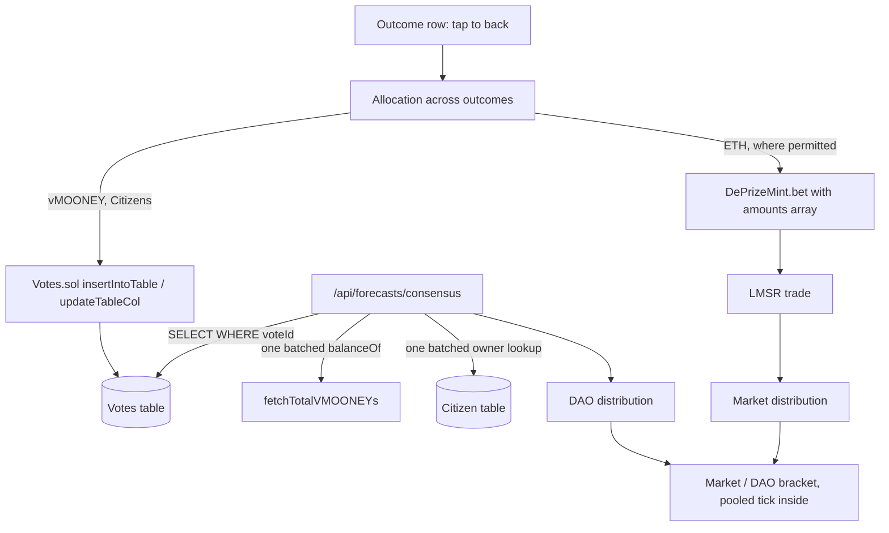

# DePrize: predictions and bets as one gesture

## What changes

Predicting and betting become the same act — **back one or more outcomes** — differing only in what you stake:

- **ETH** if your jurisdiction allows it. Goes through the LMSR, moves the price.
- **vMOONEY** if it does not. Goes into the Tableland vote table, moves the DAO number.
- **Neither**, if you are a Citizen holding no vMOONEY. Recorded and ranked, zero weight. Bragging rights.

Both produce the same object: an allocation across outcomes. Normalized, that allocation is a probability vector, so both sides get a Brier score. For a Kelly bettor the normalized cost split across outcomes *is* the belief distribution, independent of prices, which is what makes reading a portfolio as a forecast legitimate rather than a convenient fiction.

One tap on an outcome row allocates 100 percent to it, which is the common case and matches how betting already feels. Splitting across rows is the optional move that expresses confidence. No sliders, no percentage fields, no distribution to fill in.

This supersedes the mirror design shipped in #1610.



## 1. Storage: reuse Votes.sol

No new contract. [subscription-contracts/src/tables/Votes.sol](subscription-contracts/src/tables/Votes.sol) is deployed on both chains DePrize uses and its schema already fits:

```24:24:subscription-contracts/src/tables/Votes.sol
        "id integer primary key, voteId integer, address text, vote text, unique(address, voteId)";
```

`unique(address, voteId)` gives one prediction per person per prize with overwrite-on-revise. `VOTES_TABLE_NAMES` in [ui/const/config.ts](ui/const/config.ts) is populated for `arbitrum` (`Votes_42161_146`) and `sepolia` (`Votes_11155111_1971`).

`deprizeForecastVoteId(deprizeId)` returns `DEPRIZE_FORECAST_VOTE_ID_BASE + deprizeId` with the base at 1000. Ids 0 through 3 are taken (`WBA_VOTE_ID`, `BAIKONUR_VOTE_ID`, `OVERVIEW_DELEGATION_VOTE_ID`, `OVERVIEW_PATH_VOTE_ID`) and the table is shared across features.

Payload:

```json
{"v":1,"a":{"0":60,"2":40},"vp":1234.5}
```

- `v` schema version, currently 1. Unknown versions are refused rather than guessed.
- `a` allocation: outcome index to integer percent, summing to exactly 100. Absent outcomes are a deliberate zero.
- `vp` raw vMOONEY at write time, used **only** as the RPC-failure fallback, exactly as `storedAmount` is for Fly with Frank.

## 2. Weighting

`votingWeight(vmooney) = Math.sqrt(vmooney)`, matching the governance precedent in [ui/lib/proposals/computeMemberVoteOutcome.ts](ui/lib/proposals/computeMemberVoteOutcome.ts). Balances are summed across Arbitrum, Ethereum, Base and Polygon by `fetchTotalVMOONEYs` **before** the root is taken, since `sqrt(a) + sqrt(b) > sqrt(a + b)` would otherwise pay people to split holdings. `capWeights` bounds any single voter at `FORECAST_MAX_WEIGHT_SHARE` (0.15).

Weight is recomputed live on every read, not snapshotted at write time. Cost is flat in the number of voters: one batched Engine multicall per chain regardless of how many people voted.

## 3. Aggregation and scoring

`DAO_i = Σ_u (w_u × alloc_u,i) / Σ_u w_u`. With one-hot allocations this reduces exactly to the backing-share formula `aggregateDelegations` already computes for Frank, so a single function serves both the simple and split cases. Report per-outcome backer counts alongside the distribution, and gate reveal on `FORECAST_DAO_MIN_PARTICIPANTS`.

Scoring is `brierScore(normalizedAllocation, resolvedVector)` ranked by `brierSkillScore` against the uniform baseline. Ranking on skill rather than raw Brier matters: it scores a uniform allocation at exactly zero, so spreading evenly to avoid looking wrong earns nothing. `timeAveragedBrier` and the revision history it consumed are deleted.

## 4. Consensus read

New [ui/lib/deprize/fetchForecastConsensus.ts](ui/lib/deprize/fetchForecastConsensus.ts), a near-transcription of [ui/lib/overview-delegate/fetchLeaderboard.ts](ui/lib/overview-delegate/fetchLeaderboard.ts):

1. One Tableland read: `SELECT * FROM ${votesTable} WHERE voteId = ${voteId}`.
2. `parseForecastVotes`, then dedupe voter addresses.
3. One batched `fetchTotalVMOONEYs(addresses, now)`. On failure set the balance map to the `Infinity` sentinel so `Number.isFinite` falls through to each row's stored `vp`.
4. One batched Citizen lookup via `buildCitizenOwnerLookupStatement`; unmatched addresses are dropped, the same `if (!citizen) continue` as `buildLeaderboard`.
5. Weighted aggregate, then sort for the leaderboard.

Served by [ui/pages/api/forecasts/consensus.ts](ui/pages/api/forecasts/consensus.ts) with `setCDNCacheHeaders(res, 60, 60)`. The aggregate is public and not geo-sensitive so it can be cached, even though the prize page itself stays `private, no-store` for the jurisdiction gate — which is why it is fetched client-side rather than inlined into SSR props.

Freeze a snapshot at resolution the way `closed-snapshot.json` freezes the path vote, so the published result does not drift as vMOONEY moves.

## 5. Write path and Citizen gate

Model on [ui/components/mission/OverviewDelegateVote.tsx](ui/components/mission/OverviewDelegateVote.tsx):

1. Pre-submit `SELECT id FROM ${votesTable} WHERE voteId = ${voteId} AND address = '${addr}'` to choose insert vs update. [ui/components/nance/ProjectRewards.tsx](ui/components/nance/ProjectRewards.tsx) documents the footgun: Tableland *silently* rejects an insert that violates the unique constraint, so the transaction succeeds while the row never changes. Query on-chain state with cache-busting rather than trusting local state.
2. `prepareContractCall` then `sendAndConfirmTransaction`, signed by the user.
3. Optimistic local update rather than polling `waitForRow`.

The Citizen gate is enforced at read time, which is where it binds — anyone can write to a public table, only Citizens count. The write UI also gates on `useCitizen` for honesty, with a mint link when the connected wallet holds none. `ERC5643Citizen.sol` enforces one Citizen per address on-chain and makes them non-transferable. The Citizen join also supplies the display name and avatar, which is why the `displayName`, profile and peppered-handle layers disappear.

## 6. Multi-outcome betting — deferred

Deferred to a follow-up. The ETH path stays single-outcome, so `DePrizeMint` and its ABI are
untouched here and only the vMOONEY side takes an allocation across outcomes. The design below
holds; it is the shape the follow-up implements, alongside the allocation UI that would give a
multi-leg entry point something to call.

`DePrizeMint.bet` is single-outcome only at its entry point; the body is already vector-shaped:

```231:233:subscription-contracts/src/deprize/DePrizeMint.sol
        int256[] memory amounts = new int256[](teams.length);
        amounts[outcomeIndex] = int256(outcomeTokenAmount);
        int256 net = market_.calcNetCost(amounts);
```

`_rcvIds` and `_rcvValues` are arrays, the ERC-1155 receiver hooks capture multiple ids, `totalReceived` is already a loop, `_flushOutcomeTokens` flushes everything captured, and the residual sweep and refund are amount-agnostic. The compliance permit is over `(msg.sender, deprizeId, deadline)` and not per outcome, so one permit already covers a multi-leg bet.

Changes needed: `bet()` takes `uint256[] calldata outcomeTokenAmounts`, the `totalReceived` check compares against the sum, and `Bet` is emitted once per non-zero leg so `activity-fetch.ts`, `activity-math.ts` and the position and P&L panels keep working untouched. Per-leg cost attribution is inherently approximate because LMSR cost is not separable; allocate the total pro-rata by each leg's standalone `calcNetCost`.

On the client, `buildAmounts` gains a multi-outcome form and `searchMaxQtyWithinCost` generalizes without rewriting: fix the allocation as a direction vector and binary-search a scalar multiplier against the budget, which stays monotonic.

Warn as an ETH allocation flattens toward uniform — backing every outcome in an LMSR costs about 1 and pays exactly 1, so it is a guaranteed loss net of fees.

## 7. Pooling and display

New pure module [ui/lib/forecasts/pool.ts](ui/lib/forecasts/pool.ts):

- `logLinearPool(series, eps)` computes `p_i ∝ Π_k (p_ki)^{w_k}`, normalized, flooring each probability at `eps` first so one zero cannot annihilate an outcome.
- Evidence weights convert incompatible units into a 0..1 confidence: `min(1, collateralEth / MARKET_EVIDENCE_REF_ETH)` for the market and `min(1, totalWeight / DAO_EVIDENCE_REF)` for the DAO, then normalized.

Market evidence is **zero** for demo races. Only 8 of 10 Sepolia goals are bound; the rest take odds from curator priors in [ui/lib/deprize/mockMarket.ts](ui/lib/deprize/mockMarket.ts), which is editorial, not evidence. Use money actually in the market (`poolWei`, `totalStakedEth`), not `funding()` — a well-funded market with no trades still sits at its priors.

On each outcome bar, render Market and DAO as the endpoints of a **bracket** with the pooled tick inside. When they agree the bracket collapses to a single tick; when they diverge the width is the signal, with a headline naming it. Today's ticks are 2px spans with `title` attributes, which do not exist on touch, so render labelled values instead.

`MARKET_EVIDENCE_REF_ETH` and `DAO_EVIDENCE_REF` are guesses until short-horizon prizes resolve. Keep them as named constants in one place.

## 8. Teardown

Delete: [ui/lib/forecasts/store.ts](ui/lib/forecasts/store.ts), [ui/lib/forecasts/identity.ts](ui/lib/forecasts/identity.ts), [ui/lib/forecasts/displayName.ts](ui/lib/forecasts/displayName.ts), [ui/lib/forecasts/tablelandMirror.ts](ui/lib/forecasts/tablelandMirror.ts), [ui/lib/forecasts/schema.ts](ui/lib/forecasts/schema.ts); `ui/pages/api/forecasts/submit.ts`, `mine.ts`, `me.ts`, `crowd.ts`; `subscription-contracts/src/tables/Forecasts.sol` and `script/Forecasts.s.sol`; `FORECASTS_TABLE_ADDRESSES` and `FORECASTS_TABLE_NAMES`; `FORECAST_COOLDOWN_MS`, `FORECAST_MAX_ENTRIES_PER_UTC_DAY`, `FORECAST_CROWD_MIN`, the `FORECAST_ID_PEPPER` env and the forecast dependency on Upstash; `timeAveragedBrier`.

Gas is the rate limit now, so the cooldown and daily cap are redundant.

Keep [ui/cypress/integration/lib/forecasts/isolation.cy.ts](ui/cypress/integration/lib/forecasts/isolation.cy.ts). Its premise changes but its rule still holds: nothing under `pages/api/forecasts/` may pull in eligibility or compliance code. `consensus.ts` keeps the directory non-empty for its `files.length > 0` assertion.

## 9. Acceptance suite

The suite is written first and is red by design. Baseline on the branch is **308 passing, 17 failing**; the work is done when `cd ui && yarn test:deprize` reports 0 failing. Every failure carries a `[not implemented]` message naming the module or export it wants.

- `cypress/integration/lib/forecasts/vote-encoding.mocha.ts` — voteId derivation and the payload contract
- `cypress/integration/lib/forecasts/weighting.mocha.ts` — sqrt, summing before rooting, the share cap, the stored fallback
- `cypress/integration/lib/forecasts/aggregate.mocha.ts` — weighted allocation, Citizen exclusion, backer counts
- `cypress/integration/lib/forecasts/pool.mocha.ts` — log-linear pooling and evidence weights
- `cypress/integration/lib/forecasts/scoring.mocha.ts` — Brier on allocations, skill ranking, uniform scores zero
- `cypress/integration/lib/forecasts/consensus-pipeline.mocha.ts` — the read follows the Frank pipeline
- `cypress/integration/lib/forecasts/teardown.mocha.ts` — deleted modules, routes, constants and contracts stay deleted

Two conventions these specs rely on, both worth preserving when adding more. Each spec opens with `/// <reference types="node" />`, because `tsconfig.json` pins `types` to `cypress` and a spec importing only Node builtins otherwise fails to compile and gets retried as ESM. And modules that do not exist yet are pulled in through a local lazy `loadModule` helper inside `before()` rather than a static import, so a missing file fails one suite instead of aborting the whole run and hiding the other 308 tests.

Note that `brier.cy.ts` imports `timeAveragedBrier` statically, so deleting that function without also updating that spec will break the run. The teardown spec checks for exactly this.

When the multi-outcome `bet()` lands, its amounts-vector spec goes under `cypress/integration/lib/deprize/` and its Foundry test in `subscription-contracts/test/deprize/DePrizeMint.t.sol`, which the mocha runner does not cover. The Solidity suite is also invisible to this branch: `.github/workflows/subscription-contracts.yml` only triggers on pull requests based on `main`, so a stacked PR can break the contract build without a single check failing.

## Open items

- The Votes schema has no timestamp column, so the table cannot prove when a call was made. A single standing allocation rewards predicting as late as possible; a cutoff window before expected resolution is the fix.
- Unbacked outcomes are a probability-zero claim and cost a full point under Brier if one wins. Correct, but the UI should say so when everything sits on one row.
- Sybil is much harder but not impossible: Citizen is one per address and non-transferable, yet someone holding two Citizens on two wallets still gains under a square root by splitting vMOONEY. The share cap bounds it.
- Roster changes on a live prize invalidate stored allocations by index. Dropping mismatched rows is safe but silently shrinks the sample; consider voiding the book on roster change.
- `deleteFromTable(voteId)` lets a user remove their own row, a better erasure story than the Redis epoch it replaces.
- The Votes table is shared infrastructure, so the DePrize voteId range needs to be documented and reserved.
- Bettors express confidence twice, through the split and through how much ETH they commit; vMOONEY voters only through the split, since their total weight is whatever they hold.
