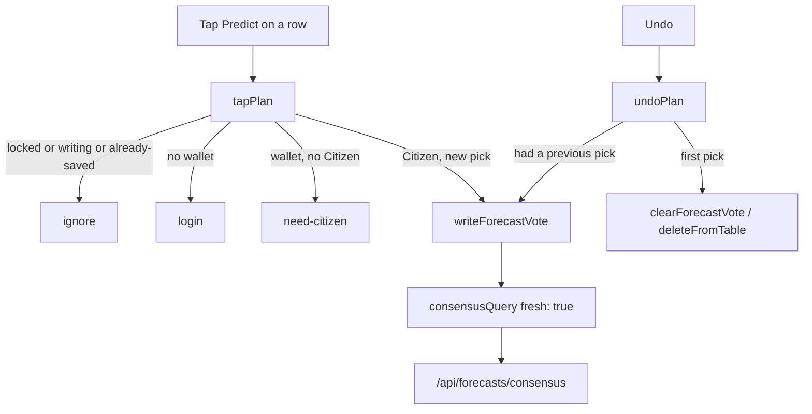

# DePrize: the five forecast UX fixes

The consensus work in #1616 made predicting a Citizen row in `Forecasts.sol` and
put competitors and that prediction on one panel. Five holes are still open.
They are product bugs, not polish. This document is the contract; the mocha
suite under `ui/cypress/integration/lib/forecasts/` is how we know it landed.

The suite is written first and is red by design. Parent branch #1616 is
**358 passing, 0 failing**. This PR's verified red baseline is **358 passing,
13 failing**. Every new failure carries a `[not implemented]` message naming
the module or export it wants. The work is done when
`cd ui && yarn test:deprize` reports 0 failing.



## Why these five

### 1. A tap that looks finished but is not

`ForecastPanel` treats "Predict this" as local state. The row lights up, the
label flips to "Your call", and nothing has been signed. The real write is a
footer "Save prediction" button. People stop at the row. That is a
false-completion trap, not a two-step confirm.

A tap is the write. `tapPlan` decides what that tap means; the component does
not invent a second gesture. Tapping the already-saved row must not re-prompt
the wallet. A tap that arrives while a write is in flight must be ignored, so
we never stack two signatures. Undo is a separate control: restore the previous
pick when there is one, otherwise `deleteFromTable` via `clearForecastVote`.

### 2. A post-save read the CDN answers from cache

`/api/forecasts/consensus` is deliberately cacheable
(`setCDNCacheHeaders(res, 60, 60)`). `ForecastPanel` and `DePrizeCallers` already
build the same query string so they share one CDN entry, which is correct for
the first paint. After a write, the panel calls that same URL again. For up to
a minute the edge returns the pre-write body, and the optimistic row gets
blown away by the voter's old allocation — or by nothing.

One builder, `consensusQuery`. Non-fresh URLs are byte-identical for the same
args. A fresh URL adds a changing `t=` so the edge treats it as a new key.
Only the post-write refetch is fresh. The callers list stays on the shared key.

Do not lower the TTL. The cache is doing its job; the write path was not
telling it to get out of the way.

### 3. Back and Predict on different rows

The ETH button lives on `DePrizeTeamCard`. The prediction chip lives in a
second strip under the card, and the commit lives in a footer. Three places
for one decision: which competitor are you backing.

`rowActions` returns the buttons that belong on the row. When betting is open,
Back is primary and Predict is secondary. When the page is geo-restricted,
Predict is the only action and it is primary. Predict is disabled with a
reason when the prize is locked or the connected wallet is not a Citizen.
Order is stable: Back, then Predict, whenever both exist. "Save prediction"
goes away.

### 4. Jargon in the copy

The panel still says "call", "Brier", and "√vMOONEY". The callers list still
says "Who's called it" and prints a bare "VP". Those words are precise to us
and opaque to everyone else. Scoring stays Brier in the math modules; the UI
does not say the word. Weighting stays `sqrt(vMOONEY)` in `weighting.ts`; the
UI says "voting power".

`FORECAST_COPY` is the lexicon. `ForecastPanel` and `DePrizeCallers` import it.
Banned in every exported string: `call` / `called` / `calling`, `Brier`, `√` /
`sqrt`, and a standalone `VP`.

### 5. An unlabelled bracket that lies about small percents

Each row draws Market and DAO as an anonymous bar and a 1px tick. The values
are in a `title` attribute, which does not exist on touch. `pct()` uses
`Math.round`, so a 4.2% DAO number becomes `4%` and a 0.4% number becomes
`0%`.

`fmtOddsPct` keeps a decimal below 10 percent and returns `—` for non-finite
input. `oddsRowView` labels Market, DAO, and the pooled tick, hides the
bracket until the DAO number is revealed, never reports a zero-width bracket
once it is shown, and only writes a gap caption when the two sides differ by
at least `ODDS_GAP_THRESHOLD` (10 points), naming the direction.

## Module inventory

Specs target these exports. Names and shapes are part of the contract.

### `ui/lib/forecasts/forecastPick.ts`

```ts
export type TapPlan =
  | { action: 'write'; index: number }
  | { action: 'ignore'; reason: 'locked' | 'writing' | 'already-saved' }
  | { action: 'connect' }
  | { action: 'need-citizen' }

export type TapInput = {
  index: number
  savedPick: number | null
  writing: boolean
  connected: boolean
  isCitizen: boolean
  locked: boolean
}

export function tapPlan(input: TapInput): TapPlan
```

Priority, first match wins: `locked` → `writing` → not `connected` → not
`isCitizen` → `savedPick === index` → `write`.

```ts
export type UndoPlan =
  | { action: 'write'; index: number }
  | { action: 'clear' }
  | { action: 'ignore'; reason: 'locked' | 'writing' | 'nothing-to-undo' }

export type UndoInput = {
  savedPick: number | null
  previousPick: number | null
  writing: boolean
  locked: boolean
}

export function undoPlan(input: UndoInput): UndoPlan
export function canUndo(input: {
  savedPick: number | null
  writing: boolean
  locked: boolean
}): boolean
```

`undoPlan` writes `previousPick` when it is a different index than `savedPick`.
Otherwise, if there is a saved pick, it clears. `canUndo` is true only when
there is a saved pick and the book is not locked or writing.

```ts
export function pickLabel(input: { picked: boolean; saved: boolean }): string
export function allocationForPick(picked: number | null, n: number): number[]
export function pickFromAllocation(allocation: readonly number[]): number | null
```

`pickLabel` must never return a string matching `/your call/i`. Move the two
allocation helpers out of `ForecastPanel` so the write path and the UI share
them.

### `ui/lib/deprize/writeForecastVote.ts`

Add `clearForecastVote`. Same client, same `sendAndConfirmTransaction`, method
`deleteFromTable`, params `[BigInt(voteId)]`. `Forecasts.sol` already keys the
delete on `msg.sender`. Do not add a Tableland preflight; a delete of a
missing row is harmless.

### `ui/lib/forecasts/consensusQuery.ts`

```ts
export function consensusQuery(args: {
  chain: string
  deprizeId: number
  outcomes: number
  resolved?: number[] | null
  fresh?: boolean
  now?: number
}): string
```

Returns a path starting `/api/forecasts/consensus?`. Parameter insertion
order is `chain`, `deprizeId`, `outcomes`, then `resolved` only when the
array is present, then `t` only when `fresh` is true. `t` is `String(now ??
Date.now())`. Two non-fresh calls with the same args are `===`. The callers
list must not pass `fresh: true`.

### `ui/lib/forecasts/rowActions.ts`

```ts
export type RowAction = {
  kind: 'bet' | 'predict'
  role: 'primary' | 'secondary'
  enabled: boolean
  reason?: 'locked' | 'need-citizen'
}

export function rowActions(input: {
  restricted: boolean
  bettingOpen: boolean
  locked: boolean
  isCitizen: boolean
  connected: boolean
}): RowAction[]
```

- `bettingOpen && !restricted` → `[bet primary, predict secondary]`.
- otherwise → `[predict primary]` (no bet).
- Predict is disabled with `reason: 'locked'` when `locked`.
- Predict is disabled with `reason: 'need-citizen'` when `connected && !isCitizen`.
- A disconnected wallet keeps Predict enabled so `tapPlan` can return `connect`.
- When Predict is enabled, `reason` is absent.

### `ui/lib/forecasts/forecastCopy.ts`

```ts
export const FORECAST_COPY: {
  panelIntro: string
  restrictedNote: string
  singlePick: string
  daoPending: (min: number, have: number) => string
  callersHeading: string
  callersEmpty: string
  callersCount: (n: number) => string
  votingPower: string
  predictThis: string
  predicted: string
  backedWithEth: string
}
```

`votingPower` is the exact string `voting power`. `singlePick` is a plain
sentence: picking one competitor means the rest are treated as not winning.
`daoPending(3, 1)` must mention both numbers. Walk every string (and every
function result the spec calls) and keep them free of the banned terms.

### `ui/lib/deprize/format.ts`

```ts
export function fmtOddsPct(n: number): string
```

- non-finite → `—`
- `0` → `0%`
- `0 < n < 10` → one decimal, e.g. `4.2%`, `9.4%`
- `n >= 10` → nearest integer, e.g. `42%`, `10%`

### `ui/lib/forecasts/oddsRow.ts`

```ts
export const ODDS_GAP_THRESHOLD = 10

export function oddsRowView(input: {
  marketPct: number
  daoPct: number | null
  pooledPct: number | null
}): {
  marketLabel: string
  daoLabel: string
  pooledLabel: string | null
  showBracket: boolean
  bracketLo: number
  bracketHi: number
  bracketWidth: number
  gapCaption: string | null
}
```

Labels go through `fmtOddsPct`. `daoPct == null` → `showBracket` false,
`daoLabel` `—`, `gapCaption` null, `bracketWidth` 0. Once revealed,
`showBracket` is true and `bracketWidth > 0` even when the two sides agree.
`gapCaption` is null when the absolute gap is below `ODDS_GAP_THRESHOLD`;
at or above it, the caption names the higher side and the gap in points,
with no banned terms.

## Wiring

`ForecastPanel`:

- Import `tapPlan`, `undoPlan`, `canUndo`, `pickLabel`, `allocationForPick`,
  `pickFromAllocation` from `forecastPick`.
- Import `consensusQuery` and stop building `URLSearchParams` for this
  endpoint. Initial load is non-fresh; the refetch after
  `writeForecastVote` / `clearForecastVote` is `{ fresh: true }`.
- Import `rowActions` and render those actions on the competitor row.
  Delete the footer "Save prediction" button and the local `pickOutcome`
  that only flips state.
- Import `FORECAST_COPY`. Delete `Your call`, the Brier sentence, and
  `√vMOONEY`.
- Import `oddsRowView`. Delete local `pct()` and the `Math.max(1, hi - lo)`
  bar math.

`DePrizeCallers`:

- Import `consensusQuery` (non-fresh) and `FORECAST_COPY`.
- Heading, empty state, count, and the voting-power label come from the
  lexicon. No `VP`, no "called".

`DePrizeTeamCard` may keep rendering the ETH button if `rowActions` still
says Back belongs on the row; do not leave Predict on a second strip under
the card.

## Out of scope

- `DePrizeMint.bet` and any Solidity change, including `Forecasts.sol`.
- Multi-outcome allocations. A prediction is still one index at 100.
- Changing the consensus CDN TTL.
- Showing Brier / skill numbers in the panel (the fields stay on the type).
- The fine-print section, the prize-question block, or the index Predict CTA.
- Revival of Redis, the relayer, or `onlyWriter`.

## Acceptance suite

Five new specs, same conventions as the consensus suite: each file opens
with `/// <reference types="node" />`, and modules that do not exist yet
are pulled in through a local lazy `loadModule` so a missing file fails one
suite instead of aborting the mocha run.

| Spec | Module | What it locks |
|---|---|---|
| `forecast-pick.mocha.ts` | `forecastPick.ts`, `clearForecastVote` | tap / undo branches, no re-sign, no double signature, pickLabel |
| `forecast-refetch.mocha.ts` | `consensusQuery.ts` | shared non-fresh URL, fresh `t=`, neither component builds the query |
| `forecast-row-actions.mocha.ts` | `rowActions.ts` | primary/secondary, restricted predict-only, disabled reasons, no Save |
| `forecast-copy.mocha.ts` | `forecastCopy.ts` | banned terms, single-pick sentence, "voting power", import guards |
| `forecast-odds-display.mocha.ts` | `fmtOddsPct`, `oddsRow.ts` | decimals under 10%, bracket pre-reveal, width, gap caption |

## Hand-off prompt

Copy everything below the line to the model that greens this suite.

---

You are implementing the five DePrize forecast UX fixes specified in
`docs/plans/deprize-ux-top5.md`. This PR is a red-by-design hand-off: the
five new mocha specs under `ui/cypress/integration/lib/forecasts/` fail on
purpose. Your job is to add the modules they name, wire the two components,
and make `cd ui && yarn test:deprize` report 0 failing. Do not edit the
specs to silence them.

**Hard constraints**

- Do not touch `subscription-contracts/`, `DePrizeMint`, `Forecasts.sol`,
  or any ABI. `bet()` stays single-outcome.
- Do not revive Redis, the HSM relayer, `onlyWriter`, or the deleted
  forecast write routes.
- Pages Router only. No `app/`. Yarn, not npm or pnpm.
- Internal links stay `next/link`.
- Keep the 358 tests that already pass. Add no new jargon
  (`call` / `called` / `calling`, `Brier`, `√` / `sqrt`, standalone `VP`)
  to `ForecastPanel` or `DePrizeCallers`.
- Surgical edits. The files you should need are listed in the plan's
  Module inventory and Wiring sections. Do not retouch the consensus math
  modules (`weighting.ts`, `aggregate.ts`, `pool.ts`, `brier.ts`,
  `forecastVote.ts`) unless a type forces it.

**Environment**

- Next.js 13 Pages Router, TypeScript strict, Tailwind + daisyUI.
- Writes go through `writeForecastVote` → user-signed
  `sendAndConfirmTransaction` on `Forecasts.sol`.
- Reads go through `/api/forecasts/consensus`, which sets
  `s-maxage=60, stale-while-revalidate=60`. Leave those numbers alone;
  bust with `consensusQuery({ fresh: true })` after a write.
- Citizen gate is `useCitizen`. Disconnected wallets log in via Privy
  `useLogin`. Geo-restriction is `useDePrizeRestricted()`.
- This branch is stacked on PR #1616
  (`cursor/deprize-prediction-acceptance-suite-c8cb`). Do not rebase onto
  `main`.

**Design intent**

A tap on Predict is the commitment, the same way a tap on Back is the
commitment on the ETH side. Lighting the chip up without a signature is
the bug. After the signature lands, refetch with a cache-busting `t=` so
the CDN cannot undo the optimistic row. Back and Predict sit on the same
competitor row, with Predict as the only primary action in restricted
regions. Copy is plain language. Odds are labelled numbers, not a hover
bracket, and percents under 10 keep a decimal.

**Implementation order**

1. Create the five new modules and the two additive exports
   (`fmtOddsPct`, `clearForecastVote`) so the `before()` hooks stop
   throwing `[not implemented] Could not load`.
2. Make the pure assertions pass. The specs are the examples; match the
   return shapes in the plan exactly (`action`, `reason`, `kind`, `role`,
   `showBracket`, `bracketWidth`, …).
3. Wire `ForecastPanel` and `DePrizeCallers`. Source-level guards in the
   specs will stay red until the components import the modules and the
   old strings / `URLSearchParams` / `pct()` / `Save prediction` are gone.
4. Run `cd ui && yarn test:deprize`. Every remaining failure must be
   yours, not a pre-existing spec. If you touch a page file, also run
   `cd ui && NEXT_PUBLIC_THIRDWEB_CLIENT_ID=dummy NEXT_PUBLIC_PRIVY_APP_ID=dummy yarn build`
   and fix any `@next/next/no-html-link-for-pages` errors.

**Done when**

- `yarn test:deprize` is 0 failing.
- Tapping Predict on a live, unlocked, Citizen-connected row calls
  `writeForecastVote` with a one-hot allocation and does not wait for a
  footer button.
- Tapping the already-saved row does not open the wallet.
- A tap during `writing` is ignored.
- Undo of a first pick calls `clearForecastVote`; undo of a later pick
  writes the previous index.
- The refetch after a write contains `t=`. The callers list's URL does not.
- Restricted regions render Predict as the only row action, and it is
  primary.
- Neither component contains `Save prediction`, `Your call`, `Brier`,
  `√`, or a standalone `VP`.

---
