# Executive Branch Proposal Q2 2026 – Q3 2026: Final Report

> **Draft v0.3 — 8 October 2026.** Outcomes are measured as of 7 October 2026. Grades are **provisional** proposals for the Executive Leads, not final. Items marked **⚠ TBC** are awaiting confirmation from the Executive Branch before submission.

**Project:** MDP-249 · Project #131 · Executive Branch (Team #0)
**Term funded:** 1 May – 3 September 2026 (five months)
**Team:** @pmoncada (Pablo), @ryand2d (Ryan), @.moguel. (Miguel)
**EB Safe:** [`arb1:0xdFc31084ad3887076913e5d0759a27C65A3C5291`](https://app.safe.global/home?safe=arb1:0xdFc31084ad3887076913e5d0759a27C65A3C5291)

## At a glance

| Area | Target (MDP-249) | Result at 7 Oct 2026 | Status |
| :--- | :--- | :--- | :--- |
| DePrize core contracts | Live by end of month 2 | Live on Arbitrum 25 Aug (month 4); 5 competitions registered on mainnet, 8 on Sepolia | Delivered late |
| Lunar simulation | Simulator + analog prototype test, results published | Moon Base Zero built in-house and live behind an access gate; no prototype test | Partly delivered |
| Overview Flight | Seat for Frank or DePrize pilot | Community chose to keep fundraising (92.9%); campaign reopened 9 Jul; agreements in place for Frank's flight, not yet announced | Agreed, announcement pending |
| Citizens | 199 → 300 | 265 minted (+33%), 238 active | 65% of growth target |
| Teams | 20 → 30 | 25 (+5) | 50% of growth target |
| Team utilization | ≥ 60% of Teams | 44% posted a job or listing | 73% of target |
| Job / marketplace listings | 15 / 15 new | 7 / 17 new | Jobs missed, marketplace met |
| Discovery calls | ≥ 15 Teams + top two enhancements | ~30 calls with 21 Teams (11 in network, 10 prospective); two enhancements shipped | Met |
| Project system | New system, 100% migrated | Launched, 100% migrated; v9 (MDP-267) followed | Met |
| Realistic Goals 2026–27 | Ratified by month 4 | Delivered as the objectives and key results of the next EB proposal (MDP-271) | Delivered after month 4, via MDP-271 |
| EB election | Run by end of Q3 | Nominations ran 18 Jun – 13 Jul; candidate town hall 10 Sep; Member House vote postponed | Not met |
| Budget | $132,000 core | $131,727 ($119,501 payroll + $12,227 ops/flex); plus $1,000 April balance from the prior cycle | 0.2% under |
| Bonus pool | $24,000 at risk | $0 paid; claims to be decided by the Executive Leads ⚠ TBC | — |

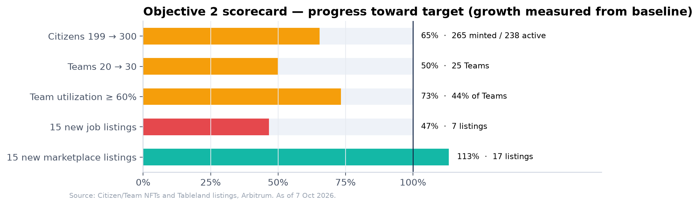

## Original Proposal

**Link to Original Proposal:** [https://www.moondao.com/project/131](https://www.moondao.com/project/131) (MDP-249). Member House vote passed 26 May 2026 with 91% approval from 21 voters; funding covered 1 May – 3 September 2026.

**Original Abstract:** A five-month budget for the Executive Branch is proposed to continue work on scaling the Launchpad to more initiatives and cultivating a strong network of citizens and organizations in service to increasing the DAO's revenue and improving operational efficiency. In addition, the core team is responsible for maintaining core operations including governance, communications, marketing, financial operations, proposal system management, managing billing, treasury management, token liquidity management, website development, sales, community management, outreach, and everything in between. The EB will continue these operations while keeping an eye on reducing costs and dependencies for the DAO and furthering the DAO's mission by providing strategic leadership for the organization and increasing revenue to achieve our goal of full cash-flow sustainability for the DAO by the end of 2027. This cycle the EB will also prioritize deployment of the DePrize framework using the recently completed Frank White raise capital and launch a competitive lunar-focused simulation and prototyping initiative in the second half of the period to directly advance hardware and simulation progress toward the lunar base roadmap.

## Results

1. **Objective: Secure at least one seat for Frank to go to space, either by contracting directly with a provider, or by deploying the DePrize framework using the completed Frank White capital and launch a prize model competitive lunar simulation and prototyping initiative to generate revenue and advance concrete progress toward the lunar base.**

   **Summary:** The technical work under this objective went further than the proposal asked; the revenue side did not. After Phase 1 of the Overview Effect Flight closed on 27 April, the team approached 12 carriers (stratospheric balloon, suborbital and orbital) and took the findings to a formal `$OVERVIEW`-weighted vote (15–22 June). Contributors chose **Option B, "Keep options open, continue fundraising"**, with 92.9% of voting weight, so the Phase 1 capital was not converted into a DePrize seed pool. The campaign reopened on 9 July with a single $250k goal and a live second-seat competition. In parallel, the team built DePrize as general-purpose MoonDAO infrastructure. It was deployed to Arbitrum on 25 August with a live demonstration prize, *The Moon Is A Harsh Mistress*, and four lunar capability races were registered on mainnet on 26 September after rehearsal on Sepolia. Instead of running the lunar simulation as an external challenge, the team built it in-house as **Moon Base Zero** (`/moonbase`): a true-to-scale settlement on the Shackleton connecting ridge in which every competitor in every race stands on its own lot. It is live behind an access gate and has been shown in internal demos to reviewers outside MoonDAO. No analog prototype test was run and no treasury inflow has come from DePrize yet.

   **Learnings:** Letting `$OVERVIEW` holders decide the mission's direction was the right call: it produced a clear mandate (22 of 31 voters, 92.9% of weight) and kept trust in the campaign. The cost was that the DePrize seed capital assumed in the proposal never materialised, so DePrize launched with small treasury-funded seeds (0.012–0.064 ETH per market) instead of a ~$172k pool. Re-engaging a campaign after a two-month pause is hard: the reopened campaign raised 0.64 ETH from 21 contributions, against 26.75 ETH in Phase 1. Building the simulation in-house was faster and more coherent than a challenge would have been. It also turned the simulator into the visual front end for DePrize, so each race can be *seen* rather than read. Deploying from the Phase 2 LMSR factory exposed a bug (H-01, `tradeWithTWAP`), which was fixed and redeployed on 11 September before any capability race went live. Commissioning a security review before mainnet paid for itself.

   **Maintenance:** The DePrize address ledgers ([`DEPRIZE_ARBITRUM_ADDRESSES.md`](https://github.com/Official-MoonDao/MoonDAO/blob/main/docs/DEPRIZE_ARBITRUM_ADDRESSES.md), [`DEPRIZE_SEPOLIA_ADDRESSES.md`](https://github.com/Official-MoonDao/MoonDAO/blob/main/docs/DEPRIZE_SEPOLIA_ADDRESSES.md)) are the source of truth for every contract, market, `questionId` and `conditionId`. Losing a `questionId` blocks resolution, so these must be preserved. Oracle and owner roles are moving from the deployer EOA to the 3-of-4 Executive Safe [`0xE514…6127`](https://app.safe.global/home?safe=arb1:0xE5148e4399e3D849F629E0FECEcf6fC986e96127). The Sepolia Touchdown v2 rehearsal (id 7) has already run on that Safe; `acceptOwnership()` on the registry is still pending. Moon Base Zero has a model-building handoff ([`MOONBASE_MODEL_HANDOFF.md`](https://github.com/Official-MoonDao/MoonDAO/blob/main/ui/docs/MOONBASE_MODEL_HANDOFF.md)) and an access-gate runbook ([`ACCESS_GATE.md`](https://github.com/Official-MoonDao/MoonDAO/blob/main/ui/docs/ACCESS_GATE.md)).

   **Results:**

   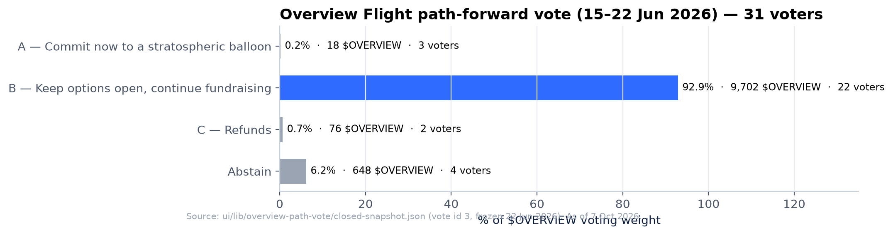

   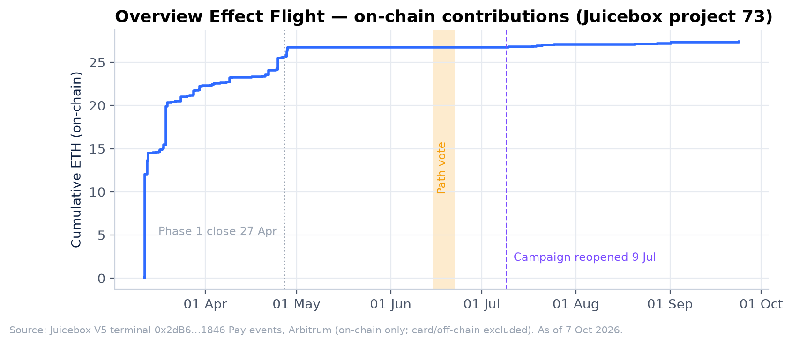

   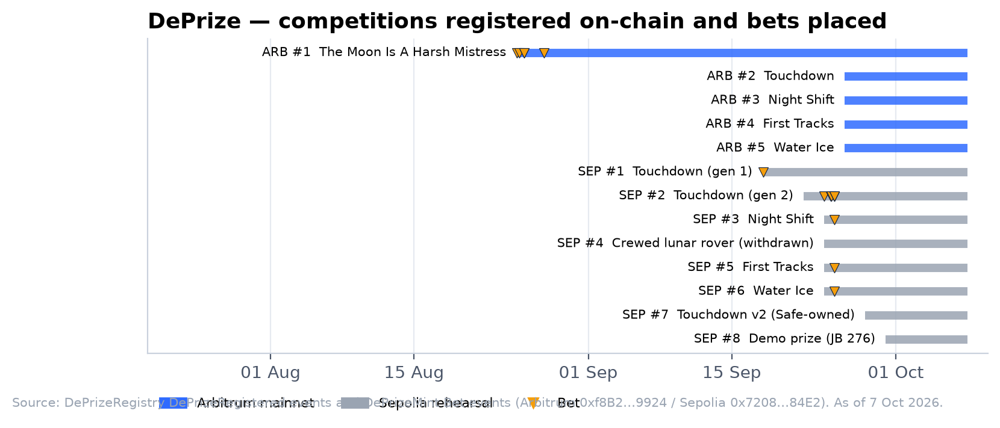

   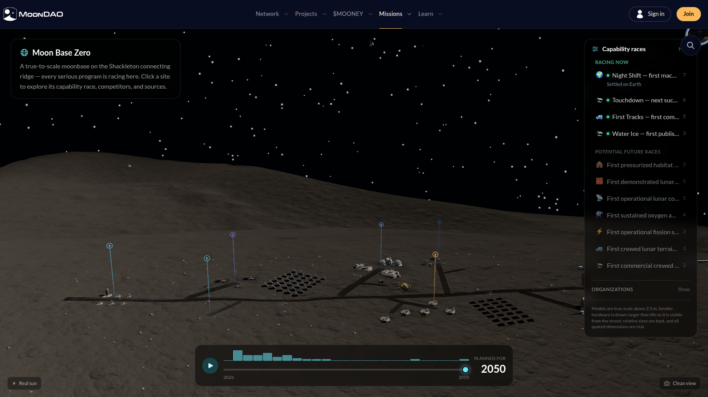

   *Moon Base Zero (`/moonbase`): the base on the Shackleton connecting ridge, with the four live capability races listed on the right. Captured 8 October 2026.*

   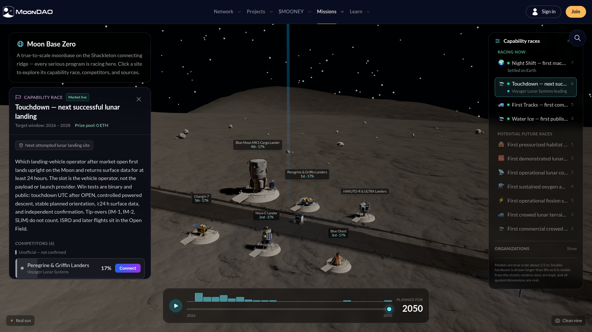

   *The Touchdown race selected: rules, the six competitors at their landing sites, and live DePrize odds.*

   1. **Key Result:** Deploy core DePrize smart contracts, voting/allocation mechanics, and arbitration process by end of month 2.
      **Results:** Delivered about eight weeks late. The DePrize 0.8 stack (`DePrizeRegistry`, `DePrizeMint`, `DePrizeRedeem`, `DePrizeFeeRouter`, a registry-aware `MissionCreator` and a DePrize-only `MissionTable`) went live on Arbitrum with DePrize #1 registered and opened on **25 August 2026**. The market layer reuses MoonDAO's Gnosis Conditional Tokens and `LMSRWithTWAP` stack with a 1% fee. Resolution (winner declared by the Senate, payouts reported by the Safe), redemption, cancellation/refund and the 30/70 milestone disbursement runbook are all implemented: milestones M1–M5 in [`DEPRIZE.md`](https://github.com/Official-MoonDao/MoonDAO/blob/main/docs/DEPRIZE.md). The full lifecycle (register → open → bet → declare winner → redeem) was run end to end on Sepolia on 18 September: winner team 601 declared, plus one on-chain redemption. The stack has 173 Foundry tests across 4,535 lines of test code, a security audit ([`DEPRIZE_SECURITY_AUDIT.md`](https://github.com/Official-MoonDao/MoonDAO/blob/main/docs/DEPRIZE_SECURITY_AUDIT.md)), and jurisdictional controls with a point-of-bet Terms acceptance flow (PRs #1572, #1573).
   2. **Key Result:** Launch the first lunar-component competitive challenge (open-source Lunar Base Operations Simulator + at least one validated analog prototype test) via Launchpad by month 4–5, with clear milestones and treasury inflow from platform activity.
      **Results:** Partly delivered. Four capability races are registered on Arbitrum (ids 2–5, 26 September): **Touchdown** (next upright working lunar landing, 6 slots), **Night Shift** (first machine to work through a lunar night, 8 slots), **First Tracks** (commercial rover egress and drive, 6 slots) and **Water Ice** (first in-situ surface water ice, 4 slots). Each has its own Juicebox mission (JB 83–86) and an H-01-fixed LMSR market seeded at 0.012–0.064 ETH. Mainnet betting on the races is not yet public; it is live on Sepolia (ids 2–7). The simulator was built in-house instead of as a challenge (see 1.3). No analog prototype test was run. Mainnet treasury inflow from DePrize to date is nil: 5 bets, 0.0127 ETH of volume, and 0.00068 ETH routed to the prize slice. All of it came from internal test wallets.
   3. **Key Result:** Achieve measurable progress on the defined lunar objective (simulator live and prototype test results published on-chain) with documented fund allocation and outcomes by end of the five-month period.
      **Results:** The simulator is live; prototype results are not. **Moon Base Zero** (`/moonbase`, first shipped 23 July) models **50 projects from 33 organizations across 12 shared capability goals**. It renders a true-to-scale base on the Shackleton connecting ridge with live sun position, terrain-derived street plan, a 63-array solar farm, orbital relay satellites and per-competitor hardware models. It reads DePrize odds live, so each race doubles as a betting surface. About 33,400 lines of code across 21 components, with 336 unit tests. It is access-gated and has been shown in internal demos to external reviewers; a public launch is pending ⚠ TBC. A live demonstration is planned for the final report presentation. Screenshots are shown above the key results.
   4. **Key Result:** Produce and ratify a reusable DePrize playbook based on the pilot so future challenges can be stood up rapidly.
      **Results:** Delivered; ratification was not pursued. The playbook is a set of repo docs:
      - [Capability ladder](https://github.com/Official-MoonDao/MoonDAO/blob/main/docs/DEPRIZE_CAPABILITY_LADDER.md): rung order and rationale.
      - [Touchdown prize rules v0.2](https://github.com/Official-MoonDao/MoonDAO/blob/main/docs/DEPRIZE_TOUCHDOWN.md): definitions, resolution, a uniform confirmation standard and a nine-step supersede procedure.
      - [Payload purse](https://github.com/Official-MoonDao/MoonDAO/blob/main/docs/DEPRIZE_PAYLOAD_PURSE.md): the purse is a community payload purchase, with a fallback waterfall.
      - [Go-to-market plan](https://github.com/Official-MoonDao/MoonDAO/blob/main/docs/DEPRIZE_GTM_TOUCHDOWN.md), [jurisdictional controls](https://github.com/Official-MoonDao/MoonDAO/blob/main/docs/DEPRIZE_JURISDICTIONAL_CONTROLS.md), the [QA run](https://github.com/Official-MoonDao/MoonDAO/blob/main/docs/DEPRIZE_QA.md), and provisioning scripts (`ui/scripts/provision-arbitrum-races.cjs`).

      Following this playbook, four races went from rehearsal to mainnet registration within eight days (18–26 September).

   5. **Key Result (Overview Flight, from the objective text):** Secure at least one seat for Frank.
      **Results:** Agreed, not yet announced. Agreements are in place for Frank's flight; the public announcement is pending. The announcement at the 9 July reopening says enough has been raised for a stratospheric balloon seat for Frank and the campaign is close to funding a second seat. The path vote (vote id 3, 31 voters, 10,444 `$OVERVIEW`) mandated continued fundraising over an immediate single balloon seat (A: 0.2%) or refunds (C: 0.7%). On-chain to date: **27.39 ETH from 180 contributions** (26.75 ETH from 159 before reopening; 0.64 ETH from 21 contributions by 16 wallets since).

   **Grade (provisional, Exec Leads to confirm):** Meets Expectations. The infrastructure delivered (mainnet DePrize, four registered races, an operational simulator) goes beyond the original scope. The revenue and prototype elements, and the timing of KR 1.1, were missed.

2. **Objective: Grow the Space Acceleration Network from current baselines while driving higher utilization of jobs listings, marketplace, and discovery services.**

   **Summary:** The network grew at its fastest rate on record, but short of targets set for a period that was supposed to include a mid-cycle raise. Citizens went from **199 to 265 minted (+33%)**, adding 66 Citizens in five months versus 35 in the preceding five; 238 are active today. Teams grew from **20 to 25**: Habitat Marte, A Heart for Space, the U.S. Space & Rocket Center Education Foundation, Geração de Marte Institute and Zephalto. Marketplace activity beat its target with 17 new listings, but job listings (7) and overall team utilization (44% against 60%) fell short. The EB held about 30 discovery calls with 21 Teams between late May and September, a little over two a week, and shipped the two enhancements Teams asked for most: richer, shareable listings and card and bank payment onramps for marketplace purchases.

   **Learnings:** Growth tracked activity. The steepest Citizen growth came during the Overview Flight campaign and the July–September town halls with astronaut guests, and Team growth came from real partners (Habitat Marte's analog missions, the USSRC's Space Camp with Frank, Zephalto). Without a live mid-cycle raise the main acquisition engine was missing, and the 300-Citizen target assumed one. The marketplace now works as a channel for real space experiences (analog missions, zero-g flights, training, MDRS seats). Job posting remains concentrated in a few Teams, so the job board needs seeding and nudging, not just availability. Discovery calls showed that payments were the biggest barrier to marketplace use: buyers struggled with crypto and with international payments. Calls with prospective Teams have a long conversion cycle. None of the 10 has joined yet, though Lonestar has tentatively agreed and Stardust is whitelisted. Measuring "active" Citizens matters: 27 of 265 have lapsed, so renewal prompts (PR #1690) and expiry-gated features (#1569 era) are now in place. On-chain subscription revenue per new Citizen is low because many joined through discounted invites, card checkout or the free-mint donation path. This is worth reviewing for pricing (see Financial position).

   **Maintenance:** Network metrics in this report are reproducible from public on-chain data with `docs/reports/eb-mdp-249/scripts/fetch_data.py`. Citizen and Team counts come from the NFT contracts (mints and `expiresAt`), and listings from the Tableland job board and marketplace tables. Citizenship renewal now surfaces on the dashboard before expiry, and lapsed Citizens lose gated features automatically.

   **Results:**

   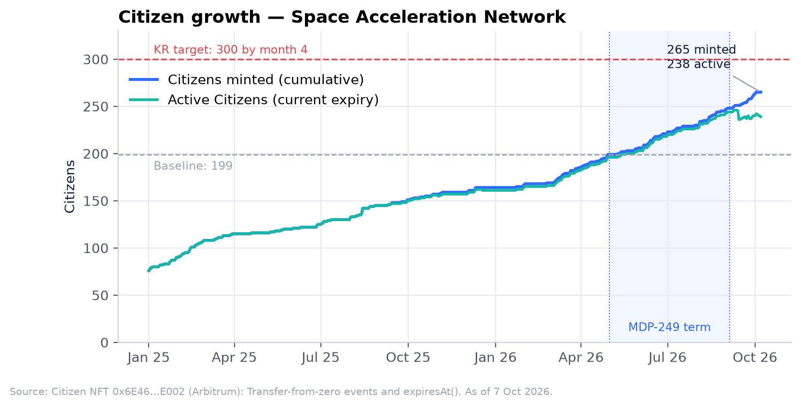

   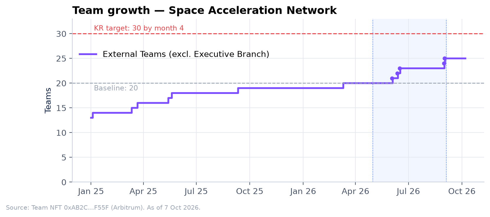

   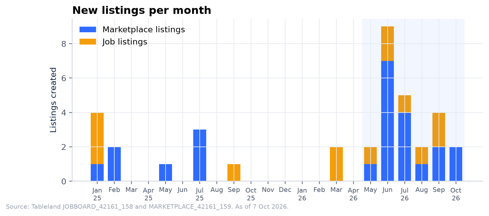

   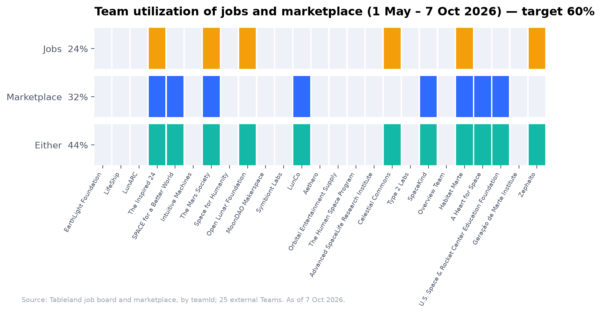

   1. **Key Result:** Increase Citizen count from 199 to at least 300 by end of month 4.
      **Results:** Not met. 247 Citizens at month 4 (1 September); **265 minted / 238 active at 7 October**. That is +66 minted (+33%) against a +101 target, or 65% of the growth target.
   2. **Key Result:** Increase active Teams from 20 to at least 30 by end of month 4.
      **Results:** Not met. 24 Teams at month 4; **25 at 7 October, all active** (+5, 50% of the growth target).
   3. **Key Result:** Achieve at least 60% Team utilization of jobs and marketplace services, producing a minimum of 15 new active job listings and 15 new marketplace listings.
      **Results:** Partly met. **11 of 25 Teams (44%)** used at least one service in the period: 6 posted jobs (24%), 8 listed in the marketplace (32%), and 3 did both. New listings: **17 marketplace (met)** and **7 jobs (not met; one posted by the EB)**. Six job listings are open today.
   4. **Key Result:** Complete structured 1:1 discovery calls with at least 15 Teams and ship the top two highest-impact service enhancements.
      **Results:** Met. The EB held **about 30 discovery calls with 21 Teams** between late May and September, a little over two calls a week.
      - **Existing network Teams (11):** LifeShip, LunARC, The Inspired 24, Mars Society, The Human Space Program, Celestial Commons, SpaceKind, Habitat Marte, Space Camp USA, Generation Mars Brazil and Zephalto. Several had follow-up calls, including The Inspired 24, Space Camp and Generation Mars.
      - **Prospective Teams (10):** Off Earth, IIAS, Higher Orbits, Paraguay Space Agency, Beyond Earth Institute, Fundación Cydonia, Foresight Institute, Space Biostasis Coalition, Lonestar and Stardust. None has joined yet; Lonestar has tentatively agreed and Stardust is whitelisted.

      The 15-Team target is met counting prospective Teams (21). Counting only Teams already in the network, it is 11.

      **Top two enhancements shipped:**

      1. **Richer, shareable listings.** Job and marketplace listings now show full descriptions instead of truncated text, and each listing has its own deep link that can be shared (#1387, #1516, #1545, #1546). Team pages are now visible to non-Citizens, so those links work for anyone. This came from Teams wanting to post more detailed roles and volunteer positions; The Inspired 24, Habitat Marte and LunCO raised it.
      2. **Payment onramping for marketplace purchases.** Teams said their buyers struggled with crypto and international payments: Habitat Marte named international payments as its top blocker, and LunARC named technical hurdles with crypto. A card and bank onramp now lets buyers fund a wallet and buy listings directly from the purchase flow without already holding crypto (#1391, #1458, #1503). The onboarding flow was reworked so it no longer steers people toward one provider (#1513).

      Other service improvements this term included EU/EEA team registration (#1494), MoonDAO stewards as co-signers on new team Safes, marketplace purchase receipts and vendor sale emails (#1688), gift citizenships through the marketplace, and live Discord announcements on the dashboard (#1507).

   **Grade (provisional, Exec Leads to confirm):** Does Not Meet Expectations. Growth was strong in absolute terms and the discovery-call KR was met, but the three network targets (Citizens, Teams, utilization) were missed.

3. **Objective: Manage executive functions and budget for the DAO to operate securely and efficiently while reducing costs, exploring a for-profit arm, and locking in realistic goals with project-system discipline, also running an election cycle for the executive branch.**

   **Summary:** Core operations ran without interruption across two full project cycles (Q2 retro / Q3 intake and Q3 cohort / Q4 intake). The new project system launched with 100% of active initiatives migrated, and was then refined into Project System v9 (MDP-267). MDP-249 spending came in at $131,727, 0.2% under the $132k core envelope. The operational audit produced a compiled financial disclosure and burn report (14 August) and an executive financial dashboard with live on-chain revenue and runway. However, operating costs rose because of heavier AI tooling, and no cost reductions were made. A GDPR review opened Europe to browsing, restricting only Citizen creation. A for-profit arm plan and business case were drafted but held back for strategic reasons. The Realistic Goals sequencing was delivered as the objectives and key results of the next EB proposal (MDP-271). The Executive Lead election, which covers Pablo's re-election and the third seat, opened on 18 June and held its candidate town hall on 10 September. The Member House vote was postponed after a candidate had a child.

   **Learnings:** A continuously updated dashboard turned out to be more useful than a monthly PDF, but it is internal; the community-facing side needs a regular published extract. AI-assisted development roughly doubled engineering throughput (359 merged PRs) but moved cost from salaries to tooling, so cost targets should be set on total cost per shipped outcome, not on subscription line items. Elections need contingency for personal circumstances; a postponement mechanism in the Constitution would avoid ad-hoc handling. That is one of three candidates for the "Constitution update" in bonus milestone 4, none of which was proposed this term. The other two: the Constitution header still reads "Version 1.3, last updated 12 March 2024" although the July 2025 amendments (MDP-179/180: Primus Inter Pares, term limits, regular and special elections, a "none" option, a maximum of three Executive Leads) are in its text; and the Constitution ends a Senator's term at the end of the quarter they were appointed, while the Project System says six months. Moving payroll from monthly USDC transfers to LlamaPay vesting streams cut payroll transactions from roughly 12 to 2 for the term, but exposed payroll to ETH price movement after funding.

   **Maintenance:** Approved cost lines live in `ui/const/executiveFinance.ts`; roll them forward when MDP-271 passes. The dashboard is at `/admin/financial-overview` (operators only) and its data at `/api/eb/financial-summary`. The project cycle is advanced with the one-click phase control (PR #1481) and the runbooks `ui/docs/PROJECT_CYCLE_OPERATOR_RUNBOOK.md`, `Q3_2026_CYCLE_CLOSE_CHECKLIST.md` and `Q4_2026_CYCLE_OPEN_CHECKLIST.md`.

   **Results:**

   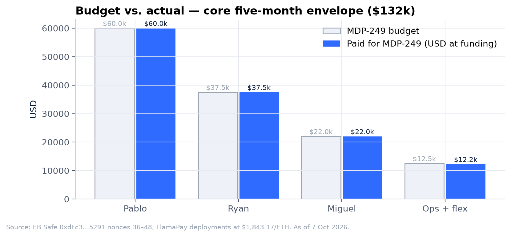

   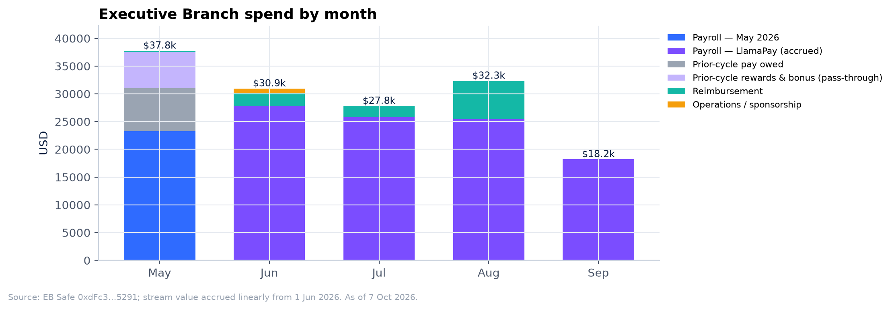

   1. **Key Result:** Implement the new project system and migrate all active initiatives by month 3, achieving 100% coverage.
      **Results:** Met. 100% of active initiatives were migrated. The cycle was then hardened with frozen per-cycle voting power (#1303), a public tally audit page (#1285, #1286), one-click phase advance with a `PROJECT_CYCLE` config (#1481) and v9 pot and Q4 intake (#1591, MDP-267). Throughput this term: the Q3 cohort approved 5 projects (MDP-258, 259, 260, 262, 265); Q2 retro rewards paid $7,970 USDC to 7 projects and 19 Citizens, plus 7.32M vMOONEY to 25+ contributors.
   2. **Key Result:** Deliver the for-profit arm proposal (structure, revenue models, lunar-track capital path, governance integration) ready for discussion by end of Q3.
      **Results:** Partly met. The plan and business case are drafted, including an option for the DAO to hold equity in the new venture. They have not been presented to the DAO, for strategic reasons.
   3. **Key Result:** Complete operational audit and implement changes delivering measurable cost reduction starting month 4.
      **Results:** Partly met. The audit was completed and published as the [Q3 2026 Financial Disclosure and Burn Report](https://github.com/Official-MoonDao/MoonDAO/blob/main/docs/FINANCIAL_DISCLOSURE_AND_BURN_REPORT_2026-08-14.md) (14 August), alongside an executive financial dashboard (#1520). No cost reduction was made; AI-tooling costs went up. Operations and flex spend was $12,227 against a $12,500 budget.
   4. **Key Result:** Produce and ratify the Realistic Goals 2026–2027 document sequencing major deliverables, resource envelopes, and success metrics by month 4.
      **Results:** Delivered as the next proposal rather than a standalone document. The sequencing of major deliverables, resource envelopes and success metrics for Q4 2026 – Q1 2027 was published as the objectives and key results of [MDP-271, Executive Branch Proposal Q4 2026 – Q1 2027](https://www.moondao.com/project/153). It came after the month-4 deadline, and it is ratified through that proposal's vote rather than separately.
   5. **Key Result:** Maintain core operations and budget within the approved five-month envelope with monthly public burn reporting.
      **Results:** Budget met; reporting changed. $131,727 was spent against the $132,000 core budget (−0.2%; see Table B). Prior-cycle items paid from the same Safe are listed separately. Reporting moved from monthly reports to a continuously updated internal dashboard, plus one public disclosure.
   6. **Key Result:** Run an election cycle for the executive branch by the end of Q3.
      **Results:** Not met. The 2026 Executive Lead election opened on 18 June and nominations closed on 13 July. It was to decide Pablo's re-election (his first term ended on 1 August) at the same time as a special election for the third seat, which has two candidates. The candidate town hall was held on 10 September, but the Member House vote was postponed after a candidate had a child. No vote has been held yet, so Pablo's re-election is still pending.
   7. **Key Result:** Expand in Europe by adapting GDPR compliant practices.
      **Results:** Met in product. EU/EEA/UK visitors can browse while on-chain profile creation is restricted (#1382), and Team registration is open to EU/EEA visitors (#1494). The cookie consent banner is region-aware (#1362, #1699), and the geoblock fails open on geolocation errors (#1536). DePrize has a Privacy Notice and eligibility gate (#1572, #1573). The [GDPR deep-dive](https://docs.google.com/document/d/1pbO0rcFsGxr_255z6598SL92sXPQ9HjvP7JI5D-U-5w/edit?usp=sharing) concluded that Europe could be opened to browsing, with only Citizen creation restricted.
   8. **Key Result:** Engage luminaries in the space industry to support MoonDAO as a strategic advisory board and put together a plan for how they may help guide the organization.
      **Results:** Partly met. An informal group of advisors gave feedback on the simulation and the prize design, including Phil Metzger and Ian Long (Anthrofuturism). The group has not been formalised or published.

   **Grade (provisional, Exec Leads to confirm):** Meets Expectations. This is borderline. Operations, budget, the project system, GDPR and the Realistic Goals sequencing (through MDP-271) were delivered. The election, cost reduction and the public for-profit proposal were not.

## Performance Bonus Milestones

MDP-249 set a $24,000 at-risk pool, "paid only upon verified achievement… No bonuses are paid if milestones are missed", split equally across the three core members. **No bonus has been paid.** The table lists every separately claimable item with the drafter's provisional reading; the Executive Leads decide which to claim ⚠ TBC.

| # | Claimable item | Amount | Evidence | Provisional reading |
| :- | :- | -: | :- | :- |
| 1 | DePrize core contracts, voting/allocation and arbitration live with the Frank pilot pool or a Lunar Simulation prize, **by end of month 3** (31 Jul) | $6,000 | Mainnet 25 Aug with DePrize #1; four lunar capability races registered 26 Sep | Delivered about 4 weeks after the deadline. A claim would need a waiver |
| 2 | Lunar challenge formally launched on Launchpad with rules and milestones, **and** first meaningful capital raised by end of cycle | $8,000 | Rules, milestones and markets live; Moon Base Zero built; no capital raised (0.0127 ETH test volume) | Launch met; raise not met |
| 3a | ≥ 300 Citizens | $2,000 | 265 minted, 238 active | Not met |
| 3b | ≥ 30 Teams | $2,000 | 25 | Not met |
| 3c | ≥ 60% utilization, with ≥ 15 new job and ≥ 15 new marketplace listings | $2,000 | 44%; 7 jobs, 17 marketplace | Not met |
| 4a | Subscription costs below $1,000 a month | $1,000 | AI-tooling costs rose | Not met |
| 4b | Project system update fully live with 100% migration | $1,000 | 100% migrated; v9 followed (MDP-267) | **Met** |
| 4c | Constitution update live | $1,000 | No amendment this term; the last amendments (MDP-179/180, July 2025) predate MDP-249 | Not met |
| 4d | Executive Branch election completed | $1,000 | Vote postponed | Not met |
| 4e | For-profit proposal delivered | $1,000 | Drafted, held back for strategic reasons | Not met |

Milestone 4 lists five items at $1,000 each but is capped at $4,000, so at most four can be paid. On this reading, $1,000 (item 4b) is clearly claimable. Items 1 and 2 are judgment calls for the Executive Leads and the Senate: up to $14,000, depending on whether the late delivery and the "launch" half of item 2 count.

## Member Contributions

*Draft paragraphs based on merged pull requests, on-chain activity and announcements. Each member should edit their own.*

**@pmoncada (Pablo):** Executive Lead. Set priorities and ran daily triage, and led the strategic decisions this term: taking the Overview Flight carrier findings to a formal holder vote, then reopening the campaign. Designed and shipped DePrize end to end: architecture, the M1–M5 contracts and the Safe runbooks, the security review and H-01 fix, mainnet deployment on 25 August, registration of the four capability races, and the full prize-rules, purse and go-to-market playbook (58 merged PRs on DePrize alone). Led the project system work: the frozen voting-power tally audit, the one-click cycle-phase advance, and the MDP-267 v9 implementation and Q4 intake. Ran the operational audit: compiled the Q3 financial disclosure and burn report and built the executive financial dashboard. Also handled pricing changes (Citizen and Team prices, a MOONEY stake on citizenship, 20%/50% invite discounts) and the DePrize Terms, Privacy Notice and eligibility gate. Presented at town halls, and spoke on the "Deep Space and the Lunar Economy" panel at Rio Innovation Week (2nd Space Industry Workshop Brazil, moderated for the Brazilian Space Agency). 160 merged PRs.

**@ryand2d (Ryan):** Communications, community and partnerships. Ran the announcement and newsletter cadence and the weekly town halls, booking an exceptional run of guests: Jeanette Epps, Sharon Hagle, Alan Stern, Loretta Whitesides, and the book launch of Dr. Eiman Jahangir, MoonDAO's second astronaut. Ran the Overview Flight path vote outreach (31 voters) and the 9 July relaunch across X, Instagram and LinkedIn. Coordinated the Q2 and Q3 project cycles (deadlines, pitch day, member votes, retro distributions) and the Executive Lead election and special-election town hall. Represented MoonDAO on the ground at the Space Industry Workshop in Brazil. Ran the discovery program: about 30 calls with 21 Teams (11 in the network and 10 prospective, including Lonestar, which has tentatively agreed, and Stardust, now whitelisted), and turned the findings into the two shipped service enhancements. Shipped conversion work on the site: a redesigned `/join` sales page, an on-chain Citizen counter, an onramp prompt on subscription renewal and a lower free-mint threshold (9 merged PRs). ⚠ Ryan to add partnership and outreach detail.

**@.moguel. (Miguel):** Lead frontend and product engineer. Built Moon Base Zero, MoonDAO's lunar base simulator: terrain, sun model, district street plan, the solar farm, orbital relays and the per-competitor hardware models (Blue Moon MK1, Chang'e-7, ULTRA, ispace and others), wired to live DePrize odds (31 moonbase PRs). Owned Citizen and Team lifecycle UX: renewal prompts, expiry gating, AI portrait reliability, and the dashboard overhaul with live Discord announcements. Implemented the GDPR work (EU/EEA/UK browse-only access, EU team registration, region-aware cookie consent, fail-open geoblock). Hardened the proposal importer and mission funding flows (Apple Pay and MoonPay onramp, Citizen-gated contributions). Added steward co-signers to Team Safes and fixed Safe signing UX, collapsed the navbar from 9 groups to 5, and cut Vercel build times from about 16 minutes to 6–8 minutes. 172 merged PRs, the most of anyone this term.

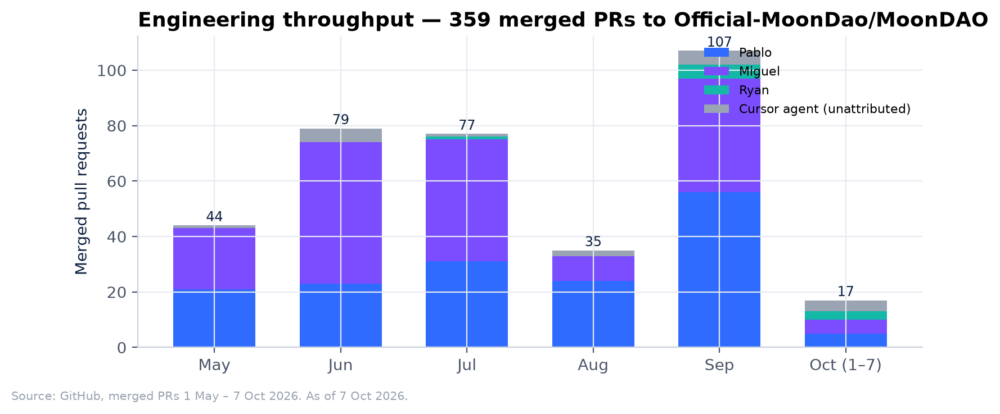

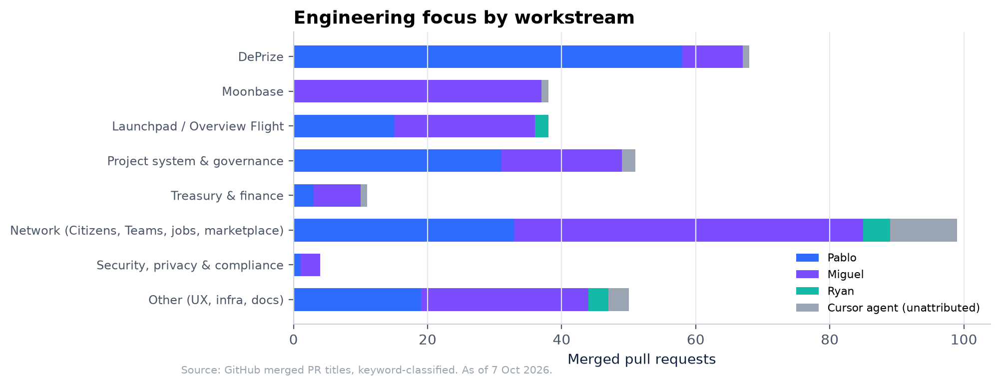

## Reward Distribution (Table A)

Upfront payments are reconstructed from the EB Safe. LlamaPay vesting streams are valued at the ETH price implied at funding ($1,843.17/ETH), which matches the approved monthly rates exactly. MDP-249 had no vMOONEY component, unlike MDP-194 (10M vMOONEY per full-time member), so none was received this term. The May USDC amounts include each member's unpaid April balance from the previous cycle ($514.29 / $371.43 / $114.29).

| Member Name | % of total rewards | Upfront Payment Received | Wallet to receive ETH |
| :---------- | :----------------- | :----------------------- | :-------------------- |
| *@pmoncada* |  | 12,514.29 USDC (May) + 26.0423 WETH LlamaPay stream, 1 Jun – 29 Sep (≈ $48,000) | 0x679d87D8640e66778c3419D164998E720D7495f6 |
| *@ryand2d* |  | 7,871.43 USDC (May) + 16.2764 WETH LlamaPay stream, 1 Jun – 29 Sep (≈ $30,000) | 0x78176eAAbCB3255E898079dC67428e15149cdc99 (hardware wallet; Citizen wallet is 0xB2d3…0D42) |
| *@.moguel.* |  | 2,864.29 USDC (May) + 8.9520 WETH stream, 1 Jun – 30 Aug (≈ $16,500) + 1.4920 WETH stream, 1 Jun – 1 Jul (≈ $2,750) | 0xaf6f2a7643a97b849bd9cf6d3f57e142c5bbb0da |

## Treasury Transparency (Table B)

*Link to Treasury with **unused funds returned to the [MoonDAO Treasury](https://app.safe.global/home?safe=eth:0xce4a1E86a5c47CD677338f53DA22A91d85cab2c9).***

*EB Safe: [arb1:0xdFc31084ad3887076913e5d0759a27C65A3C5291](https://app.safe.global/home?safe=arb1:0xdFc31084ad3887076913e5d0759a27C65A3C5291)*

**Funding received for MDP-249:** 26,400 USDC (28 May, from the Arbitrum treasury: one month of the core budget), plus 52.7627 ETH and 9,990 USDC (18 June: four months of payroll, and operations and flex). That is ≈ $133,640 at the funding price. Separately, 3.5603 ETH arrived from the Arbitrum treasury on 7 and 14 May and was passed straight through to the team in nonces 38–39. Those were prior-cycle payments (Q1 2026 retroactive rewards and the EB treasury performance bonus for Q3 2025 – Q1 2026), not MDP-249 funding.

**Balance at 7 October 2026:** 1,112.25 USDC, 0.0121 WETH, 100 MOONEY, 11,966.24 OVERVIEW, 181.00 NANA. The remaining USDC may be used for reimbursements that are still due. The OVERVIEW comes from the EB Safe's own 11.966 ETH contribution to the Overview Flight (Juicebox project 73) on 11 March 2026, before this term, and is not MDP-249 funding.

| Txn Title | Date | Reason | Amount | Recipient | Etherscan Link or Gnosis Link |
| :-------- | :--- | :----- | :----- | :-------- | :---------------------------- |
| Nonce 36 | 2026-05-06 | Reimbursement: two months of GitHub Copilot, plus Citizen whitelist testing | 192.36 USDC | Miguel | [Safe](https://app.safe.global/transactions/tx?safe=arb1:0xdFc31084ad3887076913e5d0759a27C65A3C5291&id=multisig_0xdFc31084ad3887076913e5d0759a27C65A3C5291_0xf8d57ef1e9b2ca3560118fbaa88be522e9a867f60993382bfc66b29cf4af13d1) · [Arbiscan](https://arbiscan.io/tx/0x4b13f65b3113b1f691d86b947bb65594205916014873346106ece2f9f66d3882) |
| Nonce 37 | 2026-05-06 | Prior-cycle team pay owed from the budget shortfall, paid before MDP-249 funding arrived (not MDP-249 spend) | 3,985.71 USDC<br>885.71 USDC<br>2,878.57 USDC | Pablo<br>Miguel<br>Ryan | [Safe](https://app.safe.global/transactions/tx?safe=arb1:0xdFc31084ad3887076913e5d0759a27C65A3C5291&id=multisig_0xdFc31084ad3887076913e5d0759a27C65A3C5291_0x0a95e9c4cf2311935a5c0661ba9290a39e820d603e95cdb691eb651bc5329d93) · [Arbiscan](https://arbiscan.io/tx/0x27f4e056dcbbbb374ea097920d840d09f8b5e9ce5600990a659c06639affb2ea) |
| Nonce 38 | 2026-05-13 | Q1 2026 retroactive project rewards (prior cycle; passed through from the treasury's 7 May transfer) | 0.4650 ETH<br>0.4650 ETH<br>0.1641 ETH | Pablo<br>Ryan<br>Miguel | [Safe](https://app.safe.global/transactions/tx?safe=arb1:0xdFc31084ad3887076913e5d0759a27C65A3C5291&id=multisig_0xdFc31084ad3887076913e5d0759a27C65A3C5291_0x3b36221635ea4ee70d858c5d58de410633dfb7bfd8986764d2524426df660b68) · [Arbiscan](https://arbiscan.io/tx/0x10f8141850863513a192c5eddfd9b664870d84c30886c9e105d93d905c754fc2) |
| Nonce 39 | 2026-05-16 | EB treasury performance bonus for Q3 2025, Q4 2025 and Q1 2026, split in the Q1 retro percentages (prior cycle; passed through from the treasury's 14 May transfer) | 1.0481 ETH<br>1.0481 ETH<br>0.3699 ETH | Pablo<br>Ryan<br>Miguel | [Safe](https://app.safe.global/transactions/tx?safe=arb1:0xdFc31084ad3887076913e5d0759a27C65A3C5291&id=multisig_0xdFc31084ad3887076913e5d0759a27C65A3C5291_0x07d078085fc1900b1489e6142b735c286f4358886c8cd875c2f7b428e7805dc8) · [Arbiscan](https://arbiscan.io/tx/0x673c3b9cf8bd6f80dfb92f3341b114ee61cc46415690aa5e201ca6d7f623c3f7) |
| Nonce 40 | 2026-05-29 | MDP-249 May payroll, plus the unpaid April balance ($514.29 / $371.43 / $114.29) | 12,514.29 USDC<br>7,871.43 USDC<br>2,864.29 USDC | Pablo<br>Ryan<br>Miguel | [Safe](https://app.safe.global/transactions/tx?safe=arb1:0xdFc31084ad3887076913e5d0759a27C65A3C5291&id=multisig_0xdFc31084ad3887076913e5d0759a27C65A3C5291_0xd1601c26677b9693453486f8753d8e21ce5b61142559c2aa9397201b2db60781) · [Arbiscan](https://arbiscan.io/tx/0x6259f08bce59ec63d455c139cb0246804f75627304fd870991991cd1257b2d60) |
| Nonce 41 | 2026-06-18 | Wrap ETH → WETH to fund the LlamaPay payroll streams (a wrap, not a swap) | 52.7748 ETH → WETH | EB Safe | [Safe](https://app.safe.global/transactions/tx?safe=arb1:0xdFc31084ad3887076913e5d0759a27C65A3C5291&id=multisig_0xdFc31084ad3887076913e5d0759a27C65A3C5291_0x82f1af091fe4f2ac2016dbf7455bfef7ba8ba01ddfece9151d457d93ebb66824) · [Arbiscan](https://arbiscan.io/tx/0x3ec743297312a5ebfef9b1506368949ef5ad47d338c6758d555cc9e213d359a8) |
| Nonce 42 | 2026-06-19 | Deploy four LlamaPay vesting streams for June–September payroll, all starting 1 Jun | 52.7627 WETH (26.0423 / 16.2764 / 8.9520 / 1.4920) | Pablo, Ryan, Miguel ×2 | [Safe](https://app.safe.global/transactions/tx?safe=arb1:0xdFc31084ad3887076913e5d0759a27C65A3C5291&id=multisig_0xdFc31084ad3887076913e5d0759a27C65A3C5291_0x22595b6fc9cca7a230059963011b2a0bb57a2cb33c1ff85d9767567546d270f2) · [Arbiscan](https://arbiscan.io/tx/0x66e42ddfc39a67973d2316770926ee6dc2817acf1052e8b33c0de530d2d87a28) |
| Nonce 43 | 2026-06-23 | Anthrofuturism video sponsorship, "Making Solar Cells From Lunar Regolith": 27,200 views at $30 per 1,000 | 816.00 USDC | Ian Long (Anthrofuturism), 0xb2AC…B721 | [Safe](https://app.safe.global/transactions/tx?safe=arb1:0xdFc31084ad3887076913e5d0759a27C65A3C5291&id=multisig_0xdFc31084ad3887076913e5d0759a27C65A3C5291_0x607b3488276558edca6225203c7f9222ae8665df22c1a0622e1643ee07da26f5) · [Arbiscan](https://arbiscan.io/tx/0x956a205244ce82ea77567a9093e5270dd9b37d546bbf9cbea541f643920dbde2) |
| Nonce 44 | 2026-06-23 | Reimbursement: card charges on 22 May, 3 Jun and 18 Jun, less a $101.06 charge made on the wrong card, plus $104 Google Workspace | 1,397.77 USDC | Pablo | [Safe](https://app.safe.global/transactions/tx?safe=arb1:0xdFc31084ad3887076913e5d0759a27C65A3C5291&id=multisig_0xdFc31084ad3887076913e5d0759a27C65A3C5291_0xa5dab6cb77de0c6991a34ac8cb6966c5cfbe0bab93236dd77b811c5a7c3548c7) · [Arbiscan](https://arbiscan.io/tx/0x956a205244ce82ea77567a9093e5270dd9b37d546bbf9cbea541f643920dbde2) |
| Nonce 45 | 2026-06-23 | Reimbursement: April credit card subscriptions | 985.23 USDC | Pablo | [Safe](https://app.safe.global/transactions/tx?safe=arb1:0xdFc31084ad3887076913e5d0759a27C65A3C5291&id=multisig_0xdFc31084ad3887076913e5d0759a27C65A3C5291_0x8484496c0bdd5cec70468db8114a01fdaa95a1231b9bcf2419d1b31eaea5070b) · [Arbiscan](https://arbiscan.io/tx/0x956a205244ce82ea77567a9093e5270dd9b37d546bbf9cbea541f643920dbde2) |
| Nonce 46 | 2026-07-23 | Reimbursement: Miguel's flight to Rio, paid to his exchange deposit address | 1,970.00 USDC | Miguel (exchange deposit 0xBdB6…D88c) | [Safe](https://app.safe.global/transactions/tx?safe=arb1:0xdFc31084ad3887076913e5d0759a27C65A3C5291&id=multisig_0xdFc31084ad3887076913e5d0759a27C65A3C5291_0xe0ab2b636e63d38b067d733c9f049874611d4d66a13cbee3add014f1093bd273) · [Arbiscan](https://arbiscan.io/tx/0xda618aafdef22b7d1cfc937d178ce8e2569b2a83ad71ba1592fa444ba541be16) |
| Nonce 47 | 2026-08-17 | Rio conference expenses | 3,147.71 USDC<br>912.44 USDC | Ryan<br>Miguel | [Safe](https://app.safe.global/transactions/tx?safe=arb1:0xdFc31084ad3887076913e5d0759a27C65A3C5291&id=multisig_0xdFc31084ad3887076913e5d0759a27C65A3C5291_0xe618e86540e7685e6b54ba764a56c4aac6b21b54da5950a11f1825921696f71e) · [Arbiscan](https://arbiscan.io/tx/0xc5ef20f7ebee922514b09279bcec8a75a786f4c66223ae7f537c57ed3df18270) |
| Nonce 48 | 2026-08-29 | Pablo's Rio expenses; Miguel's SF round-trip flight; Miguel's Cursor usage | 1,362.10 USDC<br>584.18 USDC<br>858.83 USDC | Pablo<br>Miguel<br>Miguel | [Safe](https://app.safe.global/transactions/tx?safe=arb1:0xdFc31084ad3887076913e5d0759a27C65A3C5291&id=multisig_0xdFc31084ad3887076913e5d0759a27C65A3C5291_0xa648eb0b395ce57fff2982bcf4927a47cb72f5b722fd1d70b5b11cac0cb41a34) · [Arbiscan](https://arbiscan.io/tx/0xbee223f2398e0576a9050c4bdcd3b1f938b11697a213e6bfa2db0b340e5f2884) |

**LlamaPay vesting streams (nonce 42).** All four streams start on 1 June 2026 at 05:00 UTC and are denominated in WETH.

| Payee | WETH | Duration | End | USD at funding | USD / 30 days |
| :- | -: | :- | :- | -: | -: |
| Pablo | 26.0423 | 120 days | 29 Sep 2026 | $48,000 | $12,000 |
| Ryan | 16.2764 | 120 days | 29 Sep 2026 | $30,000 | $7,500 |
| Miguel (full-time) | 8.9520 | 90 days | 30 Aug 2026 | $16,500 | $5,500 |
| Miguel (half-time) | 1.4920 | 30 days | 1 Jul 2026 | $2,750 | $2,750 |

**Budget reconciliation.**

| Line | Budget | Paid | Variance |
| :- | -: | -: | -: |
| Pablo | $60,000 | $60,000.31 | +$0.31 |
| Ryan | $37,500 | $37,500.19 | +$0.19 |
| Miguel | $22,000 | $22,000.13 | +$0.13 |
| Operations + flexible | $12,500 | $12,226.62 | −$273.38 |
| **Core total (MDP-249)** | **$132,000** | **$131,727.25** | **−$272.75 (−0.2%)** |
| Performance bonus pool (at risk) | $24,000 | $0 | — |
| *Prior-cycle items paid from the EB Safe (outside the MDP-249 budget)* | | | |
| April pay balance, included in nonce 40 | — | $1,000.01 | Prior cycle |
| Prior-cycle pay owed from the budget shortfall (nonce 37) | — | $7,749.99 | Prior cycle |
| Q1 2026 retro rewards and EB treasury bonus, passed through (nonces 38–39) | — | 3.5603 ETH | Funded separately by the treasury |

MDP-249 payroll is the May rate from nonce 40 ($12,000 / $7,500 / $2,750) plus the streams at the funding price; the cents of variance are stream rounding. Nonce 40 also settled each member's unpaid April balance ($514.29 / $371.43 / $114.29), which belongs to the previous cycle. Operations and flex covered software and subscriptions (GitHub Copilot, Cursor, Google Workspace and card subscriptions, including April's in nonce 45), the Anthrofuturism video sponsorship, travel to Rio Innovation Week and the Space Industry Workshop Brazil ($7,392.25 in flights and conference expenses across nonces 46–48), and Miguel's San Francisco round trip ($584.18).

**Security note: address poisoning.** The EB Safe received four dust USDC transfers from lookalike addresses that mimic legitimate payees: `0x679D8E4D…95F6` (Pablo), `0x781754…Dc99` (Ryan's hardware wallet), and `0xBdB6E389…188c` / `0xbDB6baa4…D88C` (Miguel's exchange deposit address, used in nonce 46). Every outgoing payment went to the correct address. Signers should keep copying payee addresses from a verified address book, never from transaction history.

## Financial position and revenue

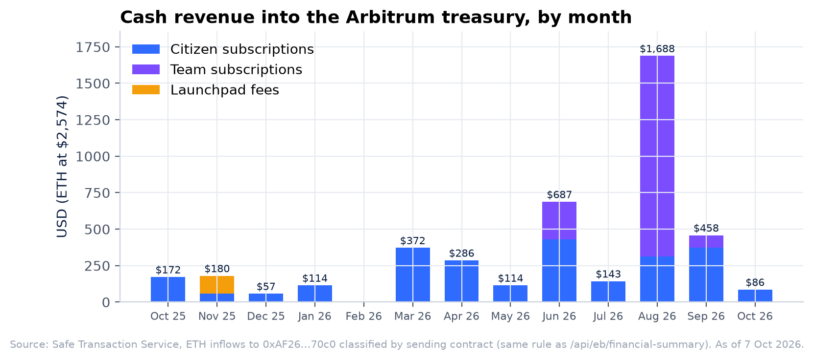

Revenue was reconstructed with the same rule as `/api/eb/financial-summary`: ETH reaching the Arbitrum treasury [`0xAF26…70c0`](https://app.safe.global/home?safe=arb1:0xAF26a002d716508b7e375f1f620338442F5470c0), classified by sending contract and valued at spot ($2,574.50 per ETH on 7 October 2026).

| Stream | Trailing 365 days | Term (1 May – 3 Sep) | 1 May – 7 Oct |
| :- | -: | -: | -: |
| Citizen subscriptions | 0.9546 ETH | 0.3885 ETH | 0.5661 ETH |
| Team subscriptions | 0.6675 ETH | 0.6675 ETH | 0.6675 ETH |
| Launchpad fees | 0.0476 ETH | 0 | 0 |
| DePrize fees | 0 | 0 | 0 |
| **Total** | **1.6697 ETH ≈ $4,299** | **1.0560 ETH ≈ $2,719** | **1.2336 ETH ≈ $3,176** |

Measured cash revenue covers about 1% of gross annual burn. This figure leaves out accrued Uniswap LP fees, which the dashboard counts separately as non-cash. MDP-249 cited roughly $24,500 a year. The difference is mostly that the stated figure includes revenue streams that do not reach the Arbitrum treasury as ETH: card and fiat checkouts, and LP fees. ⚠ **Dashboard reconciliation pending:** the dashboard is restricted to operators, so its live figures still need to be compared against the numbers above (see open questions). Net assets at the last compiled statement (14 August) were $524,822 recognized, giving about ten months of unrestricted runway at constant burn ([burn report](https://github.com/Official-MoonDao/MoonDAO/blob/main/docs/FINANCIAL_DISCLOSURE_AND_BURN_REPORT_2026-08-14.md)).

## Appendix A — Methodology and reproducibility

Every number in this report can be regenerated from public data:

```bash
pip install matplotlib pycryptodome
python3 docs/reports/eb-mdp-249/scripts/fetch_data.py   # writes data/snapshot.json
python3 docs/reports/eb-mdp-249/scripts/build_charts.py # writes data/metrics.json and charts/
```

| Data | Source |
| :- | :- |
| Citizens | Citizen NFT `0x6E464F19e0fEF3DB0f3eF9FD3DA91A297DbFE002`: `Transfer` events from the zero address (mint time) and `expiresAt(id)` (active = expiry after the measurement date). Historical "active" uses the current expiry, so renewals after a date can slightly overstate active counts at that date. |
| Teams | Team NFT `0xAB2C354eC32880C143e87418f80ACc06334Ff55F`; Team #0 (Executive Branch) excluded |
| Jobs / marketplace | Tableland `JOBBOARD_42161_158`, `MARKETPLACE_42161_159`; utilization = external Teams with at least one listing created 1 May – 7 Oct |
| DePrize | `DePrizeRegistry` and `DePrizeMint` events on Arbitrum and Sepolia (addresses in the DePrize ledgers), via Etherscan V2 |
| Overview Flight | Juicebox V5 terminal `0x2dB6d704058E552DeFE415753465df8dF0361846` `Pay` events for project 73. On-chain only: 86 distinct paying wallets, while the mission page reports 103 backers because it also counts beneficiaries and cross-chain contributions. |
| Path vote | `ui/lib/overview-path-vote/closed-snapshot.json` (vote id 3, frozen 22 June 2026) |
| EB Safe | Safe Transaction Service (Arbitrum): executed multisig transactions, incoming transfers and balances |
| Revenue | Safe Transaction Service incoming ETH transfers to the Arbitrum treasury, classified by sender as in `ui/lib/treasury/programRevenue.ts` |
| Engineering | GitHub merged PRs 1 May – 7 Oct 2026; workstreams classified by PR-title keywords |
| Governance timeline | MoonDAO Discord `#announcements` via `moondao.com/api/discord/messages` |

## Appendix B — Address register

| Role | Address |
| :- | :- |
| EB Safe (Team #0) | `0xdFc31084ad3887076913e5d0759a27C65A3C5291` (Arbitrum) |
| Executive Safe (3 of 4: Pablo, Ryan, Miguel, Eiman) | `0xE5148e4399e3D849F629E0FECEcf6fC986e96127` |
| Arbitrum treasury | `0xAF26a002d716508b7e375f1f620338442F5470c0` |
| Constitutional treasury (Ethereum) | `0xce4a1E86a5c47CD677338f53DA22A91d85cab2c9` |
| LlamaPay vesting factory (nonce 42) | `0x62E13BE78af77C86D38a027ae432F67d9EcD4c10` |
| DePrizeRegistry / Mint / Redeem / FeeRouter (Arbitrum) | `0xf8B2244634c6eCeF32de10BFe0D7436413A59924` / `0xfa36cAb21415B4e23a1eecCFe7B07693A690d838` / `0xb0E06ed72cf6E0CcF21b4D00B002fdfDc198C3fA` / `0x0EF00977e37e2e106BB6E9fa15952bB43a2761e1` |
| Overview Flight (Juicebox project 73) / `$OVERVIEW` | Mission 4 · `0xc868dFc4Ad388F5d7A8A5c3ECa0cff226d77152a` |
